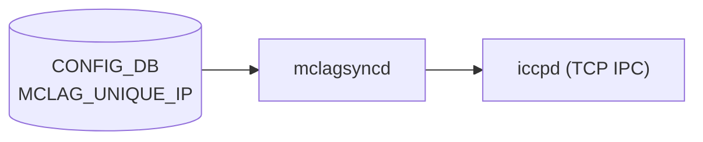

# MCLAG_UNIQUE_IP テーブル

## 概要

MC-[LAG](../../reference/glossary.md#term-lag) (Multi-Chassis Link Aggregation) ピア間で [VLAN](../../reference/glossary.md#term-vlan) インターフェースに**異なる IP アドレス**を持たせる対象 VLAN を [CONFIG_DB](../../reference/glossary.md#term-config_db) に保持するテーブル[^1]。

デフォルトでは MCLAG ピア ToR は同一 VLAN IF に同じ IP を共有する。`MCLAG_UNIQUE_IP` にエントリを登録することで、指定 VLAN IF に対してそれぞれ異なる IP アドレスを設定することを許可する。`mclagsyncd` (`docker-iccpd` 内) がこのテーブルを購読し、iccpd へ通知する。

<!-- cdb-mermaid -->
### データフロー (自動生成)



!!! note "凡例"
    CONFIG_DB から mclagsyncd への購読経路。mclagsyncd は MCLAG_DOMAIN の初回 SET 後に MCLAG_UNIQUE_IP の購読を開始し、iccpd へ TCP IPC で通知する。
<!-- /cdb-mermaid -->

## key 構造

```text
MCLAG_UNIQUE_IP|<if_name>
```

- `if_name`: unique-ip を有効化する VLAN インターフェース名（`Vlan<id>` パターン必須）

## フィールド

| フィールド | 型 | デフォルト | 説明 |
|-----------|----|-----------|------|
| `if_name` (key) | string パターン `Vlan<id>` | — | unique-ip を許可する VLAN インターフェース名 |
| `unique_ip` | enum `enable` | (エントリ不在 = 無効) | unique-ip 有効化フラグ。無効化時はエントリ削除で表現する |

YANG コメントによれば、`if_name` は本来 `VLAN.name` への leafref にしたいが libyang back-links の制約で plain string パターン (`Vlan([0-9]{1,3}|[1-3][0-9]{3}|[4][0][0-8][0-9]|[4][0][9][0-4])`) になっている（`sonic-mclag.yang:144-152`）。

## 購読者

- `mclagsyncd` — `addDomainCfgDependentSelectables()` により MCLAG_DOMAIN 初回 SET 後に購読開始。`mclagsyncdSendMclagUniqueIpCfg()` で iccpd へ TCP IPC 送信する

## 関連 CONFIG_DB / YANG / CLI

- 関連 [CONFIG_DB](../../reference/glossary.md#term-config_db): `MCLAG_DOMAIN`、`MCLAG_INTERFACE`、`VLAN`、`VLAN_INTERFACE`
- 関連 [YANG](../../reference/glossary.md#term-yang): `sonic-mclag`
- 関連 CLI: `config mclag unique-ip add/del`

<!-- ref-triangle:start -->

## 関連リファレンス

- [YANG](../../reference/glossary.md#term-yang): [`sonic-mclag`](../yang/sonic-mclag.md)
- CLI: [`config mclag`](../cli/config-mclag.md)
- 親ページ: [MCLAG_DOMAIN / MCLAG_INTERFACE / MCLAG_UNIQUE_IP](mclag-domain.md)

<!-- ref-triangle:end -->

## 引用元

[^1]: YANG 定義: `sonic-mclag.yang`. <https://github.com/sonic-net/sonic-buildimage/blob/9ea932ec2e18f35e58268ec2e4456b1d4afd65cd/src/sonic-yang-models/yang-models/sonic-mclag.yang>

## 関連ページ

- [CONFIG_DB: MCLAG_DOMAIN / MCLAG_INTERFACE / MCLAG_UNIQUE_IP](mclag-domain.md)
- [CONFIG_DB: MCLAG_INTERFACE](mclag-interface.md)
- [CONFIG_DB: VLAN](vlan.md)

<!-- ops-hint -->
## 運用ヒント

### 典型値

- key 形式: `MCLAG_UNIQUE_IP|Vlan100`
- `unique_ip`: `"enable"` のみ有効値。無効化はエントリ削除（`config mclag unique-ip del Vlan100`）。

### よくある誤設定

- MCLAG_DOMAIN が存在しない状態で書くと YANG `must` 制約違反。先に MCLAG_DOMAIN を設定する。
- VRF バインドまたは IP アドレスが設定済みの VLAN IF に対して CLI `config mclag unique-ip add` を実行すると拒否される。先に IP/VRF を削除してから設定する。
- VLAN IF が `Vlan` プレフィックスを持たない場合は YANG パターン制約違反。

### 確認コマンド

```bash
sonic-db-cli CONFIG_DB hgetall 'MCLAG_UNIQUE_IP|Vlan100'
show mclag unique-ip
```
<!-- /ops-hint -->

<!-- ordering -->
## 書込み順序依存 (Phase B)

<!-- evidence: sonic-swss/mclagsyncd/mclaglink.cpp L903-950 / sonic-buildimage/src/sonic-yang-models/yang-models/sonic-mclag.yang L132-152 / sonic-utilities/config/mclag.py L327-378 -->

### 設定順序（追加）

1. **VLAN インターフェースに IP アドレス・VRF バインドがない状態にする**
   - CLI `config mclag unique-ip add` は対象 VLAN IF に IP アドレスまたは非デフォルト VRF バインドが存在する場合に `ctx.fail()` で中断する。
   - IP/VRF を先に削除してから MCLAG_UNIQUE_IP を設定し、その後に IP/VRF を再設定する順序が必要。
   - YANG 側の back-link 制約は現在コメントアウトされているため `sonic-db-cli` 直接書込みでは回避できるが非推奨。
   - evidence: `config/mclag.py:337-347`

2. **MCLAG_DOMAIN を設定してから MCLAG_UNIQUE_IP を書く**
   - `MCLAG_UNIQUE_IP_LIST` には `must "count(../../MCLAG_DOMAIN/MCLAG_DOMAIN_LIST/domain_id) != 0"` が課されており、MCLAG_DOMAIN が 0 件の状態ではエントリ書込み拒否。
   - CLI `config mclag unique-ip add` も `MCLAG_DOMAIN` テーブルキー存在を事前チェックし、0 件の場合は `"MCLAG not configured."` で中断する。
   - evidence: `sonic-mclag.yang:132-134`, `config/mclag.py:328-330`

3. **MCLAG_DOMAIN の初回 ADD が完了してから MCLAG_UNIQUE_IP を書く（mclagsyncd タイミング）**
   - `mclagsyncd` は MCLAG_DOMAIN の初回 SET 成功後に初めて `MCLAG_UNIQUE_IP` テーブルの `SubscriberStateTable` を生成・Select に追加する (`addDomainCfgDependentSelectables()`)。
   - MCLAG_DOMAIN SET 完了前に MCLAG_UNIQUE_IP を書いても mclagsyncd は購読しておらず、iccpd への通知が届かない。
   - evidence: `mclaglink.cpp:903-907`, `mclaglink.cpp:910-921`

4. **VLAN インターフェース名は `Vlan<id>` パターンを厳守する**
   - YANG `leaf if_name` の type パターン `Vlan([0-9]{1,3}|[1-3][0-9]{3}|...)` に違反するとバリデーション拒否。
   - CLI も `interface_name.startswith("Vlan")` チェックを行う。
   - evidence: `sonic-mclag.yang:150-152`, `config/mclag.py:335-336`

### 削除順序

| ステップ | 操作 | 理由 |
|---------|------|------|
| 1 | VLAN IF の IP/VRF を削除 (任意) | DEL 時も CLI が VRF/IP 存在チェックを行う |
| 2 | `MCLAG_UNIQUE_IP` を DEL | `config mclag unique-ip del <if_name>` |
| 3 | `MCLAG_DOMAIN` を DEL | mclagsyncd が購読停止する前に MCLAG_UNIQUE_IP を整理 |

> CLI `config mclag del <domain_id>` は `MCLAG_INTERFACE` を自動削除するが `MCLAG_UNIQUE_IP` は自動削除しない。`MCLAG_UNIQUE_IP` は別途 `config mclag unique-ip del` で削除する必要がある。

### 順序依存サマリ

| # | 依存関係 | 強制度 | 緩和策 |
|---|----------|--------|--------|
| 1 | VLAN IF に IP/VRF なし → MCLAG_UNIQUE_IP ADD | CLI チェック必須 | IP/VRF を先に削除してから設定 |
| 2 | MCLAG_DOMAIN 存在 → MCLAG_UNIQUE_IP SET | YANG must 制約 + CLI チェック必須 | MCLAG_DOMAIN を先に書く |
| 3 | MCLAG_DOMAIN 初回 ADD 完了 → mclagsyncd が MCLAG_UNIQUE_IP 購読開始 | mclagsyncd 内部タイミング | MCLAG_DOMAIN SET 完了後に書く |
| 4 | `Vlan<id>` パターン → if_name | YANG バリデーション必須 | VLAN IF 名の命名規則を厳守 |
| 5 | MCLAG_UNIQUE_IP DEL → MCLAG_DOMAIN DEL | 推奨（iccpd 通知保証） | 手動で先に DEL、CLI del は自動化なし |

> 中間調査ノート: `meta/_intermediate/cdb-flow/mclag-unique-ip-ordering.md`
<!-- /ordering -->

<!-- cross-refs -->
## 暗黙参照テーブル (Phase C)

<!-- evidence: sonic-buildimage/src/sonic-yang-models/yang-models/sonic-mclag.yang L132-152 / sonic-utilities/config/mclag.py L328-373 / sonic-swss/mclagsyncd/mclaglink.cpp L910-935 -->

### MCLAG_UNIQUE_IP → 参照先

| 参照元フィールド | 参照先テーブル | 参照種別 | evidence |
|---|---|---|---|
| `MCLAG_UNIQUE_IP_LIST`（テーブル全体） | CONFIG_DB `MCLAG_DOMAIN` | YANG `must` 制約（DOMAIN 0 件なら書込み拒否） | `sonic-mclag.yang:132-134` |
| `MCLAG_UNIQUE_IP.if_name` | CONFIG_DB `VLAN` | YANG leafref 意図あり・libyang 制約でコメントアウト。現在は string パターンのみ | `sonic-mclag.yang:146-152` |
| `MCLAG_UNIQUE_IP.if_name` | CONFIG_DB `VLAN_INTERFACE` | CLI が全テーブルスキャンし IP/VRF 存在を事前チェック。直接 DB 書込みでは回避可能 | `config/mclag.py:338-347`, `config/mclag.py:365-373` |

### 参照先 → MCLAG_UNIQUE_IP（逆方向）

MCLAG_UNIQUE_IP を逆参照するテーブルは YANG モデル上存在しない。

### STATE_DB 暗黙接続

`mclagsyncd` が MCLAG_DOMAIN 初回 SET 後に `MCLAG_UNIQUE_IP` の購読と同時に STATE_DB `VLAN_MEMBER_TABLE` も購読開始する。これはスキーマ制約ではなくデーモン内部の実装上の関連。

| 参照先 | 種別 | 用途 | evidence |
|---|---|---|---|
| STATE_DB `VLAN_MEMBER_TABLE` | SubscriberStateTable（READ） | mclagsyncd が VLAN メンバーシップを監視し iccpd へ FDB 情報を提供 | `mclaglink.cpp:915-934` |

> `if_name` の `VLAN` leafref はコメントアウト中（`sonic-mclag.yang:146-152`）。libyang back-links 問題が解消されれば `VLAN_LIST.name` への参照が有効化される見込み。

> 中間調査ノート: `meta/_intermediate/cdb-flow/mclag-unique-ip-cross-refs.md`
<!-- /cross-refs -->

<!-- failure -->
## 失敗挙動 (Phase D)

<!-- evidence: sonic-swss/mclagsyncd/mclaglink.cpp L1087-1180 / sonic-swss/mclagsyncd/mclaglink.h L94-99 / sonic-swss/mclagsyncd/mclag.h L62 / sonic-utilities/config/mclag.py L327-378 -->

### mclagsyncdSendMclagUniqueIpCfg 失敗パス一覧

`mclagsyncd` 内で `MCLAG_UNIQUE_IP` エントリを iccpd へ TCP IPC 送信する `mclagsyncdSendMclagUniqueIpCfg()` の失敗パターンを以下に示す。

| # | トリガー | 箇所 | 動作 | retry |
|---|---------|------|------|-------|
| 1 | key 中の `\|` デリミタ以降が空文字（if_name 欠落） | `mclaglink.cpp:1119-1122` | `SWSS_LOG_ERROR("Invalid Key %s Format. No unique ip ifname specified")` + `continue` で当該エントリをスキップ | なし（次回 SELECT まで再通知なし） |
| 2 | 送信バッファ残量不足（MCLAG_MAX_SEND_MSG_LEN=4096 を超過） | `mclaglink.cpp:1138-1155` | 既存バッファをフラッシュして `::write()` し、バッファをリセット。フラッシュ失敗（write<=0）時は `SWSS_LOG_ERROR("...buffer full; write to m_connection_socket failed")` のみ | なし（ロールバックなし・iccpd 側未受信分は消失） |
| 3 | `::write()` 失敗（iccpd 切断 / ソケットエラー） | `mclaglink.cpp:1173-1177` | `SWSS_LOG_ERROR("mclagsycnd to ICCPD, mclag unique ip cfg send; write to m_connection_socket failed")` のみ | なし（メッセージ消失。iccpd 再接続後は `addDomainCfgDependentSelectables()` で再購読されるが既送メッセージの再送機能はない） |
| 4 | `entries` が空 | `mclaglink.cpp:1100-1104` | 即リターン（正常系） | — |

### CLI バリデーション失敗（CONFIG_DB 書込み前の拒否）

CLI `config mclag unique-ip add/del` 段で以下のチェックに引っかかると、CONFIG_DB への書込み自体が行われない。

| # | 条件 | CLI 側の動作 | evidence |
|---|------|-------------|---------|
| 1 | MCLAG_DOMAIN テーブルに 1 件もエントリがない | `ctx.fail("MCLAG not configured.")` で中断 | `config/mclag.py:328-330` |
| 2 | `interface_name` が `"Vlan"` プレフィックスで始まらない | `ctx.fail("...interface %s is not a VLAN interface")` で中断 | `config/mclag.py:335-336` |
| 3 | ADD 時: 対象 VLAN IF に IP アドレスが設定済み | `ctx.fail("...unique ip not supported when ip address is already configured")` で中断 | `config/mclag.py:338-344` |
| 4 | ADD 時: 対象 VLAN IF に非デフォルト VRF バインドが存在する | `ctx.fail("...unique ip not supported when VRF is already configured")` で中断 | `config/mclag.py:346-347` |
| 5 | DEL 時: `unique_ip` エントリが DB に存在しない | `ctx.fail("...unique ip is not configured")` で中断 | `config/mclag.py:365-373` |

### STATE_DB / ERROR_TABLE への記録

`mclagsyncd` は STATE_DB / ERROR_TABLE への書き込みを行わない。失敗はすべて syslog (`SWSS_LOG_ERROR`) のみ。確認コマンド:

```bash
docker exec iccpd cat /var/log/syslog | grep -i "mclag unique ip"
# または
docker exec iccpd tail -f /var/log/syslog
```

### iccpd 接続断時の挙動

`mclagsyncd` と iccpd 間の TCP ソケット (`m_connection_socket`) が切断された場合、`mclagsyncdSendMclagUniqueIpCfg()` の `::write()` がエラーを返すが **リトライ機構はなく、メッセージは消失する**。iccpd が再起動すると `accept()` で新規ソケットを受け入れ、`addDomainCfgDependentSelectables()` で `MCLAG_UNIQUE_IP` テーブルの購読を再登録する。ただしその時点での CONFIG_DB スナップショット読み取りは行われないため、iccpd 側の `unique_ip` 状態が CONFIG_DB と不一致になる可能性がある。

> 中間調査ノート: `meta/_intermediate/cdb-flow/mclag-unique-ip-failure.md`
<!-- /failure -->

<!-- constants -->
## ハードコード定数 (Phase E)

<!-- evidence: sonic-swss/mclagsyncd/mclag.h L23,56,61-62,81,91 / sonic-swss/mclagsyncd/mclaglink.h L52,97,292 / sonic-swss/mclagsyncd/mclaglink.cpp L1134,1138,1141,1143,1148,1157,1166,1168 / sonic-buildimage/src/iccpd/include/mlacp_link_handler.h L30,34 / sonic-buildimage/src/iccpd/include/port.h L46 / sonic-buildimage/src/iccpd/src/mlacp_link_handler.c L3197,3222 -->

### mclagsyncd ↔ iccpd IPC 固定定数

| 定数 | 値 | 用途 |
|---|---|---|
| `MCLAG_DEFAULT_IP` | `0x7f000006` (= 127.0.0.6) | mclagsyncd が listen する IPC アドレス | `mclag.h:23` |
| `MCLAG_DEFAULT_PORT` | `2626` | mclagsyncd ↔ iccpd 間の TCP IPC ポート番号。`MclagLink` コンストラクタのデフォルト引数 | `mclag.h:56`, `mclaglink.h:292` |
| `MCLAG_PROTO_VERSION` | `1` | IPC メッセージヘッダ `version` フィールドの固定値。`mclagsyncdSendMclagUniqueIpCfg()` 内で `cfg_msg_hdr->version = 1` とハードコード | `mclag.h:81`, `mclaglink.cpp:1141,1166` |

### バッファ長定数

| 定数 | 値 | 用途 |
|---|---|---|
| `MCLAG_MAX_SEND_MSG_LEN` | `4096` バイト | mclagsyncd 送信バッファ上限。UNIQUE_IP エントリが多く 1 バッファに収まらない場合は中間フラッシュを行う | `mclag.h:62`, `mclaglink.cpp:1138` |
| `MCLAG_MAX_MSG_LEN` | `4096` バイト | 個別メッセージの最大長（mclagsyncd 側・iccpd 側共通定義） | `mclag.h:61`, `mlacp_link_handler.h:30` |
| `ICCP_MLAGSYNCD_RECV_MSG_BUFFER_SIZE` | `MCLAG_MAX_MSG_LEN × 256` = 1,048,576 バイト | iccpd の受信バッファ総サイズ。UNIQUE_IP メッセージはこのバッファに読み込まれる | `mlacp_link_handler.h:34` |

### インターフェース名バッファ長

| 定数 | 値 | 用途 |
|---|---|---|
| `MAX_L_PORT_NAME` | `20` バイト | `struct mclag_unique_ip_cfg_info.mclag_unique_ip_ifname[]` および iccpd 内 `Unq_ip_If_info.name[]` のバッファサイズ。VLAN IF 名（`Vlan<id>`）のコピー先 | `mclaglink.h:52,97`, `port.h:46`, `mlacp_link_handler.c:3222` |

> `MAX_L_PORT_NAME = 20` バイトは YANG パターンで許容される最長 VLAN IF 名 `Vlan4094`（8 文字 + NUL）を十分収容できる。

### メッセージタイプ enum

| 定数 | 値 | 用途 |
|---|---|---|
| `MCLAG_SYNCD_MSG_TYPE_CFG_MCLAG_UNIQUE_IP` | `5` | mclagsyncd → iccpd の UNIQUE_IP 設定通知メッセージ種別 | `mclag.h:91` |

### YANG パターン制約（実質的定数）

`sonic-mclag.yang:150-152` の `if_name` パターンが許容する VLAN ID 範囲:

| VLAN ID 範囲 | パターン部分 |
|---|---|
| 0 〜 999 | `[0-9]{1,3}` |
| 1000 〜 3999 | `[1-3][0-9]{3}` |
| 4000 〜 4089 | `[4][0][0-8][0-9]` |
| 4090 〜 4094 | `[4][0][9][0-4]` |

有効上限は実質 **4094**（IEEE 802.1Q 標準上限）。最長文字列 `Vlan4094` = 8 文字で `MAX_L_PORT_NAME=20` の制約内。

### 未解決定数

`CFG_MCLAG_UNIQUE_IP_TABLE_NAME` マクロは `sonic-swss/mclagsyncd/mclaglink.cpp:921` で参照されているが、`sonic-swss-common/common/schema.h`（ref: 4305596）に `#define` が存在しない。`CFG_MCLAG_TABLE_NAME="MCLAG_DOMAIN"` および `CFG_MCLAG_INTF_TABLE_NAME="MCLAG_INTERFACE"` は定義済みであることから、実効値は `"MCLAG_UNIQUE_IP"` と推定される。インストール済み swss-common パッケージかビルド生成ファイルで供給されている可能性がある。

> 中間調査ノート: `meta/_intermediate/cdb-flow/mclag-unique-ip-constants.md`
<!-- /constants -->

<!-- side-effects -->
## 副次 DB 書込 (Phase F)

<!-- evidence: sonic-swss/mclagsyncd/mclaglink.cpp L435-460 / sonic-buildimage/src/iccpd/src/mlacp_link_handler.c L3186-3292 / sonic-buildimage/src/iccpd/src/iccp_netlink.c L2245-2365,L460-510 -->

`MCLAG_UNIQUE_IP` を CONFIG_DB に書き込むと `mclagsyncd` → `iccpd` → `mclagsyncd` の往復 IPC を経て以下の副次 DB 書込みが発生する場合がある。

### APPL_DB INTF_TABLE — mac_addr 更新

`MCLAG_UNIQUE_IP` SET/DEL により **STANDBY ノードかつ VLAN IF が L3 モード**（IP アドレス設定済み）の場合に、mclagsyncd が APPL_DB `INTF_TABLE` に MAC アドレスを書き込む。

| キー | フィールド | 書込トリガー | evidence |
|---|---|---|---|
| `INTF_TABLE\|<if_name>` (例: `Vlan100`) | `mac_addr = <active_system_id>` | UNIQUE_IP ADD: STANDBY が VLAN IF の MAC をアクティブピアの `system_id` に上書き | `iccp_netlink.c:update_vlan_if_mac_on_standby()`, `mclaglink.cpp:setIntfMac()` |
| `INTF_TABLE\|<if_name>` | `mac_addr = <local_system_id>` | UNIQUE_IP DEL: STANDBY が VLAN IF の MAC を自ノードの `system_id` に戻す | `iccp_netlink.c:recover_vlan_if_mac_on_standby()`, `mclaglink.cpp:setIntfMac()` |

**発火条件**:

1. `csm->role_type == STP_ROLE_STANDBY`（スタンバイノードのみ）
2. `local_if_is_l3_mode(lif)` が true（VLAN IF が L3 モード）
3. ICCP セッションが確立済みで `MLACP(csm).remote_system.system_id` が初期化済み

書込み経路:
```
CONFIG_DB MCLAG_UNIQUE_IP SET
  → mclagsyncd: mclagsyncdSendMclagUniqueIpCfg() (mclaglink.cpp:1088)
    → iccpd TCP IPC (MCLAG_SYNCD_MSG_TYPE_CFG_MCLAG_UNIQUE_IP)
      → iccpd: iccp_mclagsyncd_mclag_unique_ip_cfg_handler() (mlacp_link_handler.c:3186)
        → lif->is_l3_proto_enabled = true
        → update_vlan_if_mac_on_standby(lif, 6)       [STANDBY かつ L3 mode 時]
          → iccp_set_interface_ipadd_mac(lif, macaddr) (iccp_netlink.c:460)
            → TCP IPC MCLAG_MSG_TYPE_SET_INTF_MAC → mclagsyncd
              → setIntfMac() (mclaglink.cpp:435)
                → APPL_DB INTF_TABLE|<vlan_if>  mac_addr=<system_mac>
```

### STATE_DB への書込みはなし

`MCLAG_UNIQUE_IP` SET/DEL 処理パス自体は STATE_DB への書込みを行わない。STATE_DB `STATE_MCLAG_TABLE` / `STATE_MCLAG_LOCAL_INTF_TABLE` / `STATE_MCLAG_REMOTE_INTF_TABLE` への書込みは ICCP セッション状態変化・ロールネゴシエーション完了等によってトリガーされ、`MCLAG_UNIQUE_IP` 処理とは独立したイベント駆動。

### ASIC_DB は読取専用

`mclagsyncd` は FDB ポート解決のために ASIC_DB を読取専用で参照するが、`MCLAG_UNIQUE_IP` 処理パスで直接参照することはない。

### ピア間 ICCP 通信

`iccp_mclagsyncd_mclag_unique_ip_cfg_handler()` は `syn_local_neigh_mac_info_to_peer()` を呼び出してピア iccpd へネイバー / MAC 情報を ICCP プロトコルで同期するが、これは iccpd ↔ iccpd 間の TCP 通信であり SONiC Redis DB への直接書込みではない。

> 中間調査ノート: `meta/_intermediate/cdb-flow/mclag-unique-ip-side-effects.md`
<!-- /side-effects -->

<!-- pubsub -->
## 通信メカニズム (Phase G)

<!-- evidence: sonic-swss/mclagsyncd/mclagsyncd.cpp L41,L93-98 / sonic-swss/mclagsyncd/mclaglink.cpp L910-948,L962-967,L1088-1180 / sonic-swss/mclagsyncd/mclag.h L23,L56,L91 / sonic-buildimage/src/iccpd/src/mlacp_link_handler.c L3186-3292 -->

### CONFIG_DB 購読: SubscriberStateTable（遅延登録）

`mclagsyncd` は **起動時には `MCLAG_UNIQUE_IP` を購読しない**。`MCLAG_DOMAIN` の初回 SET 成功後に `addDomainCfgDependentSelectables()` が呼ばれ、そこで初めて `SubscriberStateTable` が生成・`Select` に追加される。

```cpp
// mclaglink.cpp:921
p_mclag_unique_ip_cfg_tbl = new SubscriberStateTable(
    p_config_db.get(), CFG_MCLAG_UNIQUE_IP_TABLE_NAME);

// mclaglink.cpp:944-948
if (p_mclag_unique_ip_cfg_tbl) {
    m_select->addSelectable(getMclagUniqueCfgTable());
}
```

swss-common の `SubscriberStateTable` 実装は以下を Redis に発行する:

```
PSUBSCRIBE __keyspace@4__:MCLAG_UNIQUE_IP|*
```

DB 番号 4 = CONFIG_DB。コンストラクタ呼び出し時に `KEYS MCLAG_UNIQUE_IP|*` で既存エントリを走査し、SET イベントとして再生（起動時のスナップショット取得）。

### 主ループのディスパッチ

`mclagsyncd.cpp:93-98` でエントリを `pops()` して `mclagsyncdSendMclagUniqueIpCfg()` へ渡す:

```cpp
else if (temps == (Selectable *)mclag.getMclagUniqueCfgTable()) {
    std::deque<KeyOpFieldsValuesTuple> entries;
    mclag.getMclagUniqueCfgTable()->pops(entries);
    mclag.mclagsyncdSendMclagUniqueIpCfg(entries);
}
```

`s.select(&temps)` はタイムアウト無しのブロッキング呼び出し（swss-common `select.h` のデフォルト `timeout = std::numeric_limits<unsigned int>::max()`）。

### mclagsyncd → iccpd: TCP IPC

`mclagsyncdSendMclagUniqueIpCfg()` が `::write(m_connection_socket, ...)` で `MCLAG_SYNCD_MSG_TYPE_CFG_MCLAG_UNIQUE_IP`（type=5）を送信する。

```
CONFIG_DB ──PSUBSCRIBE __keyspace@4__:MCLAG_UNIQUE_IP|*──▶ mclagsyncd
  ──TCP 127.0.0.6:2626 (MCLAG_SYNCD_MSG_TYPE_CFG_MCLAG_UNIQUE_IP)──▶ iccpd
    ──iccp_mclagsyncd_mclag_unique_ip_cfg_handler() (mlacp_link_handler.c:3186)
```

TCP 定数: `MCLAG_DEFAULT_IP = 0x7f000006`（127.0.0.6）、`MCLAG_DEFAULT_PORT = 2626`（`mclag.h:23,56`）。mclagsyncd が TCP サーバとして `listen / accept` し、iccpd が接続する。

### 逆方向: iccpd → mclagsyncd → APPL_DB

STANDBY ノードかつ L3 モードの場合、iccpd が `MCLAG_MSG_TYPE_SET_INTF_MAC` を返送し、mclagsyncd の `setIntfMac()` → APPL_DB `INTF_TABLE|<vlan_if>` に `mac_addr` を書き込む（`mclaglink.cpp:435-460`）。この経路の詳細は Phase F 参照。

### 購読解除（MCLAG_DOMAIN DEL 時）

`delDomainCfgDependentSelectables()` で `m_select->removeSelectable()` → `delete` によって `SubscriberStateTable` が解放される（`mclaglink.cpp:962-967`）。

### タイムアウト・リトライ

| デーモン | select タイムアウト | リトライ |
|---------|-------------------|--------|
| mclagsyncd | 無限（明示設定なし） | `MclagConnectionClosedException` で即時 `accept()` 再試行 |
| iccpd | 自前スケジューラ（`select` ベース） | `CONNECT_INTERVAL_SEC = 1` 秒で TCP 再接続 |

> 中間調査ノート: `meta/_intermediate/cdb-flow/mclag-unique-ip-pubsub.md`
<!-- /pubsub -->
