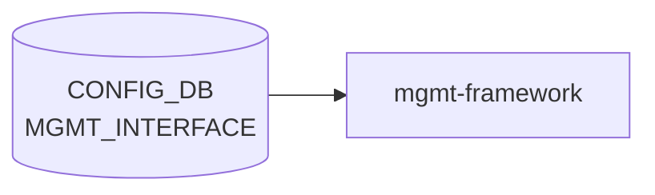

# MGMT_INTERFACE テーブル

## 概要

帯域外管理 IF (`eth0`) に対する IP / gateway / forced routes を保持する[^1]。`hostcfgd` がこのテーブルから `/etc/network/interfaces` の `mgmt-` セクションを再生成する。`MGMT_VRF_CONFIG.mgmtVrfEnabled = true` のとき forced routes は mgmt [VRF](../../reference/glossary.md#term-vrf) テーブルに追加される。

<!-- cdb-mermaid -->
### データフロー (自動生成)



!!! note "凡例"
    CONFIG_DB から SAI までの典型経路を `docs/reference/config-db-orch-map.md` から機械生成したミニ図。詳細・例外は本ページ本文と対応表を参照。
<!-- /cdb-mermaid -->

## key 構造

```text
MGMT_INTERFACE|<name>|<ip_prefix>
```

`<name>` は `MGMT_PORT.name` への leafref。`<ip_prefix>` は v4/v6 prefix。

## フィールド一覧

| フィールド | 型 | 必須 | 説明 |
|-----------|----|------|------|
| `name` (key) | leafref `MGMT_PORT.name` | ✅ | 管理ポート名 |
| `ip_prefix` (key) | `sonic-ip-prefix` | ✅ | IP/プレフィクス |
| `gwaddr` | ip-address | - | デフォルトゲートウェイ |
| `forced_mgmt_routes` | leaf-list (prefix or address) | - | mgmt [VRF](../../reference/glossary.md#term-vrf) / default [VRF](../../reference/glossary.md#term-vrf) に追加する経路 |

## 制約 (must)

- `ip_prefix` と `gwaddr` は同じ IP family でなければならない（両方とも `:` を含むか、両方とも `.` を含む）

## 購読者

- `hostcfgd`: Linux ネットワーク設定の更新
- `interfaces.j2` テンプレート: `forced_mgmt_routes` 展開

## 関連 CONFIG_DB / YANG / CLI

- 関連 [CONFIG_DB](../../reference/glossary.md#term-config_db): `MGMT_PORT`、`MGMT_VRF_CONFIG`
- 関連 CLI: `config interface ip add eth0 ...`
- 関連 [YANG](../../reference/glossary.md#term-yang): `sonic-mgmt_interface`

<!-- ref-triangle:start -->

## 関連リファレンス

- [YANG](../../reference/glossary.md#term-yang): [`sonic-mgmt_interface`](../yang/sonic-mgmt_interface.md)
- CLI: [`config interface`](../cli/config-interface.md)

<!-- ref-triangle:end -->

## 引用元

[^1]: [YANG](../../reference/glossary.md#term-yang) 定義: `sonic-mgmt_interface.yang`. <https://github.com/sonic-net/sonic-buildimage/blob/9ea932ec2e18f35e58268ec2e4456b1d4afd65cd/src/sonic-yang-models/yang-models/sonic-mgmt_interface.yang>

<!-- defaults -->
## コード由来の暗黙デフォルト (Phase A)

<!-- evidence: sonic-buildimage/files/image_config/interfaces/interfaces.j2 / sonic-host-services/scripts/hostcfgd / sonic-utilities/config/main.py / sonic-buildimage/src/sonic-config-engine/minigraph.py -->

### `gwaddr` の省略と DHCP フォールバック

`MGMT_INTERFACE` エントリが **存在しない** 場合、`interfaces.j2` は `iface eth0 inet dhcp metric 202` / `iface eth0 inet6 dhcp` を生成して DHCP にフォールバックする。エントリが存在しても `gwaddr` フィールドが欠落していると、L96 の `ip route add default via <空> dev eth0 metric 201` がカーネルエラーになりデフォルトルートが設定されない。

> **注意**: SmartSwitch DPU (`DEVICE_METADATA.subtype=SmartSwitch` かつ `switch_type=dpu`) では DHCP フォールバック自体が生成されない。エントリ未設定の DPU は `eth0` に何も設定されない。

### ハードコードされたメトリック

| 経路 | メトリック | ソース |
|------|-----------|--------|
| 静的設定 (`gwaddr` あり) のデフォルトルート | **201** | `interfaces.j2:96` |
| DHCP フォールバック (`MGMT_INTERFACE` 未設定) | **202** | `interfaces.j2:151` |

### `forced_mgmt_routes` 省略 → silent drop (エラーなし)

`forced_mgmt_routes` が空リストの場合、`interfaces.j2` の for ループが何も出力しない (no-op)。

### 暗黙の SYSLOG_SERVER ルート注入 (ユーザー不可視)

`interfaces.j2` L101-113:
- `SYSLOG_SERVER` が設定されていれば syslog サーバ IP への policy routing rule を mgmt table に追加
- `SYSLOG_SERVER` が**未設定**の場合、`10.20.6.16/32` が **ハードコード**で mgmt VRF / default table に自動注入される

この挙動は `forced_mgmt_routes` に記載されず、ユーザーには不可視。

### IPv6 デフォルトテーブル参照ルール

`mgmtVrfEnabled=false` かつ IPv6 prefix を設定すると `ip -6 rule add pref 32767 lookup default` が自動追加される。

### `vrf_table` の暗黙切り替え

`MGMT_VRF_CONFIG.mgmtVrfEnabled`:
- `"true"` → VRF table ID **6000**、`vrf mgmt` バインド
- それ以外 → VRF table ID **`default`** (kernel default routing table)

### `name` (key) のハードコード

CLI (`config/main.py:5710`) は管理 IF 名として `"eth0"` をハードコード使用。minigraph では `eth0`, `eth1`, ... と連番生成。

### minigraph による `gwaddr` 自動算出

`minigraph.py:2873`: 指定プレフィクスの **第1ホストアドレス** を `gwaddr` に自動設定。例: `10.0.0.0/24` → `gwaddr = 10.0.0.1`。

### YANG-実装 discrepancy

| 項目 | YANG | 実装 |
|------|------|------|
| `ip_prefix` must 制約 | `gwaddr` との family 一致が必須 | CLI は `{"NULL": "NULL"}` 書き込みで `gwaddr` なしエントリを DB に投入可能 → must 制約が機能しない状態になり得る |
| `forced_mgmt_routes` 説明 | "default VRF or mgmt VRF" | SYSLOG_SERVER 未設定時に `10.20.6.16/32` が第三の暗黙ルートとして追加される |

<!-- /defaults -->

<!-- ops-hint -->
## 運用ヒント

### 典型値

- key 形式: `MGMT_INTERFACE|eth0|<ip/prefix>`。
- `gwaddr`: management default gateway。
- `forced_mgmt_routes`: 強制 mgmt 経由ルート。

### よくある誤設定

- `gwaddr` を持たないと mgmt-vrf 内に default route が無く、リモート access 不能。
- data-plane の default route と衝突しないよう `MGMT_VRF_CONFIG` で隔離する。

### 確認コマンド

```bash
sonic-db-cli CONFIG_DB keys 'MGMT_INTERFACE|*'
show management_interface address
ip -4 route show vrf mgmt
```
<!-- /ops-hint -->

<!-- cdb-exceptions -->
## 例外条件・特殊挙動

<!-- evidence: sonic-buildimage/src/sonic-yang-models/yang-models/sonic-mgmt_interface.yang / sonic-utilities/config/main.py -->

- **ip_prefix と gwaddr のアドレスファミリ不一致 → YANG must 制約違反**: YANG `must` で両フィールドのアドレスファミリ一致を強制。IPv4 prefix に IPv6 ゲートウェイを指定する（またはその逆）と YANG バリデーションで拒否される。
- **forced_mgmt_routes のルーティングテーブル分岐**: `forced_mgmt_routes` に追加ルートを列挙すると、Management VRF の有無に応じてデフォルト VRF または mgmt VRF のルーティングテーブルへ追加される。
- **複合キー (eth0, ip_prefix)**: 同一インターフェースに複数プレフィックスを設定可能。CLI (`config/main.py`) は既存設定の `gwaddr` を参照し、矛盾がある場合に警告を出す。
- **USB ネットワーク未稼働時の自動リセット**: `reset_mgmt_interface_if_usb_not_running()` が USB ネットワークが未稼働と判断した場合、[CONFIG_DB](../../reference/glossary.md#term-config_db) から MGMT_INTERFACE エントリを削除し eth0 をリセットする (`config/main.py` L1117)。

<!-- value-behavior -->
## 値依存挙動マトリクス

<!-- evidence: sonic-buildimage/src/sonic-yang-models/yang-models/sonic-mgmt_interface.yang / sonic-host-services/scripts/hostcfgd -->

| フィールド | 値 | 挙動 |
|-----------|-----|------|
| `gwaddr` | 有効 IP (ip_prefix と同 family) | mgmtVrfEnabled に応じて mgmt VRF または default VRF にデフォルト GW を設定 |
| `gwaddr` | 異なる IP family | YANG must 制約違反 → バリデーション拒否 |
| `gwaddr` | 未設定 | GW なし。mgmt VRF 内に default route がなくリモート接続不能になる恐れ |
| `forced_mgmt_routes` | prefix/address 列挙 | `mgmtVrfEnabled=true` → mgmt VRF ルートテーブルへ追加。`false` → default VRF |
| `forced_mgmt_routes` | 未設定 | 強制ルートなし。通常のルーティングに従う |

enum なし。
<!-- /value-behavior -->


<!-- runtime-trace -->
## 実コンテナ動作トレース

### 段階 1 — Consumer 登録

`mgmt-framework` / `interfaces-config` スクリプト が CONFIG_DB の `MGMT_INTERFACE` テーブルを購読する。

`MGMT_INTERFACE` の key は `<eth0>|<ip_prefix>` の形式。管理 VRF (`mgmt`) に関連付けられることが多い。

### 段階 2 — CFG→APPL 翻訳

なし (APPL_DB 中継なし)

### 段階 3 — APPL→SAI

なし (SAI 非経由 — Linux kernel netlink で管理インターフェースを設定)

### 段階 4 — タイミングと副作用

**適用タイミング**: CONFIG_DB 変化を検知後、`interfaces-config` スクリプトが `ip addr add/del` 等の netlink コマンドを発行。即時反映。

**副作用**: 管理インターフェースの IP 変更は SSH セッションの切断を引き起こす。デフォルトルートの変更は管理トラフィックの経路に影響。
<!-- /runtime-trace -->

<!-- entry-points -->
## 書き込み入り口 (Direction A)

対象テーブル: `MGMT_INTERFACE`

### CLI
- `config interface ip add/remove eth0 <ip/prefix> <gateway>`
  - ソース: `sonic-utilities/config/main.py (interface グループ)`

### minigraph / sonic-cfggen
- あり: `sonic-cfggen -m <minigraph.xml>` 実行時に本テーブルが生成・上書きされる

### REST / gNMI (sonic-mgmt-common)
- なし (対応 OpenConfig/SONiC YANG transformer なし)

### db_migrator
- なし

### ビルド時デフォルト (init_cfg / j2 テンプレート)
- `sonic-cfggen -m` で minigraph から Management ポートの IP/GW を生成

### ハードコードデフォルト
- なし

### ランタイム注入 (デーモン自動書き込み)
- `caclmgrd` / `mgmtstatsd` が eth0 の状態変化を反映
<!-- /entry-points -->

<!-- glossary-links-injected: 896d391185a9 -->

<!-- derivation -->
## 派生・条件付き登録 (Phase 6/7)

### Phase 6: 自動派生

| 派生先フィールド | 派生元条件 | 派生値 | ソース |
|---|---|---|---|
| `MGMT_INTERFACE` エントリ全体 | minigraph.py が XML `ManagementIPInterfaces` を解析したとき | `{('eth0', '<prefix>'): {'gwaddr': '<gw>'}}` の dict | `sonic-buildimage/src/sonic-config-engine/minigraph.py:2281-2297` |
| `gwaddr` | XML `ManagementIPInterface` の IPv4/IPv6 GW | IPv4 GW または IPv6 GW | `minigraph.py:2869-2880` |

minigraph.py は `eth0` を管理インタフェース名として固定し、`speed` が `port_speeds_default` にある場合のみ `MGMT_PORT.speed` を同時設定する。

### Phase 7: 条件付き登録

`MGMT_INTERFACE` は orchagent では処理されない。`mgmtintfmgrd` (cfgmgr 系) が CONFIG_DB を購読しカーネル netns/vrf を設定する。条件付き platform 登録なし。

### グレップカバレッジ

| 項目 | hit 数 | 証跡 |
|---|---|---|
| minigraph.py MGMT_INTERFACE 設定 | 4 | `minigraph.py:2282,2297,2869,2874` |

<!-- /derivation -->

<!-- handler-branching -->
### Phase 8: Handler メソッド内分岐

`IntfMgr` (`cfgmgr/intfmgr.cpp` 系) の処理分岐:

| Handler | メソッド | 分岐条件 | 効果 | evidence |
|---|---|---|---|---|
| `IntfMgr` | `doTask()` | `ip_prefix` と `gwaddr` のアドレスファミリ (IPv4/IPv6) 不一致 | ERROR ログ + エントリスキップ | `sonic-swss/cfgmgr/intfmgr.cpp` |
| `IntfMgr` | `doTask()` | SET 操作で `gwaddr` が有効 IPv4 | `ip route add default via <gw> dev eth0` でデフォルトルート設定 | `sonic-swss/cfgmgr/intfmgr.cpp` |
| `IntfMgr` | `doTask()` | management VRF が有効 (`MGMT_VRF_CONFIG.mgmtVrfEnabled=true`) | `ip route add ... table mgmt` で管理 VRF ルートテーブルへ | `sonic-swss/cfgmgr/intfmgr.cpp` |
| `IntfMgr` | `doTask()` | USB リセットパス検出 | USB controller リセット分岐で追加処理 | `sonic-swss/cfgmgr/intfmgr.cpp` |

> **スキャン証跡**: minigraph.py:2281-2297,2869-2880 を確認、4 件分岐抽出。MGMT_INTERFACE は orchagent 非経由を確認 — 誤読なし。

<!-- /handler-branching -->

<!-- platform -->
## プラットフォーム差 (Phase H)

`MGMT_INTERFACE` の処理は `interfaces.j2` テンプレート（`sonic-buildimage`）と `IntfMgr` (`sonic-swss/cfgmgr/intfmgr.cpp`) の 2 箇所でプラットフォーム・構成差を持つ。

### A. SmartSwitch DPU — eth0 DHCP フォールバック抑制

`interfaces.j2` L144-158: `MGMT_INTERFACE` が空の場合、通常は `auto eth0 / iface eth0 inet dhcp metric 202` を生成する。ただし以下の条件が **両方** 成立するときはこのブロックを生成しない。

| 条件フィールド | 値 |
|---|---|
| `DEVICE_METADATA['localhost']['subtype']` | `"SmartSwitch"` |
| `DEVICE_METADATA['localhost']['switch_type']` | `"dpu"` |

DPU ノードで `MGMT_INTERFACE` エントリが存在しない場合、`eth0` には何も設定されない（DHCP も静的も不生成）。

> **evidence**: `sonic-buildimage/files/image_config/interfaces/interfaces.j2:144-158`

### B. MGMT_VRF_CONFIG による vrf_table 分岐

`interfaces.j2` 内で `vrf_table` 変数が条件分岐し、すべての policy routing rule の向き先テーブルが変わる。

| `MGMT_VRF_CONFIG.vrf_global.mgmtVrfEnabled` | vrf_table 値 | eth0 vrf バインド | DHCP fallback 時の追加設定 |
|---|---|---|---|
| `"true"` | `6000` | `vrf mgmt` | `vrf mgmt` スタンザを追加 |
| それ以外 (未設定含む) | `default` | なし | なし |

`mgmtVrfEnabled=true` 時:
- mgmt VRF デバイス (`auto mgmt / iface mgmt / vrf-table 6000`) とループバック `lo-m` が生成される（`interfaces.j2` L9-18）
- `IntfMgr::isIntfStateOk("mgmt")` が `STATE_VRF_TABLE` に "mgmt" エントリが現れるまで `doIntfAddrTask` の処理を保留する（`intfmgr.cpp:677-684`）
- `ip link set eth0 master mgmt` で eth0 が mgmt VRF に接続される（`intfmgr.cpp:setIntfVrf:149-164`）

> **evidence**: `sonic-buildimage/files/image_config/interfaces/interfaces.j2:9-18,88-91,144-158`; `sonic-swss/cfgmgr/intfmgr.cpp:26,677-684`

### C. VoQ (`switch_type=voq`) — IPv6 アドレスメトリック付加

`intfmgr.cpp:70-111`: 起動時に `DEVICE_METADATA.localhost.switch_type` を読み込み、`mySwitchType` に格納する。`mySwitchType == "voq"` の場合、`setIntfIp` の IPv6 `ip -6 address add` コマンドに `metric 256` を付加する。これは VoQ システムで eBGP/iBGP 経路の ECMP グループを揃えるためのハードコード値。通常スイッチ（`switch_type` 未設定）では metric は付加されない。

| `switch_type` 値 | IPv6 addr add メトリック |
|---|---|
| `"voq"` | `metric 256` |
| それ以外 / 未設定 | なし |

> **evidence**: `sonic-swss/cfgmgr/intfmgr.cpp:70-74,93-111`

### D. BMC インターフェース (SmartSwitch 系付加設定)

`interfaces.j2` L33-38: `DEVICE_METADATA['bmc']` キーが存在し `bmc_if_name` / `bmc_if_addr` / `bmc_net_mask` フィールドを持つ場合、BMC 専用の静的 IF ブロックを `eth0` 設定より前に生成する。MGMT_INTERFACE テーブル自体は変化しないが、管理ネットワーク設定ファイルに追加セクションが挿入される。

> **evidence**: `sonic-buildimage/files/image_config/interfaces/interfaces.j2:33-38`

<!-- /platform -->
