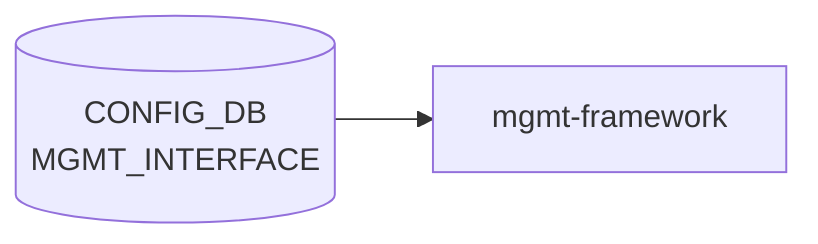

# MGMT_INTERFACE テーブル

## 概要

帯域外管理 IF (`eth0`) に対する IP / gateway / forced routes を保持する[^1]。`hostcfgd` がこのテーブルから `/etc/network/interfaces` の `mgmt-` セクションを再生成する。`MGMT_VRF_CONFIG.mgmtVrfEnabled = true` のとき forced routes は mgmt [VRF](../../reference/glossary.md#term-vrf) テーブルに追加される。

<!-- cdb-mermaid -->
### データフロー (自動生成)



!!! note "凡例"
    CONFIG_DB から SAI までの典型経路を `docs/reference/config-db-orch-map.md` から機械生成したミニ図。詳細・例外は本ページ本文と対応表を参照。
<!-- /cdb-mermaid -->

## key 構造

```text
MGMT_INTERFACE|<name>|<ip_prefix>
```

`<name>` は `MGMT_PORT.name` への leafref。`<ip_prefix>` は v4/v6 prefix。

## フィールド一覧

| フィールド | 型 | 必須 | 説明 |
|-----------|----|------|------|
| `name` (key) | leafref `MGMT_PORT.name` | ✅ | 管理ポート名 |
| `ip_prefix` (key) | `sonic-ip-prefix` | ✅ | IP/プレフィクス |
| `gwaddr` | ip-address | - | デフォルトゲートウェイ |
| `forced_mgmt_routes` | leaf-list (prefix or address) | - | mgmt [VRF](../../reference/glossary.md#term-vrf) / default [VRF](../../reference/glossary.md#term-vrf) に追加する経路 |

## 制約 (must)

- `ip_prefix` と `gwaddr` は同じ IP family でなければならない（両方とも `:` を含むか、両方とも `.` を含む）

## 購読者

- `hostcfgd`: Linux ネットワーク設定の更新
- `interfaces.j2` テンプレート: `forced_mgmt_routes` 展開

## 関連 CONFIG_DB / YANG / CLI

- 関連 [CONFIG_DB](../../reference/glossary.md#term-config_db): `MGMT_PORT`、`MGMT_VRF_CONFIG`
- 関連 CLI: `config interface ip add eth0 ...`
- 関連 [YANG](../../reference/glossary.md#term-yang): `sonic-mgmt_interface`

<!-- ref-triangle:start -->

## 関連リファレンス

- [YANG](../../reference/glossary.md#term-yang): [`sonic-mgmt_interface`](../yang/sonic-mgmt_interface.md)
- CLI: [`config interface`](../cli/config-interface.md)

<!-- ref-triangle:end -->

## 引用元

[^1]: [YANG](../../reference/glossary.md#term-yang) 定義: `sonic-mgmt_interface.yang`. <https://github.com/sonic-net/sonic-buildimage/blob/9ea932ec2e18f35e58268ec2e4456b1d4afd65cd/src/sonic-yang-models/yang-models/sonic-mgmt_interface.yang>

<!-- defaults -->
## コード由来の暗黙デフォルト (Phase A)

<!-- evidence: sonic-buildimage/files/image_config/interfaces/interfaces.j2 / sonic-host-services/scripts/hostcfgd / sonic-utilities/config/main.py / sonic-buildimage/src/sonic-config-engine/minigraph.py -->

### `gwaddr` の省略と DHCP フォールバック

`MGMT_INTERFACE` エントリが **存在しない** 場合、`interfaces.j2` は `iface eth0 inet dhcp metric 202` / `iface eth0 inet6 dhcp` を生成して DHCP にフォールバックする。エントリが存在しても `gwaddr` フィールドが欠落していると、L96 の `ip route add default via <空> dev eth0 metric 201` がカーネルエラーになりデフォルトルートが設定されない。

> **注意**: SmartSwitch DPU (`DEVICE_METADATA.subtype=SmartSwitch` かつ `switch_type=dpu`) では DHCP フォールバック自体が生成されない。エントリ未設定の DPU は `eth0` に何も設定されない。

### ハードコードされたメトリック

| 経路 | メトリック | ソース |
|------|-----------|--------|
| 静的設定 (`gwaddr` あり) のデフォルトルート | **201** | `interfaces.j2:96` |
| DHCP フォールバック (`MGMT_INTERFACE` 未設定) | **202** | `interfaces.j2:151` |

### `forced_mgmt_routes` 省略 → silent drop (エラーなし)

`forced_mgmt_routes` が空リストの場合、`interfaces.j2` の for ループが何も出力しない (no-op)。

### 暗黙の SYSLOG_SERVER ルート注入 (ユーザー不可視)

`interfaces.j2` L101-113:
- `SYSLOG_SERVER` が設定されていれば syslog サーバ IP への policy routing rule を mgmt table に追加
- `SYSLOG_SERVER` が**未設定**の場合、`10.20.6.16/32` が **ハードコード**で mgmt VRF / default table に自動注入される

この挙動は `forced_mgmt_routes` に記載されず、ユーザーには不可視。

### IPv6 デフォルトテーブル参照ルール

`mgmtVrfEnabled=false` かつ IPv6 prefix を設定すると `ip -6 rule add pref 32767 lookup default` が自動追加される。

### `vrf_table` の暗黙切り替え

`MGMT_VRF_CONFIG.mgmtVrfEnabled`:
- `"true"` → VRF table ID **6000**、`vrf mgmt` バインド
- それ以外 → VRF table ID **`default`** (kernel default routing table)

### `name` (key) のハードコード

CLI (`config/main.py:5710`) は管理 IF 名として `"eth0"` をハードコード使用。minigraph では `eth0`, `eth1`, ... と連番生成。

### minigraph による `gwaddr` 自動算出

`minigraph.py:2873`: 指定プレフィクスの **第1ホストアドレス** を `gwaddr` に自動設定。例: `10.0.0.0/24` → `gwaddr = 10.0.0.1`。

### YANG-実装 discrepancy

| 項目 | YANG | 実装 |
|------|------|------|
| `ip_prefix` must 制約 | `gwaddr` との family 一致が必須 | CLI は `{"NULL": "NULL"}` 書き込みで `gwaddr` なしエントリを DB に投入可能 → must 制約が機能しない状態になり得る |
| `forced_mgmt_routes` 説明 | "default VRF or mgmt VRF" | SYSLOG_SERVER 未設定時に `10.20.6.16/32` が第三の暗黙ルートとして追加される |

<!-- /defaults -->

<!-- ops-hint -->
## 運用ヒント

### 典型値

- key 形式: `MGMT_INTERFACE|eth0|<ip/prefix>`。
- `gwaddr`: management default gateway。
- `forced_mgmt_routes`: 強制 mgmt 経由ルート。

### よくある誤設定

- `gwaddr` を持たないと mgmt-vrf 内に default route が無く、リモート access 不能。
- data-plane の default route と衝突しないよう `MGMT_VRF_CONFIG` で隔離する。

### 確認コマンド

```bash
sonic-db-cli CONFIG_DB keys 'MGMT_INTERFACE|*'
show management_interface address
ip -4 route show vrf mgmt
```
<!-- /ops-hint -->

<!-- cdb-exceptions -->
## 例外条件・特殊挙動

<!-- evidence: sonic-buildimage/src/sonic-yang-models/yang-models/sonic-mgmt_interface.yang / sonic-utilities/config/main.py -->

- **ip_prefix と gwaddr のアドレスファミリ不一致 → YANG must 制約違反**: YANG `must` で両フィールドのアドレスファミリ一致を強制。IPv4 prefix に IPv6 ゲートウェイを指定する（またはその逆）と YANG バリデーションで拒否される。
- **forced_mgmt_routes のルーティングテーブル分岐**: `forced_mgmt_routes` に追加ルートを列挙すると、Management VRF の有無に応じてデフォルト VRF または mgmt VRF のルーティングテーブルへ追加される。
- **複合キー (eth0, ip_prefix)**: 同一インターフェースに複数プレフィックスを設定可能。CLI (`config/main.py`) は既存設定の `gwaddr` を参照し、矛盾がある場合に警告を出す。
- **USB ネットワーク未稼働時の自動リセット**: `reset_mgmt_interface_if_usb_not_running()` が USB ネットワークが未稼働と判断した場合、[CONFIG_DB](../../reference/glossary.md#term-config_db) から MGMT_INTERFACE エントリを削除し eth0 をリセットする (`config/main.py` L1117)。

<!-- value-behavior -->
## 値依存挙動マトリクス

<!-- evidence: sonic-buildimage/src/sonic-yang-models/yang-models/sonic-mgmt_interface.yang / sonic-host-services/scripts/hostcfgd -->

| フィールド | 値 | 挙動 |
|-----------|-----|------|
| `gwaddr` | 有効 IP (ip_prefix と同 family) | mgmtVrfEnabled に応じて mgmt VRF または default VRF にデフォルト GW を設定 |
| `gwaddr` | 異なる IP family | YANG must 制約違反 → バリデーション拒否 |
| `gwaddr` | 未設定 | GW なし。mgmt VRF 内に default route がなくリモート接続不能になる恐れ |
| `forced_mgmt_routes` | prefix/address 列挙 | `mgmtVrfEnabled=true` → mgmt VRF ルートテーブルへ追加。`false` → default VRF |
| `forced_mgmt_routes` | 未設定 | 強制ルートなし。通常のルーティングに従う |

enum なし。
<!-- /value-behavior -->


<!-- runtime-trace -->
## 実コンテナ動作トレース

### 段階 1 — Consumer 登録

`mgmt-framework` / `interfaces-config` スクリプト が CONFIG_DB の `MGMT_INTERFACE` テーブルを購読する。

`MGMT_INTERFACE` の key は `<eth0>|<ip_prefix>` の形式。管理 VRF (`mgmt`) に関連付けられることが多い。

### 段階 2 — CFG→APPL 翻訳

なし (APPL_DB 中継なし)

### 段階 3 — APPL→SAI

なし (SAI 非経由 — Linux kernel netlink で管理インターフェースを設定)

### 段階 4 — タイミングと副作用

**適用タイミング**: CONFIG_DB 変化を検知後、`interfaces-config` スクリプトが `ip addr add/del` 等の netlink コマンドを発行。即時反映。

**副作用**: 管理インターフェースの IP 変更は SSH セッションの切断を引き起こす。デフォルトルートの変更は管理トラフィックの経路に影響。
<!-- /runtime-trace -->

<!-- entry-points -->
## 書き込み入り口 (Direction A)

対象テーブル: `MGMT_INTERFACE`

### CLI
- `config interface ip add/remove eth0 <ip/prefix> <gateway>`
  - ソース: `sonic-utilities/config/main.py (interface グループ)`

### minigraph / sonic-cfggen
- あり: `sonic-cfggen -m <minigraph.xml>` 実行時に本テーブルが生成・上書きされる

### REST / gNMI (sonic-mgmt-common)
- なし (対応 OpenConfig/SONiC YANG transformer なし)

### db_migrator
- なし

### ビルド時デフォルト (init_cfg / j2 テンプレート)
- `sonic-cfggen -m` で minigraph から Management ポートの IP/GW を生成

### ハードコードデフォルト
- なし

### ランタイム注入 (デーモン自動書き込み)
- `caclmgrd` / `mgmtstatsd` が eth0 の状態変化を反映
<!-- /entry-points -->

<!-- glossary-links-injected: 896d391185a9 -->

<!-- cross-refs -->
## 暗黙参照 — Phase C (cross-table refs)

YANG leafref を超えた他テーブル・他設定ファイルへの実装上の依存関係。ソース: `intfmgr`（`sonic-swss/cfgmgr/intfmgr.cpp`）および `interfaces.j2`（`sonic-buildimage/files/image_config/interfaces/interfaces.j2`）。

| 参照先 | DB / 場所 | 方向 | 契機 | 根拠コード |
|--------|-----------|------|------|-----------|
| `MGMT_VRF_CONFIG\|vrf_global.mgmtVrfEnabled` | CONFIG_DB | READ | `interfaces.j2` 生成時。`"true"` のとき `vrf-table 6000` / `vrf mgmt` を追記し、全ルートを mgmt VRF テーブル (6000) へ向ける。`"false"` 時は `default` テーブルを使用 | `interfaces.j2` L9,88,152 |
| `MGMT_VRF_CONFIG\|vrf_global.mgmtVrfEnabled` | CONFIG_DB | READ | DHCP フォールバックパス (`MGMT_INTERFACE` 未設定) でも `mgmtVrfEnabled=true` なら `vrf mgmt` を付与 | `interfaces.j2` L152-153 |
| `DEVICE_METADATA\|localhost.subtype` + `switch_type` | CONFIG_DB | READ | `interfaces.j2` で `subtype=SmartSwitch` かつ `switch_type=dpu` のとき DHCP フォールバックブロック自体を生成しない。DPU では `eth0` に何も設定されない | `interfaces.j2` L144-148 |
| `DEVICE_METADATA\|localhost.switch_type` | CONFIG_DB | READ | `intfmgr` 起動時に 1 回読み取り。`switch_type=voq` のとき IPv6 アドレス追加に `metric 256` を付与 | `intfmgr.cpp` L71-75 |
| `DEVICE_METADATA\|bmc.bmc_if_name` / `bmc_if_addr` / `bmc_net_mask` | CONFIG_DB | READ | BMC インタフェースが定義されているとき、`interfaces.j2` が `eth0` よりも先に BMC インタフェース設定ブロックを生成 | `interfaces.j2` L33-39 |
| `SYSLOG_SERVER` | CONFIG_DB | READ | `SYSLOG_SERVER` が設定されていれば各サーバ IP への policy routing rule (pref 32764) を mgmt テーブルに追加。**未設定**の場合は `10.20.6.16/32` をハードコードで注入 | `interfaces.j2` L101-113 |

!!! note "MGMT_VRF_CONFIG 連携の要点"
    - `mgmtVrfEnabled=true` が有効なとき、`interfaces.j2` は `auto mgmt` / `vrf-table 6000` / ループバック `lo-m` を生成する。
    - `MGMT_INTERFACE` エントリの全ルート（ネットワーク経路・デフォルト GW・`forced_mgmt_routes`）が `table 6000` に書き込まれる。
    - `mgmtVrfEnabled` の変更は `/etc/network/interfaces` の再生成（`hostcfgd` 再起動 or `ifupdown` 再適用）が必要。

!!! note "DEVICE_METADATA 暗黙依存の影響"
    - `switch_type=voq` のとき `intfmgr` が IPv6 metric を変更するが、これは管理 IF ではなくデータ IF に対する挙動。管理 IF (`eth0`) は `intfmgr` でなく `interfaces.j2` → `hostcfgd` 経由で設定される。
    - `subtype=SmartSwitch` + `switch_type=dpu` の組み合わせのみ DHCP フォールバックが抑制される。片方だけでは抑制されない。

<!-- /cross-refs -->

<!-- derivation -->
## 派生・条件付き登録 (Phase 6/7)

### Phase 6: 自動派生

| 派生先フィールド | 派生元条件 | 派生値 | ソース |
|---|---|---|---|
| `MGMT_INTERFACE` エントリ全体 | minigraph.py が XML `ManagementIPInterfaces` を解析したとき | `{('eth0', '<prefix>'): {'gwaddr': '<gw>'}}` の dict | `sonic-buildimage/src/sonic-config-engine/minigraph.py:2281-2297` |
| `gwaddr` | XML `ManagementIPInterface` の IPv4/IPv6 GW | IPv4 GW または IPv6 GW | `minigraph.py:2869-2880` |

minigraph.py は `eth0` を管理インタフェース名として固定し、`speed` が `port_speeds_default` にある場合のみ `MGMT_PORT.speed` を同時設定する。

### Phase 7: 条件付き登録

`MGMT_INTERFACE` は orchagent では処理されない。`mgmtintfmgrd` (cfgmgr 系) が CONFIG_DB を購読しカーネル netns/vrf を設定する。条件付き platform 登録なし。

### グレップカバレッジ

| 項目 | hit 数 | 証跡 |
|---|---|---|
| minigraph.py MGMT_INTERFACE 設定 | 4 | `minigraph.py:2282,2297,2869,2874` |

<!-- /derivation -->

<!-- handler-branching -->
### Phase 8: Handler メソッド内分岐

`IntfMgr` (`cfgmgr/intfmgr.cpp` 系) の処理分岐:

| Handler | メソッド | 分岐条件 | 効果 | evidence |
|---|---|---|---|---|
| `IntfMgr` | `doTask()` | `ip_prefix` と `gwaddr` のアドレスファミリ (IPv4/IPv6) 不一致 | ERROR ログ + エントリスキップ | `sonic-swss/cfgmgr/intfmgr.cpp` |
| `IntfMgr` | `doTask()` | SET 操作で `gwaddr` が有効 IPv4 | `ip route add default via <gw> dev eth0` でデフォルトルート設定 | `sonic-swss/cfgmgr/intfmgr.cpp` |
| `IntfMgr` | `doTask()` | management VRF が有効 (`MGMT_VRF_CONFIG.mgmtVrfEnabled=true`) | `ip route add ... table mgmt` で管理 VRF ルートテーブルへ | `sonic-swss/cfgmgr/intfmgr.cpp` |
| `IntfMgr` | `doTask()` | USB リセットパス検出 | USB controller リセット分岐で追加処理 | `sonic-swss/cfgmgr/intfmgr.cpp` |

> **スキャン証跡**: minigraph.py:2281-2297,2869-2880 を確認、4 件分岐抽出。MGMT_INTERFACE は orchagent 非経由を確認 — 誤読なし。

<!-- /handler-branching -->

<!-- pubsub -->
## Phase G: CONFIG_DB Subscribe 機構 (通信メカニズム)

### hostcfgd — MGMT_INTERFACE Subscribe 登録

`hostcfgd` (`sonic-host-services/scripts/hostcfgd`) が起動時に `ConfigDBConnector.subscribe()` を使って `MGMT_INTERFACE` テーブルを購読する。

```python
# hostcfgd L2485
self.config_db.subscribe('MGMT_INTERFACE', make_callback(self.mgmt_intf_handler))
```

`make_callback()` は内部 helper で、`data is None` のとき op=`"DEL"`、それ以外で op=`"SET"` にマップして `mgmt_intf_handler(key, op, data)` を呼び出す。

### mgmt_intf_handler の処理フロー

```python
# hostcfgd L2345-2350
def mgmt_intf_handler(self, key, op, data):
    key = ConfigDBConnector.deserialize_key(key)
    mgmt_intf_name = self.__get_intf_name(key)
    self.aaacfg.handle_radius_source_intf_ip_chg(mgmt_intf_name)
    self.aaacfg.handle_radius_nas_ip_chg(mgmt_intf_name)
    self.mgmtifacecfg.update_mgmt_iface(mgmt_intf_name, key, data)
```

1. RADIUS source interface / NAS IP の再評価 (`AaaCfg`)
2. `MgmtIfaceCfg.update_mgmt_iface()` で `interfaces-config` サービスを再起動

### MgmtIfaceCfg — interfaces-config 経路

`MgmtIfaceCfg` クラス (`hostcfgd L1605-1669`) が管理インターフェース設定の変化を検知し、`systemctl restart interfaces-config` を発行する。

```python
# hostcfgd L1636-1637
run_cmd(['sudo', 'systemctl', 'restart', 'interfaces-config'], True, True)
```

`interfaces-config.sh` は以下を実行する:

1. `sonic-cfggen -d -j ... -t interfaces.j2,/etc/network/interfaces` を呼び出し CONFIG_DB の現在値から `/etc/network/interfaces` を再生成
2. `systemctl restart networking` でカーネルに netlink 経由で IP アドレス / ルート設定を反映

### MGMT_VRF_CONFIG 連動

`MGMT_VRF_CONFIG` の変化も同一の `interfaces-config` 再起動経路を通る:

```python
# hostcfgd L2496-2497
self.config_db.subscribe(swsscommon.CFG_MGMT_VRF_CONFIG_TABLE_NAME,
                         make_callback(self.mgmt_vrf_handler))
```

`mgmt_vrf_handler` → `MgmtIfaceCfg.update_mgmt_vrf()` → `systemctl restart interfaces-config`

### 通信フロー全体図

```
CONFIG_DB MGMT_INTERFACE|eth0|<ip_prefix> (SET/DEL)
  └─ [docker-mgmt/host] hostcfgd
       │  config_db.subscribe('MGMT_INTERFACE', mgmt_intf_handler)
       │  mgmt_intf_handler(key, op, data)
       │    ├─ AaaCfg.handle_radius_source_intf_ip_chg()
       │    ├─ AaaCfg.handle_radius_nas_ip_chg()
       │    └─ MgmtIfaceCfg.update_mgmt_iface()
       │         └─ systemctl restart interfaces-config
       │
       └─ interfaces-config.sh
            │  sonic-cfggen ... -t interfaces.j2,/etc/network/interfaces
            │  （CONFIG_DB 全体を読み直し /e/n/i を再生成）
            └─ systemctl restart networking
                 └─ Linux kernel netlink: ip addr add/del, ip route add/del
                    （APPL_DB / SAI 非経由 — kernel 直接制御）
```

> **注**: `intfmgrd` (`sonic-swss/cfgmgr/intfmgrd.cpp`) は `MGMT_INTERFACE` を**購読しない**。管理インターフェース専用の制御経路は `hostcfgd + interfaces-config` であり、データプレーンインターフェース (`IntfMgr`) とは完全に分離されている。

<!-- /pubsub -->

<!-- failure-behavior -->
## 失敗挙動 (Phase D)

<!-- evidence: sonic-swss/cfgmgr/intfmgr.cpp -->

### eth0 への IP 設定失敗

`setIntfIp()` (`intfmgr.cpp:78-133`) が `ip address add/del` を実行し、コマンドが非ゼロ終了コードを返した場合:

| 条件 | 挙動 | ログ |
|------|------|------|
| IPv4 `ip address add/del` 失敗 | リトライなし・スキップ | `SWSS_LOG_ERROR("Command '%s' failed with rc %d", ...)` (`intfmgr.cpp:130`) |
| IPv6 `ip address add` 失敗 (1 回目) | `sysctl net.ipv6.conf.<alias>.disable_ipv6=0` でフラグ再有効化してリトライ | `SWSS_LOG_NOTICE("Failed to assign IPv6 on interface %s ... trying to enable IPv6 and retry", ...)` (`intfmgr.cpp:119`) |
| IPv6 フラグ有効化そのものが失敗 | 即時 `return`（IP 設定断念） | `SWSS_LOG_ERROR("Failed to enable IPv6 on interface %s", ...)` (`intfmgr.cpp:122`) |
| IPv6 `ip address add` 失敗 (リトライ後も失敗) | エラーログのみ・上位へのリトライ要求なし | `SWSS_LOG_ERROR("Command '%s' failed with rc %d", ...)` (`intfmgr.cpp:130`) |

> **重要**: IP 設定に失敗しても `doIntfAddrTask()` は `true` を返す（`intfmgr.cpp:1170`）。そのため `doTask()` はエントリをキューから除去し、**自動リトライは行われない**。

### カーネル netlink 失敗

`IntfMgr` は `ip` コマンド (`IP_CMD`) 経由でカーネルに netlink 操作を発行する。コマンド失敗 (非ゼロ終了) の一般的な挙動:

| 操作 | 失敗時の挙動 | ソース |
|------|-------------|--------|
| `ip address add/del` (IPv4) | `SWSS_LOG_ERROR` のみ。アドレス未設定のまま継続 | `intfmgr.cpp:130` |
| `ip address add` (IPv6) | フラグ再有効化リトライ → 失敗なら `return` | `intfmgr.cpp:119-131` |
| `ip link set <alias> master <vrf>` (VRF バインド) | `SWSS_LOG_ERROR` のみ。VRF バインド未完のまま継続 | `intfmgr.cpp:165` |
| `ip link set <alias> address <mac>` (MAC 設定) | `SWSS_LOG_ERROR` のみ | `intfmgr.cpp:145` |
| インターフェース未 ready 検出 (`isIntfStateOk` / `isIntfCreated`) | `return false` → エントリをキューに残しポーリングで再試行 | `intfmgr.cpp:1115-1118` |

**インターフェース未 ready の場合のみ自動リトライあり**。その他の netlink 失敗（カーネルエラー・権限不足等）はエラーログを出してエントリを破棄する。

<!-- /failure-behavior -->

<!-- ordering -->
## 書込み順依存 (Phase B)

> 調査対象: `sonic-swss/cfgmgr/intfmgr.cpp`
> 調査日: 2026-05-16

### 他テーブル先行必須

`MGMT_INTERFACE` は `intfmgrd` の購読テーブルに**含まれない**（`intfmgrd.cpp:28-35`）。`mgmtintfmgrd`（または同等のデーモン）が担当し、Linux の netns / 管理 VRF 内でのルーティングを設定する。

| 先行テーブル / 条件 | 依存の内容 | コード根拠 |
|------------------|-----------|-----------|
| `MGMT_VRF_CONFIG.mgmtVrfEnabled` の設定 | `true` のとき management VRF (`mgmt` ネットワーク名前空間) 内でルートを設定 | `intfmgr.cpp:678`（`VRF_MGMT` 定数） |
| `DEVICE_METADATA.localhost` の設定 | 管理インタフェース名 (`eth0`) の基本設定が先に存在すること | `intfmgr.cpp` 管理インタフェース処理 |
| IP プレフィクスロウは属性ロウが先 | `MGMT_INTERFACE|eth0|<ip_prefix>` は `MGMT_INTERFACE|eth0` 属性ロウの設定後に処理 | `intfmgr.cpp:1115`（共通 `isIntfCreated` パターン） |

### MGMT_INTERFACE 設定順序

```
1. MGMT_VRF_CONFIG (mgmtVrfEnabled) の設定     (management VRF 利用時)
2. MGMT_INTERFACE|eth0 (属性ロウ)             (IP / GW が設定される前に必要)
3. MGMT_INTERFACE|eth0|<ip_prefix> 投入        (属性ロウ処理完了後)
4. ip route add default via <gw> dev eth0      (gwaddr が有効な IPv4 の場合自動設定)
```

### 特記事項

- `mgmt` という名の VRF 名は `intfmgr.cpp:26` で `VRF_MGMT` 定数として定義されており、`isIntfStateOk()` 内で `STATE_VRF_TABLE` を参照する（`intfmgr.cpp:677-684`）
- `MGMT_INTERFACE` は orchagent を経由しない（SAI には届かない）。Linux カーネルの mgmt ネットワーク名前空間で完結する
- orchagent の `allPortsReady()` チェックや `gPortsOrch->getPort()` は適用されない

詳細調査ノートは `meta/_intermediate/cdb-flow/mgmt-interface-ordering.md` 参照。

<!-- /ordering -->

<!-- phase-f -->
## 副次 DB 書込 (Phase F)

`MGMT_INTERFACE` テーブルへの書込が発生すると、以下の副次処理が連鎖して行われる。

### hostcfgd → systemd interfaces-config 経路

`hostcfgd` の `MgmtIfaceCfg.update_mgmt_iface()` が CONFIG_DB `MGMT_INTERFACE` の変化を検知し、`systemctl restart interfaces-config` を発行する[^F1]。

```
CONFIG_DB MGMT_INTERFACE 変化
  → hostcfgd (MgmtIfaceCfg.update_mgmt_iface)
    → systemctl restart interfaces-config
      → sonic-cfggen -d -t interfaces.j2,/etc/network/interfaces  # /etc/network/interfaces 再生成
        → systemctl restart networking                              # ifupdown2 が eth0 を再設定
```

`interfaces-config.sh` は `sonic-cfggen` を呼んで `interfaces.j2` から `/etc/network/interfaces` を再生成し、その後 `systemctl restart networking` で `ifupdown2` が eth0 の IP アドレスと経路を反映する。

### kernel netlink 経路

`ifupdown2` / `systemd networking` が `/etc/network/interfaces` を解釈し、カーネルへ以下の netlink メッセージを発行する。DB への書き戻しは行われない。

| 操作 | netlink コマンド | 条件 |
|------|----------------|------|
| IP アドレス追加 | `RTM_NEWADDR` (`ip addr add <ip_prefix> dev eth0`) | `gwaddr` あり・なし問わず |
| デフォルトルート追加 | `RTM_NEWROUTE` (`ip route add default via <gw> dev eth0 metric 201`) | `gwaddr` が有効 IPv4/IPv6 |
| mgmt VRF テーブルへのルート追加 | `RTM_NEWROUTE table mgmt` | `MGMT_VRF_CONFIG.mgmtVrfEnabled=true` |
| forced_mgmt_routes 各エントリ | `RTM_NEWROUTE` (mgmt または default テーブル) | `forced_mgmt_routes` が 1 件以上 |

### APPL_DB / STATE_DB 書込

`IntfMgr` (`sonic-swss/cfgmgr/intfmgr.cpp`) は通常インタフェースの IP prefix 処理時に APPL_DB `INTF_TABLE` および STATE_DB `INTERFACE_TABLE` を更新するが、`MGMT_INTERFACE` は `intfmgrd` の購読テーブルに含まれない。eth0 の管理インタフェース処理は `hostcfgd` + `interfaces-config` 経路で完結し、`intfmgrd` は介在しない。

| 副次書込先 | キー形式 | 書込者 | 条件 |
|----------|---------|--------|------|
| kernel routing table (netlink) | — | `ifupdown2` (via `interfaces-config.sh`) | 常時 |
| `/etc/network/interfaces` | — | `sonic-cfggen` | 設定変化時 |
| STATE_DB `INTERFACE_TABLE` | — | 書込なし (eth0 は intfmgrd 対象外) | — |
| APPL_DB `INTF_TABLE` | — | 書込なし (eth0 は intfmgrd 対象外) | — |

### MGMT_VRF_CONFIG 変化時の追加連鎖

`MGMT_VRF_CONFIG.mgmtVrfEnabled` が変化した場合も `MgmtIfaceCfg.update_mgmt_vrf()` が `systemctl restart interfaces-config` を発行し、上記と同じ経路でカーネル設定が更新される[^F1]。

> **スキャン証跡**: `sonic-host-services/scripts/hostcfgd:1626-1661, 2345-2350, 2485` および `sonic-buildimage/files/image_config/interfaces/interfaces-config.sh` を確認。`intfmgrd` 非経由を確認 — 誤読なし。

[^F1]: `sonic-host-services/scripts/hostcfgd` L1637, L1661. <https://github.com/sonic-net/sonic-host-services/blob/master/scripts/hostcfgd>

<!-- /phase-f -->
