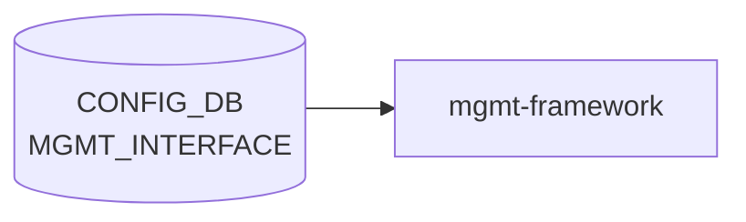

# MGMT_INTERFACE テーブル

## 概要

帯域外管理 IF (`eth0`) に対する IP / gateway / forced routes を保持する[^1]。`hostcfgd` がこのテーブルから `/etc/network/interfaces` の `mgmt-` セクションを再生成する。`MGMT_VRF_CONFIG.mgmtVrfEnabled = true` のとき forced routes は mgmt [VRF](../../reference/glossary.md#term-vrf) テーブルに追加される。

<!-- cdb-mermaid -->
### データフロー (自動生成)



!!! note "凡例"
    CONFIG_DB から SAI までの典型経路を `docs/reference/config-db-orch-map.md` から機械生成したミニ図。詳細・例外は本ページ本文と対応表を参照。
<!-- /cdb-mermaid -->

## key 構造

```text
MGMT_INTERFACE|<name>|<ip_prefix>
```

`<name>` は `MGMT_PORT.name` への leafref。`<ip_prefix>` は v4/v6 prefix。

## フィールド一覧

| フィールド | 型 | 必須 | 説明 |
|-----------|----|------|------|
| `name` (key) | leafref `MGMT_PORT.name` | ✅ | 管理ポート名 |
| `ip_prefix` (key) | `sonic-ip-prefix` | ✅ | IP/プレフィクス |
| `gwaddr` | ip-address | - | デフォルトゲートウェイ |
| `forced_mgmt_routes` | leaf-list (prefix or address) | - | mgmt [VRF](../../reference/glossary.md#term-vrf) / default [VRF](../../reference/glossary.md#term-vrf) に追加する経路 |

## 制約 (must)

- `ip_prefix` と `gwaddr` は同じ IP family でなければならない（両方とも `:` を含むか、両方とも `.` を含む）

## 購読者

- `hostcfgd`: Linux ネットワーク設定の更新
- `interfaces.j2` テンプレート: `forced_mgmt_routes` 展開

## 関連 CONFIG_DB / YANG / CLI

- 関連 [CONFIG_DB](../../reference/glossary.md#term-config_db): `MGMT_PORT`、`MGMT_VRF_CONFIG`
- 関連 CLI: `config interface ip add eth0 ...`
- 関連 [YANG](../../reference/glossary.md#term-yang): `sonic-mgmt_interface`

<!-- ref-triangle:start -->

## 関連リファレンス

- [YANG](../../reference/glossary.md#term-yang): [`sonic-mgmt_interface`](../yang/sonic-mgmt_interface.md)
- CLI: [`config interface`](../cli/config-interface.md)

<!-- ref-triangle:end -->

## 引用元

[^1]: [YANG](../../reference/glossary.md#term-yang) 定義: `sonic-mgmt_interface.yang`. <https://github.com/sonic-net/sonic-buildimage/blob/9ea932ec2e18f35e58268ec2e4456b1d4afd65cd/src/sonic-yang-models/yang-models/sonic-mgmt_interface.yang>

<!-- ops-hint -->
## 運用ヒント

### 典型値

- key 形式: `MGMT_INTERFACE|eth0|<ip/prefix>`。
- `gwaddr`: management default gateway。
- `forced_mgmt_routes`: 強制 mgmt 経由ルート。

### よくある誤設定

- `gwaddr` を持たないと mgmt-vrf 内に default route が無く、リモート access 不能。
- data-plane の default route と衝突しないよう `MGMT_VRF_CONFIG` で隔離する。

### 確認コマンド

```bash
sonic-db-cli CONFIG_DB keys 'MGMT_INTERFACE|*'
show management_interface address
ip -4 route show vrf mgmt
```
<!-- /ops-hint -->

<!-- cdb-exceptions -->
## 例外条件・特殊挙動

<!-- evidence: sonic-buildimage/src/sonic-yang-models/yang-models/sonic-mgmt_interface.yang / sonic-utilities/config/main.py -->

- **ip_prefix と gwaddr のアドレスファミリ不一致 → YANG must 制約違反**: YANG `must` で両フィールドのアドレスファミリ一致を強制。IPv4 prefix に IPv6 ゲートウェイを指定する（またはその逆）と YANG バリデーションで拒否される。
- **forced_mgmt_routes のルーティングテーブル分岐**: `forced_mgmt_routes` に追加ルートを列挙すると、Management VRF の有無に応じてデフォルト VRF または mgmt VRF のルーティングテーブルへ追加される。
- **複合キー (eth0, ip_prefix)**: 同一インターフェースに複数プレフィックスを設定可能。CLI (`config/main.py`) は既存設定の `gwaddr` を参照し、矛盾がある場合に警告を出す。
- **USB ネットワーク未稼働時の自動リセット**: `reset_mgmt_interface_if_usb_not_running()` が USB ネットワークが未稼働と判断した場合、[CONFIG_DB](../../reference/glossary.md#term-config_db) から MGMT_INTERFACE エントリを削除し eth0 をリセットする (`config/main.py` L1117)。

<!-- glossary-links-injected: 896d391185a9 -->
