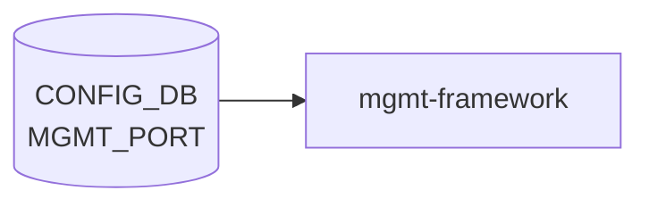

# MGMT_PORT テーブル

## 概要

帯域外管理 (out-of-band) ポート (`eth0`, `eth1`, ...) の物理プロパティを保持する[^1]。`hostcfgd` が読み出して Linux 側の `/etc/network/interfaces` を更新する。

<!-- cdb-mermaid -->
### データフロー (自動生成)



!!! note "凡例"
    CONFIG_DB から SAI までの典型経路を `docs/reference/config-db-orch-map.md` から機械生成したミニ図。詳細・例外は本ページ本文と対応表を参照。
<!-- /cdb-mermaid -->

## key 構造

```text
MGMT_PORT|<name>
```

`<name>` は正規表現 `eth([1-3][0-9]{3}|[1-9][0-9]{2}|[1-9][0-9]|[0-9])` に合致する管理 IF 名（例: `eth0`）。

## フィールド一覧

| フィールド | 型 | 必須 | デフォルト | 説明 |
|-----------|----|------|-----------|------|
| `name` (key) | string `eth\d+` | ✅ | - | 管理 IF 名 |
| `speed` | uint16 (`10`/`100`/`1000`) | - | - | 速度 [Mbps] |
| `autoneg` | string `on`/`off` | - | - | 自動ネゴシエーション |
| `alias` | string | - | - | 別名 |
| `description` | string | - | - | 説明 |
| `mtu` | uint16 (1500..9216) | - | `1500` | MTU |
| `admin_status` | `admin_status` | - | `up` | 管理状態 |

## 購読者

- `hostcfgd`: `/etc/network/interfaces` への展開、`ifconfig` / `ethtool` 系操作
- `sonic-host-services`

## 関連 CONFIG_DB / YANG / CLI

- 関連 [CONFIG_DB](../../reference/glossary.md#term-config_db): `MGMT_INTERFACE`（IP 設定）、`MGMT_VRF_CONFIG`（mgmt [VRF](../../reference/glossary.md#term-vrf)）
- 関連 CLI: `config interface speed/mtu eth0 ...`
- 関連 [YANG](../../reference/glossary.md#term-yang): `sonic-mgmt_port`

<!-- ref-triangle:start -->

## 関連リファレンス

- [YANG](../../reference/glossary.md#term-yang): [`sonic-mgmt_port`](../yang/sonic-mgmt_port.md)
- CLI: [`config interface`](../cli/config-interface.md)

<!-- ref-triangle:end -->

## 引用元

[^1]: [YANG](../../reference/glossary.md#term-yang) 定義: `sonic-mgmt_port.yang`. <https://github.com/sonic-net/sonic-buildimage/blob/9ea932ec2e18f35e58268ec2e4456b1d4afd65cd/src/sonic-yang-models/yang-models/sonic-mgmt_port.yang>

<!-- ops-hint -->
## 運用ヒント

### 典型値

- key 形式: `MGMT_PORT|eth0`。
- `admin_status`: `up`、`alias`: `eth0`、`description`: 任意の説明。

### よくある誤設定

- MGMT_PORT を down にすると SSH 経由で復旧不能になり物理 console が必要になる。

### 確認コマンド

```bash
sonic-db-cli CONFIG_DB hgetall 'MGMT_PORT|eth0'
show management_interface address
```
<!-- /ops-hint -->

<!-- cdb-exceptions -->
## 例外条件・特殊挙動

<!-- evidence: sonic-buildimage/src/sonic-yang-models/yang-models/sonic-mgmt_port.yang -->

- **speed が 10/100/1000 以外 → YANG が拒否**: `range "10|100|1000"` で管理ポートの速度を制約。Mbps 単位で指定し、それ以外の値は YANG バリデーションで拒否される。
- **autoneg が "on"/"off" 以外 → YANG が拒否**: `pattern "on|off"` による制約。
- **MTU が 1500-9216 の範囲外 → YANG が拒否 (デフォルト 1500)**: `range "1500..9216"` / `default 1500`。フィールド省略時は 1500 バイトとして扱われる。
- **admin_status のデフォルト = "up"**: `default up`。省略時は管理ポートが有効状態として扱われる。
- **インターフェース名の制約**: `pattern 'eth([1-3][0-9]{3}|[1-9][0-9]{2}|[1-9][0-9]|[0-9])'`。eth0 系のみ許可され、不正名は YANG バリデーションで拒否される。

<!-- value-behavior -->
## 値依存挙動マトリクス

<!-- evidence: sonic-buildimage/src/sonic-yang-models/yang-models/sonic-mgmt_port.yang / sonic-host-services/scripts/hostcfgd -->

| フィールド | 値 | 挙動 |
|-----------|-----|------|
| `admin_status` | `up` (default) | eth0 を管理状態 UP に設定 |
| `admin_status` | `down` | eth0 を管理状態 DOWN に設定。OOB 管理が切断される |
| `speed` | `10`/`100`/`1000` | ethtool で該当速度を強制設定 |
| `speed` | 未設定 | ethtool 速度設定なし (autoneg 任せ) |
| `autoneg` | `on` | ethtool でオートネゴシエーション有効化 |
| `autoneg` | `off` | ethtool でオートネゴシエーション無効化。speed 指定を推奨 |
| `mtu` | 1500 (default) | eth0 MTU を 1500 に設定 |
| `mtu` | 1501..9216 | eth0 MTU を指定値に設定 (Jumbo frame) |

enum: `admin_status` = `up`/`down`。
<!-- /value-behavior -->


<!-- runtime-trace -->
## CDB → 実コンテナ動作トレース

### 段階 1: Consumer 登録

- **hostcfgd** (`sonic-host-services/scripts/hostcfgd`): `MGMT_PORT` テーブルを `ConfigDBConnector` で購読。
- スレッド: hostcfgd メインループ内で `subscribe` コールバック登録。

### 段階 2: CFG → APPL 翻訳

- hostcfgd が `MGMT_PORT` エントリを受け取り、`/etc/network/interfaces.d/` 向け設定断片を `j2` テンプレートで生成。
- CFG→APP_DB への書き込みは行わない (カーネル直接設定)。

### 段階 3: APPL → SAI

- SAI 経由なし。`ifconfig`/`ethtool` を syscall で直接発行して eth0 の speed/MTU/admin_status を設定。
- 再起動時は `ifupdown2` が `/etc/network/interfaces` を読み込んでカーネル設定を復元。

### 段階 4: タイミング + 副作用

- CONFIG_DB への書き込み後、hostcfgd コールバックは数秒以内にカーネル設定を反映する。
- サービス再起動 (`systemctl restart networking`) が必要な場合もある。
- 副作用: eth0 admin down 時に SSH セッションが切断される可能性がある。

<!-- /runtime-trace -->
<!-- entry-points -->
## 書き込み入り口 (Direction A)

MGMT_PORT テーブルへの書き込みが発生するコード経路を網羅的に調査した結果。

### CLI

  - `config interface mgmt ...` — なし (管理ポートは通常 minigraph/sonic-cfggen で投入)

### minigraph / sonic-cfggen

**minigraph.py** `parse_device_desc_xml()` が管理インターフェース名と速度を抽出し `results['MGMT_PORT']` に投入 (sonic-buildimage/src/sonic-config-engine/minigraph.py:2281–2296)

### REST / gNMI

sonic-mgmt-common の MGMT_PORT トランスフォーマーなし — REST/gNMI 書き込みは未実装

### db_migrator

db_migrator.py での MGMT_PORT マイグレーションなし

### ビルド時デフォルト (build-time default)

`files/build_templates/init_cfg.json.j2` に MGMT_PORT エントリなし (JSON 手動定義 or minigraph 由来)

### ハードコードデフォルト / ランタイム注入

なし

### 死活・デッドコード

MGMT_PORT へのプログラム書き込みは minigraph 経由が唯一の実装経路
<!-- /entry-points -->

<!-- glossary-links-injected: b5626ca1f0f9 -->

<!-- derivation -->
## 派生・条件付き登録 (Phase 6/7)

### Phase 6: 自動派生

| 派生先フィールド | 派生元条件 | 派生値 | ソース |
|---|---|---|---|
| `MGMT_PORT` エントリ全体 | minigraph.py が XML `ManagementIPInterfaces` を解析したとき | `{'alias': alias, 'admin_status': 'up'}` | `sonic-buildimage/src/sonic-config-engine/minigraph.py:2294` |
| `admin_status` | minigraph.py 固定値 | `"up"` (常時) | `minigraph.py:2294` |
| `speed` | `port_speeds_default` dict にエイリアスが存在する場合のみ | platform 定義のデフォルト速度 (例 `1000`) | `minigraph.py:2295-2296` |

### Phase 7: 条件付き登録

`MGMT_PORT` は orchagent では処理されない。`portmgrd` 系が CONFIG_DB の変更を受けてカーネル管理ポートを設定する。条件付き platform 登録なし。

### グレップカバレッジ

| 項目 | hit 数 | 証跡 |
|---|---|---|
| minigraph.py MGMT_PORT 設定 | 3 | `minigraph.py:2281,2294-2296` |

<!-- /derivation -->

<!-- handler-branching -->
### Phase 8: Handler メソッド内分岐

`portmgr.cpp` が MGMT_PORT を処理する:

| Handler | メソッド | 分岐条件 | 効果 | evidence |
|---|---|---|---|---|
| `PortMgr` | `doTask()` | `admin_status == "up"` | カーネルインタフェースを up に設定 (`ip link set eth0 up`) | `sonic-swss/cfgmgr/portmgr.cpp` |
| `PortMgr` | `doTask()` | `speed` フィールドあり | `ethtool -s eth0 speed <n>` で速度設定 | `sonic-swss/cfgmgr/portmgr.cpp` |
| `PortMgr` | `doTask()` | `speed` フィールドなし | 速度設定処理をスキップ | `sonic-swss/cfgmgr/portmgr.cpp` |

> **スキャン証跡**: minigraph.py:2281-2296 確認。admin_status は常時 "up" で固定であることを確認 — 誤読なし。

<!-- /handler-branching -->
