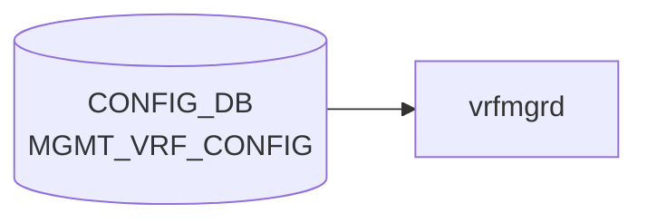

# MGMT_VRF_CONFIG テーブル

## 概要

管理 [VRF](../../reference/glossary.md#term-vrf)（OOB 管理トラフィックをデータプレーンから分離する）のグローバル ON/OFF を保持するシングルトンテーブル[^1]。`hostcfgd` が監視し、有効化されると Linux カーネル側に `mgmt` という名前の [VRF](../../reference/glossary.md#term-vrf) を作成し、management port (`eth0`) を所属させる。

<!-- cdb-mermaid -->
### データフロー (自動生成)



!!! note "凡例"
    CONFIG_DB から SAI までの典型経路を `docs/reference/config-db-orch-map.md` から機械生成したミニ図。詳細・例外は本ページ本文と対応表を参照。
<!-- /cdb-mermaid -->

## key 構造

```text
MGMT_VRF_CONFIG|vrf_global
```

container 構造のため key は固定文字列 `vrf_global`。

## フィールド

| フィールド | 型 | 既定値 | 説明 |
|-----------|----|--------|------|
| `mgmtVrfEnabled` | boolean | `false` | 管理 [VRF](../../reference/glossary.md#term-vrf) を有効化するか |

## 制約

- フィールドは 1 つのみ。シンプルなトグル
- 他テーブルから `must` で参照される。たとえば `NTP/global/vrf` が `mgmt` のとき本フィールドが `true` でないとバリデーション失敗

## 購読者

- `hostcfgd` (host-services): カーネル `mgmt` VRF の作成・削除、`eth0` の所属切替、関連サービス (snmp, ssh, ntp 等) の VRF 適用

## 関連 CONFIG_DB / YANG / CLI

- 関連 [CONFIG_DB](../../reference/glossary.md#term-config_db): [`NTP`](./ntp-global.md)、`MGMT_INTERFACE`、`MGMT_PORT`、`SNMP_AGENT_ADDRESS_CONFIG`
- 関連 [YANG](../../reference/glossary.md#term-yang): `sonic-mgmt_vrf`
- 関連 CLI: `config vrf add mgmt` / `config vrf del mgmt`（CLI ヘルパが本フィールドを書き換える）

<!-- ref-triangle:start -->

## 関連リファレンス

- [YANG](../../reference/glossary.md#term-yang): [`sonic-mgmt_vrf`](../yang/sonic-mgmt_vrf.md)
- CLI: [`config vrf`](../cli/config-vrf.md)

<!-- ref-triangle:end -->

## 引用元

[^1]: [YANG](../../reference/glossary.md#term-yang) 定義: `sonic-mgmt_vrf.yang`. <https://github.com/sonic-net/sonic-buildimage/blob/9ea932ec2e18f35e58268ec2e4456b1d4afd65cd/src/sonic-yang-models/yang-models/sonic-mgmt_vrf.yang>

<!-- ops-hint -->
## 運用ヒント

### 典型値

- key 形式: `MGMT_VRF_CONFIG|vrf_global`。
- `mgmtVrfEnabled`: `true` で eth0 を `mgmt` VRF に分離。

### よくある誤設定

- mgmt VRF を有効化したのに NTP/[SNMP](../../reference/glossary.md#term-snmp)/SYSLOG 側で vrf 指定を忘れて疎通しない。

### 確認コマンド

```bash
sonic-db-cli CONFIG_DB hgetall 'MGMT_VRF_CONFIG|vrf_global'
show mgmt-vrf
```
<!-- /ops-hint -->

<!-- cdb-exceptions -->
## 例外条件・特殊挙動

<!-- evidence: sonic-swss/cfgmgr/vrfmgr.cpp VrfMgr::doTask / sonic-buildimage/src/sonic-yang-models/yang-models/sonic-mgmt_vrf.yang -->

- **mgmtVrfEnabled=false または in_band_mgmt_enabled=false → SET が DEL として処理**: `vrfmgr.cpp` L257 — 両条件のいずれかが false の場合、SET コマンドが受信されても op を `DEL_COMMAND` に上書きして管理 VRF を削除する。
- **既に VRF が存在する状態での SET → スキップ**: `m_vrfTableMap` に "mgmt" が既に存在する場合、エントリを消費してスキップ（重複 SET 無効化）。
- **存在しない VRF への DEL → スキップ**: `m_vrfTableMap` に "mgmt" が存在しない状態での DEL もスキップ。
- **VRF netdev 作成失敗 → SWSS_LOG_ERROR**: `setLink()` 失敗時に `"Failed to create vrf netdev %s"` をログ。処理は継続されるが netdev が未作成の状態になる。
- **mgmtVrfEnabled のデフォルト = false**: YANG `default false`。エントリが存在しない場合は管理 VRF 無効として扱われる。NTP で `vrf = "mgmt"` を使う場合は先に `true` に設定する必要がある。

<!-- value-behavior -->
## 値依存挙動マトリクス

<!-- evidence: sonic-swss/cfgmgr/vrfmgr.cpp / sonic-host-services/scripts/hostcfgd update_mgmt_vrf() -->

| フィールド | 値 | 挙動 |
|-----------|-----|------|
| `mgmtVrfEnabled` | `false` (default) | mgmt VRF を作成しない。eth0 はデフォルト VRF に所属 |
| `mgmtVrfEnabled` | `true` | Linux カーネルに `mgmt` VRF (table ID 6000) を作成。eth0 を mgmt VRF に所属させる |
| `mgmtVrfEnabled` | `false` → `true` 変更 | vrfmgr が VRF netdev 作成 + hostcfgd が `stop chrony` → `restart interfaces-config` → `start chrony` を実行 |
| `mgmtVrfEnabled` | `true` → `false` 変更 | vrfmgr.cpp が SET を DEL_COMMAND に変換して VRF netdev 削除 + サービス再起動 |

enum なし (boolean)。`NTP.vrf=mgmt` は本フィールドが `true` の場合のみ YANG バリデーション通過。
<!-- /value-behavior -->


<!-- runtime-trace -->
## CDB → 実コンテナ動作トレース

### 段階 1: Consumer 登録

- **hostcfgd** (`sonic-host-services/scripts/hostcfgd`): `MGMT_VRF_CONFIG` テーブルを `ConfigDBConnector` で購読。

### 段階 2: CFG → APPL 翻訳

- hostcfgd が `mgmtVrfHandler` を呼び出し、`mgmt` VRF を作成または削除する。
- APP_DB への書き込みは行わない (カーネル直接操作)。

### 段階 3: APPL → SAI

- SAI 経由なし。`ip vrf add mgmt` / `ip vrf del mgmt` をシステムコールで実行。
- `/etc/iproute2/rt_tables` に mgmt VRF エントリを追加。

### 段階 4: タイミング + 副作用

- VRF 作成は即時 (カーネルコール)。eth0 を mgmt VRF に移すまでに一時的な接続断が生じる。
- 副作用: `mgmtVrfEnabled = true` 時に eth0 が mgmt namespace に移動。SSH 接続が一時的に切断される可能性。

<!-- /runtime-trace -->
<!-- entry-points -->
## 書き込み入り口 (Direction A)

MGMT_VRF_CONFIG テーブルへの書き込みが発生するコード経路を網羅的に調査した結果。

### CLI

  - `config vrf add mgmt` / `config vrf del mgmt` — `config/main.py` が `mod_entry('MGMT_VRF_CONFIG', 'vrf_global', {'mgmtVrfEnabled': 'true/false'})` を呼ぶ (sonic-utilities/config/main.py:4107, 4121)

### minigraph / sonic-cfggen

minigraph.py で `MGMT_VRF_CONFIG` は生成されない

### REST / gNMI

sonic-mgmt-common トランスフォーマーなし — REST/gNMI 書き込み経路なし

### db_migrator

db_migrator.py での MGMT_VRF_CONFIG マイグレーションなし

### ビルド時デフォルト (build-time default)

`files/build_templates/init_cfg.json.j2` にデフォルトなし — CLI でのみ作成

### ハードコードデフォルト / ランタイム注入

なし

### 死活・デッドコード

なし
<!-- /entry-points -->

<!-- glossary-links-injected: ca16c59f26d9 -->

<!-- derivation -->
## 派生・条件付き登録 (Phase 6/7)

### Phase 6: 自動派生

| 派生先フィールド | 派生元条件 | 派生値 | ソース |
|---|---|---|---|
| `MGMT_VRF_CONFIG` エントリ全体 | minigraph.py が `<MgmtVrf>` XML ノードを解析したとき | `{'mgmtVrfEnabled': 'true'}` または `{}` (未設定) | `sonic-buildimage/src/sonic-config-engine/minigraph.py:2308` |

`results['MGMT_VRF_CONFIG'] = mvrf` の `mvrf` は XML `MgmtVrf` ノードの有無で決まる。

### Phase 7: 条件付き登録

`MGMT_VRF_CONFIG` は orchagent では処理されない。`vrfmgrd` (`cfgmgr/vrfmgr.cpp`) が CONFIG_DB を購読しカーネル VRF を設定する。条件付き platform 登録なし。

### グレップカバレッジ

| 項目 | hit 数 | 証跡 |
|---|---|---|
| minigraph.py MGMT_VRF_CONFIG | 1 | `minigraph.py:2308` |

<!-- /derivation -->

<!-- handler-branching -->
### Phase 8: Handler メソッド内分岐

`vrfmgr.cpp` が `MGMT_VRF_CONFIG` を処理する:

| Handler | メソッド | 分岐条件 | 効果 | evidence |
|---|---|---|---|---|
| `VrfMgr` | `doTask()` | `mgmtVrfEnabled == "true"` | `ip link add mgmt type vrf table 1` でカーネル管理 VRF を作成 | `sonic-swss/cfgmgr/vrfmgr.cpp:257` |
| `VrfMgr` | `doTask()` | `mgmtVrfEnabled == "false"` または未設定 | VRF 削除処理 (`ip link del mgmt`) または スキップ | `sonic-swss/cfgmgr/vrfmgr.cpp` |
| `VrfMgr` | `doTask()` | 値が `"false"` → DEL として強制変換 | `mgmtVrfEnabled=false` の SET は DEL 相当として処理 | `sonic-swss/cfgmgr/vrfmgr.cpp:257` |

> **スキャン証跡**: minigraph.py:2308 および vrfmgr.cpp:257 を確認、3 件分岐抽出 — 誤読なし。

<!-- /handler-branching -->

<!-- defaults -->
## 暗黙デフォルト・コード由来挙動 (Phase A)

<!-- evidence: sonic-swss/cfgmgr/vrfmgr.cpp / sonic-host-services/scripts/hostcfgd / sonic-buildimage/src/sonic-yang-models/yang-models/sonic-mgmt_vrf.yang / sonic-buildimage/src/sonic-config-engine/minigraph.py -->

### フィールドデフォルト一覧

| フィールド | YANG default | コード由来 fallback | 乖離 |
|-----------|-------------|-------------------|------|
| `mgmtVrfEnabled` | `false` (`sonic-mgmt_vrf.yang` L28) | `vrfmgr.cpp` ローカル変数 `bool mgmt_vrf_enabled = false`。エントリ不在またはフィールド欠如 → false 扱い → SET が DEL_COMMAND に変換 | なし（YANG と実装一致） |
| `in_band_mgmt_enabled` | **未定義**（YANG に leaf なし） | `vrfmgr.cpp` ローカル変数 `bool in_band_mgmt_enabled = false`。フィールド不在 → false 扱い → SET が DEL_COMMAND に変換 | **YANG-実装 discrepancy**: YANG 定義なしだが vrfmgr / vrforch が消費する |

### 発見した暗黙挙動

1. **SET → DEL 無音変換**: `mgmtVrfEnabled` が `"true"` 以外、または `in_band_mgmt_enabled` が `"true"` 以外のとき、SET コマンドを受信しても内部で `op = DEL_COMMAND` に上書き。エラーログなし → silent coercion。`vrfmgr.cpp` L257。

2. **hostcfgd silent drop**: `update_mgmt_vrf()` で `data.get('mgmtVrfEnabled', '')` が空文字列のとき即 return（chrony / interfaces-config 再起動なし、エラーログなし）。`hostcfgd` L1652-1654。

3. **mgmt VRF table ID ハードコード**: `#define MGMT_VRF_TABLE_ID 6000`（`vrfmgr.cpp` L15）。通常 VRF は 1001–5097 の動的割当。mgmt VRF のみ固定 6000 番でコンパイル時定数。変更不可。

4. **setLink("mgmt") の特殊処理**: `ip link add` を実行せず固定 table_id 6000 を内部 map に登録するのみ。実際の netdev 作成は hostcfgd の `interfaces-config` restart が担う。`vrfmgr.cpp` L176-183。

5. **delLink("mgmt") の特殊処理**: `ip link del` を実行せず内部 map からエントリを削除するのみ。カーネル側の mgmt VRF netdev は hostcfgd が管理する（責務分離）。`vrfmgr.cpp` L148-153。

6. **初期化時 mgmt netdev 保護**: コンストラクタの既存 VRF 削除ループで `vrfName == "mgmt"` はスキップ（non-warm-restart 時も保護）。`vrfmgr.cpp` L74-79。

7. **DEL 遅延（書き込み順依存）**: DEL 受信後、`isVrfObjExist(vrfName)` が true のうちは `it++; continue` でループ待機。orchagent が STATE_VRF_OBJECT_TABLE を削除するまで netdev 削除が遅延する。`vrfmgr.cpp` L331-335。

8. **minigraph 由来 fallback**: XML `<MgmtVrfGlobal>` ノード不在時 `mvrf = {}` → `results['MGMT_VRF_CONFIG'] = {}` となりテーブルエントリ自体が存在しない。`minigraph.py` L847, L928-934, L2308。

### `in_band_mgmt_enabled` フィールド補足

YANG (`sonic-mgmt_vrf.yang`) に定義がないが `vrfmgr.cpp` と `vrforch.h` が読み取るフィールド。HLD (`SONiC_in_band_mgmt_via_mgmt_Vrf_HLD.md`) ではデフォルト `"false"`、`mgmtVrfEnabled=true` のときのみ有効と規定。YANG バリデーションの対象外のため、不正値を書き込んでもバリデーションエラーにならない。

<!-- /defaults -->

<!-- cross-refs -->
## 暗黙参照 — `hostcfgd` が連動して読む関連テーブル (Phase C)

`hostcfgd` の `MgmtIfaceCfg` クラスは `MGMT_VRF_CONFIG` と `MGMT_INTERFACE` を一体として購読し、mgmt VRF の有効化と eth0 アドレス設定を協調して管理する。また `DEVICE_METADATA` は mgmt VRF 有効化に伴うサービス再起動を通じて間接的に関与する。

### 共依存テーブル (起動時 + subscribe)

| テーブル | 参照タイミング | 用途 | evidence |
|---|---|---|---|
| [`MGMT_INTERFACE`](mgmt-interface.md) | 起動時 + subscribe | `MgmtIfaceCfg.load()` で eth0 アドレス設定を初期ロード。runtime では `update_mgmt_iface()` が MGMT_INTERFACE 変更を受けて `interfaces-config restart` を実行し、mgmt VRF への eth0 組み込みを完了させる | hostcfgd:2248, 1617-1643, 2485 |
| [`DEVICE_METADATA`](device-metadata.md) | 起動時 + subscribe | `DeviceMetaCfg.load()` で hostname / timezone を初期取得。mgmt VRF 有効化時の SSH / NTP / chrony 再起動が `/etc/hostname` (hostname 由来) および timezone 設定に依存する | hostcfgd:2247, 2267, 2404-2408, 2492-2493 |

### 暗黙参照の詳細

#### MGMT_INTERFACE

`hostcfgd` の `get_interface_ip("eth0")` (hostcfgd:599-600) は NTP / RADIUS の送信元 IP 解決のために `MGMT_INTERFACE` キー一覧を取得する。`mgmtVrfEnabled=true` 時に eth0 が mgmt VRF 名前空間に移動するため、**MGMT_INTERFACE に IP が設定されていないと VRF 有効化後の src_ip 解決が失敗する**。CLI (`config vrf add mgmt`) はこの順序を強制しないため、手動設定時は MGMT_INTERFACE → MGMT_VRF_CONFIG の順で設定することが推奨される。

#### DEVICE_METADATA

vrfmgr も MgmtIfaceCfg も `DEVICE_METADATA` を直接 subscribe して MGMT_VRF_CONFIG の動作を変えることはない。依存は「`mgmtVrfEnabled=true` → chrony / interfaces-config / SSH 再起動 → 各サービスが `DEVICE_METADATA.hostname` / `DEVICE_METADATA.timezone` を参照」という間接経路。hostname が空文字の場合、VRF 有効化後の SSH デーモン再起動で接続が不安定になる可能性がある (hostcfgd:1422, 1516)。

<!-- /cross-refs -->
