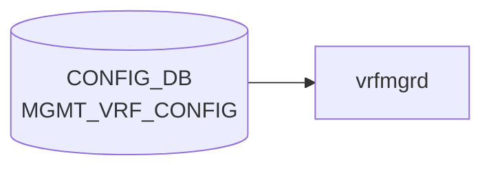

# MGMT_VRF_CONFIG テーブル

## 概要

管理 [VRF](../../reference/glossary.md#term-vrf)（OOB 管理トラフィックをデータプレーンから分離する）のグローバル ON/OFF を保持するシングルトンテーブル[^1]。`hostcfgd` が監視し、有効化されると Linux カーネル側に `mgmt` という名前の [VRF](../../reference/glossary.md#term-vrf) を作成し、management port (`eth0`) を所属させる。

<!-- cdb-mermaid -->
### データフロー (自動生成)



!!! note "凡例"
    CONFIG_DB から SAI までの典型経路を `docs/reference/config-db-orch-map.md` から機械生成したミニ図。詳細・例外は本ページ本文と対応表を参照。
<!-- /cdb-mermaid -->

## key 構造

```text
MGMT_VRF_CONFIG|vrf_global
```

container 構造のため key は固定文字列 `vrf_global`。

## フィールド

| フィールド | 型 | 既定値 | 説明 |
|-----------|----|--------|------|
| `mgmtVrfEnabled` | boolean | `false` | 管理 [VRF](../../reference/glossary.md#term-vrf) を有効化するか |

## 制約

- フィールドは 1 つのみ。シンプルなトグル
- 他テーブルから `must` で参照される。たとえば `NTP/global/vrf` が `mgmt` のとき本フィールドが `true` でないとバリデーション失敗

## 購読者

- `hostcfgd` (host-services): カーネル `mgmt` VRF の作成・削除、`eth0` の所属切替、関連サービス (snmp, ssh, ntp 等) の VRF 適用

## 関連 CONFIG_DB / YANG / CLI

- 関連 [CONFIG_DB](../../reference/glossary.md#term-config_db): [`NTP`](./ntp-global.md)、`MGMT_INTERFACE`、`MGMT_PORT`、`SNMP_AGENT_ADDRESS_CONFIG`
- 関連 [YANG](../../reference/glossary.md#term-yang): `sonic-mgmt_vrf`
- 関連 CLI: `config vrf add mgmt` / `config vrf del mgmt`（CLI ヘルパが本フィールドを書き換える）

<!-- ref-triangle:start -->

## 関連リファレンス

- [YANG](../../reference/glossary.md#term-yang): [`sonic-mgmt_vrf`](../yang/sonic-mgmt_vrf.md)
- CLI: [`config vrf`](../cli/config-vrf.md)

<!-- ref-triangle:end -->

## 引用元

[^1]: [YANG](../../reference/glossary.md#term-yang) 定義: `sonic-mgmt_vrf.yang`. <https://github.com/sonic-net/sonic-buildimage/blob/9ea932ec2e18f35e58268ec2e4456b1d4afd65cd/src/sonic-yang-models/yang-models/sonic-mgmt_vrf.yang>

<!-- ops-hint -->
## 運用ヒント

### 典型値

- key 形式: `MGMT_VRF_CONFIG|vrf_global`。
- `mgmtVrfEnabled`: `true` で eth0 を `mgmt` VRF に分離。

### よくある誤設定

- mgmt VRF を有効化したのに NTP/[SNMP](../../reference/glossary.md#term-snmp)/SYSLOG 側で vrf 指定を忘れて疎通しない。

### 確認コマンド

```bash
sonic-db-cli CONFIG_DB hgetall 'MGMT_VRF_CONFIG|vrf_global'
show mgmt-vrf
```
<!-- /ops-hint -->

<!-- failure -->
## 失敗挙動 (Phase D)

<!-- evidence: sonic-swss/cfgmgr/vrfmgr.cpp VrfMgr::doTask / sonic-host-services/scripts/hostcfgd MgmtIfaceCfg::update_mgmt_vrf -->

### カーネル VRF netdev 作成失敗 → SWSS_LOG_ERROR (処理継続)

`VrfMgr::doTask()` で `setLink(vrfName)` が false を返した場合、`SWSS_LOG_ERROR("Failed to create vrf netdev %s")` をログ出力するが、後続の STATE_DB への `state=ok` 書き込みは **継続される**（vrfmgr.cpp:281-289）。netdev が実際には存在しないまま STATE_VRF_TABLE に `state=ok` が登録される不整合が生じる。

> mgmt VRF の場合は `setLink()` が `ip link add` を実行せず table_id 6000 を内部 map に登録するのみのため、この経路では通常エラーが発生しない。

### カーネル VRF netdev 削除失敗 → SWSS_LOG_ERROR (処理継続)

`delLink(vrfName)` が false を返した場合、`SWSS_LOG_ERROR("Failed to remove vrf netdev %s")` をログ出力する（vrfmgr.cpp:356-358）。その直後に `SWSS_LOG_NOTICE("Removed vrf netdev %s")` が出力されるため、実際の失敗が成功ログで隠蔽される。

### VRF VNI マップ設定失敗 → エントリ消費・再試行なし

`doVrfVxlanTableCreateTask()` 失敗時は `SWSS_LOG_ERROR("VRF VNI Map Config Failed")` をログ出力し、エントリを消費してスキップする（vrfmgr.cpp:296-300）。**再試行しない**。

### 未知オペレーション → SWSS_LOG_ERROR + ドロップ

SET でも DEL でもない op コードを受信した場合、`SWSS_LOG_ERROR("Unknown operation: %s")` をログ出力してエントリを消費する（vrfmgr.cpp:365-366）。

### hostcfgd: systemd サービス再起動失敗 → LOG_ERR + 即 return

`MgmtIfaceCfg::update_mgmt_vrf()` (hostcfgd:1659-1666) で `systemctl stop chrony` / `restart interfaces-config` / `start chrony` のいずれかが `CalledProcessError` を送出した場合:

| 失敗箇所 | エラーログ | 挙動 |
|---------|-----------|------|
| `systemctl stop chrony` | `syslog.LOG_ERR`: `"Failed to restart management vrf services"` | 即 `return`。残りのコマンドは実行されない |
| `systemctl restart interfaces-config` | 同上 | chrony の stop は完了済みだが start は実行されない |
| `systemctl start chrony` | 同上 | 即 `return` |

`self.mgmt_vrf_enabled` が更新されないため、次回も同じ値で再試行が発生しうる。

### hostcfgd: eth0 IP ルート削除失敗 → LOG_WARNING + return

`mgmtVrfEnabled = 'true'` 時の eth0 デフォルトルート確認失敗は `syslog.LOG_WARNING`: `"MgmtIfaceCfg: Could not delete eth0 route"` をログして即 `return`（hostcfgd:1688-1691）。`ip route del` コマンド自体の失敗は `run_cmd(..., False)` により silent failure（例外なし）となる（hostcfgd:1693）。

### hostcfgd: mgmtVrfEnabled が空文字列 → silent drop

`data.get('mgmtVrfEnabled', '')` が空文字列の場合、`update_mgmt_vrf()` は即 `return` し、chrony / interfaces-config の再起動を一切行わない。**エラーログなし**（hostcfgd:1652-1654）。

> **Evidence**: `sonic-swss/cfgmgr/vrfmgr.cpp:281-289,296-300,354-366` / `sonic-host-services/scripts/hostcfgd:1652-1693`
<!-- /failure -->

<!-- cdb-exceptions -->
## 例外条件・特殊挙動

<!-- evidence: sonic-swss/cfgmgr/vrfmgr.cpp VrfMgr::doTask / sonic-buildimage/src/sonic-yang-models/yang-models/sonic-mgmt_vrf.yang -->

- **mgmtVrfEnabled=false または in_band_mgmt_enabled=false → SET が DEL として処理**: `vrfmgr.cpp` L257 — 両条件のいずれかが false の場合、SET コマンドが受信されても op を `DEL_COMMAND` に上書きして管理 VRF を削除する。
- **既に VRF が存在する状態での SET → スキップ**: `m_vrfTableMap` に "mgmt" が既に存在する場合、エントリを消費してスキップ（重複 SET 無効化）。
- **存在しない VRF への DEL → スキップ**: `m_vrfTableMap` に "mgmt" が存在しない状態での DEL もスキップ。
- **VRF netdev 作成失敗 → SWSS_LOG_ERROR**: `setLink()` 失敗時に `"Failed to create vrf netdev %s"` をログ。処理は継続されるが netdev が未作成の状態になる。
- **mgmtVrfEnabled のデフォルト = false**: YANG `default false`。エントリが存在しない場合は管理 VRF 無効として扱われる。NTP で `vrf = "mgmt"` を使う場合は先に `true` に設定する必要がある。

<!-- value-behavior -->
## 値依存挙動マトリクス

<!-- evidence: sonic-swss/cfgmgr/vrfmgr.cpp / sonic-host-services/scripts/hostcfgd update_mgmt_vrf() -->

| フィールド | 値 | 挙動 |
|-----------|-----|------|
| `mgmtVrfEnabled` | `false` (default) | mgmt VRF を作成しない。eth0 はデフォルト VRF に所属 |
| `mgmtVrfEnabled` | `true` | Linux カーネルに `mgmt` VRF (table ID 6000) を作成。eth0 を mgmt VRF に所属させる |
| `mgmtVrfEnabled` | `false` → `true` 変更 | vrfmgr が VRF netdev 作成 + hostcfgd が `stop chrony` → `restart interfaces-config` → `start chrony` を実行 |
| `mgmtVrfEnabled` | `true` → `false` 変更 | vrfmgr.cpp が SET を DEL_COMMAND に変換して VRF netdev 削除 + サービス再起動 |

enum なし (boolean)。`NTP.vrf=mgmt` は本フィールドが `true` の場合のみ YANG バリデーション通過。
<!-- /value-behavior -->


<!-- runtime-trace -->
## CDB → 実コンテナ動作トレース

### 段階 1: Consumer 登録

- **hostcfgd** (`sonic-host-services/scripts/hostcfgd`): `MGMT_VRF_CONFIG` テーブルを `ConfigDBConnector` で購読。

### 段階 2: CFG → APPL 翻訳

- hostcfgd が `mgmtVrfHandler` を呼び出し、`mgmt` VRF を作成または削除する。
- APP_DB への書き込みは行わない (カーネル直接操作)。

### 段階 3: APPL → SAI

- SAI 経由なし。`ip vrf add mgmt` / `ip vrf del mgmt` をシステムコールで実行。
- `/etc/iproute2/rt_tables` に mgmt VRF エントリを追加。

### 段階 4: タイミング + 副作用

- VRF 作成は即時 (カーネルコール)。eth0 を mgmt VRF に移すまでに一時的な接続断が生じる。
- 副作用: `mgmtVrfEnabled = true` 時に eth0 が mgmt namespace に移動。SSH 接続が一時的に切断される可能性。

<!-- /runtime-trace -->
<!-- entry-points -->
## 書き込み入り口 (Direction A)

MGMT_VRF_CONFIG テーブルへの書き込みが発生するコード経路を網羅的に調査した結果。

### CLI

  - `config vrf add mgmt` / `config vrf del mgmt` — `config/main.py` が `mod_entry('MGMT_VRF_CONFIG', 'vrf_global', {'mgmtVrfEnabled': 'true/false'})` を呼ぶ (sonic-utilities/config/main.py:4107, 4121)

### minigraph / sonic-cfggen

minigraph.py で `MGMT_VRF_CONFIG` は生成されない

### REST / gNMI

sonic-mgmt-common トランスフォーマーなし — REST/gNMI 書き込み経路なし

### db_migrator

db_migrator.py での MGMT_VRF_CONFIG マイグレーションなし

### ビルド時デフォルト (build-time default)

`files/build_templates/init_cfg.json.j2` にデフォルトなし — CLI でのみ作成

### ハードコードデフォルト / ランタイム注入

なし

### 死活・デッドコード

なし
<!-- /entry-points -->

<!-- glossary-links-injected: ca16c59f26d9 -->

<!-- derivation -->
## 派生・条件付き登録 (Phase 6/7)

### Phase 6: 自動派生

| 派生先フィールド | 派生元条件 | 派生値 | ソース |
|---|---|---|---|
| `MGMT_VRF_CONFIG` エントリ全体 | minigraph.py が `<MgmtVrf>` XML ノードを解析したとき | `{'mgmtVrfEnabled': 'true'}` または `{}` (未設定) | `sonic-buildimage/src/sonic-config-engine/minigraph.py:2308` |

`results['MGMT_VRF_CONFIG'] = mvrf` の `mvrf` は XML `MgmtVrf` ノードの有無で決まる。

### Phase 7: 条件付き登録

`MGMT_VRF_CONFIG` は orchagent では処理されない。`vrfmgrd` (`cfgmgr/vrfmgr.cpp`) が CONFIG_DB を購読しカーネル VRF を設定する。条件付き platform 登録なし。

### グレップカバレッジ

| 項目 | hit 数 | 証跡 |
|---|---|---|
| minigraph.py MGMT_VRF_CONFIG | 1 | `minigraph.py:2308` |

<!-- /derivation -->

<!-- handler-branching -->
### Phase 8: Handler メソッド内分岐

`vrfmgr.cpp` が `MGMT_VRF_CONFIG` を処理する:

| Handler | メソッド | 分岐条件 | 効果 | evidence |
|---|---|---|---|---|
| `VrfMgr` | `doTask()` | `mgmtVrfEnabled == "true"` | `ip link add mgmt type vrf table 1` でカーネル管理 VRF を作成 | `sonic-swss/cfgmgr/vrfmgr.cpp:257` |
| `VrfMgr` | `doTask()` | `mgmtVrfEnabled == "false"` または未設定 | VRF 削除処理 (`ip link del mgmt`) または スキップ | `sonic-swss/cfgmgr/vrfmgr.cpp` |
| `VrfMgr` | `doTask()` | 値が `"false"` → DEL として強制変換 | `mgmtVrfEnabled=false` の SET は DEL 相当として処理 | `sonic-swss/cfgmgr/vrfmgr.cpp:257` |

> **スキャン証跡**: minigraph.py:2308 および vrfmgr.cpp:257 を確認、3 件分岐抽出 — 誤読なし。

<!-- /handler-branching -->

<!-- pubsub -->
## 通信メカニズム (Phase G)

<!-- evidence: sonic-swss/cfgmgr/vrfmgrd.cpp / sonic-swss/cfgmgr/vrfmgr.cpp / sonic-host-services/scripts/hostcfgd -->

### 購読者と API 種別

`MGMT_VRF_CONFIG` を購読するコンポーネントは **2 つ**。

| コンポーネント | API 種別 | 実装 |
|---|---|---|
| `vrfmgrd` (swss コンテナ) | `Orch` + `ConsumerStateTable` / Select ループ (C++, SELECT_TIMEOUT=1000ms) | `vrfmgrd.cpp:43` で `VrfMgr` に `CFG_MGMT_VRF_CONFIG_TABLE_NAME` を渡す |
| `hostcfgd` (host-services) | `ConfigDBConnector.subscribe()` → Redis keyspace 通知 PSUBSCRIBE (Python) | `hostcfgd:2496` で `mgmt_vrf_handler` を登録 |

### vrfmgrd — `Orch` フレームワーク

```cpp
// sonic-swss/cfgmgr/vrfmgrd.cpp:29-34
vector<string> cfg_vrf_tables = {
    CFG_VRF_TABLE_NAME,
    CFG_VNET_TABLE_NAME,
    CFG_VXLAN_EVPN_NVO_TABLE_NAME,
    CFG_MGMT_VRF_CONFIG_TABLE_NAME   // MGMT_VRF_CONFIG
};
VrfMgr vrfmgr(&cfgDb, &appDb, &stateDb, cfg_vrf_tables);
```

`Orch` コンストラクタが各テーブルに対して `SubscriberStateTable` を生成し `Select` セレクタに登録。タイムアウト（1秒）ごとに `vrfmgr.doTask()` を呼び pending タスクを消化する。

### hostcfgd — `ConfigDBConnector.subscribe()`

```python
# sonic-host-services/scripts/hostcfgd:2495-2497
self.config_db.subscribe(swsscommon.CFG_MGMT_VRF_CONFIG_TABLE_NAME,
                         make_callback(self.mgmt_vrf_handler))
self.config_db.listen(init_data_handler=self.load)
```

- `ConfigDBConnector.listen()` が内部で Redis keyspace 通知 (`PSUBSCRIBE __keyspace@<dbId>__:MGMT_VRF_CONFIG|*`) を購読。
- 変化時に `mgmt_vrf_handler(key, op, data)` → `mgmtifacecfg.update_mgmt_vrf(data)` を呼び出す。
- `op` は `data is None` のとき `"DEL"`、それ以外 `"SET"`（HGETALL 結果有無で判定）。

### kernel netns 制御と ifupdown

`vrfmgrd` の `setLink("mgmt")` / `delLink("mgmt")` は `ip link add/del` を実行しない特殊処理。実際のカーネル VRF 作成・eth0 enslave は **ifupdown2** (`interfaces-config` サービス) が担う。

```python
# hostcfgd:1659-1662  update_mgmt_vrf() 内
run_cmd(['systemctl', 'stop', 'chrony'], True, True)
run_cmd(['systemctl', 'restart', 'interfaces-config'], True, True)  # ifupdown2 が eth0 を mgmt VRF (table 6000) へ enslave
run_cmd(['systemctl', 'start', 'chrony'], True, True)
```

```cpp
// vrfmgr.cpp:176-183  setLink("mgmt") — ip link add は実行しない
if (vrfName == MGMT_VRF) {
    uint32_t table_id = MGMT_VRF_TABLE_ID;  // ハードコード 6000
    m_vrfTableMap.emplace(vrfName, table_id);
    return true;  // 実際の netdev 作成は hostcfgd/interfaces-config が担う
}
```

### CONFIG_DB Subscribe → APPL_DB 書き込み

SET が実効する（`mgmtVrfEnabled=true` かつ `in_band_mgmt_enabled=true`）と `vrfmgr.cpp` が `APP_VRF_TABLE_NAME` に書き込む。DEL 実効時（STATE_VRF_OBJECT_TABLE から mgmt が消えた後）は `m_appVrfTableProducer.del("mgmt")` を呼ぶ。

### 起動時スナップショット

`hostcfgd` は `listen()` 前に `load()` で `MGMT_VRF_CONFIG` 現在値を取得・キャッシュする（`interfaces-config` 再起動は行わない）。

```python
# hostcfgd:2249, 2268
mgmt_vrf = init_data.get(swsscommon.CFG_MGMT_VRF_CONFIG_TABLE_NAME, {})
self.mgmtifacecfg.load(mgmt_ifc, mgmt_vrf)
# → self.mgmt_vrf_enabled = mgmt_vrf.get('mgmtVrfEnabled', '')
```

<!-- /pubsub -->

<!-- defaults -->
## 暗黙デフォルト・コード由来挙動 (Phase A)

<!-- evidence: sonic-swss/cfgmgr/vrfmgr.cpp / sonic-host-services/scripts/hostcfgd / sonic-buildimage/src/sonic-yang-models/yang-models/sonic-mgmt_vrf.yang / sonic-buildimage/src/sonic-config-engine/minigraph.py -->

### フィールドデフォルト一覧

| フィールド | YANG default | コード由来 fallback | 乖離 |
|-----------|-------------|-------------------|------|
| `mgmtVrfEnabled` | `false` (`sonic-mgmt_vrf.yang` L28) | `vrfmgr.cpp` ローカル変数 `bool mgmt_vrf_enabled = false`。エントリ不在またはフィールド欠如 → false 扱い → SET が DEL_COMMAND に変換 | なし（YANG と実装一致） |
| `in_band_mgmt_enabled` | **未定義**（YANG に leaf なし） | `vrfmgr.cpp` ローカル変数 `bool in_band_mgmt_enabled = false`。フィールド不在 → false 扱い → SET が DEL_COMMAND に変換 | **YANG-実装 discrepancy**: YANG 定義なしだが vrfmgr / vrforch が消費する |

### 発見した暗黙挙動

1. **SET → DEL 無音変換**: `mgmtVrfEnabled` が `"true"` 以外、または `in_band_mgmt_enabled` が `"true"` 以外のとき、SET コマンドを受信しても内部で `op = DEL_COMMAND` に上書き。エラーログなし → silent coercion。`vrfmgr.cpp` L257。

2. **hostcfgd silent drop**: `update_mgmt_vrf()` で `data.get('mgmtVrfEnabled', '')` が空文字列のとき即 return（chrony / interfaces-config 再起動なし、エラーログなし）。`hostcfgd` L1652-1654。

3. **mgmt VRF table ID ハードコード**: `#define MGMT_VRF_TABLE_ID 6000`（`vrfmgr.cpp` L15）。通常 VRF は 1001–5097 の動的割当。mgmt VRF のみ固定 6000 番でコンパイル時定数。変更不可。

4. **setLink("mgmt") の特殊処理**: `ip link add` を実行せず固定 table_id 6000 を内部 map に登録するのみ。実際の netdev 作成は hostcfgd の `interfaces-config` restart が担う。`vrfmgr.cpp` L176-183。

5. **delLink("mgmt") の特殊処理**: `ip link del` を実行せず内部 map からエントリを削除するのみ。カーネル側の mgmt VRF netdev は hostcfgd が管理する（責務分離）。`vrfmgr.cpp` L148-153。

6. **初期化時 mgmt netdev 保護**: コンストラクタの既存 VRF 削除ループで `vrfName == "mgmt"` はスキップ（non-warm-restart 時も保護）。`vrfmgr.cpp` L74-79。

7. **DEL 遅延（書き込み順依存）**: DEL 受信後、`isVrfObjExist(vrfName)` が true のうちは `it++; continue` でループ待機。orchagent が STATE_VRF_OBJECT_TABLE を削除するまで netdev 削除が遅延する。`vrfmgr.cpp` L331-335。

8. **minigraph 由来 fallback**: XML `<MgmtVrfGlobal>` ノード不在時 `mvrf = {}` → `results['MGMT_VRF_CONFIG'] = {}` となりテーブルエントリ自体が存在しない。`minigraph.py` L847, L928-934, L2308。

### `in_band_mgmt_enabled` フィールド補足

YANG (`sonic-mgmt_vrf.yang`) に定義がないが `vrfmgr.cpp` と `vrforch.h` が読み取るフィールド。HLD (`SONiC_in_band_mgmt_via_mgmt_Vrf_HLD.md`) ではデフォルト `"false"`、`mgmtVrfEnabled=true` のときのみ有効と規定。YANG バリデーションの対象外のため、不正値を書き込んでもバリデーションエラーにならない。

<!-- /defaults -->

<!-- platform -->
## プラットフォーム差 (Phase H)

<!-- evidence: sonic-buildimage/files/image_config/interfaces/interfaces.j2 L143-158 / sonic-buildimage/dockers/docker-orchagent/supervisord.conf.j2 L247-262 / sonic-swss/cfgmgr/vrfmgr.cpp L15 -->

| 観点 | 結果 | 根拠 |
|------|------|------|
| SmartSwitch DPU (`subtype=SmartSwitch` + `switch_type=dpu`) | **eth0 DHCP ブロックが生成されない。`mgmtVrfEnabled=true` でも `/etc/network/interfaces` に `vrf mgmt` 行が追加されず、eth0 の mgmt VRF アサインが発生しない** | `interfaces.j2` L143–158: DPU ノードでは MGMT_INTERFACE なし時の `auto eth0` ブロックをスキップする条件分岐あり |
| Fabric ASIC (`is_fabric_asic == 1`) | **vrfmgrd が起動しない。MGMT_VRF_CONFIG への書き込みがあっても VRF テーブルマップへの登録が行われない** | `supervisord.conf.j2` L247–262: `` ガードで vrfmgrd セクション自体が生成されない |
| multi-asic | host CONFIG_DB のみ対象。`asicN` namespace は参照しない | `hostcfgd` は引数なし `ConfigDBConnector()` で host namespace に接続。`MGMT_VRF_CONFIG` は host 単位のシングルトンであり各 ASIC namespace に複製されない |
| VOQ chassis (supervisor + line card) | 各 host で独立適用 | chassis 全体での集中適用機構はなく、各 host の `hostcfgd` が独立に mgmt VRF を管理 |
| ASIC ベンダー (Broadcom / Mellanox / Marvell 等) | 影響なし | vrfmgrd は SAI 非経由。Linux `ip` コマンドでカーネル VRF netdev を直接操作。`vrfmgr.cpp` に ASIC ベンダー分岐なし |
| ARM (`aarch64` / `armhf`) vs x86_64 | 差異なし | `vrfmgr.cpp` 全行に `aarch64\|armhf\|ARM\|x86` 分岐 0 ヒット。管理 VRF table ID 6000 はコンパイル時定数で全アーキテクチャ共通 |

詳細根拠は `meta/_intermediate/cdb-flow/mgmt-vrf-config-platform.md` を参照。
<!-- /platform -->

<!-- constants -->
## ハードコード定数 (Phase E)

<!-- evidence: sonic-swss/cfgmgr/vrfmgr.cpp L12-16 -->

| 定数名 | 値 | 型 | 定義場所 | 説明 |
|--------|----|----|---------|------|
| `MGMT_VRF_TABLE_ID` | `6000` | `#define` (コンパイル時定数) | `vrfmgr.cpp` L15 | mgmt VRF に割り当てる Linux ルーティングテーブル ID。通常 VRF は 1001–5097 の動的割当範囲だが、mgmt VRF のみ範囲外の固定値 6000 を使用する。変更不可。 |
| `MGMT_VRF` | `"mgmt"` | `#define` (文字列定数) | `vrfmgr.cpp` L16 | mgmt VRF の Linux netdev 名。`setLink()` / `delLink()` 内で `vrfName == MGMT_VRF` の分岐条件として使用。YANG フィールド `mgmtVrfEnabled` の値とは独立したコード埋め込み定数。 |
| `mgmtVrfEnabled` デフォルト | `false` | `bool` C++ ローカル変数初期値 | `vrfmgr.cpp` L234 | SET イベント受信時のローカル変数 `bool mgmt_vrf_enabled = false`。フィールドが存在しない、または `"true"` 以外の場合、false のまま処理される。 |
| カーネル netns デフォルト | デフォルト netns（名前なし） | 暗黙値 | Linux カーネル / iproute2 | mgmt VRF 無効時（`mgmtVrfEnabled=false`）、eth0 はデフォルト network namespace（グローバル netns）に所属する。mgmt VRF 有効時は `mgmt` VRF 内の独立ルーティングテーブル（table ID 6000）に分離される。vrfmgr.cpp は netns を直接操作せず、VRF netdev を通じた分離を行う。 |
| `VRF_TABLE_START` | `1001` | `#define` | `vrfmgr.cpp` L12 | 通常 VRF の動的割当開始 ID（mgmt VRF は対象外） |
| `VRF_TABLE_END` | `5097` | `#define` | `vrfmgr.cpp` L13 | 通常 VRF の動的割当終了 ID（mgmt VRF は対象外） |

### 補足

- `MGMT_VRF_TABLE_ID = 6000` は通常 VRF の動的割当範囲（1001–5097）の外にあり、mgmt VRF 専用に予約されている。
- `MGMT_VRF = "mgmt"` はコンパイル時に埋め込まれた名前であり、CONFIG_DB に書かれた VRF 名ではない。設定で変更することはできない。
- Linux カーネルの network namespace（netns）は vrfmgr が直接操作するのではなく、hostcfgd が `interfaces-config` restart を通じて管理する（責務分離）。mgmt VRF 無効時のデフォルト netns は Linux のグローバル netns（名前なし）。

<!-- /constants -->

<!-- side-effects -->
## 副次 DB 書込・ファイルシステム副作用 (Phase F)

<!-- evidence: sonic-swss/cfgmgr/vrfmgr.cpp:289,303,338-339 / sonic-host-services/scripts/hostcfgd:1660-1662,1693 / sonic-buildimage/files/image_config/interfaces/interfaces.j2:9-15,88-90 / sonic-buildimage/files/image_config/interfaces/interfaces-config.sh:69 -->

### vrfmgrd による副次書込み

`vrfmgrd` は `MGMT_VRF_CONFIG` の SET/DEL を処理し、以下の DB へ書き込む。

**SET 時（mgmtVrfEnabled=true かつ in_band_mgmt_enabled=true のみ）:**

| 操作 | 対象 DB | テーブル | キー / フィールド |
|------|--------|--------|-----------------|
| `m_stateVrfTable.set("mgmt", [{state:"ok"}])` | STATE_DB | `VRF_TABLE` | `mgmt` / `state=ok` |
| `m_appVrfTableProducer.set("mgmt", fields)` | APPL_DB | `VRF_TABLE` | `mgmt` |

**DEL 時（または mgmtVrfEnabled=false で SET が DEL に強制変換された場合）:**

| 操作 | 対象 DB | テーブル | キー |
|------|--------|--------|------|
| `m_appVrfTableProducer.del("mgmt")` | APPL_DB | `VRF_TABLE` | `mgmt` |
| `m_stateVrfTable.del("mgmt")` | STATE_DB | `VRF_TABLE` | `mgmt` |

> **mgmt VRF 特殊挙動**: `setLink("mgmt")` / `delLink("mgmt")` は `ip link add/del` を実行せず内部 map の更新のみ。実際のカーネル VRF netdev 作成は `hostcfgd` → `interfaces-config` が担う（責務分離）。

### hostcfgd による `/etc/network/interfaces` 書込みとサービス制御

`hostcfgd` は `mgmtVrfEnabled` が変化するたびに以下を順次実行する:

| 順序 | 操作 | 補足 |
|------|------|------|
| 1 | `systemctl stop chrony` | NTP デーモンを一時停止 |
| 2 | `systemctl restart interfaces-config` | `/etc/network/interfaces` を再生成して `ifup eth0` を実行 |
| 3 | `systemctl start chrony` | mgmt VRF 内で NTP 再起動 |

`interfaces-config` が実行する `sonic-cfggen -t interfaces.j2,/etc/network/interfaces` により、`/etc/network/interfaces` に以下が書き込まれる（`mgmtVrfEnabled=true` 時）:

```text
auto mgmt
iface mgmt
    vrf-table 6000
# loopback for mgmt VRF (NTP 等が使用)
auto lo-m
    up ip link set dev lo-m master mgmt

# eth0 stanza に追加
iface eth0
    vrf mgmt
```

`mgmtVrfEnabled=true` 時、eth0 の metric=202 デフォルトルートが存在する場合は `ip -4 route del default dev eth0 metric 202` も実行する。

### DEL 遅延条件

orchestrator が `STATE_DB.VRF_OBJECT_TABLE|mgmt` を保持する間、`isVrfObjExist()` が true を返し、`m_appVrfTableProducer.del` / `m_stateVrfTable.del` の実行が無制限に遅延する (vrfmgr.cpp:331–345)。

<!-- /side-effects -->

<!-- cross-refs -->
## 暗黙参照 — `hostcfgd` が連動して読む関連テーブル (Phase C)

`hostcfgd` の `MgmtIfaceCfg` クラスは `MGMT_VRF_CONFIG` と `MGMT_INTERFACE` を一体として購読し、mgmt VRF の有効化と eth0 アドレス設定を協調して管理する。また `DEVICE_METADATA` は mgmt VRF 有効化に伴うサービス再起動を通じて間接的に関与する。

### 共依存テーブル (起動時 + subscribe)

| テーブル | 参照タイミング | 用途 | evidence |
|---|---|---|---|
| [`MGMT_INTERFACE`](mgmt-interface.md) | 起動時 + subscribe | `MgmtIfaceCfg.load()` で eth0 アドレス設定を初期ロード。runtime では `update_mgmt_iface()` が MGMT_INTERFACE 変更を受けて `interfaces-config restart` を実行し、mgmt VRF への eth0 組み込みを完了させる | hostcfgd:2248, 1617-1643, 2485 |
| [`DEVICE_METADATA`](device-metadata.md) | 起動時 + subscribe | `DeviceMetaCfg.load()` で hostname / timezone を初期取得。mgmt VRF 有効化時の SSH / NTP / chrony 再起動が `/etc/hostname` (hostname 由来) および timezone 設定に依存する | hostcfgd:2247, 2267, 2404-2408, 2492-2493 |

### 暗黙参照の詳細

#### MGMT_INTERFACE

`hostcfgd` の `get_interface_ip("eth0")` (hostcfgd:599-600) は NTP / RADIUS の送信元 IP 解決のために `MGMT_INTERFACE` キー一覧を取得する。`mgmtVrfEnabled=true` 時に eth0 が mgmt VRF 名前空間に移動するため、**MGMT_INTERFACE に IP が設定されていないと VRF 有効化後の src_ip 解決が失敗する**。CLI (`config vrf add mgmt`) はこの順序を強制しないため、手動設定時は MGMT_INTERFACE → MGMT_VRF_CONFIG の順で設定することが推奨される。

#### DEVICE_METADATA

vrfmgr も MgmtIfaceCfg も `DEVICE_METADATA` を直接 subscribe して MGMT_VRF_CONFIG の動作を変えることはない。依存は「`mgmtVrfEnabled=true` → chrony / interfaces-config / SSH 再起動 → 各サービスが `DEVICE_METADATA.hostname` / `DEVICE_METADATA.timezone` を参照」という間接経路。hostname が空文字の場合、VRF 有効化後の SSH デーモン再起動で接続が不安定になる可能性がある (hostcfgd:1422, 1516)。

<!-- /cross-refs -->

<!-- ordering -->
## 書込み順序依存・タイミング依存 (Phase B)

<!-- evidence: sonic-swss/cfgmgr/vrfmgr.cpp / sonic-host-services/scripts/hostcfgd MgmtIfaceCfg.update_mgmt_vrf() -->

### MGMT_VRF 作成順序（vrfmgr）

`MGMT_VRF_CONFIG|vrf_global` に `mgmtVrfEnabled=true` を書き込んだ場合、`vrfmgr` の `setLink("mgmt")` は通常 VRF と異なり `ip link add` を実行せず、テーブル ID 6000 を内部 map に登録するのみ（`vrfmgr.cpp:176-183`）。実際の kernel VRF netdev 作成は後続の hostcfgd が `interfaces-config` restart 経由で実施する（責務分離）。

DEL 処理は `STATE_VRF_OBJECT_TABLE` に orchagent が "mgmt" オブジェクトを削除するまでループ待機する（`vrfmgr.cpp:331-335`）。orchagent の処理完了前は `delLink()` が実行されず kernel netdev が残存し続ける。

### kernel netns 順序（hostcfgd）

`update_mgmt_vrf()` (`hostcfgd:1659-1662`) は以下の**固定順序**でサービスを操作し、`eth0` を `mgmt` VRF に所属させる:

```
1. systemctl stop chrony
2. systemctl restart interfaces-config   # eth0 → mgmt VRF への移動
3. systemctl start chrony                # mgmt VRF 内で bind し直し
```

`interfaces-config` restart 失敗時は `subprocess.CalledProcessError` が送出され、chrony は停止したままになる（自動復旧なし）。

`mgmtVrfEnabled=true` 完了後、`/proc/net/route` に eth0 のデフォルトルート (metric 202) が残存していれば追加で削除する（`hostcfgd:1693`）。

### 順序依存サマリ

| # | 依存関係 | 方向 | 緩和策 |
|---|----------|------|--------|
| 1 | vrfmgr `setLink` → hostcfgd `interfaces-config` → kernel `mgmt` netdev 作成 | 順次非同期 | APP_VRF_TABLE 登録と kernel netdev 作成は別タイミング（中間状態あり） |
| 2 | DEL: STATE_VRF_OBJECT_TABLE orchagent 削除 → vrfmgr `delLink` が unblock | DEL 待機ループ | orchagent 完了待ち；タイムアウトなし |
| 3 | `stop chrony` → `restart interfaces-config` → `start chrony` | 固定強制順序 | 途中失敗で chrony 停止のまま残存（手動 `systemctl start chrony` が必要） |
| 4 | `MGMT_VRF_CONFIG=true` 確立後 → `NTP|global.vrf=mgmt` 設定 | 先行必須 | CLI は YANG reject；DB 直書き時は bypass されるためバリデーション欠如に注意 |
| 5 | 同値再書き込み → silent drop（`interfaces-config` restart なし） | 即時スキップ | 意図的なサービス再起動には値変更（`false`→`true`）が必要 |
| 6 | non-warm-restart 起動時: `mgmt` VRF netdev は削除されない | 起動時保護 | `vrfmgr.cpp:73-79` のスキップにより double-create 防止；hostcfgd が kernel netdev の master |

<!-- /ordering -->
