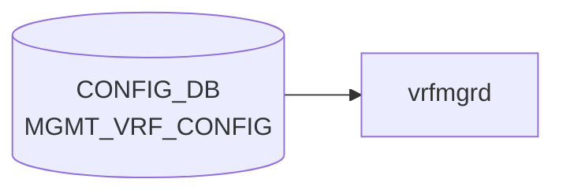

# MGMT_VRF_CONFIG テーブル

## 概要

管理 [VRF](../../reference/glossary.md#term-vrf)（OOB 管理トラフィックをデータプレーンから分離する）のグローバル ON/OFF を保持するシングルトンテーブル[^1]。`hostcfgd` が監視し、有効化されると Linux カーネル側に `mgmt` という名前の [VRF](../../reference/glossary.md#term-vrf) を作成し、management port (`eth0`) を所属させる。

<!-- cdb-mermaid -->
### データフロー (自動生成)



!!! note "凡例"
    CONFIG_DB から SAI までの典型経路を `docs/reference/config-db-orch-map.md` から機械生成したミニ図。詳細・例外は本ページ本文と対応表を参照。
<!-- /cdb-mermaid -->

## key 構造

```text
MGMT_VRF_CONFIG|vrf_global
```

container 構造のため key は固定文字列 `vrf_global`。

## フィールド

| フィールド | 型 | 既定値 | 説明 |
|-----------|----|--------|------|
| `mgmtVrfEnabled` | boolean | `false` | 管理 [VRF](../../reference/glossary.md#term-vrf) を有効化するか |

## 制約

- フィールドは 1 つのみ。シンプルなトグル
- 他テーブルから `must` で参照される。たとえば `NTP/global/vrf` が `mgmt` のとき本フィールドが `true` でないとバリデーション失敗

## 購読者

- `hostcfgd` (host-services): カーネル `mgmt` VRF の作成・削除、`eth0` の所属切替、関連サービス (snmp, ssh, ntp 等) の VRF 適用

## 関連 CONFIG_DB / YANG / CLI

- 関連 [CONFIG_DB](../../reference/glossary.md#term-config_db): [`NTP`](./ntp-global.md)、`MGMT_INTERFACE`、`MGMT_PORT`、`SNMP_AGENT_ADDRESS_CONFIG`
- 関連 [YANG](../../reference/glossary.md#term-yang): `sonic-mgmt_vrf`
- 関連 CLI: `config vrf add mgmt` / `config vrf del mgmt`（CLI ヘルパが本フィールドを書き換える）

<!-- ref-triangle:start -->

## 関連リファレンス

- [YANG](../../reference/glossary.md#term-yang): [`sonic-mgmt_vrf`](../yang/sonic-mgmt_vrf.md)
- CLI: [`config vrf`](../cli/config-vrf.md)

<!-- ref-triangle:end -->

## 引用元

[^1]: [YANG](../../reference/glossary.md#term-yang) 定義: `sonic-mgmt_vrf.yang`. <https://github.com/sonic-net/sonic-buildimage/blob/9ea932ec2e18f35e58268ec2e4456b1d4afd65cd/src/sonic-yang-models/yang-models/sonic-mgmt_vrf.yang>

<!-- ops-hint -->
## 運用ヒント

### 典型値

- key 形式: `MGMT_VRF_CONFIG|vrf_global`。
- `mgmtVrfEnabled`: `true` で eth0 を `mgmt` VRF に分離。

### よくある誤設定

- mgmt VRF を有効化したのに NTP/[SNMP](../../reference/glossary.md#term-snmp)/SYSLOG 側で vrf 指定を忘れて疎通しない。

### 確認コマンド

```bash
sonic-db-cli CONFIG_DB hgetall 'MGMT_VRF_CONFIG|vrf_global'
show mgmt-vrf
```
<!-- /ops-hint -->

<!-- cdb-exceptions -->
## 例外条件・特殊挙動

<!-- evidence: sonic-swss/cfgmgr/vrfmgr.cpp VrfMgr::doTask / sonic-buildimage/src/sonic-yang-models/yang-models/sonic-mgmt_vrf.yang -->

- **mgmtVrfEnabled=false または in_band_mgmt_enabled=false → SET が DEL として処理**: `vrfmgr.cpp` L257 — 両条件のいずれかが false の場合、SET コマンドが受信されても op を `DEL_COMMAND` に上書きして管理 VRF を削除する。
- **既に VRF が存在する状態での SET → スキップ**: `m_vrfTableMap` に "mgmt" が既に存在する場合、エントリを消費してスキップ（重複 SET 無効化）。
- **存在しない VRF への DEL → スキップ**: `m_vrfTableMap` に "mgmt" が存在しない状態での DEL もスキップ。
- **VRF netdev 作成失敗 → SWSS_LOG_ERROR**: `setLink()` 失敗時に `"Failed to create vrf netdev %s"` をログ。処理は継続されるが netdev が未作成の状態になる。
- **mgmtVrfEnabled のデフォルト = false**: YANG `default false`。エントリが存在しない場合は管理 VRF 無効として扱われる。NTP で `vrf = "mgmt"` を使う場合は先に `true` に設定する必要がある。

<!-- value-behavior -->
## 値依存挙動マトリクス

<!-- evidence: sonic-swss/cfgmgr/vrfmgr.cpp / sonic-host-services/scripts/hostcfgd update_mgmt_vrf() -->

| フィールド | 値 | 挙動 |
|-----------|-----|------|
| `mgmtVrfEnabled` | `false` (default) | mgmt VRF を作成しない。eth0 はデフォルト VRF に所属 |
| `mgmtVrfEnabled` | `true` | Linux カーネルに `mgmt` VRF (table ID 6000) を作成。eth0 を mgmt VRF に所属させる |
| `mgmtVrfEnabled` | `false` → `true` 変更 | vrfmgr が VRF netdev 作成 + hostcfgd が `stop chrony` → `restart interfaces-config` → `start chrony` を実行 |
| `mgmtVrfEnabled` | `true` → `false` 変更 | vrfmgr.cpp が SET を DEL_COMMAND に変換して VRF netdev 削除 + サービス再起動 |

enum なし (boolean)。`NTP.vrf=mgmt` は本フィールドが `true` の場合のみ YANG バリデーション通過。
<!-- /value-behavior -->

<!-- glossary-links-injected: ca16c59f26d9 -->
