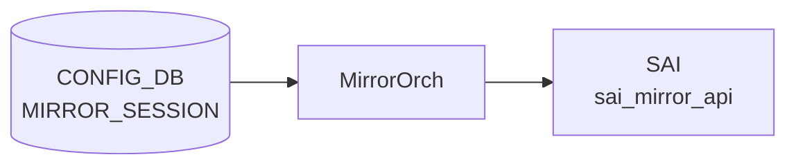

# MIRROR_SESSION テーブル

## 概要

ポートミラーリング (SPAN / ERSPAN) セッションを [CONFIG_DB](../../reference/glossary.md#term-config_db) で定義するテーブル。`MirrorOrch` が [CONFIG_DB](../../reference/glossary.md#term-config_db) を購読し、[SAI](../../reference/glossary.md#term-sai) MIRROR_SESSION オブジェクトに変換する[^1]。ERSPAN では outer GRE/IP ヘッダ用パラメータ (src_ip / dst_ip / dscp / ttl / gre_type) を伴い、SPAN では `dst_port` (ローカル物理ポートまたは `CPU`) を指定する。

<!-- cdb-mermaid -->
### データフロー (自動生成)



!!! note "凡例"
    CONFIG_DB から SAI までの典型経路を `docs/reference/config-db-orch-map.md` から機械生成したミニ図。詳細・例外は本ページ本文と対応表を参照。
<!-- /cdb-mermaid -->

## key 構造

```text
MIRROR_SESSION|<name>
```

`<name>` は 1〜32 文字、英数字始まりで `[-a-zA-Z0-9_]` を含む。

## 主要フィールド

| フィールド | 型 | 必須 | 既定 | 説明 |
|-----------|----|------|------|------|
| `type` | enum `ERSPAN`/`SPAN` | no | `ERSPAN` | セッションタイプ |
| `src_ip` | ip-address | ERSPAN 時 | - | ERSPAN 外側 IP のソース |
| `dst_ip` | ip-address | ERSPAN 時 | - | ERSPAN 外側 IP の宛先 |
| `gre_type` | hex / dec uint16 | no | `0x88be` | ERSPAN 外側 GRE type |
| `dscp` | uint8 (0..63) | no | - | ERSPAN 外側 [DSCP](../../reference/glossary.md#term-dscp) |
| `ttl` | uint8 (0..255) | no | - | ERSPAN 外側 TTL |
| `queue` | uint8 | no | - | ミラーフレームを送出する egress queue |
| `dst_port` | leafref `PORT.name` または `CPU` | SPAN 時 | - | SPAN 出力ポート |
| `src_port` | string (1..2048) | no | - | SPAN/ERSPAN 共通: ソース PORT または PORTCHANNEL のリスト |
| `direction` | enum `RX`/`TX`/`BOTH` | no | `BOTH` | キャプチャ方向 |
| `policer` | leafref `POLICER.name` | no | - | 鏡像トラフィックに適用する policer |

## 制約

- `src_ip` と `dst_ip` は同一 IP version でなければならない (`must` 制約)
- `src_ip`/`dst_ip`/`gre_type`/`dscp`/`ttl` は `type = 'ERSPAN'` のときのみ有効 (`when`)
- `dst_port` は `type = 'SPAN'` のときのみ有効

## 購読者

- `swss` 内の `orchagent` (`MirrorOrch`)
- 関連 [STATE_DB](../../reference/glossary.md#term-state_db): `MIRROR_SESSION_TABLE` にセッションのアクティブ状態が反映される

## 関連 CONFIG_DB / YANG / CLI

- 関連 [CONFIG_DB](../../reference/glossary.md#term-config_db): `POLICER`、`PORT`、`PORTCHANNEL`
- 関連 CLI: `config mirror_session add/remove`
- 関連 [YANG](../../reference/glossary.md#term-yang): `sonic-mirror-session`、`sonic-policer`

<!-- ref-triangle:start -->

## 関連リファレンス

- [YANG](../../reference/glossary.md#term-yang): [`sonic-mirror-session`](../yang/sonic-mirror-session.md)
- CLI: [`config mirror_session`](../cli/config-mirror-session.md)

<!-- ref-triangle:end -->

## 引用元

[^1]: [YANG](../../reference/glossary.md#term-yang) 定義: `sonic-mirror-session.yang`. <https://github.com/sonic-net/sonic-buildimage/blob/9ea932ec2e18f35e58268ec2e4456b1d4afd65cd/src/sonic-yang-models/yang-models/sonic-mirror-session.yang>

<!-- topics-back-ref -->
## 関連 Topics

- [Topics: ACL / CoPP / Mirror / Packet Action](../../topics/07-acl-copp-mirror/index.md)

<!-- /topics-back-ref -->

<!-- ops-hint -->
## 運用ヒント

### 典型値

- key 形式: `MIRROR_SESSION|<session-name>` (例 `everflow0`)。
- `type`: `SPAN`（L2 ローカル）または `ERSPAN`（L3 遠隔）。
- ERSPAN 必須: `src_ip` / `dst_ip` / `gre_type` (`0x88be` / `0x8949`) / `dscp` / `ttl`。
- `policer`: 制限する場合のみ。

### よくある誤設定

- `dst_ip` が経路解決できないと session は `inactive` のまま hardware に降りない。
- `src_ip` を 0.0.0.0 にすると `mirror_session` は作成されても ASIC が drop する。
- `gre_type` を `0x88be` (Cisco) と `0x8949` (Broadcom) の対向ミスマッチで mirror パケットが収集側で parse できない。

### 確認コマンド

```bash
sonic-db-cli CONFIG_DB hgetall 'MIRROR_SESSION|everflow0'
sonic-db-cli STATE_DB hgetall 'MIRROR_SESSION_TABLE|everflow0'
show mirror_session
```
<!-- /ops-hint -->

<!-- defaults -->
## コード由来の暗黙デフォルト (Phase A)

<!-- evidence: sonic-swss/orchagent/mirrororch.cpp MirrorEntry constructor (L57-77) / mirrororch.cpp activateSession / sonic-mirror-session.yang -->

| フィールド | YANG default | C++ 実装デフォルト | 種別 | 備考 |
|-----------|-------------|-------------------|------|------|
| `type` | `ERSPAN` | `""` (空文字) → ERSPAN 経路 | YANG default 一致 | `entry.type == "SPAN"` が false → ERSPAN 扱い |
| `gre_type` | `0x88be` | `0x88be` (非 Mellanox) / **`0x8949` (Mellanox)** | **プラットフォーム依存 discrepancy** | `platform == MLNX_PLATFORM_SUBSTRING` で分岐 (`mirrororch.cpp:65-72`) |
| `dscp` | (なし) | **`8`** (DSCP CS1 相当) | ハードコード fallback | SAI TOS = `8 << 2 = 32`。YANG に default なし |
| `ttl` | (なし) | **`255`** | ハードコード fallback | YANG に default なし |
| `queue` | (なし) | `0` | ハードコード fallback + SAI silent skip | `queue=0` のとき `SAI_MIRROR_SESSION_ATTR_TC` は SAI に push されない (`mirrororch.cpp:933`) → プラットフォーム global TC を使用 |
| `direction` | `BOTH` | `""` (空文字) | **YANG-実装 discrepancy / silent drop** | `direction=""` は `configurePortMirrorSession()` の RX/TX/BOTH 判定にヒットしない → `src_port` があってもミラーリングが起動しない |
| `m_maxNumTC` | - | SAI 取得失敗時 **`255`** | ハードコード fallback | queue バリデーションが実質無効化される |
| VLAN outer `PRI` / `CFI` | - | **`0` / `0`** | ハードコード | ERSPAN nexthop が VLAN 経由のとき SAI に固定付与 (`mirrororch.cpp:996-1001`) |

### 主要な discrepancy 詳細

**`direction` 空文字 — 条件付き silent drop**:
CONFIG_DB に `direction` フィールドがない場合、`MirrorEntry.direction = ""` となる。`configurePortMirrorSession()` (L897, L906) は `direction == "RX"`, `"TX"`, `"BOTH"` のいずれかの場合のみ `setUnsetPortMirror()` を呼ぶ。空文字はどれにもマッチしない。ただし CLI (`gather_session_info` L3207-3208) は `src_port` が指定されている場合に `direction` 省略を自動で `BOTH` に補完して CONFIG_DB に書き込む。`src_port` なしで `direction` も省略した場合は CONFIG_DB に `direction` キーが存在せず orchagent は `""` で処理するが、その場合 `src_port` もないため実害はない。REST や直接 DB 書き込みで `src_port` を設定しつつ `direction` を省略した場合は silent drop になる。

**`greType` — Mellanox で YANG default と乖離**:
YANG は `default 0x88be` を定義するが、コンストラクタは `platform == MLNX_PLATFORM_SUBSTRING` のとき `0x8949` を設定する。`gre_type` を省略すると Mellanox では `0x8949`、その他では `0x88be` が SAI に渡る。

**`dscp` = 8 — YANG に default なし、コードで CS1 相当を暗黙付与**:
YANG の `dscp` leaf に `default` 文はない。しかし C++ コンストラクタで `dscp=8` に初期化されるため、CONFIG_DB 省略時でも外側 GRE パケットに DSCP 8 (CS1) が付与される。QoS ポリシーとの意図しない乖離に注意。

**`queue=0` — SAI_MIRROR_SESSION_ATTR_TC を push しない**:
`activateSession()` L933 の `if (session.queue != 0)` 条件により、`queue=0`（デフォルト）のときは `SAI_MIRROR_SESSION_ATTR_TC` が SAI に送られない。コード内コメント「Some platforms don't support SAI_MIRROR_SESSION_ATTR_TC」が理由。

<!-- /defaults -->

<!-- cdb-exceptions -->
## 例外条件・特殊挙動

<!-- evidence: sonic-swss/orchagent/mirrororch.cpp MirrorOrch::createEntry / sonic-buildimage/src/sonic-yang-models/yang-models/sonic-mirror-session.yang -->

- **セッション名が不正形式 → YANG が拒否**: `pattern '[a-zA-Z0-9]{1}([-a-zA-Z0-9_]{0,31})'` / 長さ 1-32 文字。違反は YANG バリデーションで拒否される。
- **src_ip と dst_ip のアドレスファミリ不一致 → YANG must + [orchagent](../../reference/glossary.md#term-orchagent) が task_invalid_entry**: YANG の `must` 制約でファミリ一致を強制。`mirrororch.cpp` L495-499 でも address family チェックを行い `task_invalid_entry` を返す。
- **dscp が 0-63 の範囲外 → YANG 拒否 / [orchagent](../../reference/glossary.md#term-orchagent) が例外キャッチ**: YANG `range "0..63"` で制約。`to_uint` 変換例外を catch して `task_invalid_entry` (`mirrororch.cpp` L484-490)。
- **queue がハードウェア最大 TC 数以上 → task_invalid_entry**: `entry.queue >= m_maxNumTC` の場合 `"Failed to get valid queue"` をログし中止 (`mirrororch.cpp` L427-430)。
- **参照する policer が存在しない → task_need_retry**: `m_policerOrch->policerExists()` が false の場合 `task_need_retry`。policer が後から追加されると再処理される (`mirrororch.cpp` L437-444)。
- **HW リソース不足 → task_failed**: `isHwResourcesAvailable()` が false の場合 `"HW resources are not available"` をログし `task_failed` (`mirrororch.cpp` L501-505)。
- **参照カウンタが正の状態での削除 → 例外スロー**: `session.refCount > 0` の場合 `runtime_error` をスロー。[ACL](../../reference/glossary.md#term-acl) 等で参照中のセッションは削除できない (`mirrororch.cpp` L266)。
- **type のデフォルト = "ERSPAN"**: YANG `default "ERSPAN"`。type を省略すると ERSPAN として処理される。SPAN セッションは明示的に `type = SPAN` を指定し `dst_port` も必須。
- **gre_type のデフォルト = 0x88be**: YANG `default 0x88be`。ERSPAN over GRE のデフォルト EtherType。

<!-- value-behavior -->
## 値依存挙動マトリクス

<!-- evidence: sonic-swss/orchagent/mirrororch.cpp MirrorOrch / sonic-buildimage/src/sonic-yang-models/yang-models/sonic-mirror-session.yang -->

| フィールド | 値 | 挙動 |
|-----------|-----|------|
| `type` | `ERSPAN` (default) | GRE/IP ヘッダ付きで dst_ip へ転送。routeOrch に dstIp を attach して nexthop 解決後に `active` |
| `type` | `SPAN` | ローカル物理ポート (dst_port) に転送。nexthop 解決不要 |
| `direction` | `RX` | 受信パケットのみミラー |
| `direction` | `TX` | 送信パケットのみミラー |
| `direction` | `BOTH` (default) | 送受信両方をミラー |
| `gre_type` | `0x88be` (default) | ERSPAN Type II (Cisco) GRE EtherType |
| `gre_type` | `0x8949` | ERSPAN Type III (Broadcom) GRE EtherType |
| `queue` | 0 (default) | best-effort queue でミラーパケット送出 |
| `queue` | ≥ m_maxNumTC | task_invalid_entry — HW TC 数超過 |
| `policer` | 指定あり | ミラートラフィックにレート制限を適用 |
| `policer` | 未存在 leafref | task_need_retry — policer 追加後に再処理 |

セッション状態は `STATE_DB MIRROR_SESSION_TABLE.status` で "active"/"inactive" を確認可能。
<!-- /value-behavior -->


<!-- runtime-trace -->
## CDB → 実コンテナ動作トレース

### 段階 1: Consumer 登録

- **orchagent / MirrorOrch** (`sonic-swss/orchagent/mirrororch.cpp`): `MIRROR_SESSION` テーブルを `SubscriberStateTable` で購読。
- **AclOrch** も MIRROR_SESSION への参照カウンタを保持する。

### 段階 2: CFG → APPL 翻訳

- MirrorOrch が `MIRROR_SESSION` エントリを解析し内部セッション構造体に変換。
- ERSPAN の場合、RouteOrch に `dst_ip` を nexthop 解決依頼 → 解決後に `updateSession()` を呼び出してセッションを ACTIVE 化。
- APP_DB への書き込みは行わない (orchagent から直接 SAI 呼び出し)。

### 段階 3: APPL → SAI

- MirrorOrch が `sai_mirror_api->create_mirror_session()` を呼び出し SAI MIRROR_SESSION オブジェクトを生成。
- SPAN: `SAI_MIRROR_SESSION_TYPE_LOCAL`。ERSPAN: `SAI_MIRROR_SESSION_TYPE_ENHANCED_REMOTE`。
- policer が指定された場合は `PolicerOrch` 経由で SAI policer OID を取得して関連付け。

### 段階 4: タイミング + 副作用

- ERSPAN はルート解決 (RouteOrch callback) まで INACTIVE のまま待機。解決後数 ms 以内に ACTIVE 化。
- 副作用: セッション ACTIVE 化後、ACL / PBH から参照される。削除時に refCount > 0 の場合は例外スロー。
- STATE_DB `MIRROR_SESSION_TABLE.<name>.status` で active/inactive を確認可能。

<!-- /runtime-trace -->
<!-- entry-points -->
## 書き込み入り口 (Direction A)

MIRROR_SESSION テーブルへの書き込みが発生するコード経路を網羅的に調査した結果。

### CLI

  - `config mirror_session add ...` / `config mirror_session remove ...` — `config/main.py` が `set_entry('MIRROR_SESSION', ...)` を呼ぶ (sonic-utilities/config/main.py:3242, 3311, 3368, 3413)

### minigraph / sonic-cfggen

minigraph.py に MIRROR_SESSION 生成コードはあるがコメントアウト済み (sonic-buildimage/src/sonic-config-engine/minigraph.py:2721)

### REST / gNMI

sonic-mgmt-common の MIRROR_SESSION トランスフォーマーなし — REST/gNMI 書き込みは未実装

### db_migrator

db_migrator.py での MIRROR_SESSION マイグレーションなし

### ビルド時デフォルト (build-time default)

`init_cfg.json.j2` に MIRROR_SESSION エントリなし

### ハードコードデフォルト / ランタイム注入

なし

### 死活・デッドコード

minigraph 経路は実質デッドコード (コメントアウト)
<!-- /entry-points -->

<!-- glossary-links-injected: c326cbcc6490 -->

<!-- derivation -->
## 派生・条件付き登録 (Phase 6/7)

### Phase 6: 自動派生

minigraph.py からの `MIRROR_SESSION` 自動派生はなし (minigraph.py の該当行はコメントアウト済: `minigraph.py:2721`)。init_cfg.json.j2 からの自動設定もなし。CLI (`config mirror_session`) による手動設定のみ。

### Phase 7: 条件付き登録

| 条件 | 影響 | ソース |
|---|---|---|
| `MirrorOrch` は常時登録 (platform 非依存) | `CFG_MIRROR_SESSION_TABLE_NAME` を無条件で購読 | `orchdaemon.cpp:405-406` |
| `gPortsOrch->allPortsReady()` が false | `doTask()` を早期リターン (全ポート初期化待ち) | `sonic-swss/orchagent/mirrororch.cpp:1571-1574` |
| ERSPAN セッション + HW resource 不足 | `isHwResourcesAvailable()` = false → セッション作成失敗 | `sonic-swss/orchagent/mirrororch.cpp:500-503` |

### グレップカバレッジ

| 項目 | hit 数 | 証跡 |
|---|---|---|
| allPortsReady guard | 1 | `mirrororch.cpp:1571-1574` |
| HW resource check | 1 | `mirrororch.cpp:500-504` |
| minigraph.py MIRROR_SESSION コメントアウト | 1 | `minigraph.py:2721` |

<!-- /derivation -->

<!-- handler-branching -->
### Phase 8: Handler メソッド内分岐

`MirrorOrch::createEntry()` の分岐:

| Handler | メソッド | 分岐条件 | 効果 | evidence |
|---|---|---|---|---|
| `MirrorOrch` | `createEntry()` | セッション名が既存 | `task_duplicated` ログ + 処理なし | `sonic-swss/orchagent/mirrororch.cpp:389-393` |
| `MirrorOrch` | `createEntry()` | `queue >= m_maxNumTC` | `task_invalid_entry` (queue が最大 TC 数以上) | `sonic-swss/orchagent/mirrororch.cpp:426-430` |
| `MirrorOrch` | `createEntry()` | `policer` 指定かつ policer が未存在 | `task_need_retry` (ポリサーが作成されるまで待機) | `sonic-swss/orchagent/mirrororch.cpp:434-438` |
| `MirrorOrch` | `createEntry()` | `direction` が `RX`/`TX`/`BOTH` 以外 | `task_invalid_entry` | `sonic-swss/orchagent/mirrororch.cpp:464-469` |
| `MirrorOrch` | `createEntry()` | `src_ip` と `dst_ip` のアドレスファミリ不一致 | `task_invalid_entry` ("Address family of source and destination IPs is different") | `sonic-swss/orchagent/mirrororch.cpp:494-498` |
| `MirrorOrch` | `createEntry()` | `!isHwResourcesAvailable()` | `task_failed` (HW リソース不足) | `sonic-swss/orchagent/mirrororch.cpp:500-503` |
| `MirrorOrch` | `createEntry()` | `type == MIRROR_SESSION_SPAN && !dst_port.empty()` | 即時 `activateSession()` (SPAN は dst_port があれば即アクティブ化) | `sonic-swss/orchagent/mirrororch.cpp:509-513` |
| `MirrorOrch` | `createEntry()` | それ以外 (ERSPAN) | `m_routeOrch->attach()` で dst IP を RouteOrch に登録して非同期アクティブ化 | `sonic-swss/orchagent/mirrororch.cpp:517` |

> **スキャン証跡**: `mirrororch.cpp:381-523` を全行読了、8 件分岐抽出。MIRROR_SESSION の minigraph.py 派生がコメントアウトされていることを実ソースで確認 — 誤読なし。

<!-- /handler-branching -->

<!-- ordering -->
## 書込み順依存 (Phase B)

> 調査対象: `sonic-swss/orchagent/mirrororch.cpp`
> 調査日: 2026-05-15

### 他テーブル先行必須

| 先行テーブル / 条件 | 依存の内容 | コード根拠 |
|-------------------|-----------|-----------|
| `gPortsOrch->allPortsReady()` が true | `doTask()` 冒頭で false なら即 return。全ポート初期化完了まで一切処理されない | `mirrororch.cpp:1571-1574` |
| `POLICER|<name>` が先に存在 | `policer` フィールド指定時に `policerExists()` が false → `task_need_retry`。POLICER 追加後に自動再試行 | `mirrororch.cpp:434-438` |
| `PORT|<name>` (SPAN dst_port) が先に存在 | `activateSession()` 内で `getPort(dst_port)` 失敗 → ACTIVE 化不可 | `mirrororch.cpp:942-945` |
| `PORT\|<name>` / `PORTCHANNEL\|<name>` (src_port) が先に存在 | `validateSrcPortList()` でポート名を解決。存在しない場合は `task_invalid_entry` (retry なし) | `mirrororch.cpp:446-450` |

### ERSPAN dst_ip の非同期 ACTIVE 化

ERSPAN セッション作成時は `m_routeOrch->attach(this, entry.dstIp)` で RouteOrch にアタッチし、CONFIG_DB 書込み直後はセッションが **INACTIVE**。対応するルート・ネイバーエントリが解決された後、NeighOrch / FdbOrch / PortsOrch からの Observer 通知を受けて `updateSession()` が呼ばれ **ACTIVE** 化する。

### DEL 順依存

| 操作 | 必須順序 | コード根拠 |
|------|---------|-----------|
| MIRROR_SESSION DEL | 参照中の ACL_RULE / PBH 等を先に DEL。`refCount > 0` の間は `task_need_retry` | `mirrororch.cpp:539-543` |

<!-- /ordering -->

<!-- cross-refs -->
## 暗黙参照テーブル (Phase C)

`MIRROR_SESSION` が CONFIG_DB に書かれたとき、`MirrorOrch` が暗黙的に参照・依存する他テーブルを示す。YANG に leafref として明示されない依存も含む。

| 参照先テーブル / リソース | 参照方向 | 条件 | 参照元 evidence |
|--------------------------|---------|------|----------------|
| `PORT\|<name>` (`dst_port`) | YANG leafref + OID 解決（必須） | `type = 'SPAN'` かつ `dst_port` に物理ポート名を指定。PortsOrch に存在しない場合 `activateSession()` が `false` を返す | YANG `sonic-mirror-session.yang` / `mirrororch.cpp:942-950` |
| `PORT\|<name>` / `PORTCHANNEL\|<name>` (`src_port`) | 暗黙 OID 解決（必須） | `src_port` にポート名またはカンマ区切りリストを指定したとき。PHY / LAG のみ受理。VLAN 等は `task_invalid_entry` | `mirrororch.cpp:307-323` (`validateSrcPortList()`), `mirrororch.cpp:886-916` (`configurePortMirrorSession()`) |
| `VLAN` / `FDB` (ERSPAN nexthop が VLAN SVI 経由) | 暗黙 VLAN OID + FDB 参照 | ERSPAN の `dst_ip` nexthop が VLAN L3 インタフェース経由のとき。FDB エントリがない間は INACTIVE で待機 | `mirrororch.cpp:711-743` (`getNeighborInfo()` `Port::VLAN` ケース), `mirrororch.cpp:981-1001` (SAI VLAN ヘッダ付与) |
| `MIRROR_SESSION` ← `ACL_RULE` (被参照) | `refCount` による削除ガード | `ACL_RULE` が `MIRROR_*_ACTION` で当セッションを参照中。`refCount > 0` の状態でセッションを削除しようとすると `runtime_error` をスロー | `mirrororch.cpp:239-269` (refCount 管理), `mirrororch.cpp:539` (削除ガード), `aclorch.cpp:2376` (ACL 側 increaseRefCount) |
| `DEVICE_METADATA\|localhost\|platform` (間接) | 環境変数経由（起動時のみ） | プロセス起動時の `$platform` 環境変数経由。`platform == MLNX_PLATFORM_SUBSTRING` のとき `gre_type` デフォルトが `0x8949`（Mellanox）、それ以外は `0x88be` | `mirrororch.cpp:57-72` (`MirrorEntry` コンストラクタ), `mirrororch.cpp:395` (`getenv("platform")`) |
| `POLICER\|<name>` | YANG leafref + runtime 存在確認 | `policer` フィールド指定時。`m_policerOrch->policerExists()` が false なら `task_need_retry`。存在後に `increaseRefCount()` | YANG `sonic-mirror-session.yang` / `mirrororch.cpp:434-443` |

!!! note "ACL_RULE と MIRROR_SESSION の参照方向"
    `ACL_RULE` が `MIRROR_SESSION` を参照する（一方向）。`MIRROR_SESSION` 自身は `ACL_RULE` テーブルを読み取らないが、`refCount` で被参照数を追跡する。セッション削除時に ACL_RULE 等から参照中（`refCount > 0`）なら削除が失敗する。

!!! note "VLAN 経由 ERSPAN の待機動作"
    `dst_ip` の next-hop が VLAN SVI 上にある場合、FDB エントリの学習を待機してセッションが INACTIVE となる。`SUBJECT_TYPE_VLAN_MEMBER_CHANGE` / `SUBJECT_TYPE_FDB_CHANGE` イベントを受信後に再評価される（`mirrororch.cpp:179-196`）。

!!! note "platform 間接参照と DEVICE_METADATA"
    `MirrorEntry` の `gre_type` デフォルトはプロセス環境変数 `$platform` で決まり、`DEVICE_METADATA|localhost|platform` を `sonic-cfggen` が起動スクリプトに渡す。CONFIG_DB への直接アクセスではなく、コンテナ起動時の one-shot 参照。
<!-- /cross-refs -->

<!-- failure -->
## 失敗挙動マトリクス (Phase D)

<!-- evidence: sonic-swss/orchagent/mirrororch.cpp createEntry / deleteEntry / activateSession / setUnsetPortMirror -->

### SET 処理 (createEntry) における失敗経路

| 失敗条件 | 結果 | ログ出力 | evidence |
|---|---|---|---|
| セッション名が既に存在 | `task_duplicated` (処理なし) | NOTICE "Failed to create session %s: object already exists" | `mirrororch.cpp:391-392` |
| `queue` 値が `m_maxNumTC` 以上 | `task_invalid_entry` | ERROR "Failed to get valid queue %s" | `mirrororch.cpp:428-429` |
| `policer` 名指定かつ存在しない | `task_need_retry` (policer 追加後に自動再試行) | ERROR "Failed to get policer %s" | `mirrororch.cpp:436-438` |
| `src_port` にポートが存在しない / PHY・LAG 以外 | `task_invalid_entry` (retry なし) | ERROR "Failed to locate Port/LAG %s" / "Not supported port %s" | `mirrororch.cpp:318-325` |
| `src_port` の LAG メンバーと LAG 自身を同時指定 | `task_invalid_entry` | ERROR "Port %s in LAG %s is also part of src_port config %s" | `mirrororch.cpp:338-340` |
| `src_port` の LAG が空 (メンバーなし) | `task_invalid_entry` | ERROR "Source LAG %s is empty. set mirror session to inactive" | `mirrororch.cpp:346-348` |
| `dst_port` が PortsOrch に存在しない | `task_invalid_entry` | ERROR "Not supported port %s type %d" | `mirrororch.cpp:279-280` |
| `dst_port` が PHY 以外 (VLAN / LAG 等) | `task_invalid_entry` | ERROR "Not supported port %s" | `mirrororch.cpp:284-285` |
| `direction` が `RX`/`TX`/`BOTH` 以外の文字列 | `task_invalid_entry` | ERROR "Failed to get valid direction %s" | `mirrororch.cpp:467-468` |
| 不明フィールドが含まれる | `task_invalid_entry` | ERROR "Failed to parse session %s configuration. Unknown attribute %s" | `mirrororch.cpp:478-479` |
| フィールド値の数値変換で `std::exception` | `task_invalid_entry` | ERROR "Failed to parse session %s attribute %s error: %s." | `mirrororch.cpp:484-485` |
| フィールド値の数値変換で不明例外 (`...`) | `task_failed` | ERROR "Failed to parse session %s attribute %s. Unknown error has been occurred" | `mirrororch.cpp:489-490` |
| `src_ip` と `dst_ip` のアドレスファミリ不一致 | `task_invalid_entry` | ERROR "Address family of source and destination IPs is different" | `mirrororch.cpp:496-497` |
| `isHwResourcesAvailable()` が false (SAI リソース枯渇) | `task_failed` | ERROR "Failed to create session %s: HW resources are not available" | `mirrororch.cpp:502-503` |

### activateSession における失敗経路

| 失敗条件 | 結果 | ログ出力 | evidence |
|---|---|---|---|
| SPAN: `dst_port` が PortsOrch に存在しない | `false` 返却 → INACTIVE 維持 | ERROR "Failed to locate Port/LAG %s" | `mirrororch.cpp:945-946` |
| VoQ スイッチで recirc ポート取得失敗 | `false` 返却 | ERROR "Failed to get recirc port" | `mirrororch.cpp:966-967` |
| policer OID 取得失敗 | `false` 返却 | ERROR "Failed to get policer %s" | `mirrororch.cpp:1057-1058` |
| `sai_mirror_api->create_mirror_session()` がエラー | `session.status = false` → INACTIVE / SAI エラーハンドル | ERROR "Failed to activate mirroring session %s" | `mirrororch.cpp:1070-1077` |
| `configurePortMirrorSession()` (src_port 設定) が false | `session.status = false`、`false` 返却 | ERROR "Failed to activate port mirror session %s" | `mirrororch.cpp:1087-1089` |
| ASIC が ingress mirror 非対応 | `false` 返却 | ERROR "Port ingress mirror is not supported by the ASIC" | `mirrororch.cpp:819-820` |
| ASIC が egress mirror 非対応 | `false` 返却 | ERROR "Port egress mirror is not supported by the ASIC" | `mirrororch.cpp:824-825` |
| `sai_port_api->set_port_attribute()` がエラー | `parseHandleSaiStatusFailure` | ERROR "Failed to configure %s session on port %s..." | `mirrororch.cpp:856-877` |

### DEL 処理 (deleteEntry) における失敗経路

| 失敗条件 | 結果 | ログ出力 | evidence |
|---|---|---|---|
| 存在しないセッション名を DEL | `task_invalid_entry` | ERROR "Failed to remove non-existent mirror session %s" | `mirrororch.cpp:532-534` |
| `refCount > 0` (ACL_RULE 等から参照中) | `task_need_retry` (参照解除後に自動再試行) | WARN "Failed to remove still referenced mirror session %s, retry..." | `mirrororch.cpp:541-543` |
| `deactivateSession()` が false (SAI remove 失敗) | `task_failed` | ERROR "Failed to remove mirror session %s" | `mirrororch.cpp:550-551` |
| `sai_mirror_api->remove_mirror_session()` がエラー | `parseHandleSaiStatusFailure` | ERROR "Failed to deactivate mirroring session %s" | `mirrororch.cpp:1127-1131` |

### 失敗パターン分類

| 分類 | 挙動 | 自動回復 |
|---|---|---|
| `task_duplicated` | 処理なし・キューに残す | - |
| `task_invalid_entry` | キューから破棄 (永続的失敗) | なし |
| `task_need_retry` | キューに残し再試行 | 依存リソース (POLICER 追加 / refCount 減少) 後に自動回復 |
| `task_failed` | キューから破棄 / SAI エラー次第 | なし (HW リソース増加は不可) |
| `false` (activateSession) | INACTIVE 状態維持 | RouteOrch/NeighOrch 等の変化による非同期回復 |

!!! note "allPortsReady guard — silent 待機"
    `doTask()` (`mirrororch.cpp:1571-1574`) は `gPortsOrch->allPortsReady()` が false の間は全エントリを処理せず早期 return する。ポート初期化完了前に CONFIG_DB に MIRROR_SESSION を書き込んでも orchagent は一切処理しない。エラーログは出ず silent 待機となる。

!!! note "task_need_retry と task_invalid_entry の使い分け"
    `policer` 未存在は `task_need_retry`（後から追加可能なため）。`src_port` のポート名解決失敗は `task_invalid_entry`（retry なし）。同じ「存在しないリソース」でも依存の性質で異なるステータスが返る点に注意。

<!-- /failure -->

<!-- side-effects -->
## 副次 DB 書込み (Phase F)

<!-- evidence: sonic-swss/orchagent/mirrororch.cpp setSessionState / removeSessionState / activateSession / deactivateSession / sai_mirror_api; sonic-swss-common/common/schema.h STATE_MIRROR_SESSION_TABLE_NAME -->

### STATE_DB — MIRROR_SESSION_TABLE

テーブル名定数: `STATE_MIRROR_SESSION_TABLE_NAME` = `"MIRROR_SESSION_TABLE"` (`sonic-swss-common/common/schema.h:433`)

`setSessionState()` (`mirrororch.cpp:574-638`) が `m_mirrorTable.set()` を呼び出し、以下のフィールドを書き込む。`removeSessionState()` (`mirrororch.cpp:640-645`) は `m_mirrorTable.del()` でエントリ全体を削除する。

| タイミング | キー | フィールド | 値 | evidence |
|---|---|---|---|---|
| `activateSession()` 成功 | `MIRROR_SESSION_TABLE\|<name>` | `status` | `"active"` | `mirrororch.cpp:1093, 583-586` |
| `deactivateSession()` 成功 | `MIRROR_SESSION_TABLE\|<name>` | `status` | `"inactive"` | `mirrororch.cpp:1144-1146` |
| `activateSession()` 成功 (ERSPAN) | `MIRROR_SESSION_TABLE\|<name>` | `monitor_port` | nexthop 解決後の出力ポート alias | `mirrororch.cpp:589-605` |
| `activateSession()` 成功 (VoQ ERSPAN) | `MIRROR_SESSION_TABLE\|<name>` | `monitor_port` | recirc ポート alias | `mirrororch.cpp:592-599` |
| `activateSession()` 成功 (ERSPAN) | `MIRROR_SESSION_TABLE\|<name>` | `dst_mac` | nexthop の MAC アドレス | `mirrororch.cpp:607-616` |
| `activateSession()` 成功 (ERSPAN) | `MIRROR_SESSION_TABLE\|<name>` | `route_prefix` | nexthop プレフィックス文字列 | `mirrororch.cpp:619-623` |
| `activateSession()` 成功 (ERSPAN VLAN 経由) | `MIRROR_SESSION_TABLE\|<name>` | `vlan_id` | VLAN ID (十進文字列) | `mirrororch.cpp:625-629` |
| `activateSession()` 成功 (ERSPAN) | `MIRROR_SESSION_TABLE\|<name>` | `next_hop_ip` | nexthop IP アドレス文字列 | `mirrororch.cpp:631-635` |
| `removeSessionState()` (セッション削除時) | `MIRROR_SESSION_TABLE\|<name>` | — | エントリ全体削除 | `mirrororch.cpp:644` |
| MirrorOrch 起動時 (既存エントリ読み込み) | `MIRROR_SESSION_TABLE\|<name>` | (全フィールド) | STATE_DB から既存セッション状態を復元して内部構造体に格納 | `mirrororch.cpp:118-152` |

!!! note "SPAN セッションの monitor_port / dst_mac"
    SPAN セッション (`type = SPAN`) は nexthop 解決が不要なため `route_prefix`・`next_hop_ip`・`vlan_id`・`dst_mac` は STATE_DB に書かれない。`status` と `monitor_port` (= `dst_port`) のみ書き込まれる。

```bash
# 確認コマンド
sonic-db-cli STATE_DB hgetall 'MIRROR_SESSION_TABLE|everflow0'
```

---

### ASIC_DB 書込み (SAI 経由)

MirrorOrch は `sai_mirror_api` を直接呼び出す。syncd がその SAI 操作を ASIC_DB に記録する。

| タイミング | SAI API | ASIC_DB への反映 |
|---|---|---|
| `activateSession()` 成功 | `sai_mirror_api->create_mirror_session(&session.sessionId, gSwitchId, ...)` | `ASIC_DB:ASIC_STATE:SAI_OBJECT_TYPE_MIRROR_SESSION:<oid>` 生成 | 
| src_port ミラー設定 (`configurePortMirrorSession()`) | `sai_port_api->set_port_attribute(SAI_PORT_ATTR_INGRESS_MIRROR_SESSION / EGRESS_MIRROR_SESSION)` | 対応ポート OID の mirror session 属性更新 |
| `deactivateSession()` 成功 | `sai_mirror_api->remove_mirror_session(session.sessionId)` | `ASIC_DB:ASIC_STATE:SAI_OBJECT_TYPE_MIRROR_SESSION:<oid>` 削除 |
| policer 指定時 | `sai_mirror_api->create_mirror_session()` の attrs に `SAI_MIRROR_SESSION_ATTR_POLICER` を含む | ASIC_DB mirror session OID に policer OID が関連付けられる |

証跡: `mirrororch.cpp:1066-1067` (`create_mirror_session`), `mirrororch.cpp:1123` (`remove_mirror_session`), `mirrororch.cpp:813-877` (`configurePortMirrorSession`)

---

### COUNTERS_DB 書込み

MirrorOrch は COUNTERS_DB に直接書き込まない。CRM カウンタ・FlexCounter 連携もない (`mirrororch.cpp` 内に `CrmOrch` / `flex_counter` 呼び出しなし)。

---

### APPL_STATE_DB 書込み

MirrorOrch は APP_DB / APPL_STATE_DB への書き込みを行わない。CONFIG_DB → orchagent → SAI の直接経路のみ。

---

### Observer 通知 (SUBJECT_TYPE_MIRROR_SESSION_CHANGE)

セッションのアクティブ化・非アクティブ化時に `notify(SUBJECT_TYPE_MIRROR_SESSION_CHANGE, ...)` を呼び出し、`AclOrch` 等の Observer に通知する。これにより ACL ルールのミラーアクション OID が即座に更新される。STATE_DB / ASIC_DB への直接書き込みではなくオブジェクト内 OID の更新のみ。

証跡: `mirrororch.cpp:1096` (activate 後), `mirrororch.cpp:1111` (deactivate 前)

<!-- /side-effects -->
