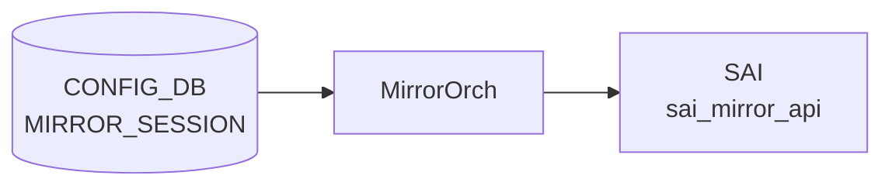

# MIRROR_SESSION テーブル

## 概要

ポートミラーリング (SPAN / ERSPAN) セッションを CONFIG_DB で定義するテーブル。`MirrorOrch` が CONFIG_DB を購読し、SAI MIRROR_SESSION オブジェクトに変換する[^1]。ERSPAN では outer GRE/IP ヘッダ用パラメータ (src_ip / dst_ip / dscp / ttl / gre_type) を伴い、SPAN では `dst_port` (ローカル物理ポートまたは `CPU`) を指定する。

<!-- cdb-mermaid -->
### データフロー (自動生成)



!!! note "凡例"
    CONFIG_DB から SAI までの典型経路を `docs/reference/config-db-orch-map.md` から機械生成したミニ図。詳細・例外は本ページ本文と対応表を参照。
<!-- /cdb-mermaid -->

## key 構造

```
MIRROR_SESSION|<name>
```

`<name>` は 1〜32 文字、英数字始まりで `[-a-zA-Z0-9_]` を含む。

## 主要フィールド

| フィールド | 型 | 必須 | 既定 | 説明 |
|-----------|----|------|------|------|
| `type` | enum `ERSPAN`/`SPAN` | no | `ERSPAN` | セッションタイプ |
| `src_ip` | ip-address | ERSPAN 時 | - | ERSPAN 外側 IP のソース |
| `dst_ip` | ip-address | ERSPAN 時 | - | ERSPAN 外側 IP の宛先 |
| `gre_type` | hex / dec uint16 | no | `0x88be` | ERSPAN 外側 GRE type |
| `dscp` | uint8 (0..63) | no | - | ERSPAN 外側 DSCP |
| `ttl` | uint8 (0..255) | no | - | ERSPAN 外側 TTL |
| `queue` | uint8 | no | - | ミラーフレームを送出する egress queue |
| `dst_port` | leafref `PORT.name` または `CPU` | SPAN 時 | - | SPAN 出力ポート |
| `src_port` | string (1..2048) | no | - | SPAN/ERSPAN 共通: ソース PORT または PORTCHANNEL のリスト |
| `direction` | enum `RX`/`TX`/`BOTH` | no | `BOTH` | キャプチャ方向 |
| `policer` | leafref `POLICER.name` | no | - | 鏡像トラフィックに適用する policer |

## 制約

- `src_ip` と `dst_ip` は同一 IP version でなければならない (`must` 制約)
- `src_ip`/`dst_ip`/`gre_type`/`dscp`/`ttl` は `type = 'ERSPAN'` のときのみ有効 (`when`)
- `dst_port` は `type = 'SPAN'` のときのみ有効

## 購読者

- `swss` 内の `orchagent` (`MirrorOrch`)
- 関連 STATE_DB: `MIRROR_SESSION_TABLE` にセッションのアクティブ状態が反映される

## 関連 CONFIG_DB / YANG / CLI

- 関連 CONFIG_DB: `POLICER`、`PORT`、`PORTCHANNEL`
- 関連 CLI: `config mirror_session add/remove`
- 関連 YANG: `sonic-mirror-session`、`sonic-policer`

<!-- ref-triangle:start -->

## 関連リファレンス

- YANG: [`sonic-mirror-session`](../yang/sonic-mirror-session.md)
- CLI: [`config mirror_session`](../cli/config-mirror-session.md)

<!-- ref-triangle:end -->

## 引用元

[^1]: YANG 定義: `sonic-mirror-session.yang`. <https://github.com/sonic-net/sonic-buildimage/blob/9ea932ec2e18f35e58268ec2e4456b1d4afd65cd/src/sonic-yang-models/yang-models/sonic-mirror-session.yang>

<!-- topics-back-ref -->
## 関連 Topics

- [Topics: ACL / CoPP / Mirror / Packet Action](../../topics/07-acl-copp-mirror/index.md)

<!-- /topics-back-ref -->
