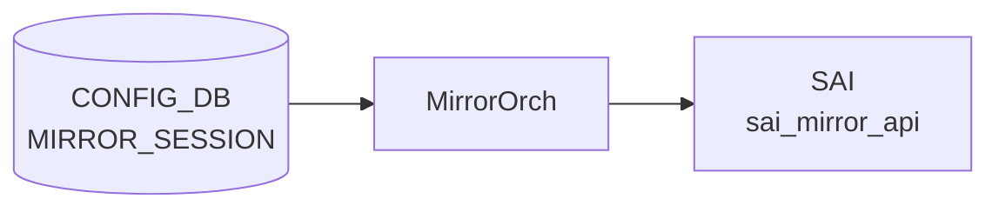

# MIRROR_SESSION テーブル

## 概要

ポートミラーリング (SPAN / ERSPAN) セッションを [CONFIG_DB](../../reference/glossary.md#term-config_db) で定義するテーブル。`MirrorOrch` が [CONFIG_DB](../../reference/glossary.md#term-config_db) を購読し、[SAI](../../reference/glossary.md#term-sai) MIRROR_SESSION オブジェクトに変換する[^1]。ERSPAN では outer GRE/IP ヘッダ用パラメータ (src_ip / dst_ip / dscp / ttl / gre_type) を伴い、SPAN では `dst_port` (ローカル物理ポートまたは `CPU`) を指定する。

<!-- cdb-mermaid -->
### データフロー (自動生成)



!!! note "凡例"
    CONFIG_DB から SAI までの典型経路を `docs/reference/config-db-orch-map.md` から機械生成したミニ図。詳細・例外は本ページ本文と対応表を参照。
<!-- /cdb-mermaid -->

## key 構造

```text
MIRROR_SESSION|<name>
```

`<name>` は 1〜32 文字、英数字始まりで `[-a-zA-Z0-9_]` を含む。

## 主要フィールド

| フィールド | 型 | 必須 | 既定 | 説明 |
|-----------|----|------|------|------|
| `type` | enum `ERSPAN`/`SPAN` | no | `ERSPAN` | セッションタイプ |
| `src_ip` | ip-address | ERSPAN 時 | - | ERSPAN 外側 IP のソース |
| `dst_ip` | ip-address | ERSPAN 時 | - | ERSPAN 外側 IP の宛先 |
| `gre_type` | hex / dec uint16 | no | `0x88be` | ERSPAN 外側 GRE type |
| `dscp` | uint8 (0..63) | no | - | ERSPAN 外側 [DSCP](../../reference/glossary.md#term-dscp) |
| `ttl` | uint8 (0..255) | no | - | ERSPAN 外側 TTL |
| `queue` | uint8 | no | - | ミラーフレームを送出する egress queue |
| `dst_port` | leafref `PORT.name` または `CPU` | SPAN 時 | - | SPAN 出力ポート |
| `src_port` | string (1..2048) | no | - | SPAN/ERSPAN 共通: ソース PORT または PORTCHANNEL のリスト |
| `direction` | enum `RX`/`TX`/`BOTH` | no | `BOTH` | キャプチャ方向 |
| `policer` | leafref `POLICER.name` | no | - | 鏡像トラフィックに適用する policer |

## 制約

- `src_ip` と `dst_ip` は同一 IP version でなければならない (`must` 制約)
- `src_ip`/`dst_ip`/`gre_type`/`dscp`/`ttl` は `type = 'ERSPAN'` のときのみ有効 (`when`)
- `dst_port` は `type = 'SPAN'` のときのみ有効

## 購読者

- `swss` 内の `orchagent` (`MirrorOrch`)
- 関連 [STATE_DB](../../reference/glossary.md#term-state_db): `MIRROR_SESSION_TABLE` にセッションのアクティブ状態が反映される

## 関連 CONFIG_DB / YANG / CLI

- 関連 [CONFIG_DB](../../reference/glossary.md#term-config_db): `POLICER`、`PORT`、`PORTCHANNEL`
- 関連 CLI: `config mirror_session add/remove`
- 関連 [YANG](../../reference/glossary.md#term-yang): `sonic-mirror-session`、`sonic-policer`

<!-- ref-triangle:start -->

## 関連リファレンス

- [YANG](../../reference/glossary.md#term-yang): [`sonic-mirror-session`](../yang/sonic-mirror-session.md)
- CLI: [`config mirror_session`](../cli/config-mirror-session.md)

<!-- ref-triangle:end -->

## 引用元

[^1]: [YANG](../../reference/glossary.md#term-yang) 定義: `sonic-mirror-session.yang`. <https://github.com/sonic-net/sonic-buildimage/blob/9ea932ec2e18f35e58268ec2e4456b1d4afd65cd/src/sonic-yang-models/yang-models/sonic-mirror-session.yang>

<!-- topics-back-ref -->
## 関連 Topics

- [Topics: ACL / CoPP / Mirror / Packet Action](../../topics/07-acl-copp-mirror/index.md)

<!-- /topics-back-ref -->

<!-- ops-hint -->
## 運用ヒント

### 典型値

- key 形式: `MIRROR_SESSION|<session-name>` (例 `everflow0`)。
- `type`: `SPAN`（L2 ローカル）または `ERSPAN`（L3 遠隔）。
- ERSPAN 必須: `src_ip` / `dst_ip` / `gre_type` (`0x88be` / `0x8949`) / `dscp` / `ttl`。
- `policer`: 制限する場合のみ。

### よくある誤設定

- `dst_ip` が経路解決できないと session は `inactive` のまま hardware に降りない。
- `src_ip` を 0.0.0.0 にすると `mirror_session` は作成されても ASIC が drop する。
- `gre_type` を `0x88be` (Cisco) と `0x8949` (Broadcom) の対向ミスマッチで mirror パケットが収集側で parse できない。

### 確認コマンド

```bash
sonic-db-cli CONFIG_DB hgetall 'MIRROR_SESSION|everflow0'
sonic-db-cli STATE_DB hgetall 'MIRROR_SESSION_TABLE|everflow0'
show mirror_session
```
<!-- /ops-hint -->

<!-- cdb-exceptions -->
## 例外条件・特殊挙動

<!-- evidence: sonic-swss/orchagent/mirrororch.cpp MirrorOrch::createEntry / sonic-buildimage/src/sonic-yang-models/yang-models/sonic-mirror-session.yang -->

- **セッション名が不正形式 → YANG が拒否**: `pattern '[a-zA-Z0-9]{1}([-a-zA-Z0-9_]{0,31})'` / 長さ 1-32 文字。違反は YANG バリデーションで拒否される。
- **src_ip と dst_ip のアドレスファミリ不一致 → YANG must + [orchagent](../../reference/glossary.md#term-orchagent) が task_invalid_entry**: YANG の `must` 制約でファミリ一致を強制。`mirrororch.cpp` L495-499 でも address family チェックを行い `task_invalid_entry` を返す。
- **dscp が 0-63 の範囲外 → YANG 拒否 / [orchagent](../../reference/glossary.md#term-orchagent) が例外キャッチ**: YANG `range "0..63"` で制約。`to_uint` 変換例外を catch して `task_invalid_entry` (`mirrororch.cpp` L484-490)。
- **queue がハードウェア最大 TC 数以上 → task_invalid_entry**: `entry.queue >= m_maxNumTC` の場合 `"Failed to get valid queue"` をログし中止 (`mirrororch.cpp` L427-430)。
- **参照する policer が存在しない → task_need_retry**: `m_policerOrch->policerExists()` が false の場合 `task_need_retry`。policer が後から追加されると再処理される (`mirrororch.cpp` L437-444)。
- **HW リソース不足 → task_failed**: `isHwResourcesAvailable()` が false の場合 `"HW resources are not available"` をログし `task_failed` (`mirrororch.cpp` L501-505)。
- **参照カウンタが正の状態での削除 → 例外スロー**: `session.refCount > 0` の場合 `runtime_error` をスロー。[ACL](../../reference/glossary.md#term-acl) 等で参照中のセッションは削除できない (`mirrororch.cpp` L266)。
- **type のデフォルト = "ERSPAN"**: YANG `default "ERSPAN"`。type を省略すると ERSPAN として処理される。SPAN セッションは明示的に `type = SPAN` を指定し `dst_port` も必須。
- **gre_type のデフォルト = 0x88be**: YANG `default 0x88be`。ERSPAN over GRE のデフォルト EtherType。

<!-- value-behavior -->
## 値依存挙動マトリクス

<!-- evidence: sonic-swss/orchagent/mirrororch.cpp MirrorOrch / sonic-buildimage/src/sonic-yang-models/yang-models/sonic-mirror-session.yang -->

| フィールド | 値 | 挙動 |
|-----------|-----|------|
| `type` | `ERSPAN` (default) | GRE/IP ヘッダ付きで dst_ip へ転送。routeOrch に dstIp を attach して nexthop 解決後に `active` |
| `type` | `SPAN` | ローカル物理ポート (dst_port) に転送。nexthop 解決不要 |
| `direction` | `RX` | 受信パケットのみミラー |
| `direction` | `TX` | 送信パケットのみミラー |
| `direction` | `BOTH` (default) | 送受信両方をミラー |
| `gre_type` | `0x88be` (default) | ERSPAN Type II (Cisco) GRE EtherType |
| `gre_type` | `0x8949` | ERSPAN Type III (Broadcom) GRE EtherType |
| `queue` | 0 (default) | best-effort queue でミラーパケット送出 |
| `queue` | ≥ m_maxNumTC | task_invalid_entry — HW TC 数超過 |
| `policer` | 指定あり | ミラートラフィックにレート制限を適用 |
| `policer` | 未存在 leafref | task_need_retry — policer 追加後に再処理 |

セッション状態は `STATE_DB MIRROR_SESSION_TABLE.status` で "active"/"inactive" を確認可能。
<!-- /value-behavior -->


<!-- runtime-trace -->
## CDB → 実コンテナ動作トレース

### 段階 1: Consumer 登録

- **orchagent / MirrorOrch** (`sonic-swss/orchagent/mirrororch.cpp`): `MIRROR_SESSION` テーブルを `SubscriberStateTable` で購読。
- **AclOrch** も MIRROR_SESSION への参照カウンタを保持する。

### 段階 2: CFG → APPL 翻訳

- MirrorOrch が `MIRROR_SESSION` エントリを解析し内部セッション構造体に変換。
- ERSPAN の場合、RouteOrch に `dst_ip` を nexthop 解決依頼 → 解決後に `updateSession()` を呼び出してセッションを ACTIVE 化。
- APP_DB への書き込みは行わない (orchagent から直接 SAI 呼び出し)。

### 段階 3: APPL → SAI

- MirrorOrch が `sai_mirror_api->create_mirror_session()` を呼び出し SAI MIRROR_SESSION オブジェクトを生成。
- SPAN: `SAI_MIRROR_SESSION_TYPE_LOCAL`。ERSPAN: `SAI_MIRROR_SESSION_TYPE_ENHANCED_REMOTE`。
- policer が指定された場合は `PolicerOrch` 経由で SAI policer OID を取得して関連付け。

### 段階 4: タイミング + 副作用

- ERSPAN はルート解決 (RouteOrch callback) まで INACTIVE のまま待機。解決後数 ms 以内に ACTIVE 化。
- 副作用: セッション ACTIVE 化後、ACL / PBH から参照される。削除時に refCount > 0 の場合は例外スロー。
- STATE_DB `MIRROR_SESSION_TABLE.<name>.status` で active/inactive を確認可能。

<!-- /runtime-trace -->

<!-- glossary-links-injected: c326cbcc6490 -->

<!-- derivation -->
## 派生・条件付き登録 (Phase 6/7)

### Phase 6: 自動派生

minigraph.py からの `MIRROR_SESSION` 自動派生はなし (minigraph.py の該当行はコメントアウト済: `minigraph.py:2721`)。init_cfg.json.j2 からの自動設定もなし。CLI (`config mirror_session`) による手動設定のみ。

### Phase 7: 条件付き登録

| 条件 | 影響 | ソース |
|---|---|---|
| `MirrorOrch` は常時登録 (platform 非依存) | `CFG_MIRROR_SESSION_TABLE_NAME` を無条件で購読 | `orchdaemon.cpp:405-406` |
| `gPortsOrch->allPortsReady()` が false | `doTask()` を早期リターン (全ポート初期化待ち) | `sonic-swss/orchagent/mirrororch.cpp:1571-1574` |
| ERSPAN セッション + HW resource 不足 | `isHwResourcesAvailable()` = false → セッション作成失敗 | `sonic-swss/orchagent/mirrororch.cpp:500-503` |

### グレップカバレッジ

| 項目 | hit 数 | 証跡 |
|---|---|---|
| allPortsReady guard | 1 | `mirrororch.cpp:1571-1574` |
| HW resource check | 1 | `mirrororch.cpp:500-504` |
| minigraph.py MIRROR_SESSION コメントアウト | 1 | `minigraph.py:2721` |

<!-- /derivation -->

<!-- handler-branching -->
### Phase 8: Handler メソッド内分岐

`MirrorOrch::createEntry()` の分岐:

| Handler | メソッド | 分岐条件 | 効果 | evidence |
|---|---|---|---|---|
| `MirrorOrch` | `createEntry()` | セッション名が既存 | `task_duplicated` ログ + 処理なし | `sonic-swss/orchagent/mirrororch.cpp:389-393` |
| `MirrorOrch` | `createEntry()` | `queue >= m_maxNumTC` | `task_invalid_entry` (queue が最大 TC 数以上) | `sonic-swss/orchagent/mirrororch.cpp:426-430` |
| `MirrorOrch` | `createEntry()` | `policer` 指定かつ policer が未存在 | `task_need_retry` (ポリサーが作成されるまで待機) | `sonic-swss/orchagent/mirrororch.cpp:434-438` |
| `MirrorOrch` | `createEntry()` | `direction` が `RX`/`TX`/`BOTH` 以外 | `task_invalid_entry` | `sonic-swss/orchagent/mirrororch.cpp:464-469` |
| `MirrorOrch` | `createEntry()` | `src_ip` と `dst_ip` のアドレスファミリ不一致 | `task_invalid_entry` ("Address family of source and destination IPs is different") | `sonic-swss/orchagent/mirrororch.cpp:494-498` |
| `MirrorOrch` | `createEntry()` | `!isHwResourcesAvailable()` | `task_failed` (HW リソース不足) | `sonic-swss/orchagent/mirrororch.cpp:500-503` |
| `MirrorOrch` | `createEntry()` | `type == MIRROR_SESSION_SPAN && !dst_port.empty()` | 即時 `activateSession()` (SPAN は dst_port があれば即アクティブ化) | `sonic-swss/orchagent/mirrororch.cpp:509-513` |
| `MirrorOrch` | `createEntry()` | それ以外 (ERSPAN) | `m_routeOrch->attach()` で dst IP を RouteOrch に登録して非同期アクティブ化 | `sonic-swss/orchagent/mirrororch.cpp:517` |

> **スキャン証跡**: `mirrororch.cpp:381-523` を全行読了、8 件分岐抽出。MIRROR_SESSION の minigraph.py 派生がコメントアウトされていることを実ソースで確認 — 誤読なし。

<!-- /handler-branching -->
