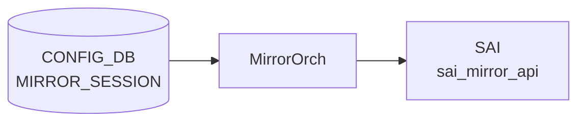

# MIRROR_SESSION テーブル

## 概要

ポートミラーリング (SPAN / ERSPAN) セッションを [CONFIG_DB](../../reference/glossary.md#term-config_db) で定義するテーブル。`MirrorOrch` が [CONFIG_DB](../../reference/glossary.md#term-config_db) を購読し、[SAI](../../reference/glossary.md#term-sai) MIRROR_SESSION オブジェクトに変換する[^1]。ERSPAN では outer GRE/IP ヘッダ用パラメータ (src_ip / dst_ip / dscp / ttl / gre_type) を伴い、SPAN では `dst_port` (ローカル物理ポートまたは `CPU`) を指定する。

<!-- cdb-mermaid -->
### データフロー (自動生成)



!!! note "凡例"
    CONFIG_DB から SAI までの典型経路を `docs/reference/config-db-orch-map.md` から機械生成したミニ図。詳細・例外は本ページ本文と対応表を参照。
<!-- /cdb-mermaid -->

## key 構造

```
MIRROR_SESSION|<name>
```

`<name>` は 1〜32 文字、英数字始まりで `[-a-zA-Z0-9_]` を含む。

## 主要フィールド

| フィールド | 型 | 必須 | 既定 | 説明 |
|-----------|----|------|------|------|
| `type` | enum `ERSPAN`/`SPAN` | no | `ERSPAN` | セッションタイプ |
| `src_ip` | ip-address | ERSPAN 時 | - | ERSPAN 外側 IP のソース |
| `dst_ip` | ip-address | ERSPAN 時 | - | ERSPAN 外側 IP の宛先 |
| `gre_type` | hex / dec uint16 | no | `0x88be` | ERSPAN 外側 GRE type |
| `dscp` | uint8 (0..63) | no | - | ERSPAN 外側 [DSCP](../../reference/glossary.md#term-dscp) |
| `ttl` | uint8 (0..255) | no | - | ERSPAN 外側 TTL |
| `queue` | uint8 | no | - | ミラーフレームを送出する egress queue |
| `dst_port` | leafref `PORT.name` または `CPU` | SPAN 時 | - | SPAN 出力ポート |
| `src_port` | string (1..2048) | no | - | SPAN/ERSPAN 共通: ソース PORT または PORTCHANNEL のリスト |
| `direction` | enum `RX`/`TX`/`BOTH` | no | `BOTH` | キャプチャ方向 |
| `policer` | leafref `POLICER.name` | no | - | 鏡像トラフィックに適用する policer |

## 制約

- `src_ip` と `dst_ip` は同一 IP version でなければならない (`must` 制約)
- `src_ip`/`dst_ip`/`gre_type`/`dscp`/`ttl` は `type = 'ERSPAN'` のときのみ有効 (`when`)
- `dst_port` は `type = 'SPAN'` のときのみ有効

## 購読者

- `swss` 内の `orchagent` (`MirrorOrch`)
- 関連 [STATE_DB](../../reference/glossary.md#term-state_db): `MIRROR_SESSION_TABLE` にセッションのアクティブ状態が反映される

## 関連 CONFIG_DB / YANG / CLI

- 関連 [CONFIG_DB](../../reference/glossary.md#term-config_db): `POLICER`、`PORT`、`PORTCHANNEL`
- 関連 CLI: `config mirror_session add/remove`
- 関連 [YANG](../../reference/glossary.md#term-yang): `sonic-mirror-session`、`sonic-policer`

<!-- ref-triangle:start -->

## 関連リファレンス

- [YANG](../../reference/glossary.md#term-yang): [`sonic-mirror-session`](../yang/sonic-mirror-session.md)
- CLI: [`config mirror_session`](../cli/config-mirror-session.md)

<!-- ref-triangle:end -->

## 引用元

[^1]: [YANG](../../reference/glossary.md#term-yang) 定義: `sonic-mirror-session.yang`. <https://github.com/sonic-net/sonic-buildimage/blob/9ea932ec2e18f35e58268ec2e4456b1d4afd65cd/src/sonic-yang-models/yang-models/sonic-mirror-session.yang>

<!-- topics-back-ref -->
## 関連 Topics

- [Topics: ACL / CoPP / Mirror / Packet Action](../../topics/07-acl-copp-mirror/index.md)

<!-- /topics-back-ref -->

<!-- ops-hint -->
## 運用ヒント

### 典型値

- key 形式: `MIRROR_SESSION|<session-name>` (例 `everflow0`)。
- `type`: `SPAN`（L2 ローカル）または `ERSPAN`（L3 遠隔）。
- ERSPAN 必須: `src_ip` / `dst_ip` / `gre_type` (`0x88be` / `0x8949`) / `dscp` / `ttl`。
- `policer`: 制限する場合のみ。

### よくある誤設定

- `dst_ip` が経路解決できないと session は `inactive` のまま hardware に降りない。
- `src_ip` を 0.0.0.0 にすると `mirror_session` は作成されても ASIC が drop する。
- `gre_type` を `0x88be` (Cisco) と `0x8949` (Broadcom) の対向ミスマッチで mirror パケットが収集側で parse できない。

### 確認コマンド

```bash
sonic-db-cli CONFIG_DB hgetall 'MIRROR_SESSION|everflow0'
sonic-db-cli STATE_DB hgetall 'MIRROR_SESSION_TABLE|everflow0'
show mirror_session
```
<!-- /ops-hint -->

<!-- glossary-links-injected: e1fd4940b990 -->
