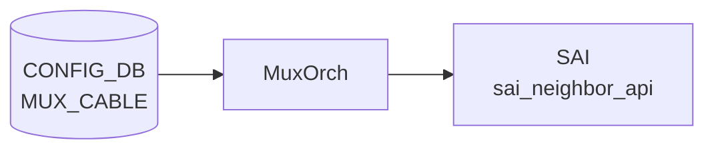

# MUX_CABLE テーブル（per-port フィールド詳細）

## 概要

`MUX_CABLE|<ifname>` は Dual-ToR 構成で各 server-facing port に紐付く mux cable の per-port 設定エントリ[^1]。
`linkmgrd` と `ycabled` (`sonic-ycabled`) が [CONFIG_DB](../../reference/glossary.md#term-config_db) の `MUX_CABLE` テーブルを購読し、
それぞれ `cable_type` / `state` / `soc_ipv4` などを読み取ってステートマシンと gRPC チャネルを制御する。

本ページは **コード由来のデフォルト・fallback 動作** に焦点を当てる。テーブル全体の概要は [`MUX_CABLE`](mux-cable.md) を参照。

<!-- cdb-mermaid -->
### データフロー (自動生成)



!!! note "凡例"
    CONFIG_DB から SAI までの典型経路を `docs/reference/config-db-orch-map.md` から機械生成したミニ図。詳細・例外は本ページ本文と対応表を参照。
<!-- /cdb-mermaid -->

## key 構造

```text
MUX_CABLE|<ifname>
```

`<ifname>` は `PORT.name` への leafref。

## フィールド

| フィールド | 型 | [YANG](../../reference/glossary.md#term-yang) default | 説明 |
|-----------|----|-------------|------|
| `cable_type` | enum `active-active`/`active-standby` | `active-standby` | ケーブル種別。ycabled と [linkmgrd](../../reference/glossary.md#term-linkmgrd) のステートマシン分岐を決定 |
| `state` | enum `auto`/`manual`/`detach`/`active`/`standby` | `auto` | [MUX](../../reference/glossary.md#term-mux) 動作モード。`auto` が自動 failover |
| `server_ipv4` | ipv4-prefix | — | サーバ IPv4 アドレス ([orchagent](../../reference/glossary.md#term-orchagent) が無条件参照するため実質 mandatory) |
| `server_ipv6` | ipv6-prefix | — | サーバ IPv6 アドレス (同上) |
| `soc_ipv4` | ipv4-prefix | — | SoC IPv4 (active-active 専用。ycabled の gRPC セットアップに必須) |
| `soc_ipv6` | ipv6-prefix | — | SoC IPv6 (active-active 専用。ycabled 未参照、[linkmgrd](../../reference/glossary.md#term-linkmgrd) は no-op) |
| `prober_type` | enum `hardware`/`software` | `software` | ICMP prober モード。[ASIC](../../reference/glossary.md#term-asic) 非対応時は silent に `software` 降格 |
| `neighbor_mode` | enum `prefix-route`/`host-route` | `host-route` | neighbor 経路モード。[SAI](../../reference/glossary.md#term-sai) 非対応 [ASIC](../../reference/glossary.md#term-asic) では silent に `host-route` 動作 |

## 購読者

- **ycabled** (`sonic-ycabled`): `y_cable_table_helper.py` が `swsscommon.Table(config_db, "MUX_CABLE")` で各 [ASIC](../../reference/glossary.md#term-asic) ごとに `port_tbl` を保持。
  `check_mux_cable_port_type()` が `cable_type` と `state` を参照してポートを active-active / active-standby に分類する。
- **[linkmgrd](../../reference/glossary.md#term-linkmgrd)**: `ConfigDBConnector` で `MUX_CABLE` を購読。`processPortCableType()` / `processProberType()` / `processSoCIpAddress()` で per-port 設定を反映。
- **[orchagent](../../reference/glossary.md#term-orchagent)** (`MuxOrch`): `CFG_MUX_CABLE_TABLE_NAME` を購読し [SAI](../../reference/glossary.md#term-sai) nexthop を操作。

<!-- defaults -->
## コード由来の暗黙デフォルト

<!-- evidence:
  sonic-platform-daemons/sonic-ycabled/ycable/ycable_utilities/y_cable_helper.py:295-320,660-718
  sonic-linkmgrd/src/DbInterface.cpp:827,880-881,910-946,968-1001
  sonic-swss/orchagent/muxorch.cpp:2206-2207,2240
  sonic-buildimage/src/sonic-yang-models/yang-models/sonic-mux-cable.yang
-->

| フィールド | YANG default | コード実装の fallback / 乖離 | 乖離種別 |
|-----------|-------------|---------------------------|---------|
| `cable_type` | `active-standby` | ycabled: 欠落時 `None` → else ブランチで `"active-standby"` 扱い (y_cable_helper.py:317); linkmgrd: `"active-standby"` 明示 fallback (DbInterface.cpp:827) | 乖離なし |
| `state` | `auto` | ycabled: `state` キー自体が存在しない場合 `(False, None)` を返しポートをスキップ (y_cable_helper.py:319); linkmgrd: 欠落で MUXLOGERROR + 処理続行 (DbInterface.cpp:996) | **キー欠落時のスキップ** |
| `soc_ipv4` | — (optional) | ycabled: `"state" in dict and "soc_ipv4" in dict` の二重条件 (y_cable_helper.py:672) — 欠落で gRPC セットアップ未実施; linkmgrd: 欠落 → no-op (DbInterface.cpp:922) | **active-active 時に実質 mandatory** |
| `soc_ipv6` | — (optional) | ycabled: 参照なし; linkmgrd: 欠落 → no-op | 乖離なし |
| `prober_type` | `software` | `hw_offload_capable=false` または欠落 → 強制 `"software"` (DbInterface.cpp:880-881) | プラットフォーム依存 silent 降格 |
| `server_ipv4` | — (optional) | [orchagent](../../reference/glossary.md#term-orchagent): `getAttrIpPrefix("server_ipv4")` を無条件呼出し ([muxorch](../../reference/glossary.md#term-muxorch).cpp:2206) — 欠落で `std::out_of_range` 例外 | **YANG optional vs 実装 mandatory** |
| `server_ipv6` | — (optional) | orchagent: 同上 ([muxorch](../../reference/glossary.md#term-muxorch).cpp:2207) | **YANG optional vs 実装 mandatory** |
| `neighbor_mode` | `host-route` | [SAI](../../reference/glossary.md#term-sai) が `SAI_NEIGHBOR_ENTRY_ATTR_NO_HOST_ROUTE` 非対応 → silent に `host-route` 動作 ([muxorch](../../reference/glossary.md#term-muxorch).cpp:2240) | プラットフォーム依存 silent 無視 |

### 注記

- **`cable_type` 欠落時の安全 fallback**: ycabled (`y_cable_helper.py:312-317`) は `cable_type == "active-active"` を明示チェックし、それ以外（`None` を含む）は `"active-standby"` として扱う。linkmgrd (`DbInterface.cpp:827`) も同様に `"active-standby"` を fallback として採用。YANG default と一致しており問題なし。
- **`state` キー欠落でのポートスキップ**: ycabled の `check_mux_cable_port_type()` は `"state" in mux_table_dict` チェックを行い、キーが存在しない場合 `(False, None)` を返す。呼出し元では `status=False` を受け取ると当該ポートへの gRPC チャネル設定を行わない。エントリ作成の直後など `state` が未書き込みの瞬間がある場合はポートが無視される。
- **`soc_ipv4` の active-active 時の実質 mandatory**: ycabled の gRPC チャネルセットアップ (`y_cable_helper.py:672`) は `"state" in dict and "soc_ipv4" in dict` を前提条件としており、`soc_ipv4` が欠落すると `cable_type=active-active` であっても gRPC セッションが確立されない。YANG は optional として定義しているが、active-active 構成では事実上必須。linkmgrd (`processSoCIpAddress`) は欠落時 no-op で graceful に処理する。
- **`prober_type = hardware` の silent 降格**: `SWITCH_CAPABILITY.ICMP_OFFLOAD_CAPABLE != "true"` の ASIC では、`hardware` と設定してもエラーなく `software` として動作する。ログ (`MUXLOGWARNING`) のみ出力。
- **`server_ipv4` / `server_ipv6` の実質 mandatory**: YANG は optional だが、orchagent の `handleMuxCfg` が `getAttrIpPrefix()` を無条件呼出しするため欠落で `std::out_of_range` 例外が発生し orchagent が異常終了する可能性がある。minigraph 経由では `lo_addr` から自動補完される。手動設定時は必須。

<!-- /defaults -->

<!-- ordering -->
## 書込み順依存

<!-- evidence: sonic-swss/orchagent/muxorch.cpp handleMuxCfg:2202 / handlePeerSwitch:2336 / addOperation:2394; sonic-linkmgrd/src/DbInterface.cpp:1843-1849 -->

`MUX_CABLE|<port>` エントリの SAI 反映は `PEER_SWITCH` の設定完了と `MuxTunnel0` トンネルの存在に依存する。orchagent は `Orch2` フレームワーク経由で `MuxOrch::handleMuxCfg()` を呼び出す（`orch.cpp:1226` の `Orch2::doTask()` 経由）。

### 依存 1: PEER_SWITCH 先行必須（必須先行・自動回復あり）

```
PEER_SWITCH|<name>  SET (address_ipv4 確定)  先行
  ↓
MUX_CABLE|<port>  SET
```

`handleMuxCfg()` (`muxorch.cpp:2271`) は `mux_peer_switch_.isZero()` を確認する。`PEER_SWITCH` エントリが未設定の間は `SWSS_LOG_INFO("Mux Peer switch addr not yet configured")` → `return false` で `m_toSync` に保留し次のイベントループで再試行する。

**違反時**: `PEER_SWITCH` SET 完了後の次イベントループで自動的に処理される（自動回復あり）。

### 依存 2: TUNNEL MuxTunnel0 → PEER_SWITCH チェーン

```
APP_DB TUNNEL_DECAP_TABLE:MuxTunnel0  存在  先行
  ↓
PEER_SWITCH|<name>  SET
  ↓
MUX_CABLE|<port>  SET
```

`handlePeerSwitch()` (`muxorch.cpp:2348-2354`) は `decap_orch_->getDstIpAddresses(MUX_TUNNEL)` が空の場合 `return false` でリトライに戻す。`MuxTunnel0` トンネルが APP_DB に存在しなければ PEER_SWITCH 自体も処理できず、MUX_CABLE の処理も間接的にブロックされる。

**違反時**: `MuxTunnel0` 追加後の次イベントループで自動回復。

### 依存 3: server_ipv4 / server_ipv6 同一 SET_COMMAND 必須（自動回復なし）

`handleMuxCfg()` (`muxorch.cpp:2206-2207`) はフィールドリスト走査前に `getAttrIpPrefix("server_ipv4")` と `getAttrIpPrefix("server_ipv6")` を **無条件** で呼び出す。これらが欠落すると `std::out_of_range` 例外が発生し `addOperation()` の catch ブロック (`muxorch.cpp:2409`) で捕捉されエントリが erase される。

**違反時**: エントリ破棄（自動回復なし）。`server_ipv4` / `server_ipv6` は必ず同一 SET_COMMAND に含める。

### 依存 4: linkmgrd 起動時の初期読み込み順序

linkmgrd は起動時に以下の順序で `MUX_CABLE` テーブルを読み込む（`DbInterface.cpp:1846-1849`）:

```
getPortCableType()   # cable_type を全ポート読み込み
getProberType()      # prober_type を全ポート読み込み
getServerIpAddress() # server_ipv4 / server_ipv6 を全ポート読み込み
getSoCIpAddress()    # soc_ipv4 を全ポート読み込み
```

この順序は固定。初期読み込み中の MUX_CABLE 変更は Subscribe ループで後から処理される。

### 依存 5: neighbor_mode 変更の禁止（運用注意）

既存 mux ポートに対する `neighbor_mode` の変更は orchagent によって拒否される (`muxorch.cpp:2258-2266`)。`SWSS_LOG_ERROR("Neighbor mode change is not allowed")` が出力され `return false` でリトライに保留されるが、元の `neighbor_mode` が存在する限り永続的に失敗する。変更する場合はポートを `DEL` してから再 `SET` する必要がある。

<!-- /ordering -->

<!-- cross-refs -->
## 暗黙参照・共依存コンポーネント

`MUX_CABLE|<ifname>` エントリは orchagent (`MuxOrch`)、`linkmgrd`、`ycabled` の 3 コンポーネントが参照する。YANG leafref により `ifname` は `PORT` テーブルとの整合性が保証され、`orchagent` は `PEER_SWITCH` と `TUNNEL` の存在を処理前提として要求する。

### YANG leafref 先

| leafref フィールド | 参照先テーブル | 条件 | evidence |
|------------------|--------------|------|---------|
| `ifname` | `PORT.PORT_LIST.name` ([CONFIG_DB](../../reference/glossary.md#term-config_db)) | `MUX_CABLE` エントリのキーは必ず PORT に存在するインタフェース名 | `sonic-mux-cable.yang:37-40` |

### orchagent が依存する入力テーブル

| 参照先テーブル | 参照方向 | 条件 | evidence |
|--------------|---------|------|---------|
| `PEER_SWITCH\|<name>` (CONFIG_DB) | 処理前提 (先行必須) | `address_ipv4` が未確定の間は `handleMuxCfg()` が `return false` で保留。自動回復あり | `muxorch.cpp:2271` |
| `TUNNEL\|MuxTunnel0` (CONFIG_DB) | `TunnelDecapOrch` キャッシュ経由 | `handlePeerSwitch()` が `getDstIpAddresses("MuxTunnel0")` 等でトンネル情報を取得。未存在なら `return false` でリトライ | `muxorch.cpp:2348, 2359, 2367, 2374` |
| `PORT\|<ifname>` (CONFIG_DB / PortsOrch キャッシュ) | `gPortsOrch->getPort()` 経由 | `MuxCable` 状態遷移時にポート SAI oid を取得。未登録なら即リターン | `muxorch.cpp:468, 493` |
| `NEIGHBOR_TABLE` ([APPL_DB](../../reference/glossary.md#term-appl_db) / NeighOrch キャッシュ) | `gNeighOrch->getMuxNeighborsForPort()` 経由 | `addOperation()` 末尾で既存ネイバーを [MUX](../../reference/glossary.md#term-mux) ネイバーに変換 | `muxorch.cpp:2290` |

### orchagent が書き出す STATE/APP テーブル

| DB | テーブル名 | キー | 書込みフィールド | タイミング | evidence |
|-----|---------|-----|-----------------|---------|---------|
| [STATE_DB](../../reference/glossary.md#term-state_db) | `MUX_CABLE_TABLE` | `<ifname>` | `neighbor_mode` (`"host-route"` / `"prefix-route"`) | `handleMuxCfg()` 処理時 1 回、`neighbor_mode` フィールド確定後 | `muxorch.cpp:2283-2285` |
| [APPL_DB](../../reference/glossary.md#term-appl_db) | `HW_MUX_CABLE_TABLE` | `<ifname>` | `state` (mux の HW 状態) | mux state 切替時 (`MuxCable::setState()`) | `muxorch.cpp:2510-2513` |

### linkmgrd が依存する入力テーブル

| 参照先テーブル | 参照方向 | タイミング | evidence |
|--------------|---------|---------|---------|
| `MUX_CABLE` (CONFIG_DB) | `Table` 直読み (起動時一括) + `SubscriberStateTable` (ランタイム) | 起動時に全ポートの `cable_type`/`prober_type`/`server_ipv4`/`soc_ipv4` を取得。以降は変更通知 | `DbInterface.cpp:801, 843, 898, 956, 1824` |
| `PORT_TABLE` ([APPL_DB](../../reference/glossary.md#term-appl_db)) | `SubscriberStateTable` 購読 | リンク状態変化を検知して mux ステートマシンをトリガ | `DbInterface.cpp:1827` |

### linkmgrd が書き出す STATE/APP テーブル

| DB | テーブル名 | 用途 | evidence |
|-----|---------|------|---------|
| APPL_DB | `MUX_CABLE_TABLE` | mux 状態コマンド | `DbInterface.cpp:317` |
| APPL_DB | `MUX_CABLE_COMMAND_TABLE` | active/standby 切替コマンド | `DbInterface.cpp:323` |
| APPL_DB | `FORWARDING_STATE_COMMAND` | フォワーディング状態コマンド | `DbInterface.cpp:326` |
| [STATE_DB](../../reference/glossary.md#term-state_db) | `MUX_LINKMGR_TABLE` | linkmgrd 内部状態 | `DbInterface.cpp:332` |
| [STATE_DB](../../reference/glossary.md#term-state_db) | `MUX_METRICS_TABLE` | 切替メトリクス | `DbInterface.cpp:335` |
| STATE_DB | `MUX_SWITCH_CAUSE` | 切替理由 | `DbInterface.cpp:341`, `DbInterface.h:63` |
| STATE_DB | `MUX_CABLE_TABLE` | mux 現在状態 | `DbInterface.cpp:346` |

### ycabled が依存する入力テーブル

| 参照先テーブル | 参照方向 | タイミング | evidence |
|--------------|---------|---------|---------|
| `MUX_CABLE` (CONFIG_DB) | `swsscommon.Table` 直読み (ASIC ごと) | 起動時・gRPC チャネルセットアップ時に `cable_type`/`state`/`soc_ipv4` を取得 | `y_cable_helper.py:295-320, 734-739` |

### ycabled が書き出す STATE テーブル

| DB | テーブル名 | 用途 | evidence |
|-----|---------|------|---------|
| STATE_DB | `HW_MUX_CABLE_TABLE` (`STATE_HW_MUX_CABLE_TABLE_NAME`) | gRPC 経由の HW mux 状態 | `y_cable_helper.py:741-742` |
| STATE_DB | `HW_MUX_CABLE_TABLE_PEER` | peer 側 HW mux 状態 | `y_cable_helper.py:743-744` |
| STATE_DB | `MUX_CABLE_INFO` | ケーブル情報 | `y_cable_helper.py:746` |

<!-- /cross-refs -->

<!-- failure -->
## 失敗挙動

`MUX_CABLE|<ifname>` エントリは `MuxOrch::handleMuxCfg()` → `addOperation()` 経路で処理される。orchagent・ycabled・linkmgrd の 3 コンポーネントそれぞれに固有の失敗経路がある。

<!-- evidence: sonic-swss/orchagent/muxorch.cpp:2202-2290,2394-2415; sonic-linkmgrd/src/DbInterface.cpp:990-1001; sonic-platform-daemons/sonic-ycabled/ycable/ycable_utilities/y_cable_helper.py:295-320,660-718 -->

### A. orchagent (MuxOrch) の失敗パターン

| 失敗条件 | 検出箇所 | 結果 | retry | evidence |
|---|---|---|---|---|
| `server_ipv4` / `server_ipv6` が SET_COMMAND に欠落 | `handleMuxCfg()` 冒頭 `getAttrIpPrefix()` | `std::out_of_range` 例外が `addOperation()` の catch (runtime_error のみ) をすり抜け orchagent abort | なし (プロセス異常終了) | `muxorch.cpp:2206-2207, 2411` |
| `mux_peer_switch_.isZero()` — PEER_SWITCH 未設定 | `handleMuxCfg()` L2271 | `return false` → `m_toSync` 保留 | 自動 (PEER_SWITCH SET 後の次イベントループ) | `muxorch.cpp:2271` |
| 既存 mux ポートへの `neighbor_mode` 変更試行 | `handleMuxCfg()` L2258-2266 | `SWSS_LOG_ERROR` → `return false` → 永続保留 | なし (手動 DEL → 再 SET が必要) | `muxorch.cpp:2258-2266` |
| 二重 SET (`isMuxExists == true`) | `handleMuxCfg()` L2253 | `SWSS_LOG_INFO` → `return true`（冪等スキップ） | 不要 | `muxorch.cpp:2253-2254` |
| DEL 時: エントリ不在 (`isMuxExists == false`) | `handleMuxCfg()` L2323 | `SWSS_LOG_ERROR` → `return true`（成功扱い）| なし | `muxorch.cpp:2323` |
| `std::runtime_error` 例外（tunnel 作成失敗等） | `addOperation()` / `delOperation()` catch | `SWSS_LOG_ERROR` → `return true`（erase・恒久スキップ）| なし | `muxorch.cpp:2411, 2435` |

!!! warning "`server_ipv4` / `server_ipv6` 欠落は orchagent abort"
    `addOperation()` は `std::runtime_error` のみ catch する。`getAttrIpPrefix()` が `server_ipv4` / `server_ipv6` 欠落で投げる `std::out_of_range` は派生でないため未捕捉となり、orchagent プロセスが abort する。`minigraph.py` 経由では自動補完されるが、手動で CONFIG_DB に直接投入する場合は両フィールドを必ず含める。

### B. ycabled の失敗パターン

| 失敗条件 | 検出箇所 | 結果 | retry | evidence |
|---|---|---|---|---|
| `port_tbl.get(port)` → `status=False`（エントリ不在） | `check_mux_cable_port_type()` L297 | `(False, None)` を返しポートをスキップ | なし | `y_cable_helper.py:297-301` |
| `"state"` キーが MUX_CABLE エントリに存在しない | `check_mux_cable_port_type()` L308 | `(False, None)` を返しポートをスキップ（silent skip、DEBUG ログのみ） | なし | `y_cable_helper.py:317-320` |
| `"soc_ipv4"` キーが欠落（active-active ポート） | `retry_setup_grpc_channel_for_port()` L363 条件不成立 | gRPC チャネルセットアップをスキップ、active-active 制御不能（silent skip） | 自動（定期スレッドが再試行）| `y_cable_helper.py:363` |
| gRPC チャネル確立失敗（channel / stub が None） | `retry_setup_grpc_channel_for_port()` L371 | `NOTICE` ログ → `return False` | 自動（定期スレッド） | `y_cable_helper.py:373-375` |

### C. linkmgrd の失敗パターン

| 失敗条件 | 検出箇所 | 結果 | retry | evidence |
|---|---|---|---|---|
| 起動時 `"state"` フィールド欠落 | `getPortMuxMode()` L996 | `MUXLOGERROR` → 当該ポートを `PortToMuxModeConfigMapping` に追加せず処理続行 | なし（起動時 1 回のみ）| `DbInterface.cpp:994-997` |
| `cable_type` / `prober_type` / `server_ipv4` / `soc_ipv4` 欠落 | 各 getter のフィールド探索 | フォールバック値または no-op で続行。`state` 欠落のみ ERROR、他は DEBUG 以下 | なし | `DbInterface.cpp:827, 880-881, 910-946, 968-1001` |

### D. ログ出力先

- orchagent エラーは `SWSS_LOG_ERROR` / `SWSS_LOG_INFO` で `/var/log/swss/orchagent.log` にのみ出力される。STATE_DB / `ERROR_TABLE` への書き込みは行われない。
- linkmgrd エラーは `/var/log/linkmgrd/linkmgrd.log` に `MUXLOGERROR` レベルで出力される。
- ycabled の silent skip はログが出力されないため、`show mux status` で状態を確認する必要がある。

### E. 失敗ケース全体サマリー

| ケース | 最悪の結果 | 回復方法 |
|---|---|---|
| `server_ipv4` / `server_ipv6` 欠落 | orchagent abort（systemd 再起動） | 両フィールドを含む SET_COMMAND を再投入 |
| `neighbor_mode` 変更試行 | 該当ポートの MUX_CABLE が永続保留 | ポートを DEL → 再 SET |
| `PEER_SWITCH` 未設定 | MUX_CABLE が `m_toSync` で無制限保留 | PEER_SWITCH エントリを先行設定（自動回復） |
| ycabled `soc_ipv4` 欠落（active-active）| gRPC チャネル未確立で active-active 制御不能 | `soc_ipv4` を CONFIG_DB に追記、ycabled 定期スレッドが自動再試行 |
| linkmgrd 起動時 `state` 欠落 | 該当ポートの mux mode 未反映 | `state` フィールド追記後 linkmgrd 再起動 |

<!-- /failure -->

<!-- constants -->
## ハードコード定数

<!-- evidence: sonic-swss/orchagent/muxorch.cpp:48-51, sonic-swss/orchagent/tunneldecaporch.h:21, sonic-linkmgrd/src/DbInterface.cpp:48,827,880-881 -->

`MuxOrch` と `linkmgrd` はフィールドのデフォルト値・[ACL](../../reference/glossary.md#term-acl) 名・トンネル名をソースコード上にハードコードしており、CONFIG_DB 経由での変更はできない。

### orchagent ハードコード定数（`muxorch.cpp:48-51`）

| 定数マクロ | 値 | 用途 |
|-----------|-----|------|
| `MUX_ACL_TABLE_NAME` | `"IngressTableDrop"` | ポートアイソレーション時に使用する [ACL](../../reference/glossary.md#term-acl) テーブル名（マクロ `INGRESS_TABLE_DROP` 経由で展開、`aclorch.h:111`） |
| `MUX_ACL_RULE_NAME` | `"mux_acl_rule"` | ポートアイソレーション時に使用する [ACL](../../reference/glossary.md#term-acl) ルール名 |
| `MUX_HW_STATE_UNKNOWN` | `"unknown"` | HW mux 状態が不明の際に `STATE_DB:HW_MUX_CABLE_TABLE` に書き込む値 |
| `MUX_HW_STATE_ERROR` | `"error"` | HW mux 操作失敗時に `STATE_DB:HW_MUX_CABLE_TABLE` に書き込む値 |

### トンネル名定数（`tunneldecaporch.h:21`）

| 定数マクロ | 値 | 用途 |
|-----------|-----|------|
| `MUX_TUNNEL` | `"MuxTunnel0"` | `handlePeerSwitch()` / ネクストホップトンネル生成で参照するトンネル名。`TUNNEL\|MuxTunnel0` エントリが CONFIG_DB に存在しなければ `PEER_SWITCH` 処理が永続 retry ループになる |

### フィールド欠落時の実行時フォールバック（`linkmgrd`）

| フィールド | コードデフォルト | 適用条件 | ソース |
|-----------|--------------|---------|--------|
| `cable_type` | `"active-standby"` | `cable_type` フィールドが `MUX_CABLE` エントリに存在しない場合 | `DbInterface.cpp:827` |
| `prober_type` | `"software"` | `STATE_DB SWITCH_CAPABILITY.ICMP_OFFLOAD_CAPABLE != "true"` の場合、または `prober_type` フィールドが欠落している場合 | `DbInterface.cpp:858-881` |

これらの実行時フォールバックは YANG スキーマのデフォルト値（`cable_type: active-standby`、`prober_type: software`）と一致しており、乖離はない。

### linkmgrd 内部タイムアウト（`DbInterface.cpp:48`）

| 定数 | 値 | 用途 |
|------|----|------|
| `DEFAULT_TIMEOUT_MSEC` | `1000` ms | [Redis](../../reference/glossary.md#term-redis) `select()` 呼び出しのブロックタイムアウト。CONFIG_DB からの変更通知ポーリング間隔に相当 |

<!-- /constants -->

<!-- side-effects -->
## 副次 DB 書込

<!-- evidence:
  sonic-swss/orchagent/muxorch.cpp:2199,2285,2503-2513,2544,2559,2570,2633-2640
  sonic-swss-common/common/schema.h:141,457,460
  sonic-linkmgrd/src/DbInterface.cpp:317-346
  sonic-platform-daemons/sonic-ycabled/ycable/ycable_utilities/y_cable_helper.py:597-631,741-746
-->

`MUX_CABLE|<ifname>` の処理を起点に、`orchagent (MuxOrch)`・`linkmgrd`・`ycabled` の 3 コンポーネントがそれぞれ副次テーブルへの書込みを行う。

### orchagent (MuxOrch) による副次書込

| 書込先 DB | テーブル名 | キー形式 | フィールド | トリガー | evidence |
|-----------|-----------|---------|-----------|---------|---------|
| STATE_DB | `MUX_CABLE_TABLE` (`STATE_MUX_CABLE_TABLE_NAME`) | `MUX_CABLE_TABLE\|<ifname>` | `neighbor_mode` = `host-route` / `prefix-route` | CONFIG_DB `MUX_CABLE` SET → `handleMuxCfg()` 処理時 1 回（MuxCable 新規作成時のみ）| `muxorch.cpp:2199, 2285` |
| APPL_DB | `HW_MUX_CABLE_TABLE` (`APP_HW_MUX_CABLE_TABLE_NAME`) | `HW_MUX_CABLE_TABLE\|<ifname>` | `state` = `active` / `standby` | active / standby 遷移完了時 (`MuxCableOrch::updateMuxState()`) | `muxorch.cpp:2505, 2513` |
| STATE_DB | `MUX_METRICS_TABLE` (`STATE_MUX_METRICS_TABLE_NAME`) | `MUX_METRICS_TABLE\|<ifname>` | `orch_switch_{active\|standby}_{start\|end}` = タイムスタンプ | 切替開始・完了時（性能計測用）| `muxorch.cpp:2503, 2544` |
| STATE_DB | `MUX_CABLE_TABLE` | `MUX_CABLE_TABLE\|<ifname>` | `state` = `active` / `standby` / `unknown` / `error` | APPL_DB `HW_MUX_CABLE_TABLE` 状態報告受信時 (`MuxStateOrch::updateMuxState()`) | `muxorch.cpp:2633, 2640` |

!!! note "STATE_DB `MUX_CABLE_TABLE` への 2 系統の書込"
    `MuxOrch::handleMuxCfg()` が `neighbor_mode` を書き込む系統（`muxorch.cpp:2285`）と、`MuxStateOrch` が HW 報告状態を `state` として書き込む系統（`muxorch.cpp:2640`）は独立したコンストラクタ経路で同一テーブルに書き込む。前者は SET 時 1 回のみ、後者は `HW_MUX_CABLE_TABLE` 更新のたびに上書きされる。

### linkmgrd による副次書込

linkmgrd は CONFIG_DB の `MUX_CABLE` テーブルを読み込んだ結果をもとに、自身のステートマシン状態を以下のテーブルへ書き出す（`DbInterface.cpp:317-346`）:

| 書込先 DB | テーブル名 | 用途 | evidence |
|-----------|-----------|------|---------|
| APPL_DB | `MUX_CABLE_TABLE` (`APP_MUX_CABLE_TABLE_NAME`) | mux 状態コマンド（active / standby 切替要求） | `DbInterface.cpp:317` |
| APPL_DB | `PEER_HW_FORWARDING_STATE_TABLE` (`APP_PEER_HW_FORWARDING_STATE_TABLE_NAME`) | peer ToR への HW フォワーディング状態通知 | `DbInterface.cpp:320` |
| APPL_DB | `MUX_CABLE_COMMAND_TABLE` (`APP_MUX_CABLE_COMMAND_TABLE_NAME`) | active / standby 切替コマンド | `DbInterface.cpp:323` |
| APPL_DB | `FORWARDING_STATE_COMMAND_TABLE` (`APP_FORWARDING_STATE_COMMAND_TABLE_NAME`) | フォワーディング状態コマンド | `DbInterface.cpp:326` |
| STATE_DB | `MUX_LINKMGR_TABLE` (`STATE_MUX_LINKMGR_TABLE_NAME`) | linkmgrd 内部状態 | `DbInterface.cpp:332` |
| STATE_DB | `MUX_METRICS_TABLE` (`STATE_MUX_METRICS_TABLE_NAME`) | 切替メトリクス（タイムスタンプ） | `DbInterface.cpp:335` |
| STATE_DB | `MUX_SWITCH_CAUSE` (`STATE_MUX_SWITCH_CAUSE_TABLE_NAME`) | mux 切替理由 | `DbInterface.cpp:341` |
| STATE_DB | `MUX_CABLE_TABLE` (`STATE_MUX_CABLE_TABLE_NAME`) | mux 現在状態 | `DbInterface.cpp:346` |

### ycabled による副次書込

ycabled (`sonic-ycabled`) は gRPC 経由で [MUX](../../reference/glossary.md#term-mux) ケーブルハードウェアと通信し、HW 状態を STATE_DB へ書き出す:

| 書込先 DB | テーブル名 | キー形式 | 書込内容 | トリガー | evidence |
|-----------|-----------|---------|---------|---------|---------|
| STATE_DB | `HW_MUX_CABLE_TABLE` (`STATE_HW_MUX_CABLE_TABLE_NAME`) | `HW_MUX_CABLE_TABLE\|<ifname>` | `state`, `read_side` 等の gRPC 取得値 | gRPC チャネル確立時・状態変化時 | `y_cable_helper.py:607, 627, 741-742` |
| STATE_DB | `HW_MUX_CABLE_TABLE_PEER` | `HW_MUX_CABLE_TABLE_PEER\|<ifname>` | peer 側 HW mux 状態 | gRPC チャネル確立時・状態変化時 | `y_cable_helper.py:608, 631, 743-744` |
| STATE_DB | `MUX_CABLE_INFO` (`MUX_CABLE_INFO_TABLE`) | `MUX_CABLE_INFO\|<ifname>` | ケーブル情報（ベンダー・バージョン等） | gRPC 経由でケーブル情報取得後 | `y_cable_helper.py:746, 1554` |

### 副次書込の相互関係

```
CONFIG_DB MUX_CABLE|<ifname>  (SET)
  ├─ orchagent MuxOrch::handleMuxCfg()
  │    ├─ STATE_DB MUX_CABLE_TABLE|<ifname>  {neighbor_mode}    [1 回のみ]
  │    └─ (SAI nexthop 設定)
  │         └─ APPL_DB HW_MUX_CABLE_TABLE|<ifname>  {state}    [状態遷移ごと]
  │              └─ STATE_DB MUX_CABLE_TABLE|<ifname>  {state}  [状態遷移ごと]
  │              └─ STATE_DB MUX_METRICS_TABLE|<ifname>  {タイムスタンプ}
  ├─ linkmgrd  (SubscriberStateTable)
  │    ├─ APPL_DB MUX_CABLE_TABLE / MUX_CABLE_COMMAND_TABLE
  │    ├─ STATE_DB MUX_LINKMGR_TABLE / MUX_METRICS_TABLE / MUX_SWITCH_CAUSE
  │    └─ STATE_DB MUX_CABLE_TABLE|<ifname>  {state}
  └─ ycabled  (起動時 + gRPC イベント)
       ├─ STATE_DB HW_MUX_CABLE_TABLE|<ifname>
       ├─ STATE_DB HW_MUX_CABLE_TABLE_PEER|<ifname>
       └─ STATE_DB MUX_CABLE_INFO|<ifname>
```

`STATE_DB MUX_CABLE_TABLE|<ifname>` は orchagent と linkmgrd の 2 者が書き込む共有テーブルであり、書込フィールドが `neighbor_mode`（orchagent）と `state`（linkmgrd / orchagent MuxStateOrch）に分かれる。`MUX_METRICS_TABLE` も orchagent と linkmgrd が独立して書き込む。

<!-- /side-effects -->

<!-- pubsub -->
## Redis 通知メカニズム

<!-- evidence:
  sonic-swss/orchagent/orchdaemon.cpp:23,467-471,477,959
  sonic-swss/orchagent/muxorch.cpp:2189
  sonic-linkmgrd/src/DbInterface.cpp:48,1055-1100,1824,1829,1833,1846-1849,1862,1889-1890
  sonic-platform-daemons/sonic-ycabled/ycable/ycable_utilities/y_cable_table_helper.py:267-289
  sonic-platform-daemons/sonic-ycabled/ycable/ycable_utilities/y_cable_helper.py:36,3656
  sonic-swss-common/common/schema.h:140-143,457-465
-->

### orchagent (MuxOrch) — `Orch2` / `ConsumerStateTable`

`orchdaemon.cpp:467-471` で `CFG_MUX_CABLE_TABLE_NAME`（`"MUX_CABLE"`）と `CFG_PEER_SWITCH_TABLE_NAME` を `Orch2` フレームワークに渡す。`Orch2` は内部で各テーブルを `ConsumerStateTable`（`SubscriberStateTable` ラッパ）として保持し、`__keyspace@4__:MUX_CABLE|*` を PSUBSCRIBE する。

- `orchdaemon.cpp:959`: `m_select->select(&s, SELECT_TIMEOUT=1000ms)` の永続 select ループ
- 通知受信 → `MuxOrch::handleMuxCfg()` にディスパッチ (`muxorch.cpp:2189`)
- 処理失敗時は `m_toSync` に保留、次イベントループで自動再試行（`PEER_SWITCH` 未設定時など）

### linkmgrd — 専用 `SubscriberStateTable` + `swss::Select`

`DbInterface.cpp:1824` で専用の `SubscriberStateTable` を生成し、同イベントループに登録する (`DbInterface.cpp:1862`):

```cpp
// DbInterface.cpp:1824
swss::SubscriberStateTable configDbMuxTable(configDbPtr.get(), CFG_MUX_CABLE_TABLE_NAME);
// DbInterface.cpp:1862
swssSelect.addSelectable(&configDbMuxTable);
```

- PSUBSCRIBE パターン: `__keyspace@4__:MUX_CABLE|*`
- select タイムアウト: `DEFAULT_TIMEOUT_MSEC = 1000` ms (`DbInterface.cpp:48`)
- ディスパッチ先: `handleMuxPortConfigNotifiction()` → `processMuxPortConfigNotifiction()`
- **処理対象フィールドは `state` と `pck_loss_data_reset` のみ**（`DbInterface.cpp:1055-1100`）; `cable_type` / `prober_type` / `server_ipv4` / `soc_ipv4` の変更はランタイム通知では処理されない
- 起動時は `swss::Table` 一括読み込み（`DbInterface.cpp:1846-1849`）で全ポートの設定を取得し、それ以降の変更のみ `SubscriberStateTable` で差分受信する二段構成

### ycabled — `swss::Table` 直読み（CONFIG_DB は非購読）

ycabled は CONFIG_DB `MUX_CABLE` を `SubscriberStateTable` で購読**しない**。`y_cable_table_helper.py:289` で各 ASIC ごとに素の `swss::Table` として保持し、起動時または gRPC イベント処理時に `port_tbl.get(port)` で polling 読み取りする:

```python
# y_cable_table_helper.py:289
self.port_tbl[asic_id] = swsscommon.Table(self.config_db[asic_id], "MUX_CABLE")
```

ycabled が購読するのは APPL_DB 側のテーブルのみ（下記参照）。

### APPL_DB / STATE_DB 側の pub/sub チェーン

CONFIG_DB `MUX_CABLE` の SET が orchagent で処理された後、APPL_DB を介して ycabled / linkmgrd に通知が伝播する:

| 購読コンポーネント | DB | 購読テーブル | 方式 | SELECT_TIMEOUT | evidence |
|---|---|---|---|---|---|
| ycabled | APPL_DB | `HW_MUX_CABLE_TABLE` | `SubscriberStateTable` | 1000 ms | `y_cable_table_helper.py:267-268` |
| ycabled | APPL_DB | `MUX_CABLE_COMMAND_TABLE` | `SubscriberStateTable` | 1000 ms | `y_cable_table_helper.py:269-270` |
| ycabled | APPL_DB | `HW_FORWARDING_STATE_PEER` | `SubscriberStateTable` | 1000 ms | `y_cable_table_helper.py:276-277` |
| linkmgrd | APPL_DB | `MUX_CABLE_RESPONSE_TABLE` | `SubscriberStateTable` | 1000 ms | `DbInterface.cpp:1829` |
| linkmgrd | STATE_DB | `MUX_CABLE_TABLE` | `SubscriberStateTable` | 1000 ms | `DbInterface.cpp:1833` |
| orchagent MuxStateOrch | STATE_DB | `HW_MUX_CABLE_TABLE` | `Orch2` / [ConsumerStateTable](../../reference/glossary.md#term-consumerstatetable) | 1000 ms | `orchdaemon.cpp:477` |

### 通知方式サマリ

| 観点 | orchagent (CONFIG_DB 購読) | linkmgrd (CONFIG_DB 購読) | ycabled (CONFIG_DB) |
|---|---|---|---|
| 購読方式 | `Orch2` / `ConsumerStateTable` | `SubscriberStateTable` + `swss::Select` | `swss::Table` 直読み |
| keyspace PSUBSCRIBE | `__keyspace@4__:MUX_CABLE\|*` | `__keyspace@4__:MUX_CABLE\|*` | 使わない |
| select タイムアウト | 1000 ms | 1000 ms | — |
| retry interval | なし（`m_toSync` 保留・自動再試行） | なし（イベント駆動） | — |

<!-- /pubsub -->

<!-- platform -->
## プラットフォーム差分

<!-- evidence:
  sonic-swss/orchagent/muxorch.cpp:625-628,2192-2193,2233-2246
  sonic-swss/orchagent/neighorch.cpp:78-105
  sonic-linkmgrd/src/DbInterface.cpp:858-888
-->

### cable_type × ACL プログラム差

| `cable_type` | ACL drop rule 動作 |
|---|---|
| `active-standby`（デフォルト）| standby 遷移時に `MuxAclHandler` を生成し `INGRESS_TABLE_DROP\|mux_acl_rule` を ASIC に設定 |
| `active-active` | `aclHandler()` 冒頭の `cable_type_ == ACTIVE_ACTIVE` 分岐で即 `return true`（ACL プログラムを完全スキップ）|

`active-active` 構成では ACL によるトラフィック遮断を行わず、両 ToR が同時に active として転送する。ACL テーブル `INGRESS_TABLE_DROP` が存在しない ASIC でも `active-active` ポートへの影響はない（`muxorch.cpp:625-628`）。

### neighbor_mode × SAI_NEIGHBOR_ENTRY_ATTR_NO_HOST_ROUTE サポート

`neighbor_mode=prefix-route` の効果は ASIC の SAI ケーパビリティに依存する。

| ASIC 能力 | `prefix_nbrs_supported_` | `neighbor_mode=prefix-route` 設定時の動作 |
|---|---|---|
| `SAI_NEIGHBOR_ENTRY_ATTR_NO_HOST_ROUTE` 対応 | `true` | `MuxPrefixBasedNbrHandler` を使用。prefix ベースルーティングで host route を抑制 |
| 非対応（SAI クエリ失敗 または `create_implemented=false`）| `false` | `neighbor_mode` を無視し `MuxNbrHandler`（host-route）で動作（**silent 降格**） |

`prefix_nbrs_supported_` は `MuxOrch` 初期化時に `NeighOrch::isNoHostRouteSupported()` を 1 度だけ呼び出して確定する（`muxorch.cpp:2192`）。起動ログ: `"MuxOrch: prefix_nbrs_supported_ = true/false"` (`muxorch.cpp:2193`)。

### prober_type × ASIC ICMP ハードウェアオフロード能力

`prober_type` フィールドの実効値は `linkmgrd` が起動時に `STATE_DB.SWITCH_CAPABILITY.ICMP_OFFLOAD_CAPABLE` を参照して決定する（`DbInterface.cpp:858-888`）。

| `ICMP_OFFLOAD_CAPABLE` 値 | `prober_type` 設定値 | linkmgrd 実効値 |
|---|---|---|
| `"true"` | `"hardware"` | `"hardware"`（有効） |
| `"true"` | `"software"` | `"software"` |
| それ以外 / キー不在 | `"hardware"` | 強制 `"software"`（**silent 降格**、`MUXLOGWARNING` のみ） |
| それ以外 / キー不在 | `"software"` | `"software"` |

`hw_offload_capable` は `static` 変数で初回チェック後に固定される（`DbInterface.cpp:858`）。実行中の ASIC ケーパビリティ変化には linkmgrd の再起動が必要。

### active-active × soc_ipv4/soc_ipv6 skip_neighbors

`cable_type=active-active` かつ `soc_ipv4` / `soc_ipv6` が設定されると、`handleMuxCfg()` がこれらの IP を `addSkipNeighbors()` で `skip_neighbors` セットに登録する（`muxorch.cpp:2218-2228, 2281`）。`isSkipNeighbor()` が `true` の IP は `MuxNbrHandler::updateTunnelRoute()` と `MuxPrefixBasedNbrHandler::update()` で tunnel route 更新をスキップし、xcvrd/gRPC 制御経路を維持する（`muxorch.cpp:1096, 1877`）。`active-standby` 構成では `soc_ipv4` / `soc_ipv6` が存在しても `skip_neighbors` への登録は行われない。

### プラットフォーム差分サマリ

| フィールド / 機能 | 影響条件 | 効果 |
|---|---|---|
| `cable_type=active-active` | `MuxCableType::ACTIVE_ACTIVE` 判定 | ACL drop rule スキップ |
| `neighbor_mode=prefix-route` | `SAI_NEIGHBOR_ENTRY_ATTR_NO_HOST_ROUTE` 非対応 ASIC | silent に host-route 動作 |
| `prober_type=hardware` | `ICMP_OFFLOAD_CAPABLE != "true"` の ASIC | silent に software prober 降格 |
| `soc_ipv4` / `soc_ipv6` 設定 | `cable_type=active-active` 時のみ有効 | skip_neighbors 登録 → tunnel NH 切替除外 |

<!-- /platform -->

## 関連 CONFIG_DB / YANG / CLI

- 上位ページ: [`MUX_CABLE`](mux-cable.md) — テーブル全体の概要・値依存挙動
- 関連 [CONFIG_DB](../../reference/glossary.md#term-config_db): `PEER_SWITCH`、`TUNNEL` (DualToR の MuxTunnel0)
- 関連 CLI: `config muxcable mode`、`show mux status`、`show mux config`
- 関連 [YANG](../../reference/glossary.md#term-yang): `sonic-mux-cable`

<!-- ref-triangle:start -->

## 関連リファレンス

- [YANG](../../reference/glossary.md#term-yang): [`sonic-mux-cable`](../yang/sonic-mux-cable.md)
- [CONFIG_DB: MUX_CABLE](mux-cable.md)

<!-- ref-triangle:end -->

## 引用元

[^1]: YANG 定義: `sonic-mux-cable.yang` container `MUX_CABLE` / `MUX_CABLE_LIST`. <https://github.com/sonic-net/sonic-buildimage/blob/9ea932ec2e18f35e58268ec2e4456b1d4afd65cd/src/sonic-yang-models/yang-models/sonic-mux-cable.yang>

<!-- topics-back-ref -->
## 関連 Topics

- [Topics: Dual-ToR と Mux 制御](../../topics/05-dual-tor/index.md)

<!-- /topics-back-ref -->

<!-- ops-hint -->
## 運用ヒント

### よくある落とし穴

- `cable_type=active-active` ポートで `soc_ipv4` を設定し忘れると、ycabled が gRPC チャネルを確立せず active-active 制御が機能しない。設定後 ycabled を再起動しても状態が復旧しない場合は CONFIG_DB エントリを確認する。
- `server_ipv4` / `server_ipv6` を省略すると orchagent が例外で落ちる可能性がある。minigraph 使用時は自動補完されるが、`sonic-db-cli CONFIG_DB hset 'MUX_CABLE|<port>' ...` で手動設定する際は両フィールドを必ず指定する。

### 確認コマンド

```bash
sonic-db-cli CONFIG_DB hgetall 'MUX_CABLE|Ethernet0'
show mux status
show mux config
```
<!-- /ops-hint -->

<!-- glossary-links-injected: f9445b5b4106 -->
