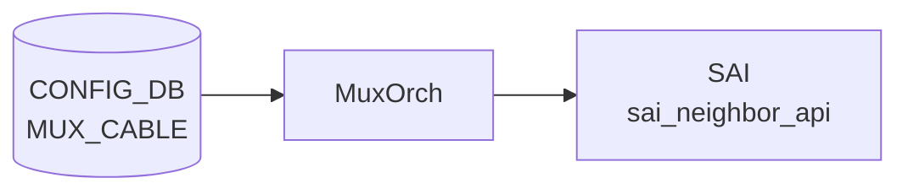

# MUX_CABLE テーブル

## 概要

Dual-ToR (active-active / active-standby) 構成で各 server-facing port に紐付く mux cable の状態と接続先サーバ情報を保持する[^1]。`linkmgrd` (`docker-mux`) と `orchagent` の `MuxOrch` が CONFIG_DB を購読する。

<!-- cdb-mermaid -->
### データフロー (自動生成)



!!! note "凡例"
    CONFIG_DB から SAI までの典型経路を `docs/reference/config-db-orch-map.md` から機械生成したミニ図。詳細・例外は本ページ本文と対応表を参照。
<!-- /cdb-mermaid -->

## key 構造

```
MUX_CABLE|<ifname>
```

`<ifname>` は `PORT.name` への leafref。

## 主要フィールド

| フィールド | 型 | 既定 | 説明 |
|-----------|----|------|------|
| `cable_type` | enum `active-active`/`active-standby` | `active-standby` | DualToR ケーブル種別 |
| `prober_type` | enum `hardware`/`software` | `software` | linkmgrd の ICMP prober モード |
| `neighbor_mode` | enum `prefix-route`/`host-route` | `host-route` | MUX neighbor 経路モード |
| `server_ipv4` | ipv4-prefix | - | サーバ IPv4 アドレス |
| `server_ipv6` | ipv6-prefix | - | サーバ IPv6 アドレス |
| `soc_ipv4` | ipv4-prefix | - | SoC IPv4 (active-active 限定) |
| `soc_ipv6` | ipv6-prefix | - | SoC IPv6 (active-active 限定) |
| `state` | enum `auto`/`manual`/`detach`/`active`/`standby` | `auto` | MUX 状態。auto は自動 failover |

## 購読者

- `linkmgrd` (`docker-mux`): ICMP prober を駆動して `state` を更新、`MUX_CABLE_TABLE` (APPL_DB) と `STATE_DB` 反映
- `orchagent` の `MuxOrch`: SAI tunnel encap / route programming で active/standby 切替

## 関連 CONFIG_DB / YANG / CLI

- 関連 CONFIG_DB: `PEER_SWITCH`、`TUNNEL` (DualToR の MuxTunnel0)、`PORT`
- 関連 CLI: `config muxcable mode/active/standby/auto`、`show muxcable`
- 関連 YANG: `sonic-mux-cable`、`sonic-tunnel`、`sonic-peer-switch`

<!-- ref-triangle:start -->

## 関連リファレンス

- YANG: [`sonic-mux-cable`](../yang/sonic-mux-cable.md)

<!-- ref-triangle:end -->

## 引用元

[^1]: YANG 定義: `sonic-mux-cable.yang`. <https://github.com/sonic-net/sonic-buildimage/blob/9ea932ec2e18f35e58268ec2e4456b1d4afd65cd/src/sonic-yang-models/yang-models/sonic-mux-cable.yang>

<!-- topics-back-ref -->
## 関連 Topics

- [Topics: Dual-ToR と Mux 制御](../../topics/05-dual-tor/index.md)

<!-- /topics-back-ref -->

<!-- ops-hint -->
## 運用ヒント

### 典型値

- key 形式: `MUX_CABLE|Ethernet0`（dual-ToR の Active-Standby 用）。
- `state`: `auto` / `active` / `standby` / `manual`。
- `server_ipv4` / `server_ipv6`: ぶら下がるサーバ IP。
- `soc_ipv4`: SmartCable SoC IP。

### よくある誤設定

- `state: manual` のまま放置すると linkmgrd が自動フェイルオーバしない。
- ToR 間で `server_ipv4` が不一致だと両 ToR が active になり tunnel ループ。

### 確認コマンド

```bash
sonic-db-cli CONFIG_DB hgetall 'MUX_CABLE|Ethernet0'
sonic-db-cli STATE_DB hgetall 'MUX_CABLE_TABLE|Ethernet0'
show mux status
show mux config
```
<!-- /ops-hint -->
