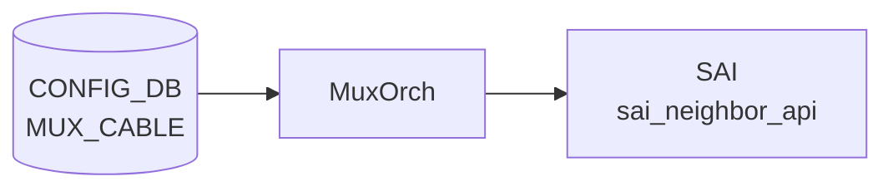

# MUX_CABLE テーブル

## 概要

Dual-ToR (active-active / active-standby) 構成で各 server-facing port に紐付く mux cable の状態と接続先サーバ情報を保持する[^1]。`linkmgrd` (`docker-mux`) と `orchagent` の `MuxOrch` が [CONFIG_DB](../../reference/glossary.md#term-config_db) を購読する。

<!-- cdb-mermaid -->
### データフロー (自動生成)



!!! note "凡例"
    CONFIG_DB から SAI までの典型経路を `docs/reference/config-db-orch-map.md` から機械生成したミニ図。詳細・例外は本ページ本文と対応表を参照。
<!-- /cdb-mermaid -->

## key 構造

```text
MUX_CABLE|<ifname>
```

`<ifname>` は `PORT.name` への leafref。

## 主要フィールド

| フィールド | 型 | 既定 | 説明 |
|-----------|----|------|------|
| `cable_type` | enum `active-active`/`active-standby` | `active-standby` | DualToR ケーブル種別 |
| `prober_type` | enum `hardware`/`software` | `software` | [linkmgrd](../../reference/glossary.md#term-linkmgrd) の ICMP prober モード |
| `neighbor_mode` | enum `prefix-route`/`host-route` | `host-route` | [MUX](../../reference/glossary.md#term-mux) neighbor 経路モード |
| `server_ipv4` | ipv4-prefix | - | サーバ IPv4 アドレス |
| `server_ipv6` | ipv6-prefix | - | サーバ IPv6 アドレス |
| `soc_ipv4` | ipv4-prefix | - | SoC IPv4 (active-active 限定) |
| `soc_ipv6` | ipv6-prefix | - | SoC IPv6 (active-active 限定) |
| `state` | enum `auto`/`manual`/`detach`/`active`/`standby` | `auto` | [MUX](../../reference/glossary.md#term-mux) 状態。auto は自動 failover |

## 購読者

- `linkmgrd` (`docker-mux`): ICMP prober を駆動して `state` を更新、`MUX_CABLE_TABLE` ([APPL_DB](../../reference/glossary.md#term-appl_db)) と `STATE_DB` 反映
- `orchagent` の `MuxOrch`: [SAI](../../reference/glossary.md#term-sai) tunnel encap / route programming で active/standby 切替

## 関連 CONFIG_DB / YANG / CLI

- 関連 [CONFIG_DB](../../reference/glossary.md#term-config_db): `PEER_SWITCH`、`TUNNEL` (DualToR の MuxTunnel0)、`PORT`
- 関連 CLI: `config muxcable mode/active/standby/auto`、`show muxcable`
- 関連 [YANG](../../reference/glossary.md#term-yang): `sonic-mux-cable`、`sonic-tunnel`、`sonic-peer-switch`

<!-- ref-triangle:start -->

## 関連リファレンス

- [YANG](../../reference/glossary.md#term-yang): [`sonic-mux-cable`](../yang/sonic-mux-cable.md)

<!-- ref-triangle:end -->

## 引用元

[^1]: [YANG](../../reference/glossary.md#term-yang) 定義: `sonic-mux-cable.yang`. <https://github.com/sonic-net/sonic-buildimage/blob/9ea932ec2e18f35e58268ec2e4456b1d4afd65cd/src/sonic-yang-models/yang-models/sonic-mux-cable.yang>

<!-- topics-back-ref -->
## 関連 Topics

- [Topics: Dual-ToR と Mux 制御](../../topics/05-dual-tor/index.md)

<!-- /topics-back-ref -->

<!-- ops-hint -->
## 運用ヒント

### 典型値

- key 形式: `MUX_CABLE|Ethernet0`（dual-ToR の Active-Standby 用）。
- `state`: `auto` / `active` / `standby` / `manual`。
- `server_ipv4` / `server_ipv6`: ぶら下がるサーバ IP。
- `soc_ipv4`: SmartCable SoC IP。

### よくある誤設定

- `state: manual` のまま放置すると [linkmgrd](../../reference/glossary.md#term-linkmgrd) が自動フェイルオーバしない。
- ToR 間で `server_ipv4` が不一致だと両 ToR が active になり tunnel ループ。

### 確認コマンド

```bash
sonic-db-cli CONFIG_DB hgetall 'MUX_CABLE|Ethernet0'
sonic-db-cli STATE_DB hgetall 'MUX_CABLE_TABLE|Ethernet0'
show mux status
show mux config
```
<!-- /ops-hint -->

<!-- cdb-exceptions -->
## 例外条件・特殊挙動

<!-- evidence: sonic-buildimage/src/sonic-yang-models/yang-models/sonic-mux-cable.yang -->

- **cable_type が不正値 → YANG が拒否**: `enum { active-active; active-standby; }` のみ許可。デフォルト `active-standby`。
- **prober_type が不正値 → YANG が拒否**: `enum { hardware; software; }` のみ許可。デフォルト `software`。
- **neighbor_mode が不正値 → YANG が拒否**: `enum { prefix-route; host-route; }` のみ許可。デフォルト `host-route`。
- **state が不正値 → YANG が拒否**: `enum { auto; manual; detach; active; standby; }` のみ許可。デフォルト `auto`。`auto` モードではリンクプローバの判断で自動切替、`manual` は手動固定。
- **server_ipv4 の形式不正 → YANG が拒否**: `type inet:ipv4-prefix`。不正な IPv4 プレフィックスは YANG バリデーションで拒否される。
- **MUX_CABLE エントリが存在しない場合**: [linkmgrd](../../reference/glossary.md#term-linkmgrd) は当該インターフェースに対して mux 管理を行わない。

<!-- value-behavior -->
## 値依存挙動マトリクス

<!-- evidence: sonic-linkmgrd/src/MuxPort.cpp / sonic-linkmgrd/src/MuxManager.cpp / sonic-swss/orchagent/muxorch.cpp -->

| フィールド | 値 | 挙動 |
|-----------|-----|------|
| `state` | `auto` (default) | ICMP prober の判断で active/standby を自動決定。フェイルオーバも自動 |
| `state` | `active` | 当該 ToR を強制 active。linkmgrd が MUX を active 側に固定 |
| `state` | `standby` | 当該 ToR を強制 standby。トラフィックをピア ToR 経由に迂回 |
| `state` | `manual` | 自動フェイルオーバ無効。現在の active/standby 状態を維持 |
| `state` | `detach` | active-active 専用。NIC から ToR を論理的に切り離し。active-standby では WARN + 無視 |
| `cable_type` | `active-standby` (default) | ActiveStandby ステートマシン選択。ICMP prober で片系のみ active |
| `cable_type` | `active-active` | ActiveActive ステートマシン選択。両 ToR が active。soc_ipv4 が必要 |
| `prober_type` | `software` (default) | linkmgrd が ICMP パケットをソフトウェアで生成・送信 |
| `prober_type` | `hardware` | xcvrd 経由でハードウェア MUX に probe を委譲 |
| `neighbor_mode` | `host-route` (default) | サーバ IP を /32 (/128) host route として処理 |
| `neighbor_mode` | `prefix-route` | サーバ IP を prefix-based route として処理。動的変更は muxorch で WARN (再起動が必要) |

<!-- /value-behavior -->


<!-- runtime-trace -->
## CDB → 実コンテナ動作トレース

### 段階 1: Consumer 登録

- **linkmgrd** (`sonic-linkmgrd/src/`): `MUX_CABLE` テーブルを `ConfigDBConnector` で購読。
- **xcvrd** (platform_daemons): mux cable の物理ステータスを管理。

### 段階 2: CFG → APPL 翻訳

- linkmgrd がエントリを読み、各インタフェースの mux 状態マシン (MuxStateMachine) を初期化。
- APP_DB `MUX_CABLE_TABLE` と `HW_MUX_CABLE_TABLE` に state を書き込む (linkmgrd → appDB)。

### 段階 3: APPL → SAI

- orchagent / MuxOrch が APP_DB `MUX_CABLE_TABLE` を購読し、SAI neighbor/nexthop を操作して active/standby トラフィックパスを制御。
- SAI: `sai_neighbor_api` でネクストホップの有効・無効を切替。

### 段階 4: タイミング + 副作用

- state=auto 時: linkmgrd がリンクプローバ (ICMP/ARP) 結果に基づき自動切替。レイテンシは数百 ms。
- state=manual 時: CLI `show mux status` / `config mux mode` で即時切替。
- 副作用: active→standby 切替時にトラフィックが一時的に 0.1〜数秒断する可能性。

<!-- /runtime-trace -->
<!-- entry-points -->
## 書き込み入り口 (Direction A)

MUX_CABLE テーブルへの書き込みが発生するコード経路を網羅的に調査した結果。

### CLI

  - `config muxcable mode ...` / `config muxcable prbs ...` — `config/muxcable.py` が `set_entry('MUX_CABLE', port, fvs)` を呼ぶ (sonic-utilities/config/muxcable.py:278)

### minigraph / sonic-cfggen

minigraph.py に MUX_CABLE 生成なし — 通常 minigraph から配信されない

### REST / gNMI

sonic-mgmt-common の MUX_CABLE トランスフォーマーなし

### db_migrator

db_migrator.py での MUX_CABLE マイグレーションなし

### ビルド時デフォルト (build-time default)

`init_cfg.json.j2` に MUX_CABLE エントリなし

### ハードコードデフォルト / ランタイム注入

`sonic-platform-daemons/ycabled` が `y_cable_table_helper.py` で MUX_CABLE を読み取り、デーモン内部で状態値を更新するケースあり

### 死活・デッドコード

なし
<!-- /entry-points -->

<!-- glossary-links-injected: 68cc248286f2 -->
