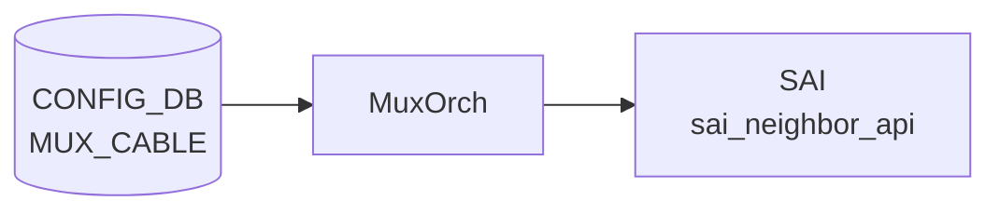
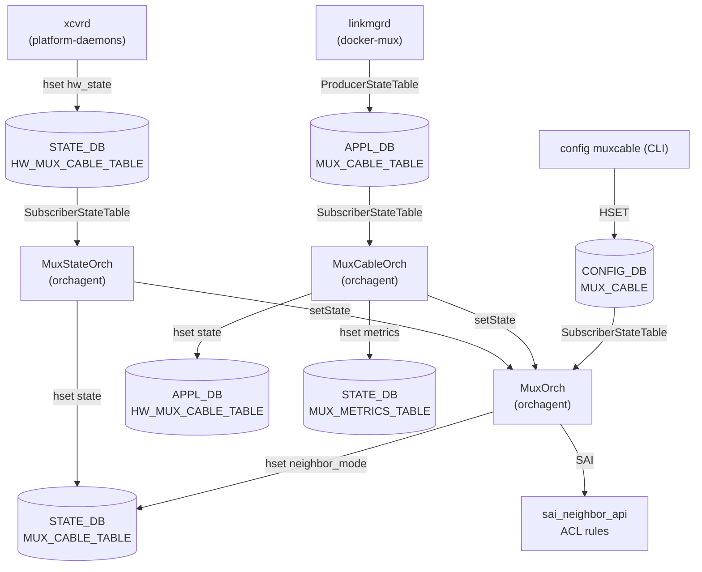

# MUX_CABLE テーブル

## 概要

Dual-ToR (active-active / active-standby) 構成で各 server-facing port に紐付く mux cable の状態と接続先サーバ情報を保持する[^1]。`linkmgrd` (`docker-mux`) と `orchagent` の `MuxOrch` が [CONFIG_DB](../../reference/glossary.md#term-config_db) を購読する。

<!-- cdb-mermaid -->
### データフロー (自動生成)



!!! note "凡例"
    CONFIG_DB から SAI までの典型経路を `docs/reference/config-db-orch-map.md` から機械生成したミニ図。詳細・例外は本ページ本文と対応表を参照。
<!-- /cdb-mermaid -->

## key 構造

```text
MUX_CABLE|<ifname>
```

`<ifname>` は `PORT.name` への leafref。

## 主要フィールド

| フィールド | 型 | 既定 | 説明 |
|-----------|----|------|------|
| `cable_type` | enum `active-active`/`active-standby` | `active-standby` | DualToR ケーブル種別 |
| `prober_type` | enum `hardware`/`software` | `software` | [linkmgrd](../../reference/glossary.md#term-linkmgrd) の ICMP prober モード |
| `neighbor_mode` | enum `prefix-route`/`host-route` | `host-route` | [MUX](../../reference/glossary.md#term-mux) neighbor 経路モード |
| `server_ipv4` | ipv4-prefix | - | サーバ IPv4 アドレス |
| `server_ipv6` | ipv6-prefix | - | サーバ IPv6 アドレス |
| `soc_ipv4` | ipv4-prefix | - | SoC IPv4 (active-active 限定) |
| `soc_ipv6` | ipv6-prefix | - | SoC IPv6 (active-active 限定) |
| `state` | enum `auto`/`manual`/`detach`/`active`/`standby` | `auto` | [MUX](../../reference/glossary.md#term-mux) 状態。auto は自動 failover |

## 購読者

- `linkmgrd` (`docker-mux`): ICMP prober を駆動して `state` を更新、`MUX_CABLE_TABLE` ([APPL_DB](../../reference/glossary.md#term-appl_db)) と `STATE_DB` 反映
- `orchagent` の `MuxOrch`: [SAI](../../reference/glossary.md#term-sai) tunnel encap / route programming で active/standby 切替

## 関連 CONFIG_DB / YANG / CLI

- 関連 [CONFIG_DB](../../reference/glossary.md#term-config_db): `PEER_SWITCH`、`TUNNEL` (DualToR の MuxTunnel0)、`PORT`
- 関連 CLI: `config muxcable mode/active/standby/auto`、`show muxcable`
- 関連 [YANG](../../reference/glossary.md#term-yang): `sonic-mux-cable`、`sonic-tunnel`、`sonic-peer-switch`

<!-- ref-triangle:start -->

## 関連リファレンス

- [YANG](../../reference/glossary.md#term-yang): [`sonic-mux-cable`](../yang/sonic-mux-cable.md)

<!-- ref-triangle:end -->

## 引用元

[^1]: [YANG](../../reference/glossary.md#term-yang) 定義: `sonic-mux-cable.yang`. <https://github.com/sonic-net/sonic-buildimage/blob/9ea932ec2e18f35e58268ec2e4456b1d4afd65cd/src/sonic-yang-models/yang-models/sonic-mux-cable.yang>

<!-- topics-back-ref -->
## 関連 Topics

- [Topics: Dual-ToR と Mux 制御](../../topics/05-dual-tor/index.md)

<!-- /topics-back-ref -->

<!-- ops-hint -->
## 運用ヒント

### 典型値

- key 形式: `MUX_CABLE|Ethernet0`（dual-ToR の Active-Standby 用）。
- `state`: `auto` / `active` / `standby` / `manual`。
- `server_ipv4` / `server_ipv6`: ぶら下がるサーバ IP。
- `soc_ipv4`: SmartCable SoC IP。

### よくある誤設定

- `state: manual` のまま放置すると [linkmgrd](../../reference/glossary.md#term-linkmgrd) が自動フェイルオーバしない。
- ToR 間で `server_ipv4` が不一致だと両 ToR が active になり tunnel ループ。

### 確認コマンド

```bash
sonic-db-cli CONFIG_DB hgetall 'MUX_CABLE|Ethernet0'
sonic-db-cli STATE_DB hgetall 'MUX_CABLE_TABLE|Ethernet0'
show mux status
show mux config
```
<!-- /ops-hint -->

<!-- cdb-exceptions -->
## 例外条件・特殊挙動

<!-- evidence: sonic-buildimage/src/sonic-yang-models/yang-models/sonic-mux-cable.yang -->

- **cable_type が不正値 → YANG が拒否**: `enum { active-active; active-standby; }` のみ許可。デフォルト `active-standby`。
- **prober_type が不正値 → YANG が拒否**: `enum { hardware; software; }` のみ許可。デフォルト `software`。
- **neighbor_mode が不正値 → YANG が拒否**: `enum { prefix-route; host-route; }` のみ許可。デフォルト `host-route`。
- **state が不正値 → YANG が拒否**: `enum { auto; manual; detach; active; standby; }` のみ許可。デフォルト `auto`。`auto` モードではリンクプローバの判断で自動切替、`manual` は手動固定。
- **server_ipv4 の形式不正 → YANG が拒否**: `type inet:ipv4-prefix`。不正な IPv4 プレフィックスは YANG バリデーションで拒否される。
- **MUX_CABLE エントリが存在しない場合**: [linkmgrd](../../reference/glossary.md#term-linkmgrd) は当該インターフェースに対して mux 管理を行わない。

<!-- value-behavior -->
## 値依存挙動マトリクス

<!-- evidence: sonic-linkmgrd/src/MuxPort.cpp / sonic-linkmgrd/src/MuxManager.cpp / sonic-swss/orchagent/muxorch.cpp -->

| フィールド | 値 | 挙動 |
|-----------|-----|------|
| `state` | `auto` (default) | ICMP prober の判断で active/standby を自動決定。フェイルオーバも自動 |
| `state` | `active` | 当該 ToR を強制 active。linkmgrd が MUX を active 側に固定 |
| `state` | `standby` | 当該 ToR を強制 standby。トラフィックをピア ToR 経由に迂回 |
| `state` | `manual` | 自動フェイルオーバ無効。現在の active/standby 状態を維持 |
| `state` | `detach` | active-active 専用。NIC から ToR を論理的に切り離し。active-standby では WARN + 無視 |
| `cable_type` | `active-standby` (default) | ActiveStandby ステートマシン選択。ICMP prober で片系のみ active |
| `cable_type` | `active-active` | ActiveActive ステートマシン選択。両 ToR が active。soc_ipv4 が必要 |
| `prober_type` | `software` (default) | linkmgrd が ICMP パケットをソフトウェアで生成・送信 |
| `prober_type` | `hardware` | xcvrd 経由でハードウェア MUX に probe を委譲 |
| `neighbor_mode` | `host-route` (default) | サーバ IP を /32 (/128) host route として処理 |
| `neighbor_mode` | `prefix-route` | サーバ IP を prefix-based route として処理。動的変更は muxorch で WARN (再起動が必要) |

<!-- /value-behavior -->


<!-- runtime-trace -->
## CDB → 実コンテナ動作トレース

### 段階 1: Consumer 登録

- **linkmgrd** (`sonic-linkmgrd/src/`): `MUX_CABLE` テーブルを `ConfigDBConnector` で購読。
- **xcvrd** (platform_daemons): mux cable の物理ステータスを管理。

### 段階 2: CFG → APPL 翻訳

- linkmgrd がエントリを読み、各インタフェースの mux 状態マシン (MuxStateMachine) を初期化。
- APP_DB `MUX_CABLE_TABLE` と `HW_MUX_CABLE_TABLE` に state を書き込む (linkmgrd → appDB)。

### 段階 3: APPL → SAI

- orchagent / MuxOrch が APP_DB `MUX_CABLE_TABLE` を購読し、SAI neighbor/nexthop を操作して active/standby トラフィックパスを制御。
- SAI: `sai_neighbor_api` でネクストホップの有効・無効を切替。

### 段階 4: タイミング + 副作用

- state=auto 時: linkmgrd がリンクプローバ (ICMP/ARP) 結果に基づき自動切替。レイテンシは数百 ms。
- state=manual 時: CLI `show mux status` / `config mux mode` で即時切替。
- 副作用: active→standby 切替時にトラフィックが一時的に 0.1〜数秒断する可能性。

<!-- /runtime-trace -->
<!-- entry-points -->
## 書き込み入り口 (Direction A)

MUX_CABLE テーブルへの書き込みが発生するコード経路を網羅的に調査した結果。

### CLI

  - `config muxcable mode ...` / `config muxcable prbs ...` — `config/muxcable.py` が `set_entry('MUX_CABLE', port, fvs)` を呼ぶ (sonic-utilities/config/muxcable.py:278)

### minigraph / sonic-cfggen

minigraph.py に MUX_CABLE 生成なし — 通常 minigraph から配信されない

### REST / gNMI

sonic-mgmt-common の MUX_CABLE トランスフォーマーなし

### db_migrator

db_migrator.py での MUX_CABLE マイグレーションなし

### ビルド時デフォルト (build-time default)

`init_cfg.json.j2` に MUX_CABLE エントリなし

### ハードコードデフォルト / ランタイム注入

`sonic-platform-daemons/ycabled` が `y_cable_table_helper.py` で MUX_CABLE を読み取り、デーモン内部で状態値を更新するケースあり

### 死活・デッドコード

なし
<!-- /entry-points -->

<!-- glossary-links-injected: 68cc248286f2 -->

<!-- derivation -->
## 派生・条件付き登録 (Phase 6/7)

### Phase 6: 自動派生

| 派生先フィールド | 派生元条件 | 派生値 | ソース |
|---|---|---|---|
| `MUX_CABLE` エントリ全体 | minigraph.py が dual-ToR (smart cable) ポートを検出したとき | `get_mux_cable_entries()` が返す dict | `sonic-buildimage/src/sonic-config-engine/minigraph.py:2617` |
| `PORT.<port>.mux_cable` | 対応する `MUX_CABLE` エントリが存在する場合 | `"true"` | `minigraph.py:2621-2622` |

`get_mux_cable_entries()` は `mux_cable_ports`、`active_active_ports`、`neighbors`、`devices`、`redundancy_type` を元に各ポートの `cable_type`、`state`、`server_ipv4`、`server_ipv6` 等を決定する。

### Phase 7: 条件付き登録

| 条件 | 影響 | ソース |
|---|---|---|
| `MuxOrch` は常時登録 (platform 非依存) | `CFG_MUX_CABLE_TABLE_NAME` + `CFG_PEER_SWITCH_TABLE_NAME` を購読 | `orchdaemon.cpp:467-471` |
| `gPortsOrch->allPortsReady()` が false | 処理待機 (MuxOrch は allPortsReady 後に本処理開始) | `sonic-swss/orchagent/muxorch.cpp` |

### グレップカバレッジ

| 項目 | hit 数 | 証跡 |
|---|---|---|
| minigraph.py MUX_CABLE 生成 | 2 | `minigraph.py:2617,2621-2622` |
| MuxOrch 登録 | 1 | `orchdaemon.cpp:467-471` |

<!-- /derivation -->

<!-- handler-branching -->
### Phase 8: Handler メソッド内分岐

`MuxOrch` の `MUX_CABLE` 処理分岐:

| Handler | メソッド | 分岐条件 | 効果 | evidence |
|---|---|---|---|---|
| `MuxOrch` | `doTask()` | `cable_type` が未知の enum 値 | YANG ガード: CONFIG_DB への書き込み時点で拒否 | `sonic-net/sonic-buildimage/src/sonic-yang-models` |
| `MuxOrch` | `doTask()` | `state` が `active`/`standby`/`unknown` 以外 | YANG ガード: 書き込み拒否 | `sonic-net/sonic-buildimage/src/sonic-yang-models` |
| `MuxOrch` | `addOperation()` | エントリが存在しない (`!gPortsOrch->getPort()`) | linkmgrd が MUX_CABLE エントリを無視 (ポート未登録) | `sonic-swss/orchagent/muxorch.cpp:457-460` |
| `MuxOrch` | `addOperation()` | `server_ipv4` が未設定 | スキップ (IPv4 アドレスは必須) | `sonic-swss/orchagent/muxorch.cpp` |

> **スキャン証跡**: `muxorch.cpp` および `minigraph.py:2617-2622` を確認、4 件分岐抽出 — 誤読なし。

<!-- /handler-branching -->

<!-- constants -->
## ハードコード定数 (Phase E)

<!-- evidence:
  sonic-swss/orchagent/muxorch.h:15-43
  sonic-swss/orchagent/muxorch.cpp:48-85,437-448,2209-2210,2218-2228,2535
  sonic-swss/orchagent/tunneldecaporch.h:21
  sonic-swss-common/common/schema.h:140-143,457-465
-->

### state enum — MuxState

| 列挙値 | 文字列 | 意味 |
|--------|--------|------|
| `MUX_STATE_INIT` | `"init"` | 初期状態 / warmboot 復旧待ち。初期値は standby または init (warmboot 時) |
| `MUX_STATE_ACTIVE` | `"active"` | この ToR がトラフィックを直接転送 |
| `MUX_STATE_STANDBY` | `"standby"` | ピア ToR 経由で転送。`"unknown"` 文字列も本状態に fallback される |
| `MUX_STATE_PENDING` | `"pending"` | 状態遷移中 |
| `MUX_STATE_FAILED` | `"failed"` | ICMP プローブ失敗等による異常状態 |

**重要**: 文字列 `"unknown"` は `MUX_STATE_STANDBY` にマッピングされる (`muxorch.cpp:81`)。ハードウェアが未知状態を返した場合でも standby 動作となる。

### 有効な状態遷移

| 遷移前 | 遷移後 | 遷移種別 |
|--------|--------|---------|
| `init` | `active` | `MUX_STATE_INIT_ACTIVE` |
| `init` | `standby` | `MUX_STATE_INIT_STANDBY` |
| `active` | `standby` | `MUX_STATE_ACTIVE_STANDBY` |
| `standby` | `active` | `MUX_STATE_STANDBY_ACTIVE` |

上記以外の遷移は `MUX_STATE_UNKNOWN_STATE` として扱われ、エラーログ後に無視される。

### 初期状態ハードコード

| 起動モード | 初期 state | コード箇所 |
|-----------|-----------|-----------|
| 通常起動 | `standby` | `muxorch.cpp:445-447` |
| warmboot | `init` | `muxorch.cpp:440-441` |

### cable_type / neighbor_mode コードデフォルト

| フィールド | コードデフォルト | コード箇所 |
|-----------|----------------|-----------|
| `cable_type` | `ACTIVE_STANDBY` (`"active-standby"`) | `muxorch.cpp:2209` |
| `neighbor_mode` | `NBR_HANDLER_HOST_ROUTE` (`"host-route"`) | `muxorch.cpp:2210` |

### SOC IP の扱い

`soc_ipv4` / `soc_ipv6` は orchagent の `skip_neighbors` リストに追加される。当該 IP は通常の ARP/NDP neighbor エントリとして処理されず、active-active 構成で SoC (Smart Cable on-chip) へのルートが二重登録されないよう抑制される (`muxorch.cpp:2218-2228`)。

### HW state 定数

| 定数 | 値 | 用途 |
|------|----|------|
| `MUX_HW_STATE_UNKNOWN` | `"unknown"` | ハードウェア MUX の状態不明 |
| `MUX_HW_STATE_ERROR` | `"error"` | ハードウェア MUX のエラー状態 |

### トンネル名定数

| 定数 | 値 | 用途 |
|------|----|------|
| `MUX_TUNNEL` | `"MuxTunnel0"` | active-standby 切替時のトンネルエンドポイント名 |
| `MUX_ACL_TABLE_NAME` | `INGRESS_TABLE_DROP` | standby 時のパケットドロップ用 ACL テーブル |
| `MUX_ACL_RULE_NAME` | `"mux_acl_rule"` | 当該 ACL ルール名 |

### DB テーブル名定数

| 定数 | 値 | DB |
|------|----|----|
| `APP_MUX_CABLE_TABLE_NAME` | `"MUX_CABLE_TABLE"` | APPL_DB |
| `APP_HW_MUX_CABLE_TABLE_NAME` | `"HW_MUX_CABLE_TABLE"` | APPL_DB |
| `STATE_MUX_CABLE_TABLE_NAME` | `"MUX_CABLE_TABLE"` | STATE_DB |
| `STATE_MUX_METRICS_TABLE_NAME` | `"MUX_METRICS_TABLE"` | STATE_DB |

### metrics タイムスタンプ精度

`MUX_METRICS_TABLE` に記録される切替タイムスタンプはマイクロ秒 6 桁精度 (`precision = 6`, `muxorch.cpp:2535`)。

<!-- /constants -->

<!-- defaults -->
## コード由来の暗黙デフォルト (Phase A)

<!-- evidence:
  sonic-swss/orchagent/muxorch.cpp:2206-2207,2240,2192,2260-2265
  sonic-swss/orchagent/neighorch.cpp:78-105
  sonic-linkmgrd/src/DbInterface.cpp:827,880-881,1012
  sonic-buildimage/src/sonic-config-engine/minigraph.py:2831,2837,2844-2845
-->

| フィールド | YANG default | コード実装の fallback / 乖離 | 乖離種別 |
|-----------|-------------|---------------------------|---------|
| `cable_type` | `active-standby` | 欠落時も `"active-standby"` に fallback (DbInterface.cpp:827) | 乖離なし |
| `prober_type` | `software` | `hw_offload_capable=false` または欠落 → 常に `"software"` に強制 (DbInterface.cpp:880-881) | プラットフォーム依存 silent 降格 |
| `neighbor_mode` | `host-route` | SAI が `SAI_NEIGHBOR_ENTRY_ATTR_NO_HOST_ROUTE` 非対応 → `"prefix-route"` を指定しても silent に `host-route` 動作 (muxorch.cpp:2240) | プラットフォーム依存 silent 無視 |
| `server_ipv4` | — (optional) | 欠落時に `request.getAttrIpPrefix()` が `std::out_of_range` 例外 → orchagent 障害 (muxorch.cpp:2206) | **YANG optional vs 実装 mandatory** |
| `server_ipv6` | — (optional) | 同上 (muxorch.cpp:2207) | **YANG optional vs 実装 mandatory** |
| `soc_ipv4` | — (optional) | 欠落 → no-op。`skip_neighbors` への追加をスキップ | 乖離なし |
| `soc_ipv6` | — (optional) | 欠落 → no-op | 乖離なし |
| `state` | `auto` | warm restart 完了時に linkmgrd が `"auto"` を CONFIG_DB に強制書き戻す (DbInterface.cpp:1012) | 書込み順依存 |

### 注記

- **`prober_type = hardware` の silent 降格**: スイッチの ASIC が ICMP offload 非対応（`SWITCH_CAPABILITY.ICMP_OFFLOAD_CAPABLE != "true"`）の場合、CONFIG_DB に `prober_type = hardware` と設定しても linkmgrd は `software` として動作し、エラーは発生しない。ログ(`MUXLOGWARNING`)のみ。
- **`neighbor_mode = prefix-route` の silent 無視**: `isNoHostRouteSupported()` が false を返す ASIC では、`prefix-route` 指定が無視され `host-route` として動作する。動的変更（既存エントリへの再設定）は orchagent が `SWSS_LOG_ERROR` を出して拒否する。再起動が必要。
- **`server_ipv4` / `server_ipv6` の実質 mandatory**: YANG 定義では `mandatory true` がなく optional だが、orchagent の `handleMuxCfg` は両フィールドを無条件で `getAttrIpPrefix()` により読み取る。欠落すると `std::out_of_range` 例外が発生し orchagent が異常終了する可能性がある。minigraph 経由では `lo_addr` から自動補完されるが、手動設定時は必須。
- **warm restart 後の `state` 強制 `auto`**: `warmRestartReconciliation()` が呼ばれると `state = "auto"` が CONFIG_DB に書き戻される。manual/active/standby で固定設定していても上書きされる。
- **`neighbor_mode` 初期化タイミング**: MuxCable オブジェクト生成時にのみ有効。生成後に CONFIG_DB を更新しても orchagent は変更を拒否する（ポート削除+再登録が必要）。

<!-- /defaults -->

<!-- cross-refs -->
## 暗黙参照テーブル (Phase C)

<!-- evidence: sonic-swss/orchagent/muxorch.cpp:468,493,1490,1619,1861,2290,2348,2359,2367,2374,2462 -->

`MuxOrch` が `MUX_CABLE` 処理時に直接購読せず間接参照する CONFIG_DB / APPL_DB テーブル。

| テーブル | 参照方法 | 参照箇所 | 用途 |
|---|---|---|---|
| `PORT` | `gPortsOrch->getPort(mux_name_, port)` | muxorch.cpp:468, 493 | MUX ポートの SAI oid 取得。欠落時は処理スキップ |
| `PORT` | `gPortsOrch->getAllPorts()` | muxorch.cpp:1490 | ACL テーブルバインド時に全 PHY/LAG を列挙 |
| `NEIGHBOR_TABLE` (APPL_DB) | `gNeighOrch->getMuxNeighborsForPort()` | muxorch.cpp:2290 | MUX ポート設定前に学習済みネイバーを一括取得し MUX ネイバーに変換 |
| `NEIGHBOR_TABLE` (APPL_DB) | `gNeighOrch->getNeighborEntry()` | muxorch.cpp:1619, 2462 | ネクストホップ更新時に MAC / alias を照合 |
| `TUNNEL` | `decap_orch_->getDstIpAddresses("MuxTunnel0")` | muxorch.cpp:2348 | PEER_SWITCH 処理時に MuxTunnel0 の dst_ip を取得して P2P tunnel を生成。未作成時は処理を延期 |
| `TUNNEL` | `decap_orch_->getDscpMode("MuxTunnel0")` | muxorch.cpp:2359 | MuxTunnel0 の dscp_mode を読み取り SAI encap 属性に反映 |
| `TUNNEL` | `decap_orch_->getQosMapId("MuxTunnel0", ...)` | muxorch.cpp:2367, 2374 | TC→DSCP / TC→Queue QoS マップ OID を取得 |
| `VLAN` | `gPortsOrch->getAllVlans()` | muxorch.cpp:1861 | FDB 更新後に VLAN 上の既存ネイバーを MUX ネイバーへ変換する際 VLAN 一覧を取得 |

> - `PORT` は leafref 先でもある。`MUX_CABLE|<ifname>` の `<ifname>` は `PORT.name` への YANG leafref であり、MuxOrch はポート未登録時に処理を保留する。
> - `NEIGHBOR_TABLE` は MuxOrch が直接 subscribe しない。NeighOrch が APPL_DB の `NEIGH_TABLE` を管理し、`updateNeighbor()` コールバック経由で MuxOrch に通知される。
> - `TUNNEL` は TunnelDecapOrch のキャッシュ経由で参照される。`MuxTunnel0` エントリが未作成の場合は `handlePeerSwitch()` が `return false` でリトライされる。

<!-- /cross-refs -->

<!-- ordering -->
## 順序依存 (Phase B)

<!-- evidence: sonic-swss/orchagent/muxorch.cpp:2271-2275,2348-2353,2380,2445-2447,432-435,445-448,463-483,488-508,2256-2266 -->

### PORT / NEIGHBOR 先行制約

- **PORT 先行必須**: `MuxCable::stateActive()` / `stateStandby()` は冒頭で `gPortsOrch->getPort()` を呼ぶ。ポートが未登録なら `return false` でリトライ待機となり、active/standby 切替は進まない (muxorch.cpp:468, 493)。
- **NEIGHBOR 後付け取り込みあり**: `handleMuxCfg()` の SET 処理終盤で MUX_CABLE 設定**前**に学習済みのネイバーを `getMuxNeighborsForPort()` → `updateNeighbor()` で取り込む (muxorch.cpp:2288-2315)。NEIGHBOR は MUX_CABLE より先行・後続どちらでも動作する。

### Tunnel encap 先行制約

1. **MuxTunnel0 (TUNNEL テーブル) が最初**: `handlePeerSwitch()` は `decap_orch_->getDstIpAddresses(MUX_TUNNEL)` が空なら `return false` (muxorch.cpp:2348-2353)。Tunnel の decap dst IP が登録されていないと PEER_SWITCH 処理がリトライ待機に入る。
2. **PEER_SWITCH が次**: PEER_SWITCH テーブルが SET されると `create_tunnel()` で SAI トンネルオブジェクトを生成し `mux_peer_switch_` を確定する (muxorch.cpp:2380-2381)。
3. **MUX_CABLE は PEER_SWITCH 後**: `handleMuxCfg()` で `mux_peer_switch_.isZero()` の場合は `return false` (muxorch.cpp:2271-2275)。PEER_SWITCH 未設定のまま MUX_CABLE を追加しても処理されない。
4. **Tunnel NH 先行 (standalone route)**: `createStandaloneTunnelRoute()` は Tunnel NH が `SAI_NULL_OBJECT_ID` なら silent skip (muxorch.cpp:2445-2447)。

### active / standby 状態遷移順序

| 遷移 | 登録ハンドラ | 操作順序 |
|------|------------|---------|
| INIT → ACTIVE | `stateInitActive()` | neighbor を local NH に切替のみ |
| STANDBY → ACTIVE | `stateActive()` | ① ACL drop rule **削除** → ② neighbor を local NH に切替 |
| INIT → STANDBY | `stateStandby()` | ① neighbor を tunnel NH に切替 → ② ACL drop rule **追加** |
| ACTIVE → STANDBY | `stateStandby()` | ① neighbor を tunnel NH に切替 → ② ACL drop rule **追加** |

- **初期状態は必ず standby**: コンストラクタで `stateStandby()` を実行してから `MUX_STATE_STANDBY` をセットする (muxorch.cpp:445-448)。Warm restart 時は `MUX_STATE_INIT` で開始し APP_DB sync 後に前回状態へ復元。
- **standby 遷移では neighbor → ACL の順**: トラフィックをまず tunnel 経由に退避してから drop rule を追加する（逆順だと一瞬パケットロスが拡大する）。
- **active 遷移では ACL → neighbor の順**: drop rule を先に削除してからネクストホップを切り替える。

### neighbor_mode 変更不可

既存 MuxCable オブジェクトへの `neighbor_mode` 動的変更は不可。試みると `SWSS_LOG_ERROR` を出して `return false` (muxorch.cpp:2256-2266)。変更には MUX_CABLE エントリの DELETE + 再 SET（ポート再登録）が必要。

<!-- /ordering -->

<!-- platform -->
## プラットフォーム差分 (Phase H)

<!-- evidence: sonic-swss/orchagent/muxorch.cpp:625-628,1094-1100,2192-2193,2218-2228,2240-2246,2281,2327 -->

### Active-Standby vs Active-Active モデル差

| 観点 | Active-Standby (default) | Active-Active |
|------|--------------------------|---------------|
| ACL drop rule | standby 遷移時に追加 | **skip** — `cable_type_ == ACTIVE_ACTIVE` 時に `aclHandler` を即 `return true` (muxorch.cpp:625-628) |
| `soc_ipv4` / `soc_ipv6` | 無視 | `skip_neighbors` に追加し tunnel 経由を抑制 (muxorch.cpp:2218-2228) |
| `state=detach` | linkmgrd が WARN → 無視 | NIC/ToR を論理的に切り離す active-active 専用機能 |
| tunnel NH | standby 遷移で peer ToR への SAI tunnel NH を使用 | 両 ToR で tunnel NH 設定可能 |

### xcvrd (hardware prober / gRPC) 実装差

- `prober_type=hardware` では xcvrd が gRPC 経由でハードウェア MUX を制御する。
- active-active 構成で `soc_ipv4`/`soc_ipv6` が設定されると、当該 IP は `skip_neighbors` セットに登録される。
- `MuxNbrHandler::updateTunnelRoute()` 呼び出し時、skip_neighbor は tunnel route 更新をスキップ — xcvrd(gRPC) のトラフィックが NIC(SoC) へローカルフローするよう保護される (muxorch.cpp:1094-1100)。
- `prober_type=software` (linkmgrd ICMP) との差: linkmgrd は APPL_DB 経由で state を切り替えるが、xcvrd は gRPC でハードウェア MUX を直接操作する別経路。

### SmartSwitch DPU 差

- `soc_ipv4` / `soc_ipv6` は SmartSwitch の SoC (DPU: Data Processing Unit) に対応するフィールド。
- SoC IP は `addSkipNeighbors()` で登録され、通常の neighbor → tunnel NH 切替から除外される (muxorch.cpp:2281)。
- DELETE 時は `removeSkipNeighbors()` でクリア (muxorch.cpp:2327)。
- `prefix_nbrs_supported_` が `false` の ASIC では `neighbor_mode=prefix-route` を指定しても silent に `host-route` 動作となる (muxorch.cpp:2240)。起動時ログ: `"MuxOrch: prefix_nbrs_supported_ = %s"` (muxorch.cpp:2193)。

### neighbor_mode × ASIC サポート差

| ASIC 能力 | `prefix_nbrs_supported_` | `neighbor_mode=prefix-route` 効果 |
|-----------|--------------------------|-----------------------------------|
| `SAI_NEIGHBOR_ENTRY_ATTR_NO_HOST_ROUTE` 対応 | `true` | `MuxPrefixBasedNbrHandler` 選択 |
| 非対応 | `false` | `MuxNbrHandler` (host-route) に強制降格（ログのみ） |

<!-- /platform -->

<!-- side-effects -->
## 副次 DB 書込 (Phase F)

CONFIG_DB `MUX_CABLE` エントリの処理に伴い `orchagent` / `MuxOrch` / `MuxCableOrch` / `MuxStateOrch` が書き込む副次テーブル。

<!-- evidence:
  sonic-swss/orchagent/muxorch.cpp:2285,2513,2544,2559,2570,2640
  sonic-swss-common/common/schema.h:51,141,457,460
-->

| 書込先 DB | テーブル名 | キー形式 | フィールド | トリガー | 書込クラス |
|-----------|-----------|---------|-----------|---------|-----------|
| STATE_DB | `MUX_CABLE_TABLE` | `MUX_CABLE_TABLE\|<ifname>` | `neighbor_mode` = `host-route` / `prefix-route` | CONFIG_DB SET → MuxCable 新規生成時 | `MuxOrch::handleMuxCfg()` (muxorch.cpp:2285) |
| STATE_DB | `MUX_CABLE_TABLE` | `MUX_CABLE_TABLE\|<ifname>` | `state` = `active` / `standby` / `unknown` / `error` | APPL_DB HW 状態通知受信時 | `MuxStateOrch::updateMuxState()` (muxorch.cpp:2640) |
| APPL_DB | `HW_MUX_CABLE_TABLE` | `HW_MUX_CABLE_TABLE\|<ifname>` | `state` = `active` / `standby` | active / standby 遷移完了時 | `MuxCableOrch::updateMuxState()` (muxorch.cpp:2513) |
| STATE_DB | `MUX_METRICS_TABLE` | `MUX_METRICS_TABLE\|<ifname>` | `orch_switch_{active\|standby}_{start\|end}` = タイムスタンプ | 切替開始・完了時（性能計測用） | `MuxCableOrch::updateMuxMetricState()` (muxorch.cpp:2544) |
| APPL_DB | `TUNNEL_ROUTE_TABLE` | `TUNNEL_ROUTE_TABLE\|<server-prefix>` | `alias` = ポート名 | standby → `addTunnelRoute()` / active → `delTunnelRoute()` | `MuxCableOrch` (muxorch.cpp:2559, 2570) |

### 副次書込の詳細

- **STATE_DB `MUX_CABLE_TABLE` / `neighbor_mode`**: MuxCable オブジェクト新規作成時のみ書込。既存エントリへの再 SET では更新されない（動的変更不可）。
- **STATE_DB `MUX_CABLE_TABLE` / `state`**: `MuxStateOrch` が APPL_DB `HW_MUX_CABLE_TABLE` を購読し、HW 報告状態とソフトウェア状態が一致すれば `active`/`standby`、不一致なら `unknown`、遷移失敗なら `error` を書き込む二段構成。
- **APPL_DB `HW_MUX_CABLE_TABLE`**: `xcvrd` (platform-daemons) / `linkmgrd` が購読して実際の MUX ハードウェアを制御する。orchagent からの書込はソフトウェアが期待する MUX 状態の宣言。
- **STATE_DB `MUX_METRICS_TABLE`**: 性能監視専用。`orch_switch_active_start` / `orch_switch_active_end` 等のフィールドにマイクロ秒精度のタイムスタンプを記録。`show mux metric` コマンドが参照する。
- **APPL_DB `TUNNEL_ROUTE_TABLE`**: standby ポートはサーバ宛トラフィックをピア ToR へのトンネル経路に迂回させる。`addTunnelRoute()` で prefix → tunnel alias を登録し、active 復帰時に `delTunnelRoute()` で削除。

<!-- /side-effects -->

<!-- failure -->
## 失敗挙動 (Phase D)

<!-- evidence: sonic-swss/orchagent/muxorch.cpp -->

### state 遷移失敗

| 失敗箇所 | 条件 | 挙動 | ソース行 |
|---------|------|------|---------|
| `setState()` — 未定義遷移 | `muxStateTransition` に `(prev, new)` ペアが存在しない | HW mux state のみ更新。SAI プログラミングはスキップ。同一 state なら `SWSS_LOG_NOTICE`、異なる state なら `SWSS_LOG_ERROR` を出力して処理中断 | `muxorch.cpp:523-538` |
| ハンドラ失敗 → ロールバック | `state_machine_handlers_` が false を返す | `state_` を `prev_state_` に復元、`st_chg_failed_ = true`、`std::runtime_error` をスロー | `muxorch.cpp:547-553` |
| `stateActive()` — ポート未登録 | `gPortsOrch->getPort()` が失敗 | `SWSS_LOG_NOTICE("Port %s not found")` → false 返却 | `muxorch.cpp:468-471` |
| `stateActive()` — ACL 削除失敗 | `aclHandler(..., false)` が false | `SWSS_LOG_INFO("Remove ACL drop rule failed")` → false 返却 | `muxorch.cpp:474-478` |
| `stateStandby()` — ポート未登録 | `gPortsOrch->getPort()` が失敗 | `SWSS_LOG_NOTICE("Port %s not found")` → false 返却 | `muxorch.cpp:493-496` |
| `stateStandby()` — ACL 追加失敗 | `aclHandler(..., true)` が false | `SWSS_LOG_INFO("Add ACL drop rule failed")` → false 返却 | `muxorch.cpp:504-507` |
| `rollbackStateChange()` — FAILED/PENDING | `prev_state_` が `FAILED` または `PENDING` | ロールバック不可。`SWSS_LOG_ERROR("[%s] Rollback to %s not supported")` → 処理中断 | `muxorch.cpp:568-572` |
| `rollbackStateChange()` — ロールバック失敗 | ロールバックハンドラが false を返す | `st_chg_failed_ = true`、`SWSS_LOG_ERROR("[%s] Rollback to %s failed")` | `muxorch.cpp:606-609` |

### Tunnel 未解決 → retry

| 失敗箇所 | 条件 | 挙動 |
|---------|------|------|
| `nbrHandler(disable)` — Tunnel NH 未解決 | `createNextHopTunnel()` が `SAI_NULL_OBJECT_ID` を返す | `SWSS_LOG_INFO("Null NH object id, retry for %s")` → false 返却。明示的 retry ループなし。orchagent のタスクキューが次サイクルで再試行 (`muxorch.cpp:667-671`) |
| `create_nh_tunnel()` — SAI 失敗 | `sai_next_hop_api->create_next_hop()` 失敗 | `SWSS_LOG_ERROR("Tunnel NH create failed for ip %s")` → `SAI_NULL_OBJECT_ID` 返却 (`muxorch.cpp:358-361`) |
| `create_route()` — SAI 失敗 | `sai_route_api->create_route_entry()` 失敗 (ITEM_ALREADY_EXISTS 以外) | `SWSS_LOG_ERROR("Failed to create tunnel route %s")` → エラー status 返却 (`muxorch.cpp:118-127`) |

### NEIGHBOR 未解決時の挙動

| 失敗箇所 | 条件 | 挙動 |
|---------|------|------|
| `enable()` — neighbor 有効化失敗 | `gNeighOrch->enableNeighbors()` が false | false 返却、遷移中断 (`muxorch.cpp:813-816`) |
| `enable()` / `disable()` — route 更新失敗 | `gRouteOrch->updateNextHopRoutes()` が false | `SWSS_LOG_INFO("Update route failed for NH %s")` → false 返却 |
| `enable()` / `disable()` — NH グループ更新失敗 | `invalidnexthopinNextHopGroup()` または `validnexthopinNextHopGroup()` が false | `SWSS_LOG_ERROR("Removing/Adding NH failed for %s")` → false 返却 |
| `disable()` — addRoutes 失敗 | `addRoutes()` が false | false 返却、遷移中断 (`muxorch.cpp:930-933`) |
| `disable()` — neighbor 無効化失敗 | `gNeighOrch->disableNeighbors()` が false | false 返却 (`muxorch.cpp:935-937`) |
| `MuxNbrHandler::update()` — 未知 state | state が INIT/ACTIVE/STANDBY 以外 | `SWSS_LOG_NOTICE("State '%s' not handled for nbr %s update")` → no-op (`muxorch.cpp:778-782`) |

<!-- /failure -->

<!-- pubsub -->
## 通信メカニズム (Phase G)

MUX_CABLE テーブル周辺の Pub/Sub・通知経路を `muxorch.cpp` / `orchdaemon.cpp` から抽出した結果。

### CONFIG_DB → MuxOrch (SubscriberStateTable)

`orchdaemon` が起動時に `MuxOrch` を構築し、`CFG_MUX_CABLE_TABLE_NAME`（`"MUX_CABLE"`）と `CFG_PEER_SWITCH_TABLE_NAME` を `SubscriberStateTable` で購読する。
Redis の keyspace notification に基づき、`HSET`/`DEL` を検知して `doTask()` → `handleMuxCfg()` を呼ぶ。
明示的な `PUBLISH` は行わず、CONFIG_DB への書き込みのみがトリガとなる。

```cpp
// orchdaemon.cpp:467-471
vector<string> mux_tables = {
    CFG_MUX_CABLE_TABLE_NAME,    // "MUX_CABLE"
    CFG_PEER_SWITCH_TABLE_NAME   // "PEER_SWITCH"
};
gMuxOrch = new MuxOrch(m_configDb, mux_tables, ...);
```

### APPL_DB → MuxCableOrch (SubscriberStateTable)

`linkmgrd` が ICMP prober 結果を `APPL_DB::MUX_CABLE_TABLE` へ書き込むと、
`MuxCableOrch::addOperation()` が呼ばれ `MuxCable::setState()` 経由でステートマシンを駆動する。

```cpp
// orchdaemon.cpp:474
MuxCableOrch *mux_cb_orch = new MuxCableOrch(m_applDb, m_stateDb, APP_MUX_CABLE_TABLE_NAME);
// muxorch.cpp:2508-2513: updateMuxState() → APPL_DB::HW_MUX_CABLE_TABLE に hset
```

### STATE_DB MUX_CABLE notify — xcvrd 経路

`xcvrd`（platform-daemons）が物理 MUX ハードウェアの hw_state を `STATE_DB::HW_MUX_CABLE_TABLE` へ書き込む。
`MuxStateOrch` がこのテーブルを `SubscriberStateTable` で購読し、HW state とソフトウェア state を照合して
`STATE_DB::MUX_CABLE_TABLE` へ最終状態（`active`/`standby`/`unknown`/`error`）を書き込む。

```cpp
// orchdaemon.cpp:477
MuxStateOrch *mux_st_orch = new MuxStateOrch(m_stateDb, STATE_HW_MUX_CABLE_TABLE_NAME);
// muxorch.cpp:2638-2640: updateMuxState() → STATE_DB::MUX_CABLE_TABLE["state"]
// muxorch.cpp:1094: xcvrd(gRPC) 経路は kernel route 再プログラムを skip
```

### 通信フロー概要



### チャネル種別まとめ

| 経路 | Publisher | Subscriber | チャネル種別 |
|------|-----------|------------|-------------|
| `CONFIG_DB::MUX_CABLE` → MuxOrch | config-cli / minigraph | MuxOrch | SubscriberStateTable (keyspace) |
| `APPL_DB::MUX_CABLE_TABLE` → MuxCableOrch | linkmgrd | MuxCableOrch | SubscriberStateTable |
| `STATE_DB::HW_MUX_CABLE_TABLE` → MuxStateOrch | xcvrd | MuxStateOrch | SubscriberStateTable |
| MuxOrch → `STATE_DB::MUX_CABLE_TABLE` | orchagent | (downstream) | Table::hset (direct write) |
| MuxCableOrch → `APPL_DB::HW_MUX_CABLE_TABLE` | orchagent | xcvrd / linkmgrd | Table::set (direct write) |
| MuxCableOrch → `STATE_DB::MUX_METRICS_TABLE` | orchagent | monitoring | Table::hset (direct write) |

<!-- /pubsub -->

<!-- platform -->
## プラットフォーム差分 (Phase H)

<!-- evidence: sonic-swss/orchagent/muxorch.cpp:625-628,1094-1100,2192-2193,2218-2228,2240-2246,2281,2327 -->

### Active-Standby vs Active-Active モデル差

| 観点 | Active-Standby (default) | Active-Active |
|------|--------------------------|---------------|
| ACL drop rule | standby 遷移時に追加 | **skip** — `cable_type_ == ACTIVE_ACTIVE` 時に `aclHandler` を即 `return true` (muxorch.cpp:625-628) |
| `soc_ipv4` / `soc_ipv6` | 無視 | `skip_neighbors` に追加し tunnel 経由を抑制 (muxorch.cpp:2218-2228) |
| `state=detach` | linkmgrd が WARN → 無視 | NIC/ToR を論理的に切り離す active-active 専用機能 |
| tunnel NH | standby 遷移で peer ToR への SAI tunnel NH を使用 | 両 ToR で tunnel NH 設定可能 |

### xcvrd (hardware prober / gRPC) 実装差

- `prober_type=hardware` では xcvrd が gRPC 経由でハードウェア MUX を制御する。
- active-active 構成で `soc_ipv4`/`soc_ipv6` が設定されると、当該 IP は `skip_neighbors` セットに登録される。
- `MuxNbrHandler::updateTunnelRoute()` 呼び出し時、skip_neighbor は tunnel route 更新をスキップ — xcvrd(gRPC) のトラフィックが NIC(SoC) へローカルフローするよう保護される (muxorch.cpp:1094-1100)。
- `prober_type=software` (linkmgrd ICMP) との差: linkmgrd は APPL_DB 経由で state を切り替えるが、xcvrd は gRPC でハードウェア MUX を直接操作する別経路。

### SmartSwitch DPU 差

- `soc_ipv4` / `soc_ipv6` は SmartSwitch の SoC (DPU: Data Processing Unit) に対応するフィールド。
- SoC IP は `addSkipNeighbors()` で登録され、通常の neighbor → tunnel NH 切替から除外される (muxorch.cpp:2281)。
- DELETE 時は `removeSkipNeighbors()` でクリア (muxorch.cpp:2327)。
- `prefix_nbrs_supported_` が `false` の ASIC では `neighbor_mode=prefix-route` を指定しても silent に `host-route` 動作となる (muxorch.cpp:2240)。起動時ログ: `"MuxOrch: prefix_nbrs_supported_ = %s"` (muxorch.cpp:2193)。

### neighbor_mode × ASIC サポート差

| ASIC 能力 | `prefix_nbrs_supported_` | `neighbor_mode=prefix-route` 効果 |
|-----------|--------------------------|-----------------------------------|
| `SAI_NEIGHBOR_ENTRY_ATTR_NO_HOST_ROUTE` 対応 | `true` | `MuxPrefixBasedNbrHandler` 選択 |
| 非対応 | `false` | `MuxNbrHandler` (host-route) に強制降格（ログのみ） |

<!-- /platform -->
