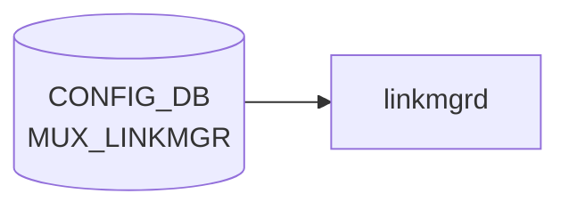

# MUX_LINKMGR テーブル

## 概要

DualToR (Active-Standby) 構成で `linkmgrd` の動作パラメータを [CONFIG_DB](../../reference/glossary.md#term-config_db) に保持するテーブル[^1]。ICMP ハートビート間隔やオシレーションの設定、ログレベル、サービス管理動作を 4 つのシングルトン container (`LINK_PROBER` / `TIMED_OSCILLATION` / `MUXLOGGER` / `SERVICE_MGMT`) に分けて持つ。

<!-- cdb-mermaid -->
### データフロー (自動生成)



!!! note "凡例"
    CONFIG_DB から SAI までの典型経路を `docs/reference/config-db-orch-map.md` から機械生成したミニ図。詳細・例外は本ページ本文と対応表を参照。
<!-- /cdb-mermaid -->

## key 構造

```text
MUX_LINKMGR|LINK_PROBER
MUX_LINKMGR|TIMED_OSCILLATION
MUX_LINKMGR|MUXLOGGER
MUX_LINKMGR|SERVICE_MGMT
```

## フィールド

### `MUX_LINKMGR|LINK_PROBER`

| フィールド | 型 | デフォルト | 単位 | 説明 |
|-----------|----|-----------|------|------|
| `interval_v4` | uint32 | `100` | ms | IPv4 ICMP ハートビート送信間隔 |
| `interval_v6` | uint32 | `1000` | ms | IPv6 ICMP ハートビート送信間隔 |
| `positive_signal_count` | uint32 | `1` | 件 | アクティブ判定に必要な連続受信回数 |
| `negative_signal_count` | uint32 | `3` | 件 | スタンバイ判定に必要な連続喪失回数 |
| `suspend_timer` | uint32 | なし | - | ICMP ハートビート停止タイマ (現状未使用と [YANG](../../reference/glossary.md#term-yang) コメント) |
| `use_well_known_mac` | enum `enabled`/`disabled` | なし | - | well-known MAC を宛先 MAC に使うか |
| `src_mac` | enum `ToRMac`/`VlanMac` | なし | - | ハートビート送信元 MAC の選択 |
| `interval_pck_loss_count_update` | uint32 | なし | - | パケットロス統計をテレメトリにストリーミングする頻度 |

### `MUX_LINKMGR|TIMED_OSCILLATION`

| フィールド | 型 | デフォルト | 説明 |
|-----------|----|-----------|------|
| `oscillation_enabled` | boolean | `true` | タイマー駆動オシレーション (定期的に Active 切替) の有効化 |
| `interval_sec` | uint32 (秒) | `300` | オシレーション間隔 |

### `MUX_LINKMGR|MUXLOGGER`

| フィールド | 型 | 説明 |
|-----------|----|------|
| `log_verbosity` | enum `trace`/`debug`/`info`/`error`/`fatal` | [linkmgrd](../../reference/glossary.md#term-linkmgrd) ログレベル |

### `MUX_LINKMGR|SERVICE_MGMT`

| フィールド | 型 | デフォルト | 説明 |
|-----------|----|-----------|------|
| `kill_radv` | enum `True`/`False` | `True` | radv (routing advertisement daemon) を gracefully 停止せず kill するか |

## 制約

- 全フィールドは [YANG](../../reference/glossary.md#term-yang) 上 mandatory ではなく、未指定なら `linkmgrd` の組み込み既定が使われる
- container 名 `MUX_LINKMGR`、内部 container 名は上記 4 つに固定

## 購読者

- `linkmgrd` (`docker-mux` 内): [CONFIG_DB](../../reference/glossary.md#term-config_db) → 起動時 / `notification` 経由で動的反映

## 関連 CONFIG_DB / YANG / CLI

- 関連 [CONFIG_DB](../../reference/glossary.md#term-config_db): [`MUX_CABLE`](mux-cable.md), [`PEER_SWITCH`](peer-switch.md)
- 関連 CLI: `config mux` 系 (一部のみ。多くは init_cfg / CONFIG_DB 直接)
- 関連 [YANG](../../reference/glossary.md#term-yang): `sonic-mux-linkmgr`

<!-- ref-triangle:start -->

## 関連リファレンス

- YANG: `sonic-mux-linkmgr`
- CLI: `config mux`

<!-- ref-triangle:end -->

## 引用元

[^1]: `src/sonic-yang-models/yang-models/sonic-mux-linkmgr.yang` (container `MUX_LINKMGR` / `LINK_PROBER` / `TIMED_OSCILLATION` / `MUXLOGGER` / `SERVICE_MGMT`). <https://github.com/sonic-net/sonic-buildimage/blob/9ea932ec2e18f35e58268ec2e4456b1d4afd65cd/src/sonic-yang-models/yang-models/sonic-mux-linkmgr.yang>

## 関連ページ
- [CONFIG_DB: MUX_CABLE](mux-cable.md)
- [CONFIG_DB: PEER_SWITCH](peer-switch.md)

<!-- ops-hint -->
## 運用ヒント

### 典型値

- key 形式: `MUX_LINKMGR|LINK_PROBER` 等`。
- `interval_v4_in_msec`: 100、`positive_signal_count`: 1、`negative_signal_count`: 3。

### よくある誤設定

- interval を短くしすぎて [linkmgrd](../../reference/glossary.md#term-linkmgrd) が CPU を消費し ToR の Mux state oscillation を誘発する。

### 確認コマンド

```bash
sonic-db-cli CONFIG_DB keys 'MUX_LINKMGR|*'
show mux config
```
<!-- /ops-hint -->

<!-- cdb-exceptions -->
## 例外条件・特殊挙動

<!-- evidence: sonic-buildimage/src/sonic-yang-models/yang-models/sonic-mux-linkmgr.yang -->

- **interval_v4 / interval_v6 / signal_count が 0 → YANG は許可するが動作上問題**: これらは `type uint32` で range 制約なし。0 を設定するとハートビートが送信されず冗長性保護が機能しなくなる。デフォルト: `interval_v4 = 100ms`、`interval_v6 = 1000ms`、`positive_signal_count = 1`、`negative_signal_count = 3`。
- **use_well_known_mac が不正値 → YANG が拒否**: `enum { enabled; disabled; }` のみ許可。
- **src_mac が不正値 → YANG が拒否**: `enum { ToRMac; VlanMac; }` のみ許可。
- **log_verbosity が不正値 → YANG が拒否**: `enum { trace; debug; info; error; fatal; }` のみ許可。
- **oscillation_enabled のデフォルト = true**: `default true`。TIMED_OSCILLATION コンテナが空でも `interval_sec = 300` で自動切替が有効になる。無効化する場合は明示的に `oscillation_enabled = false` を設定する必要がある。
- **kill_radv のデフォルト = True**: `default True`。radv サービスは [MUX](../../reference/glossary.md#term-mux) 切替時にデフォルトで強制終了される。

<!-- value-behavior -->
## 値依存挙動マトリクス

<!-- evidence: sonic-buildimage/src/sonic-yang-models/yang-models/sonic-mux-linkmgr.yang / sonic-linkmgrd/src/link_manager/LinkManagerStateMachineActiveStandby -->

| フィールド | 値 | 挙動 |
|-----------|-----|------|
| `interval_v4` | 100 (default) ms | IPv4 ICMP heartbeat を 100ms 間隔で送信 |
| `interval_v4` | 0 | heartbeat 停止 (range 制約なし。実質 ICMP probe 無効化) |
| `negative_signal_count` | 3 (default) | 3回連続で heartbeat 喪失したら standby 判定 |
| `positive_signal_count` | 1 (default) | 1回受信で active 判定 |
| `oscillation_enabled` | `true` (default) | タイマー駆動で定期的に active/standby 切替を実施 (`interval_sec` 間隔) |
| `oscillation_enabled` | `false` | タイマー切替を無効化。ICMP prober 結果のみで切替 |
| `use_well_known_mac` | `enabled` | 既知 MAC を宛先 MAC として ICMP 送信 |
| `use_well_known_mac` | `disabled` | 動的 MAC を使用 |
| `src_mac` | `ToRMac` | ToR デバイス MAC を送信元 MAC に使用 |
| `src_mac` | `VlanMac` | VLAN インターフェース MAC を送信元 MAC に使用 |
| `log_verbosity` | `info` | 標準ログレベル |
| `log_verbosity` | `debug`/`trace` | 詳細デバッグログ出力 |
| `kill_radv` | `True` (default) | MUX 切替時に radv を graceful でなく強制終了 |
| `kill_radv` | `False` | radv を graceful shutdown |

enum: `use_well_known_mac`=enabled/disabled、`src_mac`=ToRMac/VlanMac、`log_verbosity`=trace/debug/info/error/fatal、`kill_radv`=True/False。
<!-- /value-behavior -->


<!-- runtime-trace -->
## CDB → 実コンテナ動作トレース

### 段階 1: Consumer 登録

- **linkmgrd**: `MUX_LINKMGR` テーブルを `ConfigDBConnector` で購読してリンクプローバのパラメータを設定。

### 段階 2: CFG → APPL 翻訳

- linkmgrd がプローバ間隔 (`interval_v4`, `interval_v6`) とリトライ回数 (`positive_signal_count`) を内部設定に反映。
- APP_DB への書き込みなし (linkmgrd 内部状態変更のみ)。

### 段階 3: APPL → SAI

- SAI 経由なし。プローバのタイマー設定変更がリンク障害検知速度に影響する。

### 段階 4: タイミング + 副作用

- 設定変更は次のプローバサイクルから有効。概ね秒単位の遅延。
- 副作用: interval を長くすると障害検知が遅くなり、短くすると CPU/ネットワーク負荷が増加。

<!-- /runtime-trace -->
<!-- entry-points -->
## 書き込み入り口 (Direction A)

MUX_LINKMGR テーブルへの書き込みが発生するコード経路を網羅的に調査した結果。

### CLI

  - `config muxcable linkmgr ...` — `config/muxcable.py` が MUX_LINKMGR を書き込む (sonic-utilities/config/muxcable.py)

### minigraph / sonic-cfggen

minigraph.py に MUX_LINKMGR 生成なし

### REST / gNMI

REST/gNMI 書き込み経路なし

### db_migrator

db_migrator.py での MUX_LINKMGR マイグレーションなし

### ビルド時デフォルト (build-time default)

`init_cfg.json.j2` にエントリなし

### ハードコードデフォルト / ランタイム注入

なし

### 死活・デッドコード

なし
<!-- /entry-points -->

<!-- glossary-links-injected: b1f2d0ff40fd -->
