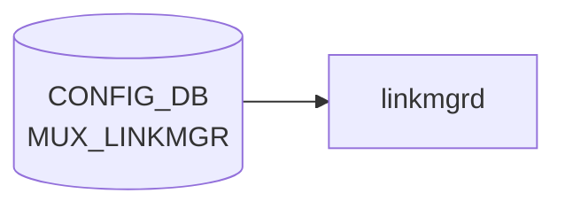

# MUX_LINKMGR テーブル

## 概要

DualToR (Active-Standby) 構成で `linkmgrd` の動作パラメータを [CONFIG_DB](../../reference/glossary.md#term-config_db) に保持するテーブル[^1]。ICMP ハートビート間隔やオシレーションの設定、ログレベル、サービス管理動作を 4 つのシングルトン container (`LINK_PROBER` / `TIMED_OSCILLATION` / `MUXLOGGER` / `SERVICE_MGMT`) に分けて持つ。

<!-- cdb-mermaid -->
### データフロー (自動生成)



!!! note "凡例"
    CONFIG_DB から SAI までの典型経路を `docs/reference/config-db-orch-map.md` から機械生成したミニ図。詳細・例外は本ページ本文と対応表を参照。
<!-- /cdb-mermaid -->

## key 構造

```text
MUX_LINKMGR|LINK_PROBER
MUX_LINKMGR|TIMED_OSCILLATION
MUX_LINKMGR|MUXLOGGER
MUX_LINKMGR|SERVICE_MGMT
```

## フィールド

### `MUX_LINKMGR|LINK_PROBER`

| フィールド | 型 | デフォルト | 単位 | 説明 |
|-----------|----|-----------|------|------|
| `interval_v4` | uint32 | `100` | ms | IPv4 ICMP ハートビート送信間隔 |
| `interval_v6` | uint32 | `1000` | ms | IPv6 ICMP ハートビート送信間隔 |
| `positive_signal_count` | uint32 | `1` | 件 | アクティブ判定に必要な連続受信回数 |
| `negative_signal_count` | uint32 | `3` | 件 | スタンバイ判定に必要な連続喪失回数 |
| `suspend_timer` | uint32 | なし | - | ICMP ハートビート停止タイマ (現状未使用と [YANG](../../reference/glossary.md#term-yang) コメント) |
| `use_well_known_mac` | enum `enabled`/`disabled` | なし | - | well-known MAC を宛先 MAC に使うか |
| `src_mac` | enum `ToRMac`/`VlanMac` | なし | - | ハートビート送信元 MAC の選択 |
| `interval_pck_loss_count_update` | uint32 | なし | - | パケットロス統計をテレメトリにストリーミングする頻度 |

### `MUX_LINKMGR|TIMED_OSCILLATION`

| フィールド | 型 | デフォルト | 説明 |
|-----------|----|-----------|------|
| `oscillation_enabled` | boolean | `true` | タイマー駆動オシレーション (定期的に Active 切替) の有効化 |
| `interval_sec` | uint32 (秒) | `300` | オシレーション間隔 |

### `MUX_LINKMGR|MUXLOGGER`

| フィールド | 型 | 説明 |
|-----------|----|------|
| `log_verbosity` | enum `trace`/`debug`/`info`/`error`/`fatal` | [linkmgrd](../../reference/glossary.md#term-linkmgrd) ログレベル |

### `MUX_LINKMGR|SERVICE_MGMT`

| フィールド | 型 | デフォルト | 説明 |
|-----------|----|-----------|------|
| `kill_radv` | enum `True`/`False` | `True` | radv (routing advertisement daemon) を gracefully 停止せず kill するか |

## 制約

- 全フィールドは [YANG](../../reference/glossary.md#term-yang) 上 mandatory ではなく、未指定なら `linkmgrd` の組み込み既定が使われる
- container 名 `MUX_LINKMGR`、内部 container 名は上記 4 つに固定

## 購読者

- `linkmgrd` (`docker-mux` 内): [CONFIG_DB](../../reference/glossary.md#term-config_db) → 起動時 / `notification` 経由で動的反映

## 関連 CONFIG_DB / YANG / CLI

- 関連 [CONFIG_DB](../../reference/glossary.md#term-config_db): [`MUX_CABLE`](mux-cable.md), [`PEER_SWITCH`](peer-switch.md)
- 関連 CLI: `config mux` 系 (一部のみ。多くは init_cfg / CONFIG_DB 直接)
- 関連 [YANG](../../reference/glossary.md#term-yang): `sonic-mux-linkmgr`

<!-- ref-triangle:start -->

## 関連リファレンス

- YANG: `sonic-mux-linkmgr`
- CLI: `config mux`

<!-- ref-triangle:end -->

## 引用元

[^1]: `src/sonic-yang-models/yang-models/sonic-mux-linkmgr.yang` (container `MUX_LINKMGR` / `LINK_PROBER` / `TIMED_OSCILLATION` / `MUXLOGGER` / `SERVICE_MGMT`). <https://github.com/sonic-net/sonic-buildimage/blob/9ea932ec2e18f35e58268ec2e4456b1d4afd65cd/src/sonic-yang-models/yang-models/sonic-mux-linkmgr.yang>

## 関連ページ
- [CONFIG_DB: MUX_CABLE](mux-cable.md)
- [CONFIG_DB: PEER_SWITCH](peer-switch.md)

<!-- ops-hint -->
## 運用ヒント

### 典型値

- key 形式: `MUX_LINKMGR|LINK_PROBER` 等`。
- `interval_v4_in_msec`: 100、`positive_signal_count`: 1、`negative_signal_count`: 3。

### よくある誤設定

- interval を短くしすぎて [linkmgrd](../../reference/glossary.md#term-linkmgrd) が CPU を消費し ToR の Mux state oscillation を誘発する。

### 確認コマンド

```bash
sonic-db-cli CONFIG_DB keys 'MUX_LINKMGR|*'
show mux config
```
<!-- /ops-hint -->

<!-- glossary-links-injected: be53736dfd16 -->
