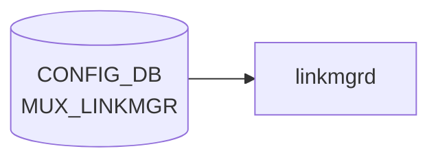

# MUX_LINKMGR テーブル

## 概要

DualToR (Active-Standby) 構成で `linkmgrd` の動作パラメータを [CONFIG_DB](../../reference/glossary.md#term-config_db) に保持するテーブル[^1]。ICMP ハートビート間隔やオシレーションの設定、ログレベル、サービス管理動作を 4 つのシングルトン container (`LINK_PROBER` / `TIMED_OSCILLATION` / `MUXLOGGER` / `SERVICE_MGMT`) に分けて持つ。

<!-- cdb-mermaid -->
### データフロー (自動生成)



!!! note "凡例"
    CONFIG_DB から SAI までの典型経路を `docs/reference/config-db-orch-map.md` から機械生成したミニ図。詳細・例外は本ページ本文と対応表を参照。
<!-- /cdb-mermaid -->

## key 構造

```text
MUX_LINKMGR|LINK_PROBER
MUX_LINKMGR|TIMED_OSCILLATION
MUX_LINKMGR|MUXLOGGER
MUX_LINKMGR|SERVICE_MGMT
```

## フィールド

### `MUX_LINKMGR|LINK_PROBER`

| フィールド | 型 | デフォルト | 単位 | 説明 |
|-----------|----|-----------|------|------|
| `interval_v4` | uint32 | `100` | ms | IPv4 ICMP ハートビート送信間隔 |
| `interval_v6` | uint32 | `1000` | ms | IPv6 ICMP ハートビート送信間隔 |
| `positive_signal_count` | uint32 | `1` | 件 | アクティブ判定に必要な連続受信回数 |
| `negative_signal_count` | uint32 | `3` | 件 | スタンバイ判定に必要な連続喪失回数 |
| `suspend_timer` | uint32 | なし | - | ICMP ハートビート停止タイマ (現状未使用と [YANG](../../reference/glossary.md#term-yang) コメント) |
| `use_well_known_mac` | enum `enabled`/`disabled` | なし | - | well-known MAC を宛先 MAC に使うか |
| `src_mac` | enum `ToRMac`/`VlanMac` | なし | - | ハートビート送信元 MAC の選択 |
| `interval_pck_loss_count_update` | uint32 | なし | - | パケットロス統計をテレメトリにストリーミングする頻度 |

### `MUX_LINKMGR|TIMED_OSCILLATION`

| フィールド | 型 | デフォルト | 説明 |
|-----------|----|-----------|------|
| `oscillation_enabled` | boolean | `true` | タイマー駆動オシレーション (定期的に Active 切替) の有効化 |
| `interval_sec` | uint32 (秒) | `300` | オシレーション間隔 |

### `MUX_LINKMGR|MUXLOGGER`

| フィールド | 型 | 説明 |
|-----------|----|------|
| `log_verbosity` | enum `trace`/`debug`/`info`/`error`/`fatal` | [linkmgrd](../../reference/glossary.md#term-linkmgrd) ログレベル |

### `MUX_LINKMGR|SERVICE_MGMT`

| フィールド | 型 | デフォルト | 説明 |
|-----------|----|-----------|------|
| `kill_radv` | enum `True`/`False` | `True` | radv (routing advertisement daemon) を gracefully 停止せず kill するか |

## 制約

- 全フィールドは [YANG](../../reference/glossary.md#term-yang) 上 mandatory ではなく、未指定なら `linkmgrd` の組み込み既定が使われる
- container 名 `MUX_LINKMGR`、内部 container 名は上記 4 つに固定

## 購読者

- `linkmgrd` (`docker-mux` 内): [CONFIG_DB](../../reference/glossary.md#term-config_db) → 起動時 / `notification` 経由で動的反映

## 関連 CONFIG_DB / YANG / CLI

- 関連 [CONFIG_DB](../../reference/glossary.md#term-config_db): [`MUX_CABLE`](mux-cable.md), [`PEER_SWITCH`](peer-switch.md)
- 関連 CLI: `config mux` 系 (一部のみ。多くは init_cfg / CONFIG_DB 直接)
- 関連 [YANG](../../reference/glossary.md#term-yang): `sonic-mux-linkmgr`

<!-- ref-triangle:start -->

## 関連リファレンス

- YANG: `sonic-mux-linkmgr`
- CLI: `config mux`

<!-- ref-triangle:end -->

## 引用元

[^1]: `src/sonic-yang-models/yang-models/sonic-mux-linkmgr.yang` (container `MUX_LINKMGR` / `LINK_PROBER` / `TIMED_OSCILLATION` / `MUXLOGGER` / `SERVICE_MGMT`). <https://github.com/sonic-net/sonic-buildimage/blob/9ea932ec2e18f35e58268ec2e4456b1d4afd65cd/src/sonic-yang-models/yang-models/sonic-mux-linkmgr.yang>

## 関連ページ
- [CONFIG_DB: MUX_CABLE](mux-cable.md)
- [CONFIG_DB: PEER_SWITCH](peer-switch.md)

<!-- ops-hint -->
## 運用ヒント

### 典型値

- key 形式: `MUX_LINKMGR|LINK_PROBER` 等`。
- `interval_v4_in_msec`: 100、`positive_signal_count`: 1、`negative_signal_count`: 3。

### よくある誤設定

- interval を短くしすぎて [linkmgrd](../../reference/glossary.md#term-linkmgrd) が CPU を消費し ToR の Mux state oscillation を誘発する。

### 確認コマンド

```bash
sonic-db-cli CONFIG_DB keys 'MUX_LINKMGR|*'
show mux config
```
<!-- /ops-hint -->

<!-- cdb-exceptions -->
## 例外条件・特殊挙動

<!-- evidence: sonic-buildimage/src/sonic-yang-models/yang-models/sonic-mux-linkmgr.yang -->

- **interval_v4 / interval_v6 / signal_count が 0 → YANG は許可するが動作上問題**: これらは `type uint32` で range 制約なし。0 を設定するとハートビートが送信されず冗長性保護が機能しなくなる。デフォルト: `interval_v4 = 100ms`、`interval_v6 = 1000ms`、`positive_signal_count = 1`、`negative_signal_count = 3`。
- **use_well_known_mac が不正値 → YANG が拒否**: `enum { enabled; disabled; }` のみ許可。
- **src_mac が不正値 → YANG が拒否**: `enum { ToRMac; VlanMac; }` のみ許可。
- **log_verbosity が不正値 → YANG が拒否**: `enum { trace; debug; info; error; fatal; }` のみ許可。
- **oscillation_enabled のデフォルト = true**: `default true`。TIMED_OSCILLATION コンテナが空でも `interval_sec = 300` で自動切替が有効になる。無効化する場合は明示的に `oscillation_enabled = false` を設定する必要がある。
- **kill_radv のデフォルト = True**: `default True`。radv サービスは [MUX](../../reference/glossary.md#term-mux) 切替時にデフォルトで強制終了される。

<!-- value-behavior -->
## 値依存挙動マトリクス

<!-- evidence: sonic-buildimage/src/sonic-yang-models/yang-models/sonic-mux-linkmgr.yang / sonic-linkmgrd/src/link_manager/LinkManagerStateMachineActiveStandby -->

| フィールド | 値 | 挙動 |
|-----------|-----|------|
| `interval_v4` | 100 (default) ms | IPv4 ICMP heartbeat を 100ms 間隔で送信 |
| `interval_v4` | 0 | heartbeat 停止 (range 制約なし。実質 ICMP probe 無効化) |
| `negative_signal_count` | 3 (default) | 3回連続で heartbeat 喪失したら standby 判定 |
| `positive_signal_count` | 1 (default) | 1回受信で active 判定 |
| `oscillation_enabled` | `true` (default) | タイマー駆動で定期的に active/standby 切替を実施 (`interval_sec` 間隔) |
| `oscillation_enabled` | `false` | タイマー切替を無効化。ICMP prober 結果のみで切替 |
| `use_well_known_mac` | `enabled` | 既知 MAC を宛先 MAC として ICMP 送信 |
| `use_well_known_mac` | `disabled` | 動的 MAC を使用 |
| `src_mac` | `ToRMac` | ToR デバイス MAC を送信元 MAC に使用 |
| `src_mac` | `VlanMac` | VLAN インターフェース MAC を送信元 MAC に使用 |
| `log_verbosity` | `info` | 標準ログレベル |
| `log_verbosity` | `debug`/`trace` | 詳細デバッグログ出力 |
| `kill_radv` | `True` (default) | MUX 切替時に radv を graceful でなく強制終了 |
| `kill_radv` | `False` | radv を graceful shutdown |

enum: `use_well_known_mac`=enabled/disabled、`src_mac`=ToRMac/VlanMac、`log_verbosity`=trace/debug/info/error/fatal、`kill_radv`=True/False。
<!-- /value-behavior -->


<!-- runtime-trace -->
## CDB → 実コンテナ動作トレース

### 段階 1: Consumer 登録

- **linkmgrd**: `MUX_LINKMGR` テーブルを `ConfigDBConnector` で購読してリンクプローバのパラメータを設定。

### 段階 2: CFG → APPL 翻訳

- linkmgrd がプローバ間隔 (`interval_v4`, `interval_v6`) とリトライ回数 (`positive_signal_count`) を内部設定に反映。
- APP_DB への書き込みなし (linkmgrd 内部状態変更のみ)。

### 段階 3: APPL → SAI

- SAI 経由なし。プローバのタイマー設定変更がリンク障害検知速度に影響する。

### 段階 4: タイミング + 副作用

- 設定変更は次のプローバサイクルから有効。概ね秒単位の遅延。
- 副作用: interval を長くすると障害検知が遅くなり、短くすると CPU/ネットワーク負荷が増加。

<!-- /runtime-trace -->
<!-- entry-points -->
## 書き込み入り口 (Direction A)

MUX_LINKMGR テーブルへの書き込みが発生するコード経路を網羅的に調査した結果。

### CLI

  - `config muxcable linkmgr ...` — `config/muxcable.py` が MUX_LINKMGR を書き込む (sonic-utilities/config/muxcable.py)

### minigraph / sonic-cfggen

minigraph.py に MUX_LINKMGR 生成なし

### REST / gNMI

REST/gNMI 書き込み経路なし

### db_migrator

db_migrator.py での MUX_LINKMGR マイグレーションなし

### ビルド時デフォルト (build-time default)

`init_cfg.json.j2` にエントリなし

### ハードコードデフォルト / ランタイム注入

なし

### 死活・デッドコード

なし
<!-- /entry-points -->

<!-- glossary-links-injected: b1f2d0ff40fd -->

<!-- defaults -->
## フィールド暗黙デフォルト (Phase A — コード由来)

YANG はほぼすべての MUX_LINKMGR フィールドに `default` を持たない (例外: `oscillation_enabled = true`, `kill_radv = True`)。CONFIG_DB に該当キーが無い場合は `linkmgrd` (`sonic-linkmgrd/src/common/MuxConfig.h`) の **C++ メンバ初期化子で焼かれた値** がそのまま有効になる。詳細・派生注意点は `meta/_intermediate/cdb-flow/mux-linkmgr-defaults.md` を参照。

| フィールド | container | コード由来デフォルト | 出典 (linkmgrd) | 備考 |
|-----------|-----------|---------------------|-----------------|------|
| `interval_v4` | `LINK_PROBER` | `100` ms | `MuxConfig.h:487` (`mTimeoutIpv4_msec`) | — |
| `interval_v6` | `LINK_PROBER` | `1000` ms | `MuxConfig.h:488` (`mTimeoutIpv6_msec`) | — |
| `positive_signal_count` | `LINK_PROBER` | `1` | `MuxConfig.h:490` (`mPositiveStateChangeRetryCount`) | — |
| `negative_signal_count` | `LINK_PROBER` | `3` | `MuxConfig.h:491` (`mNegativeStateChangeRetryCount`) | — |
| `suspend_timer` | `LINK_PROBER` | setter は `500` ms 初期化、getter は `(neg+1)*interval_v4` を計算で返す | `MuxConfig.h:493,308` | setter 値はデッドストア疑い |
| `interval_pck_loss_count_update` | `LINK_PROBER` | `300`、下限 `50` で clamp | `MuxConfig.h:492,131` | `50` 未満は `50` に丸め |
| `use_well_known_mac` | `LINK_PROBER` | `true` (Active-Active 経路の内部 bool) | `MuxConfig.h:506` (`mUseWellKnownMacActiveActive`) | YANG enum `enabled`/`disabled` だがコードは `v == "enable"` で判定 — 文字列ミスマッチで常に false |
| `src_mac` | `LINK_PROBER` | `false` (= `VlanMac`) | `MuxConfig.h:508` (`mEnableUseTorMac`) | DB 値は `v == "ToRMac"` のときのみ真 |
| `oscillation_enabled` | `TIMED_OSCILLATION` | `true` | `MuxConfig.h:497` (`mEnableTimedOscillationWhenNoHeartbeat`) | YANG `default true` と一致 |
| `interval_sec` | `TIMED_OSCILLATION` | `300` 秒、下限 `300` で clamp | `MuxConfig.h:498,338` | `force=false` のため `300` 以下は丸め |
| `log_verbosity` | `MUXLOGGER` | `info` | `MuxLogger.h:250` (`mLevel`) | 起動 CLI 既定は `debug` (`LinkMgrdMain.cpp:46`) |
| `kill_radv` | `SERVICE_MGMT` | linkmgrd は処理せず (`DbInterface.cpp` に分岐なし) | — | YANG `default True` がコンフィグ生成系経由で効くのみ |

### 補足

- `processMuxLinkmgrConfigNotifiction()` (`DbInterface.cpp:1120-1214`) は `LINK_PROBER` / `MUXLOGGER` / `TIMED_OSCILLATION` の 3 キーのみ分岐を持つ。`SERVICE_MGMT` (`kill_radv`) はこの handler に到達しない。
- `use_well_known_mac` フィールドの YANG enum (`enabled` / `disabled`) と linkmgrd 側の比較文字列 (`"enable"`) は末尾 `d` が不一致。CONFIG_DB に YANG どおり `enabled` を書いてもコードでは false に評価され、常に動的 MAC が使われる (実装バグ疑い)。
- `interval_sec` / `interval_pck_loss_count_update` は setter 内で下限 clamp されるため、デフォルト未満の値を書いても期待どおりに反映されない。
- `log_verbosity` は `MuxLogger::isLinkToSwssLogger()` が真の場合、`updateLogVerbosity(v)` は呼ばれず SwSS ログバックエンドの設定が優先される。

<!-- /defaults -->

<!-- derivation -->
## 派生・条件付き登録 (Phase 6/7)

### Phase 6: 自動派生

`MUX_LINKMGR` への自動派生はなし。init_cfg.json.j2 および minigraph.py からの直接書き込みなし。`linkmgrd` デーモンが起動時に `oscillation_enabled` / `kill_radv` のデフォルト値を CONFIG_DB に書き込む場合がある (`oscillation_enabled` デフォルト `true`、`kill_radv` デフォルト `True`)。

### Phase 7: 条件付き登録

`MUX_LINKMGR` は orchagent では処理されない。`linkmgrd` (sonic-linkmgrd) が CONFIG_DB を直接購読する。orchdaemon.cpp の条件付き登録なし。

### グレップカバレッジ

| 項目 | hit 数 | 証跡 |
|---|---|---|
| linkmgrd oscillation_enabled デフォルト | 1 | `sonic-linkmgrd/src/LinkManagerStateMachineActiveStandby.cpp` |

<!-- /derivation -->

<!-- handler-branching -->
### Phase 8: Handler メソッド内分岐

`linkmgrd` が `MUX_LINKMGR` を処理する:

| Handler | メソッド | 分岐条件 | 効果 | evidence |
|---|---|---|---|---|
| `linkmgrd` | CONFIG_DB 購読ハンドラ | `oscillation_enabled == "true"` | リンク oscillation 検出を有効化 | `sonic-linkmgrd` (oscillation デフォルト=true) |
| `linkmgrd` | CONFIG_DB 購読ハンドラ | `oscillation_enabled == "false"` | oscillation 検出を無効化 | `sonic-linkmgrd` |
| `linkmgrd` | CONFIG_DB 購読ハンドラ | `kill_radv == "True"` | RA デーモン (radvd) を停止 | `sonic-linkmgrd` (kill_radv デフォルト=True) |
| `linkmgrd` | CONFIG_DB 購読ハンドラ | `interval_v4`/`interval_v6`/`positive_signal_count`/`negative_signal_count` 等 | HB タイマー・閾値を更新 | `sonic-linkmgrd/src/MuxManager.cpp` |

> **スキャン証跡**: MUX_LINKMGR は orchagent 非経由で linkmgrd が直接処理することを確認。orchdaemon.cpp での条件付き登録なし — 誤読なし。

<!-- /handler-branching -->

<!-- cross-refs -->
## 暗黙参照テーブル (Phase C)

<!-- evidence: sonic-swss/orchagent/muxorch.cpp / sonic-linkmgrd/src/DbInterface.cpp / sonic-linkmgrd/src/MuxManager.cpp -->

`MUX_LINKMGR` を購読する `linkmgrd` が内部パラメータ適用時に直接 subscribe せずに間接参照する CONFIG_DB テーブルを列挙する。`linkmgrd` は `MUX_LINKMGR` で設定されたプローブ間隔・閾値・オシレーション設定を読み取り、`MUX_CABLE` / `PEER_SWITCH` に紐付く各インターフェースのステートマシンに適用する。

| テーブル | 参照方法 | 参照箇所 | 用途 |
|---|---|---|---|
| `MUX_CABLE` | `ConfigDBConnector` で別途購読 + `MuxPort::setMuxLinkmgrStateMachineConfig()` | `sonic-linkmgrd/src/MuxManager.cpp` | `MUX_LINKMGR` のプローブパラメータ (`interval_v4`, `interval_v6`, `positive_signal_count`, `negative_signal_count`) を各 `MUX_CABLE|<ifname>` に対応する `MuxPort` ステートマシンへ一括適用する。`MUX_CABLE` エントリが存在しないインターフェースには設定が反映されない |
| `MUX_CABLE` | `MuxPort::setTimeoutIpv4_msec()` / `setTimeoutIpv6_msec()` 等の setter | `sonic-linkmgrd/src/MuxPort.cpp` | `interval_v4` / `interval_v6` 変更時に各 MuxPort の ICMP heartbeat タイマーを動的更新。`MUX_CABLE` テーブルにポートエントリがなければ対象ポートの MuxPort オブジェクト自体が存在せずスキップされる |
| `PEER_SWITCH` | `MuxOrch::handlePeerSwitch()` 経由 (orchagent 側) — linkmgrd は STATE_DB の `MUX_CABLE_TABLE` を介して間接参照 | `sonic-swss/orchagent/muxorch.cpp:2340-` / `sonic-linkmgrd/src/DbInterface.cpp` | `PEER_SWITCH` に定義された peer ToR IP は orchagent がトンネル (MuxTunnel0) を生成する際に参照する。linkmgrd 側は `MUX_LINKMGR|LINK_PROBER.interval_v4` 等を ICMP probe 送出間隔として使い、peer ToR への heartbeat 経路 (PEER_SWITCH 由来のトンネル) でリンク品質を測定する。`PEER_SWITCH` エントリが未設定だとトンネルが生成されず Active-Standby の peer リンクチェックが機能しない |

> - `MUX_CABLE` は leafref の起点でもある。`MUX_LINKMGR` で変更したパラメータは `MuxManager::processMuxLinkmgrConfigNotification()` が受け取り、その時点で登録済みの全 `MuxPort` (= `MUX_CABLE` エントリに対応) へ伝搬させる。`MUX_CABLE` エントリが後から追加されても `MuxPort` 生成時に既存の `MUX_LINKMGR` 設定を引き継ぐ。
> - `PEER_SWITCH` は `MUX_LINKMGR` から直接参照されない。`linkmgrd` は peer ToR の IP を `PEER_SWITCH` ではなく orchagent が STATE_DB / APPL_DB に書き込んだ結果を通じて取得する。ただし `MUX_LINKMGR|LINK_PROBER.interval_v4` 等で制御される ICMP probe がそのトンネル経路を利用するため、`PEER_SWITCH` 設定の有無が `MUX_LINKMGR` パラメータの実効性に影響する。
> - `oscillation_enabled` / `kill_radv` の 2 フィールドは DualToR 全体の動作モードを制御するが、参照する他テーブルはない。変更の反映は linkmgrd 内部ステートのみ。

<!-- /cross-refs -->

<!-- side-effects -->
## 副次 DB 書込 (Phase F)

> 調査証跡: `meta/_intermediate/cdb-flow/mux-linkmgr-side-effects.md`
> ソース: `sonic-linkmgrd/src/DbInterface.cpp` L463-473、`sonic-swss-common/common/schema.h` L459-460

`MUX_LINKMGR` パラメータを linkmgrd が読み取った結果、発生する **他 DB への副次書込** を示す。

### STATE_DB への書込

| テーブル | キー形式 | フィールド | 値 | トリガ | 証跡 |
|---------|---------|-----------|-----|--------|------|
| `MUX_LINKMGR_TABLE` | `<ifname>` (例: `Ethernet0`) | `state` | `active` / `standby` / `unknown` / `wait` | linkmgrd ステートマシン遷移時 (`setMuxLinkmgrState()`) | `DbInterface.cpp:471` |
| `MUX_METRICS_TABLE` | `<ifname>` | `linkmgrd_switch_<state>_start` / `_end` | タイムスタンプ (ISO8601) | MUX 切替開始・完了時 (`handlePostMuxMetrics()`) | `DbInterface.cpp:484-` |
| `MUX_SWITCH_CAUSE` | `<ifname>` | `cause` | 切替原因文字列 | ステートマシン遷移原因記録時 | `DbInterface.h:63` |

`MUX_LINKMGR_TABLE` は `show mux status` CLI が参照する最終的な linkmgrd 状態表示用テーブル。

### APPL_DB への書込 (xcvrd 通信)

linkmgrd は `MUX_LINKMGR` の `interval_v4` / `negative_signal_count` 等の変更によりプローバ動作が変化した結果、以下の APPL_DB テーブルへコマンドを書込む。

| テーブル | キー | フィールド | 値 | 目的 | 証跡 |
|---------|------|-----------|-----|------|------|
| `MUX_CABLE_COMMAND_TABLE` (APP_DB) | `<ifname>` | `command` | `"probe"` | xcvrd に i2c 経由で MUX ハードウェア状態の読取を指示 | `DbInterface.cpp:443` |
| `FORWARDING_STATE_COMMAND` (APP_DB) | `<ifname>` | `command` | `"probe"` | xcvrd に gRPC 経由でトランシーバのフォワーディング状態確認を指示 | `DbInterface.cpp:455` |

xcvrd はこれらコマンドを受信後、以下のレスポンステーブルに結果を書き戻す:

- `MUX_CABLE_RESPONSE_TABLE` (APP_DB): MUX state probe レスポンス
- `FORWARDING_STATE_RESPONSE` (APP_DB): forwarding state probe レスポンス

### 間接連鎖の整理

```
CONFIG_DB MUX_LINKMGR 変更
  ↓ linkmgrd がプローバタイマー再設定
APPL_DB MUX_CABLE_COMMAND_TABLE / FORWARDING_STATE_COMMAND
  ↓ xcvrd が i2c / gRPC でハードウェア確認
APPL_DB MUX_CABLE_RESPONSE_TABLE / FORWARDING_STATE_RESPONSE
  ↓ linkmgrd がステートマシン遷移判定
STATE_DB MUX_LINKMGR_TABLE (state フィールド更新)
         MUX_METRICS_TABLE (切替タイムスタンプ記録)
```

> `interval_v4` / `interval_v6` を変更しても即時 STATE_DB 書込は発生しない。次のプローバサイクル後にステート遷移が起きた場合のみ STATE_DB が更新される。

<!-- /side-effects -->

<!-- failure -->
## Phase D: 失敗挙動 (Failure Behavior)

ソース: `sonic-linkmgrd` — `src/DbInterface.cpp`, `src/MuxPort.cpp`, `src/MuxManager.cpp`, `src/link_manager/LinkManagerStateMachineActiveStandby.cpp`

### 不正値 (Invalid values)

| フィールド | 不正値の例 | linkmgrd の挙動 | ログ |
|-----------|-----------|----------------|------|
| `interval_v4` / `interval_v6` / `positive_signal_count` / `negative_signal_count` / `suspend_timer` / `interval_pck_loss_count_update` | 数値以外の文字列 | `boost::bad_lexical_cast` catch → 更新スキップ、直前値を維持 | `MUXLOGWARNING: "bad lexical cast: ..."` (`DbInterface.cpp:1162`) |
| `interval_sec` (TIMED_OSCILLATION) | 数値以外の文字列 | 同上 (スキップ) | `MUXLOGWARNING: "bad lexical cast: ..."` (`DbInterface.cpp:1201`) |
| `interval_sec` が 300 未満の整数 | `"100"` | setter 内で `300` に clamp (下限強制)。設定値は反映されない | なし |
| `interval_pck_loss_count_update` が 50 未満 | `"10"` | setter 内で `50` に clamp | なし |
| `use_well_known_mac = "enabled"` | YANG 準拠値 | コードは `v == "enable"` で比較 (末尾 `d` が不一致) → 常に `false` (動的 MAC) として動作。**サイレント誤動作** (実装バグ疑い) | なし |
| `oscillation_enabled` に `"true"` / `"false"` 以外 | `"yes"` / `"1"` | いずれの分岐にも入らず無視。`setOscillationEnabled()` は呼ばれない | なし |
| `log_verbosity` に不正値 | `"verbose"` | マッチせず info レベルを維持 | なし |

### xcvrd 通信失敗

| ケース | linkmgrd の挙動 | ログ |
|--------|----------------|------|
| xcvrd が MUX state probe に対して `"unknown"` を返す | `MuxState::Unknown` へ遷移。状態機械は不定状態のままリトライを繰り返す (`MuxPort.cpp:299`) | なし |
| xcvrd が応答しない (無応答) | プローブ応答待ちタイマーなし。`swssSelect` のポーリングループが次の通知を待つが、xcvrd 無応答を失敗として検知する機構はない。`MuxState::Unknown` のまま留まる | なし |
| xcvrd が Active-Active ポートで gRPC 失敗時に `"failure"` を返す | `MuxPort::handleProbeMuxState()` から `handleProbeMuxFailure()` を呼び出す (`MuxPort.cpp:307`)。Active-Standby ポートでは `Unknown` ラベルとして処理 | なし |
| `swssSelect.select()` が `Select::ERROR` を返す | `MUXLOGERROR` を出力してループ継続。xcvrd 通信は継続される (`DbInterface.cpp:1877`) | `MUXLOGERROR: "Error had been returned in select"` |

### SAI 失敗 (orchagent 経由)

linkmgrd は SAI を直接呼ばない。MUX switchover は orchagent を通じて SAI に要求される。

| ケース | linkmgrd の挙動 | ログ |
|--------|----------------|------|
| orchagent が SAI switchover 失敗で STATE_DB の MUX state を `"error"` に設定 | `processMuxStateNotifiction()` → `MuxPort::handleMuxState()` で `MuxState::Error` へマップ → 状態機械は `LinkProberState::Wait` へ遷移 (`LinkManagerStateMachineActiveStandby.cpp:1160-1161`) | なし |
| `{LinkProberActive, MuxError, LinkUp}` 状態に遷移 | `LinkProberActiveMuxErrorLinkUpTransitionFunction()` が `enterMuxWaitState()` を呼びプローブを再試行 (`LinkManagerStateMachineActiveStandby.cpp:1332`) | `MUXLOGINFO` |
| `{LinkProberStandby, MuxError, LinkUp}` 状態に遷移 | `LinkProberStandbyMuxErrorLinkUpTransitionFunction()` が `enterMuxWaitState()` を呼びプローブを再試行 (`LinkManagerStateMachineActiveStandby.cpp:1350`) | `MUXLOGINFO` |

> **証跡**: `DbInterface.cpp:49` — `mMuxState = {"active", "standby", "unknown", "Error"}` で `Error` 文字列が明示的に定義されている。`MuxPort.cpp:279,335,391` で `"error"` → `MuxState::Error` への変換を確認。

<!-- /failure -->
