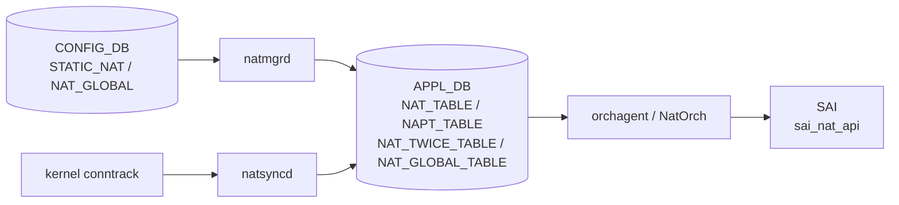

# APPL_DB NAT テーブル群

## 概要

`NAT_TABLE`、`NAPT_TABLE`、`NAT_TWICE_TABLE`、`NAPT_TWICE_TABLE`、`NAT_GLOBAL_TABLE`、`NAT_DNAT_POOL_TABLE` は [APPL_DB](../../reference/glossary.md#term-appl_db) 上の NAT 関連テーブル群[^1]。`natmgrd` が [CONFIG_DB](../../reference/glossary.md#term-config_db) の static NAT/NAPT 設定を変換してこれらへ書き込み、`natsyncd` が kernel conntrack から dynamic エントリを書き込む。`orchagent / NatOrch` が消費して [SAI](../../reference/glossary.md#term-sai) `sai_nat_api` 経由でハードウェアへ降ろす[^2]。

<!-- cdb-mermaid -->
### データフロー (自動生成)



!!! note "凡例"
    CONFIG_DB から SAI までの典型経路。詳細は本ページ本文を参照。
<!-- /cdb-mermaid -->

## key 構造

```text
NAT_TABLE|<global_ip>
NAPT_TABLE|<proto>|<global_ip>|<global_port>
NAT_TWICE_TABLE|<src_ip>|<dst_ip>
NAPT_TWICE_TABLE|<proto>|<src_ip>|<src_port>|<dst_ip>|<dst_port>
NAT_GLOBAL_TABLE|Values
NAT_DNAT_POOL_TABLE|<dnat_ip>
```

key セグメント数が規定値以外の場合は `NatOrch` が `SWSS_LOG_ERROR + erase` して処理をスキップする。

## 主要フィールド

### NAT_TABLE

| フィールド | 型 | 必須 | 説明 |
|-----------|----|------|------|
| `translated_ip` | IPv4 address | yes | 変換後 IP アドレス |
| `nat_type` | enum `snat` / `dnat` | yes | NAT 種別 |
| `entry_type` | enum `static` / `dynamic` | yes | static (natmgrd 由来) / dynamic (natsyncd 由来) |

key は `<global_ip>` の単一セグメント。`entry_type` / `nat_type` は省略不可 — 欠落時 `assert` abort (`natorch.cpp:2659`)。

### NAPT_TABLE

| フィールド | 型 | 必須 | 説明 |
|-----------|----|------|------|
| `translated_ip` | IPv4 address | yes | 変換後 IP |
| `translated_l4_port` | uint16 | yes | 変換後 L4 ポート |
| `nat_type` | enum `snat` / `dnat` | yes | NAT 種別 |
| `entry_type` | enum `static` / `dynamic` | yes | エントリ種別 |

key は `<proto>:<global_ip>:<global_port>` の 3 セグメント。proto は `TCP` または `UDP`。

### NAT_TWICE_TABLE

| フィールド | 型 | 必須 | 説明 |
|-----------|----|------|------|
| `translated_src_ip` | IPv4 address | yes | 変換後 src IP |
| `translated_dst_ip` | IPv4 address | yes | 変換後 dst IP |
| `entry_type` | enum `static` / `dynamic` | yes | エントリ種別 |

key は `<src_ip>:<dst_ip>` の 2 セグメント。Twice NAT (SNAT+DNAT 同時) に使用。

### NAPT_TWICE_TABLE

| フィールド | 型 | 必須 | 説明 |
|-----------|----|------|------|
| `translated_src_ip` | IPv4 address | yes | 変換後 src IP |
| `translated_src_l4_port` | uint16 | yes | 変換後 src ポート |
| `translated_dst_ip` | IPv4 address | yes | 変換後 dst IP |
| `translated_dst_l4_port` | uint16 | yes | 変換後 dst ポート |
| `entry_type` | enum `static` / `dynamic` | yes | エントリ種別 |

key は `<proto>:<src_ip>:<src_port>:<dst_ip>:<dst_port>` の 5 セグメント。

### NAT_GLOBAL_TABLE

| フィールド | 型 | デフォルト | 説明 |
|-----------|----|-----------|------|
| `admin_mode` | enum `enabled` / `disabled` | `"disabled"` | NAT 機能の有効 / 無効 |
| `nat_timeout` | int (秒) | `600` | 非 TCP/UDP NAT セッション timeout |
| `nat_tcp_timeout` | int (秒) | `86400` | TCP NAT セッション timeout |
| `nat_udp_timeout` | int (秒) | `300` | UDP NAT セッション timeout |

key は固定文字列 `"Values"`。他のキーは `NatOrch` が ERROR + erase (`natorch.cpp:2924-2928`)。`admin_mode` が `"enabled"` / `"disabled"` 以外は `assert` abort (`natorch.cpp:2938`)。

### NAT_DNAT_POOL_TABLE

フィールドなし (`NULL: NULL`)。key の IP アドレスが DNAT pool に登録されたことを示すフラグテーブル。1 セグメント以外のキーは ERROR + erase (`natorch.cpp:2983-2987`)。

<!-- ordering -->
## 書込み順依存 (Phase B)

`NatOrch` は `NAT_GLOBAL_TABLE.admin_mode` が `"enabled"` になるまで NAT/NAPT エントリを SAI に降ろさず内部キャッシュに保持する。APPL_DB への書き込み順序によって SAI 操作のタイミングが変わる。

### 検出された順序依存

| # | 依存関係 | 方向 | 緩和策 |
|---|----------|------|--------|
| 1 | `NAT_GLOBAL_TABLE.admin_mode = "enabled"` → NAT_TABLE / NAPT_TABLE エントリ SAI 反映 | **強制先行**（enable 前エントリはキャッシュ保持のみ） | `enableNatFeature()` 内 `addAllNatEntries()` が既存キャッシュを一括 SAI 投入 |
| 2 | `NAT_DNAT_POOL_TABLE` → DNAT SAI エントリ登録 | enable 後に先行推奨 | `enableNatFeature()` 内 `addAllDnatPoolEntries()` が既存 pool を一括投入 |
| 3 | `NAT_DNAT_POOL_TABLE` 書込み → `NAT_TABLE (nat_type=dnat)` / `NAPT_TABLE (nat_type=dnat)` 書込み | 順序任意（NatOrch が独立管理） | pool と NAT エントリは別テーブル・別 `doTask` で処理され依存なし |
| 4 | `natmgrd` CONFIG_DB → APPL_DB 変換 → `NatOrch` 消費 | 非同期パイプライン | `natmgrd` は `isNatEnabled() == false` 時タイムアウト変更を APPL_DB に書かない |
| 5 | `NAT_GLOBAL_TABLE.admin_mode = "disabled"` → 全 NAT エントリ SAI 削除 | 即時（`disableNatFeature()` で全削除） | re-enable 時は `enableNatFeature()` でキャッシュから再投入 |
| 6 | 動的エントリ (natsyncd) 書込み → `NAT_GLOBAL_TABLE.admin_mode = "enabled"` 後 | 任意（キャッシュに積まれ enable 時一括投入） | disabled 状態で書かれたエントリは `m_natEntries` に保持、enable で SAI へ |
| 7 | NH 解決 (NeighOrch / RouteOrch) → DNAT エントリ SAI 反映 | 非同期（NH 解決待ち） | `gNhTrackingSupported == true` 時は `addDnatToNhCache()` 経由で NH 解決後に SAI 投入 |

### 主要な制約詳細

**NAT_GLOBAL_TABLE 先行必須 (依存 #1)**: `addNatEntry()` は `isNatEnabled() == false` の場合 WARN ログを出して `return true` する（エントリは `m_natEntries` に保持）。SAI API は呼ばれない。`doNatGlobalTableTask()` が `admin_mode = "enabled"` を受信すると `enableNatFeature()` が呼ばれ、内部で `addAllNatEntries()` が既存キャッシュ全エントリを順次 SAI に投入する。このため NAT_TABLE エントリを先に書いても、`NAT_GLOBAL_TABLE.admin_mode = "enabled"` が書かれるまで SAI エントリは存在しない（evidence: `natorch.cpp:1907-1913`, `natorch.cpp:2534-2582`, `natorch.cpp:3178-3260`）。

**DNAT Pool と DNAT エントリの独立性 (依存 #3)**: `doDnatPoolTableTask()` と `doNatTableTask()` は独立した consumer handler として動作し、相互にブロックしない。NAT_TABLE の DNAT エントリは Pool エントリの存在に依存せず SAI `sai_nat_api` に投入される。Pool は `addHwDnatPoolEntry()` で別途 SAI に登録される。どちらを先に書いても NatOrch は両者を独立して処理する（evidence: `natorch.cpp:2968-3040`, `natorch.cpp:1866-1937`）。

**NH 解決依存の DNAT (依存 #7)**: `gNhTrackingSupported == true` のプラットフォームでは、DNAT エントリを処理する際に `addDnatToNhCache()` が `m_neighOrch->getNeighborEntry()` で隣接解決を試みる。未解決の場合は `m_routeOrch->attach(this, translatedIp)` で RouteOrch に observer 登録し、NextHop 解決通知を受けて `addHwDnatEntry()` を遅延実行する。この間 DNAT エントリは内部キャッシュに留まり SAI に降りない（evidence: `natorch.cpp:391-430`, `natorch.cpp:407-414`）。

<!-- /ordering -->

<!-- cross-refs -->
## 暗黙参照テーブル (Phase C)

`NatOrch` が APPL_DB NAT テーブル群を消費する際、YANG leafref 定義を超えて実装上で参照するテーブル・リソース・Orch を示す。

| 参照先テーブル / リソース | 参照方向 | 条件 | 参照元 evidence |
|--------------------------|---------|------|----------------|
| `NAT_GLOBAL_TABLE\|Values.admin_mode` (APPL_DB) | 読み取り (SAI ガード) | 常時。`isNatEnabled() == false` の間は全テーブルエントリが SAI に降りずキャッシュ保持のみ | `natorch.cpp` L1907–1913, L2009–2015, L2137–2143, L2294–2300, L2345–2355 |
| `NeighOrch` 内部隣接キャッシュ | 問い合わせ (NH 解決) | `gNhTrackingSupported == true` かつ `nat_type=dnat` エントリ処理時。`m_neighOrch->getNeighborEntry(translatedIp, ...)` で隣接を確認 | `natorch.cpp` L390–430, L407–414 |
| `RouteOrch` next-hop Observer | Observer 登録 → 非同期通知 | `gNhTrackingSupported == true` かつ 隣接未解決時。`m_routeOrch->attach(this, translatedIp)` で NH 解決を待機し `update()` コールバックで SAI 投入 | `natorch.cpp` L414, L200–260, L308–388 |
| `SAI_SWITCH_ATTR_AVAILABLE_SNAT_ENTRY` (SAI capability) | 起動時 1 回クエリ | 常時。`maxAllowedSNatEntries` を決定し、dynamic SNAT エントリ追加時の上限チェックに使用。SAI クエリ失敗時は 0 (無制限扱い) | `natorch.cpp` L109–125, L1882–1893, L1996–2000 |
| `COUNTERS_DB:COUNTERS_GLOBAL_NAT_TABLE:Values` | 書き出し (カウンタ更新) | SNAT/DNAT エントリ追加/削除ごとに `updateSnatCounters()` / `updateDnatCounters()` が `SNAT_ENTRIES` / `DNAT_ENTRIES` を更新 | `natorch.cpp` L56, L127–135, L1412–1413 |
| `platform` 環境変数 (BRCM 判定) | 読み取り (起動時 1 回) | `getenv("platform")` に `"broadcom"` が含まれる場合のみ `gNhTrackingSupported = true`。非 BRCM では NH トラッキングなし → DNAT エントリは NH 解決後即時 SAI 投入 | `natorch.cpp` L144–149 |

!!! note "YANG leafref 非対応の参照"
    上記参照はいずれも YANG `sonic-nat` の leafref として定義されていない。`NeighOrch` / `RouteOrch` / SAI capability / `platform` 環境変数への依存は `natorch.cpp` の実装コードによってのみ強制される暗黙の前提条件である。

!!! note "NH トラッキング非対応プラットフォームの動作"
    `gNhTrackingSupported == false` (非 BRCM) のプラットフォームでは、DNAT エントリは `addHwDnatEntry()` を即時呼び出す直接経路を使う。`NeighOrch` / `RouteOrch` への observer 登録は行われないため、NH が未解決でも SAI 投入を試みる。

<!-- /cross-refs -->

<!-- failure -->
## 失敗挙動マトリクス (Phase D)

`NatOrch` (`orchagent/natorch.cpp`) が APPL_DB NAT テーブル群を消費する際の各テーブルごとの失敗経路を示す。

### NAT_TABLE / NAPT_TABLE / NAT_TWICE_TABLE / NAPT_TWICE_TABLE — SET 処理における失敗経路

| 失敗条件 | 検出箇所 | 結果 | evidence |
|---|---|---|---|
| key セグメント数不正 (NAT_TABLE: 1 以外、NAPT_TABLE: 3 以外、TWICE_TABLE: 2 以外、TWICE_NAPT: 5 以外) | 各 `doTask()` 冒頭 | ERROR ログ → `erase(it)` → **恒久スキップ** | `natorch.cpp:2636-2640`, `natorch.cpp:2697-2701`, `natorch.cpp:2730-2734`, `natorch.cpp:2770-2774` |
| `entry_type` が `"dynamic"` / `"static"` 以外 | `doNatTableTask()` / 他 | `assert` abort — orchagent プロセス停止 | `natorch.cpp:2659` |
| dynamic SNAT エントリ数が `maxAllowedSNatEntries` に到達 | `addNatEntry()` | INFO ログ → `setTimeoutNotifier->send("AGEOUT-SINGLE-NAT")` → `return true`（エージアウト通知、エントリ破棄） | `natorch.cpp:1882-1893` |
| `isNatEnabled() == false` (`admin_mode != "enabled"`) | `addNatEntry()` / `addNaptEntry()` 等 | WARN ログ → エントリを `m_natEntries` / `m_naptEntries` に保持 → `return true`（SAI は呼ばない） | `natorch.cpp:1907-1913`, `natorch.cpp:2009-2015`, `natorch.cpp:2137-2143`, `natorch.cpp:2294-2300` |
| SAI `create_nat_entry` 失敗 (一般エラー) | `addHwDnatEntry()` / `addHwSnatEntry()` 等 | ERROR ログ → `handleSaiCreateStatus(SAI_API_NAT)` → `parseHandleSaiStatusFailure()` → 失敗時 `return false` → `doTask` で `it++`（次サイクルで再試行） | `natorch.cpp:774-782`, `natorch.cpp:1307-1315` |
| DNAT エントリ処理時 NH 未解決 (`gNhTrackingSupported == true`) | `addDnatToNhCache()` 内 `m_neighOrch->getNeighborEntry` | `m_routeOrch->attach()` で Observer 登録 → SAI 投入を保留（キャッシュに滞留） | `natorch.cpp:390-430`, `natorch.cpp:407-414` |

### NAT_TABLE / NAPT_TABLE / NAT_TWICE_TABLE / NAPT_TWICE_TABLE — DEL 処理における失敗経路

| 失敗条件 | 検出箇所 | 結果 | evidence |
|---|---|---|---|
| 削除対象エントリが内部キャッシュに存在しない | `removeNatEntry()` / `removeNaptEntry()` 等 | INFO ログ → `return true`（冪等・成功扱い） | `natorch.cpp:1944-1948`, `natorch.cpp:2069-2073` |
| エントリが `addedToHw == false`（SAI 未登録） | `removeNatEntry()` / 他 | INFO ログ → キャッシュのみ削除 → `return true` | `natorch.cpp:1955-1960` |
| SAI `remove_nat_entry` 失敗 | `removeHwDnatEntry()` 等 | ERROR ログ → `handleSaiRemoveStatus(SAI_API_NAT)` → `parseHandleSaiStatusFailure()` → `return false` → `doTask` で `it++` | `natorch.cpp:928-936`, `natorch.cpp:1017-1025` |

### NAT_GLOBAL_TABLE — 失敗経路

| 失敗条件 | 検出箇所 | 結果 | evidence |
|---|---|---|---|
| key が `"Values"` 以外 | `doNatGlobalTableTask()` 冒頭 | ERROR ログ → `erase(it)` → **恒久スキップ** | `natorch.cpp:2924-2928` |
| `admin_mode` が `"enabled"` / `"disabled"` 以外 | `doNatGlobalTableTask()` | `assert` abort — orchagent プロセス停止 | `natorch.cpp:2938` |
| SAI `set_switch_attribute(SAI_SWITCH_ATTR_NAT_ENABLE)` 失敗 | `enableNatFeature()` / `disableNatFeature()` | ERROR ログ → `handleSaiSetStatus()` → ログのみ（処理は続行） | `natorch.cpp:2567-2572` |
| `gIsNatSupported == false` でかつ `admin_mode = "enabled"` | `enableNatFeature()` 冒頭 | NOTICE ログ → `return`（SAI 操作・タイマ開始・キャッシュ投入すべてスキップ） | `natorch.cpp:2541-2544` |

### NAT_DNAT_POOL_TABLE — 失敗経路

| 失敗条件 | 検出箇所 | 結果 | evidence |
|---|---|---|---|
| key セグメント数が 1 以外 | `doDnatPoolTableTask()` 冒頭 | ERROR ログ → `erase(it)` → **恒久スキップ** | `natorch.cpp:2983-2987` |
| 重複 SET（既にキャッシュに存在） | `doDnatPoolTableTask()` SET 分岐 | INFO ログ → `erase(it)` → 成功扱い（冪等） | `natorch.cpp:2995-2999` |
| `isNatEnabled() == false` | `addHwDnatPoolEntry()` 冒頭 | WARN ログ → エントリを `m_dnatPoolEntries` に保持 → `return true`（SAI は呼ばない） | `natorch.cpp:1789-1793` |
| SAI `create_nat_entry` (DNAT POOL) 失敗 | `addHwDnatPoolEntry()` | ERROR ログ → `handleSaiCreateStatus(SAI_API_NAT)` → `return false` → `doDnatPoolTableTask` で `it++` | `natorch.cpp:1812-1820` |
| DEL 対象が `m_dnatPoolEntries` に存在しない | `doDnatPoolTableTask()` DEL 分岐 | INFO ログ → `erase(it)` → 成功扱い（冪等） | `natorch.cpp:3015-3019` |

### 補足

- **assert abort**: `entry_type` / `admin_mode` の値不正は `assert` で即時 abort する。CLI / natmgrd / natsyncd 経由の書き込みは必ず合法値を使用するため、直接 APPL_DB に不正値を書いた場合にのみ発生する。
- **恒久スキップと再試行の違い**: key セグメント数不正 / key 不正は `erase(it)` で恒久スキップ（再投入なし）。SAI 失敗は `it++` で次サイクルに再試行される。
- **`maxAllowedSNatEntries == 0`** の場合（SAI クエリ失敗時のデフォルト）、dynamic SNAT 上限チェックは行われない（`0 == 0` は false 扱いとならないよう初期化時に明示: `natorch.cpp:112-121`）。実際には `totalSnatEntries == 0` かつ `maxAllowedSNatEntries == 0` でも上限に達したとみなされエージアウト通知が発生するリスクがある。

<!-- /failure -->

<!-- constants -->
## ハードコード定数 (Phase E)

`natorch.h` / `natmgr.h` に定義されたマジックナンバー・列挙値で、APPL_DB NAT テーブル群の処理挙動に直接影響する。

### natorch.h — orchagent 側定数

| 定数 | 値 | 用途 | evidence |
|-----|-----|------|---------|
| `NAT_HITBIT_N_CNTRS_QUERY_PERIOD` | `5` 秒 | NAT カウンタおよびヒットビット問い合わせタイマ周期。`SelectableTimer` の interval に設定 | `natorch.h:37` |
| `NAT_CONNTRACK_TIMEOUT_PERIOD` | `86400` 秒 (1 日) | conntrack タイムアウト通知タイマ周期。`m_natTimeoutTimer` に設定 | `natorch.h:38` |
| `NAT_HITBIT_QUERY_MULTIPLE` | `6` | ヒットビット問い合わせ頻度の倍率。`5 秒 × 6 = 30 秒` ごとにヒットビットを SAI から取得 | `natorch.h:39` |
| `VALUES` | `"Values"` | `NAT_GLOBAL_TABLE` の固定キー文字列。他のキーは ERROR + erase | `natorch.h:36` |

### natmgr.h — cfgmgrd 側タイムアウト境界値

`NAT_GLOBAL_TABLE` フィールドとして APPL_DB に書き込まれるタイムアウト値の有効範囲・デフォルト値定数。

| 定数 | 値 | 対応フィールド | 備考 |
|-----|-----|-------------|------|
| `NAT_TIMEOUT_DEFAULT` | `600` 秒 | `nat_timeout` デフォルト | 非 TCP/UDP NAT セッション |
| `NAT_TIMEOUT_MIN` | `300` 秒 | `nat_timeout` 下限 | CLI バリデーション |
| `NAT_TIMEOUT_MAX` | `432000` 秒 (5 日) | `nat_timeout` 上限 | CLI バリデーション |
| `NAT_TCP_TIMEOUT_DEFAULT` | `86400` 秒 (1 日) | `nat_tcp_timeout` デフォルト | TCP NAT セッション |
| `NAT_TCP_TIMEOUT_MIN` | `300` 秒 | `nat_tcp_timeout` 下限 | CLI バリデーション |
| `NAT_TCP_TIMEOUT_MAX` | `432000` 秒 (5 日) | `nat_tcp_timeout` 上限 | CLI バリデーション |
| `NAT_UDP_TIMEOUT_DEFAULT` | `300` 秒 | `nat_udp_timeout` デフォルト | UDP NAT セッション |
| `NAT_UDP_TIMEOUT_MIN` | `120` 秒 | `nat_udp_timeout` 下限 | CLI バリデーション |
| `NAT_UDP_TIMEOUT_MAX` | `600` 秒 (10 分) | `nat_udp_timeout` 上限 | CLI バリデーション |

### natmgr.h — エントリ構造定数

| 定数 | 値 | 用途 | evidence |
|-----|-----|------|---------|
| `TWICE_NAT_ID_MIN` | `1` | `twice_nat_id` 最小値 (YANG `range "1..9999"` と一致) | `natmgr.h:40` |
| `TWICE_NAT_ID_MAX` | `9999` | `twice_nat_id` 最大値 | `natmgr.h:41` |
| `L4_PORT_MIN` | `1` | L4 ポート番号最小値。NAPT_TABLE / NAPT_TWICE_TABLE の port フィールドに適用 | `natmgr.h:110` |
| `L4_PORT_MAX` | `65535` | L4 ポート番号最大値 | `natmgr.h:111` |
| `NAT_ENTRY_REFRESH_PERIOD` | `86400` 秒 (1 日) | `natsyncd` が conntrack エントリをリフレッシュする通知周期。dynamic エントリの有効性維持に使用 | `natmgr.h:125` |

### プロトコル番号定数

`natmgr.h` に定義されるプロトコル番号リテラル。NAPT_TABLE / NAPT_TWICE_TABLE キーの `<proto>` セグメントのバリデーションに対応。

| 定数 | 値 | 対応プロトコル |
|-----|-----|--------------|
| `MATCH_IP_PROTOCOL_ICMP` | `1` | ICMP (NAT テーブルでは NAPT 非対象) |
| `MATCH_IP_PROTOCOL_TCP` | `6` | TCP (NAPT_TABLE キーの `TCP`) |
| `MATCH_IP_PROTOCOL_UDP` | `17` | UDP (NAPT_TABLE キーの `UDP`) |

> **スキャン証跡**: `natorch.h` 全行、`natmgr.h` L33-127 読了。定数 20 件抽出。中間ファイル: `meta/_intermediate/cdb-flow/nat-app-constants.md`
<!-- /constants -->

<!-- defaults -->
## フィールド暗黙デフォルト (Phase A — コード由来)

APPL_DB NAT テーブル群は YANG の管轄外 (YANG は CONFIG_DB 側を定義) のため、デフォルト値はコード実装のみから確認する。

### NAT_GLOBAL_TABLE — コード由来デフォルト

| フィールド | デフォルト値 | 定数 / 設定元 | ソース |
|-----------|------------|-------------|--------|
| `admin_mode` | `"disabled"` | `NatOrch::admin_mode` 初期値 | `natorch.cpp:64` |
| `nat_timeout` | `600` | `NAT_TIMEOUT_DEFAULT` | `natmgr.h:64` / `natorch.cpp:67` |
| `nat_tcp_timeout` | `86400` | `NAT_TCP_TIMEOUT_DEFAULT` | `natmgr.h:69` / `natorch.cpp:70` |
| `nat_udp_timeout` | `300` | `NAT_UDP_TIMEOUT_DEFAULT` | `natmgr.h:73` / `natorch.cpp:73` |

`NatOrch` コンストラクタでメンバ変数を上記値で初期化。`natmgr.cpp` 側でも同値の定数を使用し、`isNatEnabled() == false` 時は APPL_DB 書き込みをスキップ (`natmgr.cpp:7282-7313`)。

### NAT_TABLE / NAPT_TABLE / NAT_TWICE_TABLE / NAPT_TWICE_TABLE — assert 必須フィールド

これらのテーブルに「省略時デフォルト」は存在しない。`entry_type` が欠落すると `NatOrch` の `assert` が abort を引き起こす。

```cpp
// natorch.cpp:2659 (NAT_TABLE)
assert(type == "dynamic" || type == "static");
entry.entry_type = type;
```

`static` エントリは `natmgrd` / `natmgr.cpp` が書き込む (SOURCE: natmgr.cpp:2040-2053)。`dynamic` エントリは `natsyncd` / `natsync.cpp` が kernel conntrack から書き込む (SOURCE: natsync.cpp:380、391)。

### NAT_DNAT_POOL_TABLE — フィールドなし

フィールドデフォルト概念なし。IP の存在 (SET) / 不在 (DEL) のみ。

### entry_type による writer 分類

| `entry_type` | 書き込み元 | ファイル |
|---|---|---|
| `"static"` | `natmgrd` (NatMgr) | `sonic-swss/cfgmgr/natmgr.cpp` |
| `"dynamic"` | `natsyncd` (NatSync) | `sonic-swss/natsyncd/natsync.cpp` |

### タイムアウトの伝播条件 (NAT_GLOBAL_TABLE)

`natmgr.cpp:7282-7313`: `nat_timeout` / `nat_tcp_timeout` / `nat_udp_timeout` の変更は `isNatEnabled() == true` の場合のみ APPL_DB に書き込まれる。`admin_mode = disabled` 状態でのタイムアウト変更は APPL_DB に届かない。

`enableNatFeature()` (`natmgr.cpp:5688-5704`) は非デフォルト値のみ書き込む — デフォルト値と同値の変更は APPL_DB に送信されない。

### プラットフォーム依存 silent drop (admin_mode=enabled 無効化)

`main.cpp:936-948`: `SAI_SWITCH_ATTR_AVAILABLE_SNAT_ENTRY == 0` のプラットフォームでは `gIsNatSupported = false`。
`natorch.cpp:2541-2544`: `enableNatFeature()` 冒頭で `gIsNatSupported == false` → NOTICE ログ + return。
APPL_DB に `admin_mode=enabled` が書かれていても SAI 操作は行われない。

### static エントリの両方向同時追加

`natmgr.cpp:2052-2053`: `addStaticSingleNatEntry()` は DNAT エントリと SNAT エントリを **両方同時に** NAT_TABLE に書き込む。

```cpp
m_appNatTableProducer.set(appKeyDnat, fvVectorDnat);   // nat_type: dnat
m_appNatTableProducer.set(appKeySnat, fvVectorSnat);   // nat_type: snat
```

CONFIG_DB の `STATIC_NAT|<global_ip>` 1 件 → APPL_DB `NAT_TABLE|<global_ip>` と `NAT_TABLE|<local_ip>` の 2 件が生成される。
<!-- /defaults -->

<!-- side-effects -->
## 副次 DB 書込 (Phase F)

`APPL_DB` NAT テーブル群の SET/DEL に伴い、主購読者 `NatOrch` が以下の副次 DB エントリを書き込む。SAI `sai_nat_api` への直接 ASIC_DB 操作は主作用のため除外する。

| 副次 DB | テーブル / キー | 書込フィールド | 根拠 |
|---|---|---|---|
| COUNTERS_DB | `COUNTERS_NAT\|<global_ip>` | `NAT_TRANSLATIONS_PKTS`, `NAT_TRANSLATIONS_BYTES` (per-entry polling) | `natorch.cpp:4049-4061` `updateNatCounters()` |
| COUNTERS_DB | `COUNTERS_NAPT\|<proto>:<ip>:<port>` | 同上 | `natorch.cpp:4079-4097` `updateNaptCounters()` |
| COUNTERS_DB | `COUNTERS_TWICE_NAT\|<src>:<dst>` | 同上 | `natorch.cpp:4109-4134` `updateTwiceNat/NaptCounters()` |
| COUNTERS_DB | `COUNTERS_GLOBAL_NAT\|Values` | `STATIC_NAT_ENTRIES`, `STATIC_NAPT_ENTRIES`, `STATIC_TWICE_NAT_ENTRIES`, `STATIC_TWICE_NAPT_ENTRIES`, `DYNAMIC_NAT_ENTRIES`, `DYNAMIC_NAPT_ENTRIES`, `DYNAMIC_TWICE_NAT_ENTRIES`, `DYNAMIC_TWICE_NAPT_ENTRIES`, `SNAT_ENTRIES`, `DNAT_ENTRIES` (int) | `natorch.cpp:4481-4588` `updateStaticNatCounters()` … `updateDnatCounters()` |

### admin_mode → SAI_SWITCH_ATTR_NAT_ENABLE (直接 SAI)

`NAT_GLOBAL_TABLE.admin_mode` が `enabled` に変化すると `enableNatFeature()` (natorch.cpp:2534) が `sai_switch_api->set_switch_attribute(gSwitchId, SAI_SWITCH_ATTR_NAT_ENABLE=true)` を呼ぶ。`disabled` 時は逆。ASIC_DB 経由ではなく直接 SAI call のため ASIC_DB には経由エントリが残らない。

### SETTIMEOUTNAT notification (aging loop)

`NatOrch` は `m_natTimeoutTimer` タイムアウト時に `NotificationProducer(appDb, "SETTIMEOUTNAT")` 経由でエージング通知 (`AGEOUT-SINGLE-NAT` など) を送信する (natorch.cpp:1888, 2002, 2118, 2287, 3336-3501)。`natsyncd / NatSync` がこの通知を受信し kernel conntrack エントリを削除、連動して APPL_DB の dynamic エントリを DEL する間接ループを形成する。

### RouteOrch NH 追跡 (DNAT のみ、in-process)

`addDnatToNhCache()` (natorch.cpp:408-504) が translated-ip に対して `m_routeOrch->attach(this, translatedIp)` を呼ぶ。ネクストホップが解決されたとき `RouteOrch` コールバック経由で SAI DNAT エントリの追加 / 削除が再試行される。APPL_DB / COUNTERS_DB への追加書込みは発生しない。

### 検出されなかった書込み

STATE_DB, FLEX_COUNTER_DB, CONFIG_DB, LOGLEVEL_DB への書込みは確認されなかった。

> **Evidence**: `sonic-swss/orchagent/natorch.cpp` (COUNTERS_DB 初期化 L51-56, per-entry counters L4049-4134, global counters L4481-4588, enableNatFeature L2534-2562, SETTIMEOUTNAT L137/1888/2002/2118/2287/3336-3501, routeOrch attach L408-560); `sonic-swss-common/common/schema.h:260-264` (COUNTERS_NAT* table defines); 詳細スキャン結果は `meta/_intermediate/cdb-flow/nat-app-side.md` を参照。
<!-- /side-effects -->

## 制約

- `NAT_TABLE` key: 1 セグメント (`<ip>`)。他は ERROR + erase。
- `NAPT_TABLE` key: 3 セグメント (`<proto>:<ip>:<port>`)。他は ERROR + erase。
- `NAT_TWICE_TABLE` key: 2 セグメント (`<src_ip>:<dst_ip>`)。他は ERROR + erase。
- `NAPT_TWICE_TABLE` key: 5 セグメント。他は ERROR + erase。
- `NAT_GLOBAL_TABLE` key: `"Values"` 固定。他は ERROR + erase。
- `NAT_DNAT_POOL_TABLE` key: 1 セグメント (`<ip>`)。他は ERROR + erase。
- `entry_type` は `"static"` / `"dynamic"` のみ (assert abort)。
- `admin_mode` は `"enabled"` / `"disabled"` のみ (assert abort)。

## 購読者 (Consumer)

- `orchagent / NatOrch`: `doNatTableTask()` / `doNaptTableTask()` / `doTwiceNatTableTask()` / `doTwiceNaptTableTask()` / `doNatGlobalTableTask()` / `doDnatPoolTableTask()` でそれぞれ消費し、`sai_nat_api` 経由でハードウェアに NAT エントリを登録する。

## 書き込み元

- `natmgrd / NatMgr`: CONFIG_DB の `STATIC_NAT` / `STATIC_NAPT` / `NAT_GLOBAL` / `NAT_POOL` を読み、static エントリを APPL_DB に書く。
- `natsyncd / NatSync`: kernel netlink (conntrack) を購読し、dynamic NAT/NAPT セッションを APPL_DB に書く。

## 関連 CONFIG_DB / YANG / CLI

- 関連 CONFIG_DB: `STATIC_NAT`、`STATIC_NAPT`、`NAT_GLOBAL`、`NAT_POOL`、`NAT_BINDINGS`
- 関連 CLI: `config nat`、`show nat translations`
- 関連 YANG: `sonic-nat`

<!-- ref-triangle:start -->

## 関連リファレンス

- CONFIG_DB: [`NAT_GLOBAL / NAT_POOL`](nat.md)
- CONFIG_DB: [`STATIC_NAT`](nat-static.md)
- CONFIG_DB: [`NAT_BINDINGS`](nat-bindings.md)
- YANG: [`sonic-nat`](../yang/sonic-nat.md)
- CLI: [`config nat`](../cli/config-nat.md)

<!-- ref-triangle:end -->

## 引用元

[^1]: テーブル名定数: `sonic-swss-common/common/schema.h` L101-107. <https://github.com/sonic-net/sonic-swss-common/blob/master/common/schema.h>
[^2]: NatOrch 実装: `sonic-swss/orchagent/natorch.cpp`. <https://github.com/sonic-net/sonic-swss/blob/master/orchagent/natorch.cpp>

<!-- ops-hint -->
## 運用ヒント

### 典型確認コマンド

```bash
# APPL_DB の NAT エントリを確認
sonic-db-cli APPL_DB hgetall 'NAT_TABLE|65.55.45.1'
sonic-db-cli APPL_DB hgetall 'NAT_GLOBAL_TABLE|Values'
sonic-db-cli APPL_DB keys 'NAT_DNAT_POOL_TABLE|*'

# show コマンド
show nat translations
show nat config
```

### よくある落とし穴

- `NAT_GLOBAL_TABLE.admin_mode` の assert 条件: `"enabled"` / `"disabled"` 以外の値を直接 APPL_DB に書くと orchagent が abort する。CLI / natmgrd を通じた書き込みは安全。
- static エントリは DNAT + SNAT の **2 件** が同時に書かれる。`show nat translations` で "両方向" として見える。
- dynamic エントリ (`entry_type: dynamic`) は conntrack エージングで自動削除される。手動 DEL は不要。
- DNAT pool に IP が登録されないと dynamic DNAT が動作しない (`NAT_DNAT_POOL_TABLE` が先に書かれる)。
<!-- /ops-hint -->

<!-- topics-back-ref -->
## 関連 Topics

- [Topics: NAT / DHCP Relay / Time-DNS Services](../../topics/16-nat-dhcp-dns/index.md)

<!-- /topics-back-ref -->
