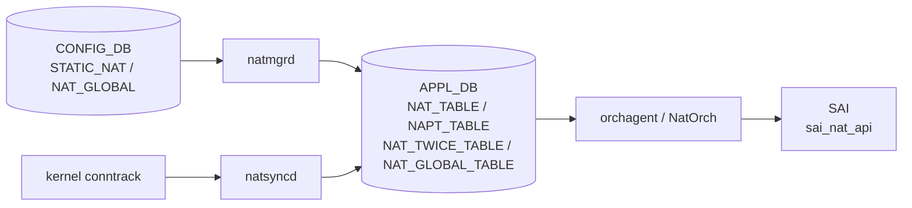

# APPL_DB NAT テーブル群

## 概要

`NAT_TABLE`、`NAPT_TABLE`、`NAT_TWICE_TABLE`、`NAPT_TWICE_TABLE`、`NAT_GLOBAL_TABLE`、`NAT_DNAT_POOL_TABLE` は [APPL_DB](../../reference/glossary.md#term-appl_db) 上の NAT 関連テーブル群[^1]。`natmgrd` が [CONFIG_DB](../../reference/glossary.md#term-config_db) の static NAT/NAPT 設定を変換してこれらへ書き込み、`natsyncd` が kernel conntrack から dynamic エントリを書き込む。`orchagent / NatOrch` が消費して [SAI](../../reference/glossary.md#term-sai) `sai_nat_api` 経由でハードウェアへ降ろす[^2]。

<!-- cdb-mermaid -->
### データフロー (自動生成)



!!! note "凡例"
    CONFIG_DB から SAI までの典型経路。詳細は本ページ本文を参照。
<!-- /cdb-mermaid -->

## key 構造

```text
NAT_TABLE|<global_ip>
NAPT_TABLE|<proto>|<global_ip>|<global_port>
NAT_TWICE_TABLE|<src_ip>|<dst_ip>
NAPT_TWICE_TABLE|<proto>|<src_ip>|<src_port>|<dst_ip>|<dst_port>
NAT_GLOBAL_TABLE|Values
NAT_DNAT_POOL_TABLE|<dnat_ip>
```

key セグメント数が規定値以外の場合は `NatOrch` が `SWSS_LOG_ERROR + erase` して処理をスキップする。

## 主要フィールド

### NAT_TABLE

| フィールド | 型 | 必須 | 説明 |
|-----------|----|------|------|
| `translated_ip` | IPv4 address | yes | 変換後 IP アドレス |
| `nat_type` | enum `snat` / `dnat` | yes | NAT 種別 |
| `entry_type` | enum `static` / `dynamic` | yes | static (natmgrd 由来) / dynamic (natsyncd 由来) |

key は `<global_ip>` の単一セグメント。`entry_type` / `nat_type` は省略不可 — 欠落時 `assert` abort (`natorch.cpp:2659`)。

### NAPT_TABLE

| フィールド | 型 | 必須 | 説明 |
|-----------|----|------|------|
| `translated_ip` | IPv4 address | yes | 変換後 IP |
| `translated_l4_port` | uint16 | yes | 変換後 L4 ポート |
| `nat_type` | enum `snat` / `dnat` | yes | NAT 種別 |
| `entry_type` | enum `static` / `dynamic` | yes | エントリ種別 |

key は `<proto>:<global_ip>:<global_port>` の 3 セグメント。proto は `TCP` または `UDP`。

### NAT_TWICE_TABLE

| フィールド | 型 | 必須 | 説明 |
|-----------|----|------|------|
| `translated_src_ip` | IPv4 address | yes | 変換後 src IP |
| `translated_dst_ip` | IPv4 address | yes | 変換後 dst IP |
| `entry_type` | enum `static` / `dynamic` | yes | エントリ種別 |

key は `<src_ip>:<dst_ip>` の 2 セグメント。Twice NAT (SNAT+DNAT 同時) に使用。

### NAPT_TWICE_TABLE

| フィールド | 型 | 必須 | 説明 |
|-----------|----|------|------|
| `translated_src_ip` | IPv4 address | yes | 変換後 src IP |
| `translated_src_l4_port` | uint16 | yes | 変換後 src ポート |
| `translated_dst_ip` | IPv4 address | yes | 変換後 dst IP |
| `translated_dst_l4_port` | uint16 | yes | 変換後 dst ポート |
| `entry_type` | enum `static` / `dynamic` | yes | エントリ種別 |

key は `<proto>:<src_ip>:<src_port>:<dst_ip>:<dst_port>` の 5 セグメント。

### NAT_GLOBAL_TABLE

| フィールド | 型 | デフォルト | 説明 |
|-----------|----|-----------|------|
| `admin_mode` | enum `enabled` / `disabled` | `"disabled"` | NAT 機能の有効 / 無効 |
| `nat_timeout` | int (秒) | `600` | 非 TCP/UDP NAT セッション timeout |
| `nat_tcp_timeout` | int (秒) | `86400` | TCP NAT セッション timeout |
| `nat_udp_timeout` | int (秒) | `300` | UDP NAT セッション timeout |

key は固定文字列 `"Values"`。他のキーは `NatOrch` が ERROR + erase (`natorch.cpp:2924-2928`)。`admin_mode` が `"enabled"` / `"disabled"` 以外は `assert` abort (`natorch.cpp:2938`)。

### NAT_DNAT_POOL_TABLE

フィールドなし (`NULL: NULL`)。key の IP アドレスが DNAT pool に登録されたことを示すフラグテーブル。1 セグメント以外のキーは ERROR + erase (`natorch.cpp:2983-2987`)。

<!-- ordering -->
## 書込み順依存 (Phase B)

`NatOrch` は `NAT_GLOBAL_TABLE.admin_mode` が `"enabled"` になるまで NAT/NAPT エントリを SAI に降ろさず内部キャッシュに保持する。APPL_DB への書き込み順序によって SAI 操作のタイミングが変わる。

### 検出された順序依存

| # | 依存関係 | 方向 | 緩和策 |
|---|----------|------|--------|
| 1 | `NAT_GLOBAL_TABLE.admin_mode = "enabled"` → NAT_TABLE / NAPT_TABLE エントリ SAI 反映 | **強制先行**（enable 前エントリはキャッシュ保持のみ） | `enableNatFeature()` 内 `addAllNatEntries()` が既存キャッシュを一括 SAI 投入 |
| 2 | `NAT_DNAT_POOL_TABLE` → DNAT SAI エントリ登録 | enable 後に先行推奨 | `enableNatFeature()` 内 `addAllDnatPoolEntries()` が既存 pool を一括投入 |
| 3 | `NAT_DNAT_POOL_TABLE` 書込み → `NAT_TABLE (nat_type=dnat)` / `NAPT_TABLE (nat_type=dnat)` 書込み | 順序任意（NatOrch が独立管理） | pool と NAT エントリは別テーブル・別 `doTask` で処理され依存なし |
| 4 | `natmgrd` CONFIG_DB → APPL_DB 変換 → `NatOrch` 消費 | 非同期パイプライン | `natmgrd` は `isNatEnabled() == false` 時タイムアウト変更を APPL_DB に書かない |
| 5 | `NAT_GLOBAL_TABLE.admin_mode = "disabled"` → 全 NAT エントリ SAI 削除 | 即時（`disableNatFeature()` で全削除） | re-enable 時は `enableNatFeature()` でキャッシュから再投入 |
| 6 | 動的エントリ (natsyncd) 書込み → `NAT_GLOBAL_TABLE.admin_mode = "enabled"` 後 | 任意（キャッシュに積まれ enable 時一括投入） | disabled 状態で書かれたエントリは `m_natEntries` に保持、enable で SAI へ |
| 7 | NH 解決 (NeighOrch / RouteOrch) → DNAT エントリ SAI 反映 | 非同期（NH 解決待ち） | `gNhTrackingSupported == true` 時は `addDnatToNhCache()` 経由で NH 解決後に SAI 投入 |

### 主要な制約詳細

**NAT_GLOBAL_TABLE 先行必須 (依存 #1)**: `addNatEntry()` は `isNatEnabled() == false` の場合 WARN ログを出して `return true` する（エントリは `m_natEntries` に保持）。SAI API は呼ばれない。`doNatGlobalTableTask()` が `admin_mode = "enabled"` を受信すると `enableNatFeature()` が呼ばれ、内部で `addAllNatEntries()` が既存キャッシュ全エントリを順次 SAI に投入する。このため NAT_TABLE エントリを先に書いても、`NAT_GLOBAL_TABLE.admin_mode = "enabled"` が書かれるまで SAI エントリは存在しない（evidence: `natorch.cpp:1907-1913`, `natorch.cpp:2534-2582`, `natorch.cpp:3178-3260`）。

**DNAT Pool と DNAT エントリの独立性 (依存 #3)**: `doDnatPoolTableTask()` と `doNatTableTask()` は独立した consumer handler として動作し、相互にブロックしない。NAT_TABLE の DNAT エントリは Pool エントリの存在に依存せず SAI `sai_nat_api` に投入される。Pool は `addHwDnatPoolEntry()` で別途 SAI に登録される。どちらを先に書いても NatOrch は両者を独立して処理する（evidence: `natorch.cpp:2968-3040`, `natorch.cpp:1866-1937`）。

**NH 解決依存の DNAT (依存 #7)**: `gNhTrackingSupported == true` のプラットフォームでは、DNAT エントリを処理する際に `addDnatToNhCache()` が `m_neighOrch->getNeighborEntry()` で隣接解決を試みる。未解決の場合は `m_routeOrch->attach(this, translatedIp)` で RouteOrch に observer 登録し、NextHop 解決通知を受けて `addHwDnatEntry()` を遅延実行する。この間 DNAT エントリは内部キャッシュに留まり SAI に降りない（evidence: `natorch.cpp:391-430`, `natorch.cpp:407-414`）。

<!-- /ordering -->

<!-- cross-refs -->
## 暗黙参照テーブル (Phase C)

`NatOrch` が APPL_DB NAT テーブル群を消費する際、YANG leafref 定義を超えて実装上で参照するテーブル・リソース・Orch を示す。

| 参照先テーブル / リソース | 参照方向 | 条件 | 参照元 evidence |
|--------------------------|---------|------|----------------|
| `NAT_GLOBAL_TABLE\|Values.admin_mode` (APPL_DB) | 読み取り (SAI ガード) | 常時。`isNatEnabled() == false` の間は全テーブルエントリが SAI に降りずキャッシュ保持のみ | `natorch.cpp` L1907–1913, L2009–2015, L2137–2143, L2294–2300, L2345–2355 |
| `NeighOrch` 内部隣接キャッシュ | 問い合わせ (NH 解決) | `gNhTrackingSupported == true` かつ `nat_type=dnat` エントリ処理時。`m_neighOrch->getNeighborEntry(translatedIp, ...)` で隣接を確認 | `natorch.cpp` L390–430, L407–414 |
| `RouteOrch` next-hop Observer | Observer 登録 → 非同期通知 | `gNhTrackingSupported == true` かつ 隣接未解決時。`m_routeOrch->attach(this, translatedIp)` で NH 解決を待機し `update()` コールバックで SAI 投入 | `natorch.cpp` L414, L200–260, L308–388 |
| `SAI_SWITCH_ATTR_AVAILABLE_SNAT_ENTRY` (SAI capability) | 起動時 1 回クエリ | 常時。`maxAllowedSNatEntries` を決定し、dynamic SNAT エントリ追加時の上限チェックに使用。SAI クエリ失敗時は 0 (無制限扱い) | `natorch.cpp` L109–125, L1882–1893, L1996–2000 |
| `COUNTERS_DB:COUNTERS_GLOBAL_NAT_TABLE:Values` | 書き出し (カウンタ更新) | SNAT/DNAT エントリ追加/削除ごとに `updateSnatCounters()` / `updateDnatCounters()` が `SNAT_ENTRIES` / `DNAT_ENTRIES` を更新 | `natorch.cpp` L56, L127–135, L1412–1413 |
| `platform` 環境変数 (BRCM 判定) | 読み取り (起動時 1 回) | `getenv("platform")` に `"broadcom"` が含まれる場合のみ `gNhTrackingSupported = true`。非 BRCM では NH トラッキングなし → DNAT エントリは NH 解決後即時 SAI 投入 | `natorch.cpp` L144–149 |

!!! note "YANG leafref 非対応の参照"
    上記参照はいずれも YANG `sonic-nat` の leafref として定義されていない。`NeighOrch` / `RouteOrch` / SAI capability / `platform` 環境変数への依存は `natorch.cpp` の実装コードによってのみ強制される暗黙の前提条件である。

!!! note "NH トラッキング非対応プラットフォームの動作"
    `gNhTrackingSupported == false` (非 BRCM) のプラットフォームでは、DNAT エントリは `addHwDnatEntry()` を即時呼び出す直接経路を使う。`NeighOrch` / `RouteOrch` への observer 登録は行われないため、NH が未解決でも SAI 投入を試みる。

<!-- /cross-refs -->

<!-- defaults -->
## フィールド暗黙デフォルト (Phase A — コード由来)

APPL_DB NAT テーブル群は YANG の管轄外 (YANG は CONFIG_DB 側を定義) のため、デフォルト値はコード実装のみから確認する。

### NAT_GLOBAL_TABLE — コード由来デフォルト

| フィールド | デフォルト値 | 定数 / 設定元 | ソース |
|-----------|------------|-------------|--------|
| `admin_mode` | `"disabled"` | `NatOrch::admin_mode` 初期値 | `natorch.cpp:64` |
| `nat_timeout` | `600` | `NAT_TIMEOUT_DEFAULT` | `natmgr.h:64` / `natorch.cpp:67` |
| `nat_tcp_timeout` | `86400` | `NAT_TCP_TIMEOUT_DEFAULT` | `natmgr.h:69` / `natorch.cpp:70` |
| `nat_udp_timeout` | `300` | `NAT_UDP_TIMEOUT_DEFAULT` | `natmgr.h:73` / `natorch.cpp:73` |

`NatOrch` コンストラクタでメンバ変数を上記値で初期化。`natmgr.cpp` 側でも同値の定数を使用し、`isNatEnabled() == false` 時は APPL_DB 書き込みをスキップ (`natmgr.cpp:7282-7313`)。

### NAT_TABLE / NAPT_TABLE / NAT_TWICE_TABLE / NAPT_TWICE_TABLE — assert 必須フィールド

これらのテーブルに「省略時デフォルト」は存在しない。`entry_type` が欠落すると `NatOrch` の `assert` が abort を引き起こす。

```cpp
// natorch.cpp:2659 (NAT_TABLE)
assert(type == "dynamic" || type == "static");
entry.entry_type = type;
```

`static` エントリは `natmgrd` / `natmgr.cpp` が書き込む (SOURCE: natmgr.cpp:2040-2053)。`dynamic` エントリは `natsyncd` / `natsync.cpp` が kernel conntrack から書き込む (SOURCE: natsync.cpp:380、391)。

### NAT_DNAT_POOL_TABLE — フィールドなし

フィールドデフォルト概念なし。IP の存在 (SET) / 不在 (DEL) のみ。

### entry_type による writer 分類

| `entry_type` | 書き込み元 | ファイル |
|---|---|---|
| `"static"` | `natmgrd` (NatMgr) | `sonic-swss/cfgmgr/natmgr.cpp` |
| `"dynamic"` | `natsyncd` (NatSync) | `sonic-swss/natsyncd/natsync.cpp` |

### タイムアウトの伝播条件 (NAT_GLOBAL_TABLE)

`natmgr.cpp:7282-7313`: `nat_timeout` / `nat_tcp_timeout` / `nat_udp_timeout` の変更は `isNatEnabled() == true` の場合のみ APPL_DB に書き込まれる。`admin_mode = disabled` 状態でのタイムアウト変更は APPL_DB に届かない。

`enableNatFeature()` (`natmgr.cpp:5688-5704`) は非デフォルト値のみ書き込む — デフォルト値と同値の変更は APPL_DB に送信されない。

### プラットフォーム依存 silent drop (admin_mode=enabled 無効化)

`main.cpp:936-948`: `SAI_SWITCH_ATTR_AVAILABLE_SNAT_ENTRY == 0` のプラットフォームでは `gIsNatSupported = false`。
`natorch.cpp:2541-2544`: `enableNatFeature()` 冒頭で `gIsNatSupported == false` → NOTICE ログ + return。
APPL_DB に `admin_mode=enabled` が書かれていても SAI 操作は行われない。

### static エントリの両方向同時追加

`natmgr.cpp:2052-2053`: `addStaticSingleNatEntry()` は DNAT エントリと SNAT エントリを **両方同時に** NAT_TABLE に書き込む。

```cpp
m_appNatTableProducer.set(appKeyDnat, fvVectorDnat);   // nat_type: dnat
m_appNatTableProducer.set(appKeySnat, fvVectorSnat);   // nat_type: snat
```

CONFIG_DB の `STATIC_NAT|<global_ip>` 1 件 → APPL_DB `NAT_TABLE|<global_ip>` と `NAT_TABLE|<local_ip>` の 2 件が生成される。
<!-- /defaults -->

## 制約

- `NAT_TABLE` key: 1 セグメント (`<ip>`)。他は ERROR + erase。
- `NAPT_TABLE` key: 3 セグメント (`<proto>:<ip>:<port>`)。他は ERROR + erase。
- `NAT_TWICE_TABLE` key: 2 セグメント (`<src_ip>:<dst_ip>`)。他は ERROR + erase。
- `NAPT_TWICE_TABLE` key: 5 セグメント。他は ERROR + erase。
- `NAT_GLOBAL_TABLE` key: `"Values"` 固定。他は ERROR + erase。
- `NAT_DNAT_POOL_TABLE` key: 1 セグメント (`<ip>`)。他は ERROR + erase。
- `entry_type` は `"static"` / `"dynamic"` のみ (assert abort)。
- `admin_mode` は `"enabled"` / `"disabled"` のみ (assert abort)。

## 購読者 (Consumer)

- `orchagent / NatOrch`: `doNatTableTask()` / `doNaptTableTask()` / `doTwiceNatTableTask()` / `doTwiceNaptTableTask()` / `doNatGlobalTableTask()` / `doDnatPoolTableTask()` でそれぞれ消費し、`sai_nat_api` 経由でハードウェアに NAT エントリを登録する。

## 書き込み元

- `natmgrd / NatMgr`: CONFIG_DB の `STATIC_NAT` / `STATIC_NAPT` / `NAT_GLOBAL` / `NAT_POOL` を読み、static エントリを APPL_DB に書く。
- `natsyncd / NatSync`: kernel netlink (conntrack) を購読し、dynamic NAT/NAPT セッションを APPL_DB に書く。

## 関連 CONFIG_DB / YANG / CLI

- 関連 CONFIG_DB: `STATIC_NAT`、`STATIC_NAPT`、`NAT_GLOBAL`、`NAT_POOL`、`NAT_BINDINGS`
- 関連 CLI: `config nat`、`show nat translations`
- 関連 YANG: `sonic-nat`

<!-- ref-triangle:start -->

## 関連リファレンス

- CONFIG_DB: [`NAT_GLOBAL / NAT_POOL`](nat.md)
- CONFIG_DB: [`STATIC_NAT`](nat-static.md)
- CONFIG_DB: [`NAT_BINDINGS`](nat-bindings.md)
- YANG: [`sonic-nat`](../yang/sonic-nat.md)
- CLI: [`config nat`](../cli/config-nat.md)

<!-- ref-triangle:end -->

## 引用元

[^1]: テーブル名定数: `sonic-swss-common/common/schema.h` L101-107. <https://github.com/sonic-net/sonic-swss-common/blob/master/common/schema.h>
[^2]: NatOrch 実装: `sonic-swss/orchagent/natorch.cpp`. <https://github.com/sonic-net/sonic-swss/blob/master/orchagent/natorch.cpp>

<!-- ops-hint -->
## 運用ヒント

### 典型確認コマンド

```bash
# APPL_DB の NAT エントリを確認
sonic-db-cli APPL_DB hgetall 'NAT_TABLE|65.55.45.1'
sonic-db-cli APPL_DB hgetall 'NAT_GLOBAL_TABLE|Values'
sonic-db-cli APPL_DB keys 'NAT_DNAT_POOL_TABLE|*'

# show コマンド
show nat translations
show nat config
```

### よくある落とし穴

- `NAT_GLOBAL_TABLE.admin_mode` の assert 条件: `"enabled"` / `"disabled"` 以外の値を直接 APPL_DB に書くと orchagent が abort する。CLI / natmgrd を通じた書き込みは安全。
- static エントリは DNAT + SNAT の **2 件** が同時に書かれる。`show nat translations` で "両方向" として見える。
- dynamic エントリ (`entry_type: dynamic`) は conntrack エージングで自動削除される。手動 DEL は不要。
- DNAT pool に IP が登録されないと dynamic DNAT が動作しない (`NAT_DNAT_POOL_TABLE` が先に書かれる)。
<!-- /ops-hint -->

<!-- topics-back-ref -->
## 関連 Topics

- [Topics: NAT / DHCP Relay / Time-DNS Services](../../topics/16-nat-dhcp-dns/index.md)

<!-- /topics-back-ref -->
