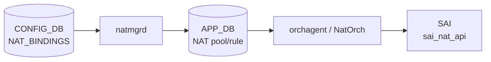

# NAT_BINDINGS テーブル

## 概要

`NAT_BINDINGS` は dynamic [NAT](../../reference/glossary.md#term-nat) のバインディングを定義する [CONFIG_DB](../../reference/glossary.md#term-config_db) テーブル。[ACL](../../reference/glossary.md#term-acl) テーブルと NAT pool を関連付け、対象トラフィックの動的 SNAT ルールを `natmgrd` 経由で kernel / ASIC に適用する[^1]。エントリ最大 16 件。

<!-- cdb-mermaid -->
### データフロー (自動生成)



!!! note "凡例"
    CONFIG_DB から SAI までの典型経路を `docs/reference/config-db-orch-map.md` から機械生成したミニ図。詳細・例外は本ページ本文と対応表を参照。
<!-- /cdb-mermaid -->

## key 構造

```text
NAT_BINDINGS|<binding_name>
```

`binding_name` は 1..32 文字、`[a-zA-Z0-9]{1}([-a-zA-Z0-9_]{0,31})` パターン。

## 主要フィールド

| フィールド | 型 | 必須 | デフォルト | 説明 |
|-----------|----|------|-----------|------|
| `nat_pool` | leafref → `NAT_POOL.name` | yes | — | バインディング対象の NAT pool 名 |
| `access_list` | 文字列 (ACL 名, カンマ区切り可) | no | `""` (空) | 対象トラフィックを絞る ACL 名。省略時は全送信元が対象 |
| `nat_type` | enum `snat` / `dnat` | no | `"snat"` | NAT 種別。現時点で `dnat` は未サポート (CLI が拒否) |
| `twice_nat_id` | uint16 1..9999 | no | `""` → Single NAT | Twice NAT 用 ID。省略時 Single NAT として動作 |

<!-- defaults -->
### コード由来の暗黙デフォルト

以下のデフォルトはコードレベルで確認済み（YANG / CLI / natmgr 三箇所一致）。

| フィールド | 暗黙デフォルト | 根拠コード |
|-----------|--------------|-----------|
| `access_list` | `""` (空文字列) | `config/nat.py:797` acl_name=None → `""` / `natmgr.cpp:6879` EMPTY_STRING 初期化 |
| `nat_type` | `"snat"` | YANG `default snat` / `nat.py:821` / `natmgr.cpp:7056-7058` empty → SNAT_NAT_TYPE |
| `twice_nat_id` | `""` → Single NAT | `nat.py:823-824` None → `"NULL"` → DB / `natmgr.cpp:6993-6996` `"NULL"` → EMPTY_STRING |

**`nat_type` が空の場合の natmgr 動作**:

```cpp
// natmgr.cpp:7056-7063
if (nat_type.empty())
{
    m_natBindingInfo[key].nat_type = SNAT_NAT_TYPE;  // "snat"
}
```

**`twice_nat_id` の `"NULL"` 変換**:

```cpp
// natmgr.cpp:6993-6996
if (twice_nat_id == "NULL")
{
    twiceNatFound = false;
    twice_nat_id = EMPTY_STRING;  // "" → Single NAT モード
}
```

**Single NAT / Twice NAT 分岐**:

```cpp
// natmgr.cpp:4663-4679
if (m_natBindingInfo[key].twice_nat_id.empty())
{
    // Single NAT: ACL あり/なしで iptables ルール設定
    setDynamicAllForwardOrAclbasedRules(ADD, pool_interface, ip_range, port_range, acls_name, key);
}
else
{
    // Twice NAT: addDynamicTwiceNatRule() へ
    addDynamicTwiceNatRule(key);
}
```
<!-- /defaults -->

## 制約

- エントリ数上限: **16 件** (YANG `max-elements 16` / CLI `nat.py:812` でも同チェック)
- バインディング名: 最大 32 文字
- `nat_pool`: 存在する `NAT_POOL` エントリへの leafref (必須)
- `nat_type=dnat`: CLI (`config nat add binding`) が `"Ignored, DNAT is not yet supported for Binding"` を表示して拒否
- `twice_nat_id` 有効範囲: 1..9999 (範囲外は YANG / natmgr が拒否)
- 同一 `twice_nat_id` を持てるエントリ: 最大 2 件 (`STATIC_NAT`・`STATIC_NAPT`・`NAT_BINDINGS` 合計)

## 購読者

- `natmgrd` (`doNatBindingTask`): [CONFIG_DB](../../reference/glossary.md#term-config_db) の `NAT_BINDINGS` 変更を検知し、NAT pool・ACL の状態確認後に kernel iptables ルールおよび [APPL_DB](../../reference/glossary.md#term-appl_db) NAT エントリを設定する。
- `orchagent / NatOrch`: [APPL_DB](../../reference/glossary.md#term-appl_db) の NAT エントリを消費して [SAI](../../reference/glossary.md#term-sai) NAT object を作成する。

## 関連 CONFIG_DB / YANG / CLI

- 関連 [CONFIG_DB](../../reference/glossary.md#term-config_db): `NAT_GLOBAL`、`NAT_POOL`、`STATIC_NAT`、`STATIC_NAPT`、`ACL_TABLE`
- 関連 CLI: `config nat add binding`、`config nat remove binding`
- 関連 [YANG](../../reference/glossary.md#term-yang): `sonic-nat`

<!-- ref-triangle:start -->

## 関連リファレンス

- YANG: [`sonic-nat`](../yang/sonic-nat.md)
- CLI: [`config nat`](../cli/config-nat.md)
- CONFIG_DB: [`NAT_GLOBAL / NAT_POOL`](nat.md)

<!-- ref-triangle:end -->

## 引用元

[^1]: YANG 定義 + natmgr 実装: `sonic-nat.yang` / `sonic-swss/cfgmgr/natmgr.cpp`. <https://github.com/sonic-net/sonic-swss/blob/master/cfgmgr/natmgr.cpp>

<!-- ops-hint -->
## 運用ヒント

### 典型設定

```bash
# Pool + Binding の追加
config nat add pool POOL1 192.168.100.1-192.168.100.10 1024-65535
config nat add binding BIND1 POOL1

# ACL を指定して特定サブネットのみ NAT
config nat add binding BIND2 POOL1 ACL_SRC_SUBNET

# Twice NAT binding
config nat add binding BIND3 POOL1 -twice_nat_id 100
```

### 確認コマンド

```bash
sonic-db-cli CONFIG_DB hgetall 'NAT_BINDINGS|BIND1'
show nat config bindings
show nat translations
```

### よくある誤設定

- `nat_pool` に存在しない pool 名を指定 → natmgr がルールをスキップ (`"Pool is not yet enabled"` ログ)
- `nat_type=dnat` を指定 → CLI が拒否。Binding は SNAT 専用
- `twice_nat_id` 重複 → 同 ID を持つエントリが 3 件以上になると `"Same Twice nat id is not allowed for more than 2 entries!!"` エラー
<!-- /ops-hint -->

<!-- cdb-exceptions -->
## 例外条件・特殊挙動

<!-- evidence: sonic-swss/cfgmgr/natmgr.cpp doNatBindingTask -->

- **バインディング名が 32 文字超 → スキップ**: `"Invalid binding name length - %zu, skipping %s"` をログしてエントリを消費 (`natmgr.cpp:6899-6904`)。
- **`nat_type=dnat` → SWSS_LOG_ERROR + スキップ**: `"Invalid nat_type %s, skipping %s"` をログ (`natmgr.cpp:6986-6991`)。YANG でも snat がデフォルトで dnat は運用非推奨。
- **`twice_nat_id="NULL"` → 空文字列扱い**: CLI が省略時に `"NULL"` を書き込むが、natmgr が `EMPTY_STRING` に変換して Single NAT モードで処理 (`natmgr.cpp:6993-6996`)。
- **Pool が未登録の状態で Binding 追加 → ルール延期**: natmgr はキャッシュに Binding 情報を格納するが `"Pool is not yet enabled, skipping dynamic nat rules addition"` としてルール設定をスキップ。Pool が後から登録されると再トリガーされる。
- **NAT feature が disabled → ルール延期**: `isNatEnabled()=false` の場合、`addDynamicNatRule` 内でスキップし `"NAT is not yet enabled"` をログ (`natmgr.cpp:4632-4636`)。
- **重複エントリ (同 pool_name + acl_name) → スキップ**: `"Duplicate Binding and it's values, skipping"` をログ (`natmgr.cpp:7037`)。
- **エントリ上限 16 件 → CLI が拒否**: `"Failed to add binding, as already reached maximum binding limit 16."` (`nat.py:812-813`)。YANG も `max-elements 16` で同様に制限。
<!-- /cdb-exceptions -->

<!-- value-behavior -->
## 値依存挙動マトリクス

<!-- evidence: sonic-swss/cfgmgr/natmgr.cpp addDynamicNatRule / doNatBindingTask -->

| フィールド | 値 | 挙動 |
|-----------|-----|------|
| `access_list` | `""` (省略時デフォルト) | 全送信元トラフィックを NAT 対象にする (ACL なし full-cone NAT) |
| `access_list` | ACL 名 (カンマ区切り) | 指定 ACL に一致するトラフィックのみ NAT |
| `nat_type` | `"snat"` (デフォルト) | 送信元 IP を pool IP に変換 (内 → 外方向) |
| `nat_type` | `"dnat"` | CLI が拒否。natmgr も `SNAT_NAT_TYPE` のみ受け付ける |
| `twice_nat_id` | 省略 / `"NULL"` / `""` | Single NAT モード (`setDynamicAllForwardOrAclbasedRules`) |
| `twice_nat_id` | 1..9999 | Twice NAT モード (`addDynamicTwiceNatRule`) |

enum: `nat_type`=snat/dnat (有効値は snat のみ)。
<!-- /value-behavior -->

<!-- runtime-trace -->
## CDB → 実コンテナ動作トレース

### 段階 1: Consumer 登録

- **natmgrd** (`sonic-swss/cfgmgr/natmgrd.cpp:113`): `CFG_NAT_BINDINGS_TABLE_NAME` を `SubscriberStateTable` で購読。

### 段階 2: CFG → キャッシュ + iptables

- `doNatBindingTask` がフィールドを解析し `m_natBindingInfo[key]` に格納。
- `nat_type` 省略時は `SNAT_NAT_TYPE ("snat")` をキャッシュに設定。
- `twice_nat_id="NULL"` は `EMPTY_STRING` に変換してから格納。
- `addDynamicNatRule` が NAT 有効状態・pool 存在・L3 インタフェース存在を確認してから iptables ルールを設定。

### 段階 3: APPL → SAI

- `natmgrd` が APP_DB の `NAT_DNAT_POOL_TABLE` / iptables 経由で動的 NAT エントリを管理。
- `orchagent / NatOrch` が APP_DB エントリを消費して SAI NAT object を作成。

<!-- /runtime-trace -->

<!-- ordering -->
## 書込み順依存 (Phase B)

<!-- evidence: sonic-swss/orchagent/natorch.cpp NatOrch::addNatEntry L1866-1935 / enableNatFeature L2534-2581 / doDnatPoolTableTask L2968-3031 / sonic-swss/cfgmgr/natmgr.cpp addDynamicNatRule / doNatBindingTask L6868-7100 -->

### NAT_POOL が先行必須

`natmgr.cpp:addDynamicNatRule()` は `NAT_BINDINGS` エントリ処理時に pool キャッシュ (`m_natPoolInfo[pool_name]`) を参照する。pool が未登録の場合は `"Pool is not yet enabled, skipping dynamic nat rules addition"` をログしてルール設定をスキップする。pool が後から登録された際に binding が自動再トリガーされるため**エントリは失われない**が、iptables/ASIC ルールは pool 登録完了まで反映されない。

```
# 推奨順序
SET NAT_POOL|<name>      nat_ip=...  nat_port=...   # pool を先に定義
SET NAT_BINDINGS|<name>  nat_pool=<name>             # pool 登録後に binding を追加
```

### NAT_GLOBAL (admin_mode=enabled) が有効化条件

`natmgr.cpp:addDynamicNatRule()` は `isNatEnabled()` が false の場合 `"NAT is not yet enabled"` をログしてスキップする (`natmgr.cpp:4632-4636`)。`admin_mode=enabled` が CONFIG_DB に書き込まれ natmgrd が APPL_DB に伝播するまで、binding に対応する iptables/ASIC ルールは設定されない。

### 安全な DEL 順序

```
DEL NAT_BINDINGS|<name>    # binding を先に削除
DEL NAT_POOL|<name>        # pool を後に削除 (binding が残ったまま pool を削除すると孤立エントリになる)
```

<!-- /ordering -->

<!-- failure -->
## 失敗挙動 (Phase D)

<!-- evidence: sonic-swss/orchagent/natorch.cpp NatOrch::addNatEntry L1866-1935 / addTwiceNatEntry L1981-2004 / addHwSnatEntry L1307-1316 / addHwTwiceNatEntry L1387-1397 / addHwDnatPoolEntry L1806-1814 / NatOrch constructor L107-122 -->

### SNAT ハードウェア容量上限到達 (dynamic SNAT/Twice NAT) → 即時エージアウト通知

`natorch.cpp:1882-1889` (`addNatEntry`) および `natorch.cpp:1996-2003` (`addTwiceNatEntry`):

```cpp
// addNatEntry - dynamic SNAT
if (totalSnatEntries == maxAllowedSNatEntries)
{
    SWSS_LOG_INFO("Reached the max allowed NAT entries in the hardware, dropping new SNAT translation with ip %s and translated ip %s", ...);
    setTimeoutNotifier->send("AGEOUT-SINGLE-NAT", natKey, fvVector);
    return true;
}

// addTwiceNatEntry - dynamic Twice NAT
if (totalSnatEntries == maxAllowedSNatEntries)
{
    SWSS_LOG_INFO("Reached the max allowed NAT entries in the hardware, dropping new Twice NAT translation with src ip %s, dst ip %s ...", ...);
    setTimeoutNotifier->send("AGEOUT-TWICE-NAT", twiceNatKey, fvVector);
    return true;
}
```

- ログ: `SWSS_LOG_INFO "Reached the max allowed NAT entries in the hardware, dropping new SNAT/Twice NAT translation..."`
- 効果: エントリをキャッシュに追加せず `AGEOUT-SINGLE-NAT` / `AGEOUT-TWICE-NAT` 通知を送信して即時エージアウト。SAI 登録なし。`return true` でタスクは消費 (retry なし)。
- **容量 0 の罠**: 起動時に `SAI_SWITCH_ATTR_AVAILABLE_SNAT_ENTRY` の取得が失敗した場合 `maxAllowedSNatEntries=0` のまま (`natorch.cpp:112-118`)。この状態では最初の dynamic SNAT エントリ到着と同時にドロップが発生する。取得失敗のログ: `SWSS_LOG_NOTICE "Failed to get the SNAT available entry count, rv:%d"`。

### SAI NAT エントリ作成失敗 → ERROR + handleSaiCreateStatus

`natorch.cpp:1307-1316` (SNAT), `natorch.cpp:1387-1397` (Twice NAT), `natorch.cpp:1475-1485` (SNAT NAPT), `natorch.cpp:1806-1814` (DNAT Pool):

```cpp
// SNAT 例 (addHwSnatEntry)
status = sai_nat_api->create_nat_entry(&snat_entry, attr_count, nat_entry_attr);
if (status != SAI_STATUS_SUCCESS)
{
    SWSS_LOG_ERROR("Failed to create %s SNAT NAT entry with ip %s and it's translated ip %s",
                   entry.entry_type.c_str(), ip_address.to_string().c_str(), entry.translated_ip.to_string().c_str());
    task_process_status handle_status = handleSaiCreateStatus(SAI_API_NAT, status);
    if (handle_status != task_success)
    {
        return parseHandleSaiStatusFailure(handle_status);
    }
}

// DNAT Pool 例 (addHwDnatPoolEntry)
if (status != SAI_STATUS_SUCCESS)
{
    SWSS_LOG_ERROR("Failed to create DNAT Pool entry with ip %s", ip_address.to_string().c_str());
    task_process_status handle_status = handleSaiCreateStatus(SAI_API_NAT, status);
    if (handle_status != task_success)
    {
        return parseHandleSaiStatusFailure(handle_status);
    }
}
```

- ログ: `SWSS_LOG_ERROR "Failed to create %s SNAT NAT entry..."` / `"Failed to create %s Twice NAT entry..."` / `"Failed to create %s SNAT NAPT entry..."` / `"Failed to create DNAT Pool entry with ip %s"`
- 効果: `parseHandleSaiStatusFailure()` が abort / retry / erase を決定する。DNAT Pool 登録失敗時は対象 IP への DNAT トラフィックがハードウェアでドロップされる。STATE_DB への書き込みなし。
- NAT feature 未有効化時は SAI 呼び出し前に `SWSS_LOG_WARN "NAT Feature is not yet enabled, skipped adding DNAT Pool entry with ip %s"` でスキップされる (`natorch.cpp:1789-1793`)。

### 失敗挙動サマリ

| # | 条件 | コンポーネント | パターン | retry | STATE_DB 記録 |
|---|---|---|---|---|---|
| 1 | SNAT ハードウェア容量上限 (dynamic SNAT) | NatOrch | AGEOUT-SINGLE-NAT 通知 + ドロップ | なし | なし |
| 2 | Twice NAT ハードウェア容量上限 (dynamic) | NatOrch | AGEOUT-TWICE-NAT 通知 + ドロップ | なし | なし |
| 3 | SAI SNAT create 失敗 | NatOrch | handleSaiCreateStatus | SAI 依存 | なし |
| 4 | SAI Twice NAT create 失敗 | NatOrch | handleSaiCreateStatus | SAI 依存 | なし |
| 5 | SAI SNAT NAPT create 失敗 | NatOrch | handleSaiCreateStatus | SAI 依存 | なし |
| 6 | SAI DNAT Pool create 失敗 | NatOrch | handleSaiCreateStatus | SAI 依存 | なし |
| 7 | SNAT 容量取得失敗 (orchagent 起動時) | NatOrch | maxAllowedSNatEntries=0 → 全 dynamic SNAT ドロップ | — | なし |

NatOrch は `ERROR_TABLE` への書き込みなし。syslog (`SWSS_LOG_ERROR` / `WARN` / `NOTICE` / `INFO`) のみ。
<!-- /failure -->
