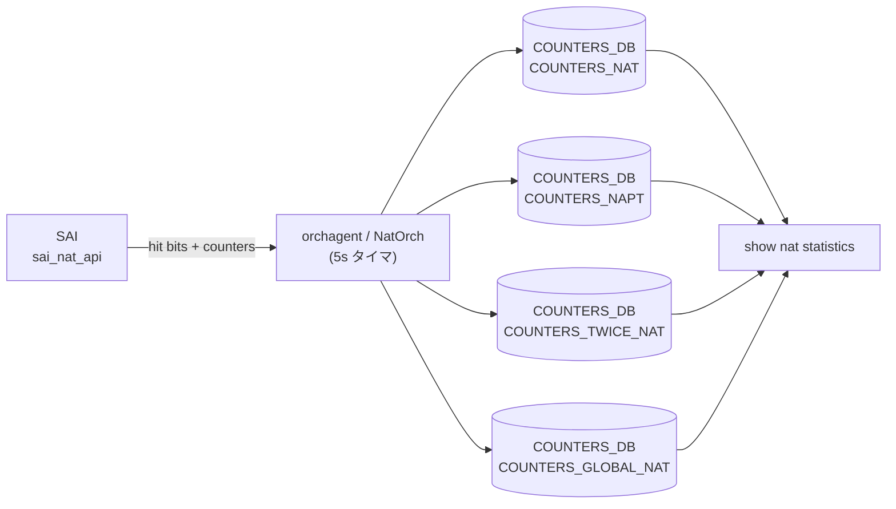

# COUNTERS_DB NAT カウンタテーブル群

## 概要

[NAT](../../reference/glossary.md#term-nat) 機能の実行時カウンタは `COUNTERS_DB` 上の 5 つのテーブルに書き込まれる。`orchagent/NatOrch` が SAI NAT API から 5 秒周期でパケット数・バイト数を取得し更新する。`show nat statistics` はこれらのテーブルを読み取る。

| テーブル | キー形式 | 用途 |
|---------|---------|------|
| `COUNTERS_NAT` | `<external_ip>` | 単体 NAT (SNAT/DNAT) エントリのカウンタ |
| `COUNTERS_NAPT` | `<proto>:<ip>:<port>` | 単体 NAPT エントリのカウンタ |
| `COUNTERS_TWICE_NAT` | `<src_ip>:<dst_ip>` | Twice NAT エントリのカウンタ |
| `COUNTERS_TWICE_NAPT` | `<proto>:<src_ip>:<src_port>:<dst_ip>:<dst_port>` | Twice NAPT エントリのカウンタ |
| `COUNTERS_GLOBAL_NAT` | `Values` (固定) | グローバル統計・設定サマリ |

<!-- cdb-mermaid -->
### データフロー (自動生成)



!!! note "凡例"
    COUNTERS_TWICE_NAPT は COUNTERS_TWICE_NAT と同構造。図では省略。
<!-- /cdb-mermaid -->

## key 構造

```text
COUNTERS_DB:COUNTERS_NAT|<external_ip>
COUNTERS_DB:COUNTERS_NAPT|<proto>:<ip>:<port>
COUNTERS_DB:COUNTERS_TWICE_NAT|<src_ip>:<dst_ip>
COUNTERS_DB:COUNTERS_TWICE_NAPT|<proto>:<src_ip>:<src_port>:<dst_ip>:<dst_port>
COUNTERS_DB:COUNTERS_GLOBAL_NAT|Values
```

## 主要フィールド

### COUNTERS_NAT / COUNTERS_NAPT / COUNTERS_TWICE_NAT / COUNTERS_TWICE_NAPT

全エントリカウンタテーブルは同一フィールド構成を持つ。

| フィールド | 型 | 初期値 | 説明 |
|-----------|-----|--------|------|
| `NAT_TRANSLATIONS_PKTS` | uint64 (文字列) | `"0"` | SAI から取得したパケット数。エントリ登録直後に `0` で初期化される |
| `NAT_TRANSLATIONS_BYTES` | uint64 (文字列) | `"0"` | SAI から取得したバイト数。エントリ登録直後に `0` で初期化される |

- **書き込み元**: `NatOrch::updateNatCounters()` / `updateNaptCounters()` / `updateTwiceNatCounters()` / `updateTwiceNaptCounters()` (`natorch.cpp:4049-4135`)
- **削除**: エントリ削除時に `deleteNatCounters()` 等で対応エントリを削除
- **更新周期**: `NAT_HITBIT_N_CNTRS_QUERY_PERIOD = 5` 秒[^1]

### COUNTERS_GLOBAL_NAT|Values

キー: `"Values"` (固定)

#### 起動時のみ書き込まれるフィールド

NatOrch コンストラクタ初回実行時に一度だけ書き込まれる。その後の CONFIG_DB 変更では更新されない。

| フィールド | 型 | 初期値 | 説明 |
|-----------|-----|--------|------|
| `MAX_NAT_ENTRIES` | uint32 (文字列) | `SAI_SWITCH_ATTR_AVAILABLE_SNAT_ENTRY` 取得値 (失敗時 `"0"`) | プラットフォームが許容する最大 SNAT エントリ数 |
| `TIMEOUT` | uint32 (文字列) | `"600"` | 非 TCP/UDP NAT エントリのアイドルタイムアウト秒 |
| `UDP_TIMEOUT` | uint32 (文字列) | `"300"` | UDP NAT エントリのアイドルタイムアウト秒 |
| `TCP_TIMEOUT` | uint32 (文字列) | `"86400"` | TCP NAT エントリのアイドルタイムアウト秒 (1 日) |

#### エントリ数フィールド (実行時更新)

| フィールド | 型 | 初期値 | 更新タイミング |
|-----------|-----|--------|---------------|
| `STATIC_NAT_ENTRIES` | int (文字列) | `"0"` | static NAT エントリ追加/削除時 |
| `STATIC_NAPT_ENTRIES` | int (文字列) | `"0"` | static NAPT エントリ追加/削除時 |
| `STATIC_TWICE_NAT_ENTRIES` | int (文字列) | `"0"` | static Twice NAT エントリ追加/削除時 |
| `STATIC_TWICE_NAPT_ENTRIES` | int (文字列) | `"0"` | static Twice NAPT エントリ追加/削除時 |
| `DYNAMIC_NAT_ENTRIES` | int (文字列) | `"0"` | dynamic NAT エントリ追加/削除時 |
| `DYNAMIC_NAPT_ENTRIES` | int (文字列) | `"0"` | dynamic NAPT エントリ追加/削除時 |
| `DYNAMIC_TWICE_NAT_ENTRIES` | int (文字列) | `"0"` | dynamic Twice NAT エントリ追加/削除時 |
| `DYNAMIC_TWICE_NAPT_ENTRIES` | int (文字列) | `"0"` | dynamic Twice NAPT エントリ追加/削除時 |
| `SNAT_ENTRIES` | int (文字列) | `"0"` | SNAT エントリ (static/dynamic 合算) 追加/削除時 |
| `DNAT_ENTRIES` | int (文字列) | `"0"` | DNAT エントリ (static/dynamic 合算) 追加/削除時 |

## 制約

- COUNTERS カウンタは `NAT_HITBIT_N_CNTRS_QUERY_PERIOD = 5` 秒周期で更新される。リアルタイム値ではない。
- `MAX_NAT_ENTRIES = 0` の場合、`gIsNatSupported = false` となり NAT 機能全体が無効化される。
- `COUNTERS_GLOBAL_NAT|Values` の `TIMEOUT` / `TCP_TIMEOUT` / `UDP_TIMEOUT` は起動時の初期値のみ書き込まれ、CONFIG_DB 変更では更新されない。

## 購読者

- `orchagent/NatOrch`: SAI NAT カウンタを 5 秒周期でポーリングし各 `COUNTERS_NAT*` テーブルを更新する[^1]。
- `show nat statistics`: `COUNTERS_NAT`・`COUNTERS_NAPT`・`COUNTERS_GLOBAL_NAT` を読み取り統計を表示する。

## 関連 CONFIG_DB / YANG / CLI

- 関連 [CONFIG_DB](../../reference/glossary.md#term-config_db): `NAT_GLOBAL`、`NAT_POOL`、`NAT_BINDINGS`
- 関連 CLI: `show nat statistics`、`show nat translations`
- 関連 [YANG](../../reference/glossary.md#term-yang): `sonic-nat`

<!-- ref-triangle:start -->

## 関連リファレンス

- CONFIG_DB: [`NAT_GLOBAL / NAT_POOL`](nat.md)
- CONFIG_DB: [`NAT_BINDINGS`](nat-bindings.md)
- CONFIG_DB: [`NAT_RESTORE_TABLE / STATE_DB`](nat-state.md)
- CLI: [`config nat`](../cli/config-nat.md)

<!-- ref-triangle:end -->

## 引用元

[^1]: NAT カウンタ実装: `natorch.cpp`. <https://github.com/sonic-net/sonic-swss/blob/4305596156d70e9797e8a881b3d19b46de0bce0d/orchagent/natorch.cpp>

<!-- topics-back-ref -->
## 関連 Topics

- [Topics: NAT / DHCP Relay / Time-DNS Services](../../topics/16-nat-dhcp-dns/index.md)

<!-- /topics-back-ref -->

<!-- ops-hint -->
## 運用ヒント

### 確認コマンド

```bash
# NAT カウンタ統計 (CLIで確認)
show nat statistics

# COUNTERS_DB を直接参照
sonic-db-cli COUNTERS_DB hgetall 'COUNTERS_GLOBAL_NAT|Values'
sonic-db-cli COUNTERS_DB hgetall 'COUNTERS_NAT|<external_ip>'
sonic-db-cli COUNTERS_DB hgetall 'COUNTERS_NAPT|TCP:10.0.0.1:1024'

# すべての NAT カウンタキーを一覧表示
sonic-db-cli COUNTERS_DB keys 'COUNTERS_NAT*'
```

### MAX_NAT_ENTRIES=0 の対処

`COUNTERS_GLOBAL_NAT|Values` の `MAX_NAT_ENTRIES` が `"0"` の場合、プラットフォームが NAT をハードウェア的にサポートしていない。`gIsNatSupported=false` が設定され、CONFIG_DB に `admin_mode=enabled` を設定しても NAT 機能は動作しない。

### カウンタリセット

`sonic-clear nat statistics` でカウンタをリセットできる。内部では `FLUSHNATSTATISTICS` 通知を APPL_DB に送信し、`NatOrch` が SAI API でカウンタをクリアする。
<!-- /ops-hint -->

<!-- cdb-exceptions -->
## 例外条件・特殊挙動

<!-- evidence: sonic-swss/orchagent/natorch.cpp NatOrch::NatOrch() / updateNatCounters / checkIfNatEntryIsActive -->

- **`MAX_NAT_ENTRIES=0` → NAT 無効化**: NatOrch コンストラクタで `SAI_SWITCH_ATTR_AVAILABLE_SNAT_ENTRY` 取得が失敗または 0 → `maxAllowedSNatEntries=0` のまま書き込み → `gIsNatSupported=false` → `enableNatFeature()` 冒頭で即 return (`natorch.cpp:2541-2544`)。
- **TIMEOUT 系フィールドの静止**: `COUNTERS_GLOBAL_NAT|Values` の `TIMEOUT` / `TCP_TIMEOUT` / `UDP_TIMEOUT` は NatOrch 起動時の一度のみ書き込まれる。その後 `config nat set timeout <N>` 等で CONFIG_DB を変更しても COUNTERS_DB には反映されない。実際の運用タイムアウトは `show nat config globalvalues` で確認すること。
- **Static エントリのカウンタ更新**: `entry_type="static"` のエントリもカウンタ取得対象。`checkIfNatEntryIsActive()` が static エントリを常に `active=1` として扱うためエージアウトされず、カウンタは継続して更新される (`natorch.cpp:4160-4163`)。
- **カウンタ更新の非同期性**: `NAT_TRANSLATIONS_PKTS` / `NAT_TRANSLATIONS_BYTES` は最大 5 秒遅延する。フロー完了直後に参照してもゼロのままの場合がある。

<!-- /cdb-exceptions -->

<!-- value-behavior -->
## 値依存挙動マトリクス

<!-- evidence: sonic-swss/orchagent/natorch.cpp NatOrch コンストラクタ / enableNatFeature -->

| フィールド | 値 | 挙動 |
|-----------|-----|------|
| `COUNTERS_GLOBAL_NAT\|Values.MAX_NAT_ENTRIES` | `"0"` | `gIsNatSupported=false` → NAT 機能全体が無効化される |
| `COUNTERS_GLOBAL_NAT\|Values.MAX_NAT_ENTRIES` | `"N"` (N>0) | NAT エントリが最大 N 件まで SAI に登録可能 |
| `COUNTERS_NAT\|<ip>.NAT_TRANSLATIONS_PKTS` | `"0"` | エントリ登録直後または統計クリア直後の状態 |
| `COUNTERS_NAT\|<ip>.NAT_TRANSLATIONS_PKTS` | `"N"` (N>0) | フォワードされたパケット数 (最大 5 秒遅延) |
| `COUNTERS_GLOBAL_NAT\|Values.SNAT_ENTRIES` | `"N"` | 現在 SAI に登録済みの SNAT エントリ数 |
| `COUNTERS_GLOBAL_NAT\|Values.DNAT_ENTRIES` | `"N"` | 現在 SAI に登録済みの DNAT エントリ数 |

<!-- /value-behavior -->

<!-- ordering -->
## 書込み順依存 (Phase B)

`NatOrch` は SAI エントリ登録成功後にカウンタを 0 で初期化し、その後 5 秒周期のタイマで SAI から実値を取得して COUNTERS_DB を更新する。この 2 段階構造により、エントリ追加直後とカウンタ更新開始後で COUNTERS_DB の内容が変化する。

### 検出された順序依存

| # | 依存関係 | 方向 | 緩和策 |
|---|----------|------|--------|
| 1 | SAI NAT エントリ登録成功 → `COUNTERS_NAT*\|<key>` 初期値 (`0`) 書込み | **強制先行**（SAI 登録失敗時はカウンタエントリ不在） | `addHwSnatEntry()` / `addHwDnatEntry()` 末尾で `updateNatCounters(…,0,0)` を呼ぶ |
| 2 | `NAT_GLOBAL_TABLE.admin_mode = "enabled"` → SAI NAT エントリ登録 → カウンタ初期化 | **強制先行**（enable 前は SAI 操作なし、カウンタ不在） | `isNatEnabled() == false` 時は `addNatEntry()` がキャッシュ保持のみで SAI 呼ばず、カウンタも書かない |
| 3 | `COUNTERS_GLOBAL_NAT\|Values` 初期書込み → orchagent 起動完了 | **起動時 1 回限り**（コンストラクタ内） | 以降の CONFIG_DB 変更では `TIMEOUT` / `TCP_TIMEOUT` / `UDP_TIMEOUT` フィールドは更新されない |
| 4 | カウンタ初期値書込み (`0`) → 5 秒タイマ起動 → SAI ポーリング → 実値反映 | 非同期（最大 5 秒遅延） | エントリ追加直後に `COUNTERS_NAT*` を参照しても `"0"` のままの場合がある |
| 5 | `clearAllNatEntries()` / `disableNatFeature()` → `deleteNatCounters()` → カウンタエントリ削除 | 即時（disable と同一タスク内） | `admin_mode = "disabled"` でカウンタエントリが削除される。re-enable で再登録 |
| 6 | `FLUSHNATSTATISTICS` 通知 → SAI `reset_nat_entry_attribute` → カウンタ 0 リセット → 次回タイマで再取得 | 通知受信後即時（SAI 呼び出し） | `sonic-clear nat statistics` が内部でこの通知を送信。次の 5 秒周期まで COUNTERS_DB は `"0"` |

### 主要な制約詳細

**SAI 登録成功後のみカウンタ初期化 (依存 #1)**: `addHwSnatEntry()` (`natorch.cpp:758-803`) は `sai_nat_api->create_nat_entry()` 成功後に `updateNatCounters(ip_address, 0, 0)` を呼び、COUNTERS_NAT エントリを `"0"` で書き込む。SAI 登録失敗時は `parseHandleSaiStatusFailure()` で早期 return し、カウンタは書き込まれない。したがって COUNTERS_NAT に存在するエントリは「SAI に登録済み」を意味し、エントリの不在は SAI 未登録 (NAT 無効または HW 容量超過) を示す (`natorch.cpp:789`, `natorch.cpp:789-792`)。

**NAT_GLOBAL_TABLE enable 前はカウンタ不在 (依存 #2)**: `addNatEntry()` (`natorch.cpp:1907-1913`) は `isNatEnabled() == false` の場合 WARN ログを出して return し、`addHwSnatEntry()` / `addHwDnatEntry()` は呼ばれない。したがって `NAT_GLOBAL_TABLE.admin_mode` が `"enabled"` になるまでは COUNTERS_NAT / COUNTERS_NAPT エントリは COUNTERS_DB に存在しない。`enableNatFeature()` → `addAllNatEntries()` で一括 SAI 投入されカウンタも一括初期化される (`natorch.cpp:2577-2582`)。

**COUNTERS_GLOBAL_NAT の TIMEOUT 系フィールドは起動時固定 (依存 #3)**: `TIMEOUT` / `TCP_TIMEOUT` / `UDP_TIMEOUT` フィールドは NatOrch コンストラクタ (`natorch.cpp:128-130`) で一度だけ書き込まれる。`config nat set timeout` で CONFIG_DB を変更しても COUNTERS_DB への書き戻しは行われない。SNAT_ENTRIES / DNAT_ENTRIES 等のエントリ数フィールドは各 SAI 操作時にリアルタイム更新される (`natorch.cpp:4486-4585`)。

<!-- /ordering -->

<!-- cross-refs -->
## 暗黙参照テーブル (Phase C)

`COUNTERS_DB` NAT カウンタテーブル群は `NatOrch` が**書き手専用 (producer only)** として書き込む。カウンタエントリの生成・更新・削除は以下の CONFIG_DB / APPL_DB / SAI リソースへの依存によって決まる。

| 参照先テーブル / リソース | 参照方向 | 条件 | 参照元 evidence |
|--------------------------|---------|------|----------------|
| `NAT_GLOBAL_TABLE\|Values.admin_mode` (APPL_DB) | トリガ：`"enabled"` 時に `enableNatFeature()` → SAI 一括登録 → カウンタ初期化 | 常時。`admin_mode="disabled"` の間は `COUNTERS_NAT*` エントリが存在しない | `natorch.cpp:2534-2582` (`enableNatFeature`), `natorch.cpp:2617-2680` (`doNatGlobalTableTask`) |
| `APP_NAT_TABLE\|<global_ip>` / `APP_NAPT_TABLE\|<proto>:<ip>:<port>` (APPL_DB) | SET → `addHwSnatEntry()` / `addHwDnatEntry()` 成功 → `updateNatCounters(…,0,0)` | SAI 登録成功時のみカウンタエントリ生成 | `natorch.cpp:789` (`addSnatEntry`), `natorch.cpp:873` (`addNaptEntry`), `natorch.cpp:4049-4061` (`updateNatCounters`) |
| `APP_NAT_TWICE_TABLE\|<src_ip>:<dst_ip>` / `APP_NAPT_TWICE_TABLE\|…` (APPL_DB) | SET → `addHwTwiceNatEntry()` 成功 → `updateTwiceNatCounters(…,0,0)` | SAI 登録成功時のみ `COUNTERS_TWICE_NAT*` エントリ生成 | `natorch.cpp:1343-1430` (`addHwTwiceNatEntry`), `natorch.cpp:4108-4135` (`updateTwiceNatCounters`) |
| `FLUSHNATSTATISTICS` 通知 (APPL_DB) | 受信 → SAI `reset_nat_entry_attribute` → カウンタ 0 リセット | `sonic-clear nat statistics` 発行時 | `natorch.cpp:3271-3303` (`clearCounters`), コンストラクタ `NotificationConsumer("FLUSHNATSTATISTICS")` |
| `SAI_SWITCH_ATTR_AVAILABLE_SNAT_ENTRY` | SAI クエリ → `MAX_NAT_ENTRIES` 書込み | NatOrch コンストラクタで 1 回のみ。失敗時は `"0"` → `gIsNatSupported=false` | `natorch.cpp:115-130` |
| `SAI NAT カウンタ API` (`get_nat_entry_attribute`) | 5 秒周期タイマ → `queryCounters()` → COUNTERS_NAT* 更新 | `admin_mode="enabled"` かつ タイマ起動中 | `natorch.cpp:3118-3177` (`queryCounters`), `natorch.cpp:3095-3117` (`doTask(SelectableTimer)`) |
| `RouteOrch` (DNAT 用 NH 解決) | `attach/detach` コールバック → DNAT エントリ追加可否 | NH が解決されるまで `addHwDnatEntry()` は呼ばれず、カウンタも不在 | `natorch.cpp:155-202` (`update`), `natorch.cpp:390-432` (`addDnatToNhCache`) |

!!! note "COUNTERS_DB NAT テーブルは「書き出し専用」のランタイムステータスレジスタ"
    `NatOrch` 以外の書き手は存在しない。`show nat statistics` / `show nat translations` は読み手のみ。
    `COUNTERS_GLOBAL_NAT|Values` のエントリ数フィールド (`SNAT_ENTRIES` 等) は `addHwSnatEntry()` / `removeHwSnatEntry()` 成功のたびにリアルタイム更新される (`natorch.cpp:4574`)。

<!-- /cross-refs -->

<!-- defaults -->
## フィールド暗黙デフォルト (Phase A — コード由来)

YANG 定義外の COUNTERS_DB 実行時テーブルのためコード hardcode 値のみ。

| フィールド | テーブル | 初期値 | ソース |
|-----------|---------|--------|--------|
| `NAT_TRANSLATIONS_PKTS` | `COUNTERS_NAT` / `COUNTERS_NAPT` 各エントリ | `"0"` | `natorch.cpp:789,873` (エントリ登録直後の `update*Counters(…,0,0)` 呼び出し) |
| `NAT_TRANSLATIONS_BYTES` | `COUNTERS_NAT` / `COUNTERS_NAPT` 各エントリ | `"0"` | `natorch.cpp:789,873` |
| `NAT_TRANSLATIONS_PKTS` | `COUNTERS_TWICE_NAT` / `COUNTERS_TWICE_NAPT` 各エントリ | `"0"` | `natorch.cpp` 各 `addTwice*Entry` 直後の `updateTwice*Counters(…,0,0)` |
| `NAT_TRANSLATIONS_BYTES` | `COUNTERS_TWICE_NAT` / `COUNTERS_TWICE_NAPT` 各エントリ | `"0"` | 同上 |
| `MAX_NAT_ENTRIES` | `COUNTERS_GLOBAL_NAT\|Values` | `SAI_SWITCH_ATTR_AVAILABLE_SNAT_ENTRY` 値 (失敗時 `"0"`) | `natorch.cpp:127` |
| `TIMEOUT` | `COUNTERS_GLOBAL_NAT\|Values` | `"600"` | `natorch.cpp:128` (コンストラクタ `timeout=600`) |
| `UDP_TIMEOUT` | `COUNTERS_GLOBAL_NAT\|Values` | `"300"` | `natorch.cpp:129` (コンストラクタ `udp_timeout=300`) |
| `TCP_TIMEOUT` | `COUNTERS_GLOBAL_NAT\|Values` | `"86400"` | `natorch.cpp:130` (コンストラクタ `tcp_timeout=86400`) |
| `STATIC_NAT_ENTRIES` | `COUNTERS_GLOBAL_NAT\|Values` | `"0"` | `natorch.cpp:4486` (初期 `totalStaticNatEntries=0`) |
| `STATIC_NAPT_ENTRIES` | `COUNTERS_GLOBAL_NAT\|Values` | `"0"` | `natorch.cpp:4497` |
| `STATIC_TWICE_NAT_ENTRIES` | `COUNTERS_GLOBAL_NAT\|Values` | `"0"` | `natorch.cpp:4508` |
| `STATIC_TWICE_NAPT_ENTRIES` | `COUNTERS_GLOBAL_NAT\|Values` | `"0"` | `natorch.cpp:4519` |
| `DYNAMIC_NAT_ENTRIES` | `COUNTERS_GLOBAL_NAT\|Values` | `"0"` | `natorch.cpp:4530` |
| `DYNAMIC_NAPT_ENTRIES` | `COUNTERS_GLOBAL_NAT\|Values` | `"0"` | `natorch.cpp:4541` |
| `DYNAMIC_TWICE_NAT_ENTRIES` | `COUNTERS_GLOBAL_NAT\|Values` | `"0"` | `natorch.cpp:4552` |
| `DYNAMIC_TWICE_NAPT_ENTRIES` | `COUNTERS_GLOBAL_NAT\|Values` | `"0"` | `natorch.cpp:4563` |
| `SNAT_ENTRIES` | `COUNTERS_GLOBAL_NAT\|Values` | `"0"` | `natorch.cpp:4574` (初期 `totalSnatEntries=0`) |
| `DNAT_ENTRIES` | `COUNTERS_GLOBAL_NAT\|Values` | `"0"` | `natorch.cpp:4585` (初期 `totalDnatEntries=0`) |

### COUNTERS_GLOBAL_NAT の TIMEOUT フィールドと CONFIG_DB の乖離

`COUNTERS_GLOBAL_NAT|Values` の `TIMEOUT` / `TCP_TIMEOUT` / `UDP_TIMEOUT` フィールドは NatOrch 起動時に一度だけ書き込まれ、その後 CONFIG_DB の `NAT_GLOBAL.nat_timeout` が変更されても**更新されない**。実際のタイムアウト値は `show nat config globalvalues` で確認すること。

<!-- /defaults -->

<!-- ordering -->
## 書込み順依存 (Phase B)

`NatOrch` が COUNTERS_DB の 5 つのカウンタテーブルを書き込む際の順序依存を示す。書き込みは「コンストラクタ初期化 → エントリ追加時のゼロ初期化 → タイマー周期ポーリング」という 3 段階で行われ、各段階の前提条件が成立しない場合にカウンタが更新されない状態が発生する。

### 検出された順序依存

| # | 依存関係 | 方向 | 緩和策 |
|---|----------|------|--------|
| 1 | コンストラクタ SAI クエリ → `COUNTERS_GLOBAL_NAT\|Values` 初期化 | 強制先行（`enableNatFeature()` / エントリ追加より前） | 起動直後に `MAX_NAT_ENTRIES` が確定。SAI クエリ失敗時は `"0"` → NAT 機能全体が無効化 |
| 2 | `gIsNatSupported=false` → カウンタ更新タイマー不起動 | **ブロック**（永続） | `enableNatFeature()` が即 return → `m_natQueryTimer->start()` 未到達 → `COUNTERS_NAT*` は 0 のまま継続 |
| 3 | `NAT_GLOBAL.admin_mode=enabled` → タイマー起動 → 周期更新開始 | 強制先行（admin_mode SET が先） | タイマー起動前に追加済みのエントリは次のタイマー周期 (最大 5 秒後) まで非ゼロ値を持たない |
| 4 | SAI エントリ作成成功 → `update*Counters(0,0)` (ゼロ初期化) → 5 秒後に実カウンタ反映 | **2 段階**（即時 0 → 遅延更新） | エントリ追加直後は常に `PKTs=0, BYTES=0`。非ゼロ値は最初の `queryCounters()` 呼び出し後に出現 |
| 5 | SAI エントリ削除 → `delete*Counters()` (即時キー削除) | 即時 | 削除後は該当 COUNTERS_DB キーが消滅。タイマー周期との競合は「空振り」のみで実害なし |
| 6 | `APP_NAT_GLOBAL_TABLE_NAME` の処理優先度が最低 (50) | 後処理 | エントリ系テーブル (51–55) が先にキューを消化し、admin_mode は最後に評価される |

### 主要な制約詳細

**コンストラクタ → COUNTERS_GLOBAL_NAT の強制先行 (依存 #1)**: `NatOrch::NatOrch()` 末尾で `sai_switch_api->get_switch_attribute(SAI_SWITCH_ATTR_AVAILABLE_SNAT_ENTRY)` を実行し、結果を `maxAllowedSNatEntries` に格納した後 `m_countersGlobalNatTable.set("Values", values)` で `MAX_NAT_ENTRIES` / `TIMEOUT` / `UDP_TIMEOUT` / `TCP_TIMEOUT` を一括書き込む。この書き込みは orchagent 初期化フェーズで 1 回だけ行われ、以後の CONFIG_DB 変更では更新されない (`natorch.cpp:111-134`)。

**NAT 未サポートプラットフォームでのカウンタ停止 (依存 #2)**: `gIsNatSupported` は `switchorch.cpp` が SAI switch 属性 `SAI_SWITCH_ATTR_NAT_ZONE_COUNTER_OBJECT_SUPPORT` を確認して設定するグローバル変数。`false` の場合 `enableNatFeature()` が冒頭で return し (`natorch.cpp:2541-2543`)、タイマーが起動しない。結果として `COUNTERS_NAT` 等のテーブルはエントリ追加時の `update*Counters(0,0)` のみで書かれ、以後 5 秒周期更新を受けない。

**2 段階カウンタ出現 (依存 #4)**: `addNatEntry()` が SAI `create_nat_entry` 成功後に `updateNatCounters(ip_address, 0, 0)` を呼んでカウンタキーを `0,0` で作成する (`natorch.cpp:789`)。`addNaptEntry()` も同様 (`natorch.cpp:873`)。実際のパケット・バイト数は次の `queryCounters()` → `getNatCounters()` → `update*Counters(pkts, bytes)` が実行されて初めて書き込まれる (最大 5 秒後)。監視ツールがエントリ追加直後にカウンタを読んだ場合、常に `0` を観測する。

**タイマー多重化 (依存 #3 補足)**: `doTask(SelectableTimer)` は 2 種のタイマーを区別する。`m_natQueryTimer` (5 秒周期) が `queryHitBits()` + `queryCounters()` を駆動し、`m_natTimeoutTimer` (1 日周期) が conntrack エントリ更新を行う。カウンタ更新に関係するのは前者のみ (`natorch.cpp:3099-3122`)。

<!-- /ordering -->
