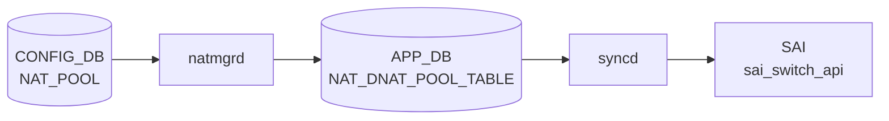

# NAT_POOL テーブル

## 概要

`NAT_POOL` は dynamic [NAT](../../reference/glossary.md#term-nat) で利用する変換アドレス / port 範囲の named pool を定義する [CONFIG_DB](../../reference/glossary.md#term-config_db) テーブル[^1]。`natmgrd` が `doNatPoolTask()` でエントリを検証してキャッシュし、`NAT_BINDINGS` と連携して kernel iptables ルールおよび [APPL_DB](../../reference/glossary.md#term-appl_db) の `NAT_DNAT_POOL_TABLE` へ反映する。エントリ最大 16 件。

<!-- cdb-mermaid -->
### データフロー (自動生成)



!!! note "凡例"
    CONFIG_DB から SAI までの典型経路を `docs/reference/config-db-orch-map.md` から機械生成したミニ図。詳細・例外は本ページ本文と対応表を参照。
<!-- /cdb-mermaid -->

## key 構造

```text
NAT_POOL|<pool_name>
```

`pool_name` は 1..32 文字、`[a-zA-Z0-9]{1}([-a-zA-Z0-9_]{0,31})` パターン ([YANG](../../reference/glossary.md#term-yang) 制約)。

## 主要フィールド

| フィールド | 型 | 必須 | デフォルト | 説明 |
|-----------|----|------|-----------|------|
| `nat_ip` | IP address range | yes | — | pool に含める単一 IP または `low-high` 形式の IP 範囲 |
| `nat_port` | port range string | no | `""` → port 制限なし | pool に含める L4 port 範囲 (`start-end` 形式) |

<!-- defaults -->
## フィールド暗黙デフォルト (Phase A — コード由来)

[YANG](../../reference/glossary.md#term-yang) default 以外の実装レベルの fallback。`natmgr.cpp doNatPoolTask` L6482–6866、`config/nat.py add_pool` L673–772 を調査。

| フィールド / 条件 | 検出種別 | 挙動 | ソース |
|---|---|---|---|
| `nat_ip` 欠落 | silent drop | `SWSS_LOG_ERROR("Invalid nat_ip values, skipping %s")` + erase (再試行なし) | `natmgr.cpp:6539` |
| `nat_port` 欠落 または `"NULL"` | 暗黙デフォルト | `port_range = EMPTY_STRING` → iptables に port 制限なし (full-cone MASQUERADE) | `natmgr.cpp:6812` |
| `nat_port` 省略時の CLI 書き込み | 経路依存乖離 | CLI は `"NULL"` を DB に書き込む; natmgr は `""` と同等に扱う | `nat.py:721` |
| `nat_port` で port 0 指定 | silent drop | `portValue_low < L4_PORT_MIN(1)` → ERROR + erase (YANG は 0 を許容) | `natmgr.cpp:6694` |
| `nat_ip` に単一 IP 指定 | ハードコード展開 | `ipv4_addr_high = ntohl(ipv4_addr_low)` で 1-address pool として処理 | `natmgr.cpp:6652` |
| `nat_ip` に 0.0.0.0 / ブロードキャスト / ループバック / マルチキャスト / 予約済み | silent drop | ERROR + erase (YANG の typedef はこれらを拒否しない) | `natmgr.cpp:6608` |
| `nat_ip` 範囲で low >= high | silent drop | ERROR + erase (YANG は順序を検証しない) | `natmgr.cpp:6635` |
| `nat_ip` が既存 `STATIC_NAT` の global_ip と重複 | silent drop | `SWSS_LOG_ERROR("Pool Ip address is overlaps with static NAT entry")` + erase | `natmgr.cpp:6771` |
| 未知フィールド (`nat_ip` / `nat_port` 以外) | silent drop | `nonValueFound=true` → ERROR + erase | `natmgr.cpp:6557` |
| pool 名が 32 文字超 | silent drop | `SWSS_LOG_ERROR("Invalid pool name length - %zu")` + erase | `natmgr.cpp:6563` |
| key が `\|` で複数セグメント (size != 1) | silent drop | ERROR + erase | `natmgr.cpp:6504` |
| `nat_port` range で low >= high | silent drop | ERROR + erase | `natmgr.cpp:6721` |
<!-- /defaults -->

## 制約

- エントリ数上限: **16 件** (YANG `max-elements 16`)
- pool 名: 最大 32 文字
- `nat_ip`: mandatory。単一 IP または `low-high` 形式の IP 範囲
- `nat_port`: 省略可。指定する場合は `start-end` 形式 (例: `1024-65535`)。L4 ポート 1..65535 の範囲
- `nat_ip` の IP は 0.0.0.0、ブロードキャスト、ループバック、マルチキャスト、予約済みアドレスを指定不可

## 購読者

- `natmgrd` (`doNatPoolTask`): [CONFIG_DB](../../reference/glossary.md#term-config_db) の `NAT_POOL` 変更を検知し、pool 情報を内部キャッシュ (`m_natPoolInfo`) に格納する。`NAT_BINDINGS` との組み合わせで kernel iptables ルールと [APPL_DB](../../reference/glossary.md#term-appl_db) `NAT_DNAT_POOL_TABLE` エントリを設定する。
- `orchagent / NatOrch` (`doDnatPoolTableTask`): [APPL_DB](../../reference/glossary.md#term-appl_db) の `NAT_DNAT_POOL_TABLE` を消費して [SAI](../../reference/glossary.md#term-sai) `SAI_NAT_TYPE_DESTINATION_NAT_POOL` エントリを作成する。

## 関連 CONFIG_DB / YANG / CLI

- 関連 [CONFIG_DB](../../reference/glossary.md#term-config_db): `NAT_GLOBAL`、`NAT_BINDINGS`、`STATIC_NAT`、`STATIC_NAPT`
- 関連 CLI: `config nat add pool`、`config nat remove pool`
- 関連 [YANG](../../reference/glossary.md#term-yang): `sonic-nat`

<!-- ref-triangle:start -->

## 関連リファレンス

- YANG: [`sonic-nat`](../yang/sonic-nat.md)
- CLI: [`config nat`](../cli/config-nat.md)
- CONFIG_DB: [`NAT_GLOBAL / NAT_POOL`](nat.md)
- CONFIG_DB: [`NAT_BINDINGS`](nat-bindings.md)

<!-- ref-triangle:end -->

## 引用元

[^1]: YANG 定義 + natmgr 実装: `sonic-nat.yang` / `sonic-swss/cfgmgr/natmgr.cpp`. <https://github.com/sonic-net/sonic-swss/blob/master/cfgmgr/natmgr.cpp>

<!-- ops-hint -->
## 運用ヒント

### 典型設定

```bash
# Pool の追加
config nat add pool POOL1 192.168.100.1-192.168.100.10 1024-65535

# 単一 IP pool (port 制限なし)
config nat add pool POOL_SINGLE 10.0.0.1

# Pool の確認
sonic-db-cli CONFIG_DB hgetall 'NAT_POOL|POOL1'
show nat config pools
```

### よくある誤設定

- `nat_ip` に 0.0.0.0 やループバック (127.x.x.x) を指定 → [natmgrd](../../reference/glossary.md#term-natmgrd-natsyncd) が silent drop
- `nat_ip` 範囲で low >= high を指定 (例: `10.0.0.10-10.0.0.1`) → [natmgrd](../../reference/glossary.md#term-natmgrd-natsyncd) が silent drop
- `nat_port` で 0 を指定 → [natmgrd](../../reference/glossary.md#term-natmgrd-natsyncd) が silent drop (YANG は 0 を許容するが実装で拒否)
- `nat_ip` が既存 `STATIC_NAT` エントリの global_ip と重複 → natmgrd が silent drop

### 確認コマンド

```bash
sonic-db-cli CONFIG_DB keys 'NAT_POOL|*'
sonic-db-cli CONFIG_DB hgetall 'NAT_POOL|POOL1'
show nat config pools
show nat translations
```
<!-- /ops-hint -->

<!-- cdb-exceptions -->
## 例外条件・特殊挙動

<!-- evidence: sonic-swss/cfgmgr/natmgr.cpp doNatPoolTask L6482-6866 -->

- **pool 名が 32 文字超 → silent drop**: `"Invalid pool name length - %zu, skipping %s"` をログしてエントリを消費 (`natmgr.cpp:6563-6568`)。
- **重複エントリ (同じ key / value) → silent drop**: `"Duplicate Pool and it's values, skipping %s"` をログして消費 (`natmgr.cpp:6786-6789`)。
- **pool 更新時の binding 自動再適用**: pool の `nat_ip` / `nat_port` を変更した場合、binding に紐づく iptables ルールが一旦削除され新しい pool 情報で再生成される。この間 dynamic [NAT](../../reference/glossary.md#term-nat) セッションが確立できない空白期間が生じる可能性がある。
- **DEL 時の CONFIG_DB binding 残留**: pool を削除すると binding に紐づく iptables / APPL_DB エントリは自動削除されるが、CONFIG_DB の `NAT_BINDINGS` エントリは残存する (dangling binding)。次に同名 pool が追加されると自動的に再接続される。

<!-- /cdb-exceptions -->

<!-- value-behavior -->
## 値依存挙動マトリクス

<!-- evidence: sonic-swss/cfgmgr/natmgr.cpp doNatPoolTask / addDynamicNatRule -->

| フィールド | 値 | 挙動 |
|-----------|-----|------|
| `nat_ip` | 単一 IP (例: `10.0.0.1`) | 1-address pool として処理。`ipv4_addr_high = ntohl(ipv4_addr_low)` |
| `nat_ip` | IP 範囲 (例: `10.0.0.1-10.0.0.10`) | low から high までの全アドレスが pool に含まれる |
| `nat_port` | 省略 または `"NULL"` | `port_range = ""` → iptables に port 制限なし (full-cone MASQUERADE) |
| `nat_port` | 範囲 (例: `1024-65535`) | 指定範囲のみに dynamic [NAT](../../reference/glossary.md#term-nat) を許可 |
| `nat_port` | 単一ポート (例: `8080`) | low のみ検証して受理。iptables では単一ポート指定として扱われる |
| pool エントリ数 | 17件目以上 | YANG `max-elements 16` でバリデーション拒否 |

<!-- /value-behavior -->

<!-- runtime-trace -->
## CDB → 実コンテナ動作トレース

### 段階 1: Consumer 登録

- **natmgrd** (`sonic-swss/cfgmgr/natmgr.cpp`): `NAT_POOL` を `SubscriberStateTable` で購読 (`natmgrd.cpp:112`)。

### 段階 2: CFG → キャッシュ + iptables

- `doNatPoolTask()` が `nat_ip` / `nat_port` を検証してキャッシュ (`m_natPoolInfo[key]`) に保存。
- binding (`NAT_BINDINGS`) が既に存在する場合は `addDynamicNatRule()` を呼び出して iptables ルールを設定。
- `setDnatPoolfromNatPool(ADD, ip_range)` で `APPL_DB NAT_DNAT_POOL_TABLE` にエントリを書き込む。

### 段階 3: APPL → SAI

- `NatOrch::doDnatPoolTableTask()` (`natorch.cpp:2968`) が `NAT_DNAT_POOL_TABLE` 変更を受けて `addHwDnatPoolEntry()` を呼び出す。
- `sai_nat_api->create_nat_entry()` で `SAI_NAT_TYPE_DESTINATION_NAT_POOL` エントリを [ASIC](../../reference/glossary.md#term-asic) に書き込む。

<!-- /runtime-trace -->

<!-- ordering -->
## 書込み順依存 (Phase B)

<!-- evidence: sonic-swss/cfgmgr/natmgr.cpp addDynamicNatRule L4621-4680 / doNatPoolTask L6482-6866 / isNatEnabled L150 / sonic-swss/orchagent/natorch.cpp enableNatFeature L2534-2581 / addAllDnatPoolEntries L1854-1863 / doDnatPoolTableTask L2968-3031 -->

### NAT_GLOBAL (admin_mode=enabled) が前提

`addDynamicNatRule()` (`natmgr.cpp:4632-4636`) 冒頭で `isNatEnabled()` を確認し、false の場合は処理をスキップする。

```cpp
// natmgr.cpp:4632-4636
if (!isNatEnabled())
{
    SWSS_LOG_INFO("NAT is not yet enabled, skipping dynamic nat rules addition for %s", key.c_str());
    return;
}
```

`NAT_POOL` を先に書いても `admin_mode=disabled` 状態では iptables / APPL_DB のルール設定は行われない。`NAT_GLOBAL|Values` に `admin_mode=enabled` を設定した後にのみ pool の実効化が行われる。

### NAT_POOL は NAT_BINDINGS より先行推奨

`addDynamicNatRule()` (`natmgr.cpp:4638-4643`) は binding 処理時に pool キャッシュを参照する。

```cpp
// natmgr.cpp:4638-4643
if (m_natPoolInfo.find(pool_name) == m_natPoolInfo.end())
{
    SWSS_LOG_INFO("Pool %s is not yet enabled, skipping dynamic nat rules addition for %s",
                  pool_name.c_str(), key.c_str());
    return;
}
```

`NAT_POOL` が `m_natPoolInfo` キャッシュに存在しない場合は binding が先に到着しても dynamic NAT ルールをスキップする。ただし**エントリは失われない**: pool が後から追加されると `doNatPoolTask()` L6816-6822 の末尾 `addDynamicNatRule(binding_name)` が再トリガーされる。

推奨順序:

```
SET NAT_GLOBAL|Values    admin_mode=enabled          # NAT feature を有効化
SET NAT_POOL|<name>      nat_ip=...  nat_port=...    # pool を先に定義
SET NAT_BINDINGS|<name>  nat_pool=<name>              # pool 登録後に binding を追加
```

### L3 インタフェース readiness — getIpEnabledIntf() 依存

`addDynamicNatRule()` (`natmgr.cpp:4654-4659`) は pool の `nat_ip` 低位アドレスに対応する L3 インタフェースの有効性を確認する。

```cpp
// natmgr.cpp:4654-4659
if (!getIpEnabledIntf(nat_ip[0], pool_interface))
{
    SWSS_LOG_INFO("L3 Interface is not yet enabled for %s, skipping dynamic nat rules addition", key.c_str());
    return;
}
```

`INTERFACE`/`PORTCHANNEL_INTERFACE`/`VLAN_INTERFACE` のいずれかが有効化されていない場合、pool / binding が揃っていても dynamic NAT ルールは設定されない。インタフェース有効化後の自動再トリガーはなく、インタフェース `nat_zone` 変更イベントで再処理される。

### pool 更新時の自動再適用

既存 pool の `nat_ip` / `nat_port` を変更する場合 (`doNatPoolTask` L6779-6823):

1. `isPoolMappedtoBinding(key, binding_name)` で binding の有無を確認
2. binding が存在する場合 `removeDynamicNatRule(binding_name)` で iptables / APPL_DB エントリを削除
3. 新しい `ip_range` / `port_range` をキャッシュに更新
4. `addDynamicNatRule(binding_name)` で新しい pool 情報でルールを再生成

この間 (数十 ms オーダー) は dynamic NAT セッションが確立できない空白期間が発生しうる。

### NatOrch 層 (APPL_DB → SAI) での pool 投入順序

`enableNatFeature()` (`natorch.cpp:2576-2580`) は NAT feature 有効化時に DNAT pool を NAT エントリより先に投入する。

```cpp
// natorch.cpp:2576-2580
addAllDnatPoolEntries();   // SAI_NAT_TYPE_DESTINATION_NAT_POOL を先に投入
addAllNatEntries();        // SNAT/DNAT/NAPT エントリを後に投入
```

`doDnatPoolTableTask()` (`natorch.cpp:2968-3031`) でも pool entry を `sai_nat_api->create_nat_entry()` で先に登録する。DNAT pool entry が DNAT entry より必ず先行してハードウェアに投入される設計。

### 安全な DEL 順序

pool を削除すると、binding に紐づく iptables ルールと APPL_DB `NAT_DNAT_POOL_TABLE` エントリは `removeDynamicNatRule()` が自動的に削除する。しかし CONFIG_DB の `NAT_BINDINGS` エントリは残る。

```
DEL NAT_BINDINGS|<name>    # binding を先に削除 (iptables/APPL_DB クリーンアップ)
DEL NAT_POOL|<name>        # pool を後に削除
```

<!-- /ordering -->

<!-- cross-refs -->
## 暗黙参照テーブル (Phase C)

`NAT_POOL` エントリが処理される際に `natmgrd` (`natmgr.cpp`) および `NatOrch` (`natorch.cpp`) が
暗黙的に依存する他テーブルの関係を示す。

<!-- evidence: sonic-swss/cfgmgr/natmgr.cpp doNatPoolTask L6748-6822 / addDynamicNatRule L4621-4680 / getIpEnabledIntf L236-255 / isPoolMappedtoBinding L182-200 / sonic-swss/orchagent/natorch.cpp doDnatPoolTableTask L2968-3031 / addAllDnatPoolEntries L1854-1863 -->

| 依存方向 | 参照元 | 参照先テーブル | 参照先キー形式 | 依存内容 | 証跡 |
|---------|--------|--------------|--------------|---------|------|
| natmgr → NAT_GLOBAL | `addDynamicNatRule()` — `isNatEnabled()` | `NAT_GLOBAL` (CONFIG_DB) / `APP_NAT_GLOBAL_TABLE` (APPL_DB) | `NAT_GLOBAL\|Values` | `admin_mode=enabled` が APPL_DB に伝播するまで pool の iptables / APPL_DB 反映をスキップ | `natmgr.cpp:4632-4636` |
| natmgr → INTERFACE 系 | `addDynamicNatRule()` — `getIpEnabledIntf()` | `INTERFACE` / `PORTCHANNEL_INTERFACE` / `VLAN_INTERFACE` (CONFIG_DB) | 各インタフェース名 | pool `nat_ip` 低位アドレスのサブネットに一致する L3 インタフェース (nat_zone 設定済み) が必要。未一致の場合 dynamic NAT ルール設定をスキップ | `natmgr.cpp:4654-4659`, `natmgr.cpp:8179` |
| natmgr → NAT_BINDINGS | `doNatPoolTask()` — `isPoolMappedtoBinding()` | `NAT_BINDINGS` (CONFIG_DB) | `NAT_BINDINGS\|<name>` | pool 追加・更新時に参照している binding を自動検出して `addDynamicNatRule()` を再呼び出し。binding 側から見た pool の後続再評価トリガ | `natmgr.cpp:6815-6822`, `natmgr.cpp:182-200` |
| NAT_BINDINGS → NAT_POOL | YANG leafref (`nat_pool` フィールド) | `NAT_POOL` (CONFIG_DB) | `NAT_POOL\|<name>` | YANG バリデーション参照整合性。`nat_pool` に指定した名前が `NAT_POOL` に存在しなければ YANG レベルで拒否される | `sonic-nat.yang:271` |
| natmgr → STATIC_NAT | `doNatPoolTask()` — `m_staticNatEntry` 走査 | `STATIC_NAT` (CONFIG_DB) | `STATIC_NAT\|<ip>` | pool の `nat_ip` 範囲が `STATIC_NAT` の global IP と重複する場合は silent drop (`isOverlap` チェック) | `natmgr.cpp:6748-6775` |
| natmgr → APP_NAT_DNAT_POOL_TABLE | `setDnatPoolfromNatPool()` | `NAT_DNAT_POOL_TABLE` (APPL_DB) | `NAT_DNAT_POOL_TABLE\|<ip>` | pool の各 IP を APPL_DB に書き込み NatOrch に伝達。NatOrch が [SAI](../../reference/glossary.md#term-sai) `SAI_NAT_TYPE_DESTINATION_NAT_POOL` エントリを作成 | `natmgr.cpp:2276-2277`, `natorch.cpp:2968-3031` |

### 解決タイミング

- **NAT_GLOBAL `admin_mode` 依存**: `isNatEnabled()` は `m_natGlobal.adminMode == ENABLED_STRING` を確認する。`doNatGlobalTableTask()` が NAT_GLOBAL 変更を受けて内部フラグを更新。有効化前の pool / binding は iptables / APPL_DB に反映されず、有効化後に binding イベント再処理で補完される。
- **INTERFACE 系依存**: `m_natIpInterfaceInfo` は `doNatInterfaceTask()` (`natmgr.cpp:8179`) が `INTERFACE` / `PORTCHANNEL_INTERFACE` / `VLAN_INTERFACE` / `LOOPBACK_INTERFACE` の変更ごとに更新。インタフェース有効化後の pool 自動再評価はなく、nat_zone 変更イベントで間接的に再処理される。
- **NAT_BINDINGS 双方向依存**: pool 登録時に `isPoolMappedtoBinding()` で全 binding をイテレートし、この pool を参照する binding があれば `addDynamicNatRule()` を即座に再呼び出し。pool の新規追加・更新・削除のいずれでも発火する。
- **STATIC_NAT 重複チェック**: pool 書き込み時点で `m_staticNatEntry` をメモリ内で走査する同期チェック。STATIC_NAT の追加後に pool を追加した場合のみ検出可能。逆順（pool 後に STATIC_NAT 追加）の重複は検出されない。

> 中間調査詳細: `meta/_intermediate/cdb-flow/nat-pool-cross-refs.md`
<!-- /cross-refs -->

<!-- failure -->
## 失敗挙動 (Phase D)

`NatMgr::doNatPoolTask(Consumer&)` (`sonic-swss/cfgmgr/natmgr.cpp` L6482–6866) を全行調査した。すべての失敗ケースは `consumer.m_toSync.erase(it)` でエントリを**即座に破棄**する設計（保留/retry なし）。

### SET 操作の失敗パターン

| 失敗ケース | 発生箇所 | 挙動 | retry |
|---|---|---|---|
| key セグメント数 != 1 (`\|` 区切りで複数) | `doNatPoolTask()` L6504-6508 | `SWSS_LOG_ERROR` + erase → **破棄** | なし（再投入が必要） |
| `nat_ip` フィールド欠落 または複数 | `doNatPoolTask()` L6539-6543 | `SWSS_LOG_ERROR("Invalid nat_ip values")` + erase → **破棄** | なし |
| `nat_port` フィールドが複数 | `doNatPoolTask()` L6547-6551 | `SWSS_LOG_ERROR("Invalid key values")` + erase → **破棄** | なし |
| 未知フィールド (`nat_ip` / `nat_port` 以外) | `doNatPoolTask()` L6555-6559 | `SWSS_LOG_ERROR("Invalid value")` + erase → **破棄** | なし |
| pool 名が 32 文字超 | `doNatPoolTask()` L6563-6567 | `SWSS_LOG_ERROR("Invalid pool name length")` + erase → **破棄** | なし |
| `nat_ip` が空または `"NULL"` | `doNatPoolTask()` L6571-6575 | `SWSS_LOG_ERROR("Invalid nat_ip")` + erase → **破棄** | なし |
| `nat_ip` 範囲 token 数 > 2 | `doNatPoolTask()` L6588-6592 | `SWSS_LOG_ERROR("Invalid nat ip range size")` + erase → **破棄** | なし |
| `nat_ip` high/low の IP 形式不正 | `doNatPoolTask()` L6599-6604, L6617-6622 | `SWSS_LOG_ERROR("Invalid ip address format")` + erase → **破棄** | なし |
| `nat_ip` に 0.0.0.0 / ブロードキャスト / ループバック / マルチキャスト / 予約済みアドレス | `doNatPoolTask()` L6608-6613, L6626-6631, L6656-6661 | `SWSS_LOG_ERROR("Invalid ip address")` + erase → **破棄** | なし |
| `nat_ip` 範囲で low >= high | `doNatPoolTask()` L6635-6639 | `SWSS_LOG_ERROR("NAT pool ip range ... is not valid")` + erase → **破棄** | なし |
| `nat_port` range token 数 > 2 | `doNatPoolTask()` L6673-6677 | `SWSS_LOG_ERROR("Invalid nat port range size")` + erase → **破棄** | なし |
| `nat_port` が整数に変換不可 | `doNatPoolTask()` L6682-6690, L6701-6709, L6731-6739 | `SWSS_LOG_ERROR("Invalid port")` + erase → **破棄** | なし |
| `nat_port` 値が 1〜65535 の範囲外 (0 含む) | `doNatPoolTask()` L6694-6698, L6714-6718, L6743-6747 | `SWSS_LOG_ERROR("Invalid port value")` + erase → **破棄** | なし |
| `nat_port` 範囲で low >= high | `doNatPoolTask()` L6721-6725 | `SWSS_LOG_ERROR("Invalid nat port range")` + erase → **破棄** | なし |
| `nat_ip` 範囲が `STATIC_NAT` の global IP と重複 | `doNatPoolTask()` L6771-6775 | `SWSS_LOG_ERROR("Pool Ip address is overlaps with static NAT entry")` + erase → **破棄** | なし |
| 同一 key・同一値の重複 SET | `doNatPoolTask()` L6786-6788 | `SWSS_LOG_ERROR("Duplicate Pool and it's values")` + erase → **破棄** | なし |

### DEL 操作の挙動

| ケース | 発生箇所 | 挙動 |
|--------|---------|------|
| キャッシュに存在する pool を DEL | `doNatPoolTask()` L6838-6851 | `isPoolMappedtoBinding()` で binding を確認 → binding があれば `removeDynamicNatRule()` → `m_natPoolInfo.erase()` → erase（正常完了） |
| キャッシュに存在しない pool を DEL | `doNatPoolTask()` L6853-6855 | `SWSS_LOG_ERROR("Invalid NAT Pool ... do nothing")` + erase（no-op 成功扱い） |
| 不明 op type | `doNatPoolTask()` L6860-6863 | `SWSS_LOG_ERROR("Unknown operation type")` + erase（消費） |

### ログ・ERROR_TABLE

- すべてのエラーは `SWSS_LOG_ERROR` で syslog (`/var/log/swss/natmgr.log`) に出力される。
- [STATE_DB](../../reference/glossary.md#term-state_db) / `ERROR_TABLE` への書き込みは**行われない**。NAT_POOL の処理失敗は syslog のみで確認可能。
- `sonic-db-cli CONFIG_DB hgetall 'NAT_POOL|<name>'` でエントリ残存の確認は可能だが、natmgrd キャッシュ (`m_natPoolInfo`) の状態は外部から確認するコマンドがない。

### retry 挙動

`doNatPoolTask()` は失敗時に**一切保留しない**。iptables / APPL_DB / [SAI](../../reference/glossary.md#term-sai) 設定スキップ（NAT 無効・インタフェース未準備）の場合のみ erase せず次のイベントで自然に再処理されるが、バリデーション失敗は全件 erase 破棄となる。再適用するには `config nat add pool` でエントリを再投入する必要がある。

> **証跡**: `NatMgr::doNatPoolTask()` L6482–6866 (`sonic-swss/cfgmgr/natmgr.cpp`).
<!-- /failure -->

<!-- constants -->
## ハードコード定数 (Phase E)

`natmgrd` (`cfgmgr/natmgr.h` / `natmgr.cpp`) および `NatOrch` (`orchagent/natorch.h` / `natorch.cpp`) に存在する、CONFIG_DB / YANG で管理されない実装レベルの固定値一覧。

### バリデーション境界値 (natmgr.h)

| 定数 | 値 | 用途 | ソース |
|------|----|------|--------|
| `L4_PORT_MIN` | `1` | `nat_port` 範囲の最小値チェック。`0` は YANG で許容されるが実装で拒否される | `natmgr.h:110` |
| `L4_PORT_MAX` | `65535` | `nat_port` 範囲の最大値チェック | `natmgr.h:111` |
| `POOL_TABLE_KEY_SIZE` | `1` | `NAT_POOL` key のセグメント数制約 (`|` 区切り禁止) | `natmgr.h:52` |
| pool 名最大長 | `32` (リテラル) | `key.length() > 32` をチェックするが #define なし | `natmgr.cpp:6563` |

### NAT セッションタイムアウトデフォルト (natmgr.h)

これらは `NAT_GLOBAL` テーブルで上書き可能だが、`NAT_GLOBAL` 未設定時に `NAT_POOL` 経由で確立された dynamic NAT セッションに適用される実装デフォルト。

| 定数 | 値 | 用途 | ソース |
|------|----|------|--------|
| `NAT_TIMEOUT_DEFAULT` | `600` 秒 | generic dynamic NAT セッションのデフォルトタイムアウト | `natmgr.h:64` |
| `NAT_TIMEOUT_MIN` | `300` 秒 | `NAT_GLOBAL.nat_timeout` の下限 | `natmgr.h:62` |
| `NAT_TIMEOUT_MAX` | `432000` 秒 (5 日) | `NAT_GLOBAL.nat_timeout` の上限。static conntrack エントリの擬似永続保存にも使用 | `natmgr.h:63` |
| `NAT_TCP_TIMEOUT_DEFAULT` | `86400` 秒 (1 日) | TCP dynamic NAT セッションのデフォルトタイムアウト | `natmgr.h:69` |
| `NAT_TCP_TIMEOUT_MIN` | `300` 秒 | TCP タイムアウト下限 | `natmgr.h:67` |
| `NAT_TCP_TIMEOUT_MAX` | `432000` 秒 | TCP タイムアウト上限 | `natmgr.h:68` |
| `NAT_UDP_TIMEOUT_DEFAULT` | `300` 秒 | UDP dynamic NAT セッションのデフォルトタイムアウト | `natmgr.h:73` |
| `NAT_UDP_TIMEOUT_MIN` | `120` 秒 | UDP タイムアウト下限 | `natmgr.h:71` |
| `NAT_UDP_TIMEOUT_MAX` | `600` 秒 | UDP タイムアウト上限 | `natmgr.h:72` |

### 内部タイマー周期 (natmgr.h / natorch.h)

| 定数 | 値 | 用途 | ソース |
|------|----|------|--------|
| `NAT_ENTRY_REFRESH_PERIOD` | `86400` 秒 (1 日) | static conntrack エントリを kernel に再書き込みする周期 (`NAT_ENTRY_REFRESH_TIMER`) | `natmgr.h:125` |
| `NAT_HITBIT_N_CNTRS_QUERY_PERIOD` | `5` 秒 | NatOrch が SAI hit-bit / カウンタを取得する周期 (`NAT_HITBIT_N_CNTRS_QUERY_TIMER`) | `natorch.h:37` |
| `NAT_CONNTRACK_TIMEOUT_PERIOD` | `86400` 秒 (1 日) | NatOrch が `SETTIMEOUTNAT` 通知で natmgrd に conntrack タイムアウト更新を要求する周期 | `natorch.h:38` |
| `NAT_HITBIT_QUERY_MULTIPLE` | `6` | hit-bit クエリ間隔 = `5 × 6 = 30` 秒。カウンタクエリの 6 回に 1 回のみ hit-bit を照会 | `natorch.h:39` |

### SAI 依存の動的上限 (natorch.cpp)

NatOrch 初期化時に `SAI_SWITCH_ATTR_AVAILABLE_SNAT_ENTRY` を照会して `maxAllowedSNatEntries` を取得する。値はハードウェア実装依存であり、コードにリテラルはない。動的 NAT セッション数がこの上限に達すると新規 SNAT エントリは作成されず silent drop となる。`COUNTERS_DB NAT_COUNTER_TABLE|Values MAX_NAT_ENTRIES` に記録される。(`natorch.cpp:108-127`)

### iptables 生成ルールの固定値

| 項目 | 値 | 用途 |
|------|----|------|
| iptables target (`nat_port` 省略時) | `MASQUERADE` | port 制約なし full-cone SNAT (iptables が port を自動選択) |
| iptables target (`nat_port` 指定時) | `SNAT --to-source ip:port_range` | 指定 pool IP・port 範囲に変換 |
| 対応 L4 プロトコル | TCP / UDP / ICMP | dynamic NAT iptables ルールを生成する 3 プロトコル固定。その他プロトコルは変換対象外 |
| iptables テーブル | `nat` (POSTROUTING SNAT) + `mangle` (PREROUTING/POSTROUTING zone-mark) | dynamic NAT の 2-table 構成 |

詳細な定数一覧は `meta/_intermediate/cdb-flow/nat-pool-constants.md` を参照。
<!-- /constants -->

<!-- side-effects -->
## 副次 DB 書込 (Phase F)

`NAT_POOL` エントリが処理されると、`natmgrd` → `orchagent / NatOrch` の経路で以下の副次書込が発生する。ソース: `sonic-swss/cfgmgr/natmgr.cpp`[^F1]、`sonic-swss/orchagent/natorch.cpp`[^F2]。

**書込が発生する前提条件**: `isNatEnabled()` が true、かつ pool に紐づく `NAT_BINDINGS` エントリが存在し、L3 インタフェース readiness を満たしている場合のみ。いずれかを満たさない場合、以下の APPL_DB / [ASIC_DB](../../reference/glossary.md#term-asic_db) 書込はすべてスキップされる。

### APPL_DB — NAT_DNAT_POOL_TABLE

`NatMgr::addDynamicNatRule()` が `setDnatPoolfromNatPool(ADD, ip_range)` を呼び出し、pool 内の各 IP アドレスを 1 エントリずつ APPL_DB に書き込む。

```
NAT_DNAT_POOL_TABLE|<pool_ip>
    NULL: NULL
```

| 操作 | 関数 | 挙動 | ソース |
|------|------|------|--------|
| pool SET + binding 存在 | `addDnatPoolEntry(destIp)` | 初回は ref-count=1 で `m_appNatDnatPoolProducer.set(destIp, {"NULL":"NULL"})` | `natmgr.cpp:1520` |
| pool IP が複数 binding で共有 | `addDnatPoolEntry(destIp)` | ref-count を加算のみ。APPL_DB への重複書込なし | `natmgr.cpp:1508` |
| pool DEL + binding 存在 | `removeDnatPoolEntry(destIp)` | ref-count を減算し 0 になった時点で `m_appNatDnatPoolProducer.del(destIp)` | `natmgr.cpp:1543` |

ref-count は内部マップ `m_natDnatPoolInfo[destIp]` で管理される。複数の binding が同一 pool の IP アドレスを参照する場合、最後の binding が削除されるまで APPL_DB エントリは保持される。

### ASIC_DB — SAI NAT エントリ (SAI_NAT_TYPE_DESTINATION_NAT_POOL)

`NatOrch::doDnatPoolTableTask()` が `NAT_DNAT_POOL_TABLE` 変更を受けて `addHwDnatPoolEntry()` / `removeHwDnatPoolEntry()` を呼び出す。

| 操作 | SAI API 呼び出し | SAI nat_type | ソース |
|------|----------------|-------------|--------|
| pool IP 追加 | `sai_nat_api->create_nat_entry()` | `SAI_NAT_TYPE_DESTINATION_NAT_POOL` | `natorch.cpp:1805` |
| pool IP 削除 | `sai_nat_api->remove_nat_entry()` | `SAI_NAT_TYPE_DESTINATION_NAT_POOL` | `natorch.cpp:1837` |

`addHwDnatPoolEntry()` は `isNatEnabled()` が false の場合に SAI 書込をスキップして success (`true`) を返す (`natorch.cpp:1789-1793`)。APPL_DB エントリは保持されるため、NAT が後から有効化されると `enableNatFeature()` → `addAllDnatPoolEntries()` で全 pool IP が遡及的に [ASIC](../../reference/glossary.md#term-asic) に投入される。

### COUNTERS_DB — 初期化時の静的書込

NatOrch の初期化時に SAI `SAI_SWITCH_ATTR_AVAILABLE_SNAT_ENTRY` を照会し、取得値を `COUNTERS_GLOBAL_NAT|Values` の `MAX_NAT_ENTRIES` フィールドとして一度だけ書込む (`natorch.cpp:127`, `natorch.cpp:135`)。

NAT pool エントリ追加・削除に直接連動した [COUNTERS_DB](../../reference/glossary.md#term-counters_db) 更新はない。DNAT エントリ数カウンタ (`DNAT_ENTRIES`) は `addHwDnatPoolEntry()` では更新されず、pool 経由で確立した SNAT/DNAT セッション数カウンタは NatOrch のヒットビットタイマー (5 秒周期) で更新される。

### STATE_DB — 書込なし

`NatMgr` および `NatOrch` は [STATE_DB](../../reference/glossary.md#term-state_db) への書込を行わない。`STATE_PORT_TABLE` / `STATE_LAG_TABLE` / `STATE_INTERFACE_TABLE` は L3 インタフェース readiness ガード用の**読み取り専用**アクセスのみ。

[^F1]: natmgr APPL_DB 書込実装: `sonic-swss/cfgmgr/natmgr.cpp`. <https://github.com/sonic-net/sonic-swss/blob/master/cfgmgr/natmgr.cpp>
[^F2]: NatOrch [ASIC](../../reference/glossary.md#term-asic) 書込実装: `sonic-swss/orchagent/natorch.cpp`. <https://github.com/sonic-net/sonic-swss/blob/master/orchagent/natorch.cpp>

> 中間調査詳細: `meta/_intermediate/cdb-flow/nat-pool-side-effects.md`
<!-- /side-effects -->

<!-- pubsub -->
## 通信メカニズム (Phase G)

<!-- evidence: sonic-swss/cfgmgr/natmgrd.cpp L109-121,L149-153 / sonic-swss/cfgmgr/natmgr.cpp L8163-8165 / sonic-swss/orchagent/orchdaemon.cpp L456-465 / sonic-swss/orchagent/natorch.cpp L84-91,L137 -->

`NAT_POOL` の変更通知は **2 層** の非同期メカニズムで処理される。

### 層 1: natmgrd — CONFIG_DB → APPL_DB

`natmgrd` は `NatMgr` を通じて CONFIG_DB の `NAT_POOL` テーブルを **`SubscriberStateTable`** ([Redis](../../reference/glossary.md#term-redis) keyspace PSUBSCRIBE) で購読する (`natmgrd.cpp:112`)。

```
PSUBSCRIBE __keyspace@4__:NAT_POOL|*
```

SET/DEL イベントを受信すると `Consumer::execute()` → `NatMgr::doNatPoolTask()` へディスパッチされる (`natmgr.cpp:8163-8165`)。natmgrd のメインループは `SELECT_TIMEOUT=1000ms` で待機し、タイムアウト時は `natmgr->doTask()` でキュー残存タスクを処理する (`natmgrd.cpp:190-193`)。

起動時の初期スナップショット: `SubscriberStateTable` コンストラクタが PSUBSCRIBE 後に `m_table.getKeys()` で既存 key を全件取得し SET として積む。natmgrd 再起動後も既存 `NAT_POOL` エントリが全再処理される (再起動耐性)。

### 層 2: NatOrch — APPL_DB → SAI

`orchdaemon.cpp:457` で NatOrch を生成し、APPL_DB の `NAT_DNAT_POOL_TABLE` を **`ConsumerStateTable`** で最高優先度 (`natorch_base_pri + 5`) で購読する。

```cpp
{ APP_NAT_DNAT_POOL_TABLE_NAME,  natorch_base_pri + 5 },  // 優先度最高
```

natmgrd が `ProducerStateTable::set("NAT_DNAT_POOL_TABLE", ...)` を呼ぶと `APP_NAT_DNAT_POOL_TABLE_CHANNEL@0` が PUBLISH され、NatOrch の `doDnatPoolTableTask()` が `sai_nat_api->create_nat_entry(SAI_NAT_TYPE_DESTINATION_NAT_POOL)` を呼び出す。

### 非同期通知チャンネル

| チャンネル名 | DB | 方向 | 用途 |
|---|---|---|---|
| `NAT_DB_CLEANUP_NOTIFICATION` | APPL_DB | natmgrd → NatOrch | natmgrd 終了時に `NAT_DNAT_POOL_TABLE` を含む全 NAT エントリの [Redis](../../reference/glossary.md#term-redis)/ASIC クリーンアップを依頼 (`natmgrd.cpp:86`) |
| `FLUSHNATENTRIES` | APPL_DB | CLI → natmgrd | `show nat translate flush` による conntrack 全フラッシュ。pool 経由の dynamic session も削除される (`natmgrd.cpp:152`) |

### 経路サマリ

| ステップ | 実装 | ソース |
|---------|------|--------|
| CLI → CONFIG_DB | `config nat add pool` が `CONFIG_DB HSET NAT_POOL|<name>` を発行 | [sonic-utilities](../../reference/glossary.md#term-sonic-utilities)/config/nat.py |
| CONFIG_DB → natmgrd | `SubscriberStateTable` PSUBSCRIBE `__keyspace@4__:NAT_POOL|*` | subscriberstatetable.cpp |
| natmgrd ディスパッチ | `doNatPoolTask(consumer)` | natmgr.cpp:8163 |
| natmgrd → APPL_DB | `ProducerStateTable::set("NAT_DNAT_POOL_TABLE", destIp, ...)` (ref-count 付き) | natmgr.cpp:1520 |
| APPL_DB → NatOrch | `ConsumerStateTable("NAT_DNAT_POOL_TABLE")` + [orchagent](../../reference/glossary.md#term-orchagent) 統合ループ | orchdaemon.cpp:457 |
| NatOrch → SAI | `sai_nat_api->create_nat_entry(SAI_NAT_TYPE_DESTINATION_NAT_POOL)` | natorch.cpp:1805 |

> 中間調査詳細: `meta/_intermediate/cdb-flow/nat-pool-pubsub.md`
<!-- /pubsub -->

<!-- platform -->
## プラットフォーム差・ASIC ベンダー依存 (Phase H)

<!-- evidence: sonic-swss/orchagent/natorch.cpp NatOrch::NatOrch L107-149 / addHwDnatPoolEntry L1783-1819 / enableNatFeature L2534-2581 / sonic-swss/orchagent/orch.h L43 / sonic-swss/orchagent/main.cpp L935-949 -->

### SAI NAT capability チェック（全ベンダー共通）

NatOrch 初期化時に `SAI_SWITCH_ATTR_AVAILABLE_SNAT_ENTRY` を `sai_switch_api->get_switch_attribute()` で照会し、返値が **0 より大きい場合のみ** `gIsNatSupported = true` を設定する (`main.cpp:935-949`)。`gIsNatSupported` が `false` の場合、`enableNatFeature()` は `"NAT Feature is not supported in this Platform"` をログして即座に処理を中断し、**DNAT pool entry を含む SAI NAT オブジェクトは一切作成されない** (`natorch.cpp:2541-2544`)。

```cpp
// main.cpp:935-948
attr.id = SAI_SWITCH_ATTR_AVAILABLE_SNAT_ENTRY;
status = sai_switch_api->get_switch_attribute(gSwitchId, 1, &attr);
if (status == SAI_STATUS_SUCCESS && attr.value.u32 != 0)
{
    gIsNatSupported = true;
}
```

`maxAllowedSNatEntries` は同属性の取得値で初期化され、dynamic SNAT エントリ数の上限として使用される。`NAT_POOL` 経由の dynamic SNAT がこの上限に達すると新規 SNAT エントリは SAI に投入されず `AGEOUT-SINGLE-NAT` 通知で conntrack がエージアウトされる (`natorch.cpp:1882-1889`)。なお DNAT pool entry (`SAI_NAT_TYPE_DESTINATION_NAT_POOL`) はこの SNAT 上限とは**無関係**。

### Broadcom 専用: DNAT ネクストホップトラッキング

`orchagent/orch.h:43` に `#define BRCM_PLATFORM_SUBSTRING "broadcom"` が定義されており、NatOrch コンストラクタで環境変数 `platform` が `"broadcom"` を含む場合のみ `gNhTrackingSupported = true` が設定される (`natorch.cpp:144-148`)。

```cpp
// natorch.cpp:144-148
char *platform = getenv("platform");
if (platform && strstr(platform, BRCM_PLATFORM_SUBSTRING))
{
    gNhTrackingSupported = true;
}
```

`gNhTrackingSupported` は DNAT エントリ (`SAI_NAT_TYPE_DESTINATION_NAT`) の追加・削除パスで分岐条件として使用されるが、**DNAT pool エントリ (`SAI_NAT_TYPE_DESTINATION_NAT_POOL`) の `addHwDnatPoolEntry()` / `removeHwDnatPoolEntry()` はこのフラグを参照しない**。DNAT pool entry の投入は platform 分岐なしで実行される。

Broadcom では `enableNatFeature()` L2570 で `m_neighOrch->attach(this)` が呼ばれ NeighborOrch の変更通知を受信できるようになるため、DNAT エントリのネクストホップ変更時の遅延投入が機能する。非 Broadcom ではネクストホップ未解決でも即時 SAI 書き込みとなる。

### DNAT pool entry の SAI 固定属性

`addHwDnatPoolEntry()` (`natorch.cpp:1799-1805`) にはプラットフォーム分岐が存在しない。マスクは `0xffffffff`（ホストマスク）にハードコードされており、SAI 属性配列は空（`attr_count = 0`）で作成される。

```cpp
// natorch.cpp:1799-1805
dnat_pool_entry.nat_type          = SAI_NAT_TYPE_DESTINATION_NAT_POOL;
dnat_pool_entry.data.key.dst_ip   = ip_address.getV4Addr();
dnat_pool_entry.data.mask.dst_ip  = 0xffffffff;  // ホストマスク固定（platform 非依存）
// attr_count = 0 — DNAT pool entry は SAI 属性を持たない
status = sai_nat_api->create_nat_entry(&dnat_pool_entry, attr_count, nat_entry_attr);
```

### まとめ

| 挙動 | 条件 |
|------|------|
| NAT 機能全体（DNAT pool 含む）が有効 | `SAI_SWITCH_ATTR_AVAILABLE_SNAT_ENTRY > 0` (gIsNatSupported=true) |
| NAT 機能全体が無効（DNAT pool も投入されない） | 上記属性が 0 または取得失敗 (gIsNatSupported=false) |
| DNAT ネクストホップ追跡（DNAT entry 用） | Broadcom ASIC のみ (gNhTrackingSupported=true) |
| DNAT pool entry への platform 差 | なし（platform 分岐なし） |
| SNAT ハードウェア上限超過 | `totalSnatEntries == maxAllowedSNatEntries` → ageout 通知（DNAT pool は無関係） |

現行 [SONiC](../../reference/glossary.md#term-sonic) コミュニティ実装では **Broadcom ASIC のみが NAT ハードウェアオフロードを実運用レベルでサポートする**。

> 中間調査詳細: `meta/_intermediate/cdb-flow/nat-pool-platform.md`
<!-- /platform -->

<!-- topics-back-ref -->
## 関連 Topics

- [Topics: NAT / DHCP Relay / Time-DNS Services](../../topics/16-nat-dhcp-dns/index.md)

<!-- /topics-back-ref -->

<!-- glossary-links-injected: c460c0f7dd1b -->
