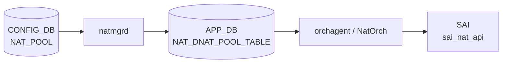

# NAT_POOL テーブル

## 概要

`NAT_POOL` は dynamic [NAT](../../reference/glossary.md#term-nat) で利用する変換アドレス / port 範囲の named pool を定義する [CONFIG_DB](../../reference/glossary.md#term-config_db) テーブル[^1]。`natmgrd` が `doNatPoolTask()` でエントリを検証してキャッシュし、`NAT_BINDINGS` と連携して kernel iptables ルールおよび [APPL_DB](../../reference/glossary.md#term-appl_db) の `NAT_DNAT_POOL_TABLE` へ反映する。エントリ最大 16 件。

<!-- cdb-mermaid -->
### データフロー (自動生成)



!!! note "凡例"
    CONFIG_DB から SAI までの典型経路を `docs/reference/config-db-orch-map.md` から機械生成したミニ図。詳細・例外は本ページ本文と対応表を参照。
<!-- /cdb-mermaid -->

## key 構造

```text
NAT_POOL|<pool_name>
```

`pool_name` は 1..32 文字、`[a-zA-Z0-9]{1}([-a-zA-Z0-9_]{0,31})` パターン (YANG 制約)。

## 主要フィールド

| フィールド | 型 | 必須 | デフォルト | 説明 |
|-----------|----|------|-----------|------|
| `nat_ip` | IP address range | yes | — | pool に含める単一 IP または `low-high` 形式の IP 範囲 |
| `nat_port` | port range string | no | `""` → port 制限なし | pool に含める L4 port 範囲 (`start-end` 形式) |

<!-- defaults -->
## フィールド暗黙デフォルト (Phase A — コード由来)

YANG default 以外の実装レベルの fallback。`natmgr.cpp doNatPoolTask` L6482–6866、`config/nat.py add_pool` L673–772 を調査。

| フィールド / 条件 | 検出種別 | 挙動 | ソース |
|---|---|---|---|
| `nat_ip` 欠落 | silent drop | `SWSS_LOG_ERROR("Invalid nat_ip values, skipping %s")` + erase (再試行なし) | `natmgr.cpp:6539` |
| `nat_port` 欠落 または `"NULL"` | 暗黙デフォルト | `port_range = EMPTY_STRING` → iptables に port 制限なし (full-cone MASQUERADE) | `natmgr.cpp:6812` |
| `nat_port` 省略時の CLI 書き込み | 経路依存乖離 | CLI は `"NULL"` を DB に書き込む; natmgr は `""` と同等に扱う | `nat.py:721` |
| `nat_port` で port 0 指定 | silent drop | `portValue_low < L4_PORT_MIN(1)` → ERROR + erase (YANG は 0 を許容) | `natmgr.cpp:6694` |
| `nat_ip` に単一 IP 指定 | ハードコード展開 | `ipv4_addr_high = ntohl(ipv4_addr_low)` で 1-address pool として処理 | `natmgr.cpp:6652` |
| `nat_ip` に 0.0.0.0 / ブロードキャスト / ループバック / マルチキャスト / 予約済み | silent drop | ERROR + erase (YANG の typedef はこれらを拒否しない) | `natmgr.cpp:6608` |
| `nat_ip` 範囲で low >= high | silent drop | ERROR + erase (YANG は順序を検証しない) | `natmgr.cpp:6635` |
| `nat_ip` が既存 `STATIC_NAT` の global_ip と重複 | silent drop | `SWSS_LOG_ERROR("Pool Ip address is overlaps with static NAT entry")` + erase | `natmgr.cpp:6771` |
| 未知フィールド (`nat_ip` / `nat_port` 以外) | silent drop | `nonValueFound=true` → ERROR + erase | `natmgr.cpp:6557` |
| pool 名が 32 文字超 | silent drop | `SWSS_LOG_ERROR("Invalid pool name length - %zu")` + erase | `natmgr.cpp:6563` |
| key が `\|` で複数セグメント (size != 1) | silent drop | ERROR + erase | `natmgr.cpp:6504` |
| `nat_port` range で low >= high | silent drop | ERROR + erase | `natmgr.cpp:6721` |
<!-- /defaults -->

## 制約

- エントリ数上限: **16 件** (YANG `max-elements 16`)
- pool 名: 最大 32 文字
- `nat_ip`: mandatory。単一 IP または `low-high` 形式の IP 範囲
- `nat_port`: 省略可。指定する場合は `start-end` 形式 (例: `1024-65535`)。L4 ポート 1..65535 の範囲
- `nat_ip` の IP は 0.0.0.0、ブロードキャスト、ループバック、マルチキャスト、予約済みアドレスを指定不可

## 購読者

- `natmgrd` (`doNatPoolTask`): [CONFIG_DB](../../reference/glossary.md#term-config_db) の `NAT_POOL` 変更を検知し、pool 情報を内部キャッシュ (`m_natPoolInfo`) に格納する。`NAT_BINDINGS` との組み合わせで kernel iptables ルールと [APPL_DB](../../reference/glossary.md#term-appl_db) `NAT_DNAT_POOL_TABLE` エントリを設定する。
- `orchagent / NatOrch` (`doDnatPoolTableTask`): [APPL_DB](../../reference/glossary.md#term-appl_db) の `NAT_DNAT_POOL_TABLE` を消費して [SAI](../../reference/glossary.md#term-sai) `SAI_NAT_TYPE_DESTINATION_NAT_POOL` エントリを作成する。

## 関連 CONFIG_DB / YANG / CLI

- 関連 [CONFIG_DB](../../reference/glossary.md#term-config_db): `NAT_GLOBAL`、`NAT_BINDINGS`、`STATIC_NAT`、`STATIC_NAPT`
- 関連 CLI: `config nat add pool`、`config nat remove pool`
- 関連 [YANG](../../reference/glossary.md#term-yang): `sonic-nat`

<!-- ref-triangle:start -->

## 関連リファレンス

- YANG: [`sonic-nat`](../yang/sonic-nat.md)
- CLI: [`config nat`](../cli/config-nat.md)
- CONFIG_DB: [`NAT_GLOBAL / NAT_POOL`](nat.md)
- CONFIG_DB: [`NAT_BINDINGS`](nat-bindings.md)

<!-- ref-triangle:end -->

## 引用元

[^1]: YANG 定義 + natmgr 実装: `sonic-nat.yang` / `sonic-swss/cfgmgr/natmgr.cpp`. <https://github.com/sonic-net/sonic-swss/blob/master/cfgmgr/natmgr.cpp>

<!-- ops-hint -->
## 運用ヒント

### 典型設定

```bash
# Pool の追加
config nat add pool POOL1 192.168.100.1-192.168.100.10 1024-65535

# 単一 IP pool (port 制限なし)
config nat add pool POOL_SINGLE 10.0.0.1

# Pool の確認
sonic-db-cli CONFIG_DB hgetall 'NAT_POOL|POOL1'
show nat config pools
```

### よくある誤設定

- `nat_ip` に 0.0.0.0 やループバック (127.x.x.x) を指定 → natmgrd が silent drop
- `nat_ip` 範囲で low >= high を指定 (例: `10.0.0.10-10.0.0.1`) → natmgrd が silent drop
- `nat_port` で 0 を指定 → natmgrd が silent drop (YANG は 0 を許容するが実装で拒否)
- `nat_ip` が既存 `STATIC_NAT` エントリの global_ip と重複 → natmgrd が silent drop

### 確認コマンド

```bash
sonic-db-cli CONFIG_DB keys 'NAT_POOL|*'
sonic-db-cli CONFIG_DB hgetall 'NAT_POOL|POOL1'
show nat config pools
show nat translations
```
<!-- /ops-hint -->

<!-- cdb-exceptions -->
## 例外条件・特殊挙動

<!-- evidence: sonic-swss/cfgmgr/natmgr.cpp doNatPoolTask L6482-6866 -->

- **pool 名が 32 文字超 → silent drop**: `"Invalid pool name length - %zu, skipping %s"` をログしてエントリを消費 (`natmgr.cpp:6563-6568`)。
- **重複エントリ (同じ key / value) → silent drop**: `"Duplicate Pool and it's values, skipping %s"` をログして消費 (`natmgr.cpp:6786-6789`)。
- **pool 更新時の binding 自動再適用**: pool の `nat_ip` / `nat_port` を変更した場合、binding に紐づく iptables ルールが一旦削除され新しい pool 情報で再生成される。この間 dynamic NAT セッションが確立できない空白期間が生じる可能性がある。
- **DEL 時の CONFIG_DB binding 残留**: pool を削除すると binding に紐づく iptables / APPL_DB エントリは自動削除されるが、CONFIG_DB の `NAT_BINDINGS` エントリは残存する (dangling binding)。次に同名 pool が追加されると自動的に再接続される。

<!-- /cdb-exceptions -->

<!-- value-behavior -->
## 値依存挙動マトリクス

<!-- evidence: sonic-swss/cfgmgr/natmgr.cpp doNatPoolTask / addDynamicNatRule -->

| フィールド | 値 | 挙動 |
|-----------|-----|------|
| `nat_ip` | 単一 IP (例: `10.0.0.1`) | 1-address pool として処理。`ipv4_addr_high = ntohl(ipv4_addr_low)` |
| `nat_ip` | IP 範囲 (例: `10.0.0.1-10.0.0.10`) | low から high までの全アドレスが pool に含まれる |
| `nat_port` | 省略 または `"NULL"` | `port_range = ""` → iptables に port 制限なし (full-cone MASQUERADE) |
| `nat_port` | 範囲 (例: `1024-65535`) | 指定範囲のみに dynamic NAT を許可 |
| `nat_port` | 単一ポート (例: `8080`) | low のみ検証して受理。iptables では単一ポート指定として扱われる |
| pool エントリ数 | 17件目以上 | YANG `max-elements 16` でバリデーション拒否 |

<!-- /value-behavior -->

<!-- runtime-trace -->
## CDB → 実コンテナ動作トレース

### 段階 1: Consumer 登録

- **natmgrd** (`sonic-swss/cfgmgr/natmgr.cpp`): `NAT_POOL` を `SubscriberStateTable` で購読 (`natmgrd.cpp:112`)。

### 段階 2: CFG → キャッシュ + iptables

- `doNatPoolTask()` が `nat_ip` / `nat_port` を検証してキャッシュ (`m_natPoolInfo[key]`) に保存。
- binding (`NAT_BINDINGS`) が既に存在する場合は `addDynamicNatRule()` を呼び出して iptables ルールを設定。
- `setDnatPoolfromNatPool(ADD, ip_range)` で `APPL_DB NAT_DNAT_POOL_TABLE` にエントリを書き込む。

### 段階 3: APPL → SAI

- `NatOrch::doDnatPoolTableTask()` (`natorch.cpp:2968`) が `NAT_DNAT_POOL_TABLE` 変更を受けて `addHwDnatPoolEntry()` を呼び出す。
- `sai_nat_api->create_nat_entry()` で `SAI_NAT_TYPE_DESTINATION_NAT_POOL` エントリを ASIC に書き込む。

<!-- /runtime-trace -->

<!-- ordering -->
## 書込み順依存 (Phase B)

<!-- evidence: sonic-swss/cfgmgr/natmgr.cpp addDynamicNatRule L4621-4680 / doNatPoolTask L6482-6866 / isNatEnabled L150 / sonic-swss/orchagent/natorch.cpp enableNatFeature L2534-2581 / addAllDnatPoolEntries L1854-1863 / doDnatPoolTableTask L2968-3031 -->

### NAT_GLOBAL (admin_mode=enabled) が前提

`addDynamicNatRule()` (`natmgr.cpp:4632-4636`) 冒頭で `isNatEnabled()` を確認し、false の場合は処理をスキップする。

```cpp
// natmgr.cpp:4632-4636
if (!isNatEnabled())
{
    SWSS_LOG_INFO("NAT is not yet enabled, skipping dynamic nat rules addition for %s", key.c_str());
    return;
}
```

`NAT_POOL` を先に書いても `admin_mode=disabled` 状態では iptables / APPL_DB のルール設定は行われない。`NAT_GLOBAL|Values` に `admin_mode=enabled` を設定した後にのみ pool の実効化が行われる。

### NAT_POOL は NAT_BINDINGS より先行推奨

`addDynamicNatRule()` (`natmgr.cpp:4638-4643`) は binding 処理時に pool キャッシュを参照する。

```cpp
// natmgr.cpp:4638-4643
if (m_natPoolInfo.find(pool_name) == m_natPoolInfo.end())
{
    SWSS_LOG_INFO("Pool %s is not yet enabled, skipping dynamic nat rules addition for %s",
                  pool_name.c_str(), key.c_str());
    return;
}
```

`NAT_POOL` が `m_natPoolInfo` キャッシュに存在しない場合は binding が先に到着しても dynamic NAT ルールをスキップする。ただし**エントリは失われない**: pool が後から追加されると `doNatPoolTask()` L6816-6822 の末尾 `addDynamicNatRule(binding_name)` が再トリガーされる。

推奨順序:

```
SET NAT_GLOBAL|Values    admin_mode=enabled          # NAT feature を有効化
SET NAT_POOL|<name>      nat_ip=...  nat_port=...    # pool を先に定義
SET NAT_BINDINGS|<name>  nat_pool=<name>              # pool 登録後に binding を追加
```

### L3 インタフェース readiness — getIpEnabledIntf() 依存

`addDynamicNatRule()` (`natmgr.cpp:4654-4659`) は pool の `nat_ip` 低位アドレスに対応する L3 インタフェースの有効性を確認する。

```cpp
// natmgr.cpp:4654-4659
if (!getIpEnabledIntf(nat_ip[0], pool_interface))
{
    SWSS_LOG_INFO("L3 Interface is not yet enabled for %s, skipping dynamic nat rules addition", key.c_str());
    return;
}
```

`INTERFACE`/`PORTCHANNEL_INTERFACE`/`VLAN_INTERFACE` のいずれかが有効化されていない場合、pool / binding が揃っていても dynamic NAT ルールは設定されない。インタフェース有効化後の自動再トリガーはなく、インタフェース `nat_zone` 変更イベントで再処理される。

### pool 更新時の自動再適用

既存 pool の `nat_ip` / `nat_port` を変更する場合 (`doNatPoolTask` L6779-6823):

1. `isPoolMappedtoBinding(key, binding_name)` で binding の有無を確認
2. binding が存在する場合 `removeDynamicNatRule(binding_name)` で iptables / APPL_DB エントリを削除
3. 新しい `ip_range` / `port_range` をキャッシュに更新
4. `addDynamicNatRule(binding_name)` で新しい pool 情報でルールを再生成

この間 (数十 ms オーダー) は dynamic NAT セッションが確立できない空白期間が発生しうる。

### NatOrch 層 (APPL_DB → SAI) での pool 投入順序

`enableNatFeature()` (`natorch.cpp:2576-2580`) は NAT feature 有効化時に DNAT pool を NAT エントリより先に投入する。

```cpp
// natorch.cpp:2576-2580
addAllDnatPoolEntries();   // SAI_NAT_TYPE_DESTINATION_NAT_POOL を先に投入
addAllNatEntries();        // SNAT/DNAT/NAPT エントリを後に投入
```

`doDnatPoolTableTask()` (`natorch.cpp:2968-3031`) でも pool entry を `sai_nat_api->create_nat_entry()` で先に登録する。DNAT pool entry が DNAT entry より必ず先行してハードウェアに投入される設計。

### 安全な DEL 順序

pool を削除すると、binding に紐づく iptables ルールと APPL_DB `NAT_DNAT_POOL_TABLE` エントリは `removeDynamicNatRule()` が自動的に削除する。しかし CONFIG_DB の `NAT_BINDINGS` エントリは残る。

```
DEL NAT_BINDINGS|<name>    # binding を先に削除 (iptables/APPL_DB クリーンアップ)
DEL NAT_POOL|<name>        # pool を後に削除
```

<!-- /ordering -->

<!-- cross-refs -->
## 暗黙参照テーブル (Phase C)

`NAT_POOL` エントリが処理される際に `natmgrd` (`natmgr.cpp`) および `NatOrch` (`natorch.cpp`) が
暗黙的に依存する他テーブルの関係を示す。

<!-- evidence: sonic-swss/cfgmgr/natmgr.cpp doNatPoolTask L6748-6822 / addDynamicNatRule L4621-4680 / getIpEnabledIntf L236-255 / isPoolMappedtoBinding L182-200 / sonic-swss/orchagent/natorch.cpp doDnatPoolTableTask L2968-3031 / addAllDnatPoolEntries L1854-1863 -->

| 依存方向 | 参照元 | 参照先テーブル | 参照先キー形式 | 依存内容 | 証跡 |
|---------|--------|--------------|--------------|---------|------|
| natmgr → NAT_GLOBAL | `addDynamicNatRule()` — `isNatEnabled()` | `NAT_GLOBAL` (CONFIG_DB) / `APP_NAT_GLOBAL_TABLE` (APPL_DB) | `NAT_GLOBAL\|Values` | `admin_mode=enabled` が APPL_DB に伝播するまで pool の iptables / APPL_DB 反映をスキップ | `natmgr.cpp:4632-4636` |
| natmgr → INTERFACE 系 | `addDynamicNatRule()` — `getIpEnabledIntf()` | `INTERFACE` / `PORTCHANNEL_INTERFACE` / `VLAN_INTERFACE` (CONFIG_DB) | 各インタフェース名 | pool `nat_ip` 低位アドレスのサブネットに一致する L3 インタフェース (nat_zone 設定済み) が必要。未一致の場合 dynamic NAT ルール設定をスキップ | `natmgr.cpp:4654-4659`, `natmgr.cpp:8179` |
| natmgr → NAT_BINDINGS | `doNatPoolTask()` — `isPoolMappedtoBinding()` | `NAT_BINDINGS` (CONFIG_DB) | `NAT_BINDINGS\|<name>` | pool 追加・更新時に参照している binding を自動検出して `addDynamicNatRule()` を再呼び出し。binding 側から見た pool の後続再評価トリガ | `natmgr.cpp:6815-6822`, `natmgr.cpp:182-200` |
| NAT_BINDINGS → NAT_POOL | YANG leafref (`nat_pool` フィールド) | `NAT_POOL` (CONFIG_DB) | `NAT_POOL\|<name>` | YANG バリデーション参照整合性。`nat_pool` に指定した名前が `NAT_POOL` に存在しなければ YANG レベルで拒否される | `sonic-nat.yang:271` |
| natmgr → STATIC_NAT | `doNatPoolTask()` — `m_staticNatEntry` 走査 | `STATIC_NAT` (CONFIG_DB) | `STATIC_NAT\|<ip>` | pool の `nat_ip` 範囲が `STATIC_NAT` の global IP と重複する場合は silent drop (`isOverlap` チェック) | `natmgr.cpp:6748-6775` |
| natmgr → APP_NAT_DNAT_POOL_TABLE | `setDnatPoolfromNatPool()` | `NAT_DNAT_POOL_TABLE` (APPL_DB) | `NAT_DNAT_POOL_TABLE\|<ip>` | pool の各 IP を APPL_DB に書き込み NatOrch に伝達。NatOrch が SAI `SAI_NAT_TYPE_DESTINATION_NAT_POOL` エントリを作成 | `natmgr.cpp:2276-2277`, `natorch.cpp:2968-3031` |

### 解決タイミング

- **NAT_GLOBAL `admin_mode` 依存**: `isNatEnabled()` は `m_natGlobal.adminMode == ENABLED_STRING` を確認する。`doNatGlobalTableTask()` が NAT_GLOBAL 変更を受けて内部フラグを更新。有効化前の pool / binding は iptables / APPL_DB に反映されず、有効化後に binding イベント再処理で補完される。
- **INTERFACE 系依存**: `m_natIpInterfaceInfo` は `doNatInterfaceTask()` (`natmgr.cpp:8179`) が `INTERFACE` / `PORTCHANNEL_INTERFACE` / `VLAN_INTERFACE` / `LOOPBACK_INTERFACE` の変更ごとに更新。インタフェース有効化後の pool 自動再評価はなく、nat_zone 変更イベントで間接的に再処理される。
- **NAT_BINDINGS 双方向依存**: pool 登録時に `isPoolMappedtoBinding()` で全 binding をイテレートし、この pool を参照する binding があれば `addDynamicNatRule()` を即座に再呼び出し。pool の新規追加・更新・削除のいずれでも発火する。
- **STATIC_NAT 重複チェック**: pool 書き込み時点で `m_staticNatEntry` をメモリ内で走査する同期チェック。STATIC_NAT の追加後に pool を追加した場合のみ検出可能。逆順（pool 後に STATIC_NAT 追加）の重複は検出されない。

> 中間調査詳細: `meta/_intermediate/cdb-flow/nat-pool-cross-refs.md`
<!-- /cross-refs -->

<!-- topics-back-ref -->
## 関連 Topics

- [Topics: NAT / DHCP Relay / Time-DNS Services](../../topics/16-nat-dhcp-dns/index.md)

<!-- /topics-back-ref -->
