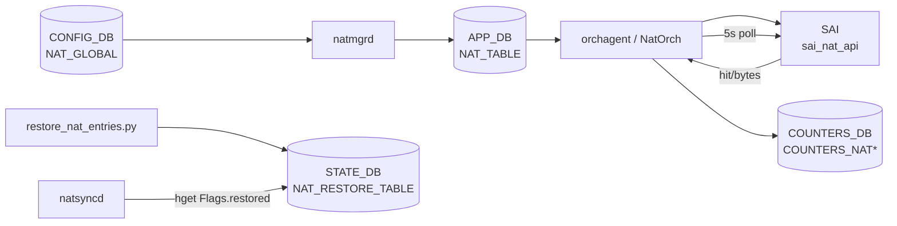

# NAT_RESTORE_TABLE / COUNTERS_NAT テーブル

## 概要

[NAT](../../reference/glossary.md#term-nat) 機能が管理する実行時データベースには 2 種類のテーブル群が存在する。

1. **`STATE_DB:NAT_RESTORE_TABLE`** — [NAT](../../reference/glossary.md#term-nat) docker の warm reboot 復元スクリプト (`restore_nat_entries.py`) が conntrack エントリを kernel に書き戻した後にセットするフラグ。`natsyncd` がこのフラグを確認してから reconciliation を開始する[^1]。
2. **`COUNTERS_DB:COUNTERS_NAT*`** — `orchagent/NatOrch` が [SAI](../../reference/glossary.md#term-sai) から定期取得するパケット・バイト数カウンタ、およびエントリ数・タイムアウトなどのグローバル統計[^2]。

<!-- cdb-mermaid -->
### データフロー (自動生成)



!!! note "凡例"
    STATE_DB/COUNTERS_DB の書き込み経路を追加した図。通常の CONFIG → SAI パスは左側を参照。
<!-- /cdb-mermaid -->

## key 構造

```text
STATE_DB:NAT_RESTORE_TABLE|Flags

COUNTERS_DB:COUNTERS_NAT|<external_ip>
COUNTERS_DB:COUNTERS_NAPT|<proto>:<ip>:<port>
COUNTERS_DB:COUNTERS_TWICE_NAT|<src_ip>:<dst_ip>
COUNTERS_DB:COUNTERS_TWICE_NAPT|<proto>:<src_ip>:<src_port>:<dst_ip>:<dst_port>
COUNTERS_DB:COUNTERS_GLOBAL_NAT|Values
```

## 主要フィールド

### STATE_DB:NAT_RESTORE_TABLE

| フィールド | 型 | 値 | 書き込みタイミング |
|-----------|-----|-----|-------------------|
| `restored` | 文字列 | `"true"` | warm reboot 後、`restore_nat_entries.py` が conntrack 復元完了時 |

warm reboot なし (通常起動) では `NAT_RESTORE_TABLE|Flags` は**書き込まれない**。`natsyncd` は `hget("Flags", "restored", value)` が空文字列を返す場合に reconciliation なしで進む。

### COUNTERS_DB:COUNTERS_NAT

| キー形式 | フィールド | 型 | 初期値 | 説明 |
|---------|-----------|-----|--------|------|
| `<external_ip>` | `NAT_TRANSLATIONS_PKTS` | uint64 (文字列) | `"0"` | SAI から取得したパケット数 |
| `<external_ip>` | `NAT_TRANSLATIONS_BYTES` | uint64 (文字列) | `"0"` | SAI から取得したバイト数 |

初期値 `"0"` は SNAT/DNAT エントリが SAI に登録された直後に `updateNatCounters(ipAddr, 0, 0)` で書き込まれる (`natorch.cpp:789`)。

### COUNTERS_DB:COUNTERS_NAPT

| キー形式 | フィールド | 型 | 初期値 |
|---------|-----------|-----|--------|
| `<proto>:<ip>:<port>` (例: `TCP:10.0.0.1:1024`) | `NAT_TRANSLATIONS_PKTS` | uint64 (文字列) | `"0"` |
| 同上 | `NAT_TRANSLATIONS_BYTES` | uint64 (文字列) | `"0"` |

### COUNTERS_DB:COUNTERS_TWICE_NAT

| キー形式 | フィールド | 型 | 説明 |
|---------|-----------|-----|------|
| `<src_ip>:<dst_ip>` | `NAT_TRANSLATIONS_PKTS` | uint64 (文字列) | Twice NAT ペアのパケット数 |
| 同上 | `NAT_TRANSLATIONS_BYTES` | uint64 (文字列) | Twice NAT ペアのバイト数 |

### COUNTERS_DB:COUNTERS_TWICE_NAPT

| キー形式 | フィールド | 型 | 説明 |
|---------|-----------|-----|------|
| `<proto>:<src_ip>:<src_port>:<dst_ip>:<dst_port>` | `NAT_TRANSLATIONS_PKTS` | uint64 (文字列) | Twice NAPT のパケット数 |
| 同上 | `NAT_TRANSLATIONS_BYTES` | uint64 (文字列) | Twice NAPT のバイト数 |

### COUNTERS_DB:COUNTERS_GLOBAL_NAT

キー: `"Values"` (固定)

| フィールド | 型 | 初期値 | 更新タイミング | 説明 |
|-----------|-----|--------|---------------|------|
| `MAX_NAT_ENTRIES` | uint32 (文字列) | SAI query 値 (非対応時 `"0"`) | NatOrch 起動時のみ | プラットフォームが許容する最大 SNAT エントリ数 |
| `TIMEOUT` | uint32 (文字列) | `"600"` | NatOrch 起動時のみ | 非 TCP/UDP NAT タイムアウト秒 |
| `UDP_TIMEOUT` | uint32 (文字列) | `"300"` | NatOrch 起動時のみ | UDP NAT タイムアウト秒 |
| `TCP_TIMEOUT` | uint32 (文字列) | `"86400"` | NatOrch 起動時のみ | TCP NAT タイムアウト秒 |
| `SNAT_ENTRIES` | int (文字列) | `"0"` | SNAT エントリ追加/削除時 | 現在の SNAT エントリ総数 |
| `DNAT_ENTRIES` | int (文字列) | `"0"` | DNAT エントリ追加/削除時 | 現在の DNAT エントリ総数 |

## 制約

- `NAT_RESTORE_TABLE` は warm reboot / NAT warm restart が有効な場合のみ使用される。通常起動では存在しない。
- `COUNTERS_GLOBAL_NAT|Values.MAX_NAT_ENTRIES` = 0 の場合、`gIsNatSupported=false` となり NAT 機能が完全に無効化される。
- COUNTERS テーブルは `NAT_HITBIT_N_CNTRS_QUERY_PERIOD=5` 秒周期で更新される。リアルタイム値ではない。

## 購読者

- `natsyncd`: `STATE_DB:NAT_RESTORE_TABLE|Flags.restored` を warm start 中に参照し、`"true"` になってから [APPL_DB](../../reference/glossary.md#term-appl_db) との reconciliation を開始する。
- `orchagent / NatOrch`: SAI NAT カウンタを 5 秒周期でポーリングし `COUNTERS_DB:COUNTERS_NAT*` を更新する。`show nat statistics` はこのデータを表示する。

## 関連 CONFIG_DB / YANG / CLI

- 関連 [CONFIG_DB](../../reference/glossary.md#term-config_db): `NAT_GLOBAL`、`NAT_POOL`、`NAT_BINDINGS`
- 関連 CLI: `show nat statistics`、`show nat translations`
- 関連 [YANG](../../reference/glossary.md#term-yang): `sonic-nat`

<!-- ref-triangle:start -->

## 関連リファレンス

- CONFIG_DB: [`NAT_GLOBAL / NAT_POOL`](nat.md)
- CONFIG_DB: [`NAT_BINDINGS`](nat-bindings.md)
- CLI: [`config nat`](../cli/config-nat.md)

<!-- ref-triangle:end -->

## 引用元

[^1]: warm reboot 復元フラグ: `restore_nat_entries.py`. <https://github.com/sonic-net/sonic-buildimage/blob/9ea932ec2e18f35e58268ec2e4456b1d4afd65cd/dockers/docker-nat/restore_nat_entries.py>
[^2]: NAT カウンタ実装: `natorch.cpp`. <https://github.com/sonic-net/sonic-swss/blob/4305596156d70e9797e8a881b3d19b46de0bce0d/orchagent/natorch.cpp>

<!-- topics-back-ref -->
## 関連 Topics

- [Topics: NAT / DHCP Relay / Time-DNS Services](../../topics/16-nat-dhcp-dns/index.md)

<!-- /topics-back-ref -->

<!-- ops-hint -->
## 運用ヒント

### 確認コマンド

```bash
# NAT カウンタ統計
show nat statistics

# COUNTERS_DB を直接参照
sonic-db-cli COUNTERS_DB hgetall 'COUNTERS_GLOBAL_NAT|Values'
sonic-db-cli COUNTERS_DB hgetall 'COUNTERS_NAT|<external_ip>'

# warm reboot 復元フラグ確認
sonic-db-cli STATE_DB hgetall 'NAT_RESTORE_TABLE|Flags'
```

### warm reboot 時の動作

1. `restore_nat_entries.py` が `/var/warmboot/nat/nat_entries.dump` を読み込み kernel conntrack に復元
2. 復元完了後、`STATE_DB:NAT_RESTORE_TABLE|Flags.restored = "true"` をセット
3. `natsyncd` がフラグを確認し、APPL_DB と conntrack の差分 reconciliation を実行

### よくある誤操作

- `MAX_NAT_ENTRIES=0` の場合は NAT が機能しない。`gIsNatSupported` フラグが false になっておりプラットフォームが NAT をサポートしていない。
<!-- /ops-hint -->

<!-- cdb-exceptions -->
## 例外条件・特殊挙動

<!-- evidence: sonic-swss/orchagent/natorch.cpp NatOrch::NatOrch() / natsync.cpp -->

- **`MAX_NAT_ENTRIES=0` → NAT 無効化**: NatOrch コンストラクタで `SAI_SWITCH_ATTR_AVAILABLE_SNAT_ENTRY` の取得に失敗または 0 を返すと `gIsNatSupported=false` が設定される。`enableNatFeature()` 冒頭で `gIsNatSupported==false` → `SWSS_LOG_NOTICE + return` となり CONFIG_DB の `admin_mode=enabled` が無視される (`natorch.cpp:100-122, 2541-2544`)。
- **カウンタ更新タイミングの非同期性**: COUNTERS_NAT の値は最大 5 秒遅延する。`show nat statistics` の値はリアルタイムではない。
- **Static エントリのカウンタ**: `entry_type="static"` かつ `addedToHw=true` の場合、hit bit が定期的に SAI から取得され COUNTERS_NAT に反映される。ただし Static エントリはエージアウト対象外 (`checkIfNatEntryIsActive` は static を常に `active=1` として扱う, `natorch.cpp:4160-4163`)。
- **NAT_RESTORE_TABLE の不在が正常**: 通常起動では `NAT_RESTORE_TABLE|Flags` は存在しない。`natsyncd` の `hget` は空文字列を返し、reconciliation なしで通常動作に移行する。

<!-- /cdb-exceptions -->

<!-- value-behavior -->
## 値依存挙動マトリクス

<!-- evidence: sonic-swss/orchagent/natorch.cpp updateSnatCounters / updateDnatCounters / NatOrch constructor -->

| フィールド | 値 | 挙動 |
|-----------|-----|------|
| `STATE_DB:NAT_RESTORE_TABLE\|Flags.restored` | (存在しない) | natsyncd が reconciliation なしで通常動作 |
| `STATE_DB:NAT_RESTORE_TABLE\|Flags.restored` | `"true"` | natsyncd が APPL_DB ↔ conntrack の差分 reconciliation を実行 |
| `COUNTERS_GLOBAL_NAT\|Values.MAX_NAT_ENTRIES` | `"0"` | NAT 機能が gIsNatSupported=false により無効化される |
| `COUNTERS_GLOBAL_NAT\|Values.MAX_NAT_ENTRIES` | `"N"` (N>0) | NAT エントリが最大 N 件まで SAI に登録可能 |
| `COUNTERS_GLOBAL_NAT\|Values.SNAT_ENTRIES` | `"N"` | 現在アクティブな SNAT エントリ数 (SAI 登録済み) |
| `COUNTERS_GLOBAL_NAT\|Values.DNAT_ENTRIES` | `"N"` | 現在アクティブな DNAT エントリ数 (SAI 登録済み) |

<!-- /value-behavior -->

<!-- ordering -->
## 書込み順依存 (Phase B)

`NAT_RESTORE_TABLE` と `COUNTERS_DB:COUNTERS_NAT*` は互いに独立した書き手（`restore_nat_entries.py` / `NatOrch`）が管理する。ただし warm reboot 時は `restored` フラグの到達タイミングが `natsyncd` の reconciliation 開始を決定するため、フラグ書き込みの順序が重要になる。

### 検出された順序依存

| # | 依存関係 | 方向 | 緩和策 |
|---|----------|------|--------|
| 1 | `restore_nat_entries.py` が conntrack 復元完了 → `NAT_RESTORE_TABLE\|Flags.restored = "true"` 書込み → `natsyncd` が reconciliation 開始 | **強制先行**（フラグなしでは natsyncd は reconciliation をスキップ） | 通常起動ではフラグが存在しないため reconciliation そのものが発生しない |
| 2 | `NatOrch` コンストラクタ完了 → `COUNTERS_GLOBAL_NAT\|Values` 書込み | 1 回限り（起動時に即時書き込み） | orchestrator 起動前は `COUNTERS_GLOBAL_NAT` エントリが存在しない |
| 3 | SAI エントリ登録成功 → `COUNTERS_NAT\|<ip>` / `COUNTERS_NAPT\|<proto:ip:port>` 初期値 `"0"` 書込み | SAI 登録直後（`updateNatCounters(..., 0, 0)`） | `admin_mode = "disabled"` の間は SAI 登録が起きないためカウンタエントリも存在しない |
| 4 | `NAT_GLOBAL_TABLE.admin_mode = "enabled"` → `m_natQueryTimer` 起動 → 5 秒周期カウンタポーリング開始 | enable 後に初回ポーリング | disable 中はタイマーが停止しカウンタは更新されない |
| 5 | warm reboot で `natsyncd` が reconciliation 完了 → APPL_DB と conntrack の差分更新 → SAI エントリ登録 → `COUNTERS_NAT*` 書込み | reconciliation 完了後に逐次書込み | 通常起動では reconciliation がないため APPL_DB 受信の都度即時 |
| 6 | `COUNTERS_GLOBAL_NAT\|Values.MAX_NAT_ENTRIES` = 0 → `gIsNatSupported = false` → `enableNatFeature()` が即時 return | NatOrch コンストラクタ時の SAI クエリ結果で固定 | カウンタキーは書かれるが NAT エントリは SAI に降りない |

### 主要な制約詳細

**warm reboot 時のフラグ先行要件 (依存 #1)**: `natsyncd` は起動後 `isNatRestoreDone()` (`natsync.cpp:96-108`) を周期的に呼び、`STATE_DB:NAT_RESTORE_TABLE|Flags.restored == "true"` を確認してから reconciliation を開始する。`restore_nat_entries.py` は `/var/warmboot/nat/nat_entries.dump` から conntrack を復元した後にこのフラグをセットする。フラグがセットされる前に `natsyncd` が APPL_DB を更新しても reconciliation 処理に乗らないため、データの整合性がとれない可能性がある。通常起動（warm start 無効）では `hget` が空文字列を返し、`isNatRestoreDone()` は `false` を返すが、natsyncd は warm start フラグを確認したうえで reconciliation をスキップして通常動作に移行する（evidence: `natsync.cpp:96-108`）。

**COUNTERS_GLOBAL_NAT の起動時 1 回書込み (依存 #2)**: `NatOrch::NatOrch()` コンストラクタは `SAI_SWITCH_ATTR_AVAILABLE_SNAT_ENTRY` をクエリして `MAX_NAT_ENTRIES` を決定し、`COUNTERS_GLOBAL_NAT|Values` に `MAX_NAT_ENTRIES` / `TIMEOUT` / `UDP_TIMEOUT` / `TCP_TIMEOUT` の 4 フィールドを 1 度だけ書き込む（evidence: `natorch.cpp:108-134`）。その後 CONFIG_DB の `NAT_GLOBAL.nat_timeout` が変更されても `COUNTERS_GLOBAL_NAT` の TIMEOUT フィールドは更新されない。このためタイムアウト表示の出所は起動時の固定値となる。

**カウンタポーリングと enable 状態の依存 (依存 #4)**: `m_natQueryTimer` は `enableNatFeature()` (`natorch.cpp:2565`) で開始され、`disableNatFeature()` (`natorch.cpp:2602`) で停止する。タイマー発火ごとに `queryCounters()` が `m_natEntries` / `m_naptEntries` を走査して SAI から hit count を取得し `COUNTERS_NAT*` を更新する（evidence: `natorch.cpp:3099-3115`）。`admin_mode = "disabled"` の間は timer が停止しているため、`COUNTERS_NAT*` の値は最後の disable 時点で固定される。

<!-- /ordering -->

<!-- cross-refs -->
## 暗黙参照テーブル (Phase C)

`STATE_DB:NAT_RESTORE_TABLE` は `restore_nat_entries.py` が唯一の書き手であり、`natsyncd` は読み手として warm reboot 時のみ参照する。`COUNTERS_DB:COUNTERS_NAT*` は `NatOrch` が唯一の書き手であり、`show nat statistics` / `config nat` CLI が読み手となる。

| 参照先テーブル / リソース | 参照方向 | 条件 | 参照元 evidence |
|--------------------------|---------|------|----------------|
| `NAT_GLOBAL_TABLE` (APPL_DB) `.admin_mode` | SET トリガ → `enableNatFeature()` / `disableNatFeature()` 呼び出し | 常時。`admin_mode=enabled` のとき `m_natQueryTimer` が開始され `COUNTERS_NAT*` の 5 秒周期更新が開始される | `natorch.cpp` L3061–3064, L2534–2567 (`enableNatFeature`), L2590–2602 (`disableNatFeature`) |
| `NAT_TABLE` / `NAPT_TABLE` / `NAT_TWICE_TABLE` / `NAPT_TWICE_TABLE` (APPL_DB) | キー転写 + SAI 登録トリガ | SAI 登録成功直後。APPL_DB エントリのキー (IP / プロトコル:IP:ポート) が `COUNTERS_NAT\|<ip>` / `COUNTERS_NAPT\|<proto:ip:port>` キーに転写され、初期値 `"0"` が書かれる | `natorch.cpp` L789 (`updateNatCounters(ipAddr, 0, 0)`), L1322 |
| SAI Switch attribute `SAI_SWITCH_ATTR_AVAILABLE_SNAT_ENTRY` | SAI クエリ → `COUNTERS_GLOBAL_NAT\|Values.MAX_NAT_ENTRIES` 書込み | 起動時 1 回。クエリ失敗 / 0 返却時は `gIsNatSupported=false` → NAT 機能完全無効化 | `natorch.cpp` L108–130 (NatOrch コンストラクタ) |
| `restore_nat_entries.py` (sonic-buildimage) | 書き手 → `STATE_DB:NAT_RESTORE_TABLE\|Flags.restored = "true"` | warm reboot 時のみ。`/var/warmboot/nat/nat_entries.dump` からの conntrack 復元完了後にフラグ書込み | `restore_nat_entries.py` L49–52 |
| `natsyncd` (`isNatRestoreDone()`) | 読み手 → `STATE_DB:NAT_RESTORE_TABLE\|Flags.restored` | warm start 進行中のみ。`"true"` を確認してから APPL_DB reconciliation 開始 | `natsync.cpp` L96–108, `natsyncd.cpp` L48 |
| `scripts/natshow` (sonic-utilities) | 読み手 → `COUNTERS_GLOBAL_NAT:Values` / `COUNTERS_NAT:<ip>` | `show nat statistics` / `show nat translations` コマンド実行時 | `natshow` L93–95, L217–234 |
| `config/nat.py` (sonic-utilities) | 読み手 → `COUNTERS_GLOBAL_NAT:Values.SNAT_ENTRIES` / `MAX_NAT_ENTRIES` | `config nat add static` 等の CLI でエントリ数上限チェックと統計表示に使用 | `nat.py` L290–295, L382–387, L475–480 |

!!! note "STATE_DB / COUNTERS_DB の書き手は単一プロセス"
    `STATE_DB:NAT_RESTORE_TABLE` の書き手は `restore_nat_entries.py` のみ。`COUNTERS_DB:COUNTERS_NAT*` の書き手は `NatOrch` のみ。他プロセスから書き込まれることはなく、`show nat` 系 CLI はすべて読み取り専用。

!!! note "`COUNTERS_GLOBAL_NAT|Values` の静的フィールドと動的フィールド"
    `MAX_NAT_ENTRIES` / `TIMEOUT` / `UDP_TIMEOUT` / `TCP_TIMEOUT` の 4 フィールドは NatOrch 起動時に 1 回だけ書かれ、以降は更新されない（`natorch.cpp:108-134`）。`SNAT_ENTRIES` / `DNAT_ENTRIES` は SAI へのエントリ追加/削除のたびに `updateSnatCounters()` / `updateDnatCounters()` で随時更新される。

<!-- /cross-refs -->

<!-- failure -->
## 失敗挙動 (Phase D)

`NAT_RESTORE_TABLE` と `COUNTERS_DB:COUNTERS_NAT*` にまたがる失敗パターンを以下に示す。

### 失敗パターン一覧

| 失敗ケース | 発生箇所 | 挙動 | COUNTERS/STATE への影響 | retry |
|---|---|---|---|---|
| `SAI_SWITCH_ATTR_AVAILABLE_SNAT_ENTRY` 取得失敗 | `NatOrch::NatOrch()` L114-118 | `SWSS_LOG_NOTICE` 出力、`maxAllowedSNatEntries=0` のまま `COUNTERS_GLOBAL_NAT\|Values.MAX_NAT_ENTRIES="0"` を書き込む | `gIsNatSupported` は呼び出し側で `MAX_NAT_ENTRIES==0` の場合に `false` となり NAT 機能全体が無効化される | なし（起動時 1 回限り） |
| `sai_nat_api->create_nat_entry()` 失敗 (SNAT/DNAT) | `addDNatEntry()` L773-783 / `addSNatEntry()` L1307-1315 など | `SWSS_LOG_ERROR` + `parseHandleSaiStatusFailure()` 呼び出し; `addedToHw=false` のまま | SAI 登録直後に書かれるはずの `COUNTERS_NAT\|<ip>` / `COUNTERS_NAPT\|<proto:ip:port>` 初期値 `"0"` が書かれない | `task_need_retry` 返却時は Consumer 再キュー; `task_failed` 時は erase |
| `enableNatFeature()` の `SAI_SWITCH_ATTR_NAT_ENABLE` set 失敗 | `enableNatFeature()` L2557-2562 | `SWSS_LOG_ERROR` + `handleSaiSetStatus()` 呼び出し。処理は続行し `m_natQueryTimer->start()` は実行される | COUNTERS_NAT タイマーは起動するが実際の NAT 転送が HW でできない状態になる | なし（エラーログのみ） |
| `restore_nat_entries.py` が conntrack 復元中に例外発生 | `main()` の `try/except` ブロック L88-91 | `logger.log_error()` 出力後 `sys.exit(1)` でスクリプト終了 | `set_statedb_nat_restore_done()` が呼ばれないため `STATE_DB:NAT_RESTORE_TABLE\|Flags.restored` がセットされない。`natsyncd` は warm reboot 時に `isNatRestoreDone()` が `false` を返し続け reconciliation を開始できない | なし（スクリプト再起動は supervisord 依存） |
| `gIsNatSupported == false` で `enableNatFeature()` 呼び出し | `enableNatFeature()` L2541-2545 | `SWSS_LOG_NOTICE("NAT Feature is not supported in this Platform")` + 即時 `return` | `admin_mode = "enabled"` がセットされず、`m_natQueryTimer` が起動しないため `COUNTERS_NAT*` は更新されない | なし |
| `disableNatFeature()` の `SAI_SWITCH_ATTR_NAT_ENABLE` set 失敗 | `disableNatFeature()` L2594-2599 | `SWSS_LOG_ERROR` + `handleSaiSetStatus()` 呼び出し。処理は続行し `m_natQueryTimer->stop()` は実行される | タイマー停止により以降のカウンタ更新は停止する | なし（エラーログのみ） |

### 主要な制約詳細

**`restore_nat_entries.py` 例外時の reconciliation 停止 (warm reboot 失敗の代表ケース)**: スクリプトが `nat_entries.dump` ファイルを開けない・`conntrack` コマンドが失敗するなどの例外をキャッチすると `sys.exit(1)` で終了する（evidence: `restore_nat_entries.py:88-91`）。この場合 `set_statedb_nat_restore_done()` が呼ばれないため `STATE_DB:NAT_RESTORE_TABLE|Flags.restored` は書き込まれない。`natsyncd` の `isNatRestoreDone()` (`natsync.cpp:96-108`) は `"true"` を返さないため、warm reboot 中に reconciliation フェーズへ進めず APPL_DB と conntrack の差分更新が実行されない。supervisord がスクリプトを再起動しない限り、フラグは永遠にセットされない。

**SAI `create_nat_entry` 失敗時のカウンタ欠落**: `addDNatEntry()` / `addSNatEntry()` 等の SAI エントリ作成関数が失敗した場合、成功パスの直後にある `updateNatCounters(ip_address, 0, 0)` (`natorch.cpp:789`) が実行されないため `COUNTERS_NAT|<ip>` エントリが `COUNTERS_DB` に作成されない。`show nat statistics` で当該 IP のカウンタが表示されない状態が続く。`parseHandleSaiStatusFailure` が `task_need_retry` を返した場合は Consumer により再キューされ、次のイテレーションで再試行される（evidence: `natorch.cpp:773-789`, `natorch.cpp:1307-1322`）。

**`MAX_NAT_ENTRIES=0` による機能全無効化**: NatOrch コンストラクタで `SAI_SWITCH_ATTR_AVAILABLE_SNAT_ENTRY` の取得に失敗または 0 を返した場合、`maxAllowedSNatEntries=0` のまま `COUNTERS_GLOBAL_NAT|Values.MAX_NAT_ENTRIES="0"` が書き込まれる。後続で `enableNatFeature()` が呼ばれると `gIsNatSupported==false` を確認して即時 return し、SAI NAT 有効化・タイマー起動・エントリ追加のいずれも行われない。COUNTERS_NAT テーブル自体は書き込み先として存在するが、タイマーが起動しないため 5 秒周期の hit count 更新も発生しない（evidence: `natorch.cpp:107-135`, `natorch.cpp:2541-2545`）。

<!-- /failure -->

<!-- constants -->
## ハードコード定数 (Phase E)

`NAT_RESTORE_TABLE` / `COUNTERS_DB:COUNTERS_NAT*` の動作を支配する、CONFIG_DB・YANG の外側に存在するコードレベルのハードコード定数一覧。出典は `sonic-swss/orchagent/natorch.h` および `sonic-swss/cfgmgr/natmgr.h`。

### カウンタポーリング周期

| 定数名 | 値 | 用途 | ソース |
|-------|----|------|--------|
| `NAT_HITBIT_N_CNTRS_QUERY_PERIOD` | `5` 秒 | `m_natQueryTimer` の発火周期。`queryCounters()` が 5 秒ごとに `COUNTERS_NAT*` を更新する | `natorch.h:37` |
| `NAT_HITBIT_QUERY_MULTIPLE` | `6` | hit bit クエリ (`queryHitBits()`) の実行間隔は `5 × 6 = 30 秒`。カウンタ更新 (5 秒) と hit bit 確認 (30 秒) は別周期 | `natorch.h:39` |
| `NAT_CONNTRACK_TIMEOUT_PERIOD` | `86400` 秒 (1 日) | `m_natTimeoutTimer` の発火周期。conntrack エントリのタイムアウトチェック周期 | `natorch.h:38` |

### タイムアウト定数 (CONFIG_DB との対応)

以下の定数は CONFIG_DB の `NAT_GLOBAL` テーブルで設定可能な値の範囲と起動時デフォルトを定義する。`natmgr.h` で定義され、`natmgr.cpp` コンストラクタおよび `NatOrch::NatOrch()` でそのまま使用される。

| 定数名 | 値 | CONFIG_DB フィールド | ソース |
|-------|----|-------------------|--------|
| `NAT_TIMEOUT_DEFAULT` | `600` 秒 | `NAT_GLOBAL.nat_timeout` のデフォルト | `natmgr.h:64` |
| `NAT_TIMEOUT_MIN` | `300` 秒 | `nat_timeout` の許容下限 | `natmgr.h:62` |
| `NAT_TIMEOUT_MAX` | `432000` 秒 (5 日) | `nat_timeout` の許容上限 | `natmgr.h:63` |
| `NAT_TCP_TIMEOUT_DEFAULT` | `86400` 秒 (1 日) | `NAT_GLOBAL.nat_tcp_timeout` のデフォルト | `natmgr.h:69` |
| `NAT_TCP_TIMEOUT_MIN` | `300` 秒 | `nat_tcp_timeout` の許容下限 | `natmgr.h:67` |
| `NAT_TCP_TIMEOUT_MAX` | `432000` 秒 (5 日) | `nat_tcp_timeout` の許容上限 | `natmgr.h:68` |
| `NAT_UDP_TIMEOUT_DEFAULT` | `300` 秒 | `NAT_GLOBAL.nat_udp_timeout` のデフォルト | `natmgr.h:73` |
| `NAT_UDP_TIMEOUT_MIN` | `120` 秒 | `nat_udp_timeout` の許容下限 | `natmgr.h:71` |
| `NAT_UDP_TIMEOUT_MAX` | `600` 秒 | `nat_udp_timeout` の許容上限 | `natmgr.h:72` |
| `NAT_ENTRY_REFRESH_PERIOD` | `86400` 秒 (1 日) | dynamic NAT エントリの conntrack リフレッシュ周期 | `natmgr.h:125` |

!!! note "COUNTERS_GLOBAL_NAT への書き込みと定数の関係"
    `NatOrch::NatOrch()` は起動時に `NAT_TIMEOUT_DEFAULT` (`600`)、`NAT_UDP_TIMEOUT_DEFAULT` (`300`)、`NAT_TCP_TIMEOUT_DEFAULT` (`86400`) をそのまま `COUNTERS_GLOBAL_NAT|Values` の `TIMEOUT`/`UDP_TIMEOUT`/`TCP_TIMEOUT` フィールドに書き込む (`natorch.cpp:128-130`)。その後 CONFIG_DB の `NAT_GLOBAL` が変更されても `COUNTERS_GLOBAL_NAT` のこれらフィールドは更新されない（`natmgr.cpp` の `enableNatFeature()` 経由で `APPL_DB:NAT_GLOBAL_TABLE` には書かれるが、`COUNTERS_GLOBAL_NAT` は別テーブル）。

<!-- /constants -->

<!-- side-effects -->
## 副次 DB 書込 (Phase F)

<!-- evidence: sonic-buildimage/dockers/docker-nat/restore_nat_entries.py L49-52 / sonic-swss/orchagent/natorch.cpp NatOrch::NatOrch() L108-138 / enableNatFeature() L2534-2580 / disableNatFeature() L2583-2627 / cleanupAppDbEntries() L2457-2532 -->

`NAT_RESTORE_TABLE` および `COUNTERS_NAT*` テーブルへの書込みは 2 つの独立した書き手（`restore_nat_entries.py` と `NatOrch`）から発生する。それぞれの書込み経路で発生する副次的な DB / システム操作を以下に示す。

| # | 書込先 | テーブル / キー | 内容 | 発火条件 |
|---|--------|----------------|------|---------|
| 1 | STATE_DB | `NAT_RESTORE_TABLE\|Flags.restored` | `"true"` (文字列) | warm restart 時のみ: `restore_nat_entries.py` が conntrack 復元完了後に書込む (`restore_nat_entries.py:51`) |
| 2 | COUNTERS_DB | `COUNTERS_GLOBAL_NAT\|Values` (4 フィールド) | `MAX_NAT_ENTRIES` / `TIMEOUT` / `UDP_TIMEOUT` / `TCP_TIMEOUT` 初期値 | orchagent 起動時 1 回のみ。CONFIG_DB 変更では再書込みされない (`natorch.cpp:127-138`) |
| 3 | SAI / ASIC_DB | `SAI_SWITCH_ATTR_NAT_ENABLE` | `true` | `admin_mode=enabled` 受信時に `enableNatFeature()` が発行 (`natorch.cpp:2553-2560`) |
| 4 | COUNTERS_DB | `COUNTERS_NAT*\|<key>` 各エントリ | `NAT_TRANSLATIONS_PKTS/BYTES="0"` (初期値) | `enableNatFeature()` → `addAllNatEntries()` で SAI 登録成功直後に書込む (`natorch.cpp:789, 873`) |
| 5 | SAI / ASIC_DB | `SAI_SWITCH_ATTR_NAT_ENABLE` | `false` | `admin_mode=disabled` 受信時に `disableNatFeature()` が発行。COUNTERS_DB への削除は行わない (`natorch.cpp:2589-2596`) |
| 6 | APPL_DB + COUNTERS_DB | `NAT_TABLE*` 全エントリ + `COUNTERS_NAT*` 全エントリ | 全削除 | natorch docker 停止時の `NAT_DB_CLEANUP_NOTIFICATION` 通知受信 → `cleanupAppDbEntries()` (`natorch.cpp:4474-4478`) |

### warm restart 経路の副次書込み詳細 (書込み #1)

`restore_nat_entries.py` は NAT warm restart が**有効な起動時のみ**実行される。処理シーケンス:

1. `/var/warmboot/nat/nat_entries.dump` から NAT エントリ一覧を読み込む
2. kernel conntrack テーブルへ各エントリを `/usr/sbin/conntrack -I` で復元（非 Redis 操作）
3. 全エントリ復元完了後に `STATE_DB:NAT_RESTORE_TABLE|Flags.restored = "true"` を書込む
4. `natsyncd` の `isNatRestoreDone()` ポーリングがフラグを検出し reconciliation フェーズへ移行

通常起動では `restore_nat_entries.py` は実行されないため STATE_DB に `NAT_RESTORE_TABLE|Flags` は**書き込まれない**。`natsyncd` は `hget` が空文字列を返すケースを正常として扱い reconciliation なしで動作する (`natsync.cpp:96-108`)。

### orchagent 停止時の全カウンタ削除 (書込み #6)

natorch docker 停止シグナルで APPL_DB `FLUSHNATSTATISTICS` / `NAT_DB_CLEANUP_NOTIFICATION` 通知が届くと `cleanupAppDbEntries()` が全 NAT エントリを APPL_DB から削除し、対応する `COUNTERS_NAT*` エントリを `deleteNatCounters()` で COUNTERS_DB から削除する。docker 再起動後は `admin_mode=enabled` の受信 → `addAllNatEntries()` 呼び出しまで COUNTERS_NAT* エントリが**存在しない**状態になる点に注意。

### 副次書込みが発生しないケース

`disableNatFeature()` (`admin_mode=disabled`) では SAI への無効化のみ行われ、COUNTERS_DB の `COUNTERS_NAT*` エントリは**削除されない**。disabled 状態でも `show nat statistics` はキャッシュ値を表示し続ける。

> **証跡**: `restore_nat_entries.py:49-52` (STATE_DB 書込み), `natorch.cpp:108-138` (コンストラクタ初期化), `natorch.cpp:2534-2580` (enableNatFeature), `natorch.cpp:2583-2627` (disableNatFeature), `natorch.cpp:2457-2532` (cleanupAppDbEntries), `natorch.cpp:4474-4478` (NAT_DB_CLEANUP_NOTIFICATION dispatch), `natorch.cpp:789,873` (updateNatCounters 初期値書込み), `natsyncd.cpp:48-62` (isNatRestoreDone ポーリングループ); 詳細スキャン結果は `meta/_intermediate/cdb-flow/nat-state-side-effects.md` を参照。

<!-- /side-effects -->

<!-- defaults -->
## フィールド暗黙デフォルト (Phase A — コード由来)

YANG 定義外の実行時テーブルのためコード hardcode 値のみ。

| フィールド | テーブル | 初期値 | ソース |
|-----------|---------|--------|--------|
| `NAT_TRANSLATIONS_PKTS` | `COUNTERS_NAT` / `COUNTERS_NAPT` 各エントリ | `"0"` | `natorch.cpp:789` (`updateNatCounters(ipAddr, 0, 0)`) |
| `NAT_TRANSLATIONS_BYTES` | `COUNTERS_NAT` / `COUNTERS_NAPT` 各エントリ | `"0"` | `natorch.cpp:789` |
| `MAX_NAT_ENTRIES` | `COUNTERS_GLOBAL_NAT\|Values` | SAI 問い合わせ値 (失敗時 `"0"`) | `natorch.cpp:127` |
| `TIMEOUT` | `COUNTERS_GLOBAL_NAT\|Values` | `"600"` | `natorch.cpp:128` (= `NAT_TIMEOUT_DEFAULT`) |
| `UDP_TIMEOUT` | `COUNTERS_GLOBAL_NAT\|Values` | `"300"` | `natorch.cpp:129` (= `NAT_UDP_TIMEOUT_DEFAULT`) |
| `TCP_TIMEOUT` | `COUNTERS_GLOBAL_NAT\|Values` | `"86400"` | `natorch.cpp:130` (= `NAT_TCP_TIMEOUT_DEFAULT`) |
| `SNAT_ENTRIES` | `COUNTERS_GLOBAL_NAT\|Values` | `"0"` | `natorch.cpp:76,4574` (`totalSnatEntries=0` 初期化) |
| `DNAT_ENTRIES` | `COUNTERS_GLOBAL_NAT\|Values` | `"0"` | `natorch.cpp:76,4585` (`totalDnatEntries=0` 初期化) |
| `restored` | `STATE_DB:NAT_RESTORE_TABLE\|Flags` | (warm reboot 時のみ書き込まれる; 通常起動では存在しない) | `restore_nat_entries.py:51` |

### COUNTERS_GLOBAL_NAT の TIMEOUT フィールドと CONFIG_DB の乖離

`COUNTERS_GLOBAL_NAT|Values` の `TIMEOUT`/`TCP_TIMEOUT`/`UDP_TIMEOUT` フィールドは NatOrch 起動時に一度だけ書き込まれ、その後 CONFIG_DB の `NAT_GLOBAL.nat_timeout` が変更されても**更新されない**。`show nat statistics` の timeout 表示は起動時の初期値を反映したものになる可能性がある。実際のタイムアウト値は `show nat config globalvalues` で確認すること。

<!-- /defaults -->
