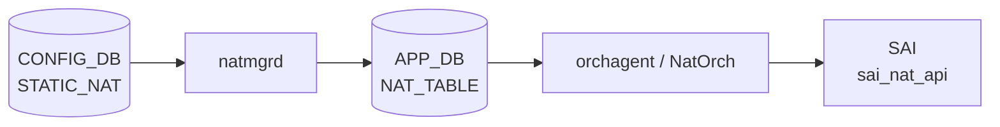

# STATIC_NAT テーブル

## 概要

`STATIC_NAT` は global IP と local IP を 1:1 静的にマッピングする [CONFIG_DB](../../reference/glossary.md#term-config_db) テーブル[^1]。`natmgrd` (`doStaticNatTask`) がエントリを解析し、kernel iptables ルールと [APPL_DB](../../reference/glossary.md#term-appl_db) NAT テーブルへ反映する。[YANG](../../reference/glossary.md#term-yang) モジュール `sonic-nat` 内の `STATIC_NAT_LIST` として定義される。`nat_type` のデフォルトは `"dnat"` で、`NAT_BINDINGS.nat_type` のデフォルト `"snat"` と逆方向である点に注意。

<!-- cdb-mermaid -->
### データフロー (自動生成)



!!! note "凡例"
    CONFIG_DB から SAI までの典型経路を `docs/reference/config-db-orch-map.md` から機械生成したミニ図。詳細・例外は本ページ本文と対応表を参照。
<!-- /cdb-mermaid -->

## key 構造

```text
STATIC_NAT|<global_ip>
```

`global_ip` は unicast IPv4 アドレス (`inet:ipv4-address`)。Zero / Broadcast / Loopback / Multicast / Reserved アドレスは `natmgr` が拒否する。

## 主要フィールド

| フィールド | 型 | 必須 | デフォルト | 説明 |
|-----------|----|------|-----------|------|
| `local_ip` | `inet:ipv4-address` | yes | — | 変換先ローカル IP アドレス |
| `nat_type` | enum `snat` / `dnat` | no | `"dnat"` | NAT 種別。省略時は DNAT エントリとして処理される |
| `twice_nat_id` | uint16 1..9999 | no | `""` → Single NAT | Twice NAT 用 ID。省略時は Single NAT |

<!-- defaults -->
## フィールド暗黙デフォルト (Phase A — コード由来)

YANG default とコード hardcode の両方を確認した結果。

| フィールド | YANG default | コード hardcode | fallback 源 |
|-----------|-------------|----------------|------------|
| `nat_type` | `dnat` | `DNAT_NAT_TYPE = "dnat"` | `natmgr.cpp:6088-6090` (`nat_type.empty()` → DNAT_NAT_TYPE) |
| `twice_nat_id` | なし (省略可) | `EMPTY_STRING = ""` | `natmgr.cpp:5825` 変数初期化 / `natmgr.cpp:6096` キャッシュ格納 |

`nat_type` は YANG default とコード実装が一致。`twice_nat_id` は YANG にデフォルト指定がなく、省略時は `""` として Single NAT モードで動作する。

**`nat_type` が空の場合の natmgr 動作**:

```cpp
// natmgr.cpp:6088-6095
if (nat_type.empty())
{
    m_staticNatEntry[key].nat_type = DNAT_NAT_TYPE;  // "dnat"
}
else
{
    m_staticNatEntry[key].nat_type = nat_type;
}
```

**`twice_nat_id` 省略時の Single NAT 分岐**:

```cpp
// natmgr.cpp:1579-1590
if (m_staticNatEntry[key].twice_nat_id.empty())
{
    // Single NAT: addStaticSingleNatEntry()
}
else
{
    // Twice NAT: addStaticTwiceNatEntry()
}
```

**`NAT_BINDINGS` との nat_type デフォルト非対称**:

- `STATIC_NAT.nat_type`: YANG `default dnat` (sonic-nat.yang L141) / natmgr.cpp:6090 `DNAT_NAT_TYPE`
- `NAT_BINDINGS.nat_type`: YANG `default snat` (sonic-nat.yang L280) / natmgr.cpp:7058 `SNAT_NAT_TYPE`
- 省略時の動作がテーブルによって逆。STATIC_NAT を省略 → DNAT、NAT_BINDINGS を省略 → SNAT。
<!-- /defaults -->

## silent drop / discrepancy

<!-- evidence: sonic-swss/cfgmgr/natmgr.cpp doStaticNatTask L5810-6136 / sonic-utilities/config/nat.py add_basic L240-329 / sonic-nat.yang L117-155 -->

| フィールド / 条件 | 検出種別 | 挙動 | ソース |
|---|---|---|---|
| `local_ip` 欠落 | silent drop | `SWSS_LOG_ERROR("Invalid local_ip values, skipping %s")` + erase | `natmgr.cpp:5906` |
| `nat_type` 欠落 | 暗黙デフォルト | `DNAT_NAT_TYPE = "dnat"` にフォールバック | `natmgr.cpp:6088-6090` |
| `twice_nat_id` 欠落 | 暗黙デフォルト | `""` = Single NAT モード | `natmgr.cpp:5825, 6096` |
| `nat_type` が `snat`/`dnat` 以外 | silent drop | ERROR + erase | `natmgr.cpp:5954-5958` |
| `global_ip` が特殊アドレス (Zero/BC/Loop/MC/Reserved) | silent drop | ERROR + erase | `natmgr.cpp:5855-5861` |
| `local_ip` が特殊アドレス | silent drop | ERROR + erase | `natmgr.cpp:5944-5950` |
| `global_ip` が STATIC_NAPT エントリと重複 | silent drop | `"Global Ip overlaps with static NAPT entry"` + erase | `natmgr.cpp:6007-6011` |
| `global_ip` が NAT_POOL IP 範囲と重複 | silent drop | `"Global Ip overlaps with Dynamic Pool IP entry"` + erase | `natmgr.cpp:6052-6056` |
| 重複エントリ (同 key + 同 `local_ip`) | silent drop | `"Duplicate Static NAT and it's values, skipping"` + erase | `natmgr.cpp:6067` |
| 未知フィールド (`local_ip` / `nat_type` / `twice_nat_id` 以外) | silent drop | `nonValueFound=true` → ERROR + erase | `natmgr.cpp:5897-5933` |
| key size が 1 以外 | silent drop | ERROR + erase | `natmgr.cpp:5846` |

## 制約

- `local_ip`: unicast IPv4 のみ (同様のアドレスクラス制限)
- `nat_type`: `"snat"` または `"dnat"` のみ。それ以外は ERROR + erase。
- `twice_nat_id`: 1..9999 (YANG `range "1..9999"` / natmgr 両方で検証)
- 同一 `twice_nat_id` を持てるエントリ: 最大 2 件 (`STATIC_NAT` + `STATIC_NAPT` + `NAT_BINDINGS` 合計)
- エントリ数: CLI では `COUNTERS_DB:COUNTERS_GLOBAL_NAT:Values` の `SNAT_ENTRIES >= MAX_NAT_ENTRIES` でスキップ (`nat.py:298-300`)
- `NAT_GLOBAL.admin_mode = disabled` の状態ではエントリを受け付けるが ASIC に反映しない (キュー保持)

## 購読者

- `natmgrd` (`doStaticNatTask`): [CONFIG_DB](../../reference/glossary.md#term-config_db) の `STATIC_NAT` 変更を検知し、フィールドを解析してキャッシュ (`m_staticNatEntry`) に格納後、`addStaticNatEntry` / `removeStaticNatEntry` 経由で iptables ルールと [APPL_DB](../../reference/glossary.md#term-appl_db) `NAT_TABLE` を更新する。
- `orchagent / NatOrch`: [APPL_DB](../../reference/glossary.md#term-appl_db) の `NAT_TABLE` エントリを消費して [SAI](../../reference/glossary.md#term-sai) `sai_nat_api` NAT object を作成する。

## 関連 CONFIG_DB / YANG / CLI

- 関連 [CONFIG_DB](../../reference/glossary.md#term-config_db): `NAT_GLOBAL`、`NAT_POOL`、`NAT_BINDINGS`、`STATIC_NAPT`
- 関連 CLI: `config nat add static basic`、`config nat remove static basic`
- 関連 [YANG](../../reference/glossary.md#term-yang): `sonic-nat`

<!-- ref-triangle:start -->

## 関連リファレンス

- YANG: [`sonic-nat`](../yang/sonic-nat.md)
- CLI: [`config nat`](../cli/config-nat.md)
- CONFIG_DB: [`NAT_GLOBAL / NAT_POOL`](nat.md)
- CONFIG_DB: [`NAT_BINDINGS`](nat-bindings.md)

<!-- ref-triangle:end -->

## 引用元

[^1]: YANG 定義 + natmgr 実装: `sonic-nat.yang` / `sonic-swss/cfgmgr/natmgr.cpp`. <https://github.com/sonic-net/sonic-swss/blob/master/cfgmgr/natmgr.cpp>

<!-- ops-hint -->
## 運用ヒント

### 典型設定

```bash
# DNAT: 外部 IP 65.55.42.1 → 内部 10.0.0.1 (デフォルト nat_type=dnat)
config nat add static basic 65.55.42.1 10.0.0.1

# SNAT: 内部 10.0.0.1 → 外部 65.55.42.1
config nat add static basic 65.55.42.1 10.0.0.1 -nat_type snat

# Twice NAT
config nat add static basic 65.55.42.1 10.0.0.1 -twice_nat_id 100
```

### 確認コマンド

```bash
sonic-db-cli CONFIG_DB hgetall 'STATIC_NAT|65.55.42.1'
show nat config static
show nat translations
```

### よくある誤設定

- `NAT_GLOBAL.admin_mode` を `enabled` にせず STATIC_NAT だけ入れても NAT は動作しない。
- `nat_type` を省略すると `dnat` になる。`NAT_BINDINGS` の省略時 (`snat`) と逆であることに注意。
- `global_ip` と `local_ip` に同じ IP 帯を使うと NAPT / Dynamic Pool との重複チェックで拒否される。
<!-- /ops-hint -->

<!-- topics-back-ref -->
## 関連 Topics

- [Topics: NAT / DHCP Relay / Time-DNS Services](../../topics/16-nat-dhcp-dns/index.md)

<!-- /topics-back-ref -->
