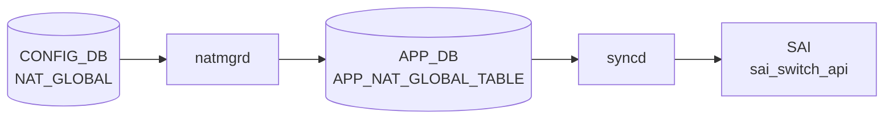

# STATIC_NAT テーブル

## 概要

`STATIC_NAT` は global IP と local IP を 1:1 静的にマッピングする [CONFIG_DB](../../reference/glossary.md#term-config_db) テーブル[^1]。`natmgrd` (`doStaticNatTask`) がエントリを解析し、kernel iptables ルールと [APPL_DB](../../reference/glossary.md#term-appl_db) [NAT](../../reference/glossary.md#term-nat) テーブルへ反映する。[YANG](../../reference/glossary.md#term-yang) モジュール `sonic-nat` 内の `STATIC_NAT_LIST` として定義される。`nat_type` のデフォルトは `"dnat"` で、`NAT_BINDINGS.nat_type` のデフォルト `"snat"` と逆方向である点に注意。

<!-- cdb-mermaid -->
### データフロー (自動生成)



!!! note "凡例"
    CONFIG_DB から SAI までの典型経路を `docs/reference/config-db-orch-map.md` から機械生成したミニ図。詳細・例外は本ページ本文と対応表を参照。
<!-- /cdb-mermaid -->

## key 構造

```text
STATIC_NAT|<global_ip>
```

`global_ip` は unicast IPv4 アドレス (`inet:ipv4-address`)。Zero / Broadcast / Loopback / Multicast / Reserved アドレスは `natmgr` が拒否する。

## 主要フィールド

| フィールド | 型 | 必須 | デフォルト | 説明 |
|-----------|----|------|-----------|------|
| `local_ip` | `inet:ipv4-address` | yes | — | 変換先ローカル IP アドレス |
| `nat_type` | enum `snat` / `dnat` | no | `"dnat"` | [NAT](../../reference/glossary.md#term-nat) 種別。省略時は DNAT エントリとして処理される |
| `twice_nat_id` | uint16 1..9999 | no | `""` → Single [NAT](../../reference/glossary.md#term-nat) | Twice NAT 用 ID。省略時は Single NAT |

<!-- defaults -->
## フィールド暗黙デフォルト (Phase A — コード由来)

[YANG](../../reference/glossary.md#term-yang) default とコード hardcode の両方を確認した結果。

| フィールド | YANG default | コード hardcode | fallback 源 |
|-----------|-------------|----------------|------------|
| `nat_type` | `dnat` | `DNAT_NAT_TYPE = "dnat"` | `natmgr.cpp:6088-6090` (`nat_type.empty()` → DNAT_NAT_TYPE) |
| `twice_nat_id` | なし (省略可) | `EMPTY_STRING = ""` | `natmgr.cpp:5825` 変数初期化 / `natmgr.cpp:6096` キャッシュ格納 |

`nat_type` は YANG default とコード実装が一致。`twice_nat_id` は YANG にデフォルト指定がなく、省略時は `""` として Single NAT モードで動作する。

**`nat_type` が空の場合の natmgr 動作**:

```cpp
// natmgr.cpp:6088-6095
if (nat_type.empty())
{
    m_staticNatEntry[key].nat_type = DNAT_NAT_TYPE;  // "dnat"
}
else
{
    m_staticNatEntry[key].nat_type = nat_type;
}
```

**`twice_nat_id` 省略時の Single NAT 分岐**:

```cpp
// natmgr.cpp:1579-1590
if (m_staticNatEntry[key].twice_nat_id.empty())
{
    // Single NAT: addStaticSingleNatEntry()
}
else
{
    // Twice NAT: addStaticTwiceNatEntry()
}
```

**`NAT_BINDINGS` との nat_type デフォルト非対称**:

- `STATIC_NAT.nat_type`: YANG `default dnat` (sonic-nat.yang L141) / natmgr.cpp:6090 `DNAT_NAT_TYPE`
- `NAT_BINDINGS.nat_type`: YANG `default snat` (sonic-nat.yang L280) / natmgr.cpp:7058 `SNAT_NAT_TYPE`
- 省略時の動作がテーブルによって逆。STATIC_NAT を省略 → DNAT、NAT_BINDINGS を省略 → SNAT。
<!-- /defaults -->

<!-- ordering -->
## 書込み順依存 (Phase B)

### 前提 1: NAT_GLOBAL.admin_mode が enabled 必須

`addStaticNatEntry()` (`natmgr.cpp:1557`) と `addStaticSingleNatEntry()` (`natmgr.cpp:2003`) の先頭で `isNatEnabled()` を呼ぶ。`isNatEnabled()` は `natAdminMode == ENABLED` のみ true (`natmgr.cpp:150-157`)。

`NAT_GLOBAL.admin_mode` がデフォルト `disabled` のままでは `addStaticNatEntry()` が即 return し、APPL_DB への書込みが行われない。STATIC_NAT エントリはキャッシュ (`m_staticNatEntry`) に保持され、`doNatGlobalTask()` で `admin_mode → enabled` に変わると `addStaticNatEntries()` が全キャッシュを再処理する。**エントリは失われないが APPL_DB 反映は遅延する**。

### 前提 2: DNAT エントリはインタフェース IP 設定が先行必須

`addStaticNatEntry()` (`natmgr.cpp:1564`) で `nat_type == DNAT` の場合のみ `getIpEnabledIntf()` を呼ぶ:

```cpp
// natmgr.cpp:1564-1569
if ((m_staticNatEntry[key].nat_type == DNAT_NAT_TYPE) and (!getIpEnabledIntf(key, interface)))
{
    SWSS_LOG_INFO("L3 Interface is not yet enabled for %s, skipping NAT entry addition to APPL_DB", key.c_str());
    return;
}
```

`getIpEnabledIntf()` は `m_natIpInterfaceInfo` を検索し、`global_ip` がいずれかのインタフェースのサブネット内に含まれるか確認する (`natmgr.cpp:236-254`)。`m_natIpInterfaceInfo` は `doNatIpInterfaceTask()` が `INTERFACE|<port>|<ip/prefix>` を受信し、かつ `STATE_DB:STATE_INTERFACE_TABLE:<key>` の ready チェックをパスした後に更新される (`natmgr.cpp:7593`)。インタフェースが ready になると `addStaticNatEntries()` がリアクティブに呼ばれキャッシュを再処理する (`natmgr.cpp:7640`)。

**SNAT エントリ** (`nat_type = snat`) は `getIpEnabledIntf()` チェックをスキップするため、インタフェース設定なしで APPL_DB に反映される。

### 安全な書込み順序

**DNAT エントリの場合**:

```
SET NAT_GLOBAL|Values               admin_mode=enabled        # NAT 有効化 (必須)
SET INTERFACE|Ethernet0|<global_ip>/24                        # インタフェース IP 割当 (DNAT 必須)
# STATE_DB:STATE_INTERFACE_TABLE:<Ethernet0> ready を待つ
SET STATIC_NAT|<global_ip>          local_ip=<local_ip> nat_type=dnat
```

**SNAT エントリの場合** (インタフェース設定不要):

```
SET NAT_GLOBAL|Values               admin_mode=enabled
SET STATIC_NAT|<global_ip>          local_ip=<local_ip> nat_type=snat
```

### 安全な DEL 順序

```
DEL STATIC_NAT|<global_ip>     # APPL_DB からも除去
# インタフェース削除は任意の順
```

| 依存関係 | 方向 | 緩和策 |
|----------|------|--------|
| `NAT_GLOBAL.admin_mode=enabled` → STATIC_NAT APPL_DB 書込み | 必須 | キャッシュ保持 → admin_mode 有効化で自動再処理 |
| `INTERFACE\|<port>\|<prefix>` + [STATE_DB](../../reference/glossary.md#term-state_db) ready → DNAT APPL_DB 書込み | 必須 (DNAT のみ) | キャッシュ保持 → インタフェース ready で自動再処理 |
| SNAT エントリ → インタフェース設定 | 不要 | `getIpEnabledIntf()` チェックなし |
| STATIC_NAPT との global_ip 重複排除 | 論理制約 | 重複時は後着がスキップ (APPL_DB 反映なし) |

> **スキャン証跡**: `addStaticNatEntry()` L1548-1590、`isNatEnabled()` L150-157、`getIpEnabledIntf()` L236-254、`doNatIpInterfaceTask()` L7377-7640、`addStaticSingleNatEntry()` L1992-2064 精読。
<!-- /ordering -->

<!-- cross-refs -->
## 暗黙参照テーブル (Phase C)

`doStaticNatTask()` → `addStaticNatEntry()` の処理において、YANG の leafref 定義を超えて実装上で参照される他テーブル・内部キャッシュを示す。

| 参照先テーブル / リソース | 参照方向 | 条件 | 参照元 evidence |
|--------------------------|---------|------|----------------|
| `NAT_GLOBAL\|Values.admin_mode` (CONFIG_DB) | 読み取り (ガード) | 常時。`natAdminMode == ENABLED` でなければ `addStaticNatEntry()` が即 return し APPL_DB に反映しない | `natmgr.cpp` L150–157 (`isNatEnabled()`), L1557–1560 |
| `STATE_INTERFACE_TABLE\|<port>\|<ip/prefix>` ([STATE_DB](../../reference/glossary.md#term-state_db)) | 読み取り (ガード) | `doNatIpInterfaceTask()` が `INTERFACE` の IP prefix エントリを受信する際に `isIntfStateOk()` を呼ぶ。ready でなければリトライキュー (it++) に戻る | `natmgr.cpp` L135–147 (`isIntfStateOk()`), L7593–7597 |
| `INTERFACE\|<port>\|<ip/prefix>` (CONFIG_DB) → `m_natIpInterfaceInfo` | 読み取り (ガード, DNAT のみ) | `getIpEnabledIntf()` が `m_natIpInterfaceInfo` を走査し、`global_ip` がいずれかのサブネットに含まれるか確認。含まれなければ APPL_DB 反映を保留 | `natmgr.cpp` L236–254 (`getIpEnabledIntf()`), L1564–1568 |
| `STATIC_NAPT\|<global_ip>\|<proto>\|<port>` (CONFIG_DB) → `m_staticNaptEntry` | 存在確認 (論理排他) | `addStaticNatEntry()` 内で `isMatchesWithStaticNapt()` を呼ぶ。同 `global_ip` の NAPT エントリが存在する場合は APPL_DB 反映を中断 (return) | `natmgr.cpp` L200–233 (`isMatchesWithStaticNapt()`), L1571–1575 |
| `NAT_POOL\|<pool_name>.ip_range` (CONFIG_DB) → `m_natPoolInfo` | 存在確認 (重複排除) | `doStaticNatTask()` の SET パス内で `m_natPoolInfo` 全体を走査し、`global_ip` が Dynamic Pool の IP 範囲と重複しないか確認。重複時はエントリを erase (DROP) | `natmgr.cpp` L6021–6056 |
| `STATIC_NAT\|<other_key>` (CONFIG_DB) → `m_staticNatEntry` | 読み取り (Twice NAT ペア探索) | `twice_nat_id` 非空の場合に `addStaticTwiceNatEntry()` が `m_staticNatEntry` 全体を走査し、同一 `twice_nat_id` で逆方向 (`nat_type` が異なる) エントリを探して APPL_DB に Twice NAT エントリを書く。ペアが揃うまで両エントリとも APPL_DB 未反映 | `natmgr.cpp` L2083–2168 (`addStaticTwiceNatEntry()`), L2100–2119 |
| `NAT_BINDINGS\|<name>` + `NAT_POOL\|<name>` → `m_natBindingInfo` + `m_natPoolInfo` | 読み取り (Twice NAT バインディング) | `addStaticTwiceNatEntry()` で STATIC_NAT 同士のペアが見つからない場合、`m_natBindingInfo` と対応する `m_natPoolInfo` を走査してダイナミック SNAT バインディングとの Twice NAT 接続を試みる | `natmgr.cpp` L2210–2263 |

!!! note "YANG leafref 非対応の参照"
    上記参照はいずれも YANG `sonic-nat` の leafref として定義されていない。`NAT_GLOBAL`・`INTERFACE`・`STATIC_NAPT`・`NAT_POOL` への依存は natmgr.cpp の実装コードによってのみ強制される暗黙の前提条件である。

<!-- /cross-refs -->

<!-- failure -->
## 失敗挙動 (Phase D)

STATIC_NAT エントリは CONFIG_DB → `natmgrd` → APPL_DB → `NatOrch` → [SAI](../../reference/glossary.md#term-sai) の 2 段階パイプラインで処理される。各段階での失敗パターンを以下に示す。

### 段階 1: CONFIG_DB → natmgrd (`doStaticNatTask`) の失敗パターン

| 失敗ケース | 発生箇所 | 挙動 | retry |
|---|---|---|---|
| `local_ip` フィールド欠落 | `natmgr.cpp:5902-5907` | `SWSS_LOG_ERROR` + `m_toSync.erase()` | なし（永久 DROP） |
| `nat_type` 値が `snat`/`dnat` 以外 | `natmgr.cpp:5954-5958` | `SWSS_LOG_ERROR` + `m_toSync.erase()` | なし |
| `global_ip` が特殊アドレス（Zero/BC/Loop/MC/Reserved） | `natmgr.cpp:5855-5861` | `SWSS_LOG_ERROR` + `m_toSync.erase()` | なし |
| `local_ip` が特殊アドレス | `natmgr.cpp:5944-5950` | `SWSS_LOG_ERROR` + `m_toSync.erase()` | なし |
| `global_ip` が `STATIC_NAPT` エントリと重複 | `natmgr.cpp:6007-6011` | `SWSS_LOG_ERROR` + `m_toSync.erase()` | なし |
| `global_ip` が `NAT_POOL` IP 範囲と重複 | `natmgr.cpp:6052-6056` | `SWSS_LOG_ERROR` + `m_toSync.erase()` | なし |
| 同一エントリ重複（key + `local_ip` が一致） | `natmgr.cpp:6067` | `SWSS_LOG_ERROR` + `m_toSync.erase()` | なし（重複は無視） |
| 未知フィールドあり (`nonValueFound=true`) | `natmgr.cpp:5897-5933` | `SWSS_LOG_ERROR` + `m_toSync.erase()` | なし |
| `NAT_GLOBAL.admin_mode != enabled` | `natmgr.cpp:1557-1560` (`isNatEnabled()`) | `addStaticNatEntry()` が即 return → APPL_DB 未反映 | admin_mode が `enabled` に変わると `addStaticNatEntries()` が自動再処理 |
| DNAT エントリで対応インタフェース IP 未設定 | `natmgr.cpp:1564-1568` (`getIpEnabledIntf()`) | `addStaticNatEntry()` が即 return → APPL_DB 未反映 | インタフェース ready 時に `doNatIpInterfaceTask()` が `addStaticNatEntries()` を呼び自動再処理 |
| iptables ルール追加失敗 | `natmgr.cpp` `addStaticSingleNatEntry()` | `SWSS_LOG_ERROR` のみ。APPL_DB への書き込みは先行済みで **取り消されない** | なし（iptables と APPL_DB が不整合のまま残る） |

**キャッシュ保持と自動回復**: `doStaticNatTask()` が erase せずに `addStaticNatEntry()` が単に return したケース（`admin_mode` / インタフェース未 ready）では、エントリは `m_staticNatEntry` キャッシュに保持される。条件が解消された時点で natmgr が自動的に `addStaticNatEntries()` を呼び出し、キャッシュ全体を再処理する（`natmgr.cpp:3040`, `7640`）。

### 段階 2: APPL_DB → NatOrch → SAI (`doNatTableTask` / `addNatEntry`) の失敗パターン

| 失敗ケース | 発生箇所 | 挙動 | retry |
|---|---|---|---|
| APPL_DB `NAT_TABLE` のキーサイズ != 1 | `natorch.cpp:2636-2640` | `SWSS_LOG_ERROR` + `m_toSync.erase()` | なし |
| 重複エントリ（`m_natEntries` に既存） | `natorch.cpp:1873-1880` | INFO ログのみ、`return true`（無視） | なし |
| dynamic SNAT エントリで `totalSnatEntries == maxAllowedSNatEntries` | `natorch.cpp:1886-1892` | `setTimeoutNotifier->send("AGEOUT-SINGLE-NAT")` を発行し `return true` | 間接的（ageout 後に再試行される可能性） |
| `isNatEnabled() == false`（[orchagent](../../reference/glossary.md#term-orchagent) 側の NAT 無効） | `natorch.cpp:1910-1915` | `SWSS_LOG_WARN` + `return true`（エントリはキャッシュに保持） | `doNatGlobalTableTask()` で `admin_mode = enabled` 受信時に `addHwDnatEntry()` / `addHwSnatEntry()` が自動呼出し |
| [SAI](../../reference/glossary.md#term-sai) `create_nat_entry` 失敗（ハードウェアエラー） | `natorch.cpp:774-786` (`addHwDnatEntry()`), `natorch.cpp:1307-1319` (`addHwSnatEntry()`) | `SWSS_LOG_ERROR` + `handleSaiCreateStatus()` + `parseHandleSaiStatusFailure()` → `return false` → `doNatTableTask()` で `it++`（保留） | SAI が解消されるまで無限 retry |
| 不明 op type | `natorch.cpp:2672-2675` | `SWSS_LOG_ERROR` + `m_toSync.erase()` | なし |

**SAI 失敗時の retry**: `addNatEntry()` が `false` を返すと `doNatTableTask()` は `it++`（erase せず保留）する（`natorch.cpp:2661-2663`）。次の consumer tick で再試行されるため、SAI の一時的なリソース枯渇は自然に回復する。ただし `m_natEntries` キャッシュには既にエントリが追加されているため、再 SET 時に `Duplicate` と判定されて `return true` となり erase される点に注意（二重追加は発生しない）。

### STATE_DB / エラー通知

NAT パスには [STATE_DB](../../reference/glossary.md#term-state_db) へのステータス書き込みはない。[orchagent](../../reference/glossary.md#term-orchagent) は `SWSS_LOG_ERROR` / `SWSS_LOG_WARN` で syslog にのみ記録する。`ERROR_TABLE` への書き込みも行われない。失敗の確認は syslog (`/var/log/syslog` の `natorch` / `natmgrd` エントリ) を参照すること。

> **証跡**: `natmgr.cpp:doStaticNatTask` L5813-6136、`addStaticNatEntry()` L1548-1590、`addStaticSingleNatEntry()` L1992-2064、`natorch.cpp:doNatTableTask` L2617-2681、`addNatEntry()` L1866-1937、`addHwDnatEntry()` L738-800、`addHwSnatEntry()` L1271-1330。
<!-- /failure -->

<!-- constants -->
## ハードコード定数 (Phase E)

<!-- evidence: meta/_intermediate/cdb-flow/nat-static-constants.md -->

`STATIC_NAT` エントリの処理に関与する、CONFIG_DB / YANG で管理されないハードコード定数の一覧。出典は `sonic-swss/cfgmgr/natmgr.h`。

### バリデーション定数

| 定数 | 値 | 用途 | ソース |
|------|----|------|--------|
| `STATIC_NAT_KEY_SIZE` | `1` | キーセグメント数。`keys.size() != 1` の場合 SWSS_LOG_ERROR + erase | `natmgr.h:33` |
| `TWICE_NAT_ID_MIN` | `1` | `twice_nat_id` の下限値。YANG `range "1..9999"` と一致 | `natmgr.h:40` |
| `TWICE_NAT_ID_MAX` | `9999` | `twice_nat_id` の上限値。YANG `range "1..9999"` と一致 | `natmgr.h:41` |
| `DNAT_NAT_TYPE` | `"dnat"` | `nat_type` 省略時のデフォルト文字列 | `natmgr.h:38` |
| `SNAT_NAT_TYPE` | `"snat"` | SNAT を示す文字列リテラル | `natmgr.h:37` |
| `EMPTY_STRING` | `""` | `twice_nat_id` 省略時の初期値 | `natmgr.h:113` |
| `NONE_STRING` | `"None"` | エントリ登録直後のインタフェース初期値 (`m_staticNatEntry[key].interface`) | `natmgr.h:114` |

### アドレス検証マクロ

`doStaticNatTask()` が `global_ip` および `local_ip` の有効性を検証するために使用する bit マスクマクロ。

| マクロ | ビット定義 | 用途 |
|--------|-----------|------|
| `IS_ZERO_ADDR(ipaddr)` | `ipaddr == 0` | ゼロアドレス拒否 (`natmgr.cpp:5855`) |
| `IS_BROADCAST_ADDR(ipaddr)` | `ipaddr == 0xFFFFFFFF` | ブロードキャスト拒否 |
| `IS_LOOPBACK_ADDR(ipaddr)` | `(ipaddr & 0xFF000000) == 0x7F000000` | 127.x.x.x 拒否 |
| `IS_MULTICAST_ADDR(ipaddr)` | `0xE0000000 <= ipaddr <= 0xEFFFFFFF` | マルチキャスト拒否 |
| `IS_RESERVED_ADDR(ipaddr)` | `ipaddr >= 0xF0000000` | 240.x.x.x 以上の予約アドレス拒否 |

これら 5 条件は `global_ip` (L5855-5861) と `local_ip` (L5944-5950) の両方で同じ順序で適用される。

### タイムアウト定数 (NAT_GLOBAL 連動)

STATIC_NAT 自体のフィールドではないが、`addStaticSingleNatEntry()` が APPL_DB に書き込む際、`natmgrd` の内部状態として保持されるタイムアウト値がデフォルトで使用される。

| 定数 | 値 | 説明 | ソース |
|------|----|------|--------|
| `NAT_TIMEOUT_DEFAULT` | `600` 秒 | 非 TCP/UDP NAT エントリのアイドルタイムアウト | `natmgr.h:64` |
| `NAT_TCP_TIMEOUT_DEFAULT` | `86400` 秒 | TCP NAT タイムアウト (1 日) | `natmgr.h:69` |
| `NAT_UDP_TIMEOUT_DEFAULT` | `300` 秒 | UDP NAT タイムアウト | `natmgr.h:73` |
| `NAT_ENTRY_REFRESH_PERIOD` | `86400` 秒 | dynamic NAT エントリ refresh タイマー周期 (1 日) | `natmgr.h:125` |

> **YANG との対応**: `TWICE_NAT_ID_MIN/MAX` は YANG `sonic-nat.yang` の `range "1..9999"` と完全に一致しており、コードと YANG の二重バリデーションが機能している。タイムアウト定数は `NAT_GLOBAL` テーブルのデフォルト値として YANG にも対応する定義があるが、`STATIC_NAT` エントリ自体のフィールドではない。

<!-- /constants -->

<!-- side-effects -->
## 副次 DB 書込 (Phase F)

`natmgrd` が CONFIG_DB `STATIC_NAT` エントリを処理する際、[APPL_DB](../../reference/glossary.md#term-appl_db) への書き込みに加え、以下の副次的な書き込み・OS 操作が発生する。下流の `NatOrch` による [COUNTERS_DB](../../reference/glossary.md#term-counters_db) 書き込みも含む。

| 副次先 | テーブル / キー | 書込フィールド | 発火条件 | evidence |
|--------|----------------|--------------|----------|---------|
| APPL_DB | `NAT_TABLE\|<global_ip>` (DNAT) + `NAT_TABLE\|<local_ip>` (SNAT) | `translated_ip`, `nat_type`, `entry_type=static` | `addStaticSingleNatEntry()` 成功時 (NAT enabled + L3 interface up)。`STATIC_NAT` 1 件から 2 件の NAT_TABLE エントリが同時生成される | `natmgr.cpp:2052-2053` |
| APPL_DB | `NAT_DNAT_POOL_TABLE\|<dnat_ip>` | なし (NULL:NULL フラグ) | DNAT エントリ追加時に `addDnatPoolEntry()` を呼ぶ。参照カウンタ (`m_natDnatPoolInfo`) で管理し、refcount が 0 になるまで DEL しない | `natmgr.cpp:2031-2033, 1502-1524` |
| kernel conntrack | 仮 conntrack エントリ (UDP, timeout=432000 秒) | — | `addConntrackStaticSingleNatEntry()` が `/usr/sbin/conntrack -I` を実行。static NAT セッションを conntrack テーブルに事前登録し dynamic セッションとの競合を防ぐ | `natmgr.cpp:2058, 457-489` |
| kernel iptables | `nat` テーブル PREROUTING / POSTROUTING ルール | — | `setStaticNatIptablesRules(INSERT, ...)` が iptables コマンドを直接実行。DNAT / SNAT ルールを mark ベースで挿入 | `natmgr.cpp:2060-2068, 956-1000` |
| [COUNTERS_DB](../../reference/glossary.md#term-counters_db) | `COUNTERS_NAT\|<global_ip>` | `NAT_TRANSLATIONS_PKTS`, `NAT_TRANSLATIONS_BYTES` (0 初期化) | NatOrch が `addHwNatEntry()` 完了直後に `updateNatCounters(ip, 0, 0)` を呼ぶ | `natorch.cpp:789, 4049-4061` |
| [COUNTERS_DB](../../reference/glossary.md#term-counters_db) | `COUNTERS_GLOBAL_NAT\|Values` | `STATIC_NAT_ENTRIES` (int) | NatOrch が static NAT エントリ追加/削除後に `updateStaticNatCounters(count)` を呼ぶ | `natorch.cpp:796, 4481-4490` |

### DNAT Pool の参照カウンタ管理

`addDnatPoolEntry()` (`natmgr.cpp:1502-1524`) は `m_natDnatPoolInfo[destIp]` をインクリメントし、初回追加時のみ `NAT_DNAT_POOL_TABLE` に SET を送る。複数の `STATIC_NAT` / `STATIC_NAPT` / `NAT_BINDINGS` が同一 DNAT IP を共有している場合、refcount が 0 になるまで APPL_DB の DEL は発行されない。

### kernel への直接書き込み

iptables / conntrack への書き込みは `swss::exec()` による OS コマンド直接実行 (`/usr/sbin/conntrack`、`iptables`) であり、[Redis](../../reference/glossary.md#term-redis) DB を経由しない。`natmgrd` 再起動後も kernel iptables / conntrack は残存するため、`natmgrd` はエントリ再追加前に既存ルールを確認・再同期する。

### 検出されなかった書込み

STATE_DB、[FLEX_COUNTER_DB](../../reference/glossary.md#term-flex_counter_db)、[LOGLEVEL_DB](../../reference/glossary.md#term-loglevel_db)、CONFIG_DB への書き戻しは確認されなかった。

> **Evidence**: `sonic-swss/cfgmgr/natmgr.cpp` `addStaticSingleNatEntry()` L1992-2069, `removeStaticSingleNatEntry()` L2650-2719, `addDnatPoolEntry()` L1502-1524, `addConntrackStaticSingleNatEntry()` L457-489, `setStaticNatIptablesRules()` L930-1000; `sonic-swss/orchagent/natorch.cpp` `updateNatCounters()` L4049-4061, `updateStaticNatCounters()` L4481-4490; 詳細スキャン結果は `meta/_intermediate/cdb-flow/nat-static-side-effects.md` を参照。
<!-- /side-effects -->

<!-- pubsub -->
## 通信メカニズム (Phase G)

### CONFIG_DB 購読 — `SubscriberStateTable` ベース

`natmgrd` (`natmgrd.cpp:109-121`) は起動時に以下の CONFIG_DB テーブル群を `cfg_tables` に列挙し、`NatMgr` コンストラクタへ渡す:

```
CFG_STATIC_NAT_TABLE_NAME   → "STATIC_NAT"
CFG_STATIC_NAPT_TABLE_NAME, CFG_NAT_POOL_TABLE_NAME,
CFG_NAT_BINDINGS_TABLE_NAME, CFG_NAT_GLOBAL_TABLE_NAME,
CFG_INTF_TABLE_NAME (LAG / VLAN / Loopback バリアント含む),
CFG_ACL_TABLE_TABLE_NAME, CFG_ACL_RULE_TABLE_NAME
```

`NatMgr` は `Orch` を継承し、各テーブルを **`SubscriberStateTable`** として CONFIG_DB (DB 4) から購読する。[Redis](../../reference/glossary.md#term-redis) keyspace notification パターンは `__keyspace@4__:STATIC_NAT|*`。

### メインループ — blocking select + タイマー併用

`natmgrd.cpp:156` の無限ループで `s.select(&sel, SELECT_TIMEOUT)` を呼び出す。タイムアウト間隔はデフォルト 1000ms。変更がなければタイムアウトごとに `doTask(SelectableTimer &)` が実行される (`natmgr.cpp:5797`)。

| Selectable | 種別 | チャネル / テーブル | 用途 |
|------------|------|-------------------|------|
| `NatMgr` (Orch) | `SubscriberStateTable` | `STATIC_NAT` ほか | CONFIG_DB 変更イベント受信 |
| `timeoutNotificationsConsumer` | `NotificationConsumer` | `SETTIMEOUTNAT` (APPL_DB) | タイムアウト値変更通知 |
| `flushNotificationsConsumer` | `NotificationConsumer` | `FLUSHNATENTRIES` (APPL_DB) | `flush nat translations` CLI トリガ |
| `SelectableTimer` | タイマー | — | NAT エントリ refresh 周期タスク |

### STATIC_NAT 変更イベントの処理パス

```
Redis keyspace: __keyspace@4__:STATIC_NAT|<global_ip>
  └─ NatMgr::doTask(Consumer&)             [natmgr.cpp:8147]
        └─ CFG_STATIC_NAT_TABLE_NAME → doStaticNatTask(consumer)  [natmgr.cpp:8153]
              ├─ SET → addStaticNatEntry()
              │       ├─ Single NAT → addStaticSingleNatEntry()
              │       └─ Twice NAT  → addStaticTwiceNatEntry()
              └─ DEL → removeStaticNatEntry()
```

### APPL_DB への書き込み — `ProducerStateTable`

`natmgr.h:257` で宣言された `ProducerStateTable m_appNatTableProducer` が APPL_DB `NAT_TABLE` への書き込みを担う:

```cpp
// natmgr.cpp:43
m_appNatTableProducer(appDb, APP_NAT_TABLE_NAME)  // "NAT_TABLE"
```

`ProducerStateTable` は書き込み時に APPL_DB (DB 1) の `NAT_TABLE_CHANNEL@1` へ PUBLISH する。下流 `NatOrch` がこのチャネルを `ConsumerStateTable` として購読し SAI 操作を実行する。

### 追加通知チャネル

| チャネル | 方向 | 用途 |
|---------|------|------|
| `NAT_DB_CLEANUP_NOTIFICATION` (APPL_DB `NotificationProducer`) | [natmgrd](../../reference/glossary.md#term-natmgrd-natsyncd) → NatOrch | SIGTERM 受信時に [orchagent](../../reference/glossary.md#term-orchagent) へ静的 NAT エントリの SAI 削除を要求 |
| `SETTIMEOUTNAT` | NatOrch → [natmgrd](../../reference/glossary.md#term-natmgrd-natsyncd) | NAT タイムアウト値変更を natmgr 内部状態に反映 |
| `FLUSHNATENTRIES` | orchagent → [natmgrd](../../reference/glossary.md#term-natmgrd-natsyncd) | dynamic NAT テーブル全消去をトリガ |

### STATE_DB 参照 (購読なし)

`isIntfStateOk()` が `m_stateInterfaceTable` (STATE_DB:STATE_INTERFACE_TABLE) をポイントリード (`hget`) で参照するが、keyspace 購読はしない。インタフェース状態変化は `CFG_INTF_TABLE_NAME` の SET イベント経由で間接的に受け取る。

> **Evidence**: `natmgrd.cpp:109-153`; `natmgr.cpp:8147-8175`; `natmgr.h:257`; `schema.h:101`。詳細は `meta/_intermediate/cdb-flow/nat-static-pubsub.md` を参照。
<!-- /pubsub -->

<!-- platform -->
## プラットフォーム差 (Phase H)

プラットフォーム差は `orchagent/natorch.cpp` の **DNAT エントリの HW 追加経路** にのみ現れる。`natmgrd` (`cfgmgr/natmgr.cpp`) は platform 非依存。

### gNhTrackingSupported フラグ (Broadcom 専用)

`NatOrch` コンストラクタで `getenv("platform")` を取得し、`BRCM_PLATFORM_SUBSTRING = "broadcom"` が部分一致すれば `gNhTrackingSupported = true` に設定する。

| platform 環境変数 | `gNhTrackingSupported` |
|------------------|----------------------|
| `"broadcom"` を含む (Broadcom XGS / DNX) | `true` |
| それ以外 (mellanox / barefoot / vs / cisco-8000 等) | `false` (デフォルト) |

### DNAT エントリの HW 追加経路

| platform | DNAT 追加経路 | 挙動 |
|----------|-------------|------|
| **Broadcom** (`gNhTrackingSupported = true`) | `addDnatToNhCache(translated_ip, dst_ip)` | nexthop 解決キャッシュ (`m_nhResolvCache`) に格納。`NeighOrch` で `translated_ip` の [ARP](../../reference/glossary.md#term-arp) が解決済みなら即 `addHwDnatEntry()` を呼ぶ。未解決なら `RouteOrch::attach()` でルート変化通知を待ち、解決後に HW 追加 |
| **非 Broadcom** (`gNhTrackingSupported = false`) | `addHwDnatEntry(dst_ip)` を直接呼ぶ | nexthop 解決を待たず即時 SAI `sai_nat_api` DNAT オブジェクト作成 |

SNAT エントリは `addHwSnatEntry()` を直接呼ぶため platform 非依存。

### 運用上の挙動差

| 状況 | Broadcom | 非 Broadcom |
|------|----------|-------------|
| [ARP](../../reference/glossary.md#term-arp) 未解決状態での STATIC_NAT 設定 | DNAT エントリはキャッシュ待機。SAI オブジェクトは [ARP](../../reference/glossary.md#term-arp) 解決後に作成 | ARP 解決を待たず SAI オブジェクト作成 |
| ルート変化でネクストホップが変わった場合 | `RouteOrch::update()` → `NatOrch::update()` → DNAT HW エントリ自動更新 | 自動追従なし (NAT エントリ削除・再追加が必要) |
| DNAT エントリ削除時 | `clearDnatNhCacheEntry()` → `removeHwDnatEntry()` | `removeHwDnatEntry()` 直接 |

!!! note "Broadcom 環境での注意"
    ARP が未解決の状態で STATIC_NAT を設定すると `show nat translations` にエントリが表示されるが、実際の SAI オブジェクトは ARP 解決まで作成されない。`ping` などで ARP を解決してから NAT 動作を確認すること。

> **証跡**: `natorch.cpp:44` (`gNhTrackingSupported` 初期値 false)、`natorch.cpp:144-149` (platform 判定)、`natorch.cpp:1920-1934` (DNAT 経路分岐)、`natorch.cpp:390-433` (`addDnatToNhCache`)、`natorch.cpp:2017, 2045` (`clearDnatNhCacheEntry` 分岐)、`orch.h:43` (`BRCM_PLATFORM_SUBSTRING`)。詳細は `meta/_intermediate/cdb-flow/nat-static-platform.md` を参照。
<!-- /platform -->

## silent drop / discrepancy

<!-- evidence: sonic-swss/cfgmgr/natmgr.cpp doStaticNatTask L5810-6136 / sonic-utilities/config/nat.py add_basic L240-329 / sonic-nat.yang L117-155 -->

| フィールド / 条件 | 検出種別 | 挙動 | ソース |
|---|---|---|---|
| `local_ip` 欠落 | silent drop | `SWSS_LOG_ERROR("Invalid local_ip values, skipping %s")` + erase | `natmgr.cpp:5906` |
| `nat_type` 欠落 | 暗黙デフォルト | `DNAT_NAT_TYPE = "dnat"` にフォールバック | `natmgr.cpp:6088-6090` |
| `twice_nat_id` 欠落 | 暗黙デフォルト | `""` = Single NAT モード | `natmgr.cpp:5825, 6096` |
| `nat_type` が `snat`/`dnat` 以外 | silent drop | ERROR + erase | `natmgr.cpp:5954-5958` |
| `global_ip` が特殊アドレス (Zero/BC/Loop/MC/Reserved) | silent drop | ERROR + erase | `natmgr.cpp:5855-5861` |
| `local_ip` が特殊アドレス | silent drop | ERROR + erase | `natmgr.cpp:5944-5950` |
| `global_ip` が STATIC_NAPT エントリと重複 | silent drop | `"Global Ip overlaps with static NAPT entry"` + erase | `natmgr.cpp:6007-6011` |
| `global_ip` が NAT_POOL IP 範囲と重複 | silent drop | `"Global Ip overlaps with Dynamic Pool IP entry"` + erase | `natmgr.cpp:6052-6056` |
| 重複エントリ (同 key + 同 `local_ip`) | silent drop | `"Duplicate Static NAT and it's values, skipping"` + erase | `natmgr.cpp:6067` |
| 未知フィールド (`local_ip` / `nat_type` / `twice_nat_id` 以外) | silent drop | `nonValueFound=true` → ERROR + erase | `natmgr.cpp:5897-5933` |
| key size が 1 以外 | silent drop | ERROR + erase | `natmgr.cpp:5846` |

## 制約

- `local_ip`: unicast IPv4 のみ (同様のアドレスクラス制限)
- `nat_type`: `"snat"` または `"dnat"` のみ。それ以外は ERROR + erase。
- `twice_nat_id`: 1..9999 (YANG `range "1..9999"` / natmgr 両方で検証)
- 同一 `twice_nat_id` を持てるエントリ: 最大 2 件 (`STATIC_NAT` + `STATIC_NAPT` + `NAT_BINDINGS` 合計)
- エントリ数: CLI では `COUNTERS_DB:COUNTERS_GLOBAL_NAT:Values` の `SNAT_ENTRIES >= MAX_NAT_ENTRIES` でスキップ (`nat.py:298-300`)
- `NAT_GLOBAL.admin_mode = disabled` の状態ではエントリを受け付けるが [ASIC](../../reference/glossary.md#term-asic) に反映しない (キュー保持)

## 購読者

- `natmgrd` (`doStaticNatTask`): [CONFIG_DB](../../reference/glossary.md#term-config_db) の `STATIC_NAT` 変更を検知し、フィールドを解析してキャッシュ (`m_staticNatEntry`) に格納後、`addStaticNatEntry` / `removeStaticNatEntry` 経由で iptables ルールと [APPL_DB](../../reference/glossary.md#term-appl_db) `NAT_TABLE` を更新する。
- `orchagent / NatOrch`: [APPL_DB](../../reference/glossary.md#term-appl_db) の `NAT_TABLE` エントリを消費して [SAI](../../reference/glossary.md#term-sai) `sai_nat_api` NAT object を作成する。

## 関連 CONFIG_DB / YANG / CLI

- 関連 [CONFIG_DB](../../reference/glossary.md#term-config_db): `NAT_GLOBAL`、`NAT_POOL`、`NAT_BINDINGS`、`STATIC_NAPT`
- 関連 CLI: `config nat add static basic`、`config nat remove static basic`
- 関連 [YANG](../../reference/glossary.md#term-yang): `sonic-nat`

<!-- ref-triangle:start -->

## 関連リファレンス

- YANG: [`sonic-nat`](../yang/sonic-nat.md)
- CLI: [`config nat`](../cli/config-nat.md)
- CONFIG_DB: [`NAT_GLOBAL / NAT_POOL`](nat.md)
- CONFIG_DB: [`NAT_BINDINGS`](nat-bindings.md)

<!-- ref-triangle:end -->

## 引用元

[^1]: YANG 定義 + natmgr 実装: `sonic-nat.yang` / `sonic-swss/cfgmgr/natmgr.cpp`. <https://github.com/sonic-net/sonic-swss/blob/master/cfgmgr/natmgr.cpp>

<!-- ops-hint -->
## 運用ヒント

### 典型設定

```bash
# DNAT: 外部 IP 65.55.42.1 → 内部 10.0.0.1 (デフォルト nat_type=dnat)
config nat add static basic 65.55.42.1 10.0.0.1

# SNAT: 内部 10.0.0.1 → 外部 65.55.42.1
config nat add static basic 65.55.42.1 10.0.0.1 -nat_type snat

# Twice NAT
config nat add static basic 65.55.42.1 10.0.0.1 -twice_nat_id 100
```

### 確認コマンド

```bash
sonic-db-cli CONFIG_DB hgetall 'STATIC_NAT|65.55.42.1'
show nat config static
show nat translations
```

### よくある誤設定

- `NAT_GLOBAL.admin_mode` を `enabled` にせず STATIC_NAT だけ入れても NAT は動作しない。
- `nat_type` を省略すると `dnat` になる。`NAT_BINDINGS` の省略時 (`snat`) と逆であることに注意。
- `global_ip` と `local_ip` に同じ IP 帯を使うと NAPT / Dynamic Pool との重複チェックで拒否される。
<!-- /ops-hint -->

<!-- topics-back-ref -->
## 関連 Topics

- [Topics: NAT / DHCP Relay / Time-DNS Services](../../topics/16-nat-dhcp-dns/index.md)

<!-- /topics-back-ref -->

<!-- glossary-links-injected: c006405759d8 -->
