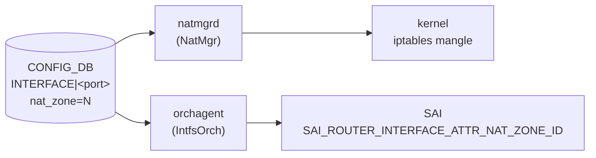

# NAT ゾーン設定 (nat_zone フィールド)

## 概要

`nat_zone` は `INTERFACE`・`VLAN_INTERFACE`・`PORTCHANNEL_INTERFACE`・`LOOPBACK_INTERFACE` テーブルに共通して存在するフィールドで、L3 インタフェースごとに [NAT](../../reference/glossary.md#term-nat) ゾーン ID (0〜3) を割り当てる[^1]。

[NAT](../../reference/glossary.md#term-nat) 変換はゾーンをまたぐパケットにのみ行われる。デフォルト値 `0` は「内側 (inside)」インタフェースを意味し、値を `1` などに変えると「外側 (outside)」インタフェースとして扱われる。`natmgrd` が iptables mangle テーブルに MARK ルールを設定し、`orchagent / IntfsOrch` が SAI の `SAI_ROUTER_INTERFACE_ATTR_NAT_ZONE_ID` を設定する[^2][^3]。

<!-- cdb-mermaid -->
### データフロー (自動生成)



!!! note "凡例"
    CONFIG_DB から SAI までの典型経路。`natmgrd` は iptables mangle MARK ルールを管理し、`orchagent` は SAI RIF 属性を設定する。
<!-- /cdb-mermaid -->

## key 構造

```text
INTERFACE|<port_name>
VLAN_INTERFACE|<vlan_name>
PORTCHANNEL_INTERFACE|<portchannel_name>
LOOPBACK_INTERFACE|<loopback_name>
```

`nat_zone` は各 L3 インタフェーステーブルのポート単位エントリ (key サイズ 1) に付与するフィールドであり、IP プレフィックス付きエントリ (key サイズ 2) では無視される。

## 主要フィールド

| フィールド | 型 | 既定値 | 説明 |
|-----------|----|--------|------|
| `nat_zone` | uint8 (0..3) | `0` | インタフェースの NAT ゾーン ID。`0` = inside、`1` = outside (典型) |

<!-- defaults -->
## フィールド暗黙デフォルト (Phase A — コード由来)

YANG default 以外の実装 hardcode fallback。

| フィールド | YANG default | コード hardcode | fallback 源 |
|-----------|-------------|----------------|------------|
| `nat_zone` | `"0"` | `m_nat_zone_id = 0` | `intfsorch.cpp:1361` (インタフェース削除時リセット) |
| iptables mark | — | `nat_zone_value + 1` | `natmgr.cpp:7512-7514` (0 mark 回避オフセット) |

全フィールドで YANG default と実装 hardcode は一致。ただし以下の暗黙挙動・乖離がある。

### iptables mark のオフセット (+1)

`natmgrd` は DB の `nat_zone` 値に +1 した値を iptables mangle の MARK 値として使用する (`natmgr.cpp:7512-7514`)。これは mark=0 が iptables のデフォルト動作と衝突するのを避けるため。

```cpp
// natmgr.cpp:7499-7514
if (fvField(idx) == NAT_ZONE)
{
    nat_zone_value = stoi(fvValue(idx));  // DB 値を読む
    nat_zone_value++;                      // +1 して mark=0 を避ける
    nat_zone = to_string(nat_zone_value);
}
```

| DB の `nat_zone` | iptables mangle MARK |
|-----------------|---------------------|
| `0` (inside / デフォルト) | `1` |
| `1` (outside / 典型) | `2` |
| `2` | `3` |
| `3` | `4` |

### フィールド省略時は SAI 書き込みなし

`nat_zone` フィールドが [CONFIG_DB](../../reference/glossary.md#term-config_db) に存在しない場合、`IntfsOrch` の `nat_zone` 文字列変数は空のままとなり、SAI 呼び出し (`setRouterIntfsNatZoneId`) はスキップされる (`intfsorch.cpp:974`)。この場合 `m_nat_zone_id` は初期値 `0` のままで SAI には降りない。

```cpp
// intfsorch.cpp:974-986
if ((!nat_zone.empty()) and (port.m_nat_zone_id != nat_zone_id))
{
    port.m_nat_zone_id = nat_zone_id;
    if (gIsNatSupported)
        setRouterIntfsNatZoneId(port);
    else
        SWSS_LOG_NOTICE("Not set router interface %s NAT Zone Id to %u, as NAT is not supported", ...);
}
```

### NAT 未サポートプラットフォームでの silent skip

`gIsNatSupported == false` のプラットフォーム（`SAI_SWITCH_ATTR_AVAILABLE_SNAT_ENTRY == 0`）では、`nat_zone` を設定しても `setRouterIntfsNatZoneId()` が呼ばれず `SWSS_LOG_NOTICE` のみ出力される。CONFIG_DB / iptables には書き込まれるが SAI へは降りない。

### ローカル変数の初期値 vs DB 値

`NatMgr::doNatZoneIntfTask` 内でローカル変数 `nat_zone_value = 1` として初期化されるが (`natmgr.cpp:7388`)、`NAT_ZONE` フィールドが DB に存在する場合は必ずその値で上書きされるため、この初期値が最終的な iptables mark に影響することはない。

<!-- /defaults -->

## 制約

- 有効範囲: **0〜3**（`sonic-interface.yang` の `range "0..3"`）。範囲外は YANG バリデーションで拒否。
- key サイズが 1 (ポート単位エントリ) の場合のみ処理。key サイズ 2 (IP プレフィックス付き) のエントリに付与しても natmgr は読み取らない (`natmgr.cpp:7492`)。
- 対応インタフェース種別: Ethernet / Vlan / PortChannel / Loopback。それ以外のプレフィックスで始まるキーは natmgr がスキップする (`natmgr.cpp:7412-7420`)。

## 購読者

- **`natmgrd`** (`NatMgr::doNatZoneIntfTask`): `INTERFACE`・`VLAN_INTERFACE`・`PORTCHANNEL_INTERFACE`・`LOOPBACK_INTERFACE` テーブルを購読し、`nat_zone` フィールドの変化を検知して kernel iptables mangle テーブルの MARK ルールを更新する。
- **`orchagent / IntfsOrch`** (`doIntfTask`): 同テーブルを購読し、`nat_zone` フィールドの変化を検知して SAI RIF 属性 `SAI_ROUTER_INTERFACE_ATTR_NAT_ZONE_ID` を更新する。

## 関連 CONFIG_DB / YANG / CLI

- 関連 [CONFIG_DB](../../reference/glossary.md#term-config_db): `NAT_GLOBAL`、`NAT_POOL`、`NAT_BINDINGS`
- 関連 CLI: `config interface nat-zone <port> <zone_id>`
- 関連 [YANG](../../reference/glossary.md#term-yang): `sonic-interface`

<!-- ref-triangle:start -->

## 関連リファレンス

- CONFIG_DB: [`NAT_GLOBAL / NAT_POOL`](nat.md)
- CONFIG_DB: [`NAT_BINDINGS`](nat-bindings.md)
- YANG: [`sonic-nat`](../yang/sonic-nat.md)
- CLI: [`config nat`](../cli/config-nat.md)

<!-- ref-triangle:end -->

## 引用元

[^1]: YANG 定義: `sonic-interface.yang`. <https://github.com/sonic-net/sonic-buildimage/blob/9ea932ec2e18f35e58268ec2e4456b1d4afd65cd/src/sonic-yang-models/yang-models/sonic-interface.yang#L76-L85>
[^2]: natmgr 実装: `sonic-swss/cfgmgr/natmgr.cpp`. <https://github.com/sonic-net/sonic-swss/blob/master/cfgmgr/natmgr.cpp>
[^3]: IntfsOrch 実装: `sonic-swss/orchagent/intfsorch.cpp`. <https://github.com/sonic-net/sonic-swss/blob/master/orchagent/intfsorch.cpp>

<!-- ops-hint -->
## 運用ヒント

### 典型設定

```bash
# Ethernet28 を outside (zone 1) に設定
config interface nat-zone Ethernet28 1

# Loopback0 を outside と同じゾーンに設定 (DC 構成)
config interface nat-zone Loopback0 1
```

### 確認コマンド

```bash
sonic-db-cli CONFIG_DB hget 'INTERFACE|Ethernet28' nat_zone
show nat config zones
```

### よくある誤設定

- `nat_zone=1` を IP プレフィックス付きエントリ (`INTERFACE|Ethernet28|10.0.0.1/24`) に書いた場合、natmgr が無視してゾーン設定が有効にならない。ポート単位エントリ (`INTERFACE|Ethernet28`) に書くこと。
- iptables mangle MARK は DB 値 + 1 であるため、`nat_zone=0` のインタフェースのパケットには mark=1 が付く。この MARK 値を手動の iptables ルールで参照する際は注意が必要。
<!-- /ops-hint -->

<!-- cdb-exceptions -->
## 例外条件・特殊挙動

<!-- evidence: sonic-swss/cfgmgr/natmgr.cpp doNatZoneIntfTask L7380-7620 / sonic-swss/orchagent/intfsorch.cpp L748-986 -->

- **key サイズが 1 または 2 以外 → スキップ**: natmgr は `L3_INTERFACE_KEY_SIZE (2)` または `L3_INTERFACE_ZONE_SIZE (1)` 以外のキーサイズを無効として erase する (`natmgr.cpp:7400-7406`)。
- **Loopback インタフェースは iptables ルールを設定しない**: `strncmp(keys[0].c_str(), LOOPBACK_PREFIX, ...)` が真の場合、`setMangleIptablesRules` の呼び出しをスキップする (`natmgr.cpp:7526-7528`)。SAI への zone_id 設定は行われる。
- **同一 nat_zone を受信 → スキップ**: `m_natZoneInterfaceInfo[port] == nat_zone` の場合、`SWSS_LOG_INFO("Received same nat_zone")` としてエントリを消費してスキップ (`natmgr.cpp:7571`)。
- **nat_zone 変更時の Static/Dynamic NAT ルール再構築**: ゾーン ID が変化した場合、natmgr は既存の Static NAT / NAPT / Dynamic NAT iptables ルールを削除してから新しいゾーン値で再構築する (`natmgr.cpp:7534-7566`)。
- **非整数値の nat_zone → SWSS_LOG_ERROR + スキップ**: `stoi()` が例外を投げる場合（文字列等）、ERROR ログを出してフィールドをスキップする (`natmgr.cpp:7507-7509`)。IntfsOrch も同様に `stoul()` 例外をキャッチして ERROR ログ + continue (`intfsorch.cpp:756`)。
- **NAT 未サポートプラットフォーム (`gIsNatSupported == false`) → SAI 呼び出しスキップ**: `intfsorch.cpp:978-986` で SWSS_LOG_NOTICE のみ出力し、`setRouterIntfsNatZoneId()` を呼ばない。

<!-- /cdb-exceptions -->

<!-- value-behavior -->
## 値依存挙動マトリクス

<!-- evidence: sonic-swss/cfgmgr/natmgr.cpp / sonic-swss/orchagent/intfsorch.cpp / SONiC/doc/nat/nat_design_spec.md -->

| `nat_zone` 値 | iptables mark | SAI zone_id | 意味 |
|-------------|-------------|------------|------|
| `0` (デフォルト / 省略時) | 1 (DB 値 +1) | 0 | inside インタフェース (private realm) |
| `1` | 2 | 1 | outside インタフェース (public realm / 典型) |
| `2` | 3 | 2 | 追加ゾーン (Twice NAT 等) |
| `3` | 4 | 3 | 追加ゾーン (最大値) |
| フィールド省略 | 設定なし | 設定なし | SAI / iptables ともに変更なし |

enum 等なし（uint8 数値のみ）。
<!-- /value-behavior -->

<!-- runtime-trace -->
## CDB → 実コンテナ動作トレース

### 段階 1: Consumer 登録

- **natmgrd** (`NatMgr`): `CFG_INTF_TABLE_NAME`・`CFG_VLAN_INTF_TABLE_NAME`・`CFG_LAG_INTF_TABLE_NAME`・`CFG_LOOPBACK_INTERFACE_TABLE_NAME` を購読し `doNatZoneIntfTask` にディスパッチ。
- **orchagent** (`IntfsOrch`): 同テーブルを `SubscriberStateTable` で購読し `doIntfTask` にディスパッチ。

### 段階 2: CFG → iptables / SAI

- `NatMgr` が `nat_zone` 値を読み、+1 した値を mangle MARK として kernel iptables に設定。
- `IntfsOrch` が `nat_zone` 値を `uint32_t` に変換し、`setRouterIntfsNatZoneId(port)` 経由で SAI RIF 属性 `SAI_ROUTER_INTERFACE_ATTR_NAT_ZONE_ID` を更新。

### 段階 3: タイミング + 副作用

- ゾーン変更時は既存の Static / Dynamic NAT iptables ルールが一度削除され再構築される（数十ルールが対象の場合は数百 ms 要する可能性あり）。
- iptables mangle mark の変更は即座に新規パケットから有効。既存 conntrack セッションは削除されない。

<!-- /runtime-trace -->

<!-- ordering -->
## 書込み順依存 (Phase B)

<!-- evidence: sonic-swss/cfgmgr/natmgr.cpp doNatZoneIntfTask L7380-7640 / sonic-swss/orchagent/intfsorch.cpp doTask L660-990 -->

`nat_zone` フィールドへの変更は CONFIG_DB への書き込み直後には SAI / iptables に反映されない場合がある。以下の先行条件が必要。

### 先行必須条件

| # | 先行必須条件 | 処理系 | 方向 | 緩和策 |
|---|------------|--------|------|--------|
| 1 | `PortsOrch::allPortsReady()` が true | orchagent (IntfsOrch) | 強制先行 (全ポート初期化待ち) | 全ポート初期化完了まで SAI 書き込みをスキップ、完了後 `doTask()` が自動再実行 (`intfsorch.cpp:665-668`) |
| 2 | `isPortStateOk(port)` が true (zone エントリ・非 Loopback) | natmgrd | 強制先行 | ポート ready になると自動再試行 (`natmgr.cpp:7493-7499`) |
| 3 | `isIntfStateOk(key)` が true (IP プレフィックス付きエントリ) | natmgrd | 強制先行 | インタフェース IP 有効化後に自動再試行 (`natmgr.cpp:7595-7601`) |
| 4 | `gIsNatSupported == true` (SAI capability クエリ結果) | orchagent (IntfsOrch) | 強制先行 (プラットフォーム制約) | false の場合は SAI 書き込みを silent skip、iptables は正常設定 (`intfsorch.cpp:977-985`) |

### ゾーン変更時の内部順序 (副作用)

`nat_zone` の値が既存値から変化した場合、natmgrd は以下の順序で処理する (`natmgr.cpp:7534-7566`)。

1. 既存の Static NAT iptables ルール削除 (`removeStaticNatIptables()`)
2. 既存の Static NAPT iptables ルール削除 (`removeStaticNaptIptables()`)
3. 既存の Dynamic NAT iptables ルール削除 (`removeDynamicNatRules()`)
4. キャッシュ更新 (`m_natZoneInterfaceInfo[port] = nat_zone`)
5. 新しいゾーン値で mangle iptables MARK ルール設定 (`setMangleIptablesRules(ADD)`)
6. Static / Dynamic NAT iptables ルール再構築 (`addStaticNatIptables()` 等)

この間 (数 ms〜数百 ms) は NAT ルールが一時的に消失する。

### Loopback の特殊性

Loopback インタフェースは `isPortStateOk()` チェック対象外であり (`natmgr.cpp:7493-7498`)、かつ `setMangleIptablesRules()` が呼ばれない。Loopback の `nat_zone` は SAI zone_id のみに影響し、iptables mangle mark には影響しないため、設定順序は non-Loopback とは独立。

<!-- /ordering -->

<!-- entry-points -->
## 書き込み入り口 (Direction A)

`nat_zone` フィールドへの書き込みが発生するコード経路。

### CLI

- `config interface nat-zone <interface_name> <zone_value>` — `config/interface.py` が `CONFIG_DB.INTERFACE[interface_name]['nat_zone'] = zone_value` を書き込む (sonic-utilities)。

### minigraph / sonic-cfggen

- `minigraph.py` に NAT ゾーン生成なし。

### REST / gNMI

- REST/gNMI 書き込み経路なし（YANG を通じた設定は可能だが現状 CLI 経由が主）。

### db_migrator

- `db_migrator.py` に `nat_zone` マイグレーションなし。

### ビルド時デフォルト (build-time default)

- `init_cfg.json.j2` にエントリなし。

<!-- /entry-points -->
