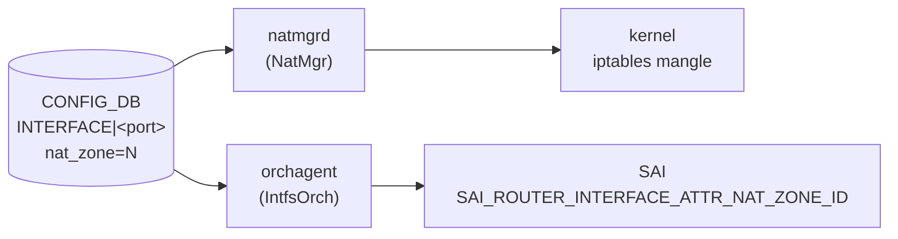

# NAT ゾーン設定 (nat_zone フィールド)

## 概要

`nat_zone` は `INTERFACE`・`VLAN_INTERFACE`・`PORTCHANNEL_INTERFACE`・`LOOPBACK_INTERFACE` テーブルに共通して存在するフィールドで、L3 インタフェースごとに [NAT](../../reference/glossary.md#term-nat) ゾーン ID (0〜3) を割り当てる[^1]。

[NAT](../../reference/glossary.md#term-nat) 変換はゾーンをまたぐパケットにのみ行われる。デフォルト値 `0` は「内側 (inside)」インタフェースを意味し、値を `1` などに変えると「外側 (outside)」インタフェースとして扱われる。`natmgrd` が iptables mangle テーブルに MARK ルールを設定し、`orchagent / IntfsOrch` が SAI の `SAI_ROUTER_INTERFACE_ATTR_NAT_ZONE_ID` を設定する[^2][^3]。

<!-- cdb-mermaid -->
### データフロー (自動生成)



!!! note "凡例"
    CONFIG_DB から SAI までの典型経路。`natmgrd` は iptables mangle MARK ルールを管理し、`orchagent` は SAI RIF 属性を設定する。
<!-- /cdb-mermaid -->

## key 構造

```text
INTERFACE|<port_name>
VLAN_INTERFACE|<vlan_name>
PORTCHANNEL_INTERFACE|<portchannel_name>
LOOPBACK_INTERFACE|<loopback_name>
```

`nat_zone` は各 L3 インタフェーステーブルのポート単位エントリ (key サイズ 1) に付与するフィールドであり、IP プレフィックス付きエントリ (key サイズ 2) では無視される。

## 主要フィールド

| フィールド | 型 | 既定値 | 説明 |
|-----------|----|--------|------|
| `nat_zone` | uint8 (0..3) | `0` | インタフェースの NAT ゾーン ID。`0` = inside、`1` = outside (典型) |

<!-- defaults -->
## フィールド暗黙デフォルト (Phase A — コード由来)

YANG default 以外の実装 hardcode fallback。

| フィールド | YANG default | コード hardcode | fallback 源 |
|-----------|-------------|----------------|------------|
| `nat_zone` | `"0"` | `m_nat_zone_id = 0` | `intfsorch.cpp:1361` (インタフェース削除時リセット) |
| iptables mark | — | `nat_zone_value + 1` | `natmgr.cpp:7512-7514` (0 mark 回避オフセット) |

全フィールドで YANG default と実装 hardcode は一致。ただし以下の暗黙挙動・乖離がある。

### iptables mark のオフセット (+1)

`natmgrd` は DB の `nat_zone` 値に +1 した値を iptables mangle の MARK 値として使用する (`natmgr.cpp:7512-7514`)。これは mark=0 が iptables のデフォルト動作と衝突するのを避けるため。

```cpp
// natmgr.cpp:7499-7514
if (fvField(idx) == NAT_ZONE)
{
    nat_zone_value = stoi(fvValue(idx));  // DB 値を読む
    nat_zone_value++;                      // +1 して mark=0 を避ける
    nat_zone = to_string(nat_zone_value);
}
```

| DB の `nat_zone` | iptables mangle MARK |
|-----------------|---------------------|
| `0` (inside / デフォルト) | `1` |
| `1` (outside / 典型) | `2` |
| `2` | `3` |
| `3` | `4` |

### フィールド省略時は SAI 書き込みなし

`nat_zone` フィールドが [CONFIG_DB](../../reference/glossary.md#term-config_db) に存在しない場合、`IntfsOrch` の `nat_zone` 文字列変数は空のままとなり、SAI 呼び出し (`setRouterIntfsNatZoneId`) はスキップされる (`intfsorch.cpp:974`)。この場合 `m_nat_zone_id` は初期値 `0` のままで SAI には降りない。

```cpp
// intfsorch.cpp:974-986
if ((!nat_zone.empty()) and (port.m_nat_zone_id != nat_zone_id))
{
    port.m_nat_zone_id = nat_zone_id;
    if (gIsNatSupported)
        setRouterIntfsNatZoneId(port);
    else
        SWSS_LOG_NOTICE("Not set router interface %s NAT Zone Id to %u, as NAT is not supported", ...);
}
```

### NAT 未サポートプラットフォームでの silent skip

`gIsNatSupported == false` のプラットフォーム（`SAI_SWITCH_ATTR_AVAILABLE_SNAT_ENTRY == 0`）では、`nat_zone` を設定しても `setRouterIntfsNatZoneId()` が呼ばれず `SWSS_LOG_NOTICE` のみ出力される。CONFIG_DB / iptables には書き込まれるが SAI へは降りない。

### ローカル変数の初期値 vs DB 値

`NatMgr::doNatZoneIntfTask` 内でローカル変数 `nat_zone_value = 1` として初期化されるが (`natmgr.cpp:7388`)、`NAT_ZONE` フィールドが DB に存在する場合は必ずその値で上書きされるため、この初期値が最終的な iptables mark に影響することはない。

<!-- /defaults -->

<!-- ordering -->
## 書込み順依存 (Phase B)

`nat_zone` フィールドの設定は、2 つのデーモン (`natmgrd` / `orchagent`) が独立して処理する。それぞれに異なる前提条件があり、条件未達の場合は自動再試行 (`it++; continue`) される。

### 検出された順序依存

| # | 先行必須条件 | 処理系 | 方向 | 緩和策 |
|---|------------|--------|------|--------|
| 1 | `PortsOrch::allPortsReady()` が true | orchagent (IntfsOrch) | **強制先行** | 全ポート初期化完了まで SAI 書き込みを全スキップ。完了後 `doTask()` が自動再実行 |
| 2 | `isPortStateOk(port)` が true（非 Loopback ゾーンエントリ） | natmgrd | **強制先行** | STATE_PORT / LAG / VLAN テーブルにエントリが現れるまで再キュー |
| 3 | `isIntfStateOk(key)` が true（IP プレフィックス付きエントリ） | natmgrd | **強制先行** | STATE_INTERFACE_TABLE にエントリが現れるまで再キュー |
| 4 | 旧 Static / Dynamic NAT ルール削除が先行（ゾーン変更時） | natmgrd | **内部順序（副作用）** | 削除 → 更新 → 再追加の順が固定。この間 NAT ルールが一時消失する |
| 5 | `gIsNatSupported == true`（SAI capability クエリ） | orchagent (IntfsOrch) | **強制先行** | false の場合は SAI 書き込みを silent skip（`SWSS_LOG_NOTICE` のみ） |

### 主要な制約詳細

**PortsOrch 初期化完了ガード（依存 #1）**: `IntfsOrch::doTask()` の冒頭（`intfsorch.cpp:665-668`）で `gPortsOrch->allPortsReady()` が false なら即 return する。これは全 PORT_TABLE エントリが orchagent 内部で処理完了するまで、すべての INTERFACE テーブルイベント（`nat_zone` 含む）の SAI 反映をブロックする。ブロック中は `m_toSync` にイベントが蓄積され、`allPortsReady()` が true になった後の次回 `doTask()` で一括処理される。

**ポート STATE_DB ガード（依存 #2）**: `doNatZoneIntfTask` のゾーン単位エントリ（key サイズ 1）SET 処理時、Loopback 以外のインタフェースは `isPortStateOk(port)` が false なら `it++; continue` でキューに残す（`natmgr.cpp:7483-7487`）。`isPortStateOk()` は STATE_PORT_TABLE / STATE_LAG_TABLE / STATE_VLAN_TABLE を順番に参照し、対応エントリの存在を確認する。Loopback はこのガードを経由しない（iptables mangle も設定しない）。

**ゾーン変更時の NAT ルール再構築順序（依存 #4）**: 既存の `nat_zone` と異なる値を受信した場合、natmgrd は内部で次の順序で処理する（`natmgr.cpp:7534-7566`）。①旧 mangle iptables ルールを DELETE → ②`removeStaticNatIptables()` / `removeStaticNaptIptables()` / `removeDynamicNatRules()` で旧 NAT ルールを削除 → ③`m_natZoneInterfaceInfo[port]` を新値に更新 → ④新 mangle iptables ルールを ADD → ⑤新 NAT ルールを追加。②〜④の間は NAT 変換が一時停止する。

<!-- /ordering -->

## 制約

- 有効範囲: **0〜3**（`sonic-interface.yang` の `range "0..3"`）。範囲外は YANG バリデーションで拒否。
- key サイズが 1 (ポート単位エントリ) の場合のみ処理。key サイズ 2 (IP プレフィックス付き) のエントリに付与しても natmgr は読み取らない (`natmgr.cpp:7492`)。
- 対応インタフェース種別: Ethernet / Vlan / PortChannel / Loopback。それ以外のプレフィックスで始まるキーは natmgr がスキップする (`natmgr.cpp:7412-7420`)。

## 購読者

- **`natmgrd`** (`NatMgr::doNatZoneIntfTask`): `INTERFACE`・`VLAN_INTERFACE`・`PORTCHANNEL_INTERFACE`・`LOOPBACK_INTERFACE` テーブルを購読し、`nat_zone` フィールドの変化を検知して kernel iptables mangle テーブルの MARK ルールを更新する。
- **`orchagent / IntfsOrch`** (`doIntfTask`): 同テーブルを購読し、`nat_zone` フィールドの変化を検知して SAI RIF 属性 `SAI_ROUTER_INTERFACE_ATTR_NAT_ZONE_ID` を更新する。

## 関連 CONFIG_DB / YANG / CLI

- 関連 [CONFIG_DB](../../reference/glossary.md#term-config_db): `NAT_GLOBAL`、`NAT_POOL`、`NAT_BINDINGS`
- 関連 CLI: `config interface nat-zone <port> <zone_id>`
- 関連 [YANG](../../reference/glossary.md#term-yang): `sonic-interface`

<!-- ref-triangle:start -->

## 関連リファレンス

- CONFIG_DB: [`NAT_GLOBAL / NAT_POOL`](nat.md)
- CONFIG_DB: [`NAT_BINDINGS`](nat-bindings.md)
- YANG: [`sonic-nat`](../yang/sonic-nat.md)
- CLI: [`config nat`](../cli/config-nat.md)

<!-- ref-triangle:end -->

## 引用元

[^1]: YANG 定義: `sonic-interface.yang`. <https://github.com/sonic-net/sonic-buildimage/blob/9ea932ec2e18f35e58268ec2e4456b1d4afd65cd/src/sonic-yang-models/yang-models/sonic-interface.yang#L76-L85>
[^2]: natmgr 実装: `sonic-swss/cfgmgr/natmgr.cpp`. <https://github.com/sonic-net/sonic-swss/blob/master/cfgmgr/natmgr.cpp>
[^3]: IntfsOrch 実装: `sonic-swss/orchagent/intfsorch.cpp`. <https://github.com/sonic-net/sonic-swss/blob/master/orchagent/intfsorch.cpp>

<!-- ops-hint -->
## 運用ヒント

### 典型設定

```bash
# Ethernet28 を outside (zone 1) に設定
config interface nat-zone Ethernet28 1

# Loopback0 を outside と同じゾーンに設定 (DC 構成)
config interface nat-zone Loopback0 1
```

### 確認コマンド

```bash
sonic-db-cli CONFIG_DB hget 'INTERFACE|Ethernet28' nat_zone
show nat config zones
```

### よくある誤設定

- `nat_zone=1` を IP プレフィックス付きエントリ (`INTERFACE|Ethernet28|10.0.0.1/24`) に書いた場合、natmgr が無視してゾーン設定が有効にならない。ポート単位エントリ (`INTERFACE|Ethernet28`) に書くこと。
- iptables mangle MARK は DB 値 + 1 であるため、`nat_zone=0` のインタフェースのパケットには mark=1 が付く。この MARK 値を手動の iptables ルールで参照する際は注意が必要。
<!-- /ops-hint -->

<!-- cdb-exceptions -->
## 例外条件・特殊挙動

<!-- evidence: sonic-swss/cfgmgr/natmgr.cpp doNatZoneIntfTask L7380-7620 / sonic-swss/orchagent/intfsorch.cpp L748-986 -->

- **key サイズが 1 または 2 以外 → スキップ**: natmgr は `L3_INTERFACE_KEY_SIZE (2)` または `L3_INTERFACE_ZONE_SIZE (1)` 以外のキーサイズを無効として erase する (`natmgr.cpp:7400-7406`)。
- **Loopback インタフェースは iptables ルールを設定しない**: `strncmp(keys[0].c_str(), LOOPBACK_PREFIX, ...)` が真の場合、`setMangleIptablesRules` の呼び出しをスキップする (`natmgr.cpp:7526-7528`)。SAI への zone_id 設定は行われる。
- **同一 nat_zone を受信 → スキップ**: `m_natZoneInterfaceInfo[port] == nat_zone` の場合、`SWSS_LOG_INFO("Received same nat_zone")` としてエントリを消費してスキップ (`natmgr.cpp:7571`)。
- **nat_zone 変更時の Static/Dynamic NAT ルール再構築**: ゾーン ID が変化した場合、natmgr は既存の Static NAT / NAPT / Dynamic NAT iptables ルールを削除してから新しいゾーン値で再構築する (`natmgr.cpp:7534-7566`)。
- **非整数値の nat_zone → SWSS_LOG_ERROR + スキップ**: `stoi()` が例外を投げる場合（文字列等）、ERROR ログを出してフィールドをスキップする (`natmgr.cpp:7507-7509`)。IntfsOrch も同様に `stoul()` 例外をキャッチして ERROR ログ + continue (`intfsorch.cpp:756`)。
- **NAT 未サポートプラットフォーム (`gIsNatSupported == false`) → SAI 呼び出しスキップ**: `intfsorch.cpp:978-986` で SWSS_LOG_NOTICE のみ出力し、`setRouterIntfsNatZoneId()` を呼ばない。

<!-- /cdb-exceptions -->

<!-- value-behavior -->
## 値依存挙動マトリクス

<!-- evidence: sonic-swss/cfgmgr/natmgr.cpp / sonic-swss/orchagent/intfsorch.cpp / SONiC/doc/nat/nat_design_spec.md -->

| `nat_zone` 値 | iptables mark | SAI zone_id | 意味 |
|-------------|-------------|------------|------|
| `0` (デフォルト / 省略時) | 1 (DB 値 +1) | 0 | inside インタフェース (private realm) |
| `1` | 2 | 1 | outside インタフェース (public realm / 典型) |
| `2` | 3 | 2 | 追加ゾーン (Twice NAT 等) |
| `3` | 4 | 3 | 追加ゾーン (最大値) |
| フィールド省略 | 設定なし | 設定なし | SAI / iptables ともに変更なし |

enum 等なし（uint8 数値のみ）。
<!-- /value-behavior -->

<!-- runtime-trace -->
## CDB → 実コンテナ動作トレース

### 段階 1: Consumer 登録

- **natmgrd** (`NatMgr`): `CFG_INTF_TABLE_NAME`・`CFG_VLAN_INTF_TABLE_NAME`・`CFG_LAG_INTF_TABLE_NAME`・`CFG_LOOPBACK_INTERFACE_TABLE_NAME` を購読し `doNatZoneIntfTask` にディスパッチ。
- **orchagent** (`IntfsOrch`): 同テーブルを `SubscriberStateTable` で購読し `doIntfTask` にディスパッチ。

### 段階 2: CFG → iptables / SAI

- `NatMgr` が `nat_zone` 値を読み、+1 した値を mangle MARK として kernel iptables に設定。
- `IntfsOrch` が `nat_zone` 値を `uint32_t` に変換し、`setRouterIntfsNatZoneId(port)` 経由で SAI RIF 属性 `SAI_ROUTER_INTERFACE_ATTR_NAT_ZONE_ID` を更新。

### 段階 3: タイミング + 副作用

- ゾーン変更時は既存の Static / Dynamic NAT iptables ルールが一度削除され再構築される（数十ルールが対象の場合は数百 ms 要する可能性あり）。
- iptables mangle mark の変更は即座に新規パケットから有効。既存 conntrack セッションは削除されない。

<!-- /runtime-trace -->

<!-- ordering -->
## 書込み順依存 (Phase B)

<!-- evidence: sonic-swss/cfgmgr/natmgr.cpp doNatZoneIntfTask L7380-7640 / sonic-swss/orchagent/intfsorch.cpp doTask L660-990 -->

`nat_zone` フィールドへの変更は CONFIG_DB への書き込み直後には SAI / iptables に反映されない場合がある。以下の先行条件が必要。

### 先行必須条件

| # | 先行必須条件 | 処理系 | 方向 | 緩和策 |
|---|------------|--------|------|--------|
| 1 | `PortsOrch::allPortsReady()` が true | orchagent (IntfsOrch) | 強制先行 (全ポート初期化待ち) | 全ポート初期化完了まで SAI 書き込みをスキップ、完了後 `doTask()` が自動再実行 (`intfsorch.cpp:665-668`) |
| 2 | `isPortStateOk(port)` が true (zone エントリ・非 Loopback) | natmgrd | 強制先行 | ポート ready になると自動再試行 (`natmgr.cpp:7493-7499`) |
| 3 | `isIntfStateOk(key)` が true (IP プレフィックス付きエントリ) | natmgrd | 強制先行 | インタフェース IP 有効化後に自動再試行 (`natmgr.cpp:7595-7601`) |
| 4 | `gIsNatSupported == true` (SAI capability クエリ結果) | orchagent (IntfsOrch) | 強制先行 (プラットフォーム制約) | false の場合は SAI 書き込みを silent skip、iptables は正常設定 (`intfsorch.cpp:977-985`) |

### ゾーン変更時の内部順序 (副作用)

`nat_zone` の値が既存値から変化した場合、natmgrd は以下の順序で処理する (`natmgr.cpp:7534-7566`)。

1. 既存の Static NAT iptables ルール削除 (`removeStaticNatIptables()`)
2. 既存の Static NAPT iptables ルール削除 (`removeStaticNaptIptables()`)
3. 既存の Dynamic NAT iptables ルール削除 (`removeDynamicNatRules()`)
4. キャッシュ更新 (`m_natZoneInterfaceInfo[port] = nat_zone`)
5. 新しいゾーン値で mangle iptables MARK ルール設定 (`setMangleIptablesRules(ADD)`)
6. Static / Dynamic NAT iptables ルール再構築 (`addStaticNatIptables()` 等)

この間 (数 ms〜数百 ms) は NAT ルールが一時的に消失する。

### Loopback の特殊性

Loopback インタフェースは `isPortStateOk()` チェック対象外であり (`natmgr.cpp:7493-7498`)、かつ `setMangleIptablesRules()` が呼ばれない。Loopback の `nat_zone` は SAI zone_id のみに影響し、iptables mangle mark には影響しないため、設定順序は non-Loopback とは独立。

<!-- /ordering -->

<!-- cross-refs -->
## 暗黙参照テーブル (Phase C)

`nat_zone` フィールドが処理される際に `natmgrd` / `orchagent (IntfsOrch)` が暗黙的に依存する他テーブルの関係を示す。

<!-- evidence: sonic-swss/cfgmgr/natmgr.cpp isPortStateOk L96-131 / isIntfStateOk L135-145 / doNatZoneIntfTask L7493-7628 / sonic-swss/orchagent/intfsorch.cpp doTask L665-668 L978-985 -->

| 依存方向 | 参照元 | 参照先テーブル | 参照先キー形式 | 依存内容 | 証跡 |
|---------|--------|--------------|--------------|---------|------|
| natmgrd → STATE_DB | `isPortStateOk()` | `STATE_PORT_TABLE` / `STATE_LAG_TABLE` / `STATE_VLAN_TABLE` | `<port_name>` | Ethernet / PortChannel / Vlan の `nat_zone` 設定前にポートが STATE_DB に登録されている必要あり。未登録の場合 `it++; continue` で再キューされ自動再試行 | `natmgr.cpp:96-131`, `natmgr.cpp:7493-7499` |
| natmgrd → STATE_DB | `isIntfStateOk()` | `STATE_INTERFACE_TABLE` | `<intf>\|<ip>/<prefix>` | IP プレフィックス付きエントリ（key サイズ 2）処理前にインタフェースが STATE_DB に登録されている必要あり。未登録の場合再キューして自動再試行 | `natmgr.cpp:135-145`, `natmgr.cpp:7595-7601` |
| natmgrd 内部 | `doNatZoneIntfTask` | `m_natIpInterfaceInfo` 内部キャッシュ | `port → set<ip_prefix>` | ゾーン変更時に IP インタフェースキャッシュの有無で Static / Dynamic NAT iptables ルール再構築の要否を判定。IP プレフィックスエントリ（key サイズ 2）が先に処理され `m_natIpInterfaceInfo` に登録されている場合のみ NAT ルールが再構築される | `natmgr.cpp:7532-7568` |
| orchagent → PortsOrch | `allPortsReady()` | PortsOrch 内部フラグ (PORT_TABLE 処理完了) | — | 全ポート初期化完了前は `nat_zone` を含む全 INTERFACE テーブルイベントの SAI 反映がスキップされ、`m_toSync` に蓄積。`allPortsReady()` が true になった後の次回 `doTask()` で一括処理される | `intfsorch.cpp:665-668` |
| orchagent → SAI switch | `gIsNatSupported` | SAI `SAI_SWITCH_ATTR_AVAILABLE_SNAT_ENTRY` | — | `SNAT_ENTRY` capability が 0 のプラットフォームでは `nat_zone` の SAI `SAI_ROUTER_INTERFACE_ATTR_NAT_ZONE_ID` 設定が silent skip される（`SWSS_LOG_NOTICE` のみ出力） | `intfsorch.cpp:978-985` |

### 解決タイミング

- **STATE_PORT / LAG / VLAN 依存**: portsyncd / teamd / vlanmgrd が各ポートを STATE_DB に登録した後、natmgrd の次回 `doTask()` ループで自動再処理される。
- **STATE_INTERFACE 依存**: intfmgrd が IP プレフィックスエントリを STATE_INTERFACE_TABLE に書き込んだ後、natmgrd が自動再処理。
- **`m_natIpInterfaceInfo` 依存**: 同一 `doNatZoneIntfTask` 内で IP プレフィックスエントリ（key サイズ 2）が先に処理されていれば NAT ルール再構築が即時実行される。ゾーン単位エントリ（key サイズ 1）が先に処理された場合、IP プレフィックスエントリ登録時（IP インタフェース追加時）に `addStaticNatIptables()` 等が呼ばれる。
- **`allPortsReady()` 依存**: `orchdaemon` の起動シーケンスで PortsOrch 初期化完了後に自動解消。通常はシステム起動後数秒以内。

<!-- /cross-refs -->

<!-- failure -->
## 失敗挙動 (Phase D)

<!-- evidence: sonic-swss/cfgmgr/natmgr.cpp setMangleIptablesRules L894-924 / doNatIpInterfaceTask L7499-7585 / sonic-swss/orchagent/intfsorch.cpp setRouterIntfsNatZoneId L272-303 -->

### iptables mangle コマンド失敗 → キャッシュ更新は進むが反映なし

`setMangleIptablesRules()` が `swss::exec()` を呼び出し、戻り値が非 0 の場合 `SWSS_LOG_ERROR` をログして `false` を返す (`natmgr.cpp:917-921`)。

```cpp
// natmgr.cpp:915-921
ret = swss::exec(cmds, res);
if (ret)
{
    SWSS_LOG_ERROR("Command '%s' failed with rc %d", cmds.c_str(), ret);
    return false;
}
```

**重要**: 呼び出し元 (`doNatIpInterfaceTask` の SET 処理) は `setMangleIptablesRules()` の戻り値を確認せず処理を継続する。つまり iptables 設定が失敗しても `m_natZoneInterfaceInfo[port]` は新しいゾーン値に更新される (`natmgr.cpp:7546,7578`)。その結果、**キャッシュの値と kernel iptables のゾーン MARK が乖離した状態**になる。natmgrd の次回処理では「同一 nat_zone」として扱われ自動再試行は行われない。

| 障害 | ログ | キャッシュ更新 | iptables 反映 | 自動回復 |
|------|------|------------|--------------|---------|
| `setMangleIptablesRules(ADD)` 失敗 | `SWSS_LOG_ERROR "Command '...' failed with rc %d"` | される (新値) | されない | なし (手動再設定必要) |
| `setMangleIptablesRules(DELETE)` 失敗 | `SWSS_LOG_ERROR "Command '...' failed with rc %d"` | 後続で新値に更新 | 旧ルールが残存 | なし |

### SAI `set_router_interface_attribute` 失敗 → `handleSaiSetStatus` に委譲

`intfsorch.cpp:setRouterIntfsNatZoneId()` は SAI 設定失敗時に `handleSaiSetStatus(SAI_API_ROUTER_INTERFACE, status)` を呼び、戻り値が `task_success` でなければ `parseHandleSaiStatusFailure()` を返す (`intfsorch.cpp:290-298`)。

```cpp
// intfsorch.cpp:290-298 (setRouterIntfsNatZoneId)
if (status != SAI_STATUS_SUCCESS)
{
    SWSS_LOG_ERROR("Failed to set router interface %s NAT Zone Id to %u, rv:%d",
                   port.m_alias.c_str(), port.m_nat_zone_id, status);
    task_process_status handle_status = handleSaiSetStatus(SAI_API_ROUTER_INTERFACE, status);
    if (handle_status != task_success)
    {
        return parseHandleSaiStatusFailure(handle_status);
    }
}
```

`handleSaiSetStatus` の結果により retry / abort が決定される。SAI 設定失敗時でも Port の `m_nat_zone_id` フィールドは更新済みのため、次回 `doTask()` では「変更なし」として扱われ再試行が行われない可能性がある。

### RIF が存在しない場合 → silent return

`setRouterIntfsNatZoneId()` は呼ばれる前に `port.m_rif_id == 0` の場合を `SWSS_LOG_WARN "Router interface is not exists on %s"` としてログし `true` を返す (`intfsorch.cpp:277-281`)。SAI 設定は行われないが、エラーとは扱われない。

### 失敗挙動サマリ

| # | 条件 | コンポーネント | ログ | retry | STATE_DB 記録 |
|---|------|------------|------|-------|--------------|
| 1 | iptables mangle ADD 失敗 | natmgrd | `SWSS_LOG_ERROR "Command '...' failed"` | なし | なし |
| 2 | iptables mangle DELETE 失敗 | natmgrd | `SWSS_LOG_ERROR "Command '...' failed"` | なし | なし |
| 3 | SAI RIF zone_id set 失敗 | IntfsOrch | `SWSS_LOG_ERROR "Failed to set router interface ... NAT Zone Id"` | SAI 依存 | なし |
| 4 | RIF 未存在で zone_id 設定 | IntfsOrch | `SWSS_LOG_WARN "Router interface is not exists"` | なし (silent skip) | なし |
| 5 | 非整数値の nat_zone | natmgrd | `SWSS_LOG_ERROR "Invalid nat_zone ..., skipping"` | なし (erase) | なし |
| 6 | 非整数値の nat_zone | IntfsOrch | `SWSS_LOG_ERROR "Invalid argument ... for nat zone"` | なし (continue) | なし |

<!-- /failure -->

<!-- constants -->
## ハードコード定数 (Phase E)

`nat_zone` フィールドを処理する `natmgrd` (`NatMgr`) と `orchagent` (`IntfsOrch`) に存在する、CONFIG_DB / YANG で管理されない固定値の一覧。ソースは `sonic-swss/cfgmgr/natmgr.h`・`shellcmd.h`・`natmgr.cpp` と `sonic-swss/orchagent/intfsorch.cpp`・`orchdaemon.cpp`・`main.cpp`。

### キーサイズ定数 (natmgr.h)

| 定数 | 値 | 用途 |
|------|----|------|
| `L3_INTERFACE_ZONE_SIZE` | `1` | ゾーン単位エントリ (`INTERFACE\|<port>`) の有効キー要素数 — これ以外は無効として erase (`natmgr.h:75`) |
| `L3_INTERFACE_KEY_SIZE` | `2` | IP プレフィックス付きエントリ (`INTERFACE\|<port>\|<ip>/<len>`) の有効キー要素数 (`natmgr.h:74`) |
| `IP_PREFIX_SIZE` | `2` | プレフィックス文字列をアドレス+マスク長に分割したときの有効要素数 (`natmgr.h:104`) |
| `IP_ADDR_MASK_LEN_MIN` | `1` | IPv4 マスク長の最小有効値 (`natmgr.h:105`) |
| `IP_ADDR_MASK_LEN_MAX` | `32` | IPv4 マスク長の最大有効値 (`natmgr.h:106`) |

### インタフェースプレフィックス文字列 (natmgr.h)

| 定数 | 値 | 用途 |
|------|----|------|
| `ETHERNET_PREFIX` | `"Ethernet"` | Ethernet ポート判定（iptables mangle + SAI 両対応） (`natmgr.h:78`) |
| `VLAN_PREFIX` | `"Vlan"` | Vlan インタフェース判定 (`natmgr.h:76`) |
| `LAG_PREFIX` | `"PortChannel"` | PortChannel (LAG) 判定 (`natmgr.h:77`) |
| `LOOPBACK_PREFIX` | `"Loopback"` | Loopback 判定 — iptables mangle スキップ分岐で参照 (`natmgr.h:79`) |

上記 4 プレフィックス以外で始まるキーは `doNatZoneIntfTask` で `SWSS_LOG_INFO` + erase される (`natmgr.cpp:7412-7420`)。

### iptables コマンドパス定数 (shellcmd.h)

| 定数 | 値 | 用途 |
|------|----|------|
| `IPTABLES_CMD` | `"/sbin/iptables"` | `setMangleIptablesRules()` 内で mangle MARK ルールの追加・削除に使用 (`shellcmd.h:15`) |

`setMangleIptablesRules()` が生成するコマンドテンプレート (`natmgr.cpp:912-913`):

```
/sbin/iptables -t mangle -{A|D} PREROUTING  -i <port> -j MARK --set-mark <mark>
/sbin/iptables -t mangle -{A|D} POSTROUTING -o <port> -j MARK --set-mark <mark>
```

`"-t mangle"` / `"PREROUTING"` / `"POSTROUTING"` / `"-j MARK"` / `"--set-mark"` はすべて文字列リテラルとして固定されており、CONFIG_DB / YANG から変更できない。

### iptables mark オフセット (natmgr.cpp)

`nat_zone_value++` が `natmgr.cpp:7513` にハードコードされており、DB 値に **常に +1** した値を mangle MARK として使用する。mark=0 がカーネルのデフォルト mangle 動作と衝突するのを回避するための固定オフセット。YANG や CONFIG_DB には公開されていない。

| DB `nat_zone` | iptables MARK (固定オフセット +1) |
|--------------|----------------------------------|
| `0` | `1` |
| `1` | `2` |
| `2` | `3` |
| `3` | `4` |

### gIsNatSupported グローバルフラグ (orchagent)

| 変数 | 初期値 | 確定ロジック |
|------|--------|------------|
| `gIsNatSupported` | `false` (`orchdaemon.cpp:78`) | orchagent 起動時に `SAI_SWITCH_ATTR_AVAILABLE_SNAT_ENTRY` をクエリし、返却値が `!= 0` の場合のみ `true` に設定 (`main.cpp:935-947`) |

`false` のプラットフォームでは `setRouterIntfsNatZoneId()` が呼ばれず、`nat_zone` を書き込んでも SAI RIF への zone_id 設定がスキップされる。この挙動はプロセスライフタイムを通じて不変（再クエリなし）。

<!-- /constants -->

<!-- side-effects -->
## 副次 DB 書込 (Phase F)

<!-- evidence: sonic-swss/cfgmgr/natmgr.cpp setMangleIptablesRules L894-924 / doNatZoneIntfTask L7493-7628 / orchagent/intfsorch.cpp setRouterIntfsNatZoneId L272-303 -->

`nat_zone` フィールドへの SET/DEL を受信した際に、主購読者 `natmgrd`（`NatMgr`）および `orchagent`（`IntfsOrch`）が生じさせる副次書込みを示す。

| 副次対象 | 種別 | 書込内容 | 条件 | 根拠 |
|---------|------|---------|------|------|
| kernel iptables mangle テーブル | 非 DB（カーネルルール） | `PREROUTING -i <port> -j MARK --set-mark <zone+1>` / `POSTROUTING -o <port> -j MARK --set-mark <zone+1>` を ADD / DEL | Loopback 以外の Ethernet / PortChannel / Vlan インタフェース、かつ `isPortStateOk()` が true | `natmgr.cpp:910-921` `setMangleIptablesRules()` |
| kernel iptables nat テーブル (Static NAT) | 非 DB（カーネルルール） | ゾーン変更時のみ: 既存の Static NAT / NAPT iptables ルールを DELETE してから新ゾーン値で再 INSERT | `m_natIpInterfaceInfo` にポートが登録されている場合かつゾーン値が変化した場合 | `natmgr.cpp:7534-7568` `removeStaticNatIptables()` → `addStaticNatIptables()` |
| kernel iptables nat テーブル (Dynamic NAT) | 非 DB（カーネルルール） | ゾーン変更時のみ: Dynamic NAT iptables ルールを DELETE してから新ゾーン値で再構築 | 同上（ゾーン変更 + IP インタフェース登録済み） | `natmgr.cpp:7543-7568` `removeDynamicNatRules()` → `addDynamicNatRules()` |
| ASIC_DB (SAI RIF 属性) | 非 Redis 書込（SAI 経由） | `SAI_ROUTER_INTERFACE_ATTR_NAT_ZONE_ID = <zone_id>` を `set_router_interface_attribute()` で設定 | `gIsNatSupported == true` かつ `nat_zone` フィールドが空でなく現在値と異なる場合 | `intfsorch.cpp:974-985` `setRouterIntfsNatZoneId()` |

### 副次書込みに関する注意事項

- **APPL_DB / STATE_DB / FLEX_COUNTER_DB への書込みなし**: `doNatZoneIntfTask` の処理パスでは Redis 系 DB への副次書込みは行われない。kernel iptables と SAI（ASIC_DB 経由）のみが影響を受ける。
- **ゾーン変更中の一時的 NAT 停止**: iptables 再構築の DELETE→ADD シーケンス中（数 ms〜数百 ms）は、当該インタフェースの Static / Dynamic NAT ルールが消失する。既存の conntrack セッションは削除されないが、新規接続の NAT 変換は一時的にスキップされる。
- **iptables 副次書込みと ASIC_DB 書込みは独立**: `natmgrd` と `orchagent` は独立したプロセスとして並列に CONFIG_DB を購読する。iptables mangle ルール（natmgrd 担当）と SAI RIF zone_id（orchagent 担当）は同一の `nat_zone` 変更イベントに対して独立して更新される。両者の適用タイミングにずれが生じる可能性があるが、SAI は通常 iptables より先に完了する。

<!-- /side-effects -->

<!-- entry-points -->
## 書き込み入り口 (Direction A)

`nat_zone` フィールドへの書き込みが発生するコード経路。

### CLI

- `config interface nat-zone <interface_name> <zone_value>` — `config/interface.py` が `CONFIG_DB.INTERFACE[interface_name]['nat_zone'] = zone_value` を書き込む (sonic-utilities)。

### minigraph / sonic-cfggen

- `minigraph.py` に NAT ゾーン生成なし。

### REST / gNMI

- REST/gNMI 書き込み経路なし（YANG を通じた設定は可能だが現状 CLI 経由が主）。

### db_migrator

- `db_migrator.py` に `nat_zone` マイグレーションなし。

### ビルド時デフォルト (build-time default)

- `init_cfg.json.j2` にエントリなし。

<!-- /entry-points -->
