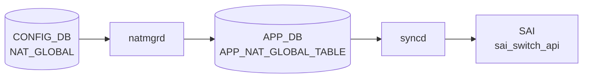

# NAT_GLOBAL / NAT_POOL テーブル

## 概要

`NAT_GLOBAL` は NAT feature の admin mode と timeout を保持するグローバル設定、`NAT_POOL` は dynamic NAT で利用する変換アドレス / port 範囲の named pool を定義する CONFIG_DB テーブル[^1]。同じ YANG モジュールには `NAT_BINDINGS`、`STATIC_NAT`、`STATIC_NAPT` も定義される。`schema.h` では APPL_DB 側に `NAT_GLOBAL_TABLE` と pool 系 table の定数がある[^2]。

<!-- cdb-mermaid -->
### データフロー (自動生成)



!!! note "凡例"
    CONFIG_DB から SAI までの典型経路を `docs/reference/config-db-orch-map.md` から機械生成したミニ図。詳細・例外は本ページ本文と対応表を参照。
<!-- /cdb-mermaid -->

## key 構造

```text
NAT_GLOBAL|Values
NAT_POOL|<name>
NAT_BINDINGS|<name>
```

`NAT_GLOBAL` は YANG 上 `container Values` を持つ singleton 的な形。`NAT_POOL` と `NAT_BINDINGS` は `name` が key。

## 主要フィールド

### NAT_GLOBAL

| フィールド | 型 | 既定値 | 説明 |
|-----------|----|--------|------|
| `admin_mode` | `admin_mode` | `disabled` | NAT feature の有効 / 無効 |
| `nat_timeout` | uint32 300..432000 | `600` | NAT entry timeout 秒 |
| `nat_tcp_timeout` | uint32 300..432000 | `86400` | TCP NAT entry timeout 秒 |
| `nat_udp_timeout` | uint16 120..600 | `300` | UDP NAT entry timeout 秒 |

### NAT_POOL

| フィールド | 型 | 必須 | 説明 |
|-----------|----|------|------|
| `nat_ip` | IP address range | yes | pool に含める単一 IP または IP 範囲 |
| `nat_port` | port range string | no | pool に含める L4 port 範囲 |

### NAT_BINDINGS

| フィールド | 型 | 必須 | 説明 |
|-----------|----|------|------|
| `nat_pool` | leafref `NAT_POOL.name` | yes | binding 対象の NAT pool |
| `nat_type` | enum `snat` / `dnat` | no | NAT 種別。既定は `snat` |
| `twice_nat_id` | uint16 1..9999 | no | dynamic twice NAT 用 ID |

## 制約

- `NAT_POOL` / `NAT_BINDINGS` はそれぞれ最大 16 entries。
- `name` は 1..32 文字、英数字で始まり、英数字 / `-` / `_` を利用可能。
- `nat_ip` は mandatory。
- `nat_port` は `start-end` 形式の port 範囲。
- `NAT_BINDINGS.nat_pool` は既存 `NAT_POOL` への leafref。

## 購読者

- `natmgrd`: CONFIG_DB の NAT 設定を読み、APPL_DB NAT table 群へ反映する。
- `orchagent` / `NatOrch`: APPL_DB の NAT global / pool / binding / static entry を消費し、SAI NAT object や kernel / ASIC 設定へ反映する。

## 関連 CONFIG_DB / YANG / CLI

- 関連 CONFIG_DB: `STATIC_NAT`、`STATIC_NAPT`、`NAT_BINDINGS`、`ACL_TABLE`
- 関連 CLI: `config nat`
- 関連 YANG: `sonic-nat`

<!-- ref-triangle:start -->

## 関連リファレンス

- YANG: [`sonic-nat`](../yang/sonic-nat.md)
- CLI: [`config nat`](../cli/config-nat.md)

<!-- ref-triangle:end -->

## 引用元

[^1]: YANG 定義: `sonic-nat.yang`. <https://github.com/sonic-net/sonic-buildimage/blob/9ea932ec2e18f35e58268ec2e4456b1d4afd65cd/src/sonic-yang-models/yang-models/sonic-nat.yang>
[^2]: テーブル名定数: `schema.h`. <https://github.com/sonic-net/sonic-swss-common/blob/158de8d3463ff4b841653f6d57190bb142b80d9c/common/schema.h>

<!-- topics-back-ref -->
## 関連 Topics

- [Topics: NAT / DHCP Relay / Time-DNS Services](../../topics/16-nat-dhcp-dns/index.md)

<!-- /topics-back-ref -->
