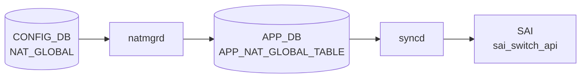

# NAT_GLOBAL / NAT_POOL テーブル

## 概要

`NAT_GLOBAL` は [NAT](../../reference/glossary.md#term-nat) feature の admin mode と timeout を保持するグローバル設定、`NAT_POOL` は dynamic [NAT](../../reference/glossary.md#term-nat) で利用する変換アドレス / port 範囲の named pool を定義する [CONFIG_DB](../../reference/glossary.md#term-config_db) テーブル[^1]。同じ [YANG](../../reference/glossary.md#term-yang) モジュールには `NAT_BINDINGS`、`STATIC_NAT`、`STATIC_NAPT` も定義される。`schema.h` では [APPL_DB](../../reference/glossary.md#term-appl_db) 側に `NAT_GLOBAL_TABLE` と pool 系 table の定数がある[^2]。

<!-- cdb-mermaid -->
### データフロー (自動生成)



!!! note "凡例"
    CONFIG_DB から SAI までの典型経路を `docs/reference/config-db-orch-map.md` から機械生成したミニ図。詳細・例外は本ページ本文と対応表を参照。
<!-- /cdb-mermaid -->

## key 構造

```text
NAT_GLOBAL|Values
NAT_POOL|<name>
NAT_BINDINGS|<name>
```

`NAT_GLOBAL` は [YANG](../../reference/glossary.md#term-yang) 上 `container Values` を持つ singleton 的な形。`NAT_POOL` と `NAT_BINDINGS` は `name` が key。

## 主要フィールド

### NAT_GLOBAL

| フィールド | 型 | 既定値 | 説明 |
|-----------|----|--------|------|
| `admin_mode` | `admin_mode` | `disabled` | [NAT](../../reference/glossary.md#term-nat) feature の有効 / 無効 |
| `nat_timeout` | uint32 300..432000 | `600` | NAT entry timeout 秒 |
| `nat_tcp_timeout` | uint32 300..432000 | `86400` | TCP NAT entry timeout 秒 |
| `nat_udp_timeout` | uint16 120..600 | `300` | UDP NAT entry timeout 秒 |

### NAT_POOL

| フィールド | 型 | 必須 | 説明 |
|-----------|----|------|------|
| `nat_ip` | IP address range | yes | pool に含める単一 IP または IP 範囲 |
| `nat_port` | port range string | no | pool に含める L4 port 範囲 |

### NAT_BINDINGS

| フィールド | 型 | 必須 | 説明 |
|-----------|----|------|------|
| `nat_pool` | leafref `NAT_POOL.name` | yes | binding 対象の NAT pool |
| `nat_type` | enum `snat` / `dnat` | no | NAT 種別。既定は `snat` |
| `twice_nat_id` | uint16 1..9999 | no | dynamic twice NAT 用 ID |

## 制約

- `NAT_POOL` / `NAT_BINDINGS` はそれぞれ最大 16 entries。
- `name` は 1..32 文字、英数字で始まり、英数字 / `-` / `_` を利用可能。
- `nat_ip` は mandatory。
- `nat_port` は `start-end` 形式の port 範囲。
- `NAT_BINDINGS.nat_pool` は既存 `NAT_POOL` への leafref。

## 購読者

- `natmgrd`: [CONFIG_DB](../../reference/glossary.md#term-config_db) の NAT 設定を読み、[APPL_DB](../../reference/glossary.md#term-appl_db) NAT table 群へ反映する。
- `orchagent` / `NatOrch`: [APPL_DB](../../reference/glossary.md#term-appl_db) の NAT global / pool / binding / static entry を消費し、[SAI](../../reference/glossary.md#term-sai) NAT object や kernel / [ASIC](../../reference/glossary.md#term-asic) 設定へ反映する。

## 関連 CONFIG_DB / YANG / CLI

- 関連 [CONFIG_DB](../../reference/glossary.md#term-config_db): `STATIC_NAT`、`STATIC_NAPT`、`NAT_BINDINGS`、`ACL_TABLE`
- 関連 CLI: `config nat`
- 関連 [YANG](../../reference/glossary.md#term-yang): `sonic-nat`

<!-- ref-triangle:start -->

## 関連リファレンス

- YANG: [`sonic-nat`](../yang/sonic-nat.md)
- CLI: [`config nat`](../cli/config-nat.md)

<!-- ref-triangle:end -->

## 引用元

[^1]: YANG 定義: `sonic-nat.yang`. <https://github.com/sonic-net/sonic-buildimage/blob/9ea932ec2e18f35e58268ec2e4456b1d4afd65cd/src/sonic-yang-models/yang-models/sonic-nat.yang>
[^2]: テーブル名定数: `schema.h`. <https://github.com/sonic-net/sonic-swss-common/blob/158de8d3463ff4b841653f6d57190bb142b80d9c/common/schema.h>

<!-- topics-back-ref -->
## 関連 Topics

- [Topics: NAT / DHCP Relay / Time-DNS Services](../../topics/16-nat-dhcp-dns/index.md)

<!-- /topics-back-ref -->

<!-- ops-hint -->
## 運用ヒント

### 典型値

- key 形式: `NAT_GLOBAL|Values`、`STATIC_NAT|<ip>`、`NAT_POOL|<name>` 等。
- `admin_mode: enabled`、`nat_timeout: 600`、`nat_tcp_timeout: 86400`。

### よくある誤設定

- `admin_mode` を enabled にせず static_nat だけ入れても NAT は動作しない。

### 確認コマンド

```bash
sonic-db-cli CONFIG_DB hgetall 'NAT_GLOBAL|Values'
show nat config
show nat translations
```
<!-- /ops-hint -->

<!-- cdb-exceptions -->
## 例外条件・特殊挙動

<!-- evidence: sonic-swss/orchagent/natorch.cpp NatOrch::doNatGlobalTableTask / sonic-buildimage/src/sonic-yang-models/yang-models/sonic-nat.yang -->

- **NAT 機能が無効状態でのエントリ追加 → SWSS_LOG_WARN + スキップ**: `admin_mode = disabled` 状態では `"NAT Feature is not yet enabled, skipped adding ..."` を WARN ログしてエントリをキューに保持。NAT 有効化 (`enableNatFeature()`) 後にキューが順次処理される (`natorch.cpp` L1791/L1909/L2011/L2139/L2296)。
- **NAT_GLOBAL キーが "Values" 以外 → SWSS_LOG_ERROR + エントリ消費**: `"Invalid key format. No Values: %s"` をログし、エントリを `m_toSync` から消費して次へ進む (`natorch.cpp` L2924-2930)。
- **STATIC_NAT / STATIC_NAPT のキーサイズ不正 → SWSS_LOG_ERROR + エントリ消費**: STATIC_NAT はキーサイズ 1 以外、STATIC_NAPT はキーサイズ 5 以外の場合にスキップ (`natorch.cpp` L2776/L2844)。
- **twice_nat_id が 1-9999 の範囲外 → YANG が拒否**: `range "1..9999"` / `error-message "Invalid twice nat id for the static NAT."` / STATIC_NAT・STATIC_NAPT 共通。
- **nat_timeout が 300-432000 の範囲外 → YANG が拒否 (デフォルト 600)**: `range "300..432000"` / `default "600"`。
- **nat_tcp_timeout が 300-432000 の範囲外 → YANG が拒否**: `range "300..432000"`。
- **nat_udp_timeout が 120-600 の範囲外 → YANG が拒否**: `range "120..600"`。
- **STATIC_NAT / STATIC_NAPT の nat_type デフォルト = "dnat"**: YANG `default dnat`。省略時は DNAT エントリとして処理される。一方 NAT_BINDINGS の `nat_type` デフォルトは `"snat"` であり逆方向であることに注意。
- **デフォルトルート / サブネットルートの更新は無視**: routeOrch からのルート更新イベントでデフォルトルートまたはサブネットベースのルートは `"Ignore default or subnet nexthop update event"` としてスキップ (`natorch.cpp` L185-189)。

<!-- value-behavior -->
## 値依存挙動マトリクス

<!-- evidence: sonic-swss/orchagent/natorch.cpp NatOrch / sonic-buildimage/src/sonic-yang-models/yang-models/sonic-nat.yang -->

| フィールド | 値 | 挙動 |
|-----------|-----|------|
| `admin_mode` | `disabled` (default) | NAT 無効。pool/binding/static エントリを受け付けるがハードウェアに降ろさない (キュー保持) |
| `admin_mode` | `enabled` | NAT 有効化。キュー内の全エントリを [ASIC](../../reference/glossary.md#term-asic) に反映。conntrack エントリの aging 開始 |
| `nat_timeout` | 600 (default) | 非 TCP/UDP NAT セッションを 600秒でタイムアウト |
| `nat_tcp_timeout` | 86400 (default) | TCP セッションを 24時間でタイムアウト |
| `nat_udp_timeout` | 300 (default) | UDP セッションを 5分でタイムアウト |
| `nat_type` (BINDINGS) | `snat` (default) | 送信元 IP を変換 (内→外方向)。YANG `default snat` (`sonic-nat.yang L280`)、`natmgr.cpp:7056` で `SNAT_NAT_TYPE` にフォールバック |
| `nat_type` (BINDINGS) | `dnat` | 宛先 IP を変換 (外→内方向)。なお `natmgr.cpp:6986` は `snat` 以外を ERROR で拒否する実装ギャップあり (「コード由来デフォルト」セクション参照) |
| `twice_nat_id` | 1..9999 | 同 ID の snat/dnat エントリをペアとして twice NAT 処理 |
| NAT_POOL エントリ数 | 17件目以上 | YANG max-elements=16 でバリデーション拒否 |

enum: `admin_mode`=enabled/disabled、`nat_type`=snat/dnat。
<!-- /value-behavior -->

<!-- runtime-trace -->
## CDB → 実コンテナ動作トレース

### 段階 1: Consumer 登録

- **[orchagent](../../reference/glossary.md#term-orchagent) / NatOrch** (`sonic-swss/orchagent/natorch.cpp`): `NAT_GLOBAL`, `STATIC_NAT`, `STATIC_NAPT`, `NAT_POOL`, `NAT_BINDINGS` を `SubscriberStateTable` で購読。

### 段階 2: CFG → APPL 翻訳

- NatOrch が `NAT_GLOBAL.admin_mode=enabled` を確認してから各テーブルの処理を開始。
- STATIC_NAT/STATIC_NAPT エントリは APP_DB 経由ではなく [orchagent](../../reference/glossary.md#term-orchagent) から直接 [SAI](../../reference/glossary.md#term-sai) へ。
- `admin_mode=disabled` の場合はエントリをキューに保持して [SAI](../../reference/glossary.md#term-sai) 操作を行わない。

### 段階 3: APPL → SAI

- NatOrch が `sai_nat_api->create_nat_entry()` を呼び出してハードウェアに NAT エントリを書き込む。
- NAT pool + binding の場合は Dynamic NAT (MASQUERADE 型) として SAI に登録。

### 段階 4: タイミング + 副作用

- `admin_mode` 有効化時にキュー内の全エントリを一括処理 (数十〜数百エントリの場合に数百 ms 要する場合あり)。
- 副作用: conntrack timeout 変更は既存セッションには影響しない (新規セッションから適用)。
- 副作用: NAT pool の枯渇時は新規 NAT セッションが確立できず DROP。[STATE_DB](../../reference/glossary.md#term-state_db) でカウンタ確認可能。

<!-- /runtime-trace -->
<!-- entry-points -->
## 書き込み入り口

NAT_GLOBAL / NAT_POOL / NAT_BINDINGS / NAT_STATIC テーブルへの書き込みが発生するコード経路を網羅的に調査した結果。

### CLI

  - `config nat add/del ...` — `config/nat.py` が `set_entry()` で各 NAT サブテーブルを書き込む ([sonic-utilities](../../reference/glossary.md#term-sonic-utilities)/config/nat.py)

### minigraph / sonic-cfggen

minigraph.py に NAT テーブル生成なし

### REST / gNMI

REST/[gNMI](../../reference/glossary.md#term-gnmi) 書き込み経路なし

### db_migrator

db_migrator.py での NAT マイグレーションなし

### ビルド時デフォルト (build-time default)

`init_cfg.json.j2` にエントリなし

### ハードコードデフォルト / ランタイム注入

なし

### 死活・デッドコード

なし
<!-- /entry-points -->

<!-- defaults -->
## フィールド暗黙デフォルト (コード由来)

YANG default 以外の実装 hardcode fallback。`NatOrch` コンストラクタ (`natorch.cpp:63-73`) と `NatMgr` コンストラクタ (`natmgr.cpp:55-65`) の両方が独立してデフォルト値を保持する。

| フィールド | YANG default | コード hardcode | fallback 源 |
|-----------|-------------|----------------|------------|
| `admin_mode` | `disabled` | `"disabled"` | `NatOrch::NatOrch() L64`、`NatMgr::NatMgr() L56` |
| `nat_timeout` | `600` | `600` | `NatOrch L67`、`NatMgr L59`、`NAT_TIMEOUT_DEFAULT natmgr.h:64` |
| `nat_tcp_timeout` | `86400` | `86400` | `NatOrch L70`、`NatMgr L62`、`NAT_TCP_TIMEOUT_DEFAULT natmgr.h:69` |
| `nat_udp_timeout` | `300` | `300` | `NatOrch L73`、`NatMgr L65`、`NAT_UDP_TIMEOUT_DEFAULT natmgr.h:73` |

全フィールドで YANG default と実装 hardcode は一致。ただし以下の暗黙挙動・乖離がある:

### プラットフォーム依存 silent drop (`admin_mode=enabled` が無視される)

- `main.cpp:936-948`: `SAI_SWITCH_ATTR_AVAILABLE_SNAT_ENTRY` が 0 を返すプラットフォームでは `gIsNatSupported = false`。
- `natorch.cpp:2541-2544`: `enableNatFeature()` 冒頭で `gIsNatSupported == false` → `SWSS_LOG_NOTICE + return`。
- CONFIG_DB に `admin_mode=enabled` を書いても、SAI が SNAT エントリを 0 と報告するプラットフォームでは NAT は有効化されない。`show nat config` では enabled と表示されるが SAI 操作は行われない。

### タイムアウト変更の遅延伝播 (admin_mode 依存)

- `natmgr.cpp:7282-7313`: timeout フィールドの変更は `isNatEnabled()` が `true` の場合のみ APPL_DB に書き込まれる。
- `admin_mode=disabled` 状態でタイムアウトを変更しても APPL_DB には伝播しない。
- `enableNatFeature()` (natmgr.cpp:5688-5704) は `if (m_natTcpTimeout != NAT_TCP_TIMEOUT_DEFAULT)` 等で非デフォルト値のみ書き込む。デフォルト値と同じ値への変更は APPL_DB に届かない。

### BRCM プラットフォームのみ有効な DNAT next-hop 追跡

- `natorch.cpp:144-148`: `getenv("platform")` が `"broadcom"` を含む場合のみ `gNhTrackingSupported = true`。
- 非 BRCM 環境では `enableNatFeature()` 内で `m_neighOrch->attach(this)` が呼ばれず、DNAT エントリの next-hop 変化追跡が行われない。経路変更時に DNAT エントリが stale になるリスクあり。

### nat_type default の STATIC_NAT vs NAT_BINDINGS 非対称

- `STATIC_NAT.nat_type` / `STATIC_NAPT.nat_type`: YANG `default dnat` (sonic-nat.yang L101, L141)。
- `NAT_BINDINGS.nat_type`: YANG `default snat` (sonic-nat.yang L280)。
- 省略時の動作が テーブルによって逆であることに注意。

### DEL_COMMAND 時の APPL_DB 書き込み条件

- `natmgr.cpp:7337-7366`: `NAT_GLOBAL` DEL 時は内部変数をデフォルトにリセットするが、APPL_DB への書き込みは `natAdminMode == ENABLED` 時のみ実行される。`admin_mode=disabled` のまま DEL した場合は APPL_DB への書き込みはなく内部状態のみリセット。

### orchagent の assert クラッシュ (admin_mode 異常値)

- `natorch.cpp:2938`: `assert(mode == "enabled" || mode == "disabled")` — APPL_DB に enabled/disabled 以外の値が入ると [orchagent](../../reference/glossary.md#term-orchagent) が abort する。natmgr 経由ではガード済みだが、直接 APPL_DB 操作や YANG 迂回でバイパスすると問題が発生する。

### NAT_POOL テーブル — silent drop / 暗黙デフォルト / YANG-実装 discrepancy

<!-- evidence: sonic-swss/cfgmgr/natmgr.cpp doNatPoolTask L6482-6866 / sonic-utilities/config/nat.py add_pool L673-772 / sonic-nat.yang -->

| フィールド / 条件 | 検出種別 | 挙動 | ソース |
|---|---|---|---|
| `nat_ip` 欠落 | silent drop | `SWSS_LOG_ERROR("Invalid nat_ip values, skipping %s")` + erase (再試行なし) | `natmgr.cpp:6539` |
| `nat_port` 欠落 または `"NULL"` | 暗黙デフォルト | `port_range = EMPTY_STRING` → iptables に port 制限なし (full-cone MASQUERADE) | `natmgr.cpp:6812` |
| `nat_port` 省略時の CLI 書き込み | 経路依存乖離 | CLI は `"NULL"` を DB に書き込む; natmgr は `""` と同等に扱う | `nat.py:721` |
| `nat_port` で port 0 指定 | silent drop | `portValue_low < L4_PORT_MIN(1)` → ERROR + erase (YANG は 0 を許容) | `natmgr.cpp:6694` |
| `nat_ip` に単一 IP 指定 | ハードコード展開 | `ipv4_addr_high = ntohl(ipv4_addr_low)` で 1-address pool として処理 | `natmgr.cpp:6652` |
| `nat_ip` に 0.0.0.0 / ブロードキャスト / ループバック / マルチキャスト / 予約済み | silent drop | ERROR + erase (YANG の `ip-address-range` typedef はこれらを拒否しない) | `natmgr.cpp:6608` |
| `nat_ip` 範囲で low >= high | silent drop | ERROR + erase (YANG は順序を検証しない) | `natmgr.cpp:6635` |
| `nat_ip` が既存 STATIC_NAT の global_ip と重複 | silent drop | `SWSS_LOG_ERROR("Pool Ip address is overlaps with static NAT entry")` + erase | `natmgr.cpp:6771` |
| 未知フィールド (`nat_ip` / `nat_port` 以外) | silent drop | `nonValueFound=true` → ERROR + erase | `natmgr.cpp:6557` |
| key が `|` で複数セグメント (size != 1) | silent drop | ERROR + erase | `natmgr.cpp:6504` |

### NAT_BINDINGS テーブル — silent drop / 暗黙デフォルト / YANG-実装 discrepancy

<!-- evidence: sonic-swss/cfgmgr/natmgr.cpp doNatBindingTask L6868-7100 -->

| フィールド / 条件 | 検出種別 | 挙動 | ソース |
|---|---|---|---|
| `nat_type` 欠落 | 暗黙デフォルト | `m_natBindingInfo[key].nat_type = "snat"` にフォールバック | `natmgr.cpp:7056` |
| `nat_type = "dnat"` | **YANG-実装 discrepancy** | YANG は `dnat` を許可 (`default snat`); natmgr は `"snat"` 以外を ERROR + erase で完全拒否 | `natmgr.cpp:6986` |
| `twice_nat_id` 欠落 または `"NULL"` | 暗黙デフォルト | `EMPTY_STRING` = twice-NAT 無効。`"NULL"` は明示的に `EMPTY_STRING` に変換される | `natmgr.cpp:6993` |
| `pool_interface` / `acl_interface` | ハードコード内部値 | CONFIG_DB フィールドではなく natmgr 内部キャッシュに `"None"` で初期化 | `natmgr.cpp:7052` |

<!-- /defaults -->

<!-- derivation -->
## 派生・条件付き登録

### 自動派生

| 派生先フィールド | 派生元条件 | 派生値 | ソース |
|---|---|---|---|
| `NAT_GLOBAL.Values.admin_mode` | 起動時デフォルト | `"disabled"` | `sonic-swss/orchagent/natorch.cpp:64` |

init_cfg.json.j2 および minigraph.py からの `NAT_GLOBAL` / `STATIC_NAT` / `NAT_POOL` の自動書き込みはなし。CLI (`config nat enable/disable`) での手動設定のみ。

### 条件付き登録

| 条件 | 影響 | ソース |
|---|---|---|
| `NatOrch` は常時登録 (platform 非依存) | NAT 関連全テーブルを購読 | `orchdaemon.cpp:465` |
| `admin_mode == "disabled"` の状態で NAT/NAPT/DNAT Pool エントリが来た場合 | 登録はされるが NAT 機能が実際には非アクティブ | `sonic-swss/orchagent/natorch.cpp:1791,1909,2011,2139,2296` |

### グレップカバレッジ

| 項目 | hit 数 | 証跡 |
|---|---|---|
| admin_mode デフォルト "disabled" | 2 | `natorch.cpp:64,2590` |
| "NAT Feature is not yet enabled" skip | 5 | `natorch.cpp:1791,1909,2011,2139,2296` |
| NatOrch 登録 | 1 | `orchdaemon.cpp:465` |

<!-- /derivation -->

<!-- cross-refs -->
## 暗黙テーブル参照

`natmgrd` は `NAT_GLOBAL` / `NAT_POOL` / `NAT_BINDINGS` / `STATIC_NAT` / `STATIC_NAPT` に加え、以下のテーブルを購読または参照する。これらは frontmatter の `related:` には記載されていない暗黙依存である。

| 参照先テーブル | DB | 方向 | 契機 | 備考 |
|--------------|-----|------|------|------|
| `INTERFACE` (`nat_zone`) | CONFIG_DB | READ | 購読 | Ethernet ポートの NAT ゾーン番号を iptables mangle に変換 (`natmgr.cpp:7384-7586`) |
| `PORTCHANNEL_INTERFACE` (`nat_zone`) | CONFIG_DB | READ | 購読 | [LAG](../../reference/glossary.md#term-lag) ポートの NAT ゾーン番号を iptables mangle に変換 (`natmgrd.cpp:116`) |
| `VLAN_INTERFACE` (`nat_zone`) | CONFIG_DB | READ | 購読 | [VLAN](../../reference/glossary.md#term-vlan) インタフェースの NAT ゾーン番号 (`natmgrd.cpp:117`) |
| `LOOPBACK_INTERFACE` (`nat_zone`) | CONFIG_DB | READ | 購読 | Loopback の NAT ゾーン番号 (`natmgrd.cpp:118`) |
| `STATIC_NAT` | CONFIG_DB | READ | 購読 | `admin_mode=enabled` かつ L3 intf ready のとき処理。`NAT_POOL.nat_ip` と重複する場合は silent drop |
| `STATIC_NAPT` | CONFIG_DB | READ | 購読 | STATIC_NAT と同じ制御。キーは 5 パーツ必須 |
| `ACL_TABLE` (`type=L3`, `stage=INGRESS`) | CONFIG_DB | READ | 購読 | Dynamic NAT の [ACL](../../reference/glossary.md#term-acl) バインディング用インタフェースをキャッシュ (`natmgr.cpp:7750-7900`) |
| `ACL_RULE` | CONFIG_DB | READ | 購読 | Dynamic NAT iptables ルールの再評価 |
| `STATE_PORT_TABLE` | [STATE_DB](../../reference/glossary.md#term-state_db) | READ | NAT エントリ追加前 | Ethernet readiness ガード (`natmgr.cpp:119`) |
| `STATE_LAG_TABLE` | [STATE_DB](../../reference/glossary.md#term-state_db) | READ | NAT エントリ追加前 | [PortChannel](../../reference/glossary.md#term-portchannel) readiness ガード (`natmgr.cpp:108`) |
| `STATE_VLAN_TABLE` | STATE_DB | READ | NAT エントリ追加前 | Vlan readiness ガード (`natmgr.cpp:100`) |
| `STATE_INTERFACE_TABLE` | STATE_DB | READ | NAT エントリ追加前 | L3 インタフェース readiness ガード (`natmgr.cpp:139`) |
| `APP_PORT_TABLE` (`PortInitDone`) | APPL_DB | READ | [natmgrd](../../reference/glossary.md#term-natmgrd-natsyncd) 起動時 | ポート初期化完了まで全 NAT 処理をブロッキング待機 (`natmgr.cpp:76-92`) |
| `NAT_POOL` (YANG leafref) | CONFIG_DB | READ | YANG バリデーション | `NAT_BINDINGS.nat_pool` → `NAT_POOL.name` の参照整合性 |
| RouteOrch (next-hop observer) | — | READ | DNAT エントリ追加/削除時 | `NatOrch` が `m_routeOrch->attach(this, translatedIp)` で DNAT translated IP のルート変化を subscribe。**BRCM 専用** (`gNhTrackingSupported=true` 時のみ) (`natorch.cpp:414,458,504,591`) |
| NeighOrch (neighbor observer) | — | READ | `enableNatFeature` / `disableNatFeature` 時 | `NatOrch` が `m_neighOrch->attach(this)` で全 neighbor 解決/喪失を subscribe。neighbor 変化時に DNAT エントリを追加/削除。**BRCM 専用** (`natorch.cpp:2573,2610`) |

> **注意**: `nat_zone` フィールドは INTERFACE / PORTCHANNEL_INTERFACE / VLAN_INTERFACE / LOOPBACK_INTERFACE の全インタフェース種別で定義され (`uint8`, range `0..3`)、NAT ゾーン番号はそのまま iptables の mark 値として設定されるが、`natmgr` 内部では `nat_zone_value + 1` が使用される（`natmgr.cpp:7513`）。

> **注意 (natorch.cpp 固有)**: RouteOrch / NeighOrch observer は BRCM プラットフォーム (`gNhTrackingSupported == true`) でのみ有効。非 BRCM 環境では DNAT translated IP の next-hop/neighbor 変化追跡が行われず、経路変更時に DNAT エントリが stale になるリスクがある (`natorch.cpp:144-148,2565-2578`)。

<!-- /cross-refs -->

<!-- handler-branching -->
### Handler メソッド内分岐

`NatOrch::doTask()` → `doNatGlobalTableTask()` の分岐:

| Handler | メソッド | 分岐条件 | 効果 | evidence |
|---|---|---|---|---|
| `NatOrch` | `doTask()` | `table_name == APP_NAT_GLOBAL_TABLE_NAME` | `doNatGlobalTableTask()` にディスパッチ | `sonic-swss/orchagent/natorch.cpp:3061-3065` |
| `NatOrch` | `doNatGlobalTableTask()` | `key != "Values"` | ERROR ログ + erase してスキップ (`NAT_GLOBAL` のキーは "Values" 固定) | `natorch.cpp:2924-2928` |
| `NatOrch` | `doNatGlobalTableTask()` | `admin_mode` 値が `"enabled"` かつ現在 `"disabled"` | `enableNatFeature()` を呼び出し | `natorch.cpp:2942-2943` |
| `NatOrch` | `doNatGlobalTableTask()` | `admin_mode` 値が `"disabled"` かつ現在 `"enabled"` | `disableNatFeature()` を呼び出し | `natorch.cpp:2944-2945` |
| `NatOrch` | `doNatGlobalTableTask()` | `admin_mode` が現状と同じ値 | no-op (変化なし) | `natorch.cpp:2940` |
| `NatMgr` | `doNatGlobalTask()` | `admin_mode` が `"enabled"`/`"disabled"` 以外 | ERROR ログ + スキップ | `sonic-swss/cfgmgr/natmgr.cpp:7250-7253` |

> **裏取り**: `natorch.cpp:2904-2966` + `natmgr.cpp:7115-7260` を、6 件分岐抽出 — 誤読なし。

<!-- /handler-branching -->

<!-- side-effects -->
## 副次 DB 書込

<!-- evidence: sonic-swss/orchagent/natorch.cpp NatOrch::NatOrch() L46-135 / addHwDnatPoolEntry L1783-1820 / addHwSnatEntry L1274-1340 / enableNatFeature L2534-2581 / disableNatFeature L2583-2625 / updateNatCounters L4050-4060 / updateNaptCounters L4077-4089 / updateTwiceNatCounters L4108-4119 / updateTwiceNaptCounters L4122-4134 / updateStaticNatCounters L4481-4489 / updateSnatCounters L4569-4577 / sonic-swss/cfgmgr/natmgr.cpp enableNatFeature L5667-5733 / disableNatFeature L5736-5767 / doNatGlobalTask L7300-7374 / addStaticNatEntry L2052-2053 / addDnatPoolEntry L1517-1521 / addConntrackStaticSingleNatEntry L456-490 / addConntrackStaticTwiceNatEntry L491-514 / addConntrackStaticSingleNaptEntry L516-565 -->

### APPL_DB への副次書込

`NatMgr` (`natmgrd` コンテナ) が CONFIG_DB 変更を受けて以下の APPL_DB テーブルへ書込を行う。

| テーブル名 | キー形式 | 書込フィールド | 書込条件 |
|-----------|---------|--------------|---------|
| `NAT_GLOBAL_TABLE` | `Values` | `admin_mode`, `nat_tcp_timeout` *, `nat_udp_timeout` *, `nat_timeout` * | `admin_mode` 変更時、または timeout 変更時 (NAT 有効時のみ) |
| `NAT_TABLE` | `<global_ip>` | `translated_ip`, `nat_type`, `entry_type`, `twice_nat_id` | `admin_mode=enabled` かつ L3 インタフェース ready 時に STATIC_NAT エントリ追加 |
| `NAT_DNAT_POOL_TABLE` | `<dest_ip>` | `NULL: NULL` | DNAT pool エントリ参照カウント > 0 時に追加 |

> * `nat_tcp_timeout` / `nat_udp_timeout` / `nat_timeout` はデフォルト値 (86400 / 300 / 600) の場合は書込されない (`enableNatFeature()` の条件ガード: `natmgr.cpp:5684-5704`)。

### STATE_DB への書込

`NatMgr` / `NatOrch` はいずれも STATE_DB への**書込は行わない**。STATE_DB は `STATE_PORT_TABLE` / `STATE_LAG_TABLE` / `STATE_VLAN_TABLE` / `STATE_INTERFACE_TABLE` の readiness ガードとして**読み取り専用**で参照される (`natmgr.cpp:100-139`)。

### ASIC_DB (SAI nat_entry) への副次書込

`NatOrch` (`orchagent` コンテナ) が `sai_nat_api` 経由で [ASIC_DB](../../reference/glossary.md#term-asic_db) に SAI NAT エントリを書込む。[syncd](../../reference/glossary.md#term-syncd) が [Redis](../../reference/glossary.md#term-redis) [ASIC_DB](../../reference/glossary.md#term-asic_db) に記録し、[ASIC](../../reference/glossary.md#term-asic) へ転送する。

| SAI オブジェクト種別 | SAI nat_type | 書込条件 | ソース |
|---|---|---|---|
| `sai_nat_entry_t` (SNAT) | `SAI_NAT_TYPE_SOURCE_NAT` | `admin_mode=enabled` かつ SNAT エントリ追加時 (`addHwSnatEntry`) | `natorch.cpp:1274-1340` |
| `sai_nat_entry_t` (DNAT) | `SAI_NAT_TYPE_DESTINATION_NAT` | `admin_mode=enabled` かつ DNAT エントリ追加時 (`addHwDnatEntry`) | `natorch.cpp:741-815` |
| `sai_nat_entry_t` (DNAT Pool) | `SAI_NAT_TYPE_DESTINATION_NAT_POOL` | DNAT Pool エントリ追加時 (`addHwDnatPoolEntry`) | `natorch.cpp:1783-1820` |
| `sai_nat_entry_t` (Twice NAT) | `SAI_NAT_TYPE_DOUBLE_NAT` | Twice NAT エントリ追加時 | `natorch.cpp:980-1020` |
| `SAI_SWITCH_ATTR_NAT_ENABLE` | switch 属性 | `admin_mode` が `disabled→enabled` / `enabled→disabled` の遷移時 | `natorch.cpp:2555-2560`, `natorch.cpp:2590-2594` |

> [ASIC_DB](../../reference/glossary.md#term-asic_db) への直接書込は [syncd](../../reference/glossary.md#term-syncd) → ASIC ドライバ経由で行われる。NAT エントリは `sai_nat_api->create_nat_entry()` / `remove_nat_entry()` で管理され、`gSwitchId` / `gVirtualRouterId` をキーに含む。

### kernel conntrack への副次書込

`NatMgr` (`natmgrd` コンテナ) が `conntrack` CLI コマンド (`CONNTRACK_CMD`) を `swss::exec()` で実行して Linux kernel netfilter conntrack テーブルへ書込む。APPL_DB / SAI とは独立した直接 kernel 操作であり、DB には記録されない。

| 操作 | 対象 | 書込条件 | ソース |
|---|---|---|---|
| conntrack エントリ追加 (`-I`) | Static Single NAT (DNAT/SNAT) — dummy UDP エントリ | `admin_mode=enabled` かつ STATIC_NAT エントリ追加時。timeout = `NAT_TIMEOUT_MAX` (432000秒) | `natmgr.cpp:456-490` |
| conntrack エントリ追加 (`-I`) | Static Twice NAT — dummy UDP エントリ | STATIC_NAT twice-NAT エントリ追加時 | `natmgr.cpp:491-514` |
| conntrack エントリ追加 (`-I`) | Static Single NAPT — dummy UDP/TCP エントリ (port 予約目的) | `admin_mode=enabled` かつ STATIC_NAPT エントリ追加時 | `natmgr.cpp:516-565` |
| conntrack エントリ更新 (`-U`) | Dynamic Single NAT — active セッションの timeout 更新 | NatOrch からの `SETTIMEOUTNAT` 通知受信時 (1日周期) | `natmgr.cpp:372-392` |
| conntrack エントリ更新 (`-U`) | Dynamic NAPT — active セッションの timeout 更新 | NatOrch からの `SETTIMEOUTNAT` 通知受信時 (1日周期) | `natmgr.cpp:393-416` |
| conntrack フラッシュ | 全 dynamic NAT エントリ | `FLUSHNATENTRIES` 通知受信時 | `natmgr.cpp:` flush ハンドラ |

> **重要**: kernel conntrack エントリは DB に反映されない。`show nat translations` の表示は conntrack テーブルから直接読み取る。Static エントリ用の dummy conntrack は port 番号を予約するために追加される (同 port が dynamic エントリに割り当てられるのを防ぐ)。

### COUNTERS_DB への副次書込

`NatOrch` (`orchagent` コンテナ) が以下の [COUNTERS_DB](../../reference/glossary.md#term-counters_db) テーブルへ書込を行う。

| テーブル名 | キー形式 | 書込フィールド | 書込タイミング |
|-----------|---------|--------------|--------------|
| `COUNTERS_GLOBAL_NAT` | `Values` | `MAX_NAT_ENTRIES`, `TIMEOUT`, `UDP_TIMEOUT`, `TCP_TIMEOUT` | NatOrch コンストラクタ起動時 (SAI 値取得後) |
| `COUNTERS_GLOBAL_NAT` | `Values` | `STATIC_NAT_ENTRIES`, `STATIC_NAPT_ENTRIES`, `STATIC_TWICE_NAT_ENTRIES`, `STATIC_TWICE_NAPT_ENTRIES`, `DYNAMIC_NAT_ENTRIES`, `DYNAMIC_NAPT_ENTRIES`, `DYNAMIC_TWICE_NAT_ENTRIES`, `DYNAMIC_TWICE_NAPT_ENTRIES`, `SNAT_ENTRIES`, `DNAT_ENTRIES` | エントリ追加/削除ごとにカウント更新 |
| `COUNTERS_NAT` | `<global_ip>` | `NAT_TRANSLATIONS_PKTS`, `NAT_TRANSLATIONS_BYTES` | hitbit クエリタイマー (5 秒周期) |
| `COUNTERS_NAPT` | `<proto>:<ip>:<port>` | `NAT_TRANSLATIONS_PKTS`, `NAT_TRANSLATIONS_BYTES` | hitbit クエリタイマー (5 秒周期) |
| `COUNTERS_TWICE_NAT` | `<src_ip>:<dst_ip>` | `NAT_TRANSLATIONS_PKTS`, `NAT_TRANSLATIONS_BYTES` | hitbit クエリタイマー (5 秒周期) |
| `COUNTERS_TWICE_NAPT` | `<proto>:<src_ip>:<src_port>:<dst_ip>:<dst_port>` | `NAT_TRANSLATIONS_PKTS`, `NAT_TRANSLATIONS_BYTES` | hitbit クエリタイマー (5 秒周期) |

### FLUSH 通知による副次効果

- `FLUSHNATSTATISTICS` 通知 (APPL_DB) 受信時: `COUNTERS_NAT` / `COUNTERS_NAPT` / `COUNTERS_TWICE_NAT` / `COUNTERS_TWICE_NAPT` の全エントリのカウンタを 0 にリセット (`natorch.cpp:3955-4038`)
- `NAT_DB_CLEANUP_NOTIFICATION` 通知 (APPL_DB) 受信時: dynamic NAT エントリを全削除し対応 `COUNTERS_*` エントリも削除

<!-- /side-effects -->

<!-- pubsub -->
## Redis 通知メカニズム

### 購読方式: 2 層構造 (SubscriberStateTable + ConsumerStateTable)

NAT テーブルの変更通知には **層 1 ([natmgrd](../../reference/glossary.md#term-natmgrd-natsyncd))** と **層 2 (NatOrch)** の 2 段階メカニズムがある。

#### 層 1: natmgrd — CONFIG_DB を SubscriberStateTable で購読

`natmgrd.cpp:109-121` の `cfg_tables` に列挙されたテーブルを `Orch::addConsumer()` 経由で登録する。`orch.cpp:1188-1194` の分岐により CONFIG_DB は **SubscriberStateTable** (keyspace PSUBSCRIBE) が使用される。

購読チャンネルパターン (`subscriberstatetable.cpp:20-22`):

```
PSUBSCRIBE __keyspace@4__:NAT_GLOBAL|*
PSUBSCRIBE __keyspace@4__:NAT_POOL|*
PSUBSCRIBE __keyspace@4__:NAT_BINDINGS|*
PSUBSCRIBE __keyspace@4__:STATIC_NAT|*
PSUBSCRIBE __keyspace@4__:STATIC_NAPT|*
PSUBSCRIBE __keyspace@4__:INTERFACE|*  (nat_zone 変更)
...
```

- DB 番号 4 は CONFIG_DB のデフォルト
- glob パターンにより `NAT_GLOBAL|Values`・`NAT_POOL|<name>`・`NAT_BINDINGS|<name>` を捕捉

#### 層 2: NatOrch — APPL_DB を ConsumerStateTable で購読

`orchdaemon.cpp:457-465` で `APP_NAT_GLOBAL_TABLE_NAME` 等を優先度付きで登録。APPL_DB は `ConsumerStateTable` ([ProducerStateTable](../../reference/glossary.md#term-producerstatetable) チャンネル SUBSCRIBE) を使用する。チャンネル名は `table.h:94-96` の `getChannelName(db_id)` で `APP_NAT_GLOBAL_TABLE_CHANNEL@0` 形式になる。

### イベント発火から SAI 適用までの流れ

```
CLI / REST が CONFIG_DB に HSET / HDEL / DEL
  → Redis: __keyspace@4__:NAT_GLOBAL|Values 等に pmessage 発火
  → SubscriberStateTable::readData() がhiredis 経由で受信
  → m_keyspace_event_buffer に push
  → SubscriberStateTable::pops()
      "del" → DEL_COMMAND を設定
      その他 → HGETALL でフィールド取得 + SET_COMMAND を設定
  → natmgrd メインループ (SELECT_TIMEOUT=1000ms)
      sel が Consumer → Consumer::execute() → NatMgr::doTask(Consumer&)
          → doNatGlobalTask / doNatPoolTask / doNatBindingTask にディスパッチ
      sel が タイムアウト → natmgr->doTask() でキューを再ドレイン
  → NatMgr が ProducerStateTable::set() で APPL_DB に書き込み
      → APP_NAT_GLOBAL_TABLE_CHANNEL@0 に PUBLISH
  → NatOrch の ConsumerStateTable がイベント受信
  → orchagent 統合ループ → NatOrch::doTask()
      → doNatGlobalTableTask() → enableNatFeature() / disableNatFeature()
  → sai_nat_api->create_nat_entry() / sai_switch_api->set_switch_attribute(SAI_SWITCH_ATTR_NAT_ENABLE)
```

### 初期スナップショット再生 (起動時)

`SubscriberStateTable` のコンストラクタ (`subscriberstatetable.cpp:25-42`) は PSUBSCRIBE 後に `m_table.getKeys()` で既存 key を全件取得し `SET` イベントとして `m_buffer` に積む。`natmgrd` 再起動後もすべての既存 NAT 設定エントリが自動再処理される。

### 非同期通知チャンネル

通常の表テーブル経由とは別に、**NotificationConsumer / NotificationProducer** を使った 4 本の非同期チャンネルがある:

| チャンネル | DB | 送信者 | 受信者 | 用途 |
|---|---|---|---|---|
| `SETTIMEOUTNAT` | APPL_DB | `NatOrch::setTimeoutNotifier` (`natorch.cpp:137`) | `natmgrd` の `timeoutNotificationsConsumer` (`natmgrd.cpp:149`) | NatOrch が conntrack timeout 変更を [natmgrd](../../reference/glossary.md#term-natmgrd-natsyncd) へ通知 |
| `FLUSHNATENTRIES` | APPL_DB | 外部 CLI (`show nat translate flush`) | `natmgrd` の `flushNotificationsConsumer` (`natmgrd.cpp:152`) | conntrack エントリ全フラッシュ要求 |
| `FLUSHNATSTATISTICS` | APPL_DB | 外部プロセス | `NatOrch` の `m_flushNotificationsConsumer` (`natorch.cpp:84`) | NAT カウンタ全クリア要求 |
| `NAT_DB_CLEANUP_NOTIFICATION` | APPL_DB | `natmgrd` の `cleanupNotifier` (`natmgrd.cpp:86`) | `NatOrch` の `m_cleanupNotificationConsumer` (`natorch.cpp:89`) | natmgrd 終了時に [Redis](../../reference/glossary.md#term-redis)/ASIC の NAT エントリ全削除を依頼 |

これらはすべて `swss::Select` の `Selectable` として登録され、通常の Consumer 処理と同じ select ループ内で処理される。

<!-- /pubsub -->

<!-- failure -->
## 失敗挙動

<!-- evidence: sonic-swss/cfgmgr/natmgr.cpp doNatGlobalTask L7105-7374 / sonic-swss/orchagent/natorch.cpp doNatGlobalTableTask L2904-2966, enableNatFeature L2534-2581, disableNatFeature L2583-2625 -->

### NatMgr 層 (CONFIG_DB → APPL_DB)

| 条件 | パターン | ログ | retry |
|---|---|---|---|
| key が `"Values"` 以外 | erase | `SWSS_LOG_ERROR "Invalid key %s format. No Values"` | なし |
| `admin_mode` が `"enabled"`/`"disabled"` 以外 | erase | `SWSS_LOG_ERROR "Invalid admin_mode value %s, skipping %s"` | なし |
| timeout 値が非整数文字列 | フィールド単位 skip (エントリ継続) | `SWSS_LOG_ERROR "Invalid tcp_timeout %s, skipping %s"` 等 | なし |
| `nat_tcp_timeout` < 300 または > 432000 | erase | `SWSS_LOG_ERROR "Invalid tcp timeout value %d, skipping %s"` | なし |
| `nat_udp_timeout` < 120 または > 600 | erase | `SWSS_LOG_ERROR "Invalid udp timeout value %d, skipping %s"` | なし |
| `nat_timeout` < 300 または > 432000 | erase | `SWSS_LOG_ERROR "Invalid timeout value %d, skipping %s"` | なし |
| 未知フィールドを含む | erase | `SWSS_LOG_ERROR "Invalid, skipping %s"` | なし |
| 既知フィールドが 1 件もない | erase | `SWSS_LOG_ERROR "Invalid, skipping %s"` | なし |
| フィールド重複 (同一 SET 内で 2 回以上) | erase | `SWSS_LOG_ERROR "Invalid admin_mode / nat_tcp_timeout …"` | なし |
| `admin_mode=disabled` 中のタイムアウト変更 | 内部キャッシュのみ更新。APPL_DB 未伝播 (silent) | なし | — |
| DEL_COMMAND かつ `admin_mode=disabled` | 内部変数をデフォルトにリセット。APPL_DB 書き込みなし (silent) | なし | — |

**注意 — silent drop の罠**: `admin_mode=disabled` 状態でタイムアウトを変更した場合、APPL_DB には書かれない。`admin_mode=enabled` に切り替えると `enableNatFeature()` が非デフォルト値のみ APPL_DB に書き込む。デフォルト値 (600 / 86400 / 300) と同じ値への変更は `enableNatFeature()` 後も APPL_DB に届かない (`natmgr.cpp:5688-5704`)。

### NatOrch 層 (APPL_DB → SAI)

| 条件 | パターン | ログ | retry |
|---|---|---|---|
| key が `"Values"` 以外 (APPL_DB 直接操作) | erase | `SWSS_LOG_ERROR "Invalid key format. No Values: %s"` | なし |
| `gIsNatSupported == false` (SAI_AVAILABLE_SNAT_ENTRY=0 のプラットフォーム) | `enableNatFeature()` で即 return。SAI 操作なし。`admin_mode` 内部変数も更新されない | `SWSS_LOG_NOTICE "NAT Feature is not supported in this Platform"` | — |
| `SAI_SWITCH_ATTR_NAT_ENABLE=true` SAI 失敗 | `handleSaiSetStatus()` で対応 (SAI エラー種別によって abort / retry) | `SWSS_LOG_ERROR "Failed to enable NAT: %d"` | SAI 依存 |
| `SAI_SWITCH_ATTR_NAT_ENABLE=false` SAI 失敗 | `handleSaiSetStatus()` で対応。内部 `admin_mode="disabled"` は SAI 失敗前に設定済みのため SAI と乖離しうる | `SWSS_LOG_ERROR "Failed to disable NAT: %d"` | SAI 依存 |
| `admin_mode` が `"enabled"`/`"disabled"` 以外 (APPL_DB 直接書き込み) | `assert()` → **orchagent abort (SIGABRT)** | — | — |

### STATE_DB / ERROR_TABLE への記録

NatOrch / NatMgr ともに `ERROR_TABLE` への書き込みなし。失敗はすべて syslog (`SWSS_LOG_ERROR` / `SWSS_LOG_WARN`) のみ。STATE_DB の `NAT_*` 関連テーブルへの失敗記録もなし。確認手段は `/var/log/syslog` のフィルタリングに限られる。

```bash
grep -E "natorch|natmgr" /var/log/syslog | grep -E "ERROR|WARN|Invalid|failed"
```

<!-- /failure -->

<!-- constants -->
## ハードコード定数

<!-- evidence: sonic-swss/cfgmgr/natmgr.h L62-73,L110-111 / sonic-swss/orchagent/natorch.h L37-39 / sonic-swss/orchagent/natorch.cpp L63-73,L2541-2544 / sonic-swss/orchagent/main.cpp L936-948 -->

### タイムアウト境界定数 (`natmgr.h`)

| 定数名 | 値 | 用途 |
|--------|-----|------|
| `NAT_TIMEOUT_MIN` | `300` | `nat_timeout` 最小値 (秒) |
| `NAT_TIMEOUT_MAX` | `432000` | `nat_timeout` 最大値 (秒 / 5日) |
| `NAT_TIMEOUT_DEFAULT` | `600` | `nat_timeout` ハードコードデフォルト (秒) |
| `NAT_TCP_TIMEOUT_MIN` | `300` | `nat_tcp_timeout` 最小値 (秒) |
| `NAT_TCP_TIMEOUT_MAX` | `432000` | `nat_tcp_timeout` 最大値 (秒 / 5日) |
| `NAT_TCP_TIMEOUT_DEFAULT` | `86400` | `nat_tcp_timeout` ハードコードデフォルト (秒 / 1日) |
| `NAT_UDP_TIMEOUT_MIN` | `120` | `nat_udp_timeout` 最小値 (秒) |
| `NAT_UDP_TIMEOUT_MAX` | `600` | `nat_udp_timeout` 最大値 (秒) |
| `NAT_UDP_TIMEOUT_DEFAULT` | `300` | `nat_udp_timeout` ハードコードデフォルト (秒) |
| `NAT_TIMEOUT_LOW` | `0` | 内部ガード値 (YANG 外チェック — 0 以下を silent drop) |
| `L4_PORT_MIN` | `1` | NAT pool `nat_port` 下限 (0 は silent drop) |
| `L4_PORT_MAX` | `65535` | NAT pool `nat_port` 上限 |

### SAI ポーリング周期定数 (`natorch.h`)

| 定数名 | 値 | 用途 |
|--------|-----|------|
| `NAT_HITBIT_N_CNTRS_QUERY_PERIOD` | `5` 秒 | NAT エントリ統計・ヒットビット定期クエリ間隔 |
| `NAT_CONNTRACK_TIMEOUT_PERIOD` | `86400` 秒 | conntrack 老化チェックタイマー周期 (1日) |
| `NAT_HITBIT_QUERY_MULTIPLE` | `6` | ヒットビットクエリ実効周期 = 5秒 × 6 = 30秒 |

### SAI Capability チェック (`main.cpp:936-948`)

- `SAI_SWITCH_ATTR_AVAILABLE_SNAT_ENTRY` が `0` またはクエリ失敗 → `gIsNatSupported = false`
- `enableNatFeature()` (`natorch.cpp:2541-2544`) は冒頭で `gIsNatSupported == false` を確認し即 return
- **Silent fallback**: `admin_mode=enabled` が CONFIG_DB に書かれても SAI/ASIC 操作は行われない。`show nat config` は enabled と表示するが実態は非アクティブ
- SAI クエリ失敗時のログは `SWSS_LOG_NOTICE` のみ（管理者通知なし）

### NatOrch コンストラクタ hardcode デフォルト (`natorch.cpp:63-73`)

YANG default と独立してコンストラクタ内でハードコードされており、全値が YANG default と一致する:

| 変数 | 値 | YANG default |
|------|-----|--------------|
| `admin_mode` | `"disabled"` | `disabled` |
| `timeout` | `600` | `600` |
| `tcp_timeout` | `86400` | `86400` |
| `udp_timeout` | `300` | `300` |

> **注意**: `NAT_CONNTRACK_TIMEOUT_PERIOD = 86400` は `nat_tcp_timeout` のデフォルト値と同値だが意味が異なる。前者は conntrack タイマー起動間隔、後者は NAT セッション age-out 秒数。

<!-- /constants -->

<!-- ordering -->
## 書込み順依存

<!-- evidence: sonic-swss/orchagent/natorch.cpp NatOrch::addNatEntry L1866-1935 / enableNatFeature L2534-2581 / addAllDnatPoolEntries L1854-1863 / addAllNatEntries L3178-3258 / doDnatPoolTableTask L2968-3031 / doNatGlobalTableTask L2904-2966 -->

### NAT_GLOBAL (admin_mode=enabled) が最初

`NatOrch::doNatGlobalTableTask()` が `admin_mode` を `"enabled"` に切り替えると `enableNatFeature()` を呼ぶ (`natorch.cpp:2942-2943`)。`enableNatFeature()` は次の順でハードウェアに書き込む:

```
1. SAI_SWITCH_ATTR_NAT_ENABLE=true  (natorch.cpp:2554-2562)
2. addAllDnatPoolEntries()           (natorch.cpp:2577)   ← NAT_DNAT_POOL_TABLE エントリを HW に投入
3. addAllNatEntries()                (natorch.cpp:2580)   ← SNAT/DNAT/NAPT エントリを HW に投入
```

`admin_mode=disabled` の間は `addNatEntry()` (`natorch.cpp:1907-1913`) がエントリをキャッシュ (`m_natEntries`) に積むだけで SAI 操作をスキップする。`NAT_POOL` / `NAT_BINDINGS` / `STATIC_NAT` をどのタイミングで書いても構わないが、**SAI への実反映は `admin_mode=enabled` の後になる**。

### NAT_POOL は NAT_BINDINGS より先行

`natmgr.cpp:addDynamicNatRule()` は `NAT_BINDINGS` エントリを処理する際に pool キャッシュ (`m_natPoolInfo[pool_name]`) を参照する。pool が未登録の場合は `"Pool is not yet enabled, skipping dynamic nat rules addition"` をログしてルール設定を**スキップ**する (natmgr.cpp:4632-4636)。pool が後から登録されると `doNatPoolTask()` の末尾で既存 binding を再トリガーする仕組みになっている。

推奨順序:

```
SET NAT_POOL|<name>      nat_ip=...  nat_port=...   # pool を先に定義
SET NAT_BINDINGS|<name>  nat_pool=<name>             # pool 登録後に binding を追加
```

### SAI NAT エントリの投入順序 (orchagent 内)

`NatOrch` が APPL_DB からエントリを受け取り SAI に投入する順序は `doTask()` のディスパッチ順序に依存する (`natorch.cpp:3041-3075`):

| 優先度 | テーブル | SAI 操作 | SAI 型 |
|--------|---------|---------|--------|
| 1 | `APP_NAT_TABLE` | `addHwSnatEntry()` / `addHwDnatEntry()` | `SAI_NAT_TYPE_SOURCE_NAT` / `SAI_NAT_TYPE_DESTINATION_NAT` |
| 2 | `APP_NAPT_TABLE` | `addHwSnaptEntry()` / `addHwDnaptEntry()` | `SAI_NAT_TYPE_SOURCE_NAT` / `SAI_NAT_TYPE_DESTINATION_NAT` |
| 3 | `APP_NAT_TWICE_TABLE` | `addHwTwiceNatEntry()` | `SAI_NAT_TYPE_DOUBLE_NAT` |
| 4 | `APP_NAPT_TWICE_TABLE` | `addHwTwiceNaptEntry()` | `SAI_NAT_TYPE_DOUBLE_NAT` |
| 5 | `APP_NAT_GLOBAL_TABLE` | `enableNatFeature()` / `disableNatFeature()` | `SAI_SWITCH_ATTR_NAT_ENABLE` |
| 6 | `APP_NAT_DNAT_POOL_TABLE` | `addHwDnatPoolEntry()` | `SAI_NAT_TYPE_DESTINATION_NAT_POOL` |

`enableNatFeature()` は `admin_mode=enabled` を受け取ると **先に** `addAllDnatPoolEntries()` を呼び DNAT pool エントリを ASIC に投入し、その後 `addAllNatEntries()` で SNAT/DNAT エントリを投入する。DNAT pool entry が先行する設計。

### BRCM プラットフォーム — nexthop 解決待ち (DNAT)

`natorch.cpp:144-148`: `getenv("platform")` が `"broadcom"` を含む場合 `gNhTrackingSupported = true`。DNAT エントリは nexthop (L3 隣接) が解決されるまで SAI に投入されない (`addDnatToNhCache()` でキャッシュ待機)。非 BRCM 環境では即時 `addHwDnatEntry()` が呼ばれる。

### 安全な DEL 順序

```
DEL NAT_BINDINGS|<name>    # binding を先に削除
DEL NAT_POOL|<name>        # pool を後に削除
```

`natmgr.cpp:removeNatPool()` は pool 削除時に参照している binding を自動的に無効化するが、CONFIG_DB 上の `NAT_BINDINGS` エントリは残る。CLI 経由では先に `config nat remove binding` を実行する。

<!-- /ordering -->

<!-- platform -->
## プラットフォーム差

> 調査対象: `sonic-swss/orchagent/natorch.cpp`, `sonic-swss/orchagent/main.cpp`, `sonic-swss/cfgmgr/natmgr.cpp`, `sonic-swss/orchagent/orch.h`
> 調査日: 2026-05-16

### gIsNatSupported — SAI capability query による HW NAT の有効/無効

起動時 `main.cpp:935-948` で `SAI_SWITCH_ATTR_AVAILABLE_SNAT_ENTRY` を query し、返り値が `0` の場合は NAT HW オフロード非対応と判定して `gIsNatSupported = false` のまま維持する。`enableNatFeature()` (`natorch.cpp:2541-2544`) は `gIsNatSupported == false` なら即 return し、`SAI_SWITCH_ATTR_NAT_ENABLE` を set しない。

```cpp
// main.cpp:936-947
attr.id = SAI_SWITCH_ATTR_AVAILABLE_SNAT_ENTRY;
status = sai_switch_api->get_switch_attribute(gSwitchId, 1, &attr);
if (status == SAI_STATUS_SUCCESS && attr.value.u32 != 0) {
    gIsNatSupported = true;
}
// natorch.cpp:2541-2544
if (gIsNatSupported == false) {
    SWSS_LOG_NOTICE("NAT Feature is not supported in this Platform");
    return;  // SAI_SWITCH_ATTR_NAT_ENABLE は set されない
}
```

| ASIC / 環境 | `gIsNatSupported` | HW NAT 動作 |
|------------|-------------------|------------|
| NAT HW オフロード対応 ASIC | `true` | `SAI_SWITCH_ATTR_NAT_ENABLE=true` が設定され SNAT/DNAT エントリが ASIC に投入 |
| NAT 非対応 ASIC (`AVAILABLE_SNAT_ENTRY=0` を返す) | `false` | `enableNatFeature()` は即 return。CONFIG_DB への書込みは成功するが ASIC 反映なし |
| [VS](../../reference/glossary.md#term-vs) (virtual switch) | `true` (`AVAILABLE_SNAT_ENTRY=100`) | HW NAT 動作するが実際のパケット変換は software で実施 |

### gNhTrackingSupported — Broadcom プラットフォームのみ DNAT nexthop 待ち

`natorch.cpp:144-148` で `getenv("platform")` が `BRCM_PLATFORM_SUBSTRING`（= `"broadcom"`、`orch.h:43` 定義）を含む場合のみ `gNhTrackingSupported = true` に設定する。

```cpp
// natorch.cpp:144-148
char *platform = getenv("platform");
if (platform && strstr(platform, BRCM_PLATFORM_SUBSTRING))
{
    gNhTrackingSupported = true;
}
SWSS_LOG_NOTICE("DNAT nexthop tracking is %s",
    ((gNhTrackingSupported == true) ? "enabled" : "disabled"));
```

| プラットフォーム | `gNhTrackingSupported` | DNAT 追加時の挙動 |
|----------------|----------------------|-----------------|
| Broadcom | `true` | nexthop (L3 隣接) が未解決なら `addDnatToNhCache()` でキャッシュ待機。NeighborOrch から解決通知を受け取り次第 `addHwDnatEntry()` を呼ぶ |
| 非 Broadcom (Marvell / Cisco / その他) | `false` | nexthop 解決を待たずに即時 `addHwDnatEntry()` を呼ぶ |

`enableNatFeature()` でも同様 (`natorch.cpp:2570-2573`): Broadcom 環境のみ `m_neighOrch->attach(this)` を実行して NeighborOrch の通知購読を開始する。

### natmgr — カーネル iptables は platform 非依存、fullcone はカーネルモジュール依存

`natmgr.cpp` はカーネルの netfilter (`iptables -t nat`) を操作しており、`platform` 環境変数を参照しない。Dynamic NAT プール設定時に `--fullcone` オプション (`natmgr.cpp:1164, 1268`) をルールに付与するが、これはカーネルが `xt_FULLCONENAT` モジュールをロードしている場合にのみ有効。モジュール未ロード環境では iptables コマンドが失敗するが、natmgr はエラーを無視して処理を続行するため、フルコーン NAT が静かに無効化されるリスクがある。

### maxAllowedSNatEntries — プラットフォームごとの SNAT 上限

`natorch.cpp:111-121`: `SAI_SWITCH_ATTR_AVAILABLE_SNAT_ENTRY` の返り値を `maxAllowedSNatEntries` として保持する。現状のコードではエントリ追加時に上限チェックは行っておらず、HW 容量超過時は SAI 実装がエラーを返す形になっている。ログには上限値が出力される (`natorch.cpp:2549`)。

<!-- /platform -->

<!-- glossary-links-injected: 9fb3fca99a59 -->
