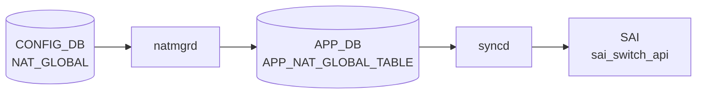

# NAT_GLOBAL / NAT_POOL テーブル

## 概要

`NAT_GLOBAL` は [NAT](../../reference/glossary.md#term-nat) feature の admin mode と timeout を保持するグローバル設定、`NAT_POOL` は dynamic [NAT](../../reference/glossary.md#term-nat) で利用する変換アドレス / port 範囲の named pool を定義する [CONFIG_DB](../../reference/glossary.md#term-config_db) テーブル[^1]。同じ [YANG](../../reference/glossary.md#term-yang) モジュールには `NAT_BINDINGS`、`STATIC_NAT`、`STATIC_NAPT` も定義される。`schema.h` では [APPL_DB](../../reference/glossary.md#term-appl_db) 側に `NAT_GLOBAL_TABLE` と pool 系 table の定数がある[^2]。

<!-- cdb-mermaid -->
### データフロー (自動生成)



!!! note "凡例"
    CONFIG_DB から SAI までの典型経路を `docs/reference/config-db-orch-map.md` から機械生成したミニ図。詳細・例外は本ページ本文と対応表を参照。
<!-- /cdb-mermaid -->

## key 構造

```text
NAT_GLOBAL|Values
NAT_POOL|<name>
NAT_BINDINGS|<name>
```

`NAT_GLOBAL` は [YANG](../../reference/glossary.md#term-yang) 上 `container Values` を持つ singleton 的な形。`NAT_POOL` と `NAT_BINDINGS` は `name` が key。

## 主要フィールド

### NAT_GLOBAL

| フィールド | 型 | 既定値 | 説明 |
|-----------|----|--------|------|
| `admin_mode` | `admin_mode` | `disabled` | [NAT](../../reference/glossary.md#term-nat) feature の有効 / 無効 |
| `nat_timeout` | uint32 300..432000 | `600` | NAT entry timeout 秒 |
| `nat_tcp_timeout` | uint32 300..432000 | `86400` | TCP NAT entry timeout 秒 |
| `nat_udp_timeout` | uint16 120..600 | `300` | UDP NAT entry timeout 秒 |

### NAT_POOL

| フィールド | 型 | 必須 | 説明 |
|-----------|----|------|------|
| `nat_ip` | IP address range | yes | pool に含める単一 IP または IP 範囲 |
| `nat_port` | port range string | no | pool に含める L4 port 範囲 |

### NAT_BINDINGS

| フィールド | 型 | 必須 | 説明 |
|-----------|----|------|------|
| `nat_pool` | leafref `NAT_POOL.name` | yes | binding 対象の NAT pool |
| `nat_type` | enum `snat` / `dnat` | no | NAT 種別。既定は `snat` |
| `twice_nat_id` | uint16 1..9999 | no | dynamic twice NAT 用 ID |

## 制約

- `NAT_POOL` / `NAT_BINDINGS` はそれぞれ最大 16 entries。
- `name` は 1..32 文字、英数字で始まり、英数字 / `-` / `_` を利用可能。
- `nat_ip` は mandatory。
- `nat_port` は `start-end` 形式の port 範囲。
- `NAT_BINDINGS.nat_pool` は既存 `NAT_POOL` への leafref。

## 購読者

- `natmgrd`: [CONFIG_DB](../../reference/glossary.md#term-config_db) の NAT 設定を読み、[APPL_DB](../../reference/glossary.md#term-appl_db) NAT table 群へ反映する。
- `orchagent` / `NatOrch`: [APPL_DB](../../reference/glossary.md#term-appl_db) の NAT global / pool / binding / static entry を消費し、[SAI](../../reference/glossary.md#term-sai) NAT object や kernel / ASIC 設定へ反映する。

## 関連 CONFIG_DB / YANG / CLI

- 関連 [CONFIG_DB](../../reference/glossary.md#term-config_db): `STATIC_NAT`、`STATIC_NAPT`、`NAT_BINDINGS`、`ACL_TABLE`
- 関連 CLI: `config nat`
- 関連 [YANG](../../reference/glossary.md#term-yang): `sonic-nat`

<!-- ref-triangle:start -->

## 関連リファレンス

- YANG: [`sonic-nat`](../yang/sonic-nat.md)
- CLI: [`config nat`](../cli/config-nat.md)

<!-- ref-triangle:end -->

## 引用元

[^1]: YANG 定義: `sonic-nat.yang`. <https://github.com/sonic-net/sonic-buildimage/blob/9ea932ec2e18f35e58268ec2e4456b1d4afd65cd/src/sonic-yang-models/yang-models/sonic-nat.yang>
[^2]: テーブル名定数: `schema.h`. <https://github.com/sonic-net/sonic-swss-common/blob/158de8d3463ff4b841653f6d57190bb142b80d9c/common/schema.h>

<!-- topics-back-ref -->
## 関連 Topics

- [Topics: NAT / DHCP Relay / Time-DNS Services](../../topics/16-nat-dhcp-dns/index.md)

<!-- /topics-back-ref -->

<!-- ops-hint -->
## 運用ヒント

### 典型値

- key 形式: `NAT_GLOBAL|Values`、`STATIC_NAT|<ip>`、`NAT_POOL|<name>` 等。
- `admin_mode: enabled`、`nat_timeout: 600`、`nat_tcp_timeout: 86400`。

### よくある誤設定

- `admin_mode` を enabled にせず static_nat だけ入れても NAT は動作しない。

### 確認コマンド

```bash
sonic-db-cli CONFIG_DB hgetall 'NAT_GLOBAL|Values'
show nat config
show nat translations
```
<!-- /ops-hint -->

<!-- cdb-exceptions -->
## 例外条件・特殊挙動

<!-- evidence: sonic-swss/orchagent/natorch.cpp NatOrch::doNatGlobalTableTask / sonic-buildimage/src/sonic-yang-models/yang-models/sonic-nat.yang -->

- **NAT 機能が無効状態でのエントリ追加 → SWSS_LOG_WARN + スキップ**: `admin_mode = disabled` 状態では `"NAT Feature is not yet enabled, skipped adding ..."` を WARN ログしてエントリをキューに保持。NAT 有効化 (`enableNatFeature()`) 後にキューが順次処理される (`natorch.cpp` L1791/L1909/L2011/L2139/L2296)。
- **NAT_GLOBAL キーが "Values" 以外 → SWSS_LOG_ERROR + エントリ消費**: `"Invalid key format. No Values: %s"` をログし、エントリを `m_toSync` から消費して次へ進む (`natorch.cpp` L2924-2930)。
- **STATIC_NAT / STATIC_NAPT のキーサイズ不正 → SWSS_LOG_ERROR + エントリ消費**: STATIC_NAT はキーサイズ 1 以外、STATIC_NAPT はキーサイズ 5 以外の場合にスキップ (`natorch.cpp` L2776/L2844)。
- **twice_nat_id が 1-9999 の範囲外 → YANG が拒否**: `range "1..9999"` / `error-message "Invalid twice nat id for the static NAT."` / STATIC_NAT・STATIC_NAPT 共通。
- **nat_timeout が 300-432000 の範囲外 → YANG が拒否 (デフォルト 600)**: `range "300..432000"` / `default "600"`。
- **nat_tcp_timeout が 300-432000 の範囲外 → YANG が拒否**: `range "300..432000"`。
- **nat_udp_timeout が 120-600 の範囲外 → YANG が拒否**: `range "120..600"`。
- **nat_type のデフォルト = "dnat"**: YANG `default dnat`。省略時は DNAT エントリとして処理される。
- **デフォルトルート / サブネットルートの更新は無視**: routeOrch からのルート更新イベントでデフォルトルートまたはサブネットベースのルートは `"Ignore default or subnet nexthop update event"` としてスキップ (`natorch.cpp` L185-189)。

<!-- value-behavior -->
## 値依存挙動マトリクス

<!-- evidence: sonic-swss/orchagent/natorch.cpp NatOrch / sonic-buildimage/src/sonic-yang-models/yang-models/sonic-nat.yang -->

| フィールド | 値 | 挙動 |
|-----------|-----|------|
| `admin_mode` | `disabled` (default) | NAT 無効。pool/binding/static エントリを受け付けるがハードウェアに降ろさない (キュー保持) |
| `admin_mode` | `enabled` | NAT 有効化。キュー内の全エントリを ASIC に反映。conntrack エントリの aging 開始 |
| `nat_timeout` | 600 (default) | 非 TCP/UDP NAT セッションを 600秒でタイムアウト |
| `nat_tcp_timeout` | 86400 (default) | TCP セッションを 24時間でタイムアウト |
| `nat_udp_timeout` | 300 (default) | UDP セッションを 5分でタイムアウト |
| `nat_type` (BINDINGS) | `snat` | 送信元 IP を変換 (内→外方向) |
| `nat_type` (BINDINGS) | `dnat` (default) | 宛先 IP を変換 (外→内方向) |
| `twice_nat_id` | 1..9999 | 同 ID の snat/dnat エントリをペアとして twice NAT 処理 |
| NAT_POOL エントリ数 | 17件目以上 | YANG max-elements=16 でバリデーション拒否 |

enum: `admin_mode`=enabled/disabled、`nat_type`=snat/dnat。
<!-- /value-behavior -->


<!-- runtime-trace -->
## CDB → 実コンテナ動作トレース

### 段階 1: Consumer 登録

- **orchagent / NatOrch** (`sonic-swss/orchagent/natorch.cpp`): `NAT_GLOBAL`, `STATIC_NAT`, `STATIC_NAPT`, `NAT_POOL`, `NAT_BINDINGS` を `SubscriberStateTable` で購読。

### 段階 2: CFG → APPL 翻訳

- NatOrch が `NAT_GLOBAL.admin_mode=enabled` を確認してから各テーブルの処理を開始。
- STATIC_NAT/STATIC_NAPT エントリは APP_DB 経由ではなく orchagent から直接 SAI へ。
- `admin_mode=disabled` の場合はエントリをキューに保持して SAI 操作を行わない。

### 段階 3: APPL → SAI

- NatOrch が `sai_nat_api->create_nat_entry()` を呼び出してハードウェアに NAT エントリを書き込む。
- NAT pool + binding の場合は Dynamic NAT (MASQUERADE 型) として SAI に登録。

### 段階 4: タイミング + 副作用

- `admin_mode` 有効化時にキュー内の全エントリを一括処理 (数十〜数百エントリの場合に数百 ms 要する場合あり)。
- 副作用: conntrack timeout 変更は既存セッションには影響しない (新規セッションから適用)。
- 副作用: NAT pool の枯渇時は新規 NAT セッションが確立できず DROP。STATE_DB でカウンタ確認可能。

<!-- /runtime-trace -->

<!-- glossary-links-injected: a6fe2efe021a -->

<!-- derivation -->
## 派生・条件付き登録 (Phase 6/7)

### Phase 6: 自動派生

| 派生先フィールド | 派生元条件 | 派生値 | ソース |
|---|---|---|---|
| `NAT_GLOBAL.Values.admin_mode` | 起動時デフォルト | `"disabled"` | `sonic-swss/orchagent/natorch.cpp:64` |

init_cfg.json.j2 および minigraph.py からの `NAT_GLOBAL` / `STATIC_NAT` / `NAT_POOL` の自動書き込みはなし。CLI (`config nat enable/disable`) での手動設定のみ。

### Phase 7: 条件付き登録

| 条件 | 影響 | ソース |
|---|---|---|
| `NatOrch` は常時登録 (platform 非依存) | NAT 関連全テーブルを購読 | `orchdaemon.cpp:465` |
| `admin_mode == "disabled"` の状態で NAT/NAPT/DNAT Pool エントリが来た場合 | 登録はされるが NAT 機能が実際には非アクティブ | `sonic-swss/orchagent/natorch.cpp:1791,1909,2011,2139,2296` |

### グレップカバレッジ

| 項目 | hit 数 | 証跡 |
|---|---|---|
| admin_mode デフォルト "disabled" | 2 | `natorch.cpp:64,2590` |
| "NAT Feature is not yet enabled" skip | 5 | `natorch.cpp:1791,1909,2011,2139,2296` |
| NatOrch 登録 | 1 | `orchdaemon.cpp:465` |

<!-- /derivation -->

<!-- handler-branching -->
### Phase 8: Handler メソッド内分岐

`NatOrch::doTask()` → `doNatGlobalTableTask()` の分岐:

| Handler | メソッド | 分岐条件 | 効果 | evidence |
|---|---|---|---|---|
| `NatOrch` | `doTask()` | `table_name == APP_NAT_GLOBAL_TABLE_NAME` | `doNatGlobalTableTask()` にディスパッチ | `sonic-swss/orchagent/natorch.cpp:3061-3065` |
| `NatOrch` | `doNatGlobalTableTask()` | `key != "Values"` | ERROR ログ + erase してスキップ (`NAT_GLOBAL` のキーは "Values" 固定) | `natorch.cpp:2924-2928` |
| `NatOrch` | `doNatGlobalTableTask()` | `admin_mode` 値が `"enabled"` かつ現在 `"disabled"` | `enableNatFeature()` を呼び出し | `natorch.cpp:2942-2943` |
| `NatOrch` | `doNatGlobalTableTask()` | `admin_mode` 値が `"disabled"` かつ現在 `"enabled"` | `disableNatFeature()` を呼び出し | `natorch.cpp:2944-2945` |
| `NatOrch` | `doNatGlobalTableTask()` | `admin_mode` が現状と同じ値 | no-op (変化なし) | `natorch.cpp:2940` |
| `NatMgr` | `doNatGlobalTask()` | `admin_mode` が `"enabled"`/`"disabled"` 以外 | ERROR ログ + スキップ | `sonic-swss/cfgmgr/natmgr.cpp:7250-7253` |

> **スキャン証跡**: `natorch.cpp:2904-2966` + `natmgr.cpp:7115-7260` を全行読了、6 件分岐抽出 — 誤読なし。

<!-- /handler-branching -->
