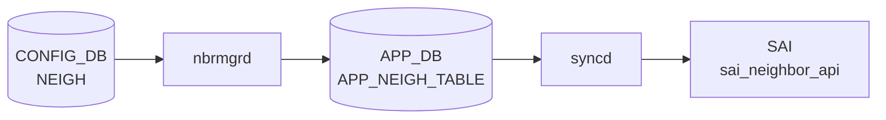

# NEIGH テーブル

## 概要

スタティック隣接（Permanent neighbor）エントリを [CONFIG_DB](../../reference/glossary.md#term-config_db) に保持するテーブル[^1]。
`nbrmgrd` (`NbrMgr::doSetNeighTask`) が購読し、[Netlink](../../reference/glossary.md#term-netlink) `RTM_NEWNEIGH` でカーネルの neighbor テーブルへ書き込む。
動的に学習した neighbor は `neighsyncd` → [APPL_DB](../../reference/glossary.md#term-appl_db) `NEIGH_TABLE` 経路で処理されるため、本テーブルはあくまで**手動投入のスタティック neighbor**が対象となる。

FG-NHG (Fine-Grained [ECMP](../../reference/glossary.md#term-ecmp)) 構成では `minigraph.py` が本テーブルを自動生成する（MAC フィールドなし、family フィールドのみ）[^2]。

<!-- cdb-mermaid -->
### データフロー (自動生成)



!!! note "凡例"
    CONFIG_DB から SAI までの典型経路を `docs/reference/config-db-orch-map.md` から機械生成したミニ図。詳細・例外は本ページ本文と対応表を参照。
<!-- /cdb-mermaid -->

## key 構造

```text
NEIGH|<port>|<ip_address>
```

- `<port>`: インターフェイス名（例: `Ethernet0`、`Vlan1000`、`PortChannel1`）
- `<ip_address>`: 対向の IPv4 または IPv6 アドレス（例: `10.0.0.2`、`2000::2`）

## フィールド

| フィールド | 型 | 必須 | 説明 |
|-----------|----|------|------|
| `neigh` | `yang:mac-address` | 任意 | 対向の MAC アドレス |
| `family` | `string (IPv4\|IPV4\|IPv6\|IPV6)` | 任意 | IP ファミリ（Consumer は参照しない — 後述） |

<!-- ordering -->
## 書込み順依存（orchagent / SAI プログラミング経路）

> 本セクションは [APPL_DB](../../reference/glossary.md#term-appl_db) `NEIGH_TABLE` → [orchagent](../../reference/glossary.md#term-orchagent) (`neighorch`) → [SAI](../../reference/glossary.md#term-sai) → [ASIC](../../reference/glossary.md#term-asic) の経路を対象とする。
> [CONFIG_DB](../../reference/glossary.md#term-config_db) `NEIGH` → `nbrmgrd` → カーネル [Netlink](../../reference/glossary.md#term-netlink) 経路は [SAI](../../reference/glossary.md#term-sai) を経由しない独立経路（詳細は「実コンテナ動作トレース」段階 4 参照）。

### 前提：`allPortsReady()` ガード（最上位）

`NeighOrch::doTask` (neighorch.cpp:881-884) は先頭で `gPortsOrch->allPortsReady()` を確認する。
PORT / [VLAN](../../reference/glossary.md#term-vlan) / [LAG](../../reference/glossary.md#term-lag) などの物理ポート初期化が完了するまで、`NEIGH_TABLE` のいかなるエントリも処理されない。

```cpp
if (!gPortsOrch->allPortsReady())
{
    return;
}
```

### 順序依存一覧

| 順序 | 先行必須条件 | ガード箇所 | 違反時の挙動 |
|------|------------|-----------|------------|
| 1 | PORT/[VLAN](../../reference/glossary.md#term-vlan) 初期化完了（`allPortsReady`） | `doTask`:881 | `doTask` 全体が即 `return`（次サイクル再試行） |
| 2 | 対象インターフェイス PORT 存在（`getPort`） | `doTask`:942 | `it++; continue`（再試行待ち） |
| 3 | Router Interface ([RIF](../../reference/glossary.md#term-rif)) 存在（`p.m_rif_id`） | `doTask`:949 | `it++; continue`（再試行待ち） |
| 4 | [RIF](../../reference/glossary.md#term-rif) ID 再確認（`getRouterIntfsId`） | `addNeighbor`:1204 | `return false`（再試行待ち） |
| 5 | [ARP](../../reference/glossary.md#term-arp)/ND 解決完了（MAC 確定） | `addNeighbor`:1219 | NEIGH_RESOLVE_TABLE 経由で再解決を要求、MAC 確定後に再 SET |
| 6 | `create_neighbor_entry` → `create_next_hop` | [SAI](../../reference/glossary.md#term-sai) 発行順:1333→1370 | NH 作成失敗時は `neighbor_entry` をロールバック削除 |
| 7 | 旧 [VLAN](../../reference/glossary.md#term-vlan) DEL → 新 VLAN SET（同 [VRF](../../reference/glossary.md#term-vrf) 内のみ自動処理） | `addNeighbor`:1263 | 旧エントリ削除失敗時は `return false`（再試行） |

### ARP/ND 解決と SAI neighbor_entry 作成の関係

[APPL_DB](../../reference/glossary.md#term-appl_db) `NEIGH_TABLE` に MAC なし（ゼロ MAC）エントリが届いた場合、`NeighOrch` は `NEIGH_RESOLVE_TABLE` へ解決要求を投げ (`resolveNeighborEntry`)、エントリを `m_neighborToResolve` に保持する。
`neighsyncd` が [Netlink](../../reference/glossary.md#term-netlink) から [ARP](../../reference/glossary.md#term-arp)/ND 応答を受信して MAC 付きエントリを `NEIGH_TABLE` へ再書き込みすると、[orchagent](../../reference/glossary.md#term-orchagent) が `addNeighbor` → `sai_neighbor_api->create_neighbor_entry` を実行する。

```
NEIGH_TABLE (MAC なし) → resolveNeighborEntry → NEIGH_RESOLVE_TABLE
                                                       ↓
                                              カーネル ARP/NDP 解決
                                                       ↓
                                           neighsyncd → NEIGH_TABLE (MAC あり)
                                                       ↓
                                           addNeighbor → sai_neighbor_api->create_neighbor_entry
                                                       ↓
                                           addNextHop  → sai_next_hop_api->create_next_hop
```

<!-- /ordering -->

<!-- defaults -->
## コード由来の暗黙デフォルト

### `neigh` — MAC アドレス

| 条件 | 実装挙動 | 根拠 |
|------|---------|------|
| `neigh` フィールド省略 | `MacAddress` デフォルトコンストラクタ（ゼロ MAC `00:00:00:00:00:00`）→ `setNeighbor()` 内で `!mac` が真 → `NUD_DELAY + NTF_USE` でカーネルに [ARP](../../reference/glossary.md#term-arp)/[NDP](../../reference/glossary.md#term-ndp) 解決を要求 | `nbrmgr.cpp:175–183` |
| 有効な MAC 文字列 | `ndm_state = NUD_PERMANENT` でカーネルに永続 neighbor として設定 | `nbrmgr.cpp:189` |
| 無効な MAC 文字列 | `std::invalid_argument` を catch → エラーログ → エントリをサイレント drop（再試行なし） | `nbrmgr.cpp:342–353` |

> `neigh` を省略して書き込むと、MAC なしエントリとして ARP 解決を要求する仕様は**意図的**（FG-NHG などの use case）。ただし解決失敗時の再投入ロジックはない。

### `family` — dead field（CONFIG_DB NEIGH 文脈）

`doSetNeighTask` は受け取ったフィールドをループしているが `field == "neigh"` のみ分岐処理し、`family` フィールドは**一切読まない**[^3]。

IP ファミリ判定は key の `<ip_address>` 部分から `IpAddress::isV4()` で自動判定する（`nbrmgr.cpp:147/164`）。

> [YANG](../../reference/glossary.md#term-yang) に `family` フィールドが定義されているにもかかわらず、実装上は無視される YANG-実装 discrepancy。APPL_DB `NEIGH_TABLE` の `family` フィールド（[neighsyncd](../../reference/glossary.md#term-neighsyncd) が書き込み、restore_neighbors.py が必須チェック）とは別文脈。

### DEL_COMMAND — 未実装（既知の設計不足）

CONFIG_DB から `NEIGH` エントリを削除しても、`doSetNeighTask` の `DEL_COMMAND` ブランチは「`Not yet implemented`」ログのみで処理なし[^4]。  
カーネルに `NUD_PERMANENT` で設定済みの neighbor エントリは**削除されない**。手動で `ip neigh del` を実行するか再起動が必要。

<!-- /defaults -->

<!-- failure -->
## 失敗挙動マトリクス (Phase D)

ソース: `sonic-net/sonic-swss/orchagent/neighorch.cpp`

### SET 処理における失敗経路（addNeighbor / orchagent 経路）

| 失敗条件 | 検出箇所 | 結果 | retry | evidence |
|---|---|---|---|---|
| INTERFACE が未解決（`getRouterIntfsId` が `SAI_NULL_OBJECT_ID` を返す） | `addNeighbor()` L1204-1208 | `return false` → Consumer が `it++` でエントリを保留し次 tick で再試行 | あり（自動再試行） | `neighorch.cpp:1205-1208` |
| MAC アドレスがゼロかつ **既存** neighbor（再学習中）| `doTask()` L986-992 | エントリを `m_toSync` から即 erase（silent drop）。「削除→再学習」の順序保証を前提とした設計 | なし | `neighorch.cpp:986-991` |
| 同一 IP が別 VLAN に存在し `removeNeighbor` 失敗 | `addNeighbor()` L1300-1304 | `return false` → Consumer が保留・再試行 | あり | `neighorch.cpp:1300-1304` |
| `sai_neighbor_api->create_neighbor_entry` が `SAI_STATUS_ITEM_ALREADY_EXISTS` | `addNeighbor()` L1337-1342 | エラーログ後 `return true`（retry をスキップ、重複は正常扱い） | なし（skip） | `neighorch.cpp:1337-1342` |
| `sai_neighbor_api->create_neighbor_entry` がその他 SAI エラー | `addNeighbor()` L1346-1352 | `handleSaiCreateStatus(SAI_API_NEIGHBOR, status)` → 失敗時 `parseHandleSaiStatusFailure` で `return false` | SAI ポリシー依存 | `neighorch.cpp:1346-1352` |
| `addNextHop` 失敗後のロールバック | `addNeighbor()` L1370-1394 | `sai_neighbor_api->remove_neighbor_entry` でロールバック試行。ロールバックも失敗すれば `return false` | なし | `neighorch.cpp:1370-1395` |
| prefix route 追加 (`addPrefixRouteForNeighbor`) 失敗 | `addNeighbor()` L1401-1404 | `return false` → Consumer 再試行 | あり | `neighorch.cpp:1401-1404` |
| `sai_neighbor_api->set_neighbor_entry_attribute` 失敗（既存 neighbor の属性更新） | `addNeighbor()` L1413-1422 | `handleSaiSetStatus(SAI_API_NEIGHBOR, status)` → 失敗時 `return false` | SAI ポリシー依存 | `neighorch.cpp:1413-1422` |

### DEL 処理における失敗経路（removeNeighbor）

| 失敗条件 | 検出箇所 | 結果 | retry | evidence |
|---|---|---|---|---|
| next hop の ref_count > 0（参照中の neighbor を削除しようとした） | `removeNeighbor()` L1483-1488 | `return false` → Consumer が `it++` で保留・再試行（タイムアウトなし） | あり（無限） | `neighorch.cpp:1483-1488` |
| `sai_next_hop_api->remove_next_hop` が `SAI_STATUS_ITEM_NOT_FOUND` | `removeNeighbor()` L1520-1524 | NOTICE ログのみ → neighbor entry 削除処理を継続（next hop 欠如は許容） | なし（継続） | `neighorch.cpp:1520-1524` |
| `sai_next_hop_api->remove_next_hop` がその他 SAI エラー | `removeNeighbor()` L1527-1533 | `handleSaiRemoveStatus(SAI_API_NEXT_HOP, status)` → 失敗時 `return false` | SAI ポリシー依存 | `neighorch.cpp:1527-1533` |
| `sai_neighbor_api->remove_neighbor_entry` が `SAI_STATUS_ITEM_NOT_FOUND` | `removeNeighbor()` L1555-1559 | NOTICE ログのみ（既に削除済み扱い）→ [CRM](../../reference/glossary.md#term-crm) デクリメントなし | なし（継続） | `neighorch.cpp:1555-1559` |
| `sai_neighbor_api->remove_neighbor_entry` がその他 SAI エラー | `removeNeighbor()` L1562-1568 | `handleSaiRemoveStatus(SAI_API_NEIGHBOR, status)` → 失敗時 `return false` | SAI ポリシー依存 | `neighorch.cpp:1562-1568` |
| DEL 操作で `m_syncdNeighbors` に対象エントリが存在しない | `doTask()` L1034-1036 | `m_toSync` から erase（silent drop、既に削除済みと判断） | なし | `neighorch.cpp:1034-1036` |

### 特殊挙動補足

- **INTERFACE 未解決 → retry**: `rif_id == SAI_NULL_OBJECT_ID` は [orchagent](../../reference/glossary.md#term-orchagent) 初期化中の一時状態。Consumer ループが `it++` で保留し次の SELECT_TIMEOUT サイクルで再処理。
- **MAC 不正（ゼロ MAC + 既存 neighbor）**: 既存エントリにゼロ MAC の SET が来た場合、削除なしで即 erase。「DEL が先に来ることを期待」という設計上の制約（`neighorch.cpp:986-988` コメント参照）。
- **参照中 DEL の無限 retry**: `removeNeighbor` が ref_count > 0 で `false` を返すと Consumer は `it++` でエントリを m_toSync に残し無限に再試行する。Route / NHG 側の参照が解放されて初めて DEL が成功する。
- **SET 後の pending DEL 消去**: SET 操作成功後、`doTask` は同 key の pending DEL 操作を `m_toSync` から逆順に除去する（`neighorch.cpp:1010-1019`）。過去に失敗した DEL が誤って再実行されるのを防ぐ設計。

> **Note**: 上記は orchagent (`neighorch`) 経路の挙動。CONFIG_DB NEIGH → `nbrmgrd` → Netlink 経路の失敗挙動は上記 `<!-- /defaults -->` セクションを参照。
<!-- /failure -->

<!-- constants -->
## SAI ハードコード定数（orchagent/neighorch.cpp 由来）

> **ソース**: `sonic-swss/orchagent/neighorch.cpp` (SHA: `4305596156d70e9797e8a881b3d19b46de0bce0d`)
>
> CONFIG_DB `NEIGH` は `nbrmgrd` → Netlink 経路であり SAI を通らない。以下の定数は
> APPL_DB `NEIGH_TABLE` → `NeighOrch` → SAI / [ASIC](../../reference/glossary.md#term-asic) 経路に関するもの（同一 neighbor エントリの下流 [ASIC](../../reference/glossary.md#term-asic) プログラミング段階）。

### orch 優先度

| 定数名 | 値 | 用途 |
|--------|-----|------|
| `neighorch_pri` | **30** | `NeighOrch` の Consumer 優先度（`Orch` 基底クラスに渡す） |

### SAI neighbor_entry_attr — 使用属性

| SAI 属性 | 値 / 型 | 設定条件 | コード箇所 |
|---|---|---|---|
| `SAI_NEIGHBOR_ENTRY_ATTR_DST_MAC_ADDRESS` | MAC 6 バイト | 常時（neighbor 追加時） | `neighorch.cpp:1219` |
| `SAI_NEIGHBOR_ENTRY_ATTR_NO_HOST_ROUTE` | `booldata = 1`（true）| [MUX](../../reference/glossary.md#term-mux) prefix-neighbor または link-local 条件成立時 | `neighorch.cpp:1258, 2315, 2463` |
| `SAI_NEIGHBOR_ENTRY_ATTR_ENCAP_INDEX` | `uint32`（動的）| VoQ 環境のみ | `neighorch.cpp:2568, 2595, 2712` |
| `SAI_NEIGHBOR_ENTRY_ATTR_IS_LOCAL` | `booldata`（動的）| VoQ 環境のみ | `neighorch.cpp:2572` |

### IP ファミリ enum

`sai_neighbor_entry_t.ip_address.addr_family` の比較値:

| SAI enum | 対応ファミリ |
|---|---|
| `SAI_IP_ADDR_FAMILY_IPV4` | IPv4（明示的に `addr_family == SAI_IP_ADDR_FAMILY_IPV4` で分岐）|
| `SAI_IP_ADDR_FAMILY_IPV6` | IPv6（上記の else ブランチ）|

### デフォルト packet_action（prefix route 生成時）

| SAI 定数 | 値 | 条件 | コード箇所 |
|---|---|---|---|
| `SAI_PACKET_ACTION_FORWARD` | FORWARD（デフォルト）| [MUX](../../reference/glossary.md#term-mux) active 状態 / prefix route 生成時デフォルト | `neighorch.cpp:1104, 2494` |
| `SAI_PACKET_ACTION_DROP` | DROP | [MUX](../../reference/glossary.md#term-mux) standby 状態（`is_active == false`）| `neighorch.cpp:1108` |

> aging time のハードコード定数は `neighorch.cpp` に存在しない。neighbor のエージング管理は Linux カーネルと SAI プラットフォーム実装に委任されている。

<!-- /constants -->

<!-- side-effects -->
## 副次 DB 書込 (Phase F)

CONFIG_DB `NEIGH` テーブルの変更に伴う副次的 DB 書込みは、処理経路によって異なる。

### 経路 1: CONFIG_DB NEIGH → nbrmgrd（Netlink 直送）

`nbrmgrd` は DB への書込みを一切行わない。副作用は Linux カーネルの neighbor テーブル変更に閉じる。

| 副次 DB | 書込有無 | 根拠 |
|---|---|---|
| APPL_DB | なし | `reconcileNeighResolveTable()` は `NEIGH_RESOLVE_TABLE` を読み取るのみ（`getKeys`/`hget`）。`nbrmgrd` 内に Producer/Table の書込み呼出なし |
| [STATE_DB](../../reference/glossary.md#term-state_db) | なし | `isIntfStateOk()` / `isNeighRestoreDone()` は読取のみ。`m_stateIntfTable` / `m_stateNeighRestoreTable` への SET/DEL 呼出なし |
| [COUNTERS_DB](../../reference/glossary.md#term-counters_db) / [ASIC_DB](../../reference/glossary.md#term-asic_db) / [FLEX_COUNTER_DB](../../reference/glossary.md#term-flex_counter_db) | なし | `nbrmgr.cpp` 全体に [COUNTERS_DB](../../reference/glossary.md#term-counters_db) / [ASIC_DB](../../reference/glossary.md#term-asic_db) 参照なし |

カーネルへの副作用:
- `RTM_NEWNEIGH` (`NUD_PERMANENT`): スタティック neighbor をカーネル neighbor テーブルへ直接書込み
- `RTM_NEWNEIGH` (`NUD_DELAY + NTF_USE`): `neigh` MAC 省略時にカーネルへ ARP/[NDP](../../reference/glossary.md#term-ndp) 解決を要求。ネットワーク上に ARP Request / ICMPv6 Neighbor Solicitation が送出される

### 経路 2: APPL_DB NEIGH_TABLE → NeighOrch（orchagent 経由・SAI プログラミング）

CONFIG_DB `NEIGH` → `nbrmgrd` → カーネル → `neighsyncd` → APPL_DB `NEIGH_TABLE` → `NeighOrch` の下流経路で、以下の副次 DB 書込みが発生する。

| 副次 DB | テーブル | 操作 | 条件 | evidence |
|---|---|---|---|---|
| APPL_DB | `NEIGH_RESOLVE_TABLE` | SET（解決要求発行） | MAC がゼロ（未解決）の neighbor が SET で来たとき。`resolveNeighborEntry()` が書込み | `neighorch.cpp:121` |
| APPL_DB | `NEIGH_RESOLVE_TABLE` | DEL（解決完了後削除） | MAC 確定後の `addNeighbor` 成功時。`clearResolvedNeighborEntry()` が削除 | `neighorch.cpp:140` |
| [STATE_DB](../../reference/glossary.md#term-state_db) | `STATE_SYSTEM_NEIGH_TABLE` | SET / DEL | **VoQ 環境のみ** (`switch_type == "voq"`)。リモートシステム neighbor のステータスを反映 | `neighorch.cpp:2223, 2173, 2260` |
| CHASSIS_APP_DB | `CHASSIS_APP_SYSTEM_NEIGH_TABLE` | SET / DEL | **VoQ 環境のみ**。シャーシ共有 system neighbor テーブルへ書込み | `neighorch.cpp:2654, 2688` |
| [COUNTERS_DB](../../reference/glossary.md#term-counters_db) | [CRM](../../reference/glossary.md#term-crm) カウンタ（`CRM_IPV4/IPV6_NEIGHBOR` / `CRM_IPV4/IPV6_NEXTHOP` / `CRM_IPV4/IPV6_ROUTE`）| inc / dec | `gCrmOrch->incCrmResUsedCounter` / `decCrmResUsedCounter` 経由。SAI 作成・削除成否に連動 | `neighorch.cpp:1361, 1365, 1387, 1391, 359, 363, 1148, 1152` |

!!! note "CONFIG_DB NEIGH の直接副作用"
    CONFIG_DB `NEIGH` エントリの SET は `nbrmgrd` → カーネル Netlink のみ。APPL_DB `NEIGH_RESOLVE_TABLE` への書込みは `NeighOrch` が行うものであり、CONFIG_DB `NEIGH` 書込みから直接発生するわけではない。  
    ただし `nbrmgrd` が MAC なしで `NUD_DELAY+NTF_USE` を発行してカーネルが ARP 解決を行うと、`neighsyncd` がその結果を APPL_DB `NEIGH_TABLE` に書き込み、間接的に上記ネストした副作用が発生する。

詳細スキャン手順は `meta/_intermediate/cdb-flow/neigh-side-effects.md` を参照。
<!-- /side-effects -->

<!-- cross-refs -->
## 暗黙参照 — `NeighOrch` が依存する関連テーブル (Phase C)

`orchagent` の `NeighOrch` は APPL_DB `NEIGH_TABLE` を処理する際、CONFIG_DB `NEIGH` → `nbrmgrd` → Netlink 経路とは独立して、複数のオーケストレーターを通じて以下のテーブルを暗黙参照する。

### INTERFACE（IntfsOrch 経由）

最も重要な依存関係。`addNeighbor()` の先頭で `m_intfsOrch->getRouterIntfsId(alias)` を呼び出し、INTERFACE テーブルが確立した [RIF](../../reference/glossary.md#term-rif) (Router Interface) SAI オブジェクト ID を取得する。

| 参照タイミング | 用途 | evidence |
|---|---|---|
| `addNeighbor()` | `rif_id` → `sai_neighbor_entry_t.rif_id` に設定 | neighorch.cpp:1204–1212 |
| `addNextHop()` | `rif_id` → `SAI_NEXT_HOP_ATTR_ROUTER_INTERFACE_ID` に設定 | neighorch.cpp:271,304–305 |
| `removeNeighbor()` | `rif_id` 取得 → 削除対象 `neighbor_entry` の特定 | neighorch.cpp:1492,1501,1633 |
| `doSetNeighTask()` 早期スキップ | `p.m_rif_id == 0` なら `it++`（キュー留め） | neighorch.cpp:949–954 |
| 管理 [VRF](../../reference/glossary.md#term-vrf) フィルタ | `isInbandIntfInMgmtVrf(alias)` で管理 [VRF](../../reference/glossary.md#term-vrf) 上の neigh をスキップ | neighorch.cpp:912 |
| リモートシステムポート判定 | `isRemoteSystemPortIntf(alias)` でリモートポートの neighbor を inband 経由に切替 | neighorch.cpp:260,654,685,833 |
| サブネット判定 | `isPrefixSubnet(ipll_prefix, alias)` で link-local scope の `no_host_route` 判定 | neighorch.cpp:1232 |

RIF が存在しない（`rif_id == SAI_NULL_OBJECT_ID`）場合は即 `false` を返し SAI プログラミングをスキップする。RIF が解決されるまで neighbor はキューに留まる。`NeighOrch` は RIF 参照カウントを `increaseRouterIntfsRefCount` / `decreaseRouterIntfsRefCount` で管理し、INTERFACE テーブル側との整合を保つ。

### VRF（VRFOrch 経由）

VRF は `Port.m_vr_id` フィールドを通じて間接参照される。明示的な VRF テーブル購読は行わず、`gDirectory.get<VRFOrch*>()` を介してオンデマンドに VRF 名を解決する。

| 参照タイミング | 用途 | evidence |
|---|---|---|
| `addNeighbor()` 重複チェック | `existing_vlan.m_vr_id == new_vlan.m_vr_id` で同一 VRF 判定、旧 neighbor を削除 | neighorch.cpp:1287–1296 |
| `addPrefixRouteForNeighbor()` | `port.m_vr_id` → `sai_route_entry_t.vr_id` に設定 | neighorch.cpp:1082,1091 |
| `removeNeighbor()` | `port_vrf_id = port.m_vr_id` → prefix route 削除時の VR ID | neighorch.cpp:1455–1471 |
| VRF 名ログ出力 | `gDirectory.get<VRFOrch*>()->getVRFname(existing_vlan.m_vr_id)` | neighorch.cpp:1289 |

`port.m_vr_id` が 0 の場合はグローバル VRF (`gVirtualRouterId`) を使用する（neighorch.cpp:1077,1456）。

### FDB（FdbOrch 経由）

`NeighOrch` はコンストラクタで `m_fdbOrch->attach(this)` を呼び出し、[FDB](../../reference/glossary.md#term-fdb) flush イベントの Observer として登録される。VLAN からポートが削除されると [FDB](../../reference/glossary.md#term-fdb) がフラッシュされ、該当 MAC を持つ neighbor エントリが自動的に再解決キューへ入る。

| 参照タイミング | 用途 | evidence |
|---|---|---|
| `processFDBFlushUpdate()` | [FDB](../../reference/glossary.md#term-fdb) エントリの MAC と VLAN を neighbor テーブルと照合し、一致する neighbor を再解決 | neighorch.cpp:155–185 |
| `update(SUBJECT_TYPE_FDB_FLUSH_CHANGE)` | FdbOrch からの通知を受けて `processFDBFlushUpdate()` を dispatch | neighorch.cpp:195–198 |
| コンストラクタ | `m_fdbOrch->attach(this)` で Observer 登録 | neighorch.cpp:43 |
| デストラクタ | `m_fdbOrch->detach(this)` で Observer 解除 | neighorch.cpp:67–70 |

FDB エントリの MAC が変化・消滅すると、対応する NEIGH エントリも再解決トリガーがかかる。

### 参照方向まとめ

```
CONFIG_DB NEIGH  ─(nbrmgrd)──────────────────────→  Linux kernel RTM_NEWNEIGH
APPL_DB NEIGH_TABLE ─(NeighOrch)─→ IntfsOrch [INTERFACE RIF]
                                              ↓ rif_id
                                   SAI create_neighbor_entry / create_next_hop
                                              ↑ flush 通知
                                   FdbOrch   [FDB flush → neighbor 再解決]
                                   VRFOrch   [Port.m_vr_id → route_entry.vr_id]
```

詳細スキャン手順と grep 結果は `meta/_intermediate/cdb-flow/neigh-cross-refs.md` を参照。
<!-- /cross-refs -->

<!-- pubsub -->
## 通信メカニズム (Phase G)

<!-- evidence: meta/_intermediate/cdb-flow/neigh-pubsub.md -->

### CONFIG_DB NEIGH の購読方式

`nbrmgrd` が **[ConsumerStateTable](../../reference/glossary.md#term-consumerstatetable)** を通じて CONFIG_DB `NEIGH` テーブルをリアルタイム購読する。SET/DEL イベントが発生すると即座に `doSetNeighTask()` / `doDeleteNeighTask()` が呼ばれる。

| 購読者 | 購読方式 | チャンネル / テーブル | トリガー処理 | evidence |
|--------|---------|----------------------|------------|----------|
| `nbrmgrd` | `ConsumerStateTable` (CONFIG_DB) | `CFG_NEIGH_TABLE_NAME` (`"NEIGH"`) | SET → `doSetNeighTask()` → Netlink `RTM_NEWNEIGH` | `nbrmgrd.cpp:32-34`, `nbrmgr.cpp:390` |
| `nbrmgrd` | `ConsumerStateTable` (APPL_DB) | `APP_NEIGH_RESOLVE_TABLE_NAME` (`"NEIGH_RESOLVE_TABLE"`) | SET → 隣接解決トリガー | `nbrmgr.cpp:64-67` |
| `nbrmgrd` (VoQ のみ) | `SubscriberStateTable` ([STATE_DB](../../reference/glossary.md#term-state_db)) | `STATE_SYSTEM_NEIGH_TABLE_NAME` | VoQ リモート neighbor → カーネル静的 neighbor 挿入 | `nbrmgr.cpp:78-83` |

### nbrmgrd の Select ループ

`nbrmgrd` は `swss::Select` を使い、`SELECT_TIMEOUT = 1000` ms のタイムアウトで待機する。タイムアウト時は `nbrmgr.doTask()` を呼び出してキューに残留したエントリを再処理する（`nbrmgrd.cpp:83-86`）。

```
CONFIG_DB NEIGH|<port>|<ip> SET
  ↓ ConsumerStateTable が keyspace notification を受信
  ↓ Select::select() が返る
  ↓ nbrmgr::doSetNeighTask()
     → isIntfStateOk() で STATE_DB INTERFACE_TABLE を確認
     → OK: setNeighbor() → Netlink RTM_NEWNEIGH をカーネルへ
     → NG: it++ でキュー留め（次の SELECT_TIMEOUT 後に再試行）
```

### VoQ 環境の追加購読

`DEVICE_METADATA.switch_type == "voq"` の場合のみ、`NbrMgr` コンストラクタが `STATE_DB:STATE_SYSTEM_NEIGH_TABLE_NAME` を `SubscriberStateTable` で追加登録する（`nbrmgr.cpp:78-83`）。これにより `doStateSystemNeighTask()` がリモートシステムポートの neighbor をカーネルに挿入する経路が有効になる。VoQ 以外の環境では購読されない。

### APPL_DB NEIGH_RESOLVE_TABLE

外部コントローラ（[gNMI](../../reference/glossary.md#term-gnmi)、SDN コントローラ等）が `APPL_DB:NEIGH_RESOLVE_TABLE` へ書き込むことで ARP/[NDP](../../reference/glossary.md#term-ndp) 解決をトリガーできる。nbrmgrd はこのテーブルを起動時から購読し (`nbrmgr.cpp:64-67`)、warm-reboot 後は `reconcileNeighResolveTable()` で保留エントリを再読み込みする (`nbrmgr.cpp:70`)。

### CONFIG_DB → kernel の直接パス（SAI 非経由）

本テーブル (`CONFIG_DB NEIGH`) の変更は SAI / orchagent 経由を通らない。`nbrmgrd` が Netlink で直接カーネル ARP テーブルを操作し、その後 `neighsyncd` / `orchagent` の別パスで ASIC へのプログラミングが行われる。

<!-- /pubsub -->

<!-- platform -->
## プラットフォーム差 (Phase H)

`nbrmgrd` / `neighorch` の動作は `DEVICE_METADATA.switch_type`、`isChassisDbInUse()`、inband インターフェース型 (`port` / `vlan`)、および `ASIC_VENDOR` 環境変数によって分岐する。分岐は主に **VoQ (Virtual Output Queue) シャーシ構成** に集中しており、標準的なシングル ASIC 環境では分岐に入らない。

### プラットフォーム識別方式

| 識別子 | 参照方法 | 用途 |
|--------|---------|------|
| `DEVICE_METADATA.switch_type` | CONFIG_DB hget | `"voq"` 判定で NbrMgr の SYSTEM_NEIGH 購読を追加 |
| `isChassisDbInUse()` (関数) | chassis DB 接続有無 | NeighOrch の CHASSIS_APP_DB 購読 / voqSync 有効化 |
| `gMySwitchType` (グローバル変数) | orchagent 初期化時設定 | addNeighbor() での addVoqEncapIndex() 呼び出し判定 |
| `ASIC_VENDOR` 環境変数 | `getenv("ASIC_VENDOR")` | [VS](../../reference/glossary.md#term-vs) platform 判定 (`VS_PLATFORM_SUBSTRING = "vs"`) |

> **Evidence**: `orch.h:45` (`VS_PLATFORM_SUBSTRING`), `nbrmgr.cpp:74-83`, `neighorch.cpp:22-23,28,51-57,1313`

---

### A. VoQ / シャーシ構成における nbrmgrd の追加動作

`DEVICE_METADATA.switch_type == "voq"` のとき、`NbrMgr` コンストラクタが `STATE_DB:STATE_SYSTEM_NEIGH_TABLE_NAME` を `SubscriberStateTable` で追加購読する（`nbrmgr.cpp:74-83`）。VoQ 以外の環境ではこの購読は行われない。

#### リモート neighbor のカーネルプログラミング経路 (`doStateSystemNeighTask`)

VoQ 構成で `STATE_DB:STATE_SYSTEM_NEIGH_TABLE` に変化があると `doStateSystemNeighTask()` が呼ばれ、inband インターフェイス経由でカーネルへ neighbor とスタティックルートを追加する。

| ステップ | 処理 | ガード条件 |
|---------|------|----------|
| 1 | `getVoqInbandInterfaceName()` で `CFG_VOQ_INBAND_INTERFACE_TABLE` から inband IF 名と `inband_type` を取得 | 取得失敗 → 即 `return`（次 tick 再試行） |
| 2 | `inband_type == "port"` かつ `isIntfOperUp(nbr_odev) == false` | skip（次 tick 再試行） |
| 3 | `addKernelNeigh(inband_if, ip, mac)` でカーネル neighbor 追加 | 失敗 → 既存 neighbor を削除してから `it++` 再試行 |
| 4 | `addKernelRoute(inband_if, ip)` でスタティックルート追加 | 失敗 → neighbor も削除してから `it++` 再試行 |

**IPv6 ルートの metric 256** — VoQ リモート neighbor の IPv6 スタティックルートには `metric 256` を明示付与する（`nbrmgr.cpp:572`）。これは eBGP / iBGP 経路（metric 256）と同一メトリックにして [ECMP](../../reference/glossary.md#term-ecmp) グループに混入させるための VoQ 専用挙動。IPv4 はデフォルト metric 0 なので付与なし。

| inband_type | oper UP チェック | Evidence |
|-------------|----------------|---------|
| `"port"` | 実施（`isIntfOperUp()`、STATE_DB:PORT_TABLE を参照） | `nbrmgr.cpp:446-451` |
| `"vlan"` | 実施しない | `nbrmgr.cpp:446` の else 分岐なし |

---

### B. VoQ / シャーシ構成における NeighOrch の追加動作

#### B-1. コンストラクタの CHASSIS_APP_DB 購読

`isChassisDbInUse()` が true のとき (`neighorch.cpp:51-57`):
- `CHASSIS_APP_SYSTEM_NEIGH_TABLE_NAME` を `SubscriberStateTable` で追加購読
- `m_tableVoqSystemNeighTable` を `CHASSIS_APP_DB` に向けて初期化
- `m_stateSystemNeighTable` (STATE_DB) を初期化

非 VoQ / 非シャーシ環境ではこれらのオブジェクトは生成されない。

#### B-2. addVoqEncapIndex — リモート neighbor への ENCAP_INDEX 付与

`gMySwitchType == "voq"` のとき、`addNeighbor()` は `addVoqEncapIndex()` を呼ぶ（`neighorch.cpp:1313-1318`）。

| ポート種別 | 設定される SAI 属性 | 値 | Evidence |
|-----------|------------------|-----|---------|
| リモートシステムポート (`isRemoteSystemPortIntf` = true) | `SAI_NEIGHBOR_ENTRY_ATTR_ENCAP_INDEX` | CHASSIS_APP_DB から取得した encap_index | `neighorch.cpp:2567-2570` |
| リモートシステムポート | `SAI_NEIGHBOR_ENTRY_ATTR_IS_LOCAL` | `false` | `neighorch.cpp:2572-2574` |
| ローカルポート | (設定なし) | — | `addVoqEncapIndex()` 内で remote 判定後 `return true` 早期終了 |

encap_index が CHASSIS_APP_DB に未到着の場合、`addVoqEncapIndex()` は `return false` → `addNeighbor()` も `return false` → Consumer が `it++` で再試行（`neighorch.cpp:2578-2580`）。

#### B-3. voqSyncAddNeigh / voqSyncDelNeigh — CHASSIS_APP_DB への同期

addNeighbor 成功後に `isChassisDbInUse()` が true ならば `voqSyncAddNeigh()` が `CHASSIS_APP_DB:CHASSIS_APP_SYSTEM_NEIGH_TABLE` へ書き込む（`neighorch.cpp:1433-1436`）。書き込み内容:
- `encap_index`: SAI から `SAI_NEIGHBOR_ENTRY_ATTR_ENCAP_INDEX` を get した値
- `neigh`: MAC アドレス

removeNeighbor 成功後は `voqSyncDelNeigh()` で同テーブルから削除（`neighorch.cpp:1602-1605`）。

#### B-4. doVoqSystemNeighTask の inband port UP ガード

`CHASSIS_APP_SYSTEM_NEIGH_TABLE_NAME` イベントで `doVoqSystemNeighTask()` が呼ばれた場合:

```
inband port が Port::VLAN 以外:
    admin_state_up == false または oper_status != SAI_PORT_OPER_STATUS_UP → return（即 defer）
    → 条件成立まで全 CHASSIS_APP SYSTEM_NEIGH の処理がブロック
```

vlan 型 inband ではこのガードはなく、ポート状態に依存せず処理を続行する（`neighorch.cpp:2061-2068`）。

---

### C. VoQ STATE_DB への MAC アドレス書込み — VS platform 例外

`doVoqSystemNeighTask()` での addNeighbor 成功後、STATE_DB に書き込む MAC アドレスが分岐する（`neighorch.cpp:2209-2218`）:

| inband 型 / platform | STATE_DB に書かれる MAC |
|---------------------|------------------------|
| `Port::VLAN` 型 inband | 元のリモート neighbor MAC（差し替えなし） |
| `port` 型 inband (非 [VS](../../reference/glossary.md#term-vs)) | `gMacAddress`（スイッチ自身の MAC）に差し替え |
| `port` 型 inband + **`ASIC_VENDOR=vs`** | 元のリモート neighbor MAC（差し替えなし） |

> [VS](../../reference/glossary.md#term-vs) platform では inband MAC が固定されていないため、実際の neighbor MAC を維持する必要がある。定数: `VS_PLATFORM_SUBSTRING = "vs"` (`orch.h:45`)。Evidence: `neighorch.cpp:2213-2217`

---

### D. inband port neighbor の SAI プログラミングスキップ

標準 `APPL_DB:NEIGH_TABLE` 処理 (`doTask()`) でも VoQ 分岐がある（`neighorch.cpp:918-929`）:

```
alias が inband port && inband type が Port::VLAN 以外:
    → erase(it) で skip（SAI プログラムなし）
    理由: "port" 型 inband の neighbor = VoQ リモート neighbor のカーネルエントリ。
         CHASSIS_APP_DB 経由で doVoqSystemNeighTask が別途処理するため重複回避
```

vlan 型 inband は通常処理に進む。

---

### E. doTask() の CHASSIS_APP 分岐

`neighorch.cpp:887-891`

Consumer が `CHASSIS_APP_SYSTEM_NEIGH_TABLE_NAME` のとき `doVoqSystemNeighTask()` に dispatch され、通常の `NEIGH_TABLE` 処理には入らない。この分岐は `allPortsReady()` ガード後に行われる。

---

### プラットフォーム別挙動サマリ

| 環境 / 条件 | nbrmgrd 追加動作 | NeighOrch 追加動作 | SAI neighbor 属性差 |
|------------|-----------------|-------------------|-------------------|
| **標準シングル ASIC** (`switch_type` なし) | なし | なし | ENCAP_INDEX / IS_LOCAL 設定なし |
| **VoQ シャーシ** (`switch_type="voq"`) | STATE_SYSTEM_NEIGH 購読 + カーネルへ neighbor + route 追加（inband 経由） | CHASSIS_APP_DB 購読 + ENCAP_INDEX / IS_LOCAL 付与（リモートポートのみ） + voqSyncAddNeigh/Del | リモートポート: ENCAP_INDEX あり + IS_LOCAL=false |
| **VS platform** (`ASIC_VENDOR="vs"`) | (VoQ 部分の) STATE_DB MAC 差し替えをしない（元 MAC 維持） | 同左 | 変化なし |
| **multi-asic** (namespace 分離) | namespace ごとに独立プロセス（ソース内に explicit 分岐なし） | 同左 | 変化なし |

> **スキャン証跡**: `nbrmgr.cpp:74-83, 406-505, 524-549, 552-580` / `neighorch.cpp:22-23, 28, 51-57, 887-931, 1313-1318, 1433-1437, 1602-1606, 2048-2068, 2209-2219, 2559-2585, 2587-2655, 2657-2688` / `orch.h:40-45`. 中間ファイル: `meta/_intermediate/cdb-flow/neigh-platform.md`
<!-- /platform -->

<!-- value-behavior -->
## 値依存挙動マトリクス

### `neigh` (yang:mac-address)

| 値 | カーネルへの挙動 |
|----|----------------|
| 有効な MAC（例: `00:11:22:33:44:55`）| `NUD_PERMANENT` で永続 neighbor を設定 |
| 省略 / ゼロ MAC | `NUD_DELAY + NTF_USE` で ARP/NDP 解決を要求 |
| 不正な MAC 文字列 | サイレント drop（エラーログのみ） |
| ブロードキャスト MAC（`ff:ff:ff:ff:ff:ff`）| YANG では許可（mac-address 型）。ただし [neighsyncd](../../reference/glossary.md#term-neighsyncd) 側では拒否（APPL_DB 文脈）; CONFIG_DB nbrmgr 経路では制御なし |

### `family` (string)

| 値 | Consumer の挙動 |
|----|----------------|
| `IPv4` / `IPV4` / `IPv6` / `IPV6` | nbrmgrd は読まない（dead field）。ファミリは IP アドレスから自動判定 |
| 省略 | 同上 |

<!-- /value-behavior -->

## 制約

- `port` は YANG で `PORTCHANNEL_LIST.name`、`PORT_LIST.name`、または `Vlan[0-9]+` パターンへの union 型。
- `neighbor`（key の ip_address 部分）は `inet:ip-address` 型で IPv4/IPv6 両対応。
- `neigh` MAC に YANG mandatory 指定なし。省略可能（ただし実装挙動は上記の通り）。
- `family` に YANG mandatory 指定なし。実装は無視する。

## 購読者

| Consumer | ソースファイル | 役割 |
|----------|-------------|------|
| `nbrmgrd` (`NbrMgr::doSetNeighTask`) | `sonic-swss/cfgmgr/nbrmgr.cpp` | SET 操作を受け取り Netlink でカーネル neighbor テーブルを更新 |
| `minigraph.py` / `sonic-cfggen` | `sonic-buildimage/src/sonic-config-engine/minigraph.py` | FG-NHG 構成時に `NEIGH` を自動生成（書き込み側） |

## 書き込み入り口

| 経路 | 詳細 |
|------|------|
| [sonic-cfggen](../../reference/glossary.md#term-sonic-cfggen) (minigraph) | FG-NHG 構成時に `formulate_fine_grained_ecmp()` が生成。`family` のみ設定、`neigh` なし |
| 手動 sonic-db-cli | `sonic-db-cli CONFIG_DB hset 'NEIGH|<port>|<ip>' neigh <mac>` |
| [config_db.json](../../reference/glossary.md#term-config_db.json) | システム起動時の DB 初期化で取り込み |

## タイミングと副作用

1. **インターフェイス状態依存**: `isIntfStateOk(alias)` が STATE_DB `INTERFACE_TABLE` を確認。インターフェイスが未準備なら処理をスキップし、次の SELECT_TIMEOUT (1000 ms) サイクルで再試行する（nbrmgr.cpp:357–361）。
2. **warm reboot**: `nbrmgrd` 起動時に `NEIGH_RESTORE_TABLE|Flags|restored = "true"` を 120 秒タイムアウトで待機。タイムアウト超過時はワーニングを記録して処理を続行する（nbrmgrd.cpp:54–61）。
3. **VoQ 環境**: `DEVICE_METADATA.switch_type == "voq"` 時のみ `STATE_SYSTEM_NEIGH_TABLE` を追加購読し、リモート neighbor をカーネルへ挿入する別経路が有効になる（nbrmgr.cpp:78–84）。

## 関連 CONFIG_DB / YANG / CLI

- 関連 [CONFIG_DB](../../reference/glossary.md#term-config_db): `INTERFACE`、`DEVICE_METADATA`、`VOQ_INBAND_INTERFACE`
- 関連 [YANG](../../reference/glossary.md#term-yang): `sonic-neigh`
- 関連 CLI: なし（`sonic-db-cli` または `config_db.json` 経由で投入）

<!-- ref-triangle:start -->

## 関連リファレンス

- [YANG](../../reference/glossary.md#term-yang): `sonic-neigh`
- [`DEVICE_NEIGHBOR`](./device-neighbor.md) テーブル（L2 Topology / [LLDP](../../reference/glossary.md#term-lldp) 用。本テーブルとは異なる）

<!-- ref-triangle:end -->

## 引用元

[^1]: YANG 定義: `sonic-neigh.yang`. <https://github.com/sonic-net/sonic-buildimage/blob/9ea932ec2e18f35e58268ec2e4456b1d4afd65cd/src/sonic-yang-models/yang-models/sonic-neigh.yang>
[^2]: minigraph.py NEIGH 生成: <https://github.com/sonic-net/sonic-buildimage/blob/9ea932ec2e18f35e58268ec2e4456b1d4afd65cd/src/sonic-config-engine/minigraph.py#L584>
[^3]: `doSetNeighTask` フィールドループ: `sonic-swss/cfgmgr/nbrmgr.cpp:330–347`. <https://github.com/sonic-net/sonic-swss/blob/4305596156d70e9797e8a881b3d19b46de0bce0d/cfgmgr/nbrmgr.cpp#L330>
[^4]: DEL_COMMAND 未実装: `sonic-swss/cfgmgr/nbrmgr.cpp:373–376`. <https://github.com/sonic-net/sonic-swss/blob/4305596156d70e9797e8a881b3d19b46de0bce0d/cfgmgr/nbrmgr.cpp#L373>

<!-- ops-hint -->
## 運用ヒント

### 典型値（スタティック neighbor の手動設定）

```bash
sonic-db-cli CONFIG_DB hset 'NEIGH|Ethernet0|10.0.0.2' neigh '00:11:22:33:44:55'
```

FG-NHG 用（minigraph.py が自動生成）:

```json
"NEIGH": {
  "Ethernet0|192.168.1.1": {
    "family": "IPv4"
  }
}
```

### 確認コマンド

```bash
sonic-db-cli CONFIG_DB keys 'NEIGH|*'
sonic-db-cli CONFIG_DB hgetall 'NEIGH|Ethernet0|10.0.0.2'
ip neigh show dev Ethernet0
```

### よくある誤設定

- `neigh` フィールドを省略したまま設定すると ARP 解決トリガになる（エラーにならず動作が不明瞭）。
- CONFIG_DB から削除しても (`sonic-db-cli CONFIG_DB del`) カーネルの neighbor エントリは残る。カーネル側も `ip neigh del` で明示的に削除すること。
- `family` フィールドは YANG に定義があるが CONFIG_DB NEIGH 文脈では Consumer が読まないため、設定しても動作に影響しない。
<!-- /ops-hint -->

<!-- cdb-exceptions -->
## 例外条件・特殊挙動

| Consumer | 条件 | 挙動 |
|---|---|---|
| `nbrmgrd` | `neigh` フィールドに無効な MAC 文字列 | `invalid_argument` catch → エラーログ → エントリをサイレント drop（再試行なし） |
| `nbrmgrd` | DEL_COMMAND | 「Not yet implemented」ログのみ。カーネル neighbor は削除されない |
| `nbrmgrd` | インターフェイス未準備（STATE_DB に未登録）| エントリをキューに保留し、1000 ms ごとに再試行 |
| `nbrmgrd` | VoQ 以外環境で `STATE_SYSTEM_NEIGH` に変更 | `doStateSystemNeighTask` は VoQ 時のみ登録されるため無視 |
| `minigraph.py` | FG-NHG 構成時 | `family` のみ設定の NEIGH エントリを自動生成。`neigh` MAC は省略 → ARP 解決トリガとして機能 |

> **Evidence**: `sonic-swss/cfgmgr/nbrmgr.cpp:342–353, 373–376, 357–361, 78–84`; `sonic-buildimage/src/sonic-config-engine/minigraph.py:584`
<!-- /cdb-exceptions -->

<!-- runtime-trace -->
## 実コンテナ動作トレース

### 段階 1 — Consumer 登録

`nbrmgrd` 起動時に `NbrMgr` コンストラクタが `CFG_NEIGH_TABLE_NAME` (`"NEIGH"`) を購読対象として登録。

```cpp
vector<string> cfg_nbr_tables = { CFG_NEIGH_TABLE_NAME };
NbrMgr nbrmgr(&cfgDb, &appDb, &stateDb, cfg_nbr_tables);
```

### 段階 2 — SET ハンドラ (`doSetNeighTask`)

1. key を `|` で分割 → `alias`（インターフェイス名）と `IpAddress ip`
2. `isIntfStateOk(alias)` → STATE_DB `INTERFACE_TABLE` を確認。未準備なら `it++` で skip（次 tick 再試行）
3. フィールドループで `field == "neigh"` のみ `MacAddress mac` にパース。失敗なら drop
4. `setNeighbor(alias, ip, mac)` を呼び出し Netlink `RTM_NEWNEIGH` を発行

### 段階 3 — `setNeighbor` の Netlink 発行

- MAC あり: `ndm_state = NUD_PERMANENT` + MAC アドレス属性 (`NDA_LLADDR`) 付きで `RTM_NEWNEIGH`
- MAC なし（ゼロ）: `ndm_state = NUD_DELAY`、`ndm_flags = NTF_USE` で `RTM_NEWNEIGH` → カーネルが ARP/NDP 解決を開始

### 段階 4 — SAI 経由なし

本テーブルはカーネルの neighbor テーブルを直接操作する（Netlink 経由）。SAI / orchagent 経路は通らない。  
ASIC への neighbor プログラムは `neighsyncd` が APPL_DB `NEIGH_TABLE` を経由して `neighorch` へ伝達する別経路で行われる。
<!-- /runtime-trace -->

<!-- glossary-links-injected: ca6bc30b1f0e -->
