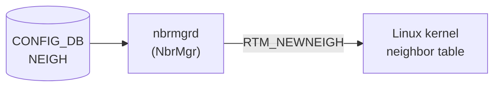

# NEIGH テーブル

## 概要

スタティック隣接（Permanent neighbor）エントリを CONFIG_DB に保持するテーブル[^1]。
`nbrmgrd` (`NbrMgr::doSetNeighTask`) が購読し、Netlink `RTM_NEWNEIGH` でカーネルの neighbor テーブルへ書き込む。
動的に学習した neighbor は `neighsyncd` → APPL_DB `NEIGH_TABLE` 経路で処理されるため、本テーブルはあくまで**手動投入のスタティック neighbor**が対象となる。

FG-NHG (Fine-Grained ECMP) 構成では `minigraph.py` が本テーブルを自動生成する（MAC フィールドなし、family フィールドのみ）[^2]。

<!-- cdb-mermaid -->
### データフロー (自動生成)



!!! note "凡例"
    CONFIG_DB から SAI までの典型経路を `docs/reference/config-db-orch-map.md` から機械生成したミニ図。詳細・例外は本ページ本文と対応表を参照。
<!-- /cdb-mermaid -->

## key 構造

```text
NEIGH|<port>|<ip_address>
```

- `<port>`: インターフェイス名（例: `Ethernet0`、`Vlan1000`、`PortChannel1`）
- `<ip_address>`: 対向の IPv4 または IPv6 アドレス（例: `10.0.0.2`、`2000::2`）

## フィールド

| フィールド | 型 | 必須 | 説明 |
|-----------|----|------|------|
| `neigh` | `yang:mac-address` | 任意 | 対向の MAC アドレス |
| `family` | `string (IPv4\|IPV4\|IPv6\|IPV6)` | 任意 | IP ファミリ（Consumer は参照しない — 後述） |

<!-- ordering -->
## 書込み順依存（orchagent / SAI プログラミング経路）

> 本セクションは APPL_DB `NEIGH_TABLE` → orchagent (`neighorch`) → SAI → ASIC の経路を対象とする。
> CONFIG_DB `NEIGH` → `nbrmgrd` → カーネル Netlink 経路は SAI を経由しない独立経路（詳細は「実コンテナ動作トレース」段階 4 参照）。

### 前提：`allPortsReady()` ガード（最上位）

`NeighOrch::doTask` (neighorch.cpp:881-884) は先頭で `gPortsOrch->allPortsReady()` を確認する。
PORT / VLAN / LAG などの物理ポート初期化が完了するまで、`NEIGH_TABLE` のいかなるエントリも処理されない。

```cpp
if (!gPortsOrch->allPortsReady())
{
    return;
}
```

### 順序依存一覧

| 順序 | 先行必須条件 | ガード箇所 | 違反時の挙動 |
|------|------------|-----------|------------|
| 1 | PORT/VLAN 初期化完了（`allPortsReady`） | `doTask`:881 | `doTask` 全体が即 `return`（次サイクル再試行） |
| 2 | 対象インターフェイス PORT 存在（`getPort`） | `doTask`:942 | `it++; continue`（再試行待ち） |
| 3 | Router Interface (RIF) 存在（`p.m_rif_id`） | `doTask`:949 | `it++; continue`（再試行待ち） |
| 4 | RIF ID 再確認（`getRouterIntfsId`） | `addNeighbor`:1204 | `return false`（再試行待ち） |
| 5 | ARP/ND 解決完了（MAC 確定） | `addNeighbor`:1219 | NEIGH_RESOLVE_TABLE 経由で再解決を要求、MAC 確定後に再 SET |
| 6 | `create_neighbor_entry` → `create_next_hop` | SAI 発行順:1333→1370 | NH 作成失敗時は `neighbor_entry` をロールバック削除 |
| 7 | 旧 VLAN DEL → 新 VLAN SET（同 VRF 内のみ自動処理） | `addNeighbor`:1263 | 旧エントリ削除失敗時は `return false`（再試行） |

### ARP/ND 解決と SAI neighbor_entry 作成の関係

APPL_DB `NEIGH_TABLE` に MAC なし（ゼロ MAC）エントリが届いた場合、`NeighOrch` は `NEIGH_RESOLVE_TABLE` へ解決要求を投げ (`resolveNeighborEntry`)、エントリを `m_neighborToResolve` に保持する。
`neighsyncd` が Netlink から ARP/ND 応答を受信して MAC 付きエントリを `NEIGH_TABLE` へ再書き込みすると、orchagent が `addNeighbor` → `sai_neighbor_api->create_neighbor_entry` を実行する。

```
NEIGH_TABLE (MAC なし) → resolveNeighborEntry → NEIGH_RESOLVE_TABLE
                                                       ↓
                                              カーネル ARP/NDP 解決
                                                       ↓
                                           neighsyncd → NEIGH_TABLE (MAC あり)
                                                       ↓
                                           addNeighbor → sai_neighbor_api->create_neighbor_entry
                                                       ↓
                                           addNextHop  → sai_next_hop_api->create_next_hop
```

<!-- /ordering -->

<!-- defaults -->
## コード由来の暗黙デフォルト

### `neigh` — MAC アドレス

| 条件 | 実装挙動 | 根拠 |
|------|---------|------|
| `neigh` フィールド省略 | `MacAddress` デフォルトコンストラクタ（ゼロ MAC `00:00:00:00:00:00`）→ `setNeighbor()` 内で `!mac` が真 → `NUD_DELAY + NTF_USE` でカーネルに ARP/NDP 解決を要求 | `nbrmgr.cpp:175–183` |
| 有効な MAC 文字列 | `ndm_state = NUD_PERMANENT` でカーネルに永続 neighbor として設定 | `nbrmgr.cpp:189` |
| 無効な MAC 文字列 | `std::invalid_argument` を catch → エラーログ → エントリをサイレント drop（再試行なし） | `nbrmgr.cpp:342–353` |

> `neigh` を省略して書き込むと、MAC なしエントリとして ARP 解決を要求する仕様は**意図的**（FG-NHG などの use case）。ただし解決失敗時の再投入ロジックはない。

### `family` — dead field（CONFIG_DB NEIGH 文脈）

`doSetNeighTask` は受け取ったフィールドをループしているが `field == "neigh"` のみ分岐処理し、`family` フィールドは**一切読まない**[^3]。

IP ファミリ判定は key の `<ip_address>` 部分から `IpAddress::isV4()` で自動判定する（`nbrmgr.cpp:147/164`）。

> YANG に `family` フィールドが定義されているにもかかわらず、実装上は無視される YANG-実装 discrepancy。APPL_DB `NEIGH_TABLE` の `family` フィールド（neighsyncd が書き込み、restore_neighbors.py が必須チェック）とは別文脈。

### DEL_COMMAND — 未実装（既知の設計不足）

CONFIG_DB から `NEIGH` エントリを削除しても、`doSetNeighTask` の `DEL_COMMAND` ブランチは「`Not yet implemented`」ログのみで処理なし[^4]。  
カーネルに `NUD_PERMANENT` で設定済みの neighbor エントリは**削除されない**。手動で `ip neigh del` を実行するか再起動が必要。

<!-- /defaults -->

<!-- value-behavior -->
## 値依存挙動マトリクス

### `neigh` (yang:mac-address)

| 値 | カーネルへの挙動 |
|----|----------------|
| 有効な MAC（例: `00:11:22:33:44:55`）| `NUD_PERMANENT` で永続 neighbor を設定 |
| 省略 / ゼロ MAC | `NUD_DELAY + NTF_USE` で ARP/NDP 解決を要求 |
| 不正な MAC 文字列 | サイレント drop（エラーログのみ） |
| ブロードキャスト MAC（`ff:ff:ff:ff:ff:ff`）| YANG では許可（mac-address 型）。ただし neighsyncd 側では拒否（APPL_DB 文脈）; CONFIG_DB nbrmgr 経路では制御なし |

### `family` (string)

| 値 | Consumer の挙動 |
|----|----------------|
| `IPv4` / `IPV4` / `IPv6` / `IPV6` | nbrmgrd は読まない（dead field）。ファミリは IP アドレスから自動判定 |
| 省略 | 同上 |

<!-- /value-behavior -->

## 制約

- `port` は YANG で `PORTCHANNEL_LIST.name`、`PORT_LIST.name`、または `Vlan[0-9]+` パターンへの union 型。
- `neighbor`（key の ip_address 部分）は `inet:ip-address` 型で IPv4/IPv6 両対応。
- `neigh` MAC に YANG mandatory 指定なし。省略可能（ただし実装挙動は上記の通り）。
- `family` に YANG mandatory 指定なし。実装は無視する。

## 購読者

| Consumer | ソースファイル | 役割 |
|----------|-------------|------|
| `nbrmgrd` (`NbrMgr::doSetNeighTask`) | `sonic-swss/cfgmgr/nbrmgr.cpp` | SET 操作を受け取り Netlink でカーネル neighbor テーブルを更新 |
| `minigraph.py` / `sonic-cfggen` | `sonic-buildimage/src/sonic-config-engine/minigraph.py` | FG-NHG 構成時に `NEIGH` を自動生成（書き込み側） |

## 書き込み入り口

| 経路 | 詳細 |
|------|------|
| sonic-cfggen (minigraph) | FG-NHG 構成時に `formulate_fine_grained_ecmp()` が生成。`family` のみ設定、`neigh` なし |
| 手動 sonic-db-cli | `sonic-db-cli CONFIG_DB hset 'NEIGH|<port>|<ip>' neigh <mac>` |
| config_db.json | システム起動時の DB 初期化で取り込み |

## タイミングと副作用

1. **インターフェイス状態依存**: `isIntfStateOk(alias)` が STATE_DB `INTERFACE_TABLE` を確認。インターフェイスが未準備なら処理をスキップし、次の SELECT_TIMEOUT (1000 ms) サイクルで再試行する（nbrmgr.cpp:357–361）。
2. **warm reboot**: `nbrmgrd` 起動時に `NEIGH_RESTORE_TABLE|Flags|restored = "true"` を 120 秒タイムアウトで待機。タイムアウト超過時はワーニングを記録して処理を続行する（nbrmgrd.cpp:54–61）。
3. **VoQ 環境**: `DEVICE_METADATA.switch_type == "voq"` 時のみ `STATE_SYSTEM_NEIGH_TABLE` を追加購読し、リモート neighbor をカーネルへ挿入する別経路が有効になる（nbrmgr.cpp:78–84）。

## 関連 CONFIG_DB / YANG / CLI

- 関連 [CONFIG_DB](../../reference/glossary.md#term-config_db): `INTERFACE`、`DEVICE_METADATA`、`VOQ_INBAND_INTERFACE`
- 関連 [YANG](../../reference/glossary.md#term-yang): `sonic-neigh`
- 関連 CLI: なし（`sonic-db-cli` または `config_db.json` 経由で投入）

<!-- ref-triangle:start -->

## 関連リファレンス

- [YANG](../../reference/glossary.md#term-yang): `sonic-neigh`
- [`DEVICE_NEIGHBOR`](./device-neighbor.md) テーブル（L2 Topology / LLDP 用。本テーブルとは異なる）

<!-- ref-triangle:end -->

## 引用元

[^1]: YANG 定義: `sonic-neigh.yang`. <https://github.com/sonic-net/sonic-buildimage/blob/9ea932ec2e18f35e58268ec2e4456b1d4afd65cd/src/sonic-yang-models/yang-models/sonic-neigh.yang>
[^2]: minigraph.py NEIGH 生成: <https://github.com/sonic-net/sonic-buildimage/blob/9ea932ec2e18f35e58268ec2e4456b1d4afd65cd/src/sonic-config-engine/minigraph.py#L584>
[^3]: `doSetNeighTask` フィールドループ: `sonic-swss/cfgmgr/nbrmgr.cpp:330–347`. <https://github.com/sonic-net/sonic-swss/blob/4305596156d70e9797e8a881b3d19b46de0bce0d/cfgmgr/nbrmgr.cpp#L330>
[^4]: DEL_COMMAND 未実装: `sonic-swss/cfgmgr/nbrmgr.cpp:373–376`. <https://github.com/sonic-net/sonic-swss/blob/4305596156d70e9797e8a881b3d19b46de0bce0d/cfgmgr/nbrmgr.cpp#L373>

<!-- ops-hint -->
## 運用ヒント

### 典型値（スタティック neighbor の手動設定）

```bash
sonic-db-cli CONFIG_DB hset 'NEIGH|Ethernet0|10.0.0.2' neigh '00:11:22:33:44:55'
```

FG-NHG 用（minigraph.py が自動生成）:

```json
"NEIGH": {
  "Ethernet0|192.168.1.1": {
    "family": "IPv4"
  }
}
```

### 確認コマンド

```bash
sonic-db-cli CONFIG_DB keys 'NEIGH|*'
sonic-db-cli CONFIG_DB hgetall 'NEIGH|Ethernet0|10.0.0.2'
ip neigh show dev Ethernet0
```

### よくある誤設定

- `neigh` フィールドを省略したまま設定すると ARP 解決トリガになる（エラーにならず動作が不明瞭）。
- CONFIG_DB から削除しても (`sonic-db-cli CONFIG_DB del`) カーネルの neighbor エントリは残る。カーネル側も `ip neigh del` で明示的に削除すること。
- `family` フィールドは YANG に定義があるが CONFIG_DB NEIGH 文脈では Consumer が読まないため、設定しても動作に影響しない。
<!-- /ops-hint -->

<!-- cdb-exceptions -->
## 例外条件・特殊挙動

| Consumer | 条件 | 挙動 |
|---|---|---|
| `nbrmgrd` | `neigh` フィールドに無効な MAC 文字列 | `invalid_argument` catch → エラーログ → エントリをサイレント drop（再試行なし） |
| `nbrmgrd` | DEL_COMMAND | 「Not yet implemented」ログのみ。カーネル neighbor は削除されない |
| `nbrmgrd` | インターフェイス未準備（STATE_DB に未登録）| エントリをキューに保留し、1000 ms ごとに再試行 |
| `nbrmgrd` | VoQ 以外環境で `STATE_SYSTEM_NEIGH` に変更 | `doStateSystemNeighTask` は VoQ 時のみ登録されるため無視 |
| `minigraph.py` | FG-NHG 構成時 | `family` のみ設定の NEIGH エントリを自動生成。`neigh` MAC は省略 → ARP 解決トリガとして機能 |

> **Evidence**: `sonic-swss/cfgmgr/nbrmgr.cpp:342–353, 373–376, 357–361, 78–84`; `sonic-buildimage/src/sonic-config-engine/minigraph.py:584`
<!-- /cdb-exceptions -->

<!-- runtime-trace -->
## 実コンテナ動作トレース

### 段階 1 — Consumer 登録

`nbrmgrd` 起動時に `NbrMgr` コンストラクタが `CFG_NEIGH_TABLE_NAME` (`"NEIGH"`) を購読対象として登録。

```cpp
vector<string> cfg_nbr_tables = { CFG_NEIGH_TABLE_NAME };
NbrMgr nbrmgr(&cfgDb, &appDb, &stateDb, cfg_nbr_tables);
```

### 段階 2 — SET ハンドラ (`doSetNeighTask`)

1. key を `|` で分割 → `alias`（インターフェイス名）と `IpAddress ip`
2. `isIntfStateOk(alias)` → STATE_DB `INTERFACE_TABLE` を確認。未準備なら `it++` で skip（次 tick 再試行）
3. フィールドループで `field == "neigh"` のみ `MacAddress mac` にパース。失敗なら drop
4. `setNeighbor(alias, ip, mac)` を呼び出し Netlink `RTM_NEWNEIGH` を発行

### 段階 3 — `setNeighbor` の Netlink 発行

- MAC あり: `ndm_state = NUD_PERMANENT` + MAC アドレス属性 (`NDA_LLADDR`) 付きで `RTM_NEWNEIGH`
- MAC なし（ゼロ）: `ndm_state = NUD_DELAY`、`ndm_flags = NTF_USE` で `RTM_NEWNEIGH` → カーネルが ARP/NDP 解決を開始

### 段階 4 — SAI 経由なし

本テーブルはカーネルの neighbor テーブルを直接操作する（Netlink 経由）。SAI / orchagent 経路は通らない。  
ASIC への neighbor プログラムは `neighsyncd` が APPL_DB `NEIGH_TABLE` を経由して `neighorch` へ伝達する別経路で行われる。
<!-- /runtime-trace -->
