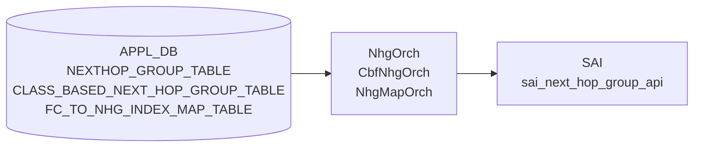

# NEXTHOP_GROUP / CBF_NHG / NHG_MAP テーブル

## 概要

[orchagent](../../reference/glossary.md#term-orchagent) の `NhgOrch`・`CbfNhgOrch`・`NhgMapOrch` が [APPL_DB](../../reference/glossary.md#term-appl_db) の次ホップグループ関連テーブルを購読し、[SAI](../../reference/glossary.md#term-sai) へ反映するコンポーネント[^1]。

- **`NEXTHOP_GROUP_TABLE`** — 通常 [ECMP](../../reference/glossary.md#term-ecmp) / [MPLS](../../reference/glossary.md#term-mpls) / [SRv6](../../reference/glossary.md#term-srv6) / recursive NHG
- **`CLASS_BASED_NEXT_HOP_GROUP_TABLE`** — フォワーディングクラス (FC) ベースの CBF NHG
- **`FC_TO_NHG_INDEX_MAP_TABLE`** — FC → NHG メンバーインデックスのマップ

!!! info "CONFIG_DB 直接購読なし"
    3 オーケストレータはいずれも CONFIG_DB を直接購読しない。上位デーモン (fpmsyncd, bgpd など) が APPL_DB へ書き込み、orchagent が APPL_DB を処理する。

<!-- cdb-mermaid -->
### データフロー (自動生成)



!!! note "凡例"
    APPL_DB から SAI までの典型経路。詳細は本文を参照。
<!-- /cdb-mermaid -->

## NEXTHOP_GROUP_TABLE フィールド

`NhgOrch::doTask()` が解析するフィールド[^1]。

| フィールド | 型 | 必須 | デフォルト | 説明 |
|----------|----|------|------------|------|
| `nexthop` | カンマ区切り IP アドレス | 通常 NHG 時 yes | `""` (省略可) | ネクストホップ IP アドレス列 |
| `ifname` | カンマ区切りインタフェース名 | 通常 NHG 時 yes | `""` (省略可) | 出力インタフェース名列 |
| `weight` | カンマ区切り整数 | no | `""` → 0 → 均等 [ECMP](../../reference/glossary.md#term-ecmp) | [ECMP](../../reference/glossary.md#term-ecmp) メンバーウェイト。省略または 0 で [SAI](../../reference/glossary.md#term-sai) 属性なし (均等分散) |
| `mpls_nh` | カンマ区切りラベルスタック | no | `""` (省略可) | [MPLS](../../reference/glossary.md#term-mpls) ラベルスタック。`"na"` でラベルなし |
| `seg_src` | カンマ区切り [SRv6](../../reference/glossary.md#term-srv6) ソース IP | [SRv6](../../reference/glossary.md#term-srv6) 時 yes | `""` | SRv6 ソースアドレス。設定すると `srv6_nh=true` |
| `nexthop_group` | NHG_DELIMITER 区切り NHG インデックス | recursive NHG 時 yes | `""` | 再帰 NHG のメンバー NHG インデックス列。設定すると `is_recursive=true` |

<!-- defaults -->
### デフォルト値 (コード由来)

| 内部変数 | デフォルト値 | コード根拠 |
|---------|------------|---------|
| `is_recursive` | `false` | nhgorch.cpp:65 — `bool is_recursive = false;` |
| `overlay_nh` | `false` | nhgorch.cpp:67 — `bool overlay_nh = false;` |
| `srv6_nh` | `false` | nhgorch.cpp:68 — `bool srv6_nh = false;` |
| `weight` フィールド省略時 | [SAI](../../reference/glossary.md#term-sai) 属性なし → 均等 ECMP | nhgorch.cpp:1113-1118 — `if (weight != 0) { ... nhgm_attr ... }` のみ設定 |
| SAI グループ型 (通常 NHG) | `SAI_NEXT_HOP_GROUP_TYPE_ECMP` | nhgorch.cpp:772 |
| 1 メンバー非 recursive NHG | グループ作成せず NH ID を直接使用 | nhgorch.cpp:741-760 |
<!-- /defaults -->

### 相互排他制約

`nexthop`/`ifname` (通常 NH) と `nexthop_group` (recursive) の同時指定は `SWSS_LOG_ERROR` + エントリ破棄[^1]。

### Temp NHG (リソース枯渇時)

NHG 数が上限 (`getMaxNhgCount()`) に達した場合、1 メンバーをランダム選択した仮グループを作成する[^1]。SRv6 NHG は仮グループ非対応。

## CLASS_BASED_NEXT_HOP_GROUP_TABLE フィールド

`CbfNhgOrch::doTask()` が解析するフィールド[^2]。

| フィールド | 型 | 必須 | デフォルト | 説明 |
|----------|----|------|------------|------|
| `members` | カンマ区切り NHG インデックス文字列 | yes | `""` → 検証失敗・破棄 | CBF グループのメンバー NHG インデックス列。順序が SAI INDEX に対応 |
| `selection_map` | NHG_MAP インデックス文字列 | yes | `""` → 存在しない場合 return false | FC → NHG インデックスのマップ参照 |

<!-- defaults -->
### デフォルト値 (コード由来)

| 内部変数 | デフォルト値 | コード根拠 |
|---------|------------|---------|
| メンバー INDEX | 0 ベース (投入順) | cbfnhgorch.cpp:258 — `m_members.emplace(member, CbfNhgMember(member, idx++));` |
| SAI グループ型 | `SAI_NEXT_HOP_GROUP_TYPE_CLASS_BASED` | cbfnhgorch.cpp:302 |
| SAI CONFIGURED_SIZE | メンバー数 (`m_members.size()`) | cbfnhgorch.cpp:307-308 |
<!-- /defaults -->

### 検証ロジック

| 条件 | 挙動 |
|------|------|
| `members` が空 | `SWSS_LOG_ERROR` + エントリ破棄 |
| `members` に重複あり | `SWSS_LOG_ERROR` + エントリ破棄 |
| メンバー数 > `getMaxNumFcs()` | `SWSS_LOG_WARN` (処理は継続) |
| `selection_map` が未登録 | `SWSS_LOG_ERROR` + `return false` (再試行) |
| マップ最大インデックス >= メンバー数 | `SWSS_LOG_ERROR` + `return false` (再試行) |
| メンバー NHG が未 sync / temporary | `return false` (再試行、temp は継続監視) |

## FC_TO_NHG_INDEX_MAP_TABLE フィールド

`NhgMapOrch::doTask()` / `getMap()` が処理するフィールド[^3]。
テーブルエントリは `<FC値>` (フィールド名) → `<NH_index値>` (フィールド値) のマッピング列。

| フィールド | 型 | 制約 | 説明 |
|----------|----|------|------|
| `<FC値>` (フィールド名) | 整数 | `[0, max_num_fcs)` | フォワーディングクラス値 |
| `<NH_index値>` (フィールド値) | 非負整数 | `>= 0` | CBF NHG のメンバーインデックス |

<!-- defaults -->
### デフォルト値 (コード由来)

| 内部変数 | デフォルト値 | コード根拠 |
|---------|------------|---------|
| `m_max_nhg_map_count` | SAI `sai_object_type_get_availability()` から取得、非対応時は 0 | nhgmaporch.cpp:26-34 |
| SAI マップ型 | `SAI_NEXT_HOP_GROUP_MAP_TYPE_FORWARDING_CLASS_TO_INDEX` | nhgmaporch.cpp:118-119 |
<!-- /defaults -->

### 検証ロジック

| 条件 | 挙動 |
|------|------|
| マップが空 (FV なし) | `SWSS_LOG_ERROR` + `success=false` |
| FC 値が負または >= max_num_fcs | `SWSS_LOG_ERROR` + エントリ破棄 |
| NH index が負 | `SWSS_LOG_ERROR` + エントリ破棄 |
| スイッチが NHG マップ非対応 | `m_max_nhg_map_count=0` + `SWSS_LOG_WARN` |
| リソース枯渇 (既存マップ数 >= m_max_nhg_map_count) | `SWSS_LOG_WARN` + `success=false` (再試行) |

## 購読者

| オーケストレータ | [APPL_DB](../../reference/glossary.md#term-appl_db) テーブル | SAI API |
|----------------|----------------|---------|
| `NhgOrch` | `NEXTHOP_GROUP_TABLE` | `sai_next_hop_group_api->create/remove_next_hop_group` |
| `CbfNhgOrch` | `CLASS_BASED_NEXT_HOP_GROUP_TABLE` | `sai_next_hop_group_api->create/remove_next_hop_group` |
| `NhgMapOrch` | `FC_TO_NHG_INDEX_MAP_TABLE` | `sai_next_hop_group_api->create/remove_next_hop_group_map` |

## 関連 CONFIG_DB / YANG / CLI

- 関連 [CONFIG_DB](../../reference/glossary.md#term-config_db): なし ([APPL_DB](../../reference/glossary.md#term-appl_db) 直接操作)
- 関連テーブル: `FG_NHG` (FG ECMP、別オーケストレータ `FgNhgOrch`)

<!-- ordering -->
## 書込み順依存 (Phase B)

<!-- evidence: sonic-net/sonic-swss orchagent/nhgorch.cpp NhgOrch::doTask:41-44 / NhgOrch::addNhg(sync):775-808 / syncMembers:913-964 / NhgOrch::update:988-1087 / recursive-member-check:128-153 / NH-resolve-check:936-944 -->

### 1. NEXTHOP 先行必須（NeighOrch NH 解決待ち）

`syncMembers()` は各メンバーの `getNhId()` が `SAI_NULL_OBJECT_ID` の場合にそのメンバーをスキップし `success = false` を返す。未 sync NH があるとグループ作成が再試行キューに戻る。`NEXTHOP_GROUP_TABLE` を書く前に対応ネクストホップが NeighOrch によって解決済みであること[^1]。

> コード根拠: `nhgorch.cpp:936–944`

### 2. allPortsReady() 先行必須

`NhgOrch::doTask()` の先頭でポート初期化完了を確認し、未完了の場合即 `return`。システム起動直後のエントリは無視される（再試行なし）[^1]。

> コード根拠: `nhgorch.cpp:41–44`

### 3. recursive NHG — メンバー NHG の先行 sync 必須

`nexthop_group` フィールドで指定する各メンバー NHG が `m_syncdNextHopGroups` に存在しない場合は除外して部分適用される。recursive / temporary なメンバーは `SWSS_LOG_ERROR` でエントリ破棄[^1]。

> コード根拠: `nhgorch.cpp:128–153`

### 4. SAI nhg_member 作成順 — グループ本体 → メンバー

`sync()` は必ず ①`create_next_hop_group`（グループ本体）→ ②`syncMembers()`（メンバー一括追加）の順で実行する。メンバー属性の設定順は `NEXT_HOP_GROUP_ID` → `NEXT_HOP_ID` → `WEIGHT`（weight != 0 の場合のみ）[^1]。

> コード根拠: `nhgorch.cpp:775–808`, `nhgorch.cpp:1099–1121`

### 5. メンバー追加は ObjectBulker でバッチ処理

`syncMembers()` は全メンバーの `create_entry()` をバッファリングしてから `flush()` で一括 SAI 呼び出しを行う。適用順序は `std::set<NextHopKey>` の辞書順。インタフェース down のメンバー（`NHFLAGS_IFDOWN`）はスキップ[^1]。

> コード根拠: `nhgorch.cpp:913–964`

### 6. update() — 削除先行・追加後続（ASIC メンバー上限対策）

NHG 更新時は ①`removeMembers()`（旧メンバー削除）→ ②`syncMembers()`（新メンバー追加）の順序が強制される。逆順では [ASIC](../../reference/glossary.md#term-asic) グループメンバー数上限に達して追加失敗する可能性がある[^1]。

> コード根拠: `nhgorch.cpp:988–1087`（コメント: "avoid cases where we reached the [ASIC](../../reference/glossary.md#term-asic) group members limit"）

### 順序依存サマリ

| # | 依存関係 | 方向 | 緩和策 |
|---|----------|------|--------|
| 1 | NeighOrch NH 解決 → NEXTHOP_GROUP_TABLE | 先行必須 | 未 sync NH はスキップ・再試行 |
| 2 | allPortsReady() → NhgOrch doTask() | 先行必須 | 初期化完了前は全エントリ無視 |
| 3 | メンバー NHG sync → recursive NHG | 先行必須 | 未 sync メンバーは除外、部分適用 |
| 4 | create_next_hop_group → create_next_hop_group_member | 強制先行（sync() 内） | SAI API 構造上保証 |
| 5 | removeMembers → syncMembers（update 時） | 強制先行（[ASIC](../../reference/glossary.md#term-asic) 上限回避） | 削除で空きを確保してから追加 |

<!-- /ordering -->

<!-- cross-refs -->
## 暗黙参照 (Phase C)

`NhgOrch` / `CbfNhgOrch` / `NhgMapOrch` は以下の他オーケストレータ・テーブルへ暗黙的に依存する。
[YANG](../../reference/glossary.md#term-yang) / [CONFIG_DB](../../reference/glossary.md#term-config_db) には現れないコード上の直接参照。

| 参照先 | 参照元 | 参照の性質 | 未解決時の挙動 |
|-------|-------|-----------|--------------|
| NeighOrch (APPL_DB:`NEIGH_TABLE`) | `NhgOrch` | nexthop SAI ID 取得・refcount 増減・[MPLS](../../reference/glossary.md#term-mpls) NH 追加/削除 | nexthop 未解決のメンバーはスキップ → NHG `sync=false`、再試行 |
| NeighOrch コールバック | `NeighOrch` → `NhgOrch` | `validateNextHop` / `invalidateNextHop` でリンク up/down 時の自動メンバー除外 | コールバック欠如でリンクダウン NH の継続使用 (ECMP 偏り) |
| RouteOrch (APPL_DB:`ROUTE_TABLE`) | `NhgOrch` / `CbfNhgOrch` | NHG 総数上限チェック (`getNhgCount() + getSyncedCount() >= getMaxNhgCount()`) | 上限到達時は新規 NHG 作成を拒否、Temp NHG 昇格もブロック |
| RouteOrch — refcount API | `RouteOrch` → `NhgOrch` / `CbfNhgOrch` | `incNhgRefCount` / `decNhgRefCount`：ルートが NHG を参照している間は DEL ガード | ref_count > 0 の NHG を DEL しようとすると `SWSS_LOG_ERROR` + 保留 |
| NhgOrch (NEXTHOP_GROUP_TABLE) | `CbfNhgOrch` | `members` に指定した NHG インデックスが `m_syncdNextHopGroups` に存在し `sync=true` であること | メンバー NHG 未 sync → CBF NHG 作成が `return false` で再試行ループ |

詳細証跡: `meta/_intermediate/cdb-flow/nhg-orch-cross-refs.md`
<!-- /cross-refs -->

<!-- failure -->
## 失敗挙動マトリクス (Phase D)

### NhgOrch — SET 処理における失敗経路

| 失敗条件 | 検出箇所 | 結果 | ログ出力 | evidence |
|---|---|---|---|---|
| `nexthop_group` と `nexthop`/`ifname` が共存（再帰 NHG と通常 NHG フィールド混在） | `doTask()` | erase（永久破棄） | `SWSS_LOG_ERROR("Nexthop group %s has both regular(ip/alias) and recursive fields")` | `nhgorch.cpp:98–103` |
| SRv6 NHG で `nexthop` 数と `seg_src` 数が不一致 | `doTask()` | erase（永久破棄） | `SWSS_LOG_ERROR("inconsistent number of endpoints and srv6_srcs.")` | `nhgorch.cpp:209–214` |
| 再帰 NHG のメンバー NHG が recursive または temporary | `doTask()` | erase（永久破棄） | `SWSS_LOG_ERROR("Invalid member nexthop group %s in parent nhg %s")` | `nhgorch.cpp:139–157` |
| 再帰 NHG で異なる型（SRv6 と非 SRv6、overlay と非 overlay）が混在 | `doTask()` | erase（永久破棄） | `SWSS_LOG_ERROR("Inconsistent nexthop group type between %s and %s")` | `nhgorch.cpp:175–198` |
| 再帰 NHG の全メンバー NHG が未登録 | `doTask()` | `++it` silent retry | ログなし | `nhgorch.cpp:160–164` |
| NHG 数上限到達時、SRv6 NHG を作成しようとした | `doTask()` | `++it` retry（temp NHG も作成しない） | `SWSS_LOG_DEBUG("Next hop group count reached its limit.")` | `nhgorch.cpp:252–260` |
| NHG 数上限到達時、temp NHG sync 失敗 | `doTask()` | `++it` retry | `SWSS_LOG_INFO("Failed to sync temporary NHG %s with %s")` | `nhgorch.cpp:271–275` |
| NHG 数上限到達時、createTempNhg に有効 NH が 0 | `createTempNhg()` | `std::logic_error` throw → 呼び出し元 catch → `++it` retry | `SWSS_LOG_INFO("Got exception: ... while adding temp group %s")` | `nhgorch.cpp:277–282, 844–849` |
| SAI `create_next_hop_group` 失敗 | `NextHopGroup::sync()` | `handleSaiCreateStatus()` → `parseHandleSaiStatusFailure()` — `task_need_retry` なら retry | `SWSS_LOG_ERROR("Failed to create next hop group %s, rv:%d")` | `nhgorch.cpp:782–791` |
| `syncMembers()` でメンバーの NH ID が NULL | `syncMembers()` | `success=false` → `sync()` が false → `++it` retry | `SWSS_LOG_WARN("Failed to get next hop %s in group %s")` | `nhgorch.cpp:937–944` |
| bulk create 後に返った SAI メンバー ID が NULL（部分失敗） | `syncMembers()` | `success=false` 部分適用状態で retry | `SWSS_LOG_ERROR("Failed to create next hop group %s's member %s")` | `nhgorch.cpp:973–977` |
| 単一メンバー NHG（非再帰）で NH ID が NULL | `NextHopGroup::sync()` | `return false` → retry | `SWSS_LOG_WARN("Next hop %s is not synced")` | `nhgorch.cpp:746–749` |
| 未解決ネイバー（IP NHG 未作成・ラベル付き NH） | `NextHopGroupMember::getNhId()` | `gNeighOrch->resolveNeighbor()` 呼び出し + SAI_NULL_OBJECT_ID 返却 | `SWSS_LOG_INFO("Failed to get next hop %s, resolving neighbor")` | `nhgorch.cpp:583–586` |
| SRv6 Nexthop 作成失敗 | `NextHopGroupMember::getNhId()` | SAI_NULL_OBJECT_ID 返却 → メンバー sync 失敗として処理 | `SWSS_LOG_ERROR("Failed to create SRv6 nexthop %s")` | `nhgorch.cpp:551–553` |
| weight 更新失敗（update 時） | `NextHopGroup::update()` | `return false` → retry | `SWSS_LOG_WARN("Failed to update member %s weight")` | `nhgorch.cpp:1042–1045` |
| 旧メンバー削除失敗（update 時） | `NextHopGroup::update()` | `return false` → retry（削除済み SAI メンバーは部分的に残る可能性あり） | `SWSS_LOG_WARN("Failed to remove members from group %s")` | `nhgorch.cpp:1057–1060` |
| 新メンバー sync 失敗（update 時） | `NextHopGroup::update()` | `return false` → retry | `SWSS_LOG_WARN("Failed to sync new members for group %s")` | `nhgorch.cpp:1080–1083` |

### NhgOrch — DEL 処理における失敗経路

| 失敗条件 | 検出箇所 | 結果 | ログ出力 | evidence |
|---|---|---|---|---|
| DEL 対象 NHG が参照中（ref_count > 0） | `doTask()` | `success=false` → retry（参照解除まで削除不可） | `SWSS_LOG_INFO("Unable to remove group %s which is referenced")` | `nhgorch.cpp:413–417` |
| DEL 対象 NHG が未登録 | `doTask()` | erase（冪等、retry なし） | `SWSS_LOG_INFO("Unable to find group with key %s to remove")` | `nhgorch.cpp:407–411` |
| 同一キーに pending SET が存在 | `doTask()` | DEL スキップ → SET を適用（最終状態への収束） | ログなし | `nhgorch.cpp:401–405` |

### CbfNhgOrch — 主要失敗経路

| 失敗条件 | 結果 | ログ出力 | evidence |
|---|---|---|---|
| `members` が空または重複あり | erase（永久破棄） | `SWSS_LOG_ERROR("CBF next hop group members list is empty/not unique.")` | `cbfnhgorch.cpp:225–233` |
| NHG 数上限到達 | `++it` retry | `SWSS_LOG_WARN("Reached next hop group limit. Postponing creation.")` | `cbfnhgorch.cpp:102` |
| `selection_map` が未登録または最大インデックス >= メンバー数 | `return false` → retry | `SWSS_LOG_ERROR("FC to NHG map index %s does not exist")` 等 | `cbfnhgorch.cpp:323–330` |
| メンバー NHG が未 sync / temporary | `return false` → retry | `SWSS_LOG_WARN("CBF NHG member %s is not yet synced")` | `cbfnhgorch.cpp:637–638` |
| SAI `create_next_hop_group` (CBF) 失敗 | `handleSaiCreateStatus()` → `parseHandleSaiStatusFailure()` | `SWSS_LOG_ERROR("Failed to create CBF next hop group %s, rv %d")` | `cbfnhgorch.cpp:343–346` |

### retry 挙動まとめ

| シナリオ | retry 上限 | 備考 |
|---|---|---|
| フィールド不正（混在・不一致・invalid type） | **0 回**（erase） | CONFIG の修正が必要 |
| 再帰 NHG メンバー未登録 | なし（`m_toSync` に残留） | メンバー NHG 登録後に自動解消 |
| NHG 数上限到達（SRv6 含む） | なし（`m_toSync` に残留） | リソース解放後に自動解消 |
| SAI create / sync 失敗 | なし（retry を繰り返す） | 永続的 SAI エラーの場合は無限 retry |
| DEL — 参照中ブロック | なし（`m_toSync` に残留） | 参照元ルート削除後に自動解消 |

### 部分適用の注意

`syncMembers()` は `ObjectBulker` で bulk create を行うため、flush 後に個別 SAI ID を確認する。一部成功・一部失敗の**部分適用**が発生しうる。失敗メンバーのみ NULL ID が残り、成功メンバーは SAI に登録済みになる。

NHG update 時は旧メンバー削除後・新メンバー追加前の間、NHG は縮退状態で ASIC に存在する。この間のパケット転送は旧メンバーに基づく ECMP で継続される。

`validateNextHop` / `invalidateNextHop` は NeighOrch からコールバックで呼び出される。失敗時は即 `return false` で後続 NHG への適用を中断する (`nhgorch.cpp:477–483, 513–519`)。

### ECMP リソース枯渇時の暫定動作

NHG 数が上限 (`getMaxNhgCount()`) に達した場合、非 SRv6 NHG は `createTempNhg()` で代表 1 NH のみの temporary group を SAI に登録する。

1. RouteOrch はルート解決を継続できる（ECMP なしの単一 NH ルート）
2. ECMP 動作は一時的に失われる（トラフィックは 1 NH に集中）
3. リソース解放後の次 `doTask()` で temp NHG が完全 NHG に昇格

SRv6 NHG はこの暫定措置を持たないため、リソース枯渇時はルート解決そのものが保留される。

詳細証跡: `meta/_intermediate/cdb-flow/nhg-orch-failure.md`
<!-- /failure -->

<!-- constants -->
## ハードコード定数 (Phase E)

<!-- evidence: meta/_intermediate/cdb-flow/nhg-orch-constants.md -->

`NhgOrch` / `CbfNhgOrch` / `NhgMapOrch` に存在する、CONFIG\_DB / [YANG](../../reference/glossary.md#term-yang) で管理されないハードコード定数・ランタイム取得上限の一覧。

### SAI bulk 処理上限

| 定数 | デフォルト値 | 用途 | ソース |
|------|------------|------|--------|
| `DEFAULT_MAX_BULK_SIZE` | `1000` | `ObjectBulker` の flush 単位上限。`syncMembers()` でのメンバー一括 SAI 呼び出し件数を制限 | `orchdaemon.cpp` L81–82 |

`gMaxBulkSize` は `orchagent` 起動オプション `-k <bulk_size>` で上書き可能。`nhgorch.cpp:913`・`cbfnhgorch.cpp:619–621` で参照。

### SAI グループ型 (固定値)

これらの値は CONFIG\_DB フィールドとしては存在せず、各オーケストレータがハードコードして SAI に渡す。

| オーケストレータ | SAI 属性 | 固定値 | ソース |
|---|---|---|---|
| `NhgOrch` (通常 NHG) | `SAI_NEXT_HOP_GROUP_ATTR_TYPE` | `SAI_NEXT_HOP_GROUP_TYPE_ECMP` | `nhgorch.cpp` L772 |
| `CbfNhgOrch` | `SAI_NEXT_HOP_GROUP_ATTR_TYPE` | `SAI_NEXT_HOP_GROUP_TYPE_CLASS_BASED` | `cbfnhgorch.cpp` L302 |
| `NhgMapOrch` | `SAI_NEXT_HOP_GROUP_MAP_ATTR_TYPE` | `SAI_NEXT_HOP_GROUP_MAP_TYPE_FORWARDING_CLASS_TO_INDEX` | `nhgmaporch.cpp` L119 |

### NhgMapOrch — NHG マップ数上限 (ランタイム取得)

| 変数 | 初期値 | 取得方法 | フォールバック |
|------|--------|----------|--------------|
| `m_max_nhg_map_count` | `0` | `SAI_OBJECT_TYPE_NEXT_HOP_GROUP_MAP` の `sai_object_type_get_availability()` で起動時取得 | SAI 非対応時は `0` のまま — 以降の登録は全件ブロック |

ソース: `nhgmaporch.cpp` L10, L26–34, L105。

### NhgMapOrch — FC 値有効範囲 (ランタイム取得)

| 変数 | 初期値 | 取得方法 | フォールバック |
|------|--------|----------|--------------|
| `max_num_fcs` (static) | `-1`（未取得を示す番兵値） | `SAI_SWITCH_ATTR_MAX_NUMBER_OF_FORWARDING_CLASSES` を `getMaxNumFcs()` 初回呼び出し時に SAI から取得 | 取得失敗時は `0` — すべての FC 値が範囲外として拒否される |

有効な FC 値は `[0, max_num_fcs)` 範囲のみ受け付ける (`nhgmaporch.cpp` L356–362)。

詳細証跡: `meta/_intermediate/cdb-flow/nhg-orch-constants.md`
<!-- /constants -->

<!-- side-effects -->
## 副次 DB 書込 (Phase F)

`NhgOrch` / `CbfNhgOrch` / `NhgMapOrch` が APPL_DB テーブルを処理する際に、SAI 操作の成否に応じて以下の副次 DB エントリを書き込む。[ASIC_DB](../../reference/glossary.md#term-asic_db) への書込みは sai_next_hop_group_api 経由 ([syncd](../../reference/glossary.md#term-syncd)) で行われる主作用のため本表から除外する。

| 副次 DB | テーブル/カウンタ | 書込内容 | 根拠 |
|---------|----------------|---------|------|
| [COUNTERS_DB](../../reference/glossary.md#term-counters_db) | `CRM:STATS` `crm_stats_nexthop_group_used` | NHG SAI 作成成功時 +1、削除成功時 -1 | `nhgbase.h:795` `NhgBase::sync()` / `nhgbase.h:277` `NhgBase::remove()` — `gCrmOrch->incCrmResUsedCounter(CRM_NEXTHOP_GROUP)` / `decCrmResUsedCounter` |
| [COUNTERS_DB](../../reference/glossary.md#term-counters_db) | `CRM:STATS` `crm_stats_nexthop_group_used` (CBF) | CBF NHG SAI 作成成功時 +1、削除成功時 -1 | `cbfnhgorch.cpp:358` `gCrmOrch->incCrmResUsedCounter(CRM_NEXTHOP_GROUP)` |
| [COUNTERS_DB](../../reference/glossary.md#term-counters_db) | `CRM:STATS` `crm_stats_nexthop_group_member_used` | 各 NHG メンバー SAI エントリ作成時 +1、削除時 -1 | `nhgbase.h:132` `NhgMemberBase::sync()` / `nhgbase.h:151` `NhgMemberBase::remove()` |
| COUNTERS_DB | `CRM:STATS` `crm_stats_nexthop_group_map_used` | FC_TO_NHG_INDEX_MAP SAI 作成成功時 +1、削除成功時 -1 | `nhgmaporch.cpp:146` / `nhgmaporch.cpp:211` `gCrmOrch->inc/decCrmResUsedCounter(CRM_NEXTHOP_GROUP_MAP)` |

### ref_count による副次動作

`RouteOrch` がルートエントリに NHG を紐づける際に `incNhgRefCount()` / `decNhgRefCount()` を呼び出す (`routeorch.cpp:2546, 2646, 2672, 2900`)。ref_count > 0 の NHG は `NhgOrch::doTask()` 内の DEL 処理でスキップされる (`nhgorch.cpp:414`)。これは DB への書込みではなくオーケストレータ内部のメモリ上カウンタであり、DB エントリの削除抑制という副次動作をもたらす。

### 不在確認

[STATE_DB](../../reference/glossary.md#term-state_db) / APPL_STATE_DB への直接書込み・`ResponsePublisher` の使用・[FLEX_COUNTER_DB](../../reference/glossary.md#term-flex_counter_db) への書込みは、3 オーケストレータのいずれでも検出されなかった。

詳細証跡: `meta/_intermediate/cdb-flow/nhg-orch-side-effects.md`
<!-- /side-effects -->

<!-- pubsub -->
## 通信メカニズム (Phase G)

`NhgOrch` / `CbfNhgOrch` / `NhgMapOrch` は純粋な Consumer であり、`NotificationConsumer` / `ResponsePublisher` は使用しない。Producer → APPL_DB → Consumer ([orchagent](../../reference/glossary.md#term-orchagent)) という一方向 Pub/Sub 経路のみで動作する。

### Producer 側

| テーブル | Producer | 機構 |
|---------|---------|------|
| `NEXTHOP_GROUP_TABLE` | `fpmsyncd` (RouteSync) | `ProducerStateTable` — [FRR](../../reference/glossary.md#term-frr)/Zebra から kernel netlink で受信した ECMP ルートを `updateNextHopGroupDb()` → `m_nexthop_groupTable.set/del()` で書き込む (`routesync.cpp:157`, `routesync.cpp:3400-3419`, `routesync.cpp:3370`) |
| `CLASS_BASED_NEXT_HOP_GROUP_TABLE` | 上位制御プレーン ([BGP](../../reference/glossary.md#term-bgp) ソフトウェア等) | `ProducerStateTable` — [sonic-swss](../../reference/glossary.md#term-sonic-swss) 本体での書き込みデーモンは未実装。テストは `test_nhg.py:216` で [ProducerStateTable](../../reference/glossary.md#term-producerstatetable) を直接使用 |
| `FC_TO_NHG_INDEX_MAP_TABLE` | 上位制御プレーン | 同上 |

`ProducerStateTable::set/del` は `<TABLE>_CHANNEL@0` に [Redis](../../reference/glossary.md#term-redis) PUBLISH を発行する。

### Consumer 側 (orchagent)

3 オーケストレータはいずれも `Orch(db, tableName)` 基底クラスが生成する `ConsumerStateTable` で APPL_DB を購読する。

| オーケストレータ | 購読テーブル | 構築箇所 |
|----------------|------------|---------|
| `NhgOrch` | `NEXTHOP_GROUP_TABLE` | `orchdaemon.cpp:338` |
| `CbfNhgOrch` | `CLASS_BASED_NEXT_HOP_GROUP_TABLE` | `orchdaemon.cpp:339` |
| `NhgMapOrch` | `FC_TO_NHG_INDEX_MAP_TABLE` | `orchdaemon.cpp:490` |

[orchagent](../../reference/glossary.md#term-orchagent) の `Select::select` タイムアウトは **1000 ms** (`orchdaemon.cpp:23`)。`orchList` の処理順は `NhgMapOrch` → `NhgOrch` → `CbfNhgOrch` であり、同一サイクル内で FC_TO_NHG_INDEX_MAP → NEXTHOP_GROUP → CLASS_BASED_NEXT_HOP_GROUP の順に消費が試みられる (`orchdaemon.cpp:500`)。

### 通信経路サマリ

| 経路 | チャンネル | 書き込み元 | 消費者 |
|------|----------|-----------|--------|
| [FRR](../../reference/glossary.md#term-frr)/Zebra → [fpmsyncd](../../reference/glossary.md#term-fpmsyncd) | kernel netlink | [FRR](../../reference/glossary.md#term-frr) [zebra](../../reference/glossary.md#term-zebra) | [fpmsyncd](../../reference/glossary.md#term-fpmsyncd) RouteSync |
| [fpmsyncd](../../reference/glossary.md#term-fpmsyncd) → APPL_DB | `NEXTHOP_GROUP_TABLE_CHANNEL@0` | [ProducerStateTable](../../reference/glossary.md#term-producerstatetable) | NhgOrch |
| 上位制御プレーン → APPL_DB | `CLASS_BASED_NEXT_HOP_GROUP_TABLE_CHANNEL@0` | [ProducerStateTable](../../reference/glossary.md#term-producerstatetable) | CbfNhgOrch |
| 上位制御プレーン → APPL_DB | `FC_TO_NHG_INDEX_MAP_TABLE_CHANNEL@0` | ProducerStateTable | NhgMapOrch |
| NhgOrch → SAI | `sai_next_hop_group_api` ([syncd](../../reference/glossary.md#term-syncd) 経由) | orchagent | ASIC |

詳細証跡: `meta/_intermediate/cdb-flow/nhg-orch-pubsub.md`
<!-- /pubsub -->

<!-- platform -->
## プラットフォーム / SAI Capability 差異 (Phase H)

`NhgOrch` / `CbfNhgOrch` / `NhgMapOrch` の動作は、プラットフォームが提供する SAI Capability によって以下の軸で分岐する。

### ECMP グループ上限: Mellanox のみ補正

`RouteOrch` コンストラクタ (`routeorch.cpp:61-89`) が `SAI_SWITCH_ATTR_NUMBER_OF_ECMP_GROUPS` で取得した値を `gRouteOrch->getMaxNhgCount()` として公開する。Mellanox プラットフォーム（`getenv("platform")` に `"mellanox"` が含まれる場合）のみ、この値を `DEFAULT_MAX_ECMP_GROUP_SIZE = 32` で除算して補正する:

```cpp
// orchagent/routeorch.cpp:83-87
char *platform = getenv("platform");
if (platform && strstr(platform, MLNX_PLATFORM_SUBSTRING))
{
    m_maxNextHopGroupCount /= DEFAULT_MAX_ECMP_GROUP_SIZE;
}
```

`NhgOrch::doTask()` (`nhgorch.cpp:252`, `nhgorch.cpp:320`) および `CbfNhgOrch::doTask()` (`cbfnhgorch.cpp:100`) はこの補正後の値を参照して NHG 上限判定を行う。Broadcom / Marvell / VS / VPP 等は SAI 戻り値をそのまま使用する。算出された上限値は `STATE_DB SWITCH_CAPABILITY|switch:MAX_NEXTHOP_GROUP_COUNT` に公開される (`routeorch.cpp:90`)。

### CBF フォワーディングクラス数: SAI_SWITCH_ATTR_MAX_NUMBER_OF_FORWARDING_CLASSES

`NhgMapOrch::getMaxNumFcs()` (`nhgmaporch.cpp:299-325`) は初回呼出し時に `SAI_SWITCH_ATTR_MAX_NUMBER_OF_FORWARDING_CLASSES` を取得する。

| 状況 | 結果 |
|------|------|
| SAI 対応 ASIC | `max_num_fcs = attr.value.u8`（ASIC 依存値） |
| SAI 非対応 ASIC | `SWSS_LOG_WARN("Switch does not support FCs")` + `max_num_fcs = 0` → 以降の FC MAP SET が全て範囲外エラーで破棄される |

`CbfNhg::sync()` はメンバー数が `getMaxNumFcs()` を超えると `SWSS_LOG_WARN` を出力するが処理は継続する (`cbfnhgorch.cpp:311-312`)。

### NHG Map 収容数: sai_object_type_get_availability

`NhgMapOrch` コンストラクタ (`nhgmaporch.cpp:26-34`) で `sai_object_type_get_availability(SAI_OBJECT_TYPE_NEXT_HOP_GROUP_MAP)` を呼び出し、非対応 ASIC は `m_max_nhg_map_count = 0` のまま。以降 `FC_TO_NHG_INDEX_MAP_TABLE` への全 SET が `SWSS_LOG_WARN` + `success=false` となり、`CLASS_BASED_NEXT_HOP_GROUP_TABLE` の `selection_map` 解決に失敗し続ける。

```cpp
// orchagent/cbf/nhgmaporch.cpp:26-34
if (sai_object_type_get_availability(gSwitchId, SAI_OBJECT_TYPE_NEXT_HOP_GROUP_MAP,
                                     0, nullptr, &m_max_nhg_map_count) != SAI_STATUS_SUCCESS)
{
    SWSS_LOG_WARN("Switch does not support NHG maps");
    m_max_nhg_map_count = 0;
}
```

### SRv6 NHG: temp NHG 非対応

NHG 上限到達時、`nhg_key.is_srv6_nexthop()` が真のエントリは temp NHG を作成せず `continue` でスキップする (`nhgorch.cpp:256-261`)。通常 ECMP は temp NHG にフォールバックして 1 メンバーで仮登録されるが、SRv6 NHG はリソースが回復するまで未登録のまま待機し続ける。SRv6 自体のサポートは ASIC ベンダー実装依存（VS / VPP はスタブで SAI SUCCESS を返すが実転送なし）。

### VS / multi-asic

VS プラットフォームでは SAI シムが ECMP / CBF / NHG Map の create を SUCCESS で返すが実 ASIC 転送はない。[CRM](../../reference/glossary.md#term-crm) 統計もダミー値。multi-asic 環境では NhgOrch は名前空間ごとに独立して起動し、NHG インデックス空間は ASIC 間で交わらない。

詳細根拠: `meta/_intermediate/cdb-flow/nhg-orch-platform.md`
<!-- /platform -->

<!-- ref-triangle:start -->

## 関連リファレンス

- [CONFIG_DB リファレンス: FG_NHG](fg-nhg.md)

<!-- ref-triangle:end -->

## 引用元

[^1]: `NhgOrch::doTask()` 実装: `sonic-swss/orchagent/nhgorch.cpp`. <https://github.com/sonic-net/sonic-swss/blob/4305596156d70e9797e8a881b3d19b46de0bce0d/orchagent/nhgorch.cpp>

[^2]: `CbfNhgOrch::doTask()` 実装: `sonic-swss/orchagent/cbf/cbfnhgorch.cpp`. <https://github.com/sonic-net/sonic-swss/blob/4305596156d70e9797e8a881b3d19b46de0bce0d/orchagent/cbf/cbfnhgorch.cpp>

[^3]: `NhgMapOrch::doTask()` 実装: `sonic-swss/orchagent/cbf/nhgmaporch.cpp`. <https://github.com/sonic-net/sonic-swss/blob/4305596156d70e9797e8a881b3d19b46de0bce0d/orchagent/cbf/nhgmaporch.cpp>

<!-- ops-hint -->
## 運用ヒント

### 典型値

- `NEXTHOP_GROUP_TABLE|<nhg_index>`: `nexthop=10.0.0.1,10.0.0.3 ifname=Ethernet0,Ethernet4`
- `weight` 省略時は均等 ECMP。設定時は各メンバーへの相対比率として機能
- CBF NHG は `members` の順序が重要。INDEX は 0 ベースで順序に依存

### よくある誤設定

- `nexthop` と `nexthop_group` の同時指定 → エントリ破棄
- CBF NHG の `members` 重複 → エントリ破棄
- `selection_map` が指すマップの最大 NH インデックス >= CBF NHG メンバー数 → 同期失敗
- NHG マップ数が `m_max_nhg_map_count` を超過 → 作成失敗 (スイッチ依存の上限)

### 確認コマンド

```bash
sonic-db-cli APPL_DB keys 'NEXTHOP_GROUP_TABLE:*'
sonic-db-cli APPL_DB hgetall 'NEXTHOP_GROUP_TABLE:<nhg_index>'
sonic-db-cli APPL_DB keys 'CLASS_BASED_NEXT_HOP_GROUP_TABLE:*'
sonic-db-cli APPL_DB keys 'FC_TO_NHG_INDEX_MAP_TABLE:*'
```
<!-- /ops-hint -->

<!-- glossary-links-injected: nhg-orch -->

<!-- glossary-links-injected: 71dd7b1855b6 -->
