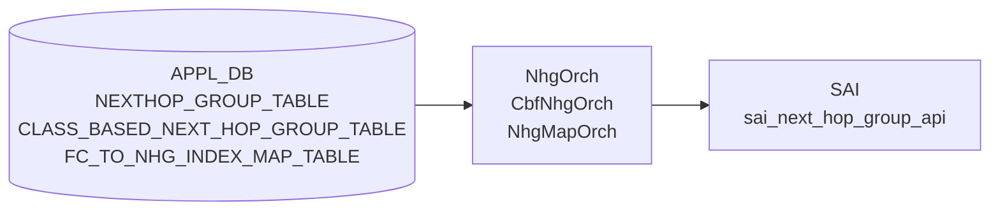

# NEXTHOP_GROUP / CBF_NHG / NHG_MAP テーブル

## 概要

orchagent の `NhgOrch`・`CbfNhgOrch`・`NhgMapOrch` が [APPL_DB](../../reference/glossary.md#term-appl_db) の次ホップグループ関連テーブルを購読し、[SAI](../../reference/glossary.md#term-sai) へ反映するコンポーネント[^1]。

- **`NEXTHOP_GROUP_TABLE`** — 通常 ECMP / MPLS / SRv6 / recursive NHG
- **`CLASS_BASED_NEXT_HOP_GROUP_TABLE`** — フォワーディングクラス (FC) ベースの CBF NHG
- **`FC_TO_NHG_INDEX_MAP_TABLE`** — FC → NHG メンバーインデックスのマップ

!!! info "CONFIG_DB 直接購読なし"
    3 オーケストレータはいずれも CONFIG_DB を直接購読しない。上位デーモン (fpmsyncd, bgpd など) が APPL_DB へ書き込み、orchagent が APPL_DB を処理する。

<!-- cdb-mermaid -->
### データフロー (自動生成)



!!! note "凡例"
    APPL_DB から SAI までの典型経路。詳細は本文を参照。
<!-- /cdb-mermaid -->

## NEXTHOP_GROUP_TABLE フィールド

`NhgOrch::doTask()` が解析するフィールド[^1]。

| フィールド | 型 | 必須 | デフォルト | 説明 |
|----------|----|------|------------|------|
| `nexthop` | カンマ区切り IP アドレス | 通常 NHG 時 yes | `""` (省略可) | ネクストホップ IP アドレス列 |
| `ifname` | カンマ区切りインタフェース名 | 通常 NHG 時 yes | `""` (省略可) | 出力インタフェース名列 |
| `weight` | カンマ区切り整数 | no | `""` → 0 → 均等 ECMP | ECMP メンバーウェイト。省略または 0 で SAI 属性なし (均等分散) |
| `mpls_nh` | カンマ区切りラベルスタック | no | `""` (省略可) | MPLS ラベルスタック。`"na"` でラベルなし |
| `seg_src` | カンマ区切り SRv6 ソース IP | SRv6 時 yes | `""` | SRv6 ソースアドレス。設定すると `srv6_nh=true` |
| `nexthop_group` | NHG_DELIMITER 区切り NHG インデックス | recursive NHG 時 yes | `""` | 再帰 NHG のメンバー NHG インデックス列。設定すると `is_recursive=true` |

<!-- defaults -->
### デフォルト値 (コード由来)

| 内部変数 | デフォルト値 | コード根拠 |
|---------|------------|---------|
| `is_recursive` | `false` | nhgorch.cpp:65 — `bool is_recursive = false;` |
| `overlay_nh` | `false` | nhgorch.cpp:67 — `bool overlay_nh = false;` |
| `srv6_nh` | `false` | nhgorch.cpp:68 — `bool srv6_nh = false;` |
| `weight` フィールド省略時 | SAI 属性なし → 均等 ECMP | nhgorch.cpp:1113-1118 — `if (weight != 0) { ... nhgm_attr ... }` のみ設定 |
| SAI グループ型 (通常 NHG) | `SAI_NEXT_HOP_GROUP_TYPE_ECMP` | nhgorch.cpp:772 |
| 1 メンバー非 recursive NHG | グループ作成せず NH ID を直接使用 | nhgorch.cpp:741-760 |
<!-- /defaults -->

### 相互排他制約

`nexthop`/`ifname` (通常 NH) と `nexthop_group` (recursive) の同時指定は `SWSS_LOG_ERROR` + エントリ破棄[^1]。

### Temp NHG (リソース枯渇時)

NHG 数が上限 (`getMaxNhgCount()`) に達した場合、1 メンバーをランダム選択した仮グループを作成する[^1]。SRv6 NHG は仮グループ非対応。

## CLASS_BASED_NEXT_HOP_GROUP_TABLE フィールド

`CbfNhgOrch::doTask()` が解析するフィールド[^2]。

| フィールド | 型 | 必須 | デフォルト | 説明 |
|----------|----|------|------------|------|
| `members` | カンマ区切り NHG インデックス文字列 | yes | `""` → 検証失敗・破棄 | CBF グループのメンバー NHG インデックス列。順序が SAI INDEX に対応 |
| `selection_map` | NHG_MAP インデックス文字列 | yes | `""` → 存在しない場合 return false | FC → NHG インデックスのマップ参照 |

<!-- defaults -->
### デフォルト値 (コード由来)

| 内部変数 | デフォルト値 | コード根拠 |
|---------|------------|---------|
| メンバー INDEX | 0 ベース (投入順) | cbfnhgorch.cpp:258 — `m_members.emplace(member, CbfNhgMember(member, idx++));` |
| SAI グループ型 | `SAI_NEXT_HOP_GROUP_TYPE_CLASS_BASED` | cbfnhgorch.cpp:302 |
| SAI CONFIGURED_SIZE | メンバー数 (`m_members.size()`) | cbfnhgorch.cpp:307-308 |
<!-- /defaults -->

### 検証ロジック

| 条件 | 挙動 |
|------|------|
| `members` が空 | `SWSS_LOG_ERROR` + エントリ破棄 |
| `members` に重複あり | `SWSS_LOG_ERROR` + エントリ破棄 |
| メンバー数 > `getMaxNumFcs()` | `SWSS_LOG_WARN` (処理は継続) |
| `selection_map` が未登録 | `SWSS_LOG_ERROR` + `return false` (再試行) |
| マップ最大インデックス >= メンバー数 | `SWSS_LOG_ERROR` + `return false` (再試行) |
| メンバー NHG が未 sync / temporary | `return false` (再試行、temp は継続監視) |

## FC_TO_NHG_INDEX_MAP_TABLE フィールド

`NhgMapOrch::doTask()` / `getMap()` が処理するフィールド[^3]。
テーブルエントリは `<FC値>` (フィールド名) → `<NH_index値>` (フィールド値) のマッピング列。

| フィールド | 型 | 制約 | 説明 |
|----------|----|------|------|
| `<FC値>` (フィールド名) | 整数 | `[0, max_num_fcs)` | フォワーディングクラス値 |
| `<NH_index値>` (フィールド値) | 非負整数 | `>= 0` | CBF NHG のメンバーインデックス |

<!-- defaults -->
### デフォルト値 (コード由来)

| 内部変数 | デフォルト値 | コード根拠 |
|---------|------------|---------|
| `m_max_nhg_map_count` | SAI `sai_object_type_get_availability()` から取得、非対応時は 0 | nhgmaporch.cpp:26-34 |
| SAI マップ型 | `SAI_NEXT_HOP_GROUP_MAP_TYPE_FORWARDING_CLASS_TO_INDEX` | nhgmaporch.cpp:118-119 |
<!-- /defaults -->

### 検証ロジック

| 条件 | 挙動 |
|------|------|
| マップが空 (FV なし) | `SWSS_LOG_ERROR` + `success=false` |
| FC 値が負または >= max_num_fcs | `SWSS_LOG_ERROR` + エントリ破棄 |
| NH index が負 | `SWSS_LOG_ERROR` + エントリ破棄 |
| スイッチが NHG マップ非対応 | `m_max_nhg_map_count=0` + `SWSS_LOG_WARN` |
| リソース枯渇 (既存マップ数 >= m_max_nhg_map_count) | `SWSS_LOG_WARN` + `success=false` (再試行) |

## 購読者

| オーケストレータ | APPL_DB テーブル | SAI API |
|----------------|----------------|---------|
| `NhgOrch` | `NEXTHOP_GROUP_TABLE` | `sai_next_hop_group_api->create/remove_next_hop_group` |
| `CbfNhgOrch` | `CLASS_BASED_NEXT_HOP_GROUP_TABLE` | `sai_next_hop_group_api->create/remove_next_hop_group` |
| `NhgMapOrch` | `FC_TO_NHG_INDEX_MAP_TABLE` | `sai_next_hop_group_api->create/remove_next_hop_group_map` |

## 関連 CONFIG_DB / YANG / CLI

- 関連 [CONFIG_DB](../../reference/glossary.md#term-config_db): なし (APPL_DB 直接操作)
- 関連テーブル: `FG_NHG` (FG ECMP、別オーケストレータ `FgNhgOrch`)

<!-- ordering -->
## 書込み順依存・タイミング依存

### 1. NEXTHOP 先行必須（NeighOrch NH 解決待ち）

`syncMembers()` は各メンバーの `getNhId()` が `SAI_NULL_OBJECT_ID` の場合にそのメンバーをスキップし `success = false` を返す。未 sync NH があるとグループ作成が再試行キューに戻る。`NEXTHOP_GROUP_TABLE` を書く前に対応ネクストホップが NeighOrch によって解決済みであること[^1]。

> コード根拠: `nhgorch.cpp:936–944`

### 2. allPortsReady() 先行必須

`NhgOrch::doTask()` の先頭でポート初期化完了を確認し、未完了の場合即 `return`。システム起動直後のエントリは無視される（再試行なし）[^1]。

> コード根拠: `nhgorch.cpp:41–44`

### 3. recursive NHG — メンバー NHG の先行 sync 必須

`nexthop_group` フィールドで指定する各メンバー NHG が `m_syncdNextHopGroups` に存在しない場合は除外して部分適用される。recursive / temporary なメンバーは `SWSS_LOG_ERROR` でエントリ破棄[^1]。

> コード根拠: `nhgorch.cpp:128–153`

### 4. SAI nhg_member 作成順 — グループ本体 → メンバー

`sync()` は必ず ①`create_next_hop_group`（グループ本体）→ ②`syncMembers()`（メンバー一括追加）の順で実行する。メンバー属性の設定順は `NEXT_HOP_GROUP_ID` → `NEXT_HOP_ID` → `WEIGHT`（weight != 0 の場合のみ）[^1]。

> コード根拠: `nhgorch.cpp:775–808`, `nhgorch.cpp:1099–1121`

### 5. メンバー追加は ObjectBulker でバッチ処理

`syncMembers()` は全メンバーの `create_entry()` をバッファリングしてから `flush()` で一括 SAI 呼び出しを行う。適用順序は `std::set<NextHopKey>` の辞書順。インタフェース down のメンバー（`NHFLAGS_IFDOWN`）はスキップ[^1]。

> コード根拠: `nhgorch.cpp:913–964`

### 6. update() — 削除先行・追加後続（ASIC メンバー上限対策）

NHG 更新時は ①`removeMembers()`（旧メンバー削除）→ ②`syncMembers()`（新メンバー追加）の順序が強制される。逆順では ASIC グループメンバー数上限に達して追加失敗する可能性がある[^1]。

> コード根拠: `nhgorch.cpp:988–1087`（コメント: "avoid cases where we reached the ASIC group members limit"）

### 順序依存サマリ

| # | 依存関係 | 方向 | 緩和策 |
|---|----------|------|--------|
| 1 | NeighOrch NH 解決 → NEXTHOP_GROUP_TABLE | 先行必須 | 未 sync NH はスキップ・再試行 |
| 2 | allPortsReady() → NhgOrch doTask() | 先行必須 | 初期化完了前は全エントリ無視 |
| 3 | メンバー NHG sync → recursive NHG | 先行必須 | 未 sync メンバーは除外、部分適用 |
| 4 | create_next_hop_group → create_next_hop_group_member | 強制先行（sync() 内） | SAI API 構造上保証 |
| 5 | removeMembers → syncMembers（update 時） | 強制先行（ASIC 上限回避） | 削除で空きを確保してから追加 |

<!-- /ordering -->

<!-- cross-refs -->
## 暗黙参照 (Phase C)

`NhgOrch` / `CbfNhgOrch` / `NhgMapOrch` は以下の他オーケストレータ・テーブルへ暗黙的に依存する。
YANG / CONFIG_DB には現れないコード上の直接参照。

| 参照先 | 参照元 | 参照の性質 | 未解決時の挙動 |
|-------|-------|-----------|--------------|
| NeighOrch (APPL_DB:`NEIGH_TABLE`) | `NhgOrch` | nexthop SAI ID 取得・refcount 増減・MPLS NH 追加/削除 | nexthop 未解決のメンバーはスキップ → NHG `sync=false`、再試行 |
| NeighOrch コールバック | `NeighOrch` → `NhgOrch` | `validateNextHop` / `invalidateNextHop` でリンク up/down 時の自動メンバー除外 | コールバック欠如でリンクダウン NH の継続使用 (ECMP 偏り) |
| RouteOrch (APPL_DB:`ROUTE_TABLE`) | `NhgOrch` / `CbfNhgOrch` | NHG 総数上限チェック (`getNhgCount() + getSyncedCount() >= getMaxNhgCount()`) | 上限到達時は新規 NHG 作成を拒否、Temp NHG 昇格もブロック |
| RouteOrch — refcount API | `RouteOrch` → `NhgOrch` / `CbfNhgOrch` | `incNhgRefCount` / `decNhgRefCount`：ルートが NHG を参照している間は DEL ガード | ref_count > 0 の NHG を DEL しようとすると `SWSS_LOG_ERROR` + 保留 |
| NhgOrch (NEXTHOP_GROUP_TABLE) | `CbfNhgOrch` | `members` に指定した NHG インデックスが `m_syncdNextHopGroups` に存在し `sync=true` であること | メンバー NHG 未 sync → CBF NHG 作成が `return false` で再試行ループ |

詳細証跡: `meta/_intermediate/cdb-flow/nhg-orch-cross-refs.md`
<!-- /cross-refs -->

<!-- ref-triangle:start -->

## 関連リファレンス

- [CONFIG_DB リファレンス: FG_NHG](fg-nhg.md)

<!-- ref-triangle:end -->

## 引用元

[^1]: `NhgOrch::doTask()` 実装: `sonic-swss/orchagent/nhgorch.cpp`. <https://github.com/sonic-net/sonic-swss/blob/4305596156d70e9797e8a881b3d19b46de0bce0d/orchagent/nhgorch.cpp>

[^2]: `CbfNhgOrch::doTask()` 実装: `sonic-swss/orchagent/cbf/cbfnhgorch.cpp`. <https://github.com/sonic-net/sonic-swss/blob/4305596156d70e9797e8a881b3d19b46de0bce0d/orchagent/cbf/cbfnhgorch.cpp>

[^3]: `NhgMapOrch::doTask()` 実装: `sonic-swss/orchagent/cbf/nhgmaporch.cpp`. <https://github.com/sonic-net/sonic-swss/blob/4305596156d70e9797e8a881b3d19b46de0bce0d/orchagent/cbf/nhgmaporch.cpp>

<!-- ops-hint -->
## 運用ヒント

### 典型値

- `NEXTHOP_GROUP_TABLE|<nhg_index>`: `nexthop=10.0.0.1,10.0.0.3 ifname=Ethernet0,Ethernet4`
- `weight` 省略時は均等 ECMP。設定時は各メンバーへの相対比率として機能
- CBF NHG は `members` の順序が重要。INDEX は 0 ベースで順序に依存

### よくある誤設定

- `nexthop` と `nexthop_group` の同時指定 → エントリ破棄
- CBF NHG の `members` 重複 → エントリ破棄
- `selection_map` が指すマップの最大 NH インデックス >= CBF NHG メンバー数 → 同期失敗
- NHG マップ数が `m_max_nhg_map_count` を超過 → 作成失敗 (スイッチ依存の上限)

### 確認コマンド

```bash
sonic-db-cli APPL_DB keys 'NEXTHOP_GROUP_TABLE:*'
sonic-db-cli APPL_DB hgetall 'NEXTHOP_GROUP_TABLE:<nhg_index>'
sonic-db-cli APPL_DB keys 'CLASS_BASED_NEXT_HOP_GROUP_TABLE:*'
sonic-db-cli APPL_DB keys 'FC_TO_NHG_INDEX_MAP_TABLE:*'
```
<!-- /ops-hint -->

<!-- glossary-links-injected: nhg-orch -->
