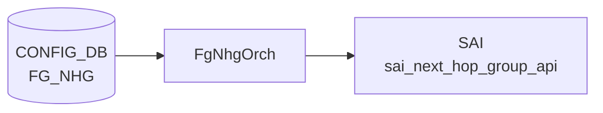

# NEXTHOP_GROUP_TABLE / CLASS_BASED_NEXT_HOP_GROUP_TABLE

## 概要

[APPL_DB](../../reference/glossary.md#term-appl_db) に存在する 2 つの次ホップグループテーブル[^1]。

- **`NEXTHOP_GROUP_TABLE`**: [fpmsyncd](../../reference/glossary.md#term-fpmsyncd) が FRR の Netlink メッセージから解析した次ホップグループを書き込む。`orchagent` の `NhgOrch` が購読し、[SAI](../../reference/glossary.md#term-sai) `sai_next_hop_group_api` 経由で ASIC に反映する。
- **`CLASS_BASED_NEXT_HOP_GROUP_TABLE`**: クラスベース転送 (CBF) 用グループ。`CbfNhgOrch` が購読し、`SAI_NEXT_HOP_GROUP_TYPE_CLASS_BASED` として ASIC に反映する。CLI 書き込み経路は存在せず、`config_db.json` 直編集または gNMI 経由で設定する。

`ROUTE_TABLE` の `nexthop_group` フィールドが本テーブルのキーを参照することで、経路とグループが結び付けられる。

<!-- cdb-mermaid -->
### データフロー (自動生成)



!!! note "凡例"
    CONFIG_DB から SAI までの典型経路を `docs/reference/config-db-orch-map.md` から機械生成したミニ図。詳細・例外は本ページ本文と対応表を参照。
<!-- /cdb-mermaid -->

## key 構造

```text
NEXTHOP_GROUP_TABLE:<index>
CLASS_BASED_NEXT_HOP_GROUP_TABLE:<index>
```

`<index>` は任意文字列。fpmsyncd が生成する通常 NHG では FRR のカーネル nexthop ID 相当の文字列が使われる。CBF NHG では管理者が任意のキーを付与する。

---

## NEXTHOP_GROUP_TABLE フィールド

| フィールド | 型 | 必須 | デフォルト | 説明 |
|-----------|----|------|-----------|------|
| `nexthop` | comma-separated IP address list | 条件付き | なし (空文字) | 各メンバーの next-hop IP アドレス。`nexthop_group` と排他 |
| `ifname` | comma-separated interface name list | no | なし (空文字) | nexthop に対応するインターフェース名リスト |
| `weight` | comma-separated uint32 list | no | `0` (等コスト) | 各メンバーのトラフィック重み。0 = 等コスト ECMP |
| `nexthop_group` | comma-separated NHG index list | 条件付き | なし | 再帰 NHG モード。子 NHG のキーを列挙。`nexthop`/`ifname` と排他 |
| `mpls_nh` | comma-separated MPLS label list | no | なし | MPLS ラベルスタック。`na` で対応 NH のラベルを無効化 |
| `seg_src` | comma-separated IPv6 address list | no | なし | SRv6 ソースアドレス。存在時に `srv6_nh=true` と判定 |

<!-- defaults -->
### フィールドデフォルト詳細

**`weight` のデフォルト: `0` (等コスト)**

`NextHopKey` コンストラクタが `weight(0)` で初期化する[^1]。`createNhgmAttrs()` で `weight == 0` のとき `SAI_NEXT_HOP_GROUP_MEMBER_ATTR_WEIGHT` を SAI に送出しない:

```cpp
// nhgorch.cpp:1113-1118
auto weight = nhgm.getWeight();
if (weight != 0) {
    nhgm_attr.id = SAI_NEXT_HOP_GROUP_MEMBER_ATTR_WEIGHT;
    nhgm_attr.value.s32 = weight;
    nhgm_attrs.push_back(nhgm_attr);
}
```

fpmsyncd 側も `weight != string()` のときのみフィールドを書き込む(routesync.cpp:1154-1155)。weight 未指定経路は weight フィールドなし → orchagent は weight=0 (等コスト) と解釈する。

**`nexthop` / `ifname` のデフォルト: なし (フィールド不在)**

不在時は変数 `ips` / `aliases` が空文字列のまま。`nexthop_group` も不在の場合は `nhg_key` が空となり NHG 生成はスキップされる。

**`nexthop_group` のデフォルト: なし → `is_recursive = false`**

フィールドが存在するとき `is_recursive = true` となり再帰 NHG モードへ移行。`nexthop`/`ifname` との共存は `SWSS_LOG_ERROR` + エントリ破棄。

**`mpls_nh` / `seg_src` のデフォルト: なし**

フィールド不在で MPLS/SRv6 は無効。`mpls_nh[i] == "na"` で対応インデックスのラベルを明示無効化できる。
<!-- /defaults -->

---

## CLASS_BASED_NEXT_HOP_GROUP_TABLE フィールド

| フィールド | 型 | 必須 | デフォルト | 説明 |
|-----------|----|------|-----------|------|
| `members` | comma-separated NEXTHOP_GROUP_TABLE key list | yes | なし | 子 NHG キーのリスト。空・重複は SWSS_LOG_ERROR + 即破棄 |
| `selection_map` | FC_TO_NHG_INDEX_MAP_TABLE key | yes | なし | FC→子NHGインデックスのマップキー。未存在は return false + 再試行 |

<!-- defaults -->
### フィールドデフォルト詳細

**`members` のデフォルト: なし (必須)**

`getMembers()` バリデーション (cbfnhgorch.cpp:212-238):
- 空リスト → `SWSS_LOG_ERROR("CBF next hop group members list is empty.")` → エントリ破棄
- 重複あり → `SWSS_LOG_ERROR("CBF next hop group members are not unique.")` → エントリ破棄

各メンバーの SAI INDEX は追加順に `0, 1, 2, ...` と自動採番される (cbfnhgorch.cpp:257-261)。INDEX は `CREATE_ONLY` 属性のため、メンバー順変更時は全メンバーを remove → add で再構築する。

**`selection_map` のデフォルト: なし (必須)**

`CbfNhg::sync()` で `gNhgMapOrch->getMapId()` が `SAI_NULL_OBJECT_ID` を返した場合:

```cpp
// cbfnhgorch.cpp:321-324
if (nhg_attr.value.oid == SAI_NULL_OBJECT_ID) {
    SWSS_LOG_ERROR("FC to NHG map index %s does not exist", m_selection_map.c_str());
    return false;
}
```

`return false` → Consumer キューに残り再試行（MAP が登録されるまで待機）。

SAI グループ属性は固定:
- `SAI_NEXT_HOP_GROUP_ATTR_TYPE = SAI_NEXT_HOP_GROUP_TYPE_CLASS_BASED`
- `SAI_NEXT_HOP_GROUP_ATTR_CONFIGURED_SIZE = members.size()`
<!-- /defaults -->

---

<!-- ordering -->
## 書込み順依存 (Phase B)

`NhgOrch` および `CbfNhgOrch` は `doTask()` 先頭で `gPortsOrch->allPortsReady()` を確認し、ポートが未初期化の間は処理を一切行わない。その後、テーブルエントリの SET / DEL 操作はいくつかの依存関係に従って処理される。

### 検出された順序依存

| # | 依存関係 | 方向 | 緩和策 |
|---|----------|------|--------|
| 1 | `PortsOrch` 全ポート初期化 → NHG 処理開始 | **強制先行** | 初期化前は `doTask()` が即 return、全エントリが Consumer キューで待機 |
| 2 | fpmsyncd: `NEXTHOP_GROUP_TABLE` 書込み → `ROUTE_TABLE` 書込み | **強制先行** | fpmsyncd は同一 Netlink イベント処理内で NHG を先に書き込んでから ROUTE_TABLE を書く |
| 3 | 再帰 NHG: 子 NHG が `m_syncdNextHopGroups` に存在 → 親 NHG の SET 完了 | **強制先行** | 子未存在の場合は `++it` でキューに残し再試行。子が recursive/temporary の場合は即破棄 |
| 4 | NHG 総数が上限未満 → 通常 NHG 作成 | **前提条件** | 上限到達時は temporary NHG（単一 NH で代替）を作成し本エントリをキューに残す。SRv6 NHG は temp 非対応 |
| 5 | CBF NHG: `FC_TO_NHG_INDEX_MAP_TABLE` の MAP が存在 → `CbfNhg::sync()` 完了 | **前提条件** | MAP 未存在時は `return false` → Consumer キューに残り再試行 |
| 6 | CBF NHG: temp NHG メンバー解消 → success=true で Consumer 消費 | 監視継続 | `hasTemps()` が真の間は `success = false` のままループし昇格を待機 |
| 7 | DEL 操作: 同一 key の pending SET が存在 → DEL をスキップ | **DEL 抑制** | `m_toSync.count(key) > 1` の場合 DEL を消費し SET に任せることで状態の上書き削除を防止 |
| 8 | DEL 操作: NHG の `ref_count` がゼロ → 削除実行 | **強制前提** | `ref_count > 0`（ROUTE_TABLE などが参照中）の間は DEL が保留されキューに残る |

### 主要な制約詳細

**PortsOrch 初期化ガード (依存 #1)**: `NhgOrch::doTask()` / `CbfNhgOrch::doTask()` はどちらも最初の行で `gPortsOrch->allPortsReady()` を評価し、`false` の場合は即 `return` する（`nhgorch.cpp:41-43`、`cbfnhgorch.cpp:42-44`）。システム起動直後にエントリが投入されても、全ポートが ready になるまで処理が始まらない。

**fpmsyncd の書込み順序 (依存 #2)**: fpmsyncd は FRR の Netlink nexthop メッセージを受け取ると、まず `m_nexthop_groupTable.set()` で `NEXTHOP_GROUP_TABLE` を更新し、その後 `m_routeTable->set()` で `ROUTE_TABLE` を書き込む（`routesync.cpp:1882-1896`）。これにより、orchagent が ROUTE_TABLE を処理する時点では NHG が APPL_DB に存在している。

**再帰 NHG の子依存 (依存 #3)**: `nexthop_group` フィールドが存在するとき `is_recursive = true` となり、`NhgOrch::doTask()` は各子 NHG キーを `m_syncdNextHopGroups` で検索する（`nhgorch.cpp:130-134`）。子が未存在の場合は `non_existent_member = true` としてキーから除外し、存在する子のみで NHG を作成してから `success = false` でエントリをキューに残す（`nhgorch.cpp:298-305`）。子が recursive または temporary の場合は `SWSS_LOG_ERROR` を出力し、エントリを即破棄する（`nhgorch.cpp:143-156`）。

**NHG 上限と temporary NHG (依存 #4)**: `gRouteOrch->getNhgCount() + NextHopGroup::getSyncedCount() >= gRouteOrch->getMaxNhgCount()` が真のとき、`NhgOrch` は `createTempNhg()` でメンバーのうち 1 つだけを使った仮グループを作成し、SAI に反映したうえでエントリをキューに残す（`nhgorch.cpp:252-281`）。SAI リソースが解放されると次のループで通常 NHG に昇格する。SRv6 NHG はこの仮作成ロジックを経由せず `++it` でスキップされる（`nhgorch.cpp:257-261`）。`CbfNhgOrch` は上限到達時に `success = false` のまま返してキューに残す（`cbfnhgorch.cpp:100-104`）。

**DEL 後に SET がある場合の保護 (依存 #7)**: DEL 操作時に同一キーで `m_toSync.count(key) > 1` が成立する場合（DEL の後に SET が積まれている）、DEL を消費して何もしない（`nhgorch.cpp:402-404`）。これにより DEL が参照カウント待ちで保留されている間に SET が実行され整合性が壊れる問題を防ぐ。

**参照カウントによる DEL ガード (依存 #8)**: `NhgEntry::ref_count > 0` の間は DEL を実行せず、`++it` でキューに残す（`nhgorch.cpp:414-416`）。`ROUTE_TABLE` エントリが当該 NHG を `nexthop_group` で参照している間は ref_count が非ゼロになるため、ROUTE_TABLE の DEL が先行しなければ NHG は削除されない。
<!-- /ordering -->

---

<!-- cross-refs -->
## 暗黙参照テーブル (Phase C)

`NhgOrch` (`nhgorch.cpp`) および `CbfNhgOrch` (`cbf/cbfnhgorch.cpp`) が `NEXTHOP_GROUP_TABLE` / `CLASS_BASED_NEXT_HOP_GROUP_TABLE` を処理する際、YANG leafref は定義されていないが、複数の Orch / DB に対する暗黙参照が発生する。

### NEXTHOP_GROUP_TABLE の参照

| 参照先 | 参照方向 | 条件 | 参照元 evidence |
|--------|---------|------|----------------|
| `NeighOrch`（NEIGH_TABLE 管理） | NH OID 解決（必須）。解決失敗時は `success=false` でメンバースキップ＋再試行 | 各 NH メンバーの IP が通常 nexthop の場合 | `nhgorch.cpp:544-546` (`hasNextHop` → `getNextHopId`)、`nhgorch.cpp:633,648` (ref_count +1/-1) |
| `IntfsOrch`（INTF_TABLE 管理） | RIF OID 解決（`isIntfNextHop()` 時）。sync 成功後 RIF ref_count +1、remove 時 -1 | NH メンバーがインターフェース次ホップの場合 | `nhgorch.cpp:542` (`getRouterIntfsId`)、`nhgorch.cpp:757,885` (ref_count) |
| `Srv6Orch`（SRv6 nexthop 管理） | SRv6 NH 作成 / 削除 | `isSrv6NextHop()` が真の NH メンバーが存在する場合 | `nhgorch.cpp:550-553` (`createSrv6NexthopWithoutVpn`)、`nhgorch.cpp:665` (`removeSrv6NexthopWithoutVpn`) |
| `RouteOrch`（NHG 上限カウンタ） | NHG 総数チェック（ブロッキング）。上限到達時 temporary NHG を作成し本エントリをキューに残す | 常時（`doTask()` 内で NHG 作成前に評価） | `nhgorch.cpp:252,320` (`getNhgCount() + getSyncedCount() >= getMaxNhgCount()`) |
| `RouteOrch`（ref_count 管理） | `ROUTE_TABLE` の nexthop_group 参照カウント増減。ref_count > 0 の NHG は DEL 保留 | ROUTE_TABLE エントリが当該 NHG を `nexthop_group` フィールドで参照する場合 | `routeorch.cpp:3147-3176` (`incNhgRefCount` / `decNhgRefCount`) |
| `CrmOrch`（CRM カウンタ） | SAI create/delete に連動して `CRM_NEXTHOP_GROUP` カウンタ更新 | NHG の synced 状態変化時 | `nhgorch.cpp:795` (`incCrmResUsedCounter`) |

### CLASS_BASED_NEXT_HOP_GROUP_TABLE の参照

| 参照先 | 参照方向 | 条件 | 参照元 evidence |
|--------|---------|------|----------------|
| `NhgMapOrch`（FC_TO_NHG_INDEX_MAP_TABLE 管理） | MAP の SAI OID 取得（必須）。MAP 未存在時 `return false` → 再試行。FC 数超過 / インデックス超過でエラー+破棄 | `selection_map` フィールドが指定されている場合（必須フィールド） | `cbfnhgorch.cpp:311` (`getMaxNumFcs`)、`cbfnhgorch.cpp:319-324` (`getMapId`)、`cbfnhgorch.cpp:327` (`getLargestNhIndex`)、ref_count: `cbfnhgorch.cpp:354,396` |
| `NhgOrch` / `CbfNhgOrch`（NEXTHOP_GROUP_TABLE / CLASS_BASED_NEXT_HOP_GROUP_TABLE 管理） | 子 NHG の SAI OID 解決（必須）。未 synced の場合 `return false` → 再試行。temporary / recursive は エラー＋ループ継続 | `members` フィールドに列挙された子 NHG キーが存在する場合 | `cbfnhgorch.cpp:247-265` (メンバー OID lookup) |
| `RouteOrch`（NHG 上限カウンタ） | NhgOrch と同一の上限チェック。上限到達時 `success=false` でキューに残す | 常時（`doTask()` 内で NHG 作成前に評価） | `cbfnhgorch.cpp:100` (`getNhgCount() + getSyncedCount() >= getMaxNhgCount()`) |
| `CrmOrch`（CRM カウンタ） | SAI create/delete に連動して `CRM_NEXTHOP_GROUP` カウンタ更新 | CBF NHG の synced 状態変化時 | `cbfnhgorch.cpp:358` (`incCrmResUsedCounter`) |

!!! note "NeighOrch の NH 解決失敗は非致命的"
    `NextHopGroupMember::getNhId()` が `SAI_NULL_OBJECT_ID` を返したメンバーは `syncMembers()` でスキップされ、残りのメンバーで NHG が部分同期される (`nhgorch.cpp:938-944`)。neighbor が後から登録されると `PortsOrch` / `NeighOrch` からの通知で再同期が走り、スキップされたメンバーが NHG に追加される。

!!! note "NhgMapOrch 参照は CBF 専用"
    `FC_TO_NHG_INDEX_MAP_TABLE` への参照は `CLASS_BASED_NEXT_HOP_GROUP_TABLE` の処理でのみ発生する。通常 `NEXTHOP_GROUP_TABLE` の処理パス (`NhgOrch`) は `NhgMapOrch` を参照しない。

詳細分析: `meta/_intermediate/cdb-flow/nhg-table-cross-refs.md`
<!-- /cross-refs -->

---

<!-- failure -->
## 失敗挙動 (Phase D)

> 調査証跡: `meta/_intermediate/cdb-flow/nhg-table-failure.md`

Consumer: `NhgOrch::doTask()` (`orchagent/nhgorch.cpp`) および `CbfNhgOrch::doTask()` (`orchagent/cbf/cbfnhgorch.cpp`)。

### 起動ガード

両 Orch の `doTask()` 冒頭で `gPortsOrch->allPortsReady()` を評価し、`false` の場合は即 `return` する（`nhgorch.cpp:41-43`、`cbfnhgorch.cpp:42-44`）。ログ出力なし。`Consumer::m_toSync` のエントリが滞留したまま次回イベントループで暗黙 retry される。

### NEXTHOP_GROUP_TABLE — SET 時の失敗パターン

| 失敗条件 | 検出箇所 | 挙動 | retry |
|---|---|---|---|
| `nexthop_group` と `nexthop`/`ifname` が共存 | `doTask()` L98-103 | `SWSS_LOG_ERROR` → `erase(it)` でエントリ破棄 | なし |
| SRv6 NHG で `nexthop` 数と `seg_src` 数が不一致 | `doTask()` L209-214 | `SWSS_LOG_ERROR` → `erase(it)` でエントリ破棄 | なし |
| 再帰 NHG の子 NHG が recursive または temporary | `doTask()` L139-157 | `SWSS_LOG_ERROR("Invalid member nexthop group %s in parent nhg %s")` → `erase(it)` | なし |
| 再帰 NHG で型不一致（SRv6/overlay 混在） | `doTask()` L175-198 | `SWSS_LOG_ERROR("Inconsistent nexthop group type between %s and %s")` → `erase(it)` | なし |
| 再帰 NHG の全子 NHG が未登録 | `doTask()` L160-164 | ログなし → `++it` でスキップ | 子 NHG 登録後に自動 retry |
| NHG 数上限到達 + SRv6 NHG 新規作成 | `doTask()` L252-260 | `SWSS_LOG_DEBUG` → `++it`（temp NHG も作成しない） | リソース解放後に自動 retry |
| NHG 数上限到達 + 非 SRv6 NHG の temp sync 失敗 | `doTask()` L271-275 | `SWSS_LOG_INFO("Failed to sync temporary NHG %s")` → temp NHG 未登録のまま `++it` | 自動 retry |
| `createTempNhg()` で有効 NH が 1 つもない | `createTempNhg()` L844-849 | `std::logic_error` throw → 呼び出し元が catch して `SWSS_LOG_INFO` → `++it` | 自動 retry |
| SAI `create_next_hop_group` 失敗 | `NextHopGroup::sync()` L782-791 | `SWSS_LOG_ERROR("Failed to create next hop group %s, rv:%d")` → `handleSaiCreateStatus()` → `false` | SAI 状態次第で retry |
| `syncMembers()` でいずれかのメンバーの SAI ID が NULL | `NextHopGroup::syncMembers()` L937-944 | `SWSS_LOG_WARN("Failed to get next hop %s in group %s")` → `sync()` false → `++it` | ネイバー解決後に自動 retry |
| `syncMembers()` 後のメンバー SAI ID が NULL（bulk create 失敗） | `NextHopGroup::syncMembers()` L973-977 | `SWSS_LOG_ERROR("Failed to create next hop group %s's member %s")` → 部分適用状態 | 自動 retry（部分適用残存に注意） |
| 単一メンバー NHG で NH ID が SAI_NULL_OBJECT_ID | `NextHopGroup::sync()` L746-749 | `SWSS_LOG_WARN("Next hop %s is not synced")` → `return false` → `++it` | ネイバー解決後に自動 retry |
| SRv6 nexthop 作成失敗 | `NextHopGroupMember::getNhId()` L551-553 | `SWSS_LOG_ERROR("Failed to create SRv6 nexthop %s")` → SAI_NULL_OBJECT_ID を返す | 上位 syncMembers 失敗として処理 |
| NHG update でメンバー weight 更新失敗 | `NextHopGroup::update()` L1042-1045 | `SWSS_LOG_WARN("Failed to update member %s weight")` → `return false` → `++it` | 自動 retry |
| NHG update で旧メンバー削除失敗 | `NextHopGroup::update()` L1057-1060 | `SWSS_LOG_WARN("Failed to remove members from group %s")` → `return false` → `++it` | 自動 retry（部分削除状態残存） |
| NHG update で新メンバー sync 失敗 | `NextHopGroup::update()` L1080-1083 | `SWSS_LOG_WARN("Failed to sync new members for group %s")` → `return false` → `++it` | 自動 retry |

### NEXTHOP_GROUP_TABLE — DEL 時の失敗パターン

| 失敗条件 | 検出箇所 | 挙動 | retry |
|---|---|---|---|
| DEL 対象 NHG が参照中（ref_count > 0） | `doTask()` L413-417 | `SWSS_LOG_INFO("Unable to remove group %s which is referenced")` → `++it` で保留 | 参照解除（ROUTE_TABLE DEL）後に自動 retry |
| DEL 対象 NHG が未登録 | `doTask()` L407-411 | `SWSS_LOG_INFO("Unable to find group with key %s to remove")` → `success = true` で消費（冪等） | なし |
| SAI `remove_next_hop_group` 失敗 | `NhgCommon::remove()` 内部 | `success = false` → `++it`（`m_syncdNextHopGroups` から erase されない） | 自動 retry |
| DEL と同一キーに pending SET が存在 | `doTask()` L401-405 | DEL をスキップして SET に委ねる（最終状態の整合のため） | — |

### CLASS_BASED_NEXT_HOP_GROUP_TABLE — SET 時の失敗パターン

| 失敗条件 | 検出箇所 | 挙動 | retry |
|---|---|---|---|
| `members` が空または重複 | `getMembers()` L225-238 | `SWSS_LOG_ERROR("...members list is empty/not unique")` → `erase(it)` | なし |
| NHG 数上限到達 | `doTask()` L100-103 | `SWSS_LOG_WARN("Reached next hop group limit.")` → `success=false` → `++it` | リソース解放後に自動 retry |
| `selection_map` の MAP が未登録 | `CbfNhg::sync()` L319-325 | `SWSS_LOG_ERROR("FC to NHG map index %s does not exist")` → `return false` | MAP 登録後に自動 retry |
| MAP が参照する最大 NH index がメンバー数以上 | `CbfNhg::sync()` L327-331 | `SWSS_LOG_ERROR("FC to NHG map references more NHG members than exist")` → `return false` | 自動 retry |
| SAI `create_next_hop_group` 失敗（CBF） | `CbfNhg::sync()` L341-345 | `SWSS_LOG_ERROR("Failed to create CBF next hop group %s")` → `return false` | 自動 retry |
| `syncMembers()` 失敗（CBF） | `CbfNhg::sync()` L369-373 | `SWSS_LOG_ERROR("Failed to sync CBF next hop group %s")` → `return false` | 自動 retry |
| sync 成功後に temp NHG メンバーが存在 | `doTask()` L116-119 | `success = false` → `++it`（NHG は登録済み） | temp NHG 昇格後に自動 retry |

### CLASS_BASED_NEXT_HOP_GROUP_TABLE — DEL 時の失敗パターン

| 失敗条件 | 検出箇所 | 挙動 | retry |
|---|---|---|---|
| DEL 対象 CBF NHG が参照中（ref_count > 0） | `doTask()` L165-170 | `SWSS_LOG_WARN("Skipping removal ... which is still referenced")` → `++it` | 参照解除後に自動 retry |
| DEL 対象 CBF NHG が未登録 | `doTask()` L157-163 | `SWSS_LOG_WARN("Deleting inexistent CBF NHG %s")` → `success = true` で消費（冪等） | なし |
| SAI remove 失敗（CBF） | `CbfNhg::remove()` / `removeMembers()` | `false` → `success = false` → `++it` | 自動 retry |
| DEL と同一キーに pending SET が存在 | `doTask()` L152-155 | DEL をスキップして SET に委ねる | — |

### retry 挙動まとめ

| シナリオ | retry 上限 | 解消トリガー |
|---|---|---|
| 再帰 NHG メンバー未登録 | なし（無制限） | 子 NHG の SET 処理後 |
| NHG 数上限到達（SRv6） | なし（無制限） | ASIC リソース解放時 |
| NHG 数上限到達（temp NHG） | なし（temp 経由で継続） | リソース解放後に完全 NHG へ昇格 |
| DEL が参照カウントにブロック | なし（無制限） | 参照元（ROUTE_TABLE 等）の DEL 処理後 |
| フィールド不正（混在・不一致） | **0 回**（即 erase） | CONFIG 修正 + 再投入が必要 |

### 部分適用に関する注意

`syncMembers()` は `ObjectBulker` による bulk create を使用する。bulk flush 後に個別 SAI ID を検証するため、一部成功・一部失敗の部分適用が発生しうる。失敗したメンバーは NULL ID のまま残り、成功メンバーのみ SAI に登録済みになる。NHG update 時に旧メンバー削除後・新メンバー追加前の瞬間、NHG は縮退した状態で ASIC に存在する。

SRv6 NHG はリソース枯渇時に temporary group を作成しないため、枯渇中はルート解決そのものが保留される。非 SRv6 NHG は temporary group (1 NH のみ) を経由して ECMP なしでルート解決を継続するが、リソース解放まで ECMP 動作は失われる。
<!-- /failure -->

---

<!-- constants -->
## ハードコード定数 (Phase E)

`NhgOrch` (`orchagent/nhgorch.cpp`)・`CbfNhgOrch` (`orchagent/cbf/cbfnhgorch.cpp`)・`RouteOrch` (`orchagent/routeorch.cpp`) に存在する、CONFIG_DB / YANG で管理されないハードコード定数の一覧。

### NHG 上限フォールバック値

| 定数 | 値 | 用途 | ソース |
|------|----|------|--------|
| `DEFAULT_NUMBER_OF_ECMP_GROUPS` | `128` | `SAI_SWITCH_ATTR_NUMBER_OF_ECMP_GROUPS` の取得に失敗した場合の NHG 上限フォールバック値 | `routeorch.cpp:37,68` |
| `DEFAULT_MAX_ECMP_GROUP_SIZE` | `32` | Mellanox プラットフォームで SAI が返す NHG 上限数（全メンバー数 1 前提の値）を ECMP グループ数に換算するための除数 | `routeorch.cpp:38,86` |

`RouteOrch` 初期化時に `sai_switch_api->get_switch_attribute(gSwitchId, 1, &attr)` で `SAI_SWITCH_ATTR_NUMBER_OF_ECMP_GROUPS` を取得する。取得失敗時は `m_maxNextHopGroupCount = DEFAULT_NUMBER_OF_ECMP_GROUPS (128)` を使用する。Mellanox プラットフォーム（`MLNX_PLATFORM_SUBSTRING = "mellanox"`、`orch.h:42`）の場合、取得値を `DEFAULT_MAX_ECMP_GROUP_SIZE (32)` で割って最終的な上限とする（`routeorch.cpp:83-86`）。

```cpp
// routeorch.cpp:37-38
#define DEFAULT_NUMBER_OF_ECMP_GROUPS   128
#define DEFAULT_MAX_ECMP_GROUP_SIZE     32

// routeorch.cpp:60-88（RouteOrch コンストラクタ）
sai_status_t status = sai_switch_api->get_switch_attribute(gSwitchId, 1, &attr);
if (status != SAI_STATUS_SUCCESS)
{
    m_maxNextHopGroupCount = DEFAULT_NUMBER_OF_ECMP_GROUPS;  // 128
}
else
{
    m_maxNextHopGroupCount = attr.value.s32;
    char *platform = getenv("platform");
    if (platform && strstr(platform, MLNX_PLATFORM_SUBSTRING))
    {
        m_maxNextHopGroupCount /= DEFAULT_MAX_ECMP_GROUP_SIZE;  // /= 32
    }
}
```

### SAI グループタイプ固定値

| 定数 | 値 | 適用箇所 | ソース |
|------|----|---------|--------|
| `SAI_NEXT_HOP_GROUP_TYPE_ECMP` | SAI 列挙体 | 通常 NEXTHOP_GROUP_TABLE エントリを SAI に create する際の `SAI_NEXT_HOP_GROUP_ATTR_TYPE` 値。YANG / CONFIG_DB で指定不可 | `nhgorch.cpp:771-772` |
| `SAI_NEXT_HOP_GROUP_TYPE_CLASS_BASED` | SAI 列挙体 | CBF NHG を SAI に create する際の `SAI_NEXT_HOP_GROUP_ATTR_TYPE` 値。`CLASS_BASED_NEXT_HOP_GROUP_TABLE` エントリは常にこの型で作成される | `cbfnhgorch.cpp:301-302` |

### メンバーウェイト送出閾値

| 定数 | 値 | 用途 | ソース |
|------|----|------|--------|
| weight 送出ゼロ閾値 | `0` | `weight == 0` のメンバーは `SAI_NEXT_HOP_GROUP_MEMBER_ATTR_WEIGHT` 属性を SAI に送出しない。ASIC 側はウェイト未指定を等コスト ECMP として扱う | `nhgorch.cpp:1114` |

### CBF メンバーインデックス開始値

| 定数 | 値 | 用途 | ソース |
|------|----|------|--------|
| CBF メンバー SAI INDEX 開始値 | `0` (`uint8_t`) | CBF NHG の各メンバーに付与する `SAI_NEXT_HOP_GROUP_MEMBER_ATTR_INDEX` は追加順に `0, 1, 2, ...` と自動採番される。CONFIG_DB で指定不可。INDEX は `CREATE_ONLY` 属性のため順序変更時は全メンバーの remove → add が必要 | `cbfnhgorch.cpp:257-261` |

### FC 数上限クエリとフォールバック

| 定数 / 挙動 | 値 | 用途 | ソース |
|------------|-----|------|--------|
| FC 数フォールバック | `0` | `SAI_SWITCH_ATTR_MAX_NUMBER_OF_FORWARDING_CLASSES` の取得失敗時に `max_num_fcs = 0` を使用。CBF NHG のメンバー数 vs FC 数の超過警告に影響する（`cbfnhgorch.cpp:311-315`） | `nhgmaporch.cpp:318-321` |
| FC 数超過警告閾値 | `gNhgMapOrch->getMaxNumFcs()` 返値 | CBF NHG のメンバー数 > FC 数のとき `SWSS_LOG_WARN("More CBF NHG members configured than supported Forwarding Classes")` を出力するが、処理を中断しない | `cbfnhgorch.cpp:311-315` |

!!! note "NHG 上限は起動時に 1 度だけ算出"
    `m_maxNextHopGroupCount` は `RouteOrch` コンストラクタで SAI に問い合わせて確定し、以後変更されない。動的なリソース追加・削除には対応しておらず、ASIC がサポートする最大値の静的スナップショットとして機能する。

!!! note "Mellanox プラットフォームの除算ロジック"
    Mellanox 向けの `/= DEFAULT_MAX_ECMP_GROUP_SIZE` は「SAI が ECMP グループサイズ=1 を前提に返す最大グループ数」を「サイズ=32 を前提にした ECMP グループ数」に変換するワークアラウンドである（`routeorch.cpp:74-87` のコメント）。他プラットフォームでは除算なしで SAI 返値をそのまま使用する。
<!-- /constants -->

---

<!-- side-effects -->
## 副次 DB 書込 (Phase F)

`NhgOrch` および `CbfNhgOrch` は SAI 経由で ASIC に NHG を反映する主作用のほかに、**COUNTERS_DB** の `CRM` テーブルへ副次的なカウンタ書込を行う。STATE_DB / FLEX_COUNTER_DB / APPL_DB / CONFIG_DB への直接書込みは確認されない。

| 副次 DB | テーブル / キー | 書込フィールド | 書込タイミング |
|---|---|---|---|
| COUNTERS_DB | `CRM:STATS` (hash) | `crm_stats_nexthop_group_used` / `crm_stats_nexthop_group_available` | NHG の SAI 作成・削除に連動して in-memory カウンタを増減 → CRM ポーリングタイマー発火時に反映 |
| COUNTERS_DB | `CRM:STATS` (hash) | `crm_stats_nexthop_group_member_used` / `crm_stats_nexthop_group_member_available` | NHG メンバーの SAI 作成・削除に連動して in-memory カウンタを増減 → CRM ポーリングタイマー発火時に反映 |

### カウンタ増減のトリガ

**NHG グループ作成 (inc)**: `NextHopGroup::sync()` 内で `sai_next_hop_group_api->create_next_hop_group()` が成功すると `gCrmOrch->incCrmResUsedCounter(CRM_NEXTHOP_GROUP)` を呼ぶ (`nhgorch.cpp:795`)。`CbfNhg::sync()` も同様に `create_next_hop_group` 成功後に `incCrmResUsedCounter(CRM_NEXTHOP_GROUP)` を呼ぶ (`cbfnhgorch.cpp:358`)。

**NHG グループ削除 (dec)**: `NextHopGroupBase::remove()` 内で `sai_next_hop_group_api->remove_next_hop_group()` 成功後に `gCrmOrch->decCrmResUsedCounter(CRM_NEXTHOP_GROUP)` を呼ぶ (`nhgbase.h:277`)。`CbfNhg` も同じ基底クラス実装を経由する。

**NHG メンバー作成 (inc) / 削除 (dec)**:

```cpp
// nhgbase.h:132  — NextHopGroupMemberBase::sync() — SAI member 作成成功時
gCrmOrch->incCrmResUsedCounter(CrmResourceType::CRM_NEXTHOP_GROUP_MEMBER);

// nhgbase.h:151  — NextHopGroupMemberBase::remove() — SAI member 削除成功時
gCrmOrch->decCrmResUsedCounter(CrmResourceType::CRM_NEXTHOP_GROUP_MEMBER);
```

### COUNTERS_DB への実際の書込み

in-memory カウンタは即時 COUNTERS_DB に書かれるのではなく、`CrmOrch::updateCrmCountersTable()` が `CRM_COUNTERS_POLL` タイマー発火時にバッチで書き込む (`crmorch.cpp:1067-1115`):

```cpp
// crmorch.cpp:1067-1083
m_countersCrmTable->set(cnt.first, attrs);
// → COUNTERS_DB:CRM:STATS
//   crm_stats_nexthop_group_used / crm_stats_nexthop_group_member_used
//   crm_stats_nexthop_group_available / crm_stats_nexthop_group_member_available
```

テーブル名定数: `sonic-swss-common/common/schema.h:237` `COUNTERS_CRM_TABLE = "CRM"`。フィールド名: `crmorch.cpp:360-361` (used)、`crmorch.cpp:314-315` (available)。

> **Evidence**: `nhgorch.cpp:795` (NHG inc)、`nhgbase.h:277` (NHG dec)、`nhgbase.h:132/151` (member inc/dec)、`cbfnhgorch.cpp:358` (CBF NHG inc)、`crmorch.cpp:1067-1115` (COUNTERS_DB 書込)、`schema.h:237` (テーブル名定数)。詳細調査ログ: `meta/_intermediate/cdb-flow/nhg-table-side-effects.md`。
<!-- /side-effects -->

---

<!-- pubsub -->
## Redis 通知メカニズム (Phase G)

### 書き込み側の通信構造

`NEXTHOP_GROUP_TABLE` への書き込み元は **fpmsyncd** のみ。`CLASS_BASED_NEXT_HOP_GROUP_TABLE` は CLI 経路がなく、直接 APPL_DB 書き込み（`config_db.json` 直編集・gNMI 等）のみ。

| テーブル | 書き込み元 | 書き込み方式 |
|---------|-----------|------------|
| `NEXTHOP_GROUP_TABLE` | fpmsyncd (`routesync.cpp`) | `ProducerStateTable` (非 ZMQ 固定) |
| `CLASS_BASED_NEXT_HOP_GROUP_TABLE` | 直接 APPL_DB 書き込み | `ProducerStateTable` または redis-cli |

`m_nexthop_groupTable` は `routesync.cpp:157` で `ProducerStateTable(pipeline, APP_NEXTHOP_GROUP_TABLE_NAME, true)` として初期化される。`ROUTE_TABLE` と異なり ZMQ チャンネルは使用しない（`routesync.cpp:156` との比較）。`ProducerStateTable::set()` / `del()` 呼び出しごとに `NEXTHOP_GROUP_TABLE_CHANNEL@0` へ PUBLISH される。

### 購読方式: ConsumerStateTable (APPL_DB)

`NhgOrch` および `CbfNhgOrch` は orchdaemon 起動時に `Orch(db, tableName)` コンストラクタ経由で `ConsumerStateTable` を生成し APPL_DB を購読する。

```
orchdaemon.cpp:338-339
  gNhgOrch    = new NhgOrch   (m_applDb, APP_NEXTHOP_GROUP_TABLE_NAME)
  gCbfNhgOrch = new CbfNhgOrch(m_applDb, APP_CLASS_BASED_NEXT_HOP_GROUP_TABLE_NAME)

Orch::addConsumer() — orch.cpp:1186-1196
  APPL_DB (dbId != CONFIG_DB / STATE_DB / CHASSIS_APP_DB)
    → new ConsumerStateTable(db, tableName, gBatchSize, pri)
    → SUBSCRIBE NEXTHOP_GROUP_TABLE_CHANNEL@0
               CLASS_BASED_NEXT_HOP_GROUP_TABLE_CHANNEL@0
```

`ConsumerStateTable` は `ProducerStateTable` が PUBLISH したチャンネルを内部で `SUBSCRIBE` し、メッセージ受信時に `HGETALL` でフィールドを取得して `KeyOpFieldsValuesTuple (key, op, fvs)` に変換する。

### イベント発火から ASIC 適用までの流れ

```
fpmsyncd: FRR の Netlink nexthop イベント受信
  → m_nexthop_groupTable.set(key, fvVector)  (routesync.cpp:1882)
    → ProducerStateTable: APPL_DB HSET + PUBLISH NEXTHOP_GROUP_TABLE_CHANNEL@0
  → ConsumerStateTable (orchagent 側) がチャンネル通知を受信
  → orchdaemon 主ループ: m_select->select(&s, SELECT_TIMEOUT=1000ms)  (orchdaemon.cpp:959)
  → Consumer::execute() → NhgOrch::doTask()
      gPortsOrch->allPortsReady() チェック後エントリを処理
      → sai_next_hop_group_api->create_next_hop_group() / remove_next_hop_group()
```

### orchdaemon の select タイムアウトとバッチサイズ

| パラメータ | 値 | ソース |
|-----------|-----|--------|
| `SELECT_TIMEOUT` | 1000 ms | `orchdaemon.cpp:23` |
| `gBatchSize` | 128 (`DEFAULT_MAX_BULK_SIZE` = 1000 は別用途) | `orchdaemon.cpp:81` |

`gBatchSize` は `ConsumerStateTable` のポップ上限として渡され、1 イベントループ当たり最大 128 エントリを一括処理する。NHG エントリ数が多い起動時の初期スナップショット再生も同バッチサイズで処理される。

### ZMQ 非使用の確認

`NEXTHOP_GROUP_TABLE` は `createProducerStateTable()` ではなく直接 `ProducerStateTable(...)` で初期化されており (`routesync.cpp:157`)、`m_zmqClient` を渡さない。`ZmqConsumerStateTable` は使用されない。`ROUTE_TABLE` のみが ZMQ 経路を持つ (`routesync.cpp:156`)。

### warm restart との関係

orchdaemon の warm restart 時、`ConsumerStateTable` が保持するペンディングエントリは `m_toSync` に残り、reconcile フェーズで再処理される。`NhgOrch` / `CbfNhgOrch` は warm restart に対する個別ハンドラを持たず、`doTask()` の通常ループで `m_syncdNextHopGroups` に存在しないエントリを SAI 再作成する。

> Evidence: `routesync.cpp:157` (ProducerStateTable 初期化、ZMQ 非使用)、`orch.cpp:1186-1196` (addConsumer)、`orchdaemon.cpp:23,338-339,959` (SELECT_TIMEOUT / Orch インスタンス生成 / select ループ)。詳細調査ログ: `meta/_intermediate/cdb-flow/nhg-table-pubsub.md`。
<!-- /pubsub -->

---

<!-- platform -->
## プラットフォーム差 (Phase H)

`NEXTHOP_GROUP_TABLE` / `CLASS_BASED_NEXT_HOP_GROUP_TABLE` の上限・capability はプラットフォームによって異なる。上限管理は `RouteOrch` が保持する `m_maxNextHopGroupCount` で一元管理され、`NhgOrch` / `CbfNhgOrch` の `doTask()` がこれを参照して temporary NHG 作成・`success=false` フォールバックを判断する。

### プラットフォーム識別文字列 (orch.h:40-49)

| 定数 | 値 | プラットフォーム例 |
|------|----|--------------------|
| `MLNX_PLATFORM_SUBSTRING` | `"mellanox"` | Mellanox Spectrum |
| `BRCM_PLATFORM_SUBSTRING` | `"broadcom"` | Broadcom XGS |
| `VS_PLATFORM_SUBSTRING` | `"vs"` | Virtual Switch (テスト用) |
| `XS_PLATFORM_SUBSTRING` | `"xsight"` | xsight |
| `MRVL_PRST_PLATFORM_SUBSTRING` | `"marvell-prestera"` | Marvell Prestera |

### 1. Mellanox: ECMP グループ数の補正 (`/= 32`)

`RouteOrch` コンストラクタ (`routeorch.cpp:61-88`) は `SAI_SWITCH_ATTR_NUMBER_OF_ECMP_GROUPS` を SAI から取得後、`getenv("platform")` が `"mellanox"` を含む場合のみ戻り値を `DEFAULT_MAX_ECMP_GROUP_SIZE (=32)` で割って `m_maxNextHopGroupCount` を補正する:

```cpp
// routeorch.cpp:83-87
char *platform = getenv("platform");
if (platform && strstr(platform, MLNX_PLATFORM_SUBSTRING))
{
    m_maxNextHopGroupCount /= DEFAULT_MAX_ECMP_GROUP_SIZE; // 32
}
```

Mellanox SAI は「1 グループ = 1 メンバ」前提で総 NHG 数を返すため、実際の最大 ECMP グループ数を得るには 32 除算が必要である。SAI 取得失敗時のフォールバック値は `DEFAULT_NUMBER_OF_ECMP_GROUPS (=128)` (`routeorch.cpp:37-38`)。補正後の値が `NhgOrch::doTask()` L252 / L320 および `CbfNhgOrch::doTask()` L100 の上限チェックに使われるため、**Mellanox 環境では他プラットフォームより early に temporary NHG 作成が発動する**。

### 2. VOQ chassis: ECMP メンバ数を 128 に強制

`routeorch.cpp:95-124` で `SAI_SWITCH_ATTR_MAX_ECMP_MEMBER_COUNT` を取得し、`gMySwitchType == "voq"` かつ取得値 >= 128 のとき `SAI_SWITCH_ATTR_ECMP_MEMBER_COUNT` を 128 に **書き戻す**:

```cpp
// routeorch.cpp:109-114
if (gMySwitchType == "voq" && maxEcmpGroupSize >= 128)
{
    maxEcmpGroupSize = 128;
    attr.id = SAI_SWITCH_ATTR_ECMP_MEMBER_COUNT;
    attr.value.s32 = maxEcmpGroupSize;
    ...
}
```

`gMySwitchType` は `CONFIG_DB:DEVICE_METADATA|localhost:switch_type` 由来。T0/T1 fixed (`switch_type=switch`) では発動しない。VOQ chassis では 128 メンバを超える `NEXTHOP_GROUP_TABLE` エントリを SAI が切り詰める可能性があるが、`NhgOrch` 側に追加ガードは存在せず SAI のエラー応答に委ねられる。

### 3. CBF NHG マップ: SAI capability 依存

`NhgMapOrch` コンストラクタ (`nhgmaporch.cpp:24-33`) が SAI に NHG マップオブジェクト (`SAI_OBJECT_TYPE_NEXT_HOP_GROUP_MAP`) の最大数を問い合わせる。SAI がサポートしない場合:

```cpp
// nhgmaporch.cpp:30-33
if (status != SAI_STATUS_SUCCESS)
{
    SWSS_LOG_WARN("Switch does not support NHG maps");
    m_max_nhg_map_count = 0;
}
```

`m_max_nhg_map_count = 0` のとき `nhgmaporch.cpp:105` の上限チェック (`m_syncdMaps.size() >= m_max_nhg_map_count`) が常に true → `FC_TO_NHG_INDEX_MAP_TABLE` の SET が全件 reject される。`CLASS_BASED_NEXT_HOP_GROUP_TABLE` は `selection_map` でこのマップを参照するため、**CBF NHG 機能全体が使用不可**となる。この判断はプラットフォーム文字列による静的分岐ではなく実行時 SAI 問い合わせによる動的判断である。

### 4. SRv6 NHG: temp NHG 非対応 + ASIC capability 依存

NHG 上限到達時、通常の NHG は temporary NHG に降格できるが、SRv6 NHG はこのフォールバックをスキップする (`nhgorch.cpp:257-261`):

```cpp
// nhgorch.cpp:257-261
if (nhg_key.is_srv6_nexthop()) {
    ++it;
    continue;
}
```

このため SRv6 NHG は上限到達時に pending のままとなり、SAI リソースが解放されるまで `NEXTHOP_GROUP_TABLE` に反映されない。SRv6 を使わないプラットフォームでは影響なし。また、SAI が `SAI_NEXT_HOP_TYPE_SRV6_SIDLIST` をサポートしない場合は create_next_hop が `SAI_STATUS_NOT_SUPPORTED` を返す。

### プラットフォーム別影響サマリ

| プラットフォーム / 条件 | ECMP グループ上限補正 | ECMP メンバ上限 | CBF NHG マップ | SRv6 NHG |
|------------------------|----------------------|-----------------|---------------|----------|
| Mellanox | **SAI生値 / 32** (補正あり) | SAI 既定値 | SAI capability 次第 | SAI SAI capability 次第 |
| Broadcom (XGS / DNX) | SAI 生値をそのまま採用 | SAI 既定値 | SAI capability 次第 | 一部 SKU 対応 |
| VOQ chassis (`switch_type=voq`) | SAI 生値をそのまま採用 | **128 に強制** | SAI capability 次第 | SAI capability 次第 |
| VS (virtual) | SAI 生値をそのまま採用 | SAI 既定値 | SAI が 0 以外を返せば有効 | スタブ動作 |
| SAI が NHG map 未対応 | — | — | **全件 reject** (CBF 無効) | — |

!!! warning "Mellanox での ECMP グループ上限"
    Mellanox 環境では `m_maxNextHopGroupCount` が SAI 生値の 1/32 に補正される。SAI が例えば 4096 を返した場合、実際の上限は 128 グループとなる。大規模 ECMP 構成では temporary NHG が頻繁に発動し、FIB 収束が遅延する可能性がある。

!!! warning "CBF NHG は ASIC capability 必須"
    `CLASS_BASED_NEXT_HOP_GROUP_TABLE` を使用する場合、SAI が `SAI_OBJECT_TYPE_NEXT_HOP_GROUP_MAP` をサポートしなければならない。サポートされていない ASIC では `FC_TO_NHG_INDEX_MAP_TABLE` の SET が全件失敗し、`selection_map` を持つ CBF NHG も全件 pending になる (`nhgmaporch.cpp:105`)。

> **スキャン証跡**: `routeorch.cpp:37-38,61-124` (定数定義・RouteOrch コンストラクタ全読)、`nhgorch.cpp:252,257-261,320` (上限チェック・SRv6 スキップ)、`cbfnhgorch.cpp:100-104` (CbfNhgOrch 上限チェック)、`nhgmaporch.cpp:24-33,105` (NHG マップ上限取得)、`orch.h:41-49` (プラットフォーム識別文字列定数)。中間ファイル: `meta/_intermediate/cdb-flow/nhg-table-platform.md`。
<!-- /platform -->

---

## 購読者

| テーブル | 購読者 | SAI API |
|---------|-------|---------|
| `NEXTHOP_GROUP_TABLE` | `NhgOrch` (orchagent) | `sai_next_hop_group_api->create_next_hop_group` |
| `CLASS_BASED_NEXT_HOP_GROUP_TABLE` | `CbfNhgOrch` (orchagent) | `sai_next_hop_group_api->create_next_hop_group` (TYPE_CLASS_BASED) |

orchagent 起動時の初期化 (orchdaemon.cpp:338-339):

```cpp
gNhgOrch    = new NhgOrch   (m_applDb, APP_NEXTHOP_GROUP_TABLE_NAME);
gCbfNhgOrch = new CbfNhgOrch(m_applDb, APP_CLASS_BASED_NEXT_HOP_GROUP_TABLE_NAME);
```

---

## 例外条件・特殊挙動

| 条件 | 挙動 |
|------|------|
| `nexthop_group` と `nexthop`/`ifname` が共存 | `SWSS_LOG_ERROR` → エントリ破棄 (再試行なし) |
| 再帰 NHG の子 NHG が未存在 | `return false` → Consumer キューに残り再試行 |
| 再帰 NHG の子 NHG が recursive または temporary | `SWSS_LOG_ERROR` → エントリ破棄 |
| CBF `members` が空または重複 | `SWSS_LOG_ERROR` → エントリ破棄 (再試行なし) |
| CBF `selection_map` の MAP が未存在 | `return false` → Consumer キューに残り再試行 |
| CBF の MAP がメンバー数より大きい NH index を参照 | `SWSS_LOG_ERROR` → `return false` |
| CBF NHG が既存かつ temp NHG メンバーを含む | `success = false` → ループ継続で temp 解消を待機 |
| NHG 総数が上限 (`getMaxNhgCount()`) 到達 | `SWSS_LOG_WARN` → `success = false` → 再試行 |

---

## 書き込み入り口

### NEXTHOP_GROUP_TABLE

- **fpmsyncd** (`sonic-swss/fpmsyncd/routesync.cpp`): FRR の Netlink nexthop メッセージを `NextHopGroupTableFieldValueTupleWrapper` でラップし APPL_DB に書き込む。ZMQ 有効時は全フィールドを常に送出、無効時は空フィールドをスキップ。

### CLASS_BASED_NEXT_HOP_GROUP_TABLE

- **直接書き込み**: CLI 経路なし。`config_db.json` 直編集または gNMI/REST 経由で APPL_DB に書き込む。

---

## 確認コマンド

```bash
# 通常 NHG の一覧
redis-cli -n 0 keys 'NEXTHOP_GROUP_TABLE:*'
redis-cli -n 0 HGETALL 'NEXTHOP_GROUP_TABLE:<index>'

# CBF NHG の一覧
redis-cli -n 0 keys 'CLASS_BASED_NEXT_HOP_GROUP_TABLE:*'
redis-cli -n 0 HGETALL 'CLASS_BASED_NEXT_HOP_GROUP_TABLE:<name>'

# ASIC 側の NHG
redis-cli -n 1 KEYS 'ASIC_STATE:SAI_OBJECT_TYPE_NEXT_HOP_GROUP*'
```

---

## 関連 CONFIG_DB / YANG / CLI

- 関連 APPL_DB: `ROUTE_TABLE` (`nexthop_group` フィールドで本テーブルを参照)
- 関連 APPL_DB: `FC_TO_NHG_INDEX_MAP_TABLE` (CBF の `selection_map` 参照先)
- 関連 CONFIG_DB: `FG_NHG` (Fine-Grained ECMP — 異なるコードパス)

<!-- ref-triangle:start -->

## 関連リファレンス

- [クラスベース転送 (CBF)](../../routing/class-based-forwarding-enhancement.md)
- [ルーティングと NHG テーブル拡張](../../routing/routing-and-next-hop-table-enhancement.md)
- [FG_NHG テーブル](./fg-nhg.md)

<!-- ref-triangle:end -->

## 引用元

[^1]: テーブル名定数: `sonic-swss-common/common/schema.h:55-56`. `APP_NEXTHOP_GROUP_TABLE_NAME = "NEXTHOP_GROUP_TABLE"`, `APP_CLASS_BASED_NEXT_HOP_GROUP_TABLE_NAME = "CLASS_BASED_NEXT_HOP_GROUP_TABLE"`. NhgOrch 実装: `sonic-swss/orchagent/nhgorch.cpp`. CbfNhgOrch 実装: `sonic-swss/orchagent/cbf/cbfnhgorch.cpp`. fpmsyncd 書き込み: `sonic-swss/fpmsyncd/routesync.cpp:1138-1158`.
