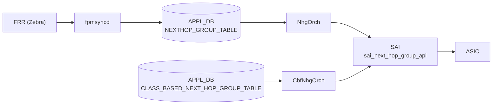

# NEXTHOP_GROUP_TABLE / CLASS_BASED_NEXT_HOP_GROUP_TABLE

## 概要

[APPL_DB](../../reference/glossary.md#term-appl_db) に存在する 2 つの次ホップグループテーブル[^1]。

- **`NEXTHOP_GROUP_TABLE`**: [fpmsyncd](../../reference/glossary.md#term-fpmsyncd) が FRR の Netlink メッセージから解析した次ホップグループを書き込む。`orchagent` の `NhgOrch` が購読し、[SAI](../../reference/glossary.md#term-sai) `sai_next_hop_group_api` 経由で ASIC に反映する。
- **`CLASS_BASED_NEXT_HOP_GROUP_TABLE`**: クラスベース転送 (CBF) 用グループ。`CbfNhgOrch` が購読し、`SAI_NEXT_HOP_GROUP_TYPE_CLASS_BASED` として ASIC に反映する。CLI 書き込み経路は存在せず、`config_db.json` 直編集または gNMI 経由で設定する。

`ROUTE_TABLE` の `nexthop_group` フィールドが本テーブルのキーを参照することで、経路とグループが結び付けられる。

<!-- cdb-mermaid -->
### データフロー



!!! note "凡例"
    APPL_DB から SAI までの典型経路。CBF テーブルは fpmsyncd 非経由（直接書き込み）。
<!-- /cdb-mermaid -->

## key 構造

```text
NEXTHOP_GROUP_TABLE:<index>
CLASS_BASED_NEXT_HOP_GROUP_TABLE:<index>
```

`<index>` は任意文字列。fpmsyncd が生成する通常 NHG では FRR のカーネル nexthop ID 相当の文字列が使われる。CBF NHG では管理者が任意のキーを付与する。

---

## NEXTHOP_GROUP_TABLE フィールド

| フィールド | 型 | 必須 | デフォルト | 説明 |
|-----------|----|------|-----------|------|
| `nexthop` | comma-separated IP address list | 条件付き | なし (空文字) | 各メンバーの next-hop IP アドレス。`nexthop_group` と排他 |
| `ifname` | comma-separated interface name list | no | なし (空文字) | nexthop に対応するインターフェース名リスト |
| `weight` | comma-separated uint32 list | no | `0` (等コスト) | 各メンバーのトラフィック重み。0 = 等コスト ECMP |
| `nexthop_group` | comma-separated NHG index list | 条件付き | なし | 再帰 NHG モード。子 NHG のキーを列挙。`nexthop`/`ifname` と排他 |
| `mpls_nh` | comma-separated MPLS label list | no | なし | MPLS ラベルスタック。`na` で対応 NH のラベルを無効化 |
| `seg_src` | comma-separated IPv6 address list | no | なし | SRv6 ソースアドレス。存在時に `srv6_nh=true` と判定 |

<!-- defaults -->
### フィールドデフォルト詳細

**`weight` のデフォルト: `0` (等コスト)**

`NextHopKey` コンストラクタが `weight(0)` で初期化する[^1]。`createNhgmAttrs()` で `weight == 0` のとき `SAI_NEXT_HOP_GROUP_MEMBER_ATTR_WEIGHT` を SAI に送出しない:

```cpp
// nhgorch.cpp:1113-1118
auto weight = nhgm.getWeight();
if (weight != 0) {
    nhgm_attr.id = SAI_NEXT_HOP_GROUP_MEMBER_ATTR_WEIGHT;
    nhgm_attr.value.s32 = weight;
    nhgm_attrs.push_back(nhgm_attr);
}
```

fpmsyncd 側も `weight != string()` のときのみフィールドを書き込む(routesync.cpp:1154-1155)。weight 未指定経路は weight フィールドなし → orchagent は weight=0 (等コスト) と解釈する。

**`nexthop` / `ifname` のデフォルト: なし (フィールド不在)**

不在時は変数 `ips` / `aliases` が空文字列のまま。`nexthop_group` も不在の場合は `nhg_key` が空となり NHG 生成はスキップされる。

**`nexthop_group` のデフォルト: なし → `is_recursive = false`**

フィールドが存在するとき `is_recursive = true` となり再帰 NHG モードへ移行。`nexthop`/`ifname` との共存は `SWSS_LOG_ERROR` + エントリ破棄。

**`mpls_nh` / `seg_src` のデフォルト: なし**

フィールド不在で MPLS/SRv6 は無効。`mpls_nh[i] == "na"` で対応インデックスのラベルを明示無効化できる。
<!-- /defaults -->

---

## CLASS_BASED_NEXT_HOP_GROUP_TABLE フィールド

| フィールド | 型 | 必須 | デフォルト | 説明 |
|-----------|----|------|-----------|------|
| `members` | comma-separated NEXTHOP_GROUP_TABLE key list | yes | なし | 子 NHG キーのリスト。空・重複は SWSS_LOG_ERROR + 即破棄 |
| `selection_map` | FC_TO_NHG_INDEX_MAP_TABLE key | yes | なし | FC→子NHGインデックスのマップキー。未存在は return false + 再試行 |

<!-- defaults -->
### フィールドデフォルト詳細

**`members` のデフォルト: なし (必須)**

`getMembers()` バリデーション (cbfnhgorch.cpp:212-238):
- 空リスト → `SWSS_LOG_ERROR("CBF next hop group members list is empty.")` → エントリ破棄
- 重複あり → `SWSS_LOG_ERROR("CBF next hop group members are not unique.")` → エントリ破棄

各メンバーの SAI INDEX は追加順に `0, 1, 2, ...` と自動採番される (cbfnhgorch.cpp:257-261)。INDEX は `CREATE_ONLY` 属性のため、メンバー順変更時は全メンバーを remove → add で再構築する。

**`selection_map` のデフォルト: なし (必須)**

`CbfNhg::sync()` で `gNhgMapOrch->getMapId()` が `SAI_NULL_OBJECT_ID` を返した場合:

```cpp
// cbfnhgorch.cpp:321-324
if (nhg_attr.value.oid == SAI_NULL_OBJECT_ID) {
    SWSS_LOG_ERROR("FC to NHG map index %s does not exist", m_selection_map.c_str());
    return false;
}
```

`return false` → Consumer キューに残り再試行（MAP が登録されるまで待機）。

SAI グループ属性は固定:
- `SAI_NEXT_HOP_GROUP_ATTR_TYPE = SAI_NEXT_HOP_GROUP_TYPE_CLASS_BASED`
- `SAI_NEXT_HOP_GROUP_ATTR_CONFIGURED_SIZE = members.size()`
<!-- /defaults -->

---

<!-- ordering -->
## 書込み順依存 (Phase B)

`NhgOrch` および `CbfNhgOrch` は `doTask()` 先頭で `gPortsOrch->allPortsReady()` を確認し、ポートが未初期化の間は処理を一切行わない。その後、テーブルエントリの SET / DEL 操作はいくつかの依存関係に従って処理される。

### 検出された順序依存

| # | 依存関係 | 方向 | 緩和策 |
|---|----------|------|--------|
| 1 | `PortsOrch` 全ポート初期化 → NHG 処理開始 | **強制先行** | 初期化前は `doTask()` が即 return、全エントリが Consumer キューで待機 |
| 2 | fpmsyncd: `NEXTHOP_GROUP_TABLE` 書込み → `ROUTE_TABLE` 書込み | **強制先行** | fpmsyncd は同一 Netlink イベント処理内で NHG を先に書き込んでから ROUTE_TABLE を書く |
| 3 | 再帰 NHG: 子 NHG が `m_syncdNextHopGroups` に存在 → 親 NHG の SET 完了 | **強制先行** | 子未存在の場合は `++it` でキューに残し再試行。子が recursive/temporary の場合は即破棄 |
| 4 | NHG 総数が上限未満 → 通常 NHG 作成 | **前提条件** | 上限到達時は temporary NHG（単一 NH で代替）を作成し本エントリをキューに残す。SRv6 NHG は temp 非対応 |
| 5 | CBF NHG: `FC_TO_NHG_INDEX_MAP_TABLE` の MAP が存在 → `CbfNhg::sync()` 完了 | **前提条件** | MAP 未存在時は `return false` → Consumer キューに残り再試行 |
| 6 | CBF NHG: temp NHG メンバー解消 → success=true で Consumer 消費 | 監視継続 | `hasTemps()` が真の間は `success = false` のままループし昇格を待機 |
| 7 | DEL 操作: 同一 key の pending SET が存在 → DEL をスキップ | **DEL 抑制** | `m_toSync.count(key) > 1` の場合 DEL を消費し SET に任せることで状態の上書き削除を防止 |
| 8 | DEL 操作: NHG の `ref_count` がゼロ → 削除実行 | **強制前提** | `ref_count > 0`（ROUTE_TABLE などが参照中）の間は DEL が保留されキューに残る |

### 主要な制約詳細

**PortsOrch 初期化ガード (依存 #1)**: `NhgOrch::doTask()` / `CbfNhgOrch::doTask()` はどちらも最初の行で `gPortsOrch->allPortsReady()` を評価し、`false` の場合は即 `return` する（`nhgorch.cpp:41-43`、`cbfnhgorch.cpp:42-44`）。システム起動直後にエントリが投入されても、全ポートが ready になるまで処理が始まらない。

**fpmsyncd の書込み順序 (依存 #2)**: fpmsyncd は FRR の Netlink nexthop メッセージを受け取ると、まず `m_nexthop_groupTable.set()` で `NEXTHOP_GROUP_TABLE` を更新し、その後 `m_routeTable->set()` で `ROUTE_TABLE` を書き込む（`routesync.cpp:1882-1896`）。これにより、orchagent が ROUTE_TABLE を処理する時点では NHG が APPL_DB に存在している。

**再帰 NHG の子依存 (依存 #3)**: `nexthop_group` フィールドが存在するとき `is_recursive = true` となり、`NhgOrch::doTask()` は各子 NHG キーを `m_syncdNextHopGroups` で検索する（`nhgorch.cpp:130-134`）。子が未存在の場合は `non_existent_member = true` としてキーから除外し、存在する子のみで NHG を作成してから `success = false` でエントリをキューに残す（`nhgorch.cpp:298-305`）。子が recursive または temporary の場合は `SWSS_LOG_ERROR` を出力し、エントリを即破棄する（`nhgorch.cpp:143-156`）。

**NHG 上限と temporary NHG (依存 #4)**: `gRouteOrch->getNhgCount() + NextHopGroup::getSyncedCount() >= gRouteOrch->getMaxNhgCount()` が真のとき、`NhgOrch` は `createTempNhg()` でメンバーのうち 1 つだけを使った仮グループを作成し、SAI に反映したうえでエントリをキューに残す（`nhgorch.cpp:252-281`）。SAI リソースが解放されると次のループで通常 NHG に昇格する。SRv6 NHG はこの仮作成ロジックを経由せず `++it` でスキップされる（`nhgorch.cpp:257-261`）。`CbfNhgOrch` は上限到達時に `success = false` のまま返してキューに残す（`cbfnhgorch.cpp:100-104`）。

**DEL 後に SET がある場合の保護 (依存 #7)**: DEL 操作時に同一キーで `m_toSync.count(key) > 1` が成立する場合（DEL の後に SET が積まれている）、DEL を消費して何もしない（`nhgorch.cpp:402-404`）。これにより DEL が参照カウント待ちで保留されている間に SET が実行され整合性が壊れる問題を防ぐ。

**参照カウントによる DEL ガード (依存 #8)**: `NhgEntry::ref_count > 0` の間は DEL を実行せず、`++it` でキューに残す（`nhgorch.cpp:414-416`）。`ROUTE_TABLE` エントリが当該 NHG を `nexthop_group` で参照している間は ref_count が非ゼロになるため、ROUTE_TABLE の DEL が先行しなければ NHG は削除されない。
<!-- /ordering -->

---

<!-- cross-refs -->
## 暗黙参照テーブル (Phase C)

`NhgOrch` (`nhgorch.cpp`) および `CbfNhgOrch` (`cbf/cbfnhgorch.cpp`) が `NEXTHOP_GROUP_TABLE` / `CLASS_BASED_NEXT_HOP_GROUP_TABLE` を処理する際、YANG leafref は定義されていないが、複数の Orch / DB に対する暗黙参照が発生する。

### NEXTHOP_GROUP_TABLE の参照

| 参照先 | 参照方向 | 条件 | 参照元 evidence |
|--------|---------|------|----------------|
| `NeighOrch`（NEIGH_TABLE 管理） | NH OID 解決（必須）。解決失敗時は `success=false` でメンバースキップ＋再試行 | 各 NH メンバーの IP が通常 nexthop の場合 | `nhgorch.cpp:544-546` (`hasNextHop` → `getNextHopId`)、`nhgorch.cpp:633,648` (ref_count +1/-1) |
| `IntfsOrch`（INTF_TABLE 管理） | RIF OID 解決（`isIntfNextHop()` 時）。sync 成功後 RIF ref_count +1、remove 時 -1 | NH メンバーがインターフェース次ホップの場合 | `nhgorch.cpp:542` (`getRouterIntfsId`)、`nhgorch.cpp:757,885` (ref_count) |
| `Srv6Orch`（SRv6 nexthop 管理） | SRv6 NH 作成 / 削除 | `isSrv6NextHop()` が真の NH メンバーが存在する場合 | `nhgorch.cpp:550-553` (`createSrv6NexthopWithoutVpn`)、`nhgorch.cpp:665` (`removeSrv6NexthopWithoutVpn`) |
| `RouteOrch`（NHG 上限カウンタ） | NHG 総数チェック（ブロッキング）。上限到達時 temporary NHG を作成し本エントリをキューに残す | 常時（`doTask()` 内で NHG 作成前に評価） | `nhgorch.cpp:252,320` (`getNhgCount() + getSyncedCount() >= getMaxNhgCount()`) |
| `RouteOrch`（ref_count 管理） | `ROUTE_TABLE` の nexthop_group 参照カウント増減。ref_count > 0 の NHG は DEL 保留 | ROUTE_TABLE エントリが当該 NHG を `nexthop_group` フィールドで参照する場合 | `routeorch.cpp:3147-3176` (`incNhgRefCount` / `decNhgRefCount`) |
| `CrmOrch`（CRM カウンタ） | SAI create/delete に連動して `CRM_NEXTHOP_GROUP` カウンタ更新 | NHG の synced 状態変化時 | `nhgorch.cpp:795` (`incCrmResUsedCounter`) |

### CLASS_BASED_NEXT_HOP_GROUP_TABLE の参照

| 参照先 | 参照方向 | 条件 | 参照元 evidence |
|--------|---------|------|----------------|
| `NhgMapOrch`（FC_TO_NHG_INDEX_MAP_TABLE 管理） | MAP の SAI OID 取得（必須）。MAP 未存在時 `return false` → 再試行。FC 数超過 / インデックス超過でエラー+破棄 | `selection_map` フィールドが指定されている場合（必須フィールド） | `cbfnhgorch.cpp:311` (`getMaxNumFcs`)、`cbfnhgorch.cpp:319-324` (`getMapId`)、`cbfnhgorch.cpp:327` (`getLargestNhIndex`)、ref_count: `cbfnhgorch.cpp:354,396` |
| `NhgOrch` / `CbfNhgOrch`（NEXTHOP_GROUP_TABLE / CLASS_BASED_NEXT_HOP_GROUP_TABLE 管理） | 子 NHG の SAI OID 解決（必須）。未 synced の場合 `return false` → 再試行。temporary / recursive は エラー＋ループ継続 | `members` フィールドに列挙された子 NHG キーが存在する場合 | `cbfnhgorch.cpp:247-265` (メンバー OID lookup) |
| `RouteOrch`（NHG 上限カウンタ） | NhgOrch と同一の上限チェック。上限到達時 `success=false` でキューに残す | 常時（`doTask()` 内で NHG 作成前に評価） | `cbfnhgorch.cpp:100` (`getNhgCount() + getSyncedCount() >= getMaxNhgCount()`) |
| `CrmOrch`（CRM カウンタ） | SAI create/delete に連動して `CRM_NEXTHOP_GROUP` カウンタ更新 | CBF NHG の synced 状態変化時 | `cbfnhgorch.cpp:358` (`incCrmResUsedCounter`) |

!!! note "NeighOrch の NH 解決失敗は非致命的"
    `NextHopGroupMember::getNhId()` が `SAI_NULL_OBJECT_ID` を返したメンバーは `syncMembers()` でスキップされ、残りのメンバーで NHG が部分同期される (`nhgorch.cpp:938-944`)。neighbor が後から登録されると `PortsOrch` / `NeighOrch` からの通知で再同期が走り、スキップされたメンバーが NHG に追加される。

!!! note "NhgMapOrch 参照は CBF 専用"
    `FC_TO_NHG_INDEX_MAP_TABLE` への参照は `CLASS_BASED_NEXT_HOP_GROUP_TABLE` の処理でのみ発生する。通常 `NEXTHOP_GROUP_TABLE` の処理パス (`NhgOrch`) は `NhgMapOrch` を参照しない。

詳細分析: `meta/_intermediate/cdb-flow/nhg-table-cross-refs.md`
<!-- /cross-refs -->

---

## 購読者

| テーブル | 購読者 | SAI API |
|---------|-------|---------|
| `NEXTHOP_GROUP_TABLE` | `NhgOrch` (orchagent) | `sai_next_hop_group_api->create_next_hop_group` |
| `CLASS_BASED_NEXT_HOP_GROUP_TABLE` | `CbfNhgOrch` (orchagent) | `sai_next_hop_group_api->create_next_hop_group` (TYPE_CLASS_BASED) |

orchagent 起動時の初期化 (orchdaemon.cpp:338-339):

```cpp
gNhgOrch    = new NhgOrch   (m_applDb, APP_NEXTHOP_GROUP_TABLE_NAME);
gCbfNhgOrch = new CbfNhgOrch(m_applDb, APP_CLASS_BASED_NEXT_HOP_GROUP_TABLE_NAME);
```

---

## 例外条件・特殊挙動

| 条件 | 挙動 |
|------|------|
| `nexthop_group` と `nexthop`/`ifname` が共存 | `SWSS_LOG_ERROR` → エントリ破棄 (再試行なし) |
| 再帰 NHG の子 NHG が未存在 | `return false` → Consumer キューに残り再試行 |
| 再帰 NHG の子 NHG が recursive または temporary | `SWSS_LOG_ERROR` → エントリ破棄 |
| CBF `members` が空または重複 | `SWSS_LOG_ERROR` → エントリ破棄 (再試行なし) |
| CBF `selection_map` の MAP が未存在 | `return false` → Consumer キューに残り再試行 |
| CBF の MAP がメンバー数より大きい NH index を参照 | `SWSS_LOG_ERROR` → `return false` |
| CBF NHG が既存かつ temp NHG メンバーを含む | `success = false` → ループ継続で temp 解消を待機 |
| NHG 総数が上限 (`getMaxNhgCount()`) 到達 | `SWSS_LOG_WARN` → `success = false` → 再試行 |

---

## 書き込み入り口

### NEXTHOP_GROUP_TABLE

- **fpmsyncd** (`sonic-swss/fpmsyncd/routesync.cpp`): FRR の Netlink nexthop メッセージを `NextHopGroupTableFieldValueTupleWrapper` でラップし APPL_DB に書き込む。ZMQ 有効時は全フィールドを常に送出、無効時は空フィールドをスキップ。

### CLASS_BASED_NEXT_HOP_GROUP_TABLE

- **直接書き込み**: CLI 経路なし。`config_db.json` 直編集または gNMI/REST 経由で APPL_DB に書き込む。

---

## 確認コマンド

```bash
# 通常 NHG の一覧
redis-cli -n 0 keys 'NEXTHOP_GROUP_TABLE:*'
redis-cli -n 0 HGETALL 'NEXTHOP_GROUP_TABLE:<index>'

# CBF NHG の一覧
redis-cli -n 0 keys 'CLASS_BASED_NEXT_HOP_GROUP_TABLE:*'
redis-cli -n 0 HGETALL 'CLASS_BASED_NEXT_HOP_GROUP_TABLE:<name>'

# ASIC 側の NHG
redis-cli -n 1 KEYS 'ASIC_STATE:SAI_OBJECT_TYPE_NEXT_HOP_GROUP*'
```

---

## 関連 CONFIG_DB / YANG / CLI

- 関連 APPL_DB: `ROUTE_TABLE` (`nexthop_group` フィールドで本テーブルを参照)
- 関連 APPL_DB: `FC_TO_NHG_INDEX_MAP_TABLE` (CBF の `selection_map` 参照先)
- 関連 CONFIG_DB: `FG_NHG` (Fine-Grained ECMP — 異なるコードパス)

<!-- ref-triangle:start -->

## 関連リファレンス

- [クラスベース転送 (CBF)](../../routing/class-based-forwarding-enhancement.md)
- [ルーティングと NHG テーブル拡張](../../routing/routing-and-next-hop-table-enhancement.md)
- [FG_NHG テーブル](./fg-nhg.md)

<!-- ref-triangle:end -->

## 引用元

[^1]: テーブル名定数: `sonic-swss-common/common/schema.h:55-56`. `APP_NEXTHOP_GROUP_TABLE_NAME = "NEXTHOP_GROUP_TABLE"`, `APP_CLASS_BASED_NEXT_HOP_GROUP_TABLE_NAME = "CLASS_BASED_NEXT_HOP_GROUP_TABLE"`. NhgOrch 実装: `sonic-swss/orchagent/nhgorch.cpp`. CbfNhgOrch 実装: `sonic-swss/orchagent/cbf/cbfnhgorch.cpp`. fpmsyncd 書き込み: `sonic-swss/fpmsyncd/routesync.cpp:1138-1158`.
