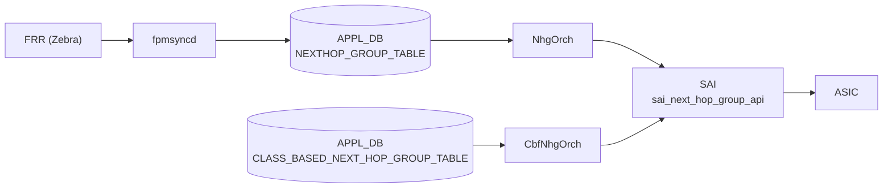

# NEXTHOP_GROUP_TABLE / CLASS_BASED_NEXT_HOP_GROUP_TABLE

## 概要

[APPL_DB](../../reference/glossary.md#term-appl_db) に存在する 2 つの次ホップグループテーブル[^1]。

- **`NEXTHOP_GROUP_TABLE`**: [fpmsyncd](../../reference/glossary.md#term-fpmsyncd) が FRR の Netlink メッセージから解析した次ホップグループを書き込む。`orchagent` の `NhgOrch` が購読し、[SAI](../../reference/glossary.md#term-sai) `sai_next_hop_group_api` 経由で ASIC に反映する。
- **`CLASS_BASED_NEXT_HOP_GROUP_TABLE`**: クラスベース転送 (CBF) 用グループ。`CbfNhgOrch` が購読し、`SAI_NEXT_HOP_GROUP_TYPE_CLASS_BASED` として ASIC に反映する。CLI 書き込み経路は存在せず、`config_db.json` 直編集または gNMI 経由で設定する。

`ROUTE_TABLE` の `nexthop_group` フィールドが本テーブルのキーを参照することで、経路とグループが結び付けられる。

<!-- cdb-mermaid -->
### データフロー



!!! note "凡例"
    APPL_DB から SAI までの典型経路。CBF テーブルは fpmsyncd 非経由（直接書き込み）。
<!-- /cdb-mermaid -->

## key 構造

```text
NEXTHOP_GROUP_TABLE:<index>
CLASS_BASED_NEXT_HOP_GROUP_TABLE:<index>
```

`<index>` は任意文字列。fpmsyncd が生成する通常 NHG では FRR のカーネル nexthop ID 相当の文字列が使われる。CBF NHG では管理者が任意のキーを付与する。

---

## NEXTHOP_GROUP_TABLE フィールド

| フィールド | 型 | 必須 | デフォルト | 説明 |
|-----------|----|------|-----------|------|
| `nexthop` | comma-separated IP address list | 条件付き | なし (空文字) | 各メンバーの next-hop IP アドレス。`nexthop_group` と排他 |
| `ifname` | comma-separated interface name list | no | なし (空文字) | nexthop に対応するインターフェース名リスト |
| `weight` | comma-separated uint32 list | no | `0` (等コスト) | 各メンバーのトラフィック重み。0 = 等コスト ECMP |
| `nexthop_group` | comma-separated NHG index list | 条件付き | なし | 再帰 NHG モード。子 NHG のキーを列挙。`nexthop`/`ifname` と排他 |
| `mpls_nh` | comma-separated MPLS label list | no | なし | MPLS ラベルスタック。`na` で対応 NH のラベルを無効化 |
| `seg_src` | comma-separated IPv6 address list | no | なし | SRv6 ソースアドレス。存在時に `srv6_nh=true` と判定 |

<!-- defaults -->
### フィールドデフォルト詳細

**`weight` のデフォルト: `0` (等コスト)**

`NextHopKey` コンストラクタが `weight(0)` で初期化する[^1]。`createNhgmAttrs()` で `weight == 0` のとき `SAI_NEXT_HOP_GROUP_MEMBER_ATTR_WEIGHT` を SAI に送出しない:

```cpp
// nhgorch.cpp:1113-1118
auto weight = nhgm.getWeight();
if (weight != 0) {
    nhgm_attr.id = SAI_NEXT_HOP_GROUP_MEMBER_ATTR_WEIGHT;
    nhgm_attr.value.s32 = weight;
    nhgm_attrs.push_back(nhgm_attr);
}
```

fpmsyncd 側も `weight != string()` のときのみフィールドを書き込む(routesync.cpp:1154-1155)。weight 未指定経路は weight フィールドなし → orchagent は weight=0 (等コスト) と解釈する。

**`nexthop` / `ifname` のデフォルト: なし (フィールド不在)**

不在時は変数 `ips` / `aliases` が空文字列のまま。`nexthop_group` も不在の場合は `nhg_key` が空となり NHG 生成はスキップされる。

**`nexthop_group` のデフォルト: なし → `is_recursive = false`**

フィールドが存在するとき `is_recursive = true` となり再帰 NHG モードへ移行。`nexthop`/`ifname` との共存は `SWSS_LOG_ERROR` + エントリ破棄。

**`mpls_nh` / `seg_src` のデフォルト: なし**

フィールド不在で MPLS/SRv6 は無効。`mpls_nh[i] == "na"` で対応インデックスのラベルを明示無効化できる。
<!-- /defaults -->

---

## CLASS_BASED_NEXT_HOP_GROUP_TABLE フィールド

| フィールド | 型 | 必須 | デフォルト | 説明 |
|-----------|----|------|-----------|------|
| `members` | comma-separated NEXTHOP_GROUP_TABLE key list | yes | なし | 子 NHG キーのリスト。空・重複は SWSS_LOG_ERROR + 即破棄 |
| `selection_map` | FC_TO_NHG_INDEX_MAP_TABLE key | yes | なし | FC→子NHGインデックスのマップキー。未存在は return false + 再試行 |

<!-- defaults -->
### フィールドデフォルト詳細

**`members` のデフォルト: なし (必須)**

`getMembers()` バリデーション (cbfnhgorch.cpp:212-238):
- 空リスト → `SWSS_LOG_ERROR("CBF next hop group members list is empty.")` → エントリ破棄
- 重複あり → `SWSS_LOG_ERROR("CBF next hop group members are not unique.")` → エントリ破棄

各メンバーの SAI INDEX は追加順に `0, 1, 2, ...` と自動採番される (cbfnhgorch.cpp:257-261)。INDEX は `CREATE_ONLY` 属性のため、メンバー順変更時は全メンバーを remove → add で再構築する。

**`selection_map` のデフォルト: なし (必須)**

`CbfNhg::sync()` で `gNhgMapOrch->getMapId()` が `SAI_NULL_OBJECT_ID` を返した場合:

```cpp
// cbfnhgorch.cpp:321-324
if (nhg_attr.value.oid == SAI_NULL_OBJECT_ID) {
    SWSS_LOG_ERROR("FC to NHG map index %s does not exist", m_selection_map.c_str());
    return false;
}
```

`return false` → Consumer キューに残り再試行（MAP が登録されるまで待機）。

SAI グループ属性は固定:
- `SAI_NEXT_HOP_GROUP_ATTR_TYPE = SAI_NEXT_HOP_GROUP_TYPE_CLASS_BASED`
- `SAI_NEXT_HOP_GROUP_ATTR_CONFIGURED_SIZE = members.size()`
<!-- /defaults -->

---

## 購読者

| テーブル | 購読者 | SAI API |
|---------|-------|---------|
| `NEXTHOP_GROUP_TABLE` | `NhgOrch` (orchagent) | `sai_next_hop_group_api->create_next_hop_group` |
| `CLASS_BASED_NEXT_HOP_GROUP_TABLE` | `CbfNhgOrch` (orchagent) | `sai_next_hop_group_api->create_next_hop_group` (TYPE_CLASS_BASED) |

orchagent 起動時の初期化 (orchdaemon.cpp:338-339):

```cpp
gNhgOrch    = new NhgOrch   (m_applDb, APP_NEXTHOP_GROUP_TABLE_NAME);
gCbfNhgOrch = new CbfNhgOrch(m_applDb, APP_CLASS_BASED_NEXT_HOP_GROUP_TABLE_NAME);
```

---

## 例外条件・特殊挙動

| 条件 | 挙動 |
|------|------|
| `nexthop_group` と `nexthop`/`ifname` が共存 | `SWSS_LOG_ERROR` → エントリ破棄 (再試行なし) |
| 再帰 NHG の子 NHG が未存在 | `return false` → Consumer キューに残り再試行 |
| 再帰 NHG の子 NHG が recursive または temporary | `SWSS_LOG_ERROR` → エントリ破棄 |
| CBF `members` が空または重複 | `SWSS_LOG_ERROR` → エントリ破棄 (再試行なし) |
| CBF `selection_map` の MAP が未存在 | `return false` → Consumer キューに残り再試行 |
| CBF の MAP がメンバー数より大きい NH index を参照 | `SWSS_LOG_ERROR` → `return false` |
| CBF NHG が既存かつ temp NHG メンバーを含む | `success = false` → ループ継続で temp 解消を待機 |
| NHG 総数が上限 (`getMaxNhgCount()`) 到達 | `SWSS_LOG_WARN` → `success = false` → 再試行 |

---

## 書き込み入り口

### NEXTHOP_GROUP_TABLE

- **fpmsyncd** (`sonic-swss/fpmsyncd/routesync.cpp`): FRR の Netlink nexthop メッセージを `NextHopGroupTableFieldValueTupleWrapper` でラップし APPL_DB に書き込む。ZMQ 有効時は全フィールドを常に送出、無効時は空フィールドをスキップ。

### CLASS_BASED_NEXT_HOP_GROUP_TABLE

- **直接書き込み**: CLI 経路なし。`config_db.json` 直編集または gNMI/REST 経由で APPL_DB に書き込む。

---

## 確認コマンド

```bash
# 通常 NHG の一覧
redis-cli -n 0 keys 'NEXTHOP_GROUP_TABLE:*'
redis-cli -n 0 HGETALL 'NEXTHOP_GROUP_TABLE:<index>'

# CBF NHG の一覧
redis-cli -n 0 keys 'CLASS_BASED_NEXT_HOP_GROUP_TABLE:*'
redis-cli -n 0 HGETALL 'CLASS_BASED_NEXT_HOP_GROUP_TABLE:<name>'

# ASIC 側の NHG
redis-cli -n 1 KEYS 'ASIC_STATE:SAI_OBJECT_TYPE_NEXT_HOP_GROUP*'
```

---

## 関連 CONFIG_DB / YANG / CLI

- 関連 APPL_DB: `ROUTE_TABLE` (`nexthop_group` フィールドで本テーブルを参照)
- 関連 APPL_DB: `FC_TO_NHG_INDEX_MAP_TABLE` (CBF の `selection_map` 参照先)
- 関連 CONFIG_DB: `FG_NHG` (Fine-Grained ECMP — 異なるコードパス)

<!-- ref-triangle:start -->

## 関連リファレンス

- [クラスベース転送 (CBF)](../../routing/class-based-forwarding-enhancement.md)
- [ルーティングと NHG テーブル拡張](../../routing/routing-and-next-hop-table-enhancement.md)
- [FG_NHG テーブル](./fg-nhg.md)

<!-- ref-triangle:end -->

## 引用元

[^1]: テーブル名定数: `sonic-swss-common/common/schema.h:55-56`. `APP_NEXTHOP_GROUP_TABLE_NAME = "NEXTHOP_GROUP_TABLE"`, `APP_CLASS_BASED_NEXT_HOP_GROUP_TABLE_NAME = "CLASS_BASED_NEXT_HOP_GROUP_TABLE"`. NhgOrch 実装: `sonic-swss/orchagent/nhgorch.cpp`. CbfNhgOrch 実装: `sonic-swss/orchagent/cbf/cbfnhgorch.cpp`. fpmsyncd 書き込み: `sonic-swss/fpmsyncd/routesync.cpp:1138-1158`.
