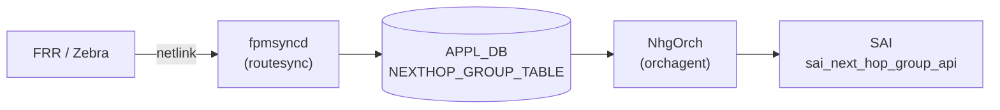

# NEXTHOP_GROUP_TABLE (APPL\_DB)

## 概要

`NEXTHOP_GROUP_TABLE` は **APPL\_DB** に置かれる [ECMP](../../reference/glossary.md#term-ecmp) nexthop group テーブルである[^1]。`schema.h` では `APP_NEXTHOP_GROUP_TABLE_NAME "NEXTHOP_GROUP_TABLE"` と定義されており、`APP_` プレフィックスの通り CONFIG\_DB ではなく APPL\_DB に属する。

`fpmsyncd` (`routesync.cpp`) が FRR/Zebra から kernel netlink 経由で受信した ECMP ルートを変換して書き込む。`NhgOrch` が APPL\_DB を購読し、[SAI](../../reference/glossary.md#term-sai) の `sai_next_hop_group_api` を使って next hop group を作成・更新する。

<!-- cdb-mermaid -->
### データフロー



!!! note "注意"
    `NEXTHOP_GROUP_TABLE` は CONFIG\_DB ではなく **APPL\_DB** に存在する。本ページは参照の便宜上 `docs/reference/config-db/` 以下に配置しているが、書き込み元は CLI・minigraph ではなく `fpmsyncd` (ルーティングデーモン連携) である。
<!-- /cdb-mermaid -->

## key 構造

```text
NEXTHOP_GROUP_TABLE|<nhg_id>
```

`<nhg_id>` は `fpmsyncd` が kernel netlink のグループ ID を文字列化したもの (例: `group123`)。ルートテーブル (`ROUTE_TABLE`) の `nexthop_group` フィールドからこのキーを参照する。

## フィールド一覧

| フィールド | 型 | 必須 | 説明 |
|-----------|-----|------|------|
| `nexthop` | comma-separated IP addresses | yes | ECMP メンバーのゲートウェイ IP アドレス一覧 |
| `ifname` | comma-separated interface names | yes | 各 nexthop に対応する出力インタフェース名一覧 |
| `weight` | comma-separated integers | no | ECMP メンバーごとの重み (UCMP 用、省略時は均等分散) |
| `mpls_nh` | comma-separated MPLS labels or `na` | no | MPLS ラベルスタック (`na` = MPLS なし) |
| `seg_src` | comma-separated IPv6 addresses | SRv6 時 yes | SRv6 ソースアドレス。存在時に SRv6 モードに自動切替 |
| `nexthop_group` | comma-separated NHG index names | 再帰 NHG 時 yes | 再帰 NHG モード: メンバー NHG のインデックス名一覧 |

## 購読者

- `NhgOrch`: APPL\_DB の `NEXTHOP_GROUP_TABLE` を購読。SET で SAI next hop group を作成または更新、DEL で削除 (参照カウント 0 のとき)。

## 関連テーブル

- `ROUTE_TABLE` (APPL\_DB): `nexthop_group` フィールドで本テーブルのキーを参照するルート
- `CLASS_BASED_NEXT_HOP_GROUP_TABLE` (APPL\_DB): CBF NHG がメンバー NHG として本テーブルのエントリを参照
- `FG_NHG` (CONFIG\_DB): Fine-Grained ECMP の定義。本テーブルとは独立した別経路 (`FgNhgOrch` が処理)

<!-- ref-triangle:start -->

## 関連リファレンス

- [CONFIG\_DB: FG\_NHG テーブル](../config-db/fg-nhg.md)

<!-- ref-triangle:end -->

## 引用元

[^1]: `schema.h`: `#define APP_NEXTHOP_GROUP_TABLE_NAME "NEXTHOP_GROUP_TABLE"`. <https://github.com/sonic-net/sonic-swss-common/blob/master/common/schema.h>; `orchdaemon.cpp`: `gNhgOrch = new NhgOrch(m_applDb, APP_NEXTHOP_GROUP_TABLE_NAME)`. <https://github.com/sonic-net/sonic-swss/blob/4305596/orchagent/orchdaemon.cpp>

<!-- defaults -->
## コード由来の暗黙デフォルト (Phase A)

> **注意**: `NEXTHOP_GROUP_TABLE` は **APPL\_DB** テーブルである。`APP_NEXTHOP_GROUP_TABLE_NAME` として `schema.h` で定義され、`fpmsyncd` (`routesync.cpp`) が FRR/Zebra から受信した netlink ECMP ルートを変換して書き込む。`NhgOrch` が APPL\_DB を購読して SAI next hop group を作成する。CONFIG\_DB には存在しない。

| フィールド | 省略/未設定時の実装動作 | コードロケーション |
|-----------|----------------------|------------------|
| `weight` | 省略時は全メンバー均等 (weight=1 相当)。`weights` が空文字列の場合 `NextHopGroupKey` の各メンバーに weight=1 が割り当てられる。`fpmsyncd` 側でも `weights.empty()` なら `weight` フィールドを書き込まない。 | `nhgorch.cpp` `doTask` L79-80; `routesync.cpp` `updateNextHopGroupDb` L3415-3418 |
| `mpls_nh` | 省略または `na` 指定時は MPLS ラベルなし。通常 IP forwarding 経路として NHG を構築。 | `nhgorch.cpp` `doTask` L230-234 |
| `seg_src` | 省略時は SRv6 なし (通常 IP NHG)。`seg_src` フィールドが存在すると `srv6_nh=true` に自動設定されて SRv6 コードパスへ分岐。`nexthop` 数と `seg_src` 数が不一致の場合は `SWSS_LOG_ERROR` → エントリ破棄。 | `nhgorch.cpp` L85-89, L209-214 |
| `nexthop_group` | 省略時は通常 IP/MPLS NHG。存在すると再帰 NHG モード (`is_recursive=true`)。`nexthop`/`ifname` と混在は `SWSS_LOG_ERROR` → エントリ即破棄 (再試行なし)。 | `nhgorch.cpp` L91-102 |
| NHG 数上限 | `getMaxNhgCount()` 到達時、非 SRv6 NHG は代表 1 NH の temporary group を作成してルートを暫定解決。SRv6 NHG はスキップ (再試行待ち)。temporary group は resources 解放後に自動昇格。 | `nhgorch.cpp` L252-264 |
| 再帰 NHG の部分メンバー | メンバー NHG の一部が未解決でも利用可能分で即時 partial NHG を作成。全メンバー未解決の場合は skip → リソース登録後に再試行。 | `nhgorch.cpp` L131-163 |
| DEL 時の参照カウント | 参照元ルートが存在する間は NHG を削除できない。`getRefCount() > 0` でブロックされ `m_toSync` に残り再試行。 | `nhgorch.cpp` DEL_COMMAND ブロック |

### 書込み順依存

- 再帰 NHG のメンバー NHG が `m_syncdNextHopGroups` に存在しない場合はスキップされる。メンバー NHG 登録後に部分的に再構築される (partial NHG として即時適用)。
- NHG を参照するルートが存在する間は DEL_COMMAND で NHG を削除できない。ルートを先に削除してから NHG を削除する必要がある。
- `fpmsyncd` が NHG エントリを書き込む前に `ROUTE_TABLE` の `nexthop_group` フィールドが先に届いた場合、`RouteOrch` は NHG 解決を pending にして待機する。

### 既知の注意点

- `overlay_nh` フラグは `nhgorch.cpp` L67 で `false` に初期化されるが、APPL\_DB のフィールドとして明示的にセットするパスは現実装にない。再帰 NHG のメンバーから派生する場合のみ使用される。
- `NEXTHOP_GROUP_TABLE` には YANG モデルが存在しない (APPL\_DB テーブルのため)。バリデーションはすべて orchagent 側の実装ロジックに依存する。
- 再帰 NHG のメンバーが recursive または temporary な NHG であった場合は `SWSS_LOG_ERROR` → エントリ即破棄。2 段ネストの再帰 NHG は許可されない。

<!-- /defaults -->

<!-- pubsub -->
## 通信メカニズム (Phase G)

### APPL\_DB 購読 — `ConsumerStateTable` ベース

`NhgOrch` は `orchdaemon.cpp` で `APPL_DB::NEXTHOP_GROUP_TABLE` を購読するよう生成・登録される:

```cpp
// orchdaemon.cpp L338
gNhgOrch = new NhgOrch(m_applDb, APP_NEXTHOP_GROUP_TABLE_NAME);
```

基底クラス `NhgOrchCommon → Orch` が **`ConsumerStateTable`** として購読し、orchagent のメインループ (`Select::select()`) に組み込まれる。Redis の `ConsumerStateTable` プロトコル（`PUBLISH` チャネル + keyspace 通知）により変更イベントが `doTask()` に配信される。

> **注意**: `NEXTHOP_GROUP_TABLE` は APPL\_DB テーブルのため CONFIG\_DB Subscribe は使用しない。書き込み元は `fpmsyncd` (`routesync.cpp`) であり、CLI・minigraph は関与しない。

### doTask() ディスパッチ

```
ConsumerStateTable 通知受信 (fpmsyncd → APPL_DB)
    └─ NhgOrch::doTask(Consumer& consumer)      ← nhgorch.cpp L37
            ├─ gPortsOrch->allPortsReady() チェック
            ├─ SET_COMMAND
            │       ├─ フィールド解析 (nexthop / ifname / weight / mpls_nh / seg_src / nexthop_group)
            │       ├─ NHG 数上限チェック → 超過時 createTempNhg()
            │       ├─ 新規 → NextHopGroup::sync() → SAI create_next_hop_group
            │       └─ 更新 → NextHopGroup::update() → SAI set/add/remove member
            └─ DEL_COMMAND
                    ├─ getRefCount() > 0 → skip (参照カウント非ゼロ)
                    └─ NextHopGroup::remove() → SAI remove_next_hop_group
```

### SAI next\_hop\_group\_api 呼び出し

| SAI 関数 | タイミング | コードロケーション |
|----------|-----------|------------------|
| `create_next_hop_group()` | 新規 NHG (ECMP タイプ) 作成 | `nhgorch.cpp` L775 |
| `create_next_hop_group_member()` | `syncMembers()` — `ObjectBulker` 経由でバッチ送信 | `nhgorch.cpp` L913 |
| `set_next_hop_group_member_attribute()` | メンバー weight 更新 | `nhgorch.cpp` L614 |
| `remove_next_hop_group_member()` | メンバー削除 (`NhgCommon::remove()` 経由) | `NhgCommon` |
| `remove_next_hop_group()` | NHG 全体削除 | `NhgCommon::remove()` |

メンバー追加・削除は `ObjectBulker<sai_next_hop_group_api_t>` でバッチ化され、`flush()` 時に一括 SAI 呼び出しが実行される (`nhgorch.cpp` L913)。

### Observer パターン — `NeighOrch` → `NhgOrch`

`NhgOrch` は **Observer (被観察者)** としても機能する。`NeighOrch` が ARP/NDP 状態変化を検知すると次を呼び出す:

| メソッド | トリガー | 動作 |
|---------|---------|------|
| `NhgOrch::validateNextHop(nh_key)` | nexthop が解決済みになった | 該当 NH を含む全 NHG を走査 → `syncMembers()` → SAI member create |
| `NhgOrch::invalidateNextHop(nh_key)` | nexthop が失効した (IF DOWN 等) | 該当 NH を含む全 NHG を走査 → SAI member remove (NHG 自体は保持) |

これによりインタフェース UP/DOWN や ARP 解決に連動して NHG メンバーが動的に追加・削除される。

### CRM (Critical Resource Monitor) 連携

NHG 作成時に `gCrmOrch->incCrmResUsedCounter(CRM_NEXTHOP_GROUP)` を呼び出し、ハードウェアリソース使用量を追跡する (`nhgorch.cpp` L795)。

### 起動時スナップショット

orchagent 起動時、`Select::select()` ループ開始前に `ConsumerStateTable` の既存エントリが drain され `doTask()` が一括処理される。再起動後も APPL\_DB の既存 NHG エントリが SAI に再設定される。

<!-- /pubsub -->

<!-- glossary-links-injected: nhg-2026-0515 -->
