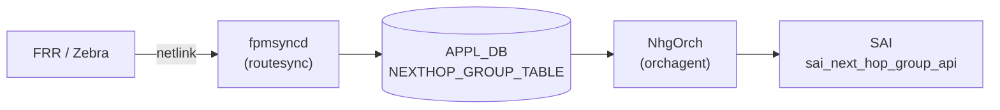

# NEXTHOP_GROUP_TABLE (APPL\_DB)

## 概要

`NEXTHOP_GROUP_TABLE` は **APPL\_DB** に置かれる [ECMP](../../reference/glossary.md#term-ecmp) nexthop group テーブルである[^1]。`schema.h` では `APP_NEXTHOP_GROUP_TABLE_NAME "NEXTHOP_GROUP_TABLE"` と定義されており、`APP_` プレフィックスの通り CONFIG\_DB ではなく APPL\_DB に属する。

`fpmsyncd` (`routesync.cpp`) が FRR/Zebra から kernel netlink 経由で受信した ECMP ルートを変換して書き込む。`NhgOrch` が APPL\_DB を購読し、[SAI](../../reference/glossary.md#term-sai) の `sai_next_hop_group_api` を使って next hop group を作成・更新する。

<!-- cdb-mermaid -->
### データフロー



!!! note "注意"
    `NEXTHOP_GROUP_TABLE` は CONFIG\_DB ではなく **APPL\_DB** に存在する。本ページは参照の便宜上 `docs/reference/config-db/` 以下に配置しているが、書き込み元は CLI・minigraph ではなく `fpmsyncd` (ルーティングデーモン連携) である。
<!-- /cdb-mermaid -->

## key 構造

```text
NEXTHOP_GROUP_TABLE|<nhg_id>
```

`<nhg_id>` は `fpmsyncd` が kernel netlink のグループ ID を文字列化したもの (例: `group123`)。ルートテーブル (`ROUTE_TABLE`) の `nexthop_group` フィールドからこのキーを参照する。

## フィールド一覧

| フィールド | 型 | 必須 | 説明 |
|-----------|-----|------|------|
| `nexthop` | comma-separated IP addresses | yes | ECMP メンバーのゲートウェイ IP アドレス一覧 |
| `ifname` | comma-separated interface names | yes | 各 nexthop に対応する出力インタフェース名一覧 |
| `weight` | comma-separated integers | no | ECMP メンバーごとの重み (UCMP 用、省略時は均等分散) |
| `mpls_nh` | comma-separated MPLS labels or `na` | no | MPLS ラベルスタック (`na` = MPLS なし) |
| `seg_src` | comma-separated IPv6 addresses | SRv6 時 yes | SRv6 ソースアドレス。存在時に SRv6 モードに自動切替 |
| `nexthop_group` | comma-separated NHG index names | 再帰 NHG 時 yes | 再帰 NHG モード: メンバー NHG のインデックス名一覧 |

## 購読者

- `NhgOrch`: APPL\_DB の `NEXTHOP_GROUP_TABLE` を購読。SET で SAI next hop group を作成または更新、DEL で削除 (参照カウント 0 のとき)。

## 関連テーブル

- `ROUTE_TABLE` (APPL\_DB): `nexthop_group` フィールドで本テーブルのキーを参照するルート
- `CLASS_BASED_NEXT_HOP_GROUP_TABLE` (APPL\_DB): CBF NHG がメンバー NHG として本テーブルのエントリを参照
- `FG_NHG` (CONFIG\_DB): Fine-Grained ECMP の定義。本テーブルとは独立した別経路 (`FgNhgOrch` が処理)

<!-- ref-triangle:start -->

## 関連リファレンス

- [CONFIG\_DB: FG\_NHG テーブル](../config-db/fg-nhg.md)

<!-- ref-triangle:end -->

## 引用元

[^1]: `schema.h`: `#define APP_NEXTHOP_GROUP_TABLE_NAME "NEXTHOP_GROUP_TABLE"`. <https://github.com/sonic-net/sonic-swss-common/blob/master/common/schema.h>; `orchdaemon.cpp`: `gNhgOrch = new NhgOrch(m_applDb, APP_NEXTHOP_GROUP_TABLE_NAME)`. <https://github.com/sonic-net/sonic-swss/blob/4305596/orchagent/orchdaemon.cpp>

<!-- defaults -->
## コード由来の暗黙デフォルト (Phase A)

> **注意**: `NEXTHOP_GROUP_TABLE` は **APPL\_DB** テーブルである。`APP_NEXTHOP_GROUP_TABLE_NAME` として `schema.h` で定義され、`fpmsyncd` (`routesync.cpp`) が FRR/Zebra から受信した netlink ECMP ルートを変換して書き込む。`NhgOrch` が APPL\_DB を購読して SAI next hop group を作成する。CONFIG\_DB には存在しない。

| フィールド | 省略/未設定時の実装動作 | コードロケーション |
|-----------|----------------------|------------------|
| `weight` | 省略時は全メンバー均等 (weight=1 相当)。`weights` が空文字列の場合 `NextHopGroupKey` の各メンバーに weight=1 が割り当てられる。`fpmsyncd` 側でも `weights.empty()` なら `weight` フィールドを書き込まない。 | `nhgorch.cpp` `doTask` L79-80; `routesync.cpp` `updateNextHopGroupDb` L3415-3418 |
| `mpls_nh` | 省略または `na` 指定時は MPLS ラベルなし。通常 IP forwarding 経路として NHG を構築。 | `nhgorch.cpp` `doTask` L230-234 |
| `seg_src` | 省略時は SRv6 なし (通常 IP NHG)。`seg_src` フィールドが存在すると `srv6_nh=true` に自動設定されて SRv6 コードパスへ分岐。`nexthop` 数と `seg_src` 数が不一致の場合は `SWSS_LOG_ERROR` → エントリ破棄。 | `nhgorch.cpp` L85-89, L209-214 |
| `nexthop_group` | 省略時は通常 IP/MPLS NHG。存在すると再帰 NHG モード (`is_recursive=true`)。`nexthop`/`ifname` と混在は `SWSS_LOG_ERROR` → エントリ即破棄 (再試行なし)。 | `nhgorch.cpp` L91-102 |
| NHG 数上限 | `getMaxNhgCount()` 到達時、非 SRv6 NHG は代表 1 NH の temporary group を作成してルートを暫定解決。SRv6 NHG はスキップ (再試行待ち)。temporary group は resources 解放後に自動昇格。 | `nhgorch.cpp` L252-264 |
| 再帰 NHG の部分メンバー | メンバー NHG の一部が未解決でも利用可能分で即時 partial NHG を作成。全メンバー未解決の場合は skip → リソース登録後に再試行。 | `nhgorch.cpp` L131-163 |
| DEL 時の参照カウント | 参照元ルートが存在する間は NHG を削除できない。`getRefCount() > 0` でブロックされ `m_toSync` に残り再試行。 | `nhgorch.cpp` DEL_COMMAND ブロック |

### 書込み順依存

- 再帰 NHG のメンバー NHG が `m_syncdNextHopGroups` に存在しない場合はスキップされる。メンバー NHG 登録後に部分的に再構築される (partial NHG として即時適用)。
- NHG を参照するルートが存在する間は DEL_COMMAND で NHG を削除できない。ルートを先に削除してから NHG を削除する必要がある。
- `fpmsyncd` が NHG エントリを書き込む前に `ROUTE_TABLE` の `nexthop_group` フィールドが先に届いた場合、`RouteOrch` は NHG 解決を pending にして待機する。

### 既知の注意点

- `overlay_nh` フラグは `nhgorch.cpp` L67 で `false` に初期化されるが、APPL\_DB のフィールドとして明示的にセットするパスは現実装にない。再帰 NHG のメンバーから派生する場合のみ使用される。
- `NEXTHOP_GROUP_TABLE` には YANG モデルが存在しない (APPL\_DB テーブルのため)。バリデーションはすべて orchagent 側の実装ロジックに依存する。
- 再帰 NHG のメンバーが recursive または temporary な NHG であった場合は `SWSS_LOG_ERROR` → エントリ即破棄。2 段ネストの再帰 NHG は許可されない。

<!-- /defaults -->

<!-- ordering -->
## 書込み順依存 (Phase B)

<!-- evidence: meta/_intermediate/cdb-flow/nhg-ordering.md -->

`NhgOrch` は APPL\_DB の `NEXTHOP_GROUP_TABLE` を `ConsumerStateTable` で購読し、`doTask()` で SAI next hop group の作成・更新・削除を行う。エントリの処理順序は複数の前提条件に依存しており、consumer から観測できる中間状態がいくつか存在する。

### 検出された順序依存

| # | 依存関係 | 方向 | 緩和策 |
|---|----------|------|--------|
| 1 | メンバー NHG 登録 → 親（再帰）NHG の完全解決 | **強制先行** | 部分解決で即時適用（partial NHG）、残りはメンバー登録後に自動昇格 |
| 2 | `NEXTHOP_GROUP_TABLE` 書込み → `ROUTE_TABLE` `nexthop_group` 参照 | 推奨先行 | 逆転時は `RouteOrch` が NHG 解決まで待機して自動解消 |
| 3 | `ROUTE_TABLE` 参照クリア → `NEXTHOP_GROUP_TABLE` DEL | **強制先行** | `ref_count > 0` の間 DEL はブロック・自動 retry |
| 4 | DEL と後続 SET が競合 → DEL をスキップ | 自動調停 | `m_toSync` キューで DEL を skip して最終 SET を適用 |
| 5 | `NeighOrch` ARP/NDP 解決 → `NhgOrch` SAI メンバー追加 | 非同期（イベント駆動） | `invalidateNextHop` / `validateNextHop` で自動的に同期 |
| 6 | NHG 数上限 → temporary NHG → full ECMP 昇格 | 非同期（リソース依存） | リソース解放後の次 `doTask()` 呼び出し時に自動昇格 |

### 主要な制約詳細

**再帰 NHG のメンバー先行登録（依存 #1）**: 再帰 NHG (`nexthop_group` フィールドあり) を処理する際、`doTask()` は各メンバー NHG が `m_syncdNextHopGroups` に存在するかを確認する (`nhgorch.cpp:L130`)。全メンバーが未登録の場合は `++it` で silent retry となる。一部のメンバーのみ登録済みの場合は、存在するメンバーのみで **partial NHG** を即時作成して SAI に登録し (`nhgorch.cpp:L160-164, L296-302`)、残りのメンバーは登録後に自動昇格する (`nhgorch.cpp:L362-391`)。consumer から見ると再帰 NHG が「縮退した ECMP → 完全 ECMP」に非同期で変化する。

**DEL 前の参照クリア（依存 #3）**: `NEXTHOP_GROUP_TABLE` の DEL_COMMAND は `nhg_it->second.ref_count > 0` の間 `success = false` でブロックされ、`m_toSync` に残留する (`nhgorch.cpp:L413-417`)。`ROUTE_TABLE` からの参照が残っている限り NHG は削除されない。`fpmsyncd` は `ROUTE_TABLE` の `nexthop_group` 参照を解消してから `NEXTHOP_GROUP_TABLE` の DEL を送信する必要がある。参照が解消された次の `doTask()` イテレーションで自動的に削除される。

**NeighOrch 連動による SAI メンバー追加（依存 #5）**: `NEXTHOP_GROUP_TABLE` に NHG エントリが書き込まれた時点では SAI メンバーは追加されていない場合がある。`NeighOrch` が ARP/NDP 解決を通知して `NhgOrch::validateNextHop()` が呼ばれた時点で SAI `create_next_hop_group_member()` が実行される (`nhgorch.cpp:L466-487`)。逆にインタフェース DOWN 等で `invalidateNextHop()` が呼ばれると SAI メンバーが削除されるが NHG オブジェクト自体は保持される。

<!-- /ordering -->

<!-- cross-refs -->
## 暗黙参照テーブル (Phase C)

`NEXTHOP_GROUP_TABLE` は **APPL\_DB** テーブルであり、`NhgOrch` が書き込み先の SAI へ反映するための入力ソースである。`NhgOrch::doTask()` 内部で参照・依存する外部テーブル・Orch・リソースを以下に列挙する。

| 参照先テーブル / リソース | 参照方向 | 条件 | 参照元 evidence |
|--------------------------|---------|------|----------------|
| `NEXTHOP_GROUP_TABLE` (APPL\_DB) — 本テーブル | 消費 (consumer) | 常時。`fpmsyncd` (`routesync.cpp`) が SET/DEL、`NhgOrch::doTask()` が読み出す | `nhgorch.cpp` L46; `orchdaemon.cpp` `gNhgOrch = new NhgOrch(m_applDb, APP_NEXTHOP_GROUP_TABLE_NAME)` |
| `ROUTE_TABLE` (APPL\_DB) | 逆参照 — `nexthop_group` フィールドでキーを参照 | `ROUTE_TABLE` エントリが `nexthop_group` フィールドで NHG キーを参照している間は NHG DEL がブロックされる (`ref_count > 0`) | `nhgorch.cpp` L413-417; `routeorch.cpp` L1368-1391 (`incRefCount` / `decRefCount`) |
| `CLASS_BASED_NEXT_HOP_GROUP_TABLE` (APPL\_DB) | 逆参照 — CBF NHG がメンバー NHG として参照 | CBF NHG (`CbfNhgOrch`) が `nexthop_group` フィールドで本テーブルのエントリキーをメンバーとして参照 | `cbfnhgorch.cpp` `doTask()` メンバー解決ロジック |
| `FC_TO_NHG_INDEX_MAP_TABLE` (APPL\_DB) | 間接参照 — CBF NHG 経由 | CBF NHG の `selection_map` が FC → NHG インデックスマップを参照 | `nhgmaporch.cpp` |
| `NeighOrch` 内部テーブル (`m_neighborTable`) | 読み取り — ARP/NDP 解決状態 | `NextHopGroupMember::getNhId()` が `gNeighOrch->hasNextHop()` / `getNextHopId()` を参照して SAI NH ID を取得 | `nhgorch.cpp` L529-585 |
| `PortsOrch::allPortsReady()` | 起動順序ガード | `allPortsReady()` が false の間は `doTask()` が即 return。全ポート初期化完了まで NHG 処理を行わない | `nhgorch.cpp` L41-44 |
| `RouteOrch` ECMP カウンタ (`getNhgCount()` / `getMaxNhgCount()`) | リソース上限チェック | `RouteOrch::getNhgCount() + NextHopGroup::getSyncedCount() >= RouteOrch::getMaxNhgCount()` で NHG 数上限を判定。上限時は temporary NHG にフォールバック | `nhgorch.cpp` L252; `routeorch.cpp` L86-90 |
| `SAI_SWITCH_ATTR_NUMBER_OF_ECMP_GROUPS` | SAI クエリ → 上限値決定 | orchagent 起動時 (`RouteOrch` init) に ASIC からクエリ。失敗時は `DEFAULT_NUMBER_OF_ECMP_GROUPS=128` をフォールバック | `routeorch.cpp` L37, L67-90 |
| `CrmOrch` (`gCrmOrch`) | リソース使用量追跡 | NHG 作成時 `gCrmOrch->incCrmResUsedCounter(CRM_NEXTHOP_GROUP)` / 削除時 `decCrmResUsedCounter` | `nhgorch.cpp` L795 |
| `FG_NHG` (CONFIG\_DB) / `FgNhgOrch` | 独立経路 — 参照なし | Fine-Grained ECMP (`FgNhgOrch`) は `FG_NHG*` テーブルを直接処理し、`NhgOrch` とは独立。本テーブル (`NEXTHOP_GROUP_TABLE`) との直接依存はない | `fgnhgorch.cpp` 分離実装 |

!!! note "NeighOrch との結合"
    `NhgOrch` は `NeighOrch` に **observer** として登録されている。`NeighOrch` が ARP/NDP 解決・失効を検知すると `NhgOrch::validateNextHop()` / `invalidateNextHop()` を呼び出し、SAI の next hop group member を動的に追加・削除する。これにより `NEXTHOP_GROUP_TABLE` の SET/DEL がなくても NHG メンバーセットが変化する点に注意。

<!-- /cross-refs -->

<!-- pubsub -->
## 通信メカニズム (Phase G)

### APPL\_DB 購読 — `ConsumerStateTable` ベース

`NhgOrch` は `orchdaemon.cpp` で `APPL_DB::NEXTHOP_GROUP_TABLE` を購読するよう生成・登録される:

```cpp
// orchdaemon.cpp L338
gNhgOrch = new NhgOrch(m_applDb, APP_NEXTHOP_GROUP_TABLE_NAME);
```

基底クラス `NhgOrchCommon → Orch` が **`ConsumerStateTable`** として購読し、orchagent のメインループ (`Select::select()`) に組み込まれる。Redis の `ConsumerStateTable` プロトコル（`PUBLISH` チャネル + keyspace 通知）により変更イベントが `doTask()` に配信される。

> **注意**: `NEXTHOP_GROUP_TABLE` は APPL\_DB テーブルのため CONFIG\_DB Subscribe は使用しない。書き込み元は `fpmsyncd` (`routesync.cpp`) であり、CLI・minigraph は関与しない。

### doTask() ディスパッチ

```
ConsumerStateTable 通知受信 (fpmsyncd → APPL_DB)
    └─ NhgOrch::doTask(Consumer& consumer)      ← nhgorch.cpp L37
            ├─ gPortsOrch->allPortsReady() チェック
            ├─ SET_COMMAND
            │       ├─ フィールド解析 (nexthop / ifname / weight / mpls_nh / seg_src / nexthop_group)
            │       ├─ NHG 数上限チェック → 超過時 createTempNhg()
            │       ├─ 新規 → NextHopGroup::sync() → SAI create_next_hop_group
            │       └─ 更新 → NextHopGroup::update() → SAI set/add/remove member
            └─ DEL_COMMAND
                    ├─ getRefCount() > 0 → skip (参照カウント非ゼロ)
                    └─ NextHopGroup::remove() → SAI remove_next_hop_group
```

### SAI next\_hop\_group\_api 呼び出し

| SAI 関数 | タイミング | コードロケーション |
|----------|-----------|------------------|
| `create_next_hop_group()` | 新規 NHG (ECMP タイプ) 作成 | `nhgorch.cpp` L775 |
| `create_next_hop_group_member()` | `syncMembers()` — `ObjectBulker` 経由でバッチ送信 | `nhgorch.cpp` L913 |
| `set_next_hop_group_member_attribute()` | メンバー weight 更新 | `nhgorch.cpp` L614 |
| `remove_next_hop_group_member()` | メンバー削除 (`NhgCommon::remove()` 経由) | `NhgCommon` |
| `remove_next_hop_group()` | NHG 全体削除 | `NhgCommon::remove()` |

メンバー追加・削除は `ObjectBulker<sai_next_hop_group_api_t>` でバッチ化され、`flush()` 時に一括 SAI 呼び出しが実行される (`nhgorch.cpp` L913)。

### Observer パターン — `NeighOrch` → `NhgOrch`

`NhgOrch` は **Observer (被観察者)** としても機能する。`NeighOrch` が ARP/NDP 状態変化を検知すると次を呼び出す:

| メソッド | トリガー | 動作 |
|---------|---------|------|
| `NhgOrch::validateNextHop(nh_key)` | nexthop が解決済みになった | 該当 NH を含む全 NHG を走査 → `syncMembers()` → SAI member create |
| `NhgOrch::invalidateNextHop(nh_key)` | nexthop が失効した (IF DOWN 等) | 該当 NH を含む全 NHG を走査 → SAI member remove (NHG 自体は保持) |

これによりインタフェース UP/DOWN や ARP 解決に連動して NHG メンバーが動的に追加・削除される。

### CRM (Critical Resource Monitor) 連携

NHG 作成時に `gCrmOrch->incCrmResUsedCounter(CRM_NEXTHOP_GROUP)` を呼び出し、ハードウェアリソース使用量を追跡する (`nhgorch.cpp` L795)。

### 起動時スナップショット

orchagent 起動時、`Select::select()` ループ開始前に `ConsumerStateTable` の既存エントリが drain され `doTask()` が一括処理される。再起動後も APPL\_DB の既存 NHG エントリが SAI に再設定される。

<!-- /pubsub -->

<!-- failure -->
## 失敗挙動・retry / recovery (Phase D)

<!-- evidence: meta/_intermediate/cdb-flow/nhg-failure.md -->

### retry パターン概要

`NhgOrch::doTask()` は `m_toSync` キューで操作を管理する。`success = false` の場合は `++it` でエントリを残し次回 `doTask()` 呼び出し時に再試行する。`success = true` の場合のみ `m_toSync.erase(it)` で消費する。

| パターン | 代表的なトリガー | 挙動 |
|---|---|---|
| **`m_toSync` 残留 retry** | SAI 失敗、NHG 数上限、参照中 DEL、メンバー未解決 | `++it` で残留。次 `doTask()` 時に自動再試行。上限なし |
| **エントリ即破棄** | フィールド混在、型不一致、SRv6 count 不一致、invalid member type | `m_toSync.erase(it)` で破棄。retry なし。CONFIG 修正が必要 |

### SET 処理における失敗経路

| 失敗条件 | 検出箇所 | 結果 | ログ出力 | evidence |
|---|---|---|---|---|
| `nexthop_group` と `nexthop`/`ifname` が共存（フィールド混在） | `doTask()` L98-103 | エントリ破棄。retry なし | `SWSS_LOG_ERROR("Nexthop group %s has both regular(ip/alias) and recursive fields")` | `nhgorch.cpp:98-103` |
| SRv6 NHG で `nexthop` 数と `seg_src` 数が不一致 | `doTask()` L209-214 | エントリ破棄。retry なし | `SWSS_LOG_ERROR("inconsistent number of endpoints and srv6_srcs.")` | `nhgorch.cpp:209-214` |
| 再帰 NHG のメンバーが recursive または temporary な NHG | `doTask()` L139-157 | エントリ破棄。retry なし | `SWSS_LOG_ERROR("Invalid member nexthop group %s in parent nhg %s")` | `nhgorch.cpp:139-157` |
| 再帰 NHG で SRv6 と非 SRv6、または overlay と非 overlay のメンバーが混在 | `doTask()` L175-198 | エントリ破棄。retry なし | `SWSS_LOG_ERROR("Inconsistent nexthop group type between %s and %s")` | `nhgorch.cpp:175-198` |
| 再帰 NHG の全メンバー NHG が未登録 | `doTask()` L160-164 | `++it` で silent retry。メンバー登録後に自動解消 | ログなし | `nhgorch.cpp:160-164` |
| NHG 数上限到達時、SRv6 NHG 新規作成 | `doTask()` L257-260 | `++it` で retry（temp NHG も作成しない）。リソース解放後に自動解消 | `SWSS_LOG_DEBUG("Next hop group count reached its limit.")` | `nhgorch.cpp:252-260` |
| NHG 数上限到達時、temp NHG sync 失敗（有効 NH 0 件） | `createTempNhg()` L844-849 | `std::logic_error` throw → catch → `SWSS_LOG_INFO` → skip | `SWSS_LOG_INFO("Got exception: ... while adding temp group %s")` | `nhgorch.cpp:277-282` |
| SAI `create_next_hop_group` 失敗（ECMP グループ作成失敗） | `NextHopGroup::sync()` L782-791 | `handleSaiCreateStatus()` → `parseHandleSaiStatusFailure()` 経由。`task_need_retry` なら retry | `SWSS_LOG_ERROR("Failed to create next hop group %s, rv:%d")` | `nhgorch.cpp:782-791` |
| `syncMembers()` でメンバーの NH ID が SAI_NULL_OBJECT_ID（ネイバー未解決） | `NextHopGroup::syncMembers()` L937-944 | `success = false`。`gNeighOrch->resolveNeighbor()` で解決要求。ネイバー解決後に retry | `SWSS_LOG_WARN("Failed to get next hop %s in group %s")` | `nhgorch.cpp:937-944` |
| `syncMembers()` でバルク create 後の SAI ID が NULL | `NextHopGroup::syncMembers()` L973-977 | `success = false`。成功メンバーは SAI 登録済みのまま部分適用状態 | `SWSS_LOG_ERROR("Failed to create next hop group %s's member %s")` | `nhgorch.cpp:973-977` |
| 単一メンバー非再帰 NHG で NH ID が SAI_NULL_OBJECT_ID | `NextHopGroup::sync()` L746-749 | `return false` → retry | `SWSS_LOG_WARN("Next hop %s is not synced")` | `nhgorch.cpp:746-749` |
| SRv6 Nexthop 作成失敗（`createSrv6NexthopWithoutVpn` 失敗） | `NextHopGroupMember::getNhId()` L551-553 | SAI_NULL_OBJECT_ID を返す → 上位でメンバー sync 失敗として retry | `SWSS_LOG_ERROR("Failed to create SRv6 nexthop %s")` | `nhgorch.cpp:551-553` |
| メンバー weight 更新失敗（SAI set_attribute 失敗） | `NextHopGroup::update()` L1042-1045 | `return false` → retry | `SWSS_LOG_WARN("Failed to update member %s weight")` | `nhgorch.cpp:1042-1045` |
| NHG update で古いメンバー削除失敗 | `NextHopGroup::update()` L1057-1060 | `return false` → retry。部分削除状態が ASIC に残る可能性あり | `SWSS_LOG_WARN("Failed to remove members from group %s")` | `nhgorch.cpp:1057-1060` |
| NHG update で新メンバー sync 失敗 | `NextHopGroup::update()` L1080-1083 | `return false` → retry | `SWSS_LOG_WARN("Failed to sync new members for group %s")` | `nhgorch.cpp:1080-1083` |

### DEL 処理における失敗経路

| 失敗条件 | 検出箇所 | 結果 | ログ出力 | evidence |
|---|---|---|---|---|
| DEL 対象 NHG が参照中（ref_count > 0） | `doTask()` L413-417 | `success = false` → 残留 retry。参照解除まで削除不可 | `SWSS_LOG_INFO("Unable to remove group %s which is referenced")` | `nhgorch.cpp:413-417` |
| DEL 対象 NHG が未登録（`m_syncdNextHopGroups` に存在しない） | `doTask()` L407-411 | `success = true` で消費（冪等）。retry なし | `SWSS_LOG_INFO("Unable to find group with key %s to remove")` | `nhgorch.cpp:407-411` |
| DEL と同一キーに pending SET が存在 | `doTask()` L401-405 | DEL をスキップして SET を適用（正しい最終状態への収束） | ログなし | `nhgorch.cpp:401-405` |

### ECMP リソース枯渇時の暫定動作

NHG 数が上限 (`getMaxNhgCount()`) に達した場合、非 SRv6 NHG は `createTempNhg()` で代表 1 NH のみの temporary group を SAI に登録する:

1. RouteOrch はルート解決を継続できる（ECMP なしの単一 NH ルート）
2. ECMP 動作は一時的に失われる（トラフィックは 1 NH に集中）
3. リソース解放後に `doTask()` が temp NHG を完全 NHG に昇格させる

SRv6 NHG はこの暫定措置を持たないため、リソース枯渇時はルート解決そのものが保留される。

### 部分適用の注意

- `syncMembers()` は `ObjectBulker` による bulk create を使用する。flush 後に個別 SAI ID を確認するため、一部成功・一部失敗の部分適用が発生しうる。
- NHG update 時に古いメンバー削除後・新しいメンバー追加前の間、NHG は縮退した状態で ASIC に存在する。
- `validateNextHop` / `invalidateNextHop` の失敗時は即 `return false` で後続 NHG への適用を中断する（`nhgorch.cpp:477-483, 513-519`）。

<!-- /failure -->

<!-- constants -->
## ハードコード定数 (Phase E)

<!-- evidence: meta/_intermediate/cdb-flow/nhg-constants.md -->

`NEXTHOP_GROUP_TABLE` / `NhgOrch` / `RouteOrch` に存在する、CONFIG\_DB / YANG で管理されないハードコード定数の一覧。出典は `sonic-swss/orchagent/routeorch.cpp`、`nexthopkey.h`、`orch.h`。

### ECMP グループ数上限

| 定数 | 値 | 用途 | ソース |
|------|----|------|--------|
| `DEFAULT_NUMBER_OF_ECMP_GROUPS` | `128` | `SAI_SWITCH_ATTR_NUMBER_OF_ECMP_GROUPS` の取得に失敗した場合のフォールバック上限値 | `routeorch.cpp` L37 |
| `DEFAULT_MAX_ECMP_GROUP_SIZE` | `32` | Mellanox プラットフォームで `m_maxNextHopGroupCount` を除算するサイズ。Mellanox の SAI は ECMP group size=1 前提の最大数を返すため除算が必要 | `routeorch.cpp` L38, L86 |

> **動作ロジック**: `RouteOrch` 初期化時に `SAI_SWITCH_ATTR_NUMBER_OF_ECMP_GROUPS` を ASIC から取得する。取得失敗時は `128` をフォールバックとして使用。Mellanox プラットフォーム (`platform` 環境変数に `"mellanox"` を含む場合) では取得値を `32` で除算する。最終値は `SWITCH_TABLE:switch:MAX_NEXTHOP_GROUP_COUNT` として STATE\_DB に書き込まれる。

### 内部キー区切り文字

| 定数 | 値 | 用途 | ソース |
|------|----|------|--------|
| `NHG_DELIMITER` | `','` (コンマ) | `nexthop`/`ifname`/`weight` 等の comma-separated フィールドの区切り。`NextHopGroupKey` の内部文字列表現にも使用 | `nexthopkey.h` L19 |
| `NH_DELIMITER` | `'@'` | `NextHopKey` の IP アドレスとインタフェース名の区切り (例: `10.0.0.1@Ethernet0`) | `nexthopkey.h` L18 |
| `LABELSTACK_DELIMITER` | `'+'` | MPLS ラベルスタック内のラベル区切り (例: `100+200`) | `nexthopkey.h` L17 |

### プラットフォーム識別子

| 定数 | 値 | 用途 | ソース |
|------|----|------|--------|
| `MLNX_PLATFORM_SUBSTRING` | `"mellanox"` | 環境変数 `platform` 内に含まれるかを検索して Mellanox プラットフォームを識別。Mellanox 専用の ECMP グループ数再計算ロジックを有効化 | `orch.h` L42 |

> **注意**: `NHG_DELIMITER`/`NH_DELIMITER`/`LABELSTACK_DELIMITER` は APPL\_DB フィールド値 (comma-separated 文字列) のパース専用の内部定数であり、CONFIG\_DB には露出しない。

<!-- /constants -->

<!-- side-effects -->
## 副次 DB 書込 (Phase F)

<!-- evidence: meta/_intermediate/cdb-flow/nhg-side-effects.md -->

`NhgOrch` は `NEXTHOP_GROUP_TABLE` の SET / DEL 処理において、**STATE\_DB・APPL\_DB・FLEX\_COUNTER\_DB への直接書込みは一切行わない**。副次変化は ASIC\_DB（SAI API 経由）と COUNTERS\_DB（CRM カウンタ）の 2 系統のみ。

### COUNTERS\_DB — CRM カウンタ

| 操作 | CRM リソース | 変化 | コードロケーション |
|------|-------------|------|------------------|
| NHG SAI グループ作成成功 | `CRM_NEXTHOP_GROUP` | +1 | `nhgorch.cpp:795` |
| NHG SAI グループ削除成功 | `CRM_NEXTHOP_GROUP` | −1 | `nhgbase.h` `NhgCommon::remove()` |
| NHG メンバー SAI エントリ作成成功 | `CRM_NEXTHOP_GROUP_MEMBER` | +1 (メンバー数分) | `nhgbase.h` `NhgMemberBase::sync()` |
| NHG メンバー SAI エントリ削除成功 | `CRM_NEXTHOP_GROUP_MEMBER` | −1 (メンバー数分) | `nhgbase.h` `NhgMemberBase::remove()` |

CRM カウンタの更新は `gCrmOrch->incCrmResUsedCounter()` / `decCrmResUsedCounter()` 経由であり、`COUNTERS_DB:CRM_STATS_NEXTHOP_GROUP_USED` / `CRM_STATS_NEXTHOP_GROUP_MEMBER_USED` に反映される。

### 内部 ref\_count（プロセス内メモリ、DB 非書込み）

`RouteOrch` がルートエントリと NHG を紐付けるたびに `gNhgOrch->incNhgRefCount()` / `decNhgRefCount()` を呼び出す。このカウンタは orchagent プロセス内メモリのみに存在し、DB には書き込まれない。`ref_count > 0` の NHG は `doTask()` の DEL\_COMMAND パスでブロックされ `m_toSync` に残る（`nhgorch.cpp:414`）。

!!! note "STATE_DB 書込なし"
    `NEXTHOP_GROUP_TABLE` の処理結果は STATE\_DB に反映されない。`NhgOrch` の動作状況は ASIC\_DB のオブジェクト有無と CRM カウンタでのみ確認できる。

<!-- /side-effects -->

<!-- platform -->
## プラットフォーム差 (Phase H)

`NhgOrch::doTask()` 本体にはプラットフォーム分岐が存在しない。ただし、NHG 処理の上限値決定と orchdaemon 初期化の段階でプラットフォーム依存挙動が発生する。

### Mellanox — ECMP グループ数の再計算

`RouteOrch` 初期化時 (`routeorch.cpp:78-88`) に `SAI_SWITCH_ATTR_NUMBER_OF_ECMP_GROUPS` を取得するが、Mellanox SAI は「ECMP グループサイズ = 1」前提の最大値を返す。環境変数 `platform` に `"mellanox"` が含まれる場合、取得値を `DEFAULT_MAX_ECMP_GROUP_SIZE (32)` で除算して実質的な上限値を算出する。

```cpp
// routeorch.cpp:83-87
char *platform = getenv("platform");
if (platform && strstr(platform, MLNX_PLATFORM_SUBSTRING))  // "mellanox"
{
    m_maxNextHopGroupCount /= DEFAULT_MAX_ECMP_GROUP_SIZE;   // ÷ 32
}
```

この値は `SWITCH_TABLE:switch:MAX_NEXTHOP_GROUP_COUNT` として STATE\_DB に書き込まれ、`NhgOrch::doTask()` の上限チェックに使用される (`nhgorch.cpp:252`)。他プラットフォームでは除算なしで SAI 返答値をそのまま使用する。

### VoQ スイッチ — ECMP メンバー数上限を 128 に固定

`switch_type == "voq"` かつ `SAI_SWITCH_ATTR_MAX_ECMP_MEMBER_COUNT >= 128` の場合、`SAI_SWITCH_ATTR_ECMP_MEMBER_COUNT` を 128 に固定する (`routeorch.cpp:109-121`)。VoQ ASIC が大きな値を返す場合でも ECMP メンバー数が 128 に制限され、NHG の最大メンバー数が実質的に制約される。

### ファブリックスイッチ — NhgOrch 未初期化

`FabricOrchDaemon::init()` (`orchdaemon.cpp:1292-1313`) は `NhgOrch` を生成しない。ファブリックスイッチでは `NEXTHOP_GROUP_TABLE` の購読が行われず、`fpmsyncd` が書き込んでもエントリが処理されない。

| スイッチタイプ | NhgOrch 初期化 | ECMP グループ数上限 |
|---|---|---|
| 標準 (`normal`) | あり | SAI 返答値そのまま（フォールバック: 128） |
| Mellanox | あり | SAI 返答値 ÷ 32 |
| VoQ | あり | SAI 返答値そのまま（メンバー数は 128 に制限） |
| Fabric | **なし** | — |

### nhgorch.cpp 本体 — プラットフォーム差なし

`NhgOrch::doTask()`・`NextHopGroup::sync()`・`NextHopGroup::syncMembers()` の各コードパスには `gMySwitchType`・`platform` 参照・`MLNX_PLATFORM_SUBSTRING` チェックが存在しない（`nhgorch.cpp` 全体を走査して確認）。ECMP グループ作成（`create_next_hop_group`）・メンバー追加（`create_next_hop_group_member`）の SAI 呼び出し自体はすべてのプラットフォームで共通経路である。

> **Evidence**: `routeorch.cpp:37-38,78-122` (Mellanox 上限再計算・VoQ ECMP メンバー数制限); `orchdaemon.cpp:338` (NhgOrch 初期化); `orchdaemon.cpp:1292-1313` (FabricOrchDaemon::init — NhgOrch なし); `orch.h:42` (MLNX\_PLATFORM\_SUBSTRING 定数); `nhgorch.cpp` (プラットフォーム分岐なし)
<!-- /platform -->

<!-- glossary-links-injected: nhg-2026-0515 -->
