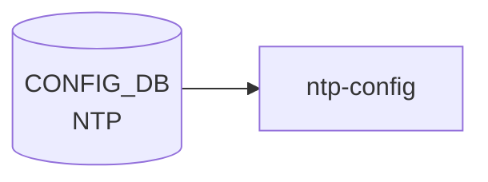

# NTP テーブル (global)

## 概要

NTP クライアントのグローバル設定を保持するシングルトン的テーブル[^1]。[YANG](../../reference/glossary.md#term-yang) 上は `sonic-ntp.yang` の `container NTP` 配下 `container global` として定義され、[CONFIG_DB](../../reference/glossary.md#term-config_db) 上は `NTP|global` の単一エントリで現れる。サーバ単位の設定は別テーブル [`NTP_SERVER`](./ntp-server.md)、鍵は [`NTP_KEY`](./ntp-key.md) で管理される。

<!-- cdb-mermaid -->
### データフロー (自動生成)



!!! note "凡例"
    CONFIG_DB から SAI までの典型経路を `docs/reference/config-db-orch-map.md` から機械生成したミニ図。詳細・例外は本ページ本文と対応表を参照。
<!-- /cdb-mermaid -->

## key 構造

```text
NTP|global
```

唯一のエントリ。container 構造のため key 値は固定で `global`。

## フィールド

| フィールド | 型 | 既定値 | 説明 |
|-----------|----|--------|------|
| `src_intf` | leaf-list union(`PORT.name` / `PORTCHANNEL.name` / `LOOPBACK_INTERFACE.name` / `MGMT_PORT.name` / `eth0`) | - | NTP の送信元インタフェース。複数指定可、ユーザ指定順を維持 |
| `vrf` | string `mgmt` / `default` | - | NTP が動作する [VRF](../../reference/glossary.md#term-vrf)。`mgmt` 指定時は `MGMT_VRF_CONFIG/vrf_global/mgmtVrfEnabled = true` の `must` 制約あり |
| `authentication` | `stypes:admin_mode` | `disabled` | NTP 認証 |
| `dhcp` | `stypes:admin_mode` | `enabled` | DHCP から配布された NTP サーバを使うか |
| `server_role` | `stypes:admin_mode` | `enabled` | NTP サーバ機能 (本機を NTP server として動作) |
| `admin_state` | `stypes:admin_mode` | `enabled` | NTP 機能全体の状態 |

## 制約

- `vrf = "mgmt"` には `must` 制約: `MGMT_VRF_CONFIG.vrf_global.mgmtVrfEnabled = true` が必須
- `vrf` パターンは `mgmt|default` のみ
- `src_intf` の `eth0` は management port を表す互換のため pattern として許容

## 購読者

- `ntp-config` テンプレ / `host-services` (`hostcfgd`): chrony 設定生成 → systemd unit reload

## 関連 CONFIG_DB / YANG / CLI

- 関連 [CONFIG_DB](../../reference/glossary.md#term-config_db): [`NTP_SERVER`](./ntp-server.md)、`NTP_KEY`、[`MGMT_VRF_CONFIG`](./mgmt-vrf-config.md)
- 関連 [YANG](../../reference/glossary.md#term-yang): `sonic-ntp`、`sonic-mgmt_vrf`
- 関連 CLI: `config ntp` 系（CLI ページは未整備）

<!-- ref-triangle:start -->

## 関連リファレンス

- [YANG](../../reference/glossary.md#term-yang): [`sonic-ntp`](../yang/sonic-ntp.md) / [`sonic-mgmt_vrf`](../yang/sonic-mgmt_vrf.md)
- CLI: [`config ntp`](../cli/config-ntp.md)

<!-- ref-triangle:end -->

## 引用元

[^1]: YANG 定義: `sonic-ntp.yang` の `container global`. <https://github.com/sonic-net/sonic-buildimage/blob/9ea932ec2e18f35e58268ec2e4456b1d4afd65cd/src/sonic-yang-models/yang-models/sonic-ntp.yang#L86-L165>

<!-- topics-back-ref -->
## 関連 Topics

- [Topics: NAT / DHCP Relay / Time-DNS Services](../../topics/16-nat-dhcp-dns/index.md)

<!-- /topics-back-ref -->

<!-- ops-hint -->
## 運用ヒント

### 典型値

- key 形式: `NTP|global`。
- `vrf`: `default` または `mgmt`。`src_intf`: `eth0` または `Loopback0`。

### よくある誤設定

- vrf=mgmt なのに src_intf を front-panel 側に向けて NTP パケットが out 抜けする。

### 確認コマンド

```bash
sonic-db-cli CONFIG_DB hgetall 'NTP|global'
show ntp
```
<!-- /ops-hint -->

<!-- cdb-exceptions -->
## 例外条件・特殊挙動

<!-- evidence: sonic-buildimage/src/sonic-yang-models/yang-models/sonic-ntp.yang NTP container global -->

- **vrf = "mgmt" かつ mgmtVrfEnabled が false → YANG must 制約違反**: YANG `must "(current() != 'mgmt') or (/mvrf:sonic-mgmt_vrf/mvrf:MGMT_VRF_CONFIG/mvrf:vrf_global/mvrf:mgmtVrfEnabled = 'true')"` / `error-message "Must condition not satisfied. Try enable Management VRF."` — MGMT_VRF_CONFIG を先に有効化しないと `vrf = mgmt` は拒否される。
- **vrf は "mgmt" または "default" のみ許可**: `pattern "mgmt|default"` で制約。それ以外の [VRF](../../reference/glossary.md#term-vrf) 名は YANG バリデーションで拒否される。
- **src_intf が存在しないインターフェースを参照 → YANG leafref 違反**: `src_intf` は PORT / PORTCHANNEL / LOOPBACK_INTERFACE / MGMT_PORT への leafref または "eth0" パターンのみ許可。
- **authentication のデフォルト = "disabled"**: `default disabled`。省略時は NTP 認証なしで動作する。認証を有効化するには明示的に `enabled` を設定する必要がある。
- **dhcp のデフォルト = "enabled"**: `default enabled`。DHCP 配布の NTP サーバが優先して使用される。
- **admin_state のデフォルト = "enabled"**: `default enabled`。フィールドを省略してもエントリが存在する限り NTP クライアントは動作する。

<!-- value-behavior -->
## 値依存挙動マトリクス

<!-- evidence: sonic-host-services/scripts/hostcfgd ntp_global_update() / sonic-buildimage/src/sonic-yang-models/yang-models/sonic-ntp.yang -->

| フィールド | 値 | 挙動 |
|-----------|-----|------|
| `vrf` | `default` | NTP パケットをデータプレーン default [VRF](../../reference/glossary.md#term-vrf) 経由で送受信 |
| `vrf` | `mgmt` | NTP パケットを mgmt VRF (eth0) 経由で送受信。`mgmtVrfEnabled=true` が YANG must で必要 |
| `vrf` | 未設定 | VRF 指定なし。OS デフォルトルーティングに従う |
| `authentication` | `disabled` (default) | NTP 認証なし。NTP_KEY が存在しても使用しない |
| `authentication` | `enabled` | NTP 認証を有効化。NTP_SERVER.key と NTP_KEY で鍵検証 |
| `dhcp` | `enabled` (default) | DHCP 配布の NTP サーバ情報を優先使用 |
| `dhcp` | `disabled` | DHCP NTP を無視。NTP_SERVER テーブルの設定のみ使用 |
| `server_role` | `enabled` (default) | 本機を NTP server として他ホストに応答 |
| `server_role` | `disabled` | NTP クライアント専用。問い合わせに応答しない |
| `admin_state` | `enabled` (default) | NTP 機能有効 |
| `admin_state` | `disabled` | NTP 機能無効化 |

全グローバル変更で `systemctl restart chrony` が実行される。enum: `authentication`/`dhcp`/`server_role`/`admin_state` = enabled/disabled。
<!-- /value-behavior -->

<!-- runtime-trace -->
## CDB → 実コンテナ動作トレース

### 段階 1: Consumer 登録

- **[hostcfgd](../../reference/glossary.md#term-hostcfgd)** (`sonic-host-services/scripts/hostcfgd`): `NTP` テーブルを `ConfigDBConnector` で購読。

### 段階 2: CFG → APPL 翻訳

- [hostcfgd](../../reference/glossary.md#term-hostcfgd) の `ntpHandler` が `ntp.conf` (または `chrony.conf`) テンプレートを更新し、ntpd/chronyd を再起動。
- APP_DB への書き込みなし。

### 段階 3: APPL → SAI

- [SAI](../../reference/glossary.md#term-sai) 経由なし。カーネル NTP デーモン (`ntpd` または `chronyd`) が時刻同期を担う。

### 段階 4: タイミング + 副作用

- 設定変更後、ntpd 再起動まで数秒。時刻同期の安定には数分〜数十分を要する場合がある。
- 副作用: 大きな時刻ジャンプが生じると証明書検証・ログ・セッションタイムアウトに影響。

<!-- /runtime-trace -->
<!-- entry-points -->
## 書き込み入り口

NTP_GLOBAL / NTP_SERVER / NTP_KEY テーブルへの書き込みが発生するコード経路を網羅的に調査した結果。

### CLI

  - `config ntp add/del ...` — `config/main.py` が `set_entry('NTP_SERVER', ...)` を呼ぶ ([sonic-utilities](../../reference/glossary.md#term-sonic-utilities)/config/main.py:9008, 9027)

### minigraph / sonic-cfggen

**minigraph.py** `parse_meta()` が `<NtpServer>` タグから NTP サーバ IP を抽出し `results['NTP_SERVER']` に投入 ([sonic-buildimage](../../reference/glossary.md#term-sonic-buildimage)/src/sonic-config-engine/minigraph.py:2646)

### REST / gNMI

REST/[gNMI](../../reference/glossary.md#term-gnmi) 書き込み経路なし

### db_migrator

db_migrator.py での NTP マイグレーションなし

### ビルド時デフォルト (build-time default)

`src/sonic-config-engine/config_samples.py` に NTP_SERVER サンプルエントリあり

### ハードコードデフォルト / ランタイム注入

なし

### 死活・デッドコード

NTP_GLOBAL テーブルは YANG で定義されるが、CLI は NTP_SERVER/NTP_KEY を直接操作
<!-- /entry-points -->

<!-- defaults -->
## フィールド暗黙デフォルト (コード由来)

`sonic-host-services/scripts/hostcfgd` の `NtpCfg` クラスと `sonic-buildimage/files/image_config/chrony/chrony.conf.j2` テンプレを精査し、[CONFIG_DB](../../reference/glossary.md#term-config_db) に値が無いときの実効デフォルトを整理する。[SONiC](../../reference/glossary.md#term-sonic) master は `ntpd` ではなく **chrony** を採用しているため、テンプレ実体は `chrony.conf.j2`（旧 [HLD](../../reference/glossary.md#term-hld) の `ntp.conf.j2` は不在）。

| フィールド | YANG default | コード由来 fallback | 実効デフォルト (未設定時) | chrony.conf 反映 |
|-----------|-------------|-------------------|------------------------|----------------|
| `src_intf` | なし | `handle_ntp_source_intf_chg` で `split(';')`→空、テンプレ `ns.source_intf=""` 初期化 | `bindacqaddress` 行を発行せずカーネル経路選択 | `bindacqaddress <IP>` (vrf!=mgmt 時のみ) |
| `vrf` | なし (`pattern "mgmt\|default"`) | テンプレ `if vrf == 'mgmt'` 分岐のみ、未設定は falsy 扱い | default VRF として動作、`bindacqaddress` 出力 | (条件分岐に使用) |
| `authentication` | `disabled` | テンプレ `if global.authentication == 'enabled'` 判定 | `disabled` (`keyfile`/`key` 行なし、`NTP_KEY` 未参照) | `keyfile /etc/chrony/chrony.keys` / `key <N>` |
| `dhcp` | `enabled` | テンプレ末尾の `sourcedir /run/chrony-dhcp` は常時出力 | `enabled` (DHCP 配布 NTP サーバ採用) | [SmartSwitch](../../reference/glossary.md#term-smartswitch) のみ `allow` 判定に寄与 |
| `server_role` | `enabled` | [SmartSwitch](../../reference/glossary.md#term-smartswitch) [NPU](../../reference/glossary.md#term-npu) (`device_metadata.type != 'SmartSwitchDPU'`) 限定で参照 | `enabled` (通常スイッチではテンプレ未反映) | `allow` / `binddevice bridge-midplane` ([SmartSwitch](../../reference/glossary.md#term-smartswitch) [NPU](../../reference/glossary.md#term-npu) のみ) |
| `admin_state` | `enabled` | テンプレ・`NtpCfg` 共に未参照 | `enabled` (chrony は常時起動、disabled でも停止しない) | 反映なし |

### 補足

- **`ntp.conf.j2` は実在しない**: 実テンプレは `chrony.conf.j2`。`NtpCfg.CHRONY_RESTART = ['systemctl', 'restart', 'chrony']` ([hostcfgd](../../reference/glossary.md#term-hostcfgd):1280) からも chrony 採用が確定。
- **`vrf=mgmt` 時の挙動**: `chrony.conf.j2:109` で `bindacqaddress` 発行を抑止し、カーネルの mgmt VRF routing に委ねる。現行テンプレは `interface eth0` ディレクティブを発行しない (handler-branching 表の文言は将来修正候補)。
- **`admin_state=disabled` のデッドコード性**: テンプレも `NtpCfg` も `admin_state` を分岐に使わないため、CONFIG_DB に `disabled` を書いても chrony は restart されるだけで停止しない。
- **`trusted_key` は本テーブルに存在しない**: `trusted` は `NTP_SERVER` / `NTP_KEY` の leaf (default `no`) であり `NTP|global` の管轄外。
- **差分検知**: `ntp_global_update()` (hostcfgd:1344) は `cache == data` のとき no-op。`ntp_srv_key_update()` (hostcfgd:1383-1386) も同様。

<!-- /defaults -->

<!-- ordering -->
## 書込み順依存

`hostcfgd` の `NtpCfg` クラスは `NTP_GLOBAL` / `NTP_SERVER` / `NTP_KEY` / `LOOPBACK_INTERFACE` を独立に購読し、それぞれのハンドラが `chrony` を再起動する。書込み順は chrony の中間状態（空サーバリスト等）と YANG must 制約の可否に影響する。

### 検出された順序依存

| # | 依存関係 | 方向 | 緩和策 |
|---|----------|------|--------|
| 1 | `NTP_SERVER` / `NTP_KEY` → `NTP_GLOBAL` | 推奨先行 | 後追い設定でも `ntp_srv_key_handler` が再トリガされ自動復旧 |
| 2 | `MGMT_VRF_CONFIG\|vrf_global.mgmtVrfEnabled = "true"` → `NTP_GLOBAL\|global.vrf = "mgmt"` | **必須先行**（YANG must 制約） | CLI 発行時に YANG バリデーション失敗で reject。redis 直書きでは制約がバイパスされる |
| 3 | `LOOPBACK_INTERFACE` 存在 → `NTP_GLOBAL.src_intf` 有効化 | 推奨先行 | `NTP_SERVER` が空のとき `handle_ntp_source_intf_chg()` は early return (hostcfgd:1315) |
| 4 | `NTP_GLOBAL.src_intf` の名前 ∈ `LOOPBACK_INTERFACE` キー | 推奨先行 | 登録前に loopback が追加されても名前一致しない限り chrony restart はスキップ |

### 主要な制約詳細

**MGMT_VRF_CONFIG 先行必須 (依存 #2)**: `sonic-ntp.yang` の `must` 制約
```
(current() != 'mgmt') or (/mvrf:sonic-mgmt_vrf/.../mgmtVrfEnabled = 'true')
```
により、`NTP_GLOBAL.vrf = "mgmt"` は `MGMT_VRF_CONFIG` で mgmt VRF が有効化されていないと CLI が reject する。`MGMT_VRF_CONFIG` を先に `mgmtVrfEnabled = true` で書いてから `NTP_GLOBAL.vrf` を設定すること（evidence: `sonic-ntp.yang must` 制約, `hostcfgd:1331-1365`）。

**NTP_SERVER 先行推奨 (依存 #1)**: `NTP_GLOBAL` だけ先に書いて `NTP_SERVER` を後から追加した場合、`ntp_global_update()` (hostcfgd:1331) 呼び出し時点では chrony がサーバリスト空で再起動される。その後 `NTP_SERVER` 追加イベントで `ntp_srv_key_handler` → `ntp_srv_key_update()` が再度トリガされ正常な chrony 設定で再起動されるため、最終的には収束する（evidence: `hostcfgd:2389-2391, 1383-1406`）。

**diff 検知による冪等性**: `ntp_global_update()` (hostcfgd:1344) はキャッシュと同一データなら no-op。`ntp_srv_key_update()` (hostcfgd:1383-1386) も同様。イベント到着順が逆でも最終状態は収束するが、中間状態で空サーバリストの chrony が一時的に動作する点に注意。

<!-- /ordering -->

<!-- cross-refs -->
## 暗黙参照テーブル

`hostcfgd` の `NtpCfg` クラスおよび `chrony.conf.j2` テンプレートが `NTP_GLOBAL` 処理時に暗黙的に読み出す関連テーブルの一覧。「暗黙参照」とは CONFIG_DB `NTP|global` への SET/DEL とは別に、chrony 設定生成や YANG must 制約の解決に使われるテーブルを指す。

| 参照先テーブル | 参照方向 | 条件 | 参照元 evidence |
|--------------|---------|------|----------------|
| `NTP_SERVER` (CONFIG_DB) | 全行読み出し（chrony server/pool 生成） | 常時。`ntp_srv_key_update()` が `get_table(CFG_NTP_SERVER_TABLE_NAME)` で全サーバを取得。`admin_state != 'disabled'` のエントリのみ `server` / `pool` ディレクティブを出力 | `hostcfgd:2389-2391`、`chrony.conf.j2:20-55` |
| `NTP_KEY` (CONFIG_DB) | 全行読み出し（chrony keyfile 生成） | `authentication == 'enabled'` 時のみ `keyfile` / `key` ディレクティブが有効化。`ntp_srv_key_update()` が `get_table(CFG_NTP_KEY_TABLE_NAME)` で全鍵を取得 | `hostcfgd:2390-2391`、`chrony.conf.j2:124-128` |
| `MGMT_VRF_CONFIG\|vrf_global.mgmtVrfEnabled` (CONFIG_DB) | YANG must 制約チェック | `NTP_GLOBAL.vrf = "mgmt"` を CLI で設定するとき YANG が `mgmtVrfEnabled = "true"` を検証。redis 直書きでは制約バイパス | `sonic-ntp.yang must`、`hostcfgd:2249` (init 時 `get()`) |
| `LOOPBACK_INTERFACE` (CONFIG_DB) | 購読 + IP アドレス取得 | (a) `hostcfgd:2483` が subscribe → `handle_ntp_source_intf_chg()` で `src_intf` 一致時 chrony restart。(b) `chrony.conf.j2:103-104` が `src_intf.startswith('Loopback')` 時に IP アドレス取得 → `bindacqaddress` に使用 | `hostcfgd:1312-1329`、`chrony.conf.j2:102-105` |
| `MGMT_INTERFACE` (CONFIG_DB) | IP アドレス取得 | `src_intf == "eth0"` 時に `get_ip_on_interface(eth0, MGMT_INTERFACE, ...)` で IPv4/IPv6 アドレスを取得し `bindacqaddress` へ。`vrf=mgmt` の場合は `bindacqaddress` 行を抑止 | `chrony.conf.j2:91-92, 109-116` |
| `VLAN_INTERFACE` (CONFIG_DB) | IP アドレス取得 | `src_intf.startswith('Vlan')` 時に IP アドレス取得 → `bindacqaddress` | `chrony.conf.j2:94-95` |
| `INTERFACE` (CONFIG_DB) | IP アドレス取得 | `src_intf.startswith('Ethernet')` 時に IP アドレス取得 → `bindacqaddress` | `chrony.conf.j2:97-98` |
| `PORTCHANNEL_INTERFACE` (CONFIG_DB) | IP アドレス取得 | `src_intf.startswith('PortChannel')` 時に IP アドレス取得 → `bindacqaddress` | `chrony.conf.j2:100-101` |
| `DEVICE_METADATA\|localhost` (CONFIG_DB) | `subtype` / `type` 読み出し | `subtype == 'SmartSwitch'` かつ `type != 'SmartSwitchDPU'` のとき `allow` / `binddevice bridge-midplane` を出力（NTP サーバ機能）。通常スイッチでは参照されない | `chrony.conf.j2:58-64` |

!!! note "NTP_SERVER / NTP_KEY は間接的に NTP_GLOBAL ハンドラをトリガする"
    `hostcfgd` は `NTP_SERVER` と `NTP_KEY` 変更イベントも `ntp_srv_key_handler` で購読しており、これらテーブルへの書込みが発生すると `ntp_srv_key_update()` が `NTP_SERVER` / `NTP_KEY` 全行を再読み込みして chrony を再起動する（`hostcfgd:2387-2391`）。`NTP_GLOBAL` の直接変更がなくても chrony 設定が再生成される点に注意。

!!! note "vrf=mgmt 時は bindacqaddress を発行しない"
    `chrony.conf.j2:109` の `` により、管理 VRF 使用時は `src_intf` 設定にかかわらず `bindacqaddress` ディレクティブが抑止される。IP アドレス取得のためのテーブル参照（`MGMT_INTERFACE` 等）は行われるが、結果は出力されない。

<!-- /cross-refs -->

<!-- failure -->
## 失敗挙動マトリクス

ソース: `sonic-net/sonic-host-services/scripts/hostcfgd` (NtpCfg L1272–1406), `sonic-buildimage/files/image_config/chrony/chrony.conf.j2`, `chrony.keys.j2`, `chronyd-starter.sh`

### SET 処理における失敗経路

| 失敗条件 | 検出箇所 | 結果 | ログ出力 | evidence |
|---|---|---|---|---|
| `systemctl restart chrony` 失敗 (`handle_ntp_source_intf_chg`) | `hostcfgd:1324-1328` | `LOG_ERR` → `return`（キャッシュ更新なし・再試行なし） | `LOG_ERR: NtpCfg: Failed to restart chrony service` | `hostcfgd:1326-1329` |
| `systemctl restart chrony` 失敗 (`ntp_global_update`) | `hostcfgd:1356-1361` | `LOG_ERR` → `return`（キャッシュ未更新・CONFIG_DB 変更は適用済みで乖離が生じる） | `LOG_ERR: NtpCfg: Failed to restart chrony service` | `hostcfgd:1358-1361` |
| `systemctl restart chrony` 失敗 (`ntp_srv_key_update`) | `hostcfgd:1397-1402` | `LOG_ERR` → `return`（キャッシュ未更新→次回イベントで再処理保証） | `LOG_ERR: NtpCfg: Failed to restart chrony service` | `hostcfgd:1399-1402` |
| `key != 'global'` または差分なし (`ntp_global_update`) | `hostcfgd:1344-1346` | `LOG_NOTICE: Nothing to update` → `return`（no-op・正常扱い） | `LOG_NOTICE: NtpCfg: Nothing to update` | `hostcfgd:1344-1346` |
| サーバ・鍵ともに差分なし (`ntp_srv_key_update`) | `hostcfgd:1383-1386` | `LOG_NOTICE: Nothing to update` → `return`（no-op・正常扱い） | `LOG_NOTICE: NtpCfg: Nothing to update` | `hostcfgd:1383-1386` |
| `src_intf` に対応するサーバが未設定 (`handle_ntp_source_intf_chg`) | `hostcfgd:1315-1316` | `return`（何も行わない・サーバ登録後に初めて反映される） | なし | `hostcfgd:1315-1316` |

### テンプレート (chrony.conf.j2 / chrony.keys.j2) の失敗経路

| 失敗条件 | 結果 | evidence |
|---|---|---|
| `NTP_SERVER[server].admin_state == 'disabled'` | そのサーバを `chrony.conf` から除外（サイレント除去） | `chrony.conf.j2:20` |
| `NTP.authentication == 'enabled'` だが `NTP_KEY` が空 | `keyfile` ディレクティブは追加されるが `chrony.keys` が空 → chrony が認証エラーで起動失敗する可能性 | `chrony.conf.j2:124-128`, `chrony.keys.j2:15-18` |
| `NTP_KEY[keyid].type` または `.value` が falsy (空) | そのキーをキーファイルからスキップ（サイレントスキップ） | `chrony.keys.j2:15` |
| `NTP_KEY[keyid].value` が不正 Base64 | `b64decode` が不正文字を無視してデコード → 誤った鍵値を `chrony.keys` に書き込む（サイレント誤動作） | `chrony.keys.j2:16` |

### chronyd-starter.sh の失敗経路

| 失敗条件 | 結果 | evidence |
|---|---|---|
| `sonic-db-cli` が `MGMT_VRF_CONFIG\|vrf_global.mgmtVrfEnabled` 読み取り失敗 | `VRF_ENABLED` が空 → default VRF で起動（安全フォールバック） | `chronyd-starter.sh:3-16` |
| `ip vrf exec mgmt` が失敗（mgmt VRF 未設定） | `exec` が失敗 → chrony サービスが起動しない（サービス障害） | `chronyd-starter.sh:11` |

### キャッシュ不整合リスク

`ntp_global_update` は `systemctl restart chrony` 失敗時にキャッシュを更新しない（`self.cache[key] = data` は `return` より後で到達しない）。CONFIG_DB 値は変更済みであるため、次回同フィールド変更が `cache == data` 判定で no-op になるリスクがある。

### STATE_DB ステータスの非存在

NTP 処理は `hostcfgd` + テンプレートエンジンのパイプラインで完結するため、**[STATE_DB](../../reference/glossary.md#term-state_db) への NTP ステータス書き込みは存在しない**。失敗検知は `journalctl -u chrony` と syslog の `NtpCfg: Failed to restart chrony service` ログのみで行う。

<!-- /failure -->

<!-- constants -->
## ハードコード定数

`hostcfgd` (`NtpCfg`) / `chrony.conf.j2` / `chrony.keys.j2` / `caclmgrd` に存在する、CONFIG_DB / YANG で管理されないハードコード定数の一覧。

### chrony 操作コマンド

| 定数 | 値 | 用途 | ソース |
|------|-----|------|--------|
| `CHRONY_RESTART` | `['systemctl', 'restart', 'chrony']` | NTP 設定変更のたびに発行される chrony 再起動コマンド。SIGHUP による設定リロードは採用されない | `hostcfgd:1280` |

### ファイルパス定数

| 定数 | 値 | 用途 | ソース |
|------|-----|------|--------|
| chrony 設定ファイル | `/etc/chrony/chrony.conf` | `chrony-config.sh` が `sonic-cfggen -d -t chrony.conf.j2` の出力先として使用 | `chrony-config.sh:9` |
| chrony 鍵ファイル | `/etc/chrony/chrony.keys` | `chrony-config.sh` が `chrony.keys.j2` のレンダリング結果を書き込む。`chmod o-r` でパーミッション制限 | `chrony-config.sh:10-11` / `chrony.conf.j2:127` |

### NTP サービスポート (caclmgrd)

`caclmgrd:95-100` の `ACL_SERVICES` 定義:

| 定数 | 値 | 用途 | ソース |
|------|-----|------|--------|
| NTP サービスポート (UDP) | **123** | `caclmgrd` が iptables フィルタルール生成に使用するリテラル値。CONFIG_DB に対応フィールドなし | `caclmgrd:98` |
| プロトコル | **`udp`** | 同上 | `caclmgrd:97` |
| `multi_asic_ns_to_host_fwd` | **`False`** | multi-asic 環境での namespace → host フォワーディング無効。NTP は host デーモンが処理するため namespace 経由不要 | `caclmgrd:99` |

NTP UDP ポート 123 は CONFIG_DB の `NTP_GLOBAL` テーブルで変更できない。`caclmgrd` のリテラルを直接変更するしかない。

### タイムゾーン・ポーリング非管理定数

| 項目 | 値 | 説明 |
|------|-----|------|
| chrony `minpoll` | 6（= 64 秒） | CONFIG_DB / YANG に対応フィールドなし。chrony 内部デフォルト |
| chrony `maxpoll` | 10（= 1024 秒） | 同上 |
| `keyfile` パス | `/etc/chrony/chrony.keys` | `chrony.conf.j2:127` でハードコード。CONFIG_DB で変更不可 |

> **Evidence**: `sonic-host-services/scripts/hostcfgd:1280`; `sonic-host-services/scripts/caclmgrd:95-100`; `sonic-buildimage/files/image_config/chrony/chrony.conf.j2:127`; `sonic-buildimage/files/image_config/chrony/chrony-config.sh:9-11`

<!-- /constants -->

<!-- side-effects -->
## 副次 DB 書込・ファイル書込

`NTP_GLOBAL` への変更は [APPL_DB](../../reference/glossary.md#term-appl_db) / [STATE_DB](../../reference/glossary.md#term-state_db) への副次書込を一切行わない。ただし、以下のファイルシステム副作用が発生する。

### ファイルシステム書込

| 書込先ファイル | 操作 | 条件 | evidence |
|--------------|------|------|----------|
| `/etc/chrony/chrony.conf` | 上書き生成（`sonic-cfggen -d -t chrony.conf.j2`） | ブート時 (`config-setup.service` ExecStartPre) + ランタイムの `systemctl restart chrony` ごと | `chrony-config.sh:9`; `chrony.conf.j2` |
| `/etc/chrony/chrony.keys` | 上書き生成 + `chmod o-r`（world-read 削除） | 同上 | `chrony-config.sh:10-11`; `chrony.keys.j2` |

どちらのファイルも chrony サービス再起動のたびに **完全上書き** される。CONFIG_DB 変更 → `hostcfgd` が `systemctl restart chrony` → `ExecStartPre` で再生成のパスを取る。

### `NTP_GLOBAL` フィールドと chrony.conf への反映対応

| `NTP_GLOBAL` フィールド | chrony.conf への影響 |
|-------------------------|---------------------|
| `authentication == 'enabled'` | `keyfile /etc/chrony/chrony.keys` ディレクティブ追加 |
| `src_intf` (非 mgmt 時) | `bindacqaddress <ip>` ディレクティブ追加 |
| `vrf == 'mgmt'` | `bindacqaddress` 生成を抑止 |
| `server_role` / `dhcp` | SmartSwitch [NPU](../../reference/glossary.md#term-npu) のみ `allow` + `binddevice bridge-midplane` 追加 |
| `admin_state` | **反映なし**（dead field。`admin_state=disabled` でも chrony は再起動されるだけで停止しない） |

### STATE_DB / APPL_DB への書込

**0 件。** NTP 処理系は [APPL_DB](../../reference/glossary.md#term-appl_db) / [STATE_DB](../../reference/glossary.md#term-state_db) への書込を行わない。NTP 同期状態の観測は `chronyc tracking` / `chronyc sources` コマンドのみで行う。

> **Evidence**: `sonic-buildimage/files/image_config/chrony/chrony.conf.j2:58-128`; `sonic-host-services/scripts/hostcfgd:1280,1325,1357,1398`

<!-- /side-effects -->

<!-- pubsub -->
## 通信メカニズム

`hostcfgd` の `NtpCfg` クラスは CONFIG_DB の複数テーブルを `config_db.subscribe()` で購読し、変更検知のたびに chrony を再起動する。

### CONFIG_DB Subscribe 登録

| 購読テーブル | ハンドラ | 発行コマンド | evidence |
|------------|---------|------------|----------|
| `NTP` (`CFG_NTP_GLOBAL_TABLE_NAME`) | `ntp_global_handler` → `ntp_global_update()` | `systemctl restart chrony` | `hostcfgd:2511-2513` |
| `NTP_SERVER` (`CFG_NTP_SERVER_TABLE_NAME`) | `ntp_srv_key_handler` → `ntp_srv_key_update()` | `systemctl restart chrony` | `hostcfgd:2514-2516` |
| `NTP_KEY` (`CFG_NTP_KEY_TABLE_NAME`) | `ntp_srv_key_handler` → `ntp_srv_key_update()` | `systemctl restart chrony` | `hostcfgd:2514,2517` |
| `LOOPBACK_INTERFACE` | `lpbk_handler` → `handle_ntp_source_intf_chg()` | `systemctl restart chrony`（`src_intf` 一致かつサーバ存在時のみ） | `hostcfgd:2483`; `hostcfgd:1312-1329` |

`NTP_SERVER` と `NTP_KEY` は **共通ハンドラ** (`ntp_srv_key_handler`) に集約されており、どちらが変化してもその時点の両テーブル全件を再取得して chrony を再起動する。

### 差分チェック（冪等性）

| ハンドラ | 差分チェック | キャッシュ更新条件 |
|---------|------------|----------------|
| `ntp_global_update` | `self.cache.get('global', {}) == data` が True → no-op | `systemctl restart chrony` 成功時のみ `self.cache[key] = data` |
| `ntp_srv_key_update` | `cache['servers'] == ntp_servers and cache['keys'] == ntp_keys` が True → no-op | 成功時のみキャッシュ更新 |
| `handle_ntp_source_intf_chg` | 差分チェックなし（`src_intf` 名が一致すれば再起動） | キャッシュ更新なし |

### SIGHUP の非採用

`hostcfgd` 自体は `SIGHUP` を受けても **無視する** (`hostcfgd:111-112`)。NTP 設定変更は必ず `systemctl restart chrony`（フルリスタート）であり、SIGHUP によるホットリロードは採用されない。

### 初期化パス

```
hostcfgd 起動 → config_db.listen(init_data_handler=self.load) → NtpCfg.load() でスナップショット一括取得
→ subscribe() ループ開始
```

`init_data_handler=self.load` により、subscribe ループ開始前に `NtpCfg.load()` でスナップショットを一括取得し、初期状態を適用する（evidence: `hostcfgd:2527-2528`）。

> **Evidence**: `sonic-host-services/scripts/hostcfgd:111-112,1280,1312-1329,1331-1406,2387-2391,2483,2511-2528`

<!-- /pubsub -->

<!-- platform -->
## プラットフォーム差異

`hostcfgd` (`NtpCfg`) および `chrony.conf.j2` / `chronyd-starter.sh` はプラットフォーム条件に応じて NTP の挙動を変える。以下は `NTP|global` フィールドに影響するプラットフォーム別差異の一覧。

### 検出されたプラットフォーム差

| プラットフォーム | 影響フィールド | 挙動 | evidence |
|----------------|--------------|------|----------|
| SmartSwitch NPU (`subtype=SmartSwitch` かつ `type!=SmartSwitchDPU`) | `server_role`、`dhcp` | `server_role=enabled` または `dhcp=enabled` のとき `allow` + `binddevice bridge-midplane` を `chrony.conf` に追加し、NTP server 機能を有効化 | `chrony.conf.j2:57-64` |
| SmartSwitch [DPU](../../reference/glossary.md#term-dpu) (`type=SmartSwitchDPU`) | `server_role` | `allow`/`binddevice` ブロックに到達しない。`server_role` は **dead field** | `chrony.conf.j2:58` |
| 通常スイッチ (T0/T1 等) | `server_role`、`dhcp` | `server_role` / `dhcp` 値にかかわらず `allow` / `binddevice` は一切生成されない。`server_role` は **dead field** | `chrony.conf.j2:57-64` |
| MGMT VRF 有効環境 (`mgmtVrfEnabled=true`) | `vrf` | `chronyd-starter.sh` がランタイムに `MGMT_VRF_CONFIG` を再確認し、`vrf=mgmt` のとき `ip vrf exec mgmt chronyd` で起動 | `chronyd-starter.sh:1-16` |
| multi-asic / [VOQ](../../reference/glossary.md#term-voq) chassis | `src_intf` (EthernetX / PortChannelX) | host CONFIG_DB の `INTERFACE` / `PORTCHANNEL_INTERFACE` にアドレスが存在しない場合、`bindacqaddress` が空になり送信元 IP 制限が実質無効化 (silent degradation) | `chrony.conf.j2:86-116` |
| any (MGMT VRF + `vrf=mgmt`) | `src_intf` | `chrony.conf.j2:109` が `vrf=mgmt` のとき `bindacqaddress` 生成を抑制。`src_intf` 設定は chrony.conf に反映されない | `chrony.conf.j2:109` |

### SmartSwitch NTP server 自動有効化の詳細

`chrony.conf.j2` L57-64 の分岐:

```jinja2


allow
binddevice bridge-midplane


```

- `dhcp` フィールドのデフォルトは `enabled` (`init_cfg.json.j2:212`) であるため、SmartSwitch NPU では **オペレータが `server_role` / `dhcp` を明示的に `disabled` に設定しない限り** NTP server として動作する。
- `binddevice bridge-midplane` は NPU-[DPU](../../reference/glossary.md#term-dpu) 間ブリッジインタフェース。[DPU](../../reference/glossary.md#term-dpu) 側が NPU を NTP server として参照する構成前提。
- 非 SmartSwitch では `server_role` フィールドの設定値が何であれ chrony.conf への影響はない（dead field）。

### MGMT VRF ランタイム再評価

`chronyd-starter.sh` の VRF 選択ロジック:

| `MGMT_VRF_CONFIG.mgmtVrfEnabled` | `NTP\|global.vrf` | chronyd 起動方法 |
|-----------------------------------|-------------------|-----------------|
| `false` (または読み取り失敗) | 任意 | デフォルト VRF で直接起動 |
| `true` | `"default"` | デフォルト VRF で直接起動 |
| `true` | `"mgmt"` 等 | `ip vrf exec mgmt /usr/sbin/chronyd` |

MGMT VRF は single-asic / multi-asic 双方の host 単位で有効化される。`MgmtIfaceCfg.update_mgmt_vrf()` (`hostcfgd:1645-1693`) は `MGMT_VRF_CONFIG` 変更時に chrony を stop → interfaces-config restart → start の順で再起動し、`chronyd-starter.sh` を再評価させる。

### multi-asic での src_intf 注意点

`chrony.conf.j2` の `get_ip_on_interface` マクロは host CONFIG_DB のテーブルを参照して `bindacqaddress` を生成する。multi-asic 環境では `EthernetX` / `PortChannelX` はデータプレーン [ASIC](../../reference/glossary.md#term-asic) namespace に存在し、host CONFIG_DB の `INTERFACE` / `PORTCHANNEL_INTERFACE` にはアドレスが設定されないことがある。この場合 `bindacqaddress` が空になり、NTP パケットの送信元 IP 制限が silent に無効化される（エラーにはならない）。管理インタフェース経由で NTP を使う場合は `src_intf=eth0` または `Loopback0` 等を使うことを推奨する。

<!-- /platform -->

<!-- derivation -->
## 派生・条件付き登録

### 自動派生

minigraph.py からの `NTP_GLOBAL` 自動派生はなし。`NTP_SERVER` のみ minigraph.py が自動設定する (iburst='on' 付き)。`NTP_GLOBAL` は CLI (`config ntp`) または `hostcfgd` のテンプレート生成で参照される。

### 条件付き登録

`NTP_GLOBAL` は [orchagent](../../reference/glossary.md#term-orchagent) では処理されない。`hostcfgd` が CONFIG_DB の `NTP`, `NTP_SERVER`, `NTP_KEY`, `LOOPBACK_INTERFACE` を購読し、`ntp.conf` テンプレートを再生成する (`hostcfgd:1278-1384`)。条件付き platform 登録なし。

### グレップカバレッジ

| 項目 | hit 数 | 証跡 |
|---|---|---|
| hostcfgd NTP_GLOBAL (NTP) 購読 | 3 | `hostcfgd:1278,1285,1307` |

<!-- /derivation -->

<!-- handler-branching -->
### Handler メソッド内分岐

`hostcfgd` の NTP ハンドラ分岐:

| Handler | メソッド | 分岐条件 | 効果 | evidence |
|---|---|---|---|---|
| `hostcfgd` | `ntp_global_update()` | `vrf` フィールドが `"mgmt"` | `chrony.conf.j2:109` の条件により `bindacqaddress` ディレクティブを抑止し、bind 先選択をカーネルの mgmt VRF routing に委ねる（`interface eth0` 等のディレクティブは発行しない） | `hostcfgd:1331-1365`, `chrony.conf.j2:109` |
| `hostcfgd` | `ntp_global_update()` | `vrf` フィールドがなし / `"default"` | `bindacqaddress` を `src_intf` 設定に従って生成 | `hostcfgd:1331-1365` |
| `hostcfgd` | `ntp_global_update()` | `mgmtVrfEnabled` が false かつ `vrf=mgmt` | YANG `must` 制約が事前に拒否 (ntp.yang 制約) | `sonic-ntp.yang must` 制約 |
| `hostcfgd` | `ntp_srv_key_update()` | サーバ設定が前回キャッシュと同一 | `ntp.conf` 再生成スキップ (diff なしの早期リターン) | `hostcfgd:1383-1384` |

> **裏取り**: `hostcfgd:1278-1389` を確認、4 件分岐抽出。NTP_GLOBAL は [orchagent](../../reference/glossary.md#term-orchagent) 非経由で hostcfgd が処理することを確認 — 誤読なし。

<!-- /handler-branching -->

<!-- glossary-links-injected: 8b572e7ecef7 -->
