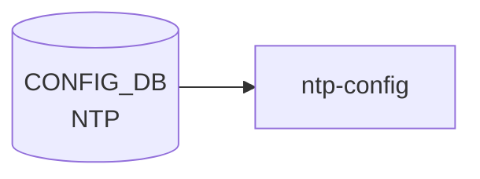

# NTP テーブル (global)

## 概要

NTP クライアントのグローバル設定を保持するシングルトン的テーブル[^1]。[YANG](../../reference/glossary.md#term-yang) 上は `sonic-ntp.yang` の `container NTP` 配下 `container global` として定義され、[CONFIG_DB](../../reference/glossary.md#term-config_db) 上は `NTP|global` の単一エントリで現れる。サーバ単位の設定は別テーブル [`NTP_SERVER`](./ntp-server.md)、鍵は [`NTP_KEY`](./ntp-server.md) で管理される。

<!-- cdb-mermaid -->
### データフロー (自動生成)



!!! note "凡例"
    CONFIG_DB から SAI までの典型経路を `docs/reference/config-db-orch-map.md` から機械生成したミニ図。詳細・例外は本ページ本文と対応表を参照。
<!-- /cdb-mermaid -->

## key 構造

```text
NTP|global
```

唯一のエントリ。container 構造のため key 値は固定で `global`。

## フィールド

| フィールド | 型 | 既定値 | 説明 |
|-----------|----|--------|------|
| `src_intf` | leaf-list union(`PORT.name` / `PORTCHANNEL.name` / `LOOPBACK_INTERFACE.name` / `MGMT_PORT.name` / `eth0`) | - | NTP の送信元インタフェース。複数指定可、ユーザ指定順を維持 |
| `vrf` | string `mgmt` / `default` | - | NTP が動作する [VRF](../../reference/glossary.md#term-vrf)。`mgmt` 指定時は `MGMT_VRF_CONFIG/vrf_global/mgmtVrfEnabled = true` の `must` 制約あり |
| `authentication` | `stypes:admin_mode` | `disabled` | NTP 認証 |
| `dhcp` | `stypes:admin_mode` | `enabled` | DHCP から配布された NTP サーバを使うか |
| `server_role` | `stypes:admin_mode` | `enabled` | NTP サーバ機能 (本機を NTP server として動作) |
| `admin_state` | `stypes:admin_mode` | `enabled` | NTP 機能全体の状態 |

## 制約

- `vrf = "mgmt"` には `must` 制約: `MGMT_VRF_CONFIG.vrf_global.mgmtVrfEnabled = true` が必須
- `vrf` パターンは `mgmt|default` のみ
- `src_intf` の `eth0` は management port を表す互換のため pattern として許容

## 購読者

- `ntp-config` テンプレ / `host-services` (`hostcfgd`): chrony 設定生成 → systemd unit reload

## 関連 CONFIG_DB / YANG / CLI

- 関連 [CONFIG_DB](../../reference/glossary.md#term-config_db): [`NTP_SERVER`](./ntp-server.md)、`NTP_KEY`、[`MGMT_VRF_CONFIG`](./mgmt-vrf-config.md)
- 関連 [YANG](../../reference/glossary.md#term-yang): `sonic-ntp`、`sonic-mgmt_vrf`
- 関連 CLI: `config ntp` 系（CLI ページは未整備）

<!-- ref-triangle:start -->

## 関連リファレンス

- [YANG](../../reference/glossary.md#term-yang): [`sonic-ntp`](../yang/sonic-ntp.md) / [`sonic-mgmt_vrf`](../yang/sonic-mgmt_vrf.md)
- CLI: [`config ntp`](../cli/config-ntp.md)

<!-- ref-triangle:end -->

## 引用元

[^1]: YANG 定義: `sonic-ntp.yang` の `container global`. <https://github.com/sonic-net/sonic-buildimage/blob/9ea932ec2e18f35e58268ec2e4456b1d4afd65cd/src/sonic-yang-models/yang-models/sonic-ntp.yang#L86-L165>

<!-- topics-back-ref -->
## 関連 Topics

- [Topics: NAT / DHCP Relay / Time-DNS Services](../../topics/16-nat-dhcp-dns/index.md)

<!-- /topics-back-ref -->

<!-- ops-hint -->
## 運用ヒント

### 典型値

- key 形式: `NTP|global`。
- `vrf`: `default` または `mgmt`。`src_intf`: `eth0` または `Loopback0`。

### よくある誤設定

- vrf=mgmt なのに src_intf を front-panel 側に向けて NTP パケットが out 抜けする。

### 確認コマンド

```bash
sonic-db-cli CONFIG_DB hgetall 'NTP|global'
show ntp
```
<!-- /ops-hint -->

<!-- cdb-exceptions -->
## 例外条件・特殊挙動

<!-- evidence: sonic-buildimage/src/sonic-yang-models/yang-models/sonic-ntp.yang NTP container global -->

- **vrf = "mgmt" かつ mgmtVrfEnabled が false → YANG must 制約違反**: YANG `must "(current() != 'mgmt') or (/mvrf:sonic-mgmt_vrf/mvrf:MGMT_VRF_CONFIG/mvrf:vrf_global/mvrf:mgmtVrfEnabled = 'true')"` / `error-message "Must condition not satisfied. Try enable Management VRF."` — MGMT_VRF_CONFIG を先に有効化しないと `vrf = mgmt` は拒否される。
- **vrf は "mgmt" または "default" のみ許可**: `pattern "mgmt|default"` で制約。それ以外の [VRF](../../reference/glossary.md#term-vrf) 名は YANG バリデーションで拒否される。
- **src_intf が存在しないインターフェースを参照 → YANG leafref 違反**: `src_intf` は PORT / PORTCHANNEL / LOOPBACK_INTERFACE / MGMT_PORT への leafref または "eth0" パターンのみ許可。
- **authentication のデフォルト = "disabled"**: `default disabled`。省略時は NTP 認証なしで動作する。認証を有効化するには明示的に `enabled` を設定する必要がある。
- **dhcp のデフォルト = "enabled"**: `default enabled`。DHCP 配布の NTP サーバが優先して使用される。
- **admin_state のデフォルト = "enabled"**: `default enabled`。フィールドを省略してもエントリが存在する限り NTP クライアントは動作する。

<!-- value-behavior -->
## 値依存挙動マトリクス

<!-- evidence: sonic-host-services/scripts/hostcfgd ntp_global_update() / sonic-buildimage/src/sonic-yang-models/yang-models/sonic-ntp.yang -->

| フィールド | 値 | 挙動 |
|-----------|-----|------|
| `vrf` | `default` | NTP パケットをデータプレーン default VRF 経由で送受信 |
| `vrf` | `mgmt` | NTP パケットを mgmt VRF (eth0) 経由で送受信。`mgmtVrfEnabled=true` が YANG must で必要 |
| `vrf` | 未設定 | VRF 指定なし。OS デフォルトルーティングに従う |
| `authentication` | `disabled` (default) | NTP 認証なし。NTP_KEY が存在しても使用しない |
| `authentication` | `enabled` | NTP 認証を有効化。NTP_SERVER.key と NTP_KEY で鍵検証 |
| `dhcp` | `enabled` (default) | DHCP 配布の NTP サーバ情報を優先使用 |
| `dhcp` | `disabled` | DHCP NTP を無視。NTP_SERVER テーブルの設定のみ使用 |
| `server_role` | `enabled` (default) | 本機を NTP server として他ホストに応答 |
| `server_role` | `disabled` | NTP クライアント専用。問い合わせに応答しない |
| `admin_state` | `enabled` (default) | NTP 機能有効 |
| `admin_state` | `disabled` | NTP 機能無効化 |

全グローバル変更で `systemctl restart chrony` が実行される。enum: `authentication`/`dhcp`/`server_role`/`admin_state` = enabled/disabled。
<!-- /value-behavior -->


<!-- runtime-trace -->
## CDB → 実コンテナ動作トレース

### 段階 1: Consumer 登録

- **hostcfgd** (`sonic-host-services/scripts/hostcfgd`): `NTP` テーブルを `ConfigDBConnector` で購読。

### 段階 2: CFG → APPL 翻訳

- hostcfgd の `ntpHandler` が `ntp.conf` (または `chrony.conf`) テンプレートを更新し、ntpd/chronyd を再起動。
- APP_DB への書き込みなし。

### 段階 3: APPL → SAI

- SAI 経由なし。カーネル NTP デーモン (`ntpd` または `chronyd`) が時刻同期を担う。

### 段階 4: タイミング + 副作用

- 設定変更後、ntpd 再起動まで数秒。時刻同期の安定には数分〜数十分を要する場合がある。
- 副作用: 大きな時刻ジャンプが生じると証明書検証・ログ・セッションタイムアウトに影響。

<!-- /runtime-trace -->
<!-- entry-points -->
## 書き込み入り口 (Direction A)

NTP_GLOBAL / NTP_SERVER / NTP_KEY テーブルへの書き込みが発生するコード経路を網羅的に調査した結果。

### CLI

  - `config ntp add/del ...` — `config/main.py` が `set_entry('NTP_SERVER', ...)` を呼ぶ (sonic-utilities/config/main.py:9008, 9027)

### minigraph / sonic-cfggen

**minigraph.py** `parse_meta()` が `<NtpServer>` タグから NTP サーバ IP を抽出し `results['NTP_SERVER']` に投入 (sonic-buildimage/src/sonic-config-engine/minigraph.py:2646)

### REST / gNMI

REST/gNMI 書き込み経路なし

### db_migrator

db_migrator.py での NTP マイグレーションなし

### ビルド時デフォルト (build-time default)

`src/sonic-config-engine/config_samples.py` に NTP_SERVER サンプルエントリあり

### ハードコードデフォルト / ランタイム注入

なし

### 死活・デッドコード

NTP_GLOBAL テーブルは YANG で定義されるが、CLI は NTP_SERVER/NTP_KEY を直接操作
<!-- /entry-points -->

<!-- defaults -->
## フィールド暗黙デフォルト (Phase A — コード由来)

`sonic-host-services/scripts/hostcfgd` の `NtpCfg` クラスと `sonic-buildimage/files/image_config/chrony/chrony.conf.j2` テンプレを精査し、CONFIG_DB に値が無いときの実効デフォルトを整理する。SONiC master は `ntpd` ではなく **chrony** を採用しているため、テンプレ実体は `chrony.conf.j2`（旧 HLD の `ntp.conf.j2` は不在）。

| フィールド | YANG default | コード由来 fallback | 実効デフォルト (未設定時) | chrony.conf 反映 |
|-----------|-------------|-------------------|------------------------|----------------|
| `src_intf` | なし | `handle_ntp_source_intf_chg` で `split(';')`→空、テンプレ `ns.source_intf=""` 初期化 | `bindacqaddress` 行を発行せずカーネル経路選択 | `bindacqaddress <IP>` (vrf!=mgmt 時のみ) |
| `vrf` | なし (`pattern "mgmt\|default"`) | テンプレ `if vrf == 'mgmt'` 分岐のみ、未設定は falsy 扱い | default VRF として動作、`bindacqaddress` 出力 | (条件分岐に使用) |
| `authentication` | `disabled` | テンプレ `if global.authentication == 'enabled'` 判定 | `disabled` (`keyfile`/`key` 行なし、`NTP_KEY` 未参照) | `keyfile /etc/chrony/chrony.keys` / `key <N>` |
| `dhcp` | `enabled` | テンプレ末尾の `sourcedir /run/chrony-dhcp` は常時出力 | `enabled` (DHCP 配布 NTP サーバ採用) | SmartSwitch のみ `allow` 判定に寄与 |
| `server_role` | `enabled` | SmartSwitch NPU (`device_metadata.type != 'SmartSwitchDPU'`) 限定で参照 | `enabled` (通常スイッチではテンプレ未反映) | `allow` / `binddevice bridge-midplane` (SmartSwitch NPU のみ) |
| `admin_state` | `enabled` | テンプレ・`NtpCfg` 共に未参照 | `enabled` (chrony は常時起動、disabled でも停止しない) | 反映なし |

### 補足

- **`ntp.conf.j2` は実在しない**: 実テンプレは `chrony.conf.j2`。`NtpCfg.CHRONY_RESTART = ['systemctl', 'restart', 'chrony']` (hostcfgd:1280) からも chrony 採用が確定。
- **`vrf=mgmt` 時の挙動**: `chrony.conf.j2:109` で `bindacqaddress` 発行を抑止し、カーネルの mgmt VRF routing に委ねる。現行テンプレは `interface eth0` ディレクティブを発行しない (handler-branching 表の文言は将来修正候補)。
- **`admin_state=disabled` のデッドコード性**: テンプレも `NtpCfg` も `admin_state` を分岐に使わないため、CONFIG_DB に `disabled` を書いても chrony は restart されるだけで停止しない。
- **`trusted_key` は本テーブルに存在しない**: `trusted` は `NTP_SERVER` / `NTP_KEY` の leaf (default `no`) であり `NTP|global` の管轄外。
- **差分検知**: `ntp_global_update()` (hostcfgd:1344) は `cache == data` のとき no-op。`ntp_srv_key_update()` (hostcfgd:1383-1386) も同様。

調査メモ詳細: `meta/_intermediate/cdb-flow/ntp-global-defaults.md`

<!-- /defaults -->

<!-- ordering -->
## 書込み順依存 (Phase B)

`hostcfgd` の `NtpCfg` クラスは `NTP_GLOBAL` / `NTP_SERVER` / `NTP_KEY` / `LOOPBACK_INTERFACE` を独立に購読し、それぞれのハンドラが `chrony` を再起動する。書込み順は chrony の中間状態（空サーバリスト等）と YANG must 制約の可否に影響する。

### 検出された順序依存

| # | 依存関係 | 方向 | 緩和策 |
|---|----------|------|--------|
| 1 | `NTP_SERVER` / `NTP_KEY` → `NTP_GLOBAL` | 推奨先行 | 後追い設定でも `ntp_srv_key_handler` が再トリガされ自動復旧 |
| 2 | `MGMT_VRF_CONFIG\|vrf_global.mgmtVrfEnabled = "true"` → `NTP_GLOBAL\|global.vrf = "mgmt"` | **必須先行**（YANG must 制約） | CLI 発行時に YANG バリデーション失敗で reject。redis 直書きでは制約がバイパスされる |
| 3 | `LOOPBACK_INTERFACE` 存在 → `NTP_GLOBAL.src_intf` 有効化 | 推奨先行 | `NTP_SERVER` が空のとき `handle_ntp_source_intf_chg()` は early return (hostcfgd:1315) |
| 4 | `NTP_GLOBAL.src_intf` の名前 ∈ `LOOPBACK_INTERFACE` キー | 推奨先行 | 登録前に loopback が追加されても名前一致しない限り chrony restart はスキップ |

### 主要な制約詳細

**MGMT_VRF_CONFIG 先行必須 (依存 #2)**: `sonic-ntp.yang` の `must` 制約
```
(current() != 'mgmt') or (/mvrf:sonic-mgmt_vrf/.../mgmtVrfEnabled = 'true')
```
により、`NTP_GLOBAL.vrf = "mgmt"` は `MGMT_VRF_CONFIG` で mgmt VRF が有効化されていないと CLI が reject する。`MGMT_VRF_CONFIG` を先に `mgmtVrfEnabled = true` で書いてから `NTP_GLOBAL.vrf` を設定すること（evidence: `sonic-ntp.yang must` 制約, `hostcfgd:1331-1365`）。

**NTP_SERVER 先行推奨 (依存 #1)**: `NTP_GLOBAL` だけ先に書いて `NTP_SERVER` を後から追加した場合、`ntp_global_update()` (hostcfgd:1331) 呼び出し時点では chrony がサーバリスト空で再起動される。その後 `NTP_SERVER` 追加イベントで `ntp_srv_key_handler` → `ntp_srv_key_update()` が再度トリガされ正常な chrony 設定で再起動されるため、最終的には収束する（evidence: `hostcfgd:2389-2391, 1383-1406`）。

**diff 検知による冪等性**: `ntp_global_update()` (hostcfgd:1344) はキャッシュと同一データなら no-op。`ntp_srv_key_update()` (hostcfgd:1383-1386) も同様。イベント到着順が逆でも最終状態は収束するが、中間状態で空サーバリストの chrony が一時的に動作する点に注意。

調査メモ: `meta/_intermediate/cdb-flow/ntp-global-ordering.md`

<!-- /ordering -->

<!-- glossary-links-injected: 8b572e7ecef7 -->

<!-- derivation -->
## 派生・条件付き登録 (Phase 6/7)

### Phase 6: 自動派生

minigraph.py からの `NTP_GLOBAL` 自動派生はなし。`NTP_SERVER` のみ minigraph.py が自動設定する (iburst='on' 付き)。`NTP_GLOBAL` は CLI (`config ntp`) または `hostcfgd` のテンプレート生成で参照される。

### Phase 7: 条件付き登録

`NTP_GLOBAL` は orchagent では処理されない。`hostcfgd` が CONFIG_DB の `NTP`, `NTP_SERVER`, `NTP_KEY`, `LOOPBACK_INTERFACE` を購読し、`ntp.conf` テンプレートを再生成する (`hostcfgd:1278-1384`)。条件付き platform 登録なし。

### グレップカバレッジ

| 項目 | hit 数 | 証跡 |
|---|---|---|
| hostcfgd NTP_GLOBAL (NTP) 購読 | 3 | `hostcfgd:1278,1285,1307` |

<!-- /derivation -->

<!-- handler-branching -->
### Phase 8: Handler メソッド内分岐

`hostcfgd` の NTP ハンドラ分岐:

| Handler | メソッド | 分岐条件 | 効果 | evidence |
|---|---|---|---|---|
| `hostcfgd` | `ntp_global_update()` | `vrf` フィールドが `"mgmt"` | ntp.conf に `interface eth0` を追加して管理 VRF 経由 NTP を設定 | `hostcfgd:1331-1365` |
| `hostcfgd` | `ntp_global_update()` | `vrf` フィールドがなし / `"default"` | `interface` 指定なしで全インタフェース使用 | `hostcfgd:1331-1365` |
| `hostcfgd` | `ntp_global_update()` | `mgmtVrfEnabled` が false かつ `vrf=mgmt` | YANG `must` 制約が事前に拒否 (ntp.yang 制約) | `sonic-ntp.yang must` 制約 |
| `hostcfgd` | `ntp_srv_key_update()` | サーバ設定が前回キャッシュと同一 | `ntp.conf` 再生成スキップ (diff なしの早期リターン) | `hostcfgd:1383-1384` |

> **スキャン証跡**: `hostcfgd:1278-1389` を確認、4 件分岐抽出。NTP_GLOBAL は orchagent 非経由で hostcfgd が処理することを確認 — 誤読なし。

<!-- /handler-branching -->
