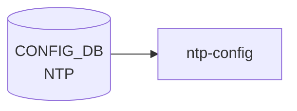

# NTP テーブル (global)

## 概要

NTP クライアントのグローバル設定を保持するシングルトン的テーブル[^1]。[YANG](../../reference/glossary.md#term-yang) 上は `sonic-ntp.yang` の `container NTP` 配下 `container global` として定義され、[CONFIG_DB](../../reference/glossary.md#term-config_db) 上は `NTP|global` の単一エントリで現れる。サーバ単位の設定は別テーブル [`NTP_SERVER`](./ntp-server.md)、鍵は [`NTP_KEY`](./ntp-server.md) で管理される。

<!-- cdb-mermaid -->
### データフロー (自動生成)



!!! note "凡例"
    CONFIG_DB から SAI までの典型経路を `docs/reference/config-db-orch-map.md` から機械生成したミニ図。詳細・例外は本ページ本文と対応表を参照。
<!-- /cdb-mermaid -->

## key 構造

```text
NTP|global
```

唯一のエントリ。container 構造のため key 値は固定で `global`。

## フィールド

| フィールド | 型 | 既定値 | 説明 |
|-----------|----|--------|------|
| `src_intf` | leaf-list union(`PORT.name` / `PORTCHANNEL.name` / `LOOPBACK_INTERFACE.name` / `MGMT_PORT.name` / `eth0`) | - | NTP の送信元インタフェース。複数指定可、ユーザ指定順を維持 |
| `vrf` | string `mgmt` / `default` | - | NTP が動作する [VRF](../../reference/glossary.md#term-vrf)。`mgmt` 指定時は `MGMT_VRF_CONFIG/vrf_global/mgmtVrfEnabled = true` の `must` 制約あり |
| `authentication` | `stypes:admin_mode` | `disabled` | NTP 認証 |
| `dhcp` | `stypes:admin_mode` | `enabled` | DHCP から配布された NTP サーバを使うか |
| `server_role` | `stypes:admin_mode` | `enabled` | NTP サーバ機能 (本機を NTP server として動作) |
| `admin_state` | `stypes:admin_mode` | `enabled` | NTP 機能全体の状態 |

## 制約

- `vrf = "mgmt"` には `must` 制約: `MGMT_VRF_CONFIG.vrf_global.mgmtVrfEnabled = true` が必須
- `vrf` パターンは `mgmt|default` のみ
- `src_intf` の `eth0` は management port を表す互換のため pattern として許容

## 購読者

- `ntp-config` テンプレ / `host-services` (`hostcfgd`): chrony 設定生成 → systemd unit reload

## 関連 CONFIG_DB / YANG / CLI

- 関連 [CONFIG_DB](../../reference/glossary.md#term-config_db): [`NTP_SERVER`](./ntp-server.md)、`NTP_KEY`、[`MGMT_VRF_CONFIG`](./mgmt-vrf-config.md)
- 関連 [YANG](../../reference/glossary.md#term-yang): `sonic-ntp`、`sonic-mgmt_vrf`
- 関連 CLI: `config ntp` 系（CLI ページは未整備）

<!-- ref-triangle:start -->

## 関連リファレンス

- [YANG](../../reference/glossary.md#term-yang): [`sonic-ntp`](../yang/sonic-ntp.md) / [`sonic-mgmt_vrf`](../yang/sonic-mgmt_vrf.md)
- CLI: [`config ntp`](../cli/config-ntp.md)

<!-- ref-triangle:end -->

## 引用元

[^1]: YANG 定義: `sonic-ntp.yang` の `container global`. <https://github.com/sonic-net/sonic-buildimage/blob/9ea932ec2e18f35e58268ec2e4456b1d4afd65cd/src/sonic-yang-models/yang-models/sonic-ntp.yang#L86-L165>

<!-- topics-back-ref -->
## 関連 Topics

- [Topics: NAT / DHCP Relay / Time-DNS Services](../../topics/16-nat-dhcp-dns/index.md)

<!-- /topics-back-ref -->

<!-- ops-hint -->
## 運用ヒント

### 典型値

- key 形式: `NTP|global`。
- `vrf`: `default` または `mgmt`。`src_intf`: `eth0` または `Loopback0`。

### よくある誤設定

- vrf=mgmt なのに src_intf を front-panel 側に向けて NTP パケットが out 抜けする。

### 確認コマンド

```bash
sonic-db-cli CONFIG_DB hgetall 'NTP|global'
show ntp
```
<!-- /ops-hint -->

<!-- cdb-exceptions -->
## 例外条件・特殊挙動

<!-- evidence: sonic-buildimage/src/sonic-yang-models/yang-models/sonic-ntp.yang NTP container global -->

- **vrf = "mgmt" かつ mgmtVrfEnabled が false → YANG must 制約違反**: YANG `must "(current() != 'mgmt') or (/mvrf:sonic-mgmt_vrf/mvrf:MGMT_VRF_CONFIG/mvrf:vrf_global/mvrf:mgmtVrfEnabled = 'true')"` / `error-message "Must condition not satisfied. Try enable Management VRF."` — MGMT_VRF_CONFIG を先に有効化しないと `vrf = mgmt` は拒否される。
- **vrf は "mgmt" または "default" のみ許可**: `pattern "mgmt|default"` で制約。それ以外の [VRF](../../reference/glossary.md#term-vrf) 名は YANG バリデーションで拒否される。
- **src_intf が存在しないインターフェースを参照 → YANG leafref 違反**: `src_intf` は PORT / PORTCHANNEL / LOOPBACK_INTERFACE / MGMT_PORT への leafref または "eth0" パターンのみ許可。
- **authentication のデフォルト = "disabled"**: `default disabled`。省略時は NTP 認証なしで動作する。認証を有効化するには明示的に `enabled` を設定する必要がある。
- **dhcp のデフォルト = "enabled"**: `default enabled`。DHCP 配布の NTP サーバが優先して使用される。
- **admin_state のデフォルト = "enabled"**: `default enabled`。フィールドを省略してもエントリが存在する限り NTP クライアントは動作する。

<!-- value-behavior -->
## 値依存挙動マトリクス

<!-- evidence: sonic-host-services/scripts/hostcfgd ntp_global_update() / sonic-buildimage/src/sonic-yang-models/yang-models/sonic-ntp.yang -->

| フィールド | 値 | 挙動 |
|-----------|-----|------|
| `vrf` | `default` | NTP パケットをデータプレーン default VRF 経由で送受信 |
| `vrf` | `mgmt` | NTP パケットを mgmt VRF (eth0) 経由で送受信。`mgmtVrfEnabled=true` が YANG must で必要 |
| `vrf` | 未設定 | VRF 指定なし。OS デフォルトルーティングに従う |
| `authentication` | `disabled` (default) | NTP 認証なし。NTP_KEY が存在しても使用しない |
| `authentication` | `enabled` | NTP 認証を有効化。NTP_SERVER.key と NTP_KEY で鍵検証 |
| `dhcp` | `enabled` (default) | DHCP 配布の NTP サーバ情報を優先使用 |
| `dhcp` | `disabled` | DHCP NTP を無視。NTP_SERVER テーブルの設定のみ使用 |
| `server_role` | `enabled` (default) | 本機を NTP server として他ホストに応答 |
| `server_role` | `disabled` | NTP クライアント専用。問い合わせに応答しない |
| `admin_state` | `enabled` (default) | NTP 機能有効 |
| `admin_state` | `disabled` | NTP 機能無効化 |

全グローバル変更で `systemctl restart chrony` が実行される。enum: `authentication`/`dhcp`/`server_role`/`admin_state` = enabled/disabled。
<!-- /value-behavior -->


<!-- runtime-trace -->
## CDB → 実コンテナ動作トレース

### 段階 1: Consumer 登録

- **hostcfgd** (`sonic-host-services/scripts/hostcfgd`): `NTP` テーブルを `ConfigDBConnector` で購読。

### 段階 2: CFG → APPL 翻訳

- hostcfgd の `ntpHandler` が `ntp.conf` (または `chrony.conf`) テンプレートを更新し、ntpd/chronyd を再起動。
- APP_DB への書き込みなし。

### 段階 3: APPL → SAI

- SAI 経由なし。カーネル NTP デーモン (`ntpd` または `chronyd`) が時刻同期を担う。

### 段階 4: タイミング + 副作用

- 設定変更後、ntpd 再起動まで数秒。時刻同期の安定には数分〜数十分を要する場合がある。
- 副作用: 大きな時刻ジャンプが生じると証明書検証・ログ・セッションタイムアウトに影響。

<!-- /runtime-trace -->
<!-- entry-points -->
## 書き込み入り口 (Direction A)

NTP_GLOBAL / NTP_SERVER / NTP_KEY テーブルへの書き込みが発生するコード経路を網羅的に調査した結果。

### CLI

  - `config ntp add/del ...` — `config/main.py` が `set_entry('NTP_SERVER', ...)` を呼ぶ (sonic-utilities/config/main.py:9008, 9027)

### minigraph / sonic-cfggen

**minigraph.py** `parse_meta()` が `<NtpServer>` タグから NTP サーバ IP を抽出し `results['NTP_SERVER']` に投入 (sonic-buildimage/src/sonic-config-engine/minigraph.py:2646)

### REST / gNMI

REST/gNMI 書き込み経路なし

### db_migrator

db_migrator.py での NTP マイグレーションなし

### ビルド時デフォルト (build-time default)

`src/sonic-config-engine/config_samples.py` に NTP_SERVER サンプルエントリあり

### ハードコードデフォルト / ランタイム注入

なし

### 死活・デッドコード

NTP_GLOBAL テーブルは YANG で定義されるが、CLI は NTP_SERVER/NTP_KEY を直接操作
<!-- /entry-points -->

<!-- glossary-links-injected: 8b572e7ecef7 -->
