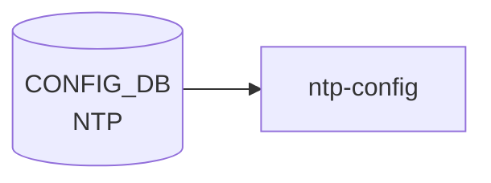

# NTP テーブル (global)

## 概要

NTP クライアントのグローバル設定を保持するシングルトン的テーブル[^1]。[YANG](../../reference/glossary.md#term-yang) 上は `sonic-ntp.yang` の `container NTP` 配下 `container global` として定義され、[CONFIG_DB](../../reference/glossary.md#term-config_db) 上は `NTP|global` の単一エントリで現れる。サーバ単位の設定は別テーブル [`NTP_SERVER`](./ntp-server.md)、鍵は [`NTP_KEY`](./ntp-server.md) で管理される。

<!-- cdb-mermaid -->
### データフロー (自動生成)



!!! note "凡例"
    CONFIG_DB から SAI までの典型経路を `docs/reference/config-db-orch-map.md` から機械生成したミニ図。詳細・例外は本ページ本文と対応表を参照。
<!-- /cdb-mermaid -->

## key 構造

```
NTP|global
```

唯一のエントリ。container 構造のため key 値は固定で `global`。

## フィールド

| フィールド | 型 | 既定値 | 説明 |
|-----------|----|--------|------|
| `src_intf` | leaf-list union(`PORT.name` / `PORTCHANNEL.name` / `LOOPBACK_INTERFACE.name` / `MGMT_PORT.name` / `eth0`) | - | NTP の送信元インタフェース。複数指定可、ユーザ指定順を維持 |
| `vrf` | string `mgmt` / `default` | - | NTP が動作する [VRF](../../reference/glossary.md#term-vrf)。`mgmt` 指定時は `MGMT_VRF_CONFIG/vrf_global/mgmtVrfEnabled = true` の `must` 制約あり |
| `authentication` | `stypes:admin_mode` | `disabled` | NTP 認証 |
| `dhcp` | `stypes:admin_mode` | `enabled` | DHCP から配布された NTP サーバを使うか |
| `server_role` | `stypes:admin_mode` | `enabled` | NTP サーバ機能 (本機を NTP server として動作) |
| `admin_state` | `stypes:admin_mode` | `enabled` | NTP 機能全体の状態 |

## 制約

- `vrf = "mgmt"` には `must` 制約: `MGMT_VRF_CONFIG.vrf_global.mgmtVrfEnabled = true` が必須
- `vrf` パターンは `mgmt|default` のみ
- `src_intf` の `eth0` は management port を表す互換のため pattern として許容

## 購読者

- `ntp-config` テンプレ / `host-services` (`hostcfgd`): chrony 設定生成 → systemd unit reload

## 関連 CONFIG_DB / YANG / CLI

- 関連 CONFIG_DB: [`NTP_SERVER`](./ntp-server.md)、`NTP_KEY`、[`MGMT_VRF_CONFIG`](./mgmt-vrf-config.md)
- 関連 YANG: `sonic-ntp`、`sonic-mgmt_vrf`
- 関連 CLI: `config ntp` 系（CLI ページは未整備）

<!-- ref-triangle:start -->

## 関連リファレンス

- YANG: [`sonic-ntp`](../yang/sonic-ntp.md) / [`sonic-mgmt_vrf`](../yang/sonic-mgmt_vrf.md)
- CLI: [`config ntp`](../cli/config-ntp.md)

<!-- ref-triangle:end -->

## 引用元

[^1]: YANG 定義: `sonic-ntp.yang` の `container global`. <https://github.com/sonic-net/sonic-buildimage/blob/9ea932ec2e18f35e58268ec2e4456b1d4afd65cd/src/sonic-yang-models/yang-models/sonic-ntp.yang#L86-L165>

<!-- topics-back-ref -->
## 関連 Topics

- [Topics: NAT / DHCP Relay / Time-DNS Services](../../topics/16-nat-dhcp-dns/index.md)

<!-- /topics-back-ref -->

<!-- ops-hint -->
## 運用ヒント

### 典型値

- key 形式: `NTP|global`。
- `vrf`: `default` または `mgmt`。`src_intf`: `eth0` または `Loopback0`。

### よくある誤設定

- vrf=mgmt なのに src_intf を front-panel 側に向けて NTP パケットが out 抜けする。

### 確認コマンド

```bash
sonic-db-cli CONFIG_DB hgetall 'NTP|global'
show ntp
```
<!-- /ops-hint -->

<!-- glossary-links-injected: a6c6612be307 -->
