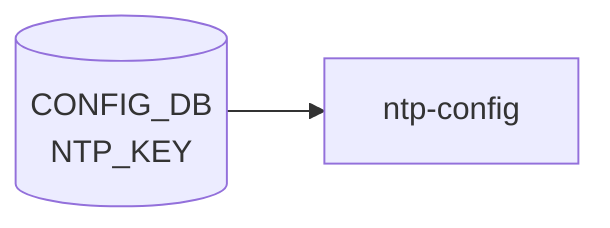

# NTP_KEY テーブル

## 概要

NTP 認証 (symmetric key) で使用する鍵を [CONFIG_DB](../../reference/glossary.md#term-config_db) に蓄積するテーブル[^1]。`ntp-config.service` (`/usr/share/sonic/templates/ntp.keys.j2` テンプレ展開) が [CONFIG_DB](../../reference/glossary.md#term-config_db) を読み出し、chrony / ntpd の keyfile (`/etc/chrony/chrony.keys` 等) を生成する。`NTP_SERVER_LIST.key` から leafref で参照される。

<!-- cdb-mermaid -->
### データフロー (自動生成)



!!! note "凡例"
    CONFIG_DB から SAI までの典型経路を `docs/reference/config-db-orch-map.md` から機械生成したミニ図。詳細・例外は本ページ本文と対応表を参照。
<!-- /cdb-mermaid -->

## key 構造

```text
NTP_KEY|<id>
```

`<id>` は 1..65535 の鍵 ID (`key-id` typedef = uint16)。

## フィールド

| フィールド | 型 | デフォルト | 説明 |
|-----------|----|-----------|------|
| `id` | uint16 (1..65535) | - | 鍵 ID (key) |
| `type` | enum `md5`/`sha1`/`sha256`/`sha384`/`sha512` | `md5` | 鍵の暗号アルゴリズム (`key-type` typedef) |
| `value` | string (1..64 chars) | なし | 暗号化済み認証キー本体 |
| `trusted` | `yes`/`no` (`stypes:yes-no`) | `no` | この鍵を信頼マーク (trustedkey 指定) するか |

## 制約

- container 名は `NTP_KEY`、list 名は `NTP_KEY_LIST` (revision 2025-07-21 で `NTP_KEY_LIST` に修正された)[^1]
- `NTP_SERVER_LIST.key` が `/ntp:sonic-ntp/ntp:NTP_KEY/ntp:NTP_KEY_LIST/ntp:id` を leafref 参照する
- `NTP.global.authentication = enabled` のときに鍵が実際に検証で使われる

## 購読者

- `ntp-config.service` (host): [CONFIG_DB](../../reference/glossary.md#term-config_db) → `/etc/chrony/chrony.keys` (または `ntp.keys`)
- chrony / ntpd: keyfile から鍵を読み込み

## 関連 CONFIG_DB / YANG / CLI

- 関連 CONFIG_DB: [`NTP`](ntp-global.md), [`NTP_SERVER`](ntp-server.md)
- 関連 CLI: `config ntp add key <id> --type ... --value ...` / `config ntp authentication enable`
- 関連 [YANG](../../reference/glossary.md#term-yang): `sonic-ntp`

<!-- ref-triangle:start -->

## 関連リファレンス

- [YANG](../../reference/glossary.md#term-yang): [`sonic-ntp`](../yang/sonic-ntp.md)
- CLI: [`config ntp`](../cli/config-ntp.md)

<!-- ref-triangle:end -->

## 引用元

[^1]: `src/sonic-yang-models/yang-models/sonic-ntp.yang` (container `NTP_KEY` / list `NTP_KEY_LIST`、typedef `key-id`/`key-type`、revision 2025-07-21 で list 名を修正). <https://github.com/sonic-net/sonic-buildimage/blob/9ea932ec2e18f35e58268ec2e4456b1d4afd65cd/src/sonic-yang-models/yang-models/sonic-ntp.yang>

## 関連ページ
- [CONFIG_DB: NTP](ntp-global.md)
- [CONFIG_DB: NTP_SERVER](ntp-server.md)

<!-- ops-hint -->
## 運用ヒント

### 典型値

- key 形式: `NTP_KEY|<keyid>`。
- `type`: `SHA1` / `MD5`、`value`: 共有鍵、`trusted`: `true`。

### よくある誤設定

- trusted=false のキーで authenticate しようとして時刻同期が失敗する。

### 確認コマンド

```bash
sonic-db-cli CONFIG_DB keys 'NTP_KEY|*'
show ntp
```
<!-- /ops-hint -->

<!-- glossary-links-injected: 4b3b3fd0739b -->
