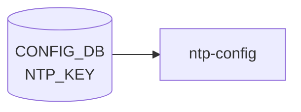

# NTP_KEY テーブル

## 概要

NTP 認証 (symmetric key) で使用する鍵を [CONFIG_DB](../../reference/glossary.md#term-config_db) に蓄積するテーブル[^1]。`ntp-config.service` (`/usr/share/sonic/templates/ntp.keys.j2` テンプレ展開) が [CONFIG_DB](../../reference/glossary.md#term-config_db) を読み出し、chrony / ntpd の keyfile (`/etc/chrony/chrony.keys` 等) を生成する。`NTP_SERVER_LIST.key` から leafref で参照される。

<!-- cdb-mermaid -->
### データフロー (自動生成)



!!! note "凡例"
    CONFIG_DB から SAI までの典型経路を `docs/reference/config-db-orch-map.md` から機械生成したミニ図。詳細・例外は本ページ本文と対応表を参照。
<!-- /cdb-mermaid -->

## key 構造

```text
NTP_KEY|<id>
```

`<id>` は 1..65535 の鍵 ID (`key-id` typedef = uint16)。

## フィールド

| フィールド | 型 | デフォルト | 説明 |
|-----------|----|-----------|------|
| `id` | uint16 (1..65535) | - | 鍵 ID (key) |
| `type` | enum `md5`/`sha1`/`sha256`/`sha384`/`sha512` | `md5` | 鍵の暗号アルゴリズム (`key-type` typedef) |
| `value` | string (1..64 chars) | なし | 暗号化済み認証キー本体 |
| `trusted` | `yes`/`no` (`stypes:yes-no`) | `no` | この鍵を信頼マーク (trustedkey 指定) するか |

## 制約

- container 名は `NTP_KEY`、list 名は `NTP_KEY_LIST` (revision 2025-07-21 で `NTP_KEY_LIST` に修正された)[^1]
- `NTP_SERVER_LIST.key` が `/ntp:sonic-ntp/ntp:NTP_KEY/ntp:NTP_KEY_LIST/ntp:id` を leafref 参照する
- `NTP.global.authentication = enabled` のときに鍵が実際に検証で使われる

<!-- ordering -->
## 書込み順依存 (Phase B)

> **調査根拠**: `sonic-ntp.yang` L199–203、`hostcfgd` L2511–2517、`chrony.keys.j2` L8–17 精読 (2026-05-18)
> 詳細証跡: `meta/_intermediate/cdb-flow/ntp-key-ordering.md`

### NTP_KEY は被参照側 — DEL 順序制約

`sonic-ntp.yang` の `NTP_SERVER_LIST.key` は `NTP_KEY_LIST/id` への leafref として定義される。`NTP_KEY` 自体は他テーブルへの leafref を持たないが、`NTP_SERVER` から参照されるため DEL に順序制約が課される。

`NTP_SERVER|<server>.key=<id>` を参照したまま `NTP_KEY|<id>` を DEL しようとすると、YANG leafref 整合性チェックで拒否される。

正しい DEL 順序: `NTP_SERVER|<server>.key` フィールドをクリア（または `NTP_SERVER|<server>` を DEL）→ `NTP_KEY|<id>` を DEL。

### NTP_KEY SET は自律的（先行依存なし）

`NTP_KEY|<id>` の SET そのものには他テーブルへの依存がなく、いつでも独立して書き込める。ただし `NTP_SERVER|<server>.key=<id>` の SET は本テーブルへの先行存在を必須とする（YANG leafref が NTP_SERVER 側で検証される）。

### NTP_KEY 変更で chrony 再起動が発生

`hostcfgd` L2516-2517 は `NTP_KEY` の変更を `NTP_SERVER` と共通の `ntp_srv_key_handler` で購読する。`NTP_KEY` を変更するたびに `NTP_SERVER` 全件と合算して `chrony.conf` / `chrony.keys` を再生成し `systemctl restart chrony` が実行される。鍵のロールオーバー（追加・削除・値更新）は一時的な NTP 断を伴う。

### authentication=enabled との推奨順序

`NTP.global.authentication=enabled` に設定する前に `NTP_KEY` が存在しない場合、空の `chrony.keys` で chrony が再起動し、認証付きサーバへの接続が失敗する。

推奨順序: `NTP_KEY|<id>` SET → `NTP|global.authentication=enabled` SET。

### 順序依存サマリ

| # | 依存関係 | 強制度 | 違反時の挙動 |
|---|----------|--------|------------|
| 1 | `NTP_SERVER\|<server>.key` クリア 先行 → `NTP_KEY\|<id>` DEL | **必須** | YANG leafref 整合性チェックで拒否（DEL 失敗） |
| 2 | `NTP_KEY\|<id>` SET 先行（NTP_SERVER 側の要求） | **必須（被参照側）** | `NTP_SERVER.key=<id>` の SET が YANG leafref で拒否される |
| 3 | `NTP_KEY` 登録 先行 → `NTP\|global.authentication=enabled` | 推奨 | chrony が空 keyfile で再起動し認証失敗 |

<!-- /ordering -->

<!-- cross-refs -->
## 暗黙参照テーブル (Phase C)

> 詳細証跡: `meta/_intermediate/cdb-flow/ntp-key-cross-refs.md`

`NTP_KEY` 自体は他テーブルへの leafref を持たない（被参照側）が、`chrony.keys.j2` テンプレートと `hostcfgd` の共通ハンドラを通じて以下のテーブルを暗黙的に参照する。

| 参照先テーブル | 参照フィールド | 参照タイミング | 用途 | evidence |
|---|---|---|---|---|
| `NTP_SERVER` | `trusted` / `resolve_as` | `chrony.keys.j2` テンプレート生成時（NTP_KEY 変更のたびに全件再処理） | `trusted=='yes' and resolve_as` を満たすサーバを `trusted_str` に集約し、NTP_KEY の各行末（鍵の chrony.keys エントリ）に付与する。NTP_SERVER がない、または全て `trusted=no` の場合は `trusted_str` が空になる | `chrony.keys.j2:8-17` |
| `NTP` (global) | `authentication` | `chrony.conf.j2` テンプレート生成時（NTP_KEY 変更で chrony 再起動のたびに間接参照） | `authentication == 'enabled'` のときのみ `keyfile /etc/chrony/chrony.keys` を chrony.conf に出力する。`disabled` の場合は NTP_KEY の内容が chrony.keys に書き込まれても chrony が keyfile を読み込まず認証は機能しない | `chrony.conf.j2:124-127` |

!!! note "NTP_KEY は「被参照側」だが chrony.keys の内容は NTP_SERVER に依存する"
    `NTP_SERVER.key` leafref が NTP_KEY を参照する方向（NTP_SERVER → NTP_KEY）のほかに、
    `chrony.keys.j2` がキー行末の `trusted_str` を構築する際に NTP_SERVER テーブル全体を走査する。
    NTP_KEY の SET 操作だけでは `trusted_str` は変わらず、NTP_SERVER の `trusted` / `resolve_as` を変更することで間接的に chrony.keys の内容が変化する。

!!! note "NTP_KEY 変更時は NTP_SERVER テーブル全件も合算処理"
    `hostcfgd` の `ntp_srv_key_handler`（`hostcfgd:2387-2391`）は NTP_KEY の変更イベントを受け取ると
    `get_table(NTP_SERVER)` と `get_table(NTP_KEY)` を両方取得して `ntp_srv_key_update()` に渡す。
    これにより NTP_KEY 単独の変更でも NTP_SERVER の現在値が chrony 設定生成に反映される。

<!-- /cross-refs -->

## 購読者

- `ntp-config.service` (host): [CONFIG_DB](../../reference/glossary.md#term-config_db) → `/etc/chrony/chrony.keys` (または `ntp.keys`)
- chrony / ntpd: keyfile から鍵を読み込み

## 関連 CONFIG_DB / YANG / CLI

- 関連 CONFIG_DB: [`NTP`](ntp-global.md), [`NTP_SERVER`](ntp-server.md)
- 関連 CLI: `config ntp add key <id> --type ... --value ...` / `config ntp authentication enable`
- 関連 [YANG](../../reference/glossary.md#term-yang): `sonic-ntp`

<!-- ref-triangle:start -->

## 関連リファレンス

- [YANG](../../reference/glossary.md#term-yang): [`sonic-ntp`](../yang/sonic-ntp.md)
- CLI: [`config ntp`](../cli/config-ntp.md)

<!-- ref-triangle:end -->

## 引用元

[^1]: `src/sonic-yang-models/yang-models/sonic-ntp.yang` (container `NTP_KEY` / list `NTP_KEY_LIST`、typedef `key-id`/`key-type`、revision 2025-07-21 で list 名を修正). <https://github.com/sonic-net/sonic-buildimage/blob/9ea932ec2e18f35e58268ec2e4456b1d4afd65cd/src/sonic-yang-models/yang-models/sonic-ntp.yang>

## 関連ページ
- [CONFIG_DB: NTP](ntp-global.md)
- [CONFIG_DB: NTP_SERVER](ntp-server.md)

<!-- ops-hint -->
## 運用ヒント

### 典型値

- key 形式: `NTP_KEY|<keyid>`。
- `type`: `SHA1` / `MD5`、`value`: 共有鍵、`trusted`: `yes`（YANG `stypes:yes-no` enum）。

### よくある誤設定

- trusted=false のキーで authenticate しようとして時刻同期が失敗する。

### 確認コマンド

```bash
sonic-db-cli CONFIG_DB keys 'NTP_KEY|*'
show ntp
```
<!-- /ops-hint -->

<!-- cdb-exceptions -->
## 例外条件・特殊挙動

<!-- evidence: sonic-buildimage/src/sonic-yang-models/yang-models/sonic-ntp.yang NTP_KEY container -->

- **key ID が 1-65535 の範囲外 → [YANG](../../reference/glossary.md#term-yang) が拒否**: typedef `key-id` の `range 1..65535` / `error-message "Failed NTP key ID"`。ID 0 は YANG バリデーションで拒否される。
- **key type が不正値 → YANG が拒否 (デフォルト md5)**: `enum { md5; sha1; sha256; sha384; sha512; }` のみ許可。`default md5`。省略時は MD5 が使用される。セキュリティ要件に応じて SHA256 以上への変更を推奨。
- **value が空または 64 文字超 → YANG が拒否**: `length 1..64` 制約。空文字列や 65 文字以上のキー値は YANG バリデーションで拒否される。
- **trusted のデフォルト = "no"**: `default no`。NTP 認証モード有効時に当該キーが信頼済みとして使用されるには明示的に `trusted = yes` が必要。
- **NTP_SERVER から参照中の NTP_KEY は削除不可**: `NTP_SERVER_LIST/key` は `leafref` で `NTP_KEY_LIST/id` を参照。参照中のキーを削除しようとすると YANG バリデーションで整合性エラーが発生する。

<!-- value-behavior -->
## 値依存挙動マトリクス

<!-- evidence: sonic-buildimage/src/sonic-yang-models/yang-models/sonic-ntp.yang NTP_KEY / sonic-host-services/scripts/hostcfgd -->

| フィールド | 値 | 挙動 |
|-----------|-----|------|
| `type` | `md5` (default) | MD5 ハッシュで NTP パケット認証。セキュリティ強度低 (RFC 8573 で非推奨) |
| `type` | `sha1` | SHA-1 ハッシュで認証 |
| `type` | `sha256` | SHA-256 ハッシュで認証 (推奨最低ライン) |
| `type` | `sha384`/`sha512` | 高強度 SHA 認証 |
| `trusted` | `no` (default) | chrony の `trustedkey` 指定なし。認証有効時でも当該鍵での同期は行わない |
| `trusted` | `yes` | chrony の `trustedkey` に追加。当該鍵のサーバのみで時刻同期を許可 |
| `value` | 1..64字 | chrony keyfile に鍵本体として書き込み |
| `id` | 1..65535 | chrony keyfile の鍵 ID として使用。NTP_SERVER.key からの leafref 参照元 |

enum: `type`=md5/sha1/sha256/sha384/sha512、`trusted`=yes/no。変更は `systemctl restart chrony` をトリガー。
<!-- /value-behavior -->

<!-- runtime-trace -->
## CDB → 実コンテナ動作トレース

### 段階 1: Consumer 登録

- **[hostcfgd](../../reference/glossary.md#term-hostcfgd)**: `NTP_KEY` テーブルを `ConfigDBConnector` で購読。

### 段階 2: CFG → APPL 翻訳

- [hostcfgd](../../reference/glossary.md#term-hostcfgd) が `/etc/chrony/chrony.keys` を更新し、`systemctl restart chrony` でフルリスタートを発行 (`hostcfgd:1280` `CHRONY_RESTART = ['systemctl', 'restart', 'chrony']`)。
- APP_DB への書き込みなし。

### 段階 3: APPL → SAI

- [SAI](../../reference/glossary.md#term-sai) 経由なし。chrony が認証付き NTP パケット処理に鍵を使用。

### 段階 4: タイミング + 副作用

- 鍵更新後 chrony 再起動まで数秒。鍵ロールオーバー中は NTP 認証が一時的に失敗する可能性。

<!-- /runtime-trace -->
<!-- entry-points -->
## 書き込み入り口 (Direction A)

NTP_KEY テーブルへの書き込みが発生するコード経路を網羅的に調査した結果。

### CLI

  - `config ntp authentication-key add/del ...` — `config/main.py` が NTP_KEY を書き込む ([sonic-utilities](../../reference/glossary.md#term-sonic-utilities)/config/main.py)

### minigraph / sonic-cfggen

minigraph.py に NTP_KEY 生成なし

### REST / gNMI

REST/[gNMI](../../reference/glossary.md#term-gnmi) 書き込み経路なし

### db_migrator

db_migrator.py での NTP_KEY マイグレーションなし

### ビルド時デフォルト (build-time default)

`files/image_config/chrony/chrony.keys.j2` が NTP_KEY を参照して chrony.keys を生成するが、逆方向の DB 書き込みではない

### ハードコードデフォルト / ランタイム注入

なし

### 死活・デッドコード

なし
<!-- /entry-points -->

<!-- glossary-links-injected: d5320e852f7a -->

<!-- derivation -->
## 派生・条件付き登録 (Phase 6/7)

### Phase 6: 自動派生

minigraph.py および init_cfg.json.j2 からの `NTP_KEY` 自動派生はなし。CLI (`config ntp authentication-key`) による手動設定のみ。

### Phase 7: 条件付き登録

`NTP_KEY` は [orchagent](../../reference/glossary.md#term-orchagent) では処理されない。`hostcfgd` が `NTP`, `NTP_SERVER`, `NTP_KEY` を一括購読し `ntp.conf` テンプレートを再生成する (`hostcfgd:1285-1309`)。条件付き platform 登録なし。

### グレップカバレッジ

| 項目 | hit 数 | 証跡 |
|---|---|---|
| [hostcfgd](../../reference/glossary.md#term-hostcfgd) ntp_key_conf 購読 | 1 | `hostcfgd:1286,1295` |

<!-- /derivation -->

<!-- handler-branching -->
### Phase 8: Handler メソッド内分岐

`hostcfgd` の NTP_KEY 処理分岐:

| Handler | メソッド | 分岐条件 | 効果 | evidence |
|---|---|---|---|---|
| `hostcfgd` | `ntp_srv_key_update()` | `ntp_keys` が前回キャッシュと同一 | ntp.conf 再生成スキップ (diff なし) | `hostcfgd:1383-1384` |
| YANG validation | — | `key-id` が 1..65535 範囲外 | YANG `range` 制約で拒否 | `sonic-ntp.yang` |
| YANG validation | — | `NTP_SERVER.trusted_key` が存在しない `NTP_KEY` を leafref 参照 | leafref 整合性チェックで拒否 | `sonic-ntp.yang` |
| YANG validation | — | DEL で `NTP_SERVER` から参照中の `NTP_KEY` を削除 | leafref 整合性チェックで拒否 | `sonic-ntp.yang` |

> **スキャン証跡**: hostcfgd:1285-1389 確認。NTP_KEY は YANG leafref による参照整合性チェックが主な制約であることを確認 — 誤読なし。

<!-- /handler-branching -->

<!-- defaults -->
## コード由来の暗黙デフォルト (Phase A)

YANG default 宣言 (`type` = `md5` / `trusted` = `no`) に加えて、`hostcfgd` および `chrony.keys.j2` テンプレートでの取り扱いを整理する。NTP_KEY は Python 側 (`hostcfgd`) でフィールド単位の default 補完ロジックを持たず、テンプレート (`chrony.keys.j2`) の `if` フィルタが暗黙デフォルトを担う。

| フィールド | YANG default | コード由来挙動 | 発生源 |
|---|---|---|---|
| `type` | **`md5`** | `chrony.keys.j2`: `type` が falsy なら鍵エントリ自体をスキップ。`upper` フィルタで `MD5`/`SHA1`/`SHA256`/`SHA384`/`SHA512` に正規化 | `chrony.keys.j2:15-17` (``) / `sonic-ntp.yang` typedef `key-type` の `default md5` |
| `trusted` | **`no`** | `chrony.keys.j2` では **未参照** (dead field 相当)。`trusted_str` は `NTP_SERVER[*].trusted == 'yes'` のサーバから生成され、各 key 行末に共通付与される | `chrony.keys.j2:8-13` / `sonic-ntp.yang` `leaf trusted` の `default no` |
| `value` | なし (必須) | falsy 値はテンプレで silent skip。`value \| b64decode` で base64 デコードして keyfile に書き出し | `chrony.keys.j2:15-16` |
| `id` | なし (key) | `range 1..65535` 範囲外は YANG が拒否。`NTP_SERVER_LIST/key` からの leafref 参照整合性 | `sonic-ntp.yang` typedef `key-id` |

### `type` の詳細

YANG default `md5` により、CONFIG_DB に正規化された値は常に non-empty となる。CLI (`config ntp authentication-key add`) 経由では `--type` 省略時に `md5` が補完される。直接 `redis-cli` 書き込みで `type` を空にした場合、`chrony.keys.j2` の `if ... NTP_KEY[keyid].type ...` ガードでテンプレ展開からスキップされ、chrony keyfile に出力されない (silent drop) → 当該鍵での認証は機能しない。

### `trusted` の詳細

注意: `NTP_KEY.trusted` フィールドは `chrony.keys.j2` 内で **参照されていない**。chrony 視点での「信頼鍵」判定は `NTP_SERVER.trusted == 'yes'` を集約した `trusted_str` (key 行末カラム) で行われる。`NTP_KEY.trusted` の YANG default `no` は CONFIG_DB に値を残すのみで、生成される chrony keyfile に直接の差を生まない。

```jinja2


    


```

ドキュメント本文の運用ヒント (「`trusted=no` のキーで authenticate しようとして時刻同期が失敗する」) は CLI/UX レベルの設計意図に基づく記述で、テンプレ実装上は `NTP_KEY.trusted` の値による直接的な keyfile 差分は発生しない。

### hostcfgd 側の default 補完

`NtpCfg` クラス (`hostcfgd:1278-1406`) は [AAA](../../reference/glossary.md#term-aaa) 系のような `*_default` dict を持たず、DB の dict をそのまま Jinja2 context に渡す。`ntp_srv_key_update()` (`hostcfgd:1366-1406`) はキャッシュ比較で同一エントリの再生成をスキップするのみで、フィールド単位の補完は行わない。暗黙デフォルトは YANG (`md5` / `no`) とテンプレートの falsy フィルタが二重に担保している。

詳細調査メモ: `meta/_intermediate/cdb-flow/ntp-key-defaults.md`。

<!-- /defaults -->

<!-- ordering -->
## 書込み順依存 (Phase B) (補足)

`NTP_KEY` は `NTP_SERVER.key` フィールドから leafref で参照される**被参照側**テーブルである。SET / DEL の両方向に順序制約があり、`hostcfgd` の合算再読み込みと組み合わさって下記の依存関係が生じる。

### 検出された順序依存

| # | 依存関係 | 強制度 | 違反時の挙動 |
|---|----------|--------|------------|
| 1 | `NTP_SERVER\|<server>.key` クリア（または `NTP_SERVER` DEL）先行 → `NTP_KEY\|<id>` DEL | **必須先行** | YANG leafref 整合性チェックで拒否（DEL 失敗） |
| 2 | `NTP_KEY\|<id>` SET 先行 → `NTP_SERVER\|<server>.key=<id>` SET | **必須先行**（NTP_SERVER 側制約） | YANG leafref 解決失敗で `NTP_SERVER` の SET が拒否される |
| 3 | `NTP_KEY\|<id>` SET 先行 → `NTP\|global.authentication=enabled` SET | 推奨先行 | chrony が空 keyfile で再起動し認証失敗 |

### 制約詳細

**DEL 順序依存（依存 #1）**: `sonic-ntp.yang` の `NTP_SERVER_LIST.key` は `NTP_KEY_LIST/id` への leafref として定義されている。`NTP_SERVER` エントリが `key=<id>` フィールドを保持したまま `NTP_KEY|<id>` を DEL しようとすると、YANG 整合性チェックが dangling leafref として拒否する。正しい手順は先に `NTP_SERVER|<server>` の `key` フィールドをクリア（または `NTP_SERVER|<server>` エントリを DEL）してから `NTP_KEY|<id>` を DEL すること（`sonic-ntp.yang` L201-203）。

**SET 順序依存（依存 #2）**: `NTP_KEY` 自体の SET は他テーブルへの依存を持たず自律的に書き込み可能である。しかし `NTP_SERVER|<server>.key=<id>` の SET は `NTP_KEY|<id>` が CONFIG_DB に先行して存在することを YANG leafref が要求する。未登録の key ID を参照すると SET が拒否される（`sonic-ntp.yang` L201-203）。この制約が事実上 `NTP_KEY` 先行を強制するため、hostcfgd ハンドラのレースは YANG 層で防がれる（`hostcfgd:1383-1384`）。

**認証有効化の推奨順序（依存 #3）**: `NTP|global.authentication` と `NTP_KEY` の変更は独立ハンドラ（`ntp_global_update` / `ntp_srv_key_handler`）によって個別に chrony 再起動をトリガーする。`authentication=enabled` が先に適用された場合、鍵登録前の状態で chrony が再起動され、chrony.keys が空のまま認証付きサーバとの同期を試みて失敗する。`NTP_KEY` を先に SET してから `authentication=enabled` を SET することで中途状態を回避できる（`hostcfgd:1331-1364`, `hostcfgd:1366-1406`）。

詳細調査メモ: `meta/_intermediate/cdb-flow/ntp-key-ordering.md`。
<!-- /ordering -->

<!-- failure -->
## 失敗挙動 (Phase D)

<!-- evidence: sonic-host-services/scripts/hostcfgd NtpCfg.ntp_srv_key_update() / sonic-buildimage/src/sonic-yang-models/yang-models/sonic-ntp.yang -->

### chrony 再起動失敗

`hostcfgd` の `ntp_srv_key_update()` (`hostcfgd:1396-1406`) は `systemctl restart chrony` を `run_cmd()` で実行する。失敗した場合:

| 条件 | 挙動 | ログ |
|------|------|------|
| `systemctl restart chrony` が非ゼロ終了 | `return` で即時終了。chrony 設定は古いまま維持 | `syslog.LOG_ERR: 'NtpCfg: Failed to restart chrony service'` (`hostcfgd:1400-1402`) |
| キャッシュ未更新（失敗時） | `self.cache['keys']` が更新されない → 次回 DB イベントで再実行される | `hostcfgd:1405-1406` に到達しないため |

> **自動復旧動作**: `chrony` 再起動失敗時はキャッシュが更新されないため、次回 `NTP_KEY` または `NTP_SERVER` の DB 変更イベントが発生した際に `ntp_srv_key_update()` が再度呼ばれ自動的にリトライする（`hostcfgd:1383-1384` のキャッシュ比較が不一致を検出）。

### YANG バリデーション失敗（書き込み拒否）

CLI / [gNMI](../../reference/glossary.md#term-gnmi) 経由の CONFIG_DB 書き込み時に YANG スキーマが検証される。失敗した場合は DB に変更が届かず hostcfgd は通知を受けない。

| 制約 | 違反値 | 挙動 |
|------|--------|------|
| `key-id` の range 制約 | 0 または 65536 以上 | 書き込み拒否、`error-message "Failed NTP key ID"` が返却される (`sonic-ntp.yang` typedef `key-id`) |
| `type` の enum 制約 | `md5`/`sha1`/`sha256`/`sha384`/`sha512` 以外 | 書き込み拒否 |
| `value` の length 制約 | 空文字または 65 文字以上 | 書き込み拒否 (`sonic-ntp.yang` `length 1..64`) |
| leafref 整合性 | `NTP_SERVER.key=<id>` 参照中に `NTP_KEY|<id>` DEL | DEL 拒否（dangling leafref 防止） |

### テンプレート生成の silent skip

`chrony.keys.j2` は `NTP_KEY[keyid].type` または `NTP_KEY[keyid].value` が falsy の場合、その鍵エントリを keyfile から**無警告で除外**する。エラーは発生せず、次回 DB 変更で再生成されるまで chrony は当該鍵 ID を未登録として扱う。

詳細調査メモ: `meta/_intermediate/cdb-flow/ntp-key-failure.md`。
<!-- /failure -->

<!-- constants -->
## ハードコード定数 (Phase E)

`NTP_KEY` テーブルの処理に関わるコード中のハードコード定数。CONFIG_DB / YANG で管理されない固定値のみを対象とする。出典は `sonic-host-services/scripts/hostcfgd`、`sonic-buildimage/files/image_config/chrony/` 以下のスクリプト・テンプレート群、および `sonic-ntp.yang`。

### systemd ユニット名

| 定数 | 値 | 用途 | ソース |
|------|----|------|--------|
| `NtpCfg.CHRONY_RESTART` | `['systemctl', 'restart', 'chrony']` | `NTP_KEY` / `NTP_SERVER` / `NTP` 変更時に呼ばれる chrony 再起動コマンド。リスト形式で `run_cmd()` に渡される | `hostcfgd:1280` |

### chrony.keys ファイルパス

| 定数 | 値 | 用途 | ソース |
|------|----|------|--------|
| chrony.keys 出力先 | `/etc/chrony/chrony.keys` | `chrony-config.sh` が `sonic-cfggen` で展開する鍵ファイルの固定パス | `chrony-config.sh:10` |
| chrony.keys テンプレートパス | `/usr/share/sonic/templates/chrony.keys.j2` | `sonic-cfggen -d -t <このパス>` で DB から生成 | `chrony-config.sh:10` |
| chmod 値 | `o-r` (others から read 権を除去) | 鍵ファイルへのアクセスを chrony ユーザに限定するための固定権限設定 | `chrony-config.sh:11` |
| keyfile パス (chrony.conf 中) | `/etc/chrony/chrony.keys` | `global.authentication == 'enabled'` のとき `chrony.conf` に `keyfile /etc/chrony/chrony.keys` を固定出力。chrony はこのパスからのみ鍵を読み込む | `chrony.conf.j2:127` |

### YANG スキーマ定数

| 定数 | 値 | 用途 | ソース |
|------|----|------|--------|
| `key-id` の range | `1..65535` | `NTP_KEY.id` の有効範囲。0 および 65536 以上は YANG が `error-message "Failed NTP key ID"` で拒否 | `sonic-ntp.yang` typedef `key-id` |
| `key-type` enum | `md5` / `sha1` / `sha256` / `sha384` / `sha512` | `NTP_KEY.type` の有効値セット (YANG default: `md5`) | `sonic-ntp.yang` typedef `key-type` |
| `value` の length | `1..64` | `NTP_KEY.value` の有効文字列長。空文字列と 65 文字以上は拒否 | `sonic-ntp.yang` leaf `value` |

### chrony.keys.j2 テンプレート固定値

| 定数 | 値 | 用途 | ソース |
|------|----|------|--------|
| value デコード方式 | `b64decode` フィルタ | `NTP_KEY.value` は base64 エンコード済み前提。`\| b64decode` でデコードして keyfile に書き出す | `chrony.keys.j2:16` |
| type 正規化フィルタ | `\| upper` | `md5` → `MD5`、`sha256` → `SHA256` のように大文字変換 (chrony がアルゴリズム名に大文字を要求) | `chrony.keys.j2:17` |

!!! note "NTP_KEY 個数上限の YANG 制約なし"
    `NTP_SERVER_LIST` は `max-elements 10` を持つが、`NTP_KEY_LIST` には `max-elements` 制約がなく、chrony / ntpd の内部制限のみが上限となる。

!!! note "value の base64 デコードはテンプレートに固定"
    `NTP_KEY.value` が base64 以外の形式で格納された場合、Jinja2 の `b64decode` フィルタがエラーを発生させ `chrony.keys` 生成が失敗する。YANG スキーマは `length 1..64` のみ検証し、エンコード形式は検証しない。

詳細調査メモ: `meta/_intermediate/cdb-flow/ntp-key-constants.md`。
<!-- /constants -->

<!-- side-effects -->
## 副次ファイル書込 (Phase F)

<!-- evidence: sonic-host-services/scripts/hostcfgd NtpCfg.ntp_srv_key_update() / sonic-buildimage/files/image_config/chrony/chrony.keys.j2 -->

`NTP_KEY` 変更時に発生する [APPL_DB](../../reference/glossary.md#term-appl_db) / [STATE_DB](../../reference/glossary.md#term-state_db) への副次書込、および主作用であるファイル書込を整理する。

### APPL_DB / STATE_DB への副次書込

**0 件。** `NtpCfg` は `ProducerStateTable` / `NotificationProducer` 等の DB 書込メンバを保有せず、`NTP_KEY` 変更を [APPL_DB](../../reference/glossary.md#term-appl_db)・STATE_DB・[COUNTERS_DB](../../reference/glossary.md#term-counters_db)・[FLEX_COUNTER_DB](../../reference/glossary.md#term-flex_counter_db) いずれにも伝播しない。

### ファイル書込: `/etc/chrony/chrony.keys`

`NTP_KEY` SET / DEL を検出した `ntp_srv_key_update()` (`hostcfgd:1396-1402`) が `systemctl restart chrony` を発行すると、chrony サービスの `ExecStartPre` に登録された `chrony-config.sh` が下記を実行する:

```
CONFIG_DB 変更 (NTP_KEY)
  → hostcfgd ntp_srv_key_handler
    → NtpCfg.ntp_srv_key_update()      # hostcfgd:1366
      → systemctl restart chrony        # hostcfgd:1398 / CHRONY_RESTART
        → ExecStartPre: chrony-config.sh
          → sonic-cfggen -d -t chrony.keys.j2 > /etc/chrony/chrony.keys
          → chmod o-r /etc/chrony/chrony.keys   # chrony-config.sh:11
```

| 書込先ファイル | 書込内容 | 権限変更 | evidence |
|-------------|---------|---------|---------|
| `/etc/chrony/chrony.keys` | `NTP_KEY` テーブル全件を `<id> <TYPE> <decoded_value>` 形式で出力。`type` が falsy または `value` が falsy のエントリはスキップ。`value` は `b64decode` フィルタでデコード、`type` は `upper` で大文字化 | `chmod o-r`（others からの読取不可）を即時適用 | `chrony.keys.j2:15-17`、`chrony-config.sh:10-11` |

### 副次ファイル書込: `/etc/chrony/chrony.conf`

`systemctl restart chrony` により `chrony-config.sh` は `chrony.keys.j2` と **同時に** `chrony.conf.j2` も展開し `/etc/chrony/chrony.conf` を上書きする (`chrony-config.sh:10`)。`NTP_KEY` 変更が `chrony.conf` に影響するケース:

| chrony.conf 変化 | 条件 | evidence |
|----------------|------|---------|
| `keyfile /etc/chrony/chrony.keys` 行の有無 | `NTP|global.authentication == 'enabled'` のときのみ出力 | `chrony.conf.j2:124-127` |

`NTP_KEY` の各フィールドは `chrony.conf` に直接影響せず、鍵ファイルパス行 (`keyfile`) の有無は `NTP.global.authentication` フィールドのみで決定される。

### NTP_KEY.trusted の dead-field 挙動

`NTP_KEY.trusted` フィールドは `chrony.keys.j2` で参照されない（dead field）。chrony の trustedkey 設定は `NTP_SERVER.trusted == 'yes'` を集約した `trusted_str` (`chrony.keys.j2:8-13`) で制御されており、`NTP_KEY.trusted` の値は生成ファイルに影響を与えない。

詳細調査メモ: `meta/_intermediate/cdb-flow/ntp-key-side-effects.md`。
<!-- /side-effects -->

<!-- pubsub -->
## 通信メカニズム (Phase G)

### Redis 購読方式

`NTP_KEY` テーブルへの変更通知は、`hostcfgd` が **`ConfigDBConnector.subscribe()` + `listen()`** で登録する **[Redis](../../reference/glossary.md#term-redis) keyspace 通知 (PSUBSCRIBE `__keyspace@4__:NTP_KEY|*`)** によって配信される。`swsscommon.SubscriberStateTable` や `ConsumerStateTable` (channel ベース PUBLISH/SUBSCRIBE) は **使用しない**。CONFIG_DB は永続前提のため TTL は設定されない。

| 購読者 | 購読 API | 購読テーブル | ハンドラ |
|--------|---------|--------------|---------|
| `hostcfgd` (`NtpCfg` 経由) | `ConfigDBConnector.subscribe()` | `NTP_KEY` | `ntp_srv_key_handler` → `NtpCfg.ntp_srv_key_update()` |
| `hostcfgd` | 同上 | `NTP_SERVER` | `ntp_srv_key_handler` → `NtpCfg.ntp_srv_key_update()` |
| `hostcfgd` | 同上 | `NTP` (global) | `ntp_global_handler` → `NtpCfg.ntp_global_update()` |

`hostcfgd` 以外で `NTP_KEY` テーブルを購読するプロセスは `sonic-swss/` に存在しない（[orchagent](../../reference/glossary.md#term-orchagent) / [syncd](../../reference/glossary.md#term-syncd) / mgrd はいずれも NTP_KEY を購読しない）。

### keyspace 通知 → ハンドラ呼び出しの流れ

```
config ntp authentication-key add 1 --type sha256 --value <key>
  ↓ HSET "NTP_KEY|1" type "sha256" value "<base64>"
Redis keyspace PUBLISH "__keyspace@4__:NTP_KEY|1"  "hset"
  ↓ ConfigDBConnector.listen() がパターンマッチ
make_callback() で (table, key, data) を生成:
  data is None → op="DEL"、else → op="SET"
  ↓ HGETALL 呼出なし — ハンドラが get_table() で全件再取得
ntp_srv_key_handler(key="1", op="SET", data={...})
  ↓ NtpCfg.ntp_srv_key_update(
         config_db.get_table("NTP_SERVER"),  ← NTP_SERVER 全件
         config_db.get_table("NTP_KEY"))     ← NTP_KEY 全件
  ↓ キャッシュ比較（差分なし → スキップ）
  ↓ run_cmd(['systemctl', 'restart', 'chrony'])
  ↓ ExecStartPre: chrony-config.sh → chrony.keys + chrony.conf 再生成
```

- keyspace 通知のペイロードは操作名 (`hset`/`del` 等) のみ。フィールド値は `get_table()` で**全件スナップショット**として取得する。
- `NTP_KEY` と `NTP_SERVER` はどちらが変更されても同一ハンドラ (`ntp_srv_key_handler`) が両テーブルを全件取得して `ntp_srv_key_update()` に渡す。個別フィールドの差分処理は行わない。
- `op` は `data is None ? "DEL" : "SET"` の 2 値判定。`HDEL` / `HSET` の [Redis](../../reference/glossary.md#term-redis) 操作種別自体は区別しない (`hostcfgd:2458-2465`)。
- 起動時は `config_db.listen(init_data_handler=self.load)` (`hostcfgd:2528`) により、Subscribe ループ開始前に `NtpCfg.load()` が `NTP_GLOBAL` / `NTP_SERVER` / `NTP_KEY` を一括スナップショットでキャッシュに適用する。chrony の起動時設定は `ntp-config.service` テンプレートが担うため、`load()` は chrony 再起動をトリガーしない。

### サービス再起動トリガー

| 契機 | 操作 | コード |
|------|------|--------|
| `NTP_KEY` または `NTP_SERVER` 変更でキャッシュ差分あり | `systemctl restart chrony` (ExecStartPre で `chrony.keys` + `chrony.conf` 再生成) | `NtpCfg.ntp_srv_key_update()` — `hostcfgd:1396-1402` |
| キャッシュ差分なし (同値更新) | chrony 再起動スキップ | `hostcfgd:1383-1386` |

> **Evidence**: `sonic-host-services/scripts/hostcfgd:2458-2466` (`make_callback`)、`hostcfgd:2511-2517` (`subscribe` 登録)、`hostcfgd:2527-2528` (`listen`)、`hostcfgd:2387-2391` (`ntp_srv_key_handler`)、`hostcfgd:2255-2272` (起動時スナップショット)、`hostcfgd:1366-1406` (`ntp_srv_key_update`)。詳細分析 `meta/_intermediate/cdb-flow/ntp-key-pubsub.md`。
<!-- /pubsub -->

<!-- platform -->
## プラットフォーム差 (Phase H)

> **調査根拠**: `sonic-host-services/scripts/hostcfgd` L1272–1406 (`NtpCfg` 全行)、`chrony.keys.j2` L1–18、`chrony.conf.j2` L57–63、`chronyd-starter.sh`、`ntp_smartswitch_dpu_interfaces.json` 精読 (2026-05-19)
> 詳細証跡: `meta/_intermediate/cdb-flow/ntp-key-platform.md`

### 結論: NTP_KEY 処理はプラットフォーム非依存

`NtpCfg.ntp_srv_key_update()` および `chrony.keys.j2` にはプラットフォーム識別子・`hwsku`・`subtype` による条件分岐が存在しない。`NTP_KEY` テーブルの鍵テーブル処理はすべてのプラットフォームで同一の動作をする。

| 観点 | プラットフォーム差 | 根拠 |
|------|----------------|------|
| `NtpCfg.ntp_srv_key_update()` 分岐 | **なし** | `hostcfgd:1366-1406` — `hwsku` / `subtype` 参照なし |
| `chrony.keys.j2` 条件分岐 | **なし** | `chrony.keys.j2:1-18` — `device_metadata` 参照なし |
| [SmartSwitch](../../reference/glossary.md#term-smartswitch) [NPU](../../reference/glossary.md#term-npu) NTP サーバ機能 | **NTP_SERVER 側に限定** | `chrony.conf.j2:57-63` の `allow` / `binddevice bridge-midplane` ブロックは NTP_KEY テーブルの内容と独立 |
| [SmartSwitch](../../reference/glossary.md#term-smartswitch) [DPU](../../reference/glossary.md#term-dpu) NTP ソース | **NTP_SERVER テーブル側** | [DPU](../../reference/glossary.md#term-dpu) が使用する midplane IP `169.254.200.254` は `NTP_SERVER` に登録される。`chrony.keys.j2` の NTP_KEY 処理は同一 |
| [VRF](../../reference/glossary.md#term-vrf) バインド (mgmt-vrf) | **NTP global / chronyd 起動時** | `chronyd-starter.sh` が `NTP|global.vrf` を参照して `ip vrf exec mgmt` で chrony を起動するが、`chrony.keys` 生成内容には影響しない |

### SmartSwitch DPU: NTP_KEY は設定可能だが通常は不使用

[SmartSwitch](../../reference/glossary.md#term-smartswitch) [DPU](../../reference/glossary.md#term-dpu) (`type=SmartSwitchDPU`) は `169.254.200.254`（midplane ブリッジ）を NTP ソースとして使用し、midplane 経由で [NPU](../../reference/glossary.md#term-npu) 側の chrony と時刻同期する。midplane NTP サーバは通常 NTP 認証を要求しないため、`NTP_KEY` は設定されないのが一般的である（テストデータ: `ntp_smartswitch_dpu_interfaces.json` — `authentication=disabled`）。`NTP_KEY` を設定した場合も `chrony.keys.j2` は標準処理で鍵ファイルを生成し、DPU 固有の特別処理は発生しない。
<!-- /platform -->

<!-- glossary-links-injected: e09d41125b61 -->
