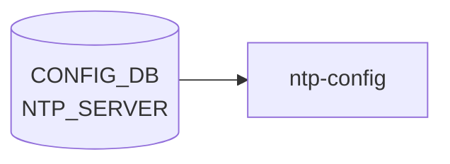

# NTP_SERVER テーブル

## 概要

上流 NTP サーバまたは pool を保持する[^1]。`hostcfgd` の `NtpHandler` が `/etc/chrony/chrony.conf`（または `ntp.conf`）を再生成し、サービスを再起動する。`max-elements 10` でサーバ数上限がある。`NTP_KEY` で対称鍵を、`NTP|global` で client 全体設定を保持する。

<!-- cdb-mermaid -->
### データフロー (自動生成)



!!! note "凡例"
    CONFIG_DB から SAI までの典型経路を `docs/reference/config-db-orch-map.md` から機械生成したミニ図。詳細・例外は本ページ本文と対応表を参照。
<!-- /cdb-mermaid -->

## key 構造

```text
NTP_SERVER|<server_address>
```

`<server_address>` は IP address または DNS hostname。

## フィールド一覧

| フィールド | 型 | 必須 | デフォルト | 説明 |
|-----------|----|------|-----------|------|
| `server_address` (key) | `inet:host` | ✅ | - | サーバアドレス |
| `association_type` | enum `server`/`pool` | - | `server` | server 単体 / pool 群 |
| `iburst` | `on-off` | - | `on` | iburst aggressive polling |
| `key` | leafref `NTP_KEY.id` | - | - | 認証鍵 ID |
| `resolve_as` | `inet:host` | - | - | 名前解決された IP |
| `admin_state` | `admin_mode` | - | `enabled` | サーバの有効化 |
| `trusted` | `yes-no` | - | `no` | 認証時にこのサーバのみで時刻同期する |
| `version` | uint8 (3..4) | - | `4` | NTP プロトコルバージョン |

<!-- defaults -->
**コード由来のデフォルト** (YANG `default` 句とは別経路で、`chrony.conf.j2` テンプレート/`minigraph.py`/`hostcfgd` 側が決定する暫定値):

- `association_type`: テンプレート `` により DB キー不在時は `server` ディレクティブとして書き込まれる (`sonic-buildimage/files/image_config/chrony/chrony.conf.j2:26`)。YANG `default server` と同値だが Jinja2 側でも独立してフォールバックを担保。
- `resolve_as`: テンプレート `` で DB キー不在時はループ変数 `server` (= NTP_SERVER テーブル key = ユーザが入力したサーバアドレス) をそのまま採用 (`chrony.conf.j2:27`)。さらに `association_type == 'pool'` の場合は `resolve_as` の値に関わらず `resolve_as = server` で上書きされ、pool は常に FQDN のまま使われる (`chrony.conf.j2:49-51`)。
- `iburst`: テンプレートは `` で **truthy 判定のみ**を行い `| d(...)` を持たない (`chrony.conf.j2:37-39`)。DB キー不在なら `iburst` オプション付与なし。一方 `'on'` でも `'off'` でも文字列非空であれば `iburst` が付与されるテンプレート上の癖がある。実運用では minigraph.py が起動時に `iburst: 'on'` を一斉投入し (`sonic-buildimage/src/sonic-config-engine/minigraph.py:2646`)、YANG `default on` も合わさるため、実害は出にくい。
- `minpoll` / `maxpoll`: **CONFIG_DB モデル未実装**。`chrony.conf.j2` にも `sonic-ntp.yang` `NTP_SERVER_LIST` にも該当 leaf が存在せず、chrony 側のデフォルト (`minpoll 6 / maxpoll 10` ≒ 64〜1024 秒) がそのまま使われる。SONiC からは制御不可。
- `version`: テンプレートは `` で truthy 判定のみ。DB キー不在なら `version` オプション付与なし → chrony 側のデフォルト (NTPv4)。YANG `default 4` で DB 投入時には 4 が埋まる前提。
- `admin_state`: テンプレートは `for server in NTP_SERVER if NTP_SERVER[server].admin_state != 'disabled'` (`chrony.conf.j2:20`)。DB キー不在なら `!= 'disabled'` が真と評価され、エントリは chrony.conf に含まれる (= 有効扱い)。YANG `default enabled` と同等の運用効果。
- `key`: テンプレートは `global.authentication == 'enabled'` かつ `config.key` が truthy の場合のみ `key <id>` を付与 (`chrony.conf.j2:30-34`)。DB に `key` があっても NTP 認証が disabled なら chrony.conf には書かれない。

派生メモ全体は [`meta/_intermediate/cdb-flow/ntp-server-defaults.md`](https://github.com/aoki-taquan/sonic-unofficial-docs/blob/main/meta/_intermediate/cdb-flow/ntp-server-defaults.md) を参照。
<!-- /defaults -->

<!-- ordering -->
## 書込み順依存 (Phase B)

> **調査根拠**: `sonic-ntp.yang` L195–236、`hostcfgd` L1366–1406、`chrony.conf.j2` L20–55、`minigraph.py` L2646 精読 (2026-05-18)
> 詳細証跡: `meta/_intermediate/cdb-flow/ntp-server-ordering.md`

### NTP_KEY 先行必須 — key leafref

`sonic-ntp.yang` L199-203 の `leaf key` は `NTP_KEY_LIST/id` への leafref として定義される。`NTP_SERVER|<server>.key=<id>` を書き込む前に `NTP_KEY|<id>` が存在しなければ、YANG leafref バリデーションが SET を拒否する。

正しい順序: `NTP_KEY|<id>` SET → `NTP_SERVER|<server>.key=<id>` SET。

DEL の逆順序: `NTP_SERVER|<server>.key` フィールドをクリア（または `NTP_SERVER|<server>` DEL）→ `NTP_KEY|<id>` DEL。参照を残したまま `NTP_KEY` を先に DEL すると leafref dangling になり DEL が失敗する。

### NTP_KEY 登録 → authentication=enabled の順序推奨

`chrony.conf.j2` L124-131 は `NTP.global.authentication == 'enabled'` の場合のみ `keyfile /etc/chrony/chrony.keys` を chrony.conf に書き込む。`NTP_KEY` 未登録のまま `NTP|global.authentication=enabled` に設定すると、chrony.keys が空のまま chrony が再起動し認証が機能しない（NTP サーバへの接続を試みるが鍵照合で失敗する）。

推奨順序: `NTP_KEY|<id>` SET → `NTP|global.authentication=enabled` SET。

### NTP_SERVER と NTP_KEY の合算 chrony 再起動

`hostcfgd` L2387-2391 の `ntp_srv_key_handler` は `NTP_SERVER` または `NTP_KEY` のいずれかが変更されると、**両テーブルの全件を同時に取得**して chrony を再起動する。`NTP_KEY` のみ変更した場合でも chrony が再起動されるため、認証鍵の追加・削除は一時的な NTP 断を伴う。

### ブート時の書込みシーケンス

minigraph.py L2646 が `NTP_SERVER` エントリ全台に `{iburst: 'on'}` を一括投入する。その後 `hostcfgd.load()` がスナップショットを取得するが `load()` は chrony を再起動しない（ブート時は chrony の起動設定ファイルから読まれる）。ブート後の最初の CONFIG_DB 変更イベントで初めて chrony restart が発火する。

### YANG max-elements=10 による書込み上限

YANG `max-elements 10` により `NTP_SERVER` エントリは最大 10 件に制限される。11 件目の SET は YANG バリデーションで拒否される（エラーメッセージ: `"Failed NTP version"` ではなく max-elements 制約違反）。エントリ削除後は再び SET 可能。

### 順序依存サマリ

| # | 依存関係 | 強制度 | 違反時の挙動 |
|---|----------|--------|------------|
| 1 | `NTP_KEY\|<id>` SET 先行 → `NTP_SERVER\|<server>.key=<id>` SET | **必須** | YANG leafref 拒否（SET 失敗） |
| 2 | `NTP_SERVER\|<server>.key` クリア 先行 → `NTP_KEY\|<id>` DEL | **必須** | YANG leafref dangling（DEL 失敗） |
| 3 | `NTP_KEY` 登録 先行 → `NTP\|global.authentication=enabled` | 推奨 | chrony 認証失敗（鍵なし起動） |
| 4 | `NTP_SERVER` エントリ数 ≤ 10 | **必須** | YANG max-elements 拒否（SET 失敗） |

<!-- /ordering -->

<!-- cross-refs -->
## 暗黙参照テーブル (Phase C)

`NTP_SERVER` エントリを処理する `hostcfgd` の `ntp_srv_key_handler` と `chrony.conf.j2` テンプレートは、`NTP_SERVER` 以外の以下の CONFIG_DB テーブルを暗黙的に参照する。

| 参照先テーブル | 参照フィールド | 参照タイミング | 用途 | evidence |
|---|---|---|---|---|
| [`NTP_KEY`](ntp-key.md) | `id` (leafref 先) | YANG SET バリデーション時 | `NTP_SERVER.key` の leafref ターゲット。`NTP_KEY\|<id>` 未存在時は SET 拒否 | `sonic-ntp.yang:199-203` |
| `NTP` (global) | `authentication` | `chrony.conf.j2` テンプレート生成時 | `authentication == 'enabled'` のときのみ `key <id>` オプションを `chrony.conf` に生成。disabled なら `NTP_SERVER.key` は参照されても無効 | `chrony.conf.j2:30-34` |
| `NTP` (global) | `src_intf` | `hostcfgd` `handle_ntp_source_intf_chg` / `chrony.conf.j2` 生成時 | `src_intf` に指定したインタフェース IP を `bindacqaddress` ディレクティブに変換。`NTP_SERVER` が空の間は `src_intf` 変更イベントが no-op | `hostcfgd:1315-1316`; `chrony.conf.j2:87-107` |
| `MGMT_INTERFACE` | (key, prefix) | `chrony.conf.j2` テンプレート生成時 | `src_intf == 'eth0'` のとき `bindacqaddress` 用 IPv4/IPv6 アドレスを解決 | `chrony.conf.j2:91-92` |
| `INTERFACE` / `LOOPBACK_INTERFACE` / `PORTCHANNEL_INTERFACE` / `VLAN_INTERFACE` | (key, prefix) | `chrony.conf.j2` テンプレート生成時 | `src_intf` が `Ethernet*` / `Loopback*` / `PortChannel*` / `Vlan*` のとき対応テーブルから IP を解決 | `chrony.conf.j2:93-107` |
| `DEVICE_METADATA` | `localhost.subtype` / `localhost.type` | `chrony.conf.j2` テンプレート生成時 | SmartSwitch 判定。`subtype=SmartSwitch` かつ `type!=SmartSwitchDPU` のとき `NTP.server_role` / `NTP.dhcp` を参照して `allow` + `binddevice bridge-midplane` を追加 | `chrony.conf.j2:57-63` |
| `MGMT_VRF_CONFIG` | `vrf_global.mgmtVrfEnabled` | chrony サービス起動時 (`chronyd-starter.sh`) | `"true"` なら `NTP.vrf` に応じて mgmt VRF または default VRF で起動。NTP_SERVER の変更で chrony が再起動されるたびに間接的に参照される | `chronyd-starter.sh:3-16` |

!!! note "NTP_SERVER の変更は常に全テーブルを合算処理"
    `hostcfgd` の `ntp_srv_key_handler` は `NTP_SERVER` 変更時に `NTP_KEY` テーブル全体も同時に取得して chrony を再起動する。このため `NTP_SERVER` 単独の変更であっても `NTP_KEY` の現在値が `chrony.conf` / `chrony.keys` の生成に反映される。

<!-- /cross-refs -->

<!-- failure -->
## 失敗挙動 (Phase D)

> 詳細証跡: `meta/_intermediate/cdb-flow/ntp-server-failure.md`

### hostcfgd ntp_srv_key_update の失敗経路

`NTP_SERVER` の変更は `ntp_srv_key_handler` → `ntp_srv_key_update` 経由で処理される。

| 失敗条件 | 検出箇所 | 結果 | evidence |
|---|---|---|---|
| `systemctl restart chrony` 失敗 | `hostcfgd:1397-1402` | `LOG_ERR: "NtpCfg: Failed to restart chrony service"` → `return`（キャッシュ更新なし） | `hostcfgd:1399-1402` |
| サーバ・鍵ともに前回キャッシュと同一値 | `hostcfgd:1383-1386` | `LOG_NOTICE: "NtpCfg: Nothing to update"` → `return`（no-op、正常扱い） | `hostcfgd:1383-1386` |

#### キャッシュ更新省略による再処理保証

`ntp_srv_key_update` は `systemctl restart chrony` 失敗時にキャッシュ (`self.cache['servers']` / `self.cache['keys']`) を更新しない（`run_cmd` 失敗時に `return` し `self.cache['servers'] = ntp_servers` の行 `hostcfgd:1403` に到達しない）。<!-- evidence: hostcfgd:1397-1403 -->

これにより次回の `NTP_SERVER` / `NTP_KEY` 変更イベント時にキャッシュ差分が残るため、再処理が保証される（意図的な再試行設計）。`ntp_global_update` の失敗時とは異なり、キャッシュ不整合が「再試行保証」として機能する点が特徴的。

### chrony.conf.j2 テンプレートの NTP_SERVER 固有失敗経路

| 失敗条件 | 結果 | evidence |
|---|---|---|
| `admin_state == 'disabled'` | そのサーバを生成ループから除外（サイレント除去） | `chrony.conf.j2:20` |
| `config.iburst == 'off'`（文字列、非空） | Jinja2 truthy 判定で `iburst` オプションが付与される（`iburst=off` が無効化されない潜在バグ） | `chrony.conf.j2:37` |
| `NTP.authentication != 'enabled'` かつ `NTP_SERVER.key` 設定済み | `key <id>` オプションが生成されない（サイレントドロップ） | `chrony.conf.j2:30-34` |
| `trusted == 'yes'` かつ `resolve_as` 未設定 | `trusted_str` に追加されない（サイレントドロップ） | `chrony.keys.j2:8-10` |
| `association_type == 'pool'` かつ `resolve_as` にカスタム値を設定 | `resolve_as = server`（テーブル key のアドレス）に強制上書き | `chrony.conf.j2:49-51` |

### 失敗の可観測性

`NTP_SERVER` 処理は CONFIG_DB → テンプレート → `systemctl restart chrony` で完結し、**STATE_DB / APPL_DB への書き込みは一切行われない**。失敗検知は以下のみ:

- `journalctl -u chrony` — chrony サービスの起動失敗ログ
- `/var/log/syslog` の `NtpCfg: Failed to restart chrony service` — hostcfgd の LOG_ERR
- `chronyc sources` / `chronyc tracking` — 実際の同期状態確認

<!-- /failure -->

<!-- constants -->
## ハードコード定数 (Phase E)

<!-- evidence: sonic-buildimage/src/sonic-yang-models/yang-models/sonic-ntp.yang (L174,L189,L195,L213,L219,L227-231),
     sonic-buildimage/files/image_config/chrony/chrony.conf.j2 (L26-27,L127,L132,L135,L141,L144,L156,L159),
     sonic-host-services/scripts/caclmgrd (L95-100),
     sonic-host-services/scripts/hostcfgd (L1280),
     sonic-buildimage/src/sonic-config-engine/minigraph.py (L2646) -->

`NTP_SERVER` テーブルの処理に関わるハードコード定数の一覧。これらは CONFIG_DB・YANG 設定では変更できない値であり、コードまたはテンプレートに直接埋め込まれている。

### YANG 由来の定数（sonic-ntp.yang）

| 定数 / フィールド | 値 | 定義箇所 | 備考 |
|-----------------|-----|---------|------|
| `NTP_SERVER_LIST` 最大エントリ数 | **10** | `sonic-ntp.yang:174` (`max-elements 10`) | 11 件目以降は YANG バリデーションで拒否 |
| `association_type` YANG default | **`server`** | `sonic-ntp.yang:189` | `server` / `pool` の 2 値 enum |
| `iburst` YANG default | **`on`** | `sonic-ntp.yang:195` | `on` / `off` の 2 値 enum |
| `admin_state` YANG default | **`enabled`** | `sonic-ntp.yang:213` | `enabled` / `disabled` の admin_mode |
| `trusted` YANG default | **`no`** | `sonic-ntp.yang:219` | `yes` / `no` の yes-no |
| `version` YANG default | **4** | `sonic-ntp.yang:231` | 許容範囲 `3..4`（NTPv3 / v4 のみ） |
| `version` 範囲制約 | **3〜4** | `sonic-ntp.yang:227-228` (`range "3..4"`, `error-message "Failed NTP version"`) | NTPv1・v2 は明示禁止 |

### chrony.conf.j2 テンプレートの Jinja2 フォールバック定数

| フォールバック | 値 | 定義箇所 | 条件 |
|---|---|---|---|
| `association_type` テンプレート fallback | **`'server'`** | `chrony.conf.j2:26` (`config.association_type \| d('server')`) | DB にキーなし時 |
| `resolve_as` テンプレート fallback | **`server`**（テーブル key のサーバアドレス） | `chrony.conf.j2:27` (`config.resolve_as \| d(server)`) | DB にキーなし時 |
| `association_type == 'pool'` 時の `resolve_as` 強制上書き | **`server`**（テーブル key） | `chrony.conf.j2:49-51` | pool タイプでは resolve_as カスタム値を無視 |

!!! warning "iburst のテンプレート判定バグ"
    `chrony.conf.j2:37` の `` は truthy 判定のみを行う。`iburst = 'off'`（非空文字列）でも iburst オプションが付与される。`iburst = 'on'` と `iburst = 'off'` の区別は YANG enum 制約が担うが、テンプレート側では `'off'` が有効として扱われる。

### chrony.conf.j2 ハードコードされたファイルパスと数値定数

| 定数 | 値 | 定義箇所 | 用途 |
|------|-----|---------|------|
| driftfile パス | **`/var/lib/chrony/chrony.drift`** | `chrony.conf.j2:132` | クロック周波数誤差を記録するファイル |
| ntsdumpdir パス | **`/var/lib/chrony`** | `chrony.conf.j2:135` | NTS キー・クッキー保存ディレクトリ |
| logdir パス | **`/var/log/chrony`** | `chrony.conf.j2:141` | chrony ログ出力ディレクトリ |
| `maxupdateskew` | **100.0** | `chrony.conf.j2:144` | クロック更新の最大スキュー（ppm）。これを超える更新は適用されない |
| rtcfile パス | **`/var/lib/chrony/rtc`** | `chrony.conf.j2:156` | RTC（ハードウェア時計）誤差ファイル |
| hwclockfile パス | **`/etc/adjtime`** | `chrony.conf.j2:157` | hwclock 補正ファイル |
| `rtcautotrim` | **15** | `chrony.conf.j2:159` | RTC 自動トリム間隔（秒） |
| leapsectz | **`right/UTC`** | `chrony.conf.j2:170` | TAI-UTC オフセット・閏秒データソース |
| keyfile パス | **`/etc/chrony/chrony.keys`** | `chrony.conf.j2:127` | NTP 認証鍵ファイル。`authentication=enabled` 時のみ `chrony.conf` に生成 |
| confdir | **`/etc/chrony/conf.d`** | `chrony.conf.j2:10` | 追加設定ファイルインクルードディレクトリ |
| sourcedir (dhcp) | **`/run/chrony-dhcp`** | `chrony.conf.j2:119` | DHCP 経由の NTP ソースディレクトリ |
| sourcedir (static) | **`/etc/chrony/sources.d`** | `chrony.conf.j2:122` | 静的 NTP ソース定義ディレクトリ |

### NTP UDP ポート定数（caclmgrd）

| 定数 | 値 | 定義箇所 | 用途 |
|------|-----|---------|------|
| NTP サービスポート | **UDP 123** | `caclmgrd:98` (`"dst_ports": ["123"]`) | iptables ACL ルール生成の宛先ポート。CONFIG_DB から変更不可 |
| プロトコル | **`udp`** | `caclmgrd:97` | NTP パケットフィルタのプロトコル固定値 |
| `multi_asic_ns_to_host_fwd` | **`False`** | `caclmgrd:99` | multi-ASIC 環境での名前空間→ホスト転送なし |

### hostcfgd のコマンド定数

| 定数 | 値 | 定義箇所 | 用途 |
|------|-----|---------|------|
| `CHRONY_RESTART` | **`['systemctl', 'restart', 'chrony']`** | `hostcfgd:1280` | `NTP_SERVER` / `NTP_KEY` 変更時に実行するコマンド。変更不可 |

### minigraph.py によるブート時注入定数

| 定数 | 値 | 定義箇所 | 用途 |
|------|-----|---------|------|
| iburst ブート時注入値 | **`'on'`** | `minigraph.py:2646` | minigraph から生成される全 `NTP_SERVER` エントリに `iburst: 'on'` を一律設定 |

### CONFIG_DB で制御不可能な chrony パラメータ

| パラメータ | chrony 内部デフォルト | 備考 |
|-----------|---------------------|------|
| `minpoll` | **6**（= 64 秒間隔） | YANG / CONFIG_DB にフィールドなし。chrony デフォルト値が使用される |
| `maxpoll` | **10**（= 1024 秒間隔） | 同上。SONiC からは制御不可 |

<!-- /constants -->

<!-- side-effects -->
## 副次 DB 書込 (Phase F)

`NTP_SERVER` テーブルの変更を受けた `hostcfgd` の `NtpCfg` ハンドラは、**CONFIG_DB 以外のいかなる DB にも書き込みを行わない**。副作用はすべてホスト OS ファイルシステムの変更とサービス再起動に閉じる。

### DB 書込み有無

| DB | 書込有無 | 根拠 |
|---|---|---|
| APPL_DB | **なし** | `NtpCfg.ntp_srv_key_update()` に ProducerTable / Table.set() 呼び出しが 0 件 (`hostcfgd:1366-1406`) |
| STATE_DB | **なし** | `NtpCfg` クラスは `state_db_conn` を保持せず STATE_DB に一切アクセスしない (`hostcfgd:1272-1407`) |
| COUNTERS_DB | **なし** | NTP はデータプレーン統計を持たない。`hostcfgd` 全体に COUNTERS_DB 書き込みなし |
| ASIC_DB | **なし** | SAI 非経由。NTP は CPU 側でのみ処理され、ASIC プログラムは発生しない |
| FLEX_COUNTER_DB | **なし** | FlexCounter 不使用 |

### ホスト OS への副次作用

| 副次作用 | トリガー | 対象 | 証拠 |
|---|---|---|---|
| `chrony.conf.j2` テンプレート再生成 | `NTP_SERVER` SET / DEL | `/etc/chrony/chrony.conf` — サーバエントリの追加・削除 | `hostcfgd:1397-1398; chrony.conf.j2` |
| `chrony.keys.j2` テンプレート再生成 | `NTP_KEY` が同時に取得される（NTP_SERVER 変更のたびに全 NTP_KEY も合算処理） | `/etc/chrony/chrony.keys` — 認証鍵エントリの更新 | `hostcfgd:1398; chrony.keys.j2` |
| `systemctl restart chrony` 実行 | `NTP_SERVER` が前回キャッシュと差分あり | `chrony` デーモン再起動 → NTP 同期一時中断 | `hostcfgd:1280,1398` |
| iptables / ip6tables ルール更新 | **NTP_SERVER 変更では発火しない** — `caclmgrd` は `FEATURE` テーブルと `MGMT_INTERFACE` を購読するが `NTP_SERVER` を直接監視しない | — | `caclmgrd:96-100,281,1166` |

!!! warning "NTP_SERVER 変更 = 一時的な NTP 同期断"
    `NTP_SERVER` テーブルへのいかなる変更（サーバ追加・削除・フィールド更新）も `systemctl restart chrony` をトリガーする。再起動中は NTP 同期が中断し、chrony が新しいサーバへの時刻問い合わせを再開するまで数十秒〜数分の空白が生じる。ピーク時間帯の変更は避けることを推奨。

### キャッシュ更新の副次的性質

`ntp_srv_key_update()` は `systemctl restart chrony` が成功した場合のみ `self.cache['servers']` / `self.cache['keys']` を更新する (`hostcfgd:1404-1406`)。chrony 再起動失敗時はキャッシュが古い状態のままとなり、次回の `NTP_SERVER` / `NTP_KEY` 変更イベントで差分が残るため自動再処理が保証される設計となっている。

> **コード証跡**: `hostcfgd:1272-1407` (`NtpCfg` クラス全体)、`caclmgrd:96-100` (NTP ACL サービス定義)。全行精読で STATE_DB / APPL_DB / COUNTERS_DB への書き込みが 0 件であることを確認。

<!-- /side-effects -->

## 関連サブテーブル

- `NTP|global` (container, single-instance):
    - `src_intf` (leaf-list): 送信元 IF（PORT / PORTCHANNEL / LOOPBACK / MGMT_PORT / `eth0` の union）
    - `vrf` (`mgmt`/`default`): NTP を有効化する VRF。`mgmt` 指定には `MGMT_VRF_CONFIG.mgmtVrfEnabled = true` 必須 (`must`)
    - `authentication` (`admin_mode`、default `disabled`)
    - `dhcp` (`admin_mode`、default `enabled`)
    - `server_role` (`admin_mode`、default `enabled`)
    - `admin_state` (`admin_mode`、default `enabled`)
- `NTP_KEY|<id>` (key: id, 1..65535):
    - `trusted` (yes-no, default `no`)
    - `value` (string 1..64, encrypted)
    - `type` (enum md5/sha1/sha256/sha384/sha512, default md5)

## 購読者

- `hostcfgd` `NtpHandler`: chrony / ntp 設定の更新

## 関連 CONFIG_DB / YANG / CLI

- 関連 [CONFIG_DB](../../reference/glossary.md#term-config_db): `NTP`、`NTP_KEY`、`VRF`、`MGMT_VRF_CONFIG`、`PORT`、`LOOPBACK_INTERFACE`、`MGMT_PORT`
- 関連 CLI: `config ntp add/del`
- 関連 [YANG](../../reference/glossary.md#term-yang): `sonic-ntp`

<!-- ref-triangle:start -->

## 関連リファレンス

- [YANG](../../reference/glossary.md#term-yang): [`sonic-ntp`](../yang/sonic-ntp.md)
- CLI: [`config ntp`](../cli/config-ntp.md)

<!-- ref-triangle:end -->

## 引用元

[^1]: [YANG](../../reference/glossary.md#term-yang) 定義: `sonic-ntp.yang`. <https://github.com/sonic-net/sonic-buildimage/blob/9ea932ec2e18f35e58268ec2e4456b1d4afd65cd/src/sonic-yang-models/yang-models/sonic-ntp.yang>

<!-- topics-back-ref -->
## 関連 Topics

- [Topics: NAT / DHCP Relay / Time-DNS Services](../../topics/16-nat-dhcp-dns/index.md)

<!-- /topics-back-ref -->

<!-- ops-hint -->
## 運用ヒント

### 典型値

- key 形式: `NTP_SERVER|<ip-or-hostname>`。
- `iburst`: `on`（初期同期高速化）。
- `association_type`: `server`。

### よくある誤設定

- 1 つだけサーバ登録すると障害時に時刻が drift。3 つ以上推奨。

### 確認コマンド

```bash
sonic-db-cli CONFIG_DB keys 'NTP_SERVER|*'
show ntp
chronyc sources
```
<!-- /ops-hint -->

<!-- cdb-exceptions -->
## 例外条件・特殊挙動

<!-- evidence: sonic-buildimage/src/sonic-yang-models/yang-models/sonic-ntp.yang NTP_SERVER container -->

- **NTP_SERVER エントリは最大 10 件 → YANG が制限**: `max-elements 10`。11 件目以降は YANG バリデーションで拒否される。
- **server_address が不正形式 → YANG が拒否**: `type inet:host`。ホスト名または IP アドレス (IPv4/IPv6) のみ許可。
- **version が 3-4 以外 → YANG が拒否 (デフォルト 4)**: `range "3..4"` / `error-message "Failed NTP version"` / `default 4`。NTPv1・v2 は明示的に禁止されている。
- **association_type のデフォルト = "server"**: `default server`。NTP プール (pool) を使用する場合は明示的に `association_type = pool` を設定する必要がある。
- **iburst のデフォルト = "on"**: `default on`。起動直後に iburst パケットを送信して同期を高速化。無効化は明示的に `iburst = off` を設定する。
- **key が存在しない ID を参照 → YANG leafref 違反**: `leaf key` は `leafref` で `NTP_KEY_LIST/id` を参照。存在しない key ID を指定すると YANG バリデーションで拒否される。
- **admin_state のデフォルト = "enabled"**: `default enabled`。フィールドを省略してもサーバは有効として ntpd/chrony に渡される。
- **trusted のデフォルト = "no"**: `default no`。NTP 認証有効時にこのサーバのみを信頼する場合は `trusted = yes` を設定する。

<!-- value-behavior -->
## 値依存挙動マトリクス

<!-- evidence: sonic-host-services/scripts/hostcfgd ntp_srv_key_update() / sonic-buildimage/src/sonic-yang-models/yang-models/sonic-ntp.yang -->

| フィールド | 値 | 挙動 |
|-----------|-----|------|
| `association_type` | `server` (default) | chrony.conf に `server <addr>` として追記 |
| `association_type` | `pool` | chrony.conf に `pool <addr>` として追記。DNS ラウンドロビンで複数 IP を使用 |
| `iburst` | `on` (default) | 起動直後に iburst パケットを送信して高速同期 |
| `iburst` | `off` | 通常ポーリング間隔で同期開始 |
| `admin_state` | `enabled` (default) | サーバを chrony.conf に含める |
| `admin_state` | `disabled` | サーバを chrony.conf から除外 |
| `trusted` | `no` (default) | chrony で通常の優先度 |
| `trusted` | `yes` | chrony の `prefer` オプション相当。当該サーバを優先同期先に |
| `version` | `4` (default) | NTPv4 を使用 |
| `version` | `3` | NTPv3 を使用。古い NTP サーバとの互換向け |
| `key` | NTP_KEY.id 参照 | chrony.conf に `key <id>` オプションを付与。`NTP.authentication=enabled` と組み合わせて認証 |
| エントリ数 | 11件目以上 | YANG max-elements=10 でバリデーション拒否 |

enum: `association_type`=server/pool、`iburst`=on/off、`admin_state`=enabled/disabled、`trusted`=yes/no。変更は `systemctl restart chrony` をトリガー。
<!-- /value-behavior -->


<!-- runtime-trace -->
## CDB → 実コンテナ動作トレース

### 段階 1: Consumer 登録

- **hostcfgd**: `NTP_SERVER` テーブルを `ConfigDBConnector` で購読。

### 段階 2: CFG → APPL 翻訳

- hostcfgd の `ntpHandler` が `ntp.conf` の `server` ディレクティブを更新し ntpd 再起動。
- APP_DB への書き込みなし。

### 段階 3: APPL → SAI

- SAI 経由なし。ntpd が指定サーバへ UDP 123 番で到達可能であることが前提。

### 段階 4: タイミング + 副作用

- サーバ変更後 ntpd 再起動まで数秒。新サーバとの初期同期に数分かかる場合あり。
- 副作用: mgmt VRF を使用する場合は `ip vrf exec mgmt ntpq` で状態確認が必要。

<!-- /runtime-trace -->
<!-- entry-points -->
## 書き込み入り口 (Direction A)

NTP_SERVER テーブルへの書き込みが発生するコード経路を網羅的に調査した結果。

### CLI

  - `config ntp add/del <ip>` — `config/main.py` が `set_entry('NTP_SERVER', ntp_ip_address, ...)` を呼ぶ (sonic-utilities/config/main.py:9008, 9027)

### minigraph / sonic-cfggen

**minigraph.py** が `results['NTP_SERVER']` に iburst=on でサーバ一覧を投入 (sonic-buildimage/src/sonic-config-engine/minigraph.py:2646)

### REST / gNMI

REST/gNMI 書き込み経路なし

### db_migrator

db_migrator.py での NTP_SERVER マイグレーションなし

### ビルド時デフォルト (build-time default)

なし

### ハードコードデフォルト / ランタイム注入

なし

### 死活・デッドコード

なし
<!-- /entry-points -->

<!-- glossary-links-injected: b5626ca1f0f9 -->

<!-- derivation -->
## 派生・条件付き登録 (Phase 6/7)

### Phase 6: 自動派生

| 派生先フィールド | 派生元条件 | 派生値 | ソース |
|---|---|---|---|
| `NTP_SERVER` エントリ全体 | minigraph.py が XML `NtpServers` ノードを解析したとき | `{<server_ip>: {'iburst': 'on'}}` | `sonic-buildimage/src/sonic-config-engine/minigraph.py:2646` |
| `iburst` | minigraph.py 固定値 | `"on"` (常時) | `minigraph.py:2646` |

minigraph.py は NTP サーバ全台に対して `iburst: on` を自動設定する。init_cfg.json.j2 の `NTP` セクション (グローバル設定) は別テーブル。

### Phase 7: 条件付き登録

`NTP_SERVER` は orchagent では処理されない。`hostcfgd` が `NTP_SERVER` を購読し ntp.conf を再生成する (`hostcfgd:1308`)。条件付き platform 登録なし。YANG `max-elements 10` により 11 件目以降は拒否。

### グレップカバレッジ

| 項目 | hit 数 | 証跡 |
|---|---|---|
| minigraph.py NTP_SERVER 自動設定 | 1 | `minigraph.py:2646` |
| hostcfgd ntp_server_conf | 1 | `hostcfgd:1286,1308` |

<!-- /derivation -->

<!-- handler-branching -->
### Phase 8: Handler メソッド内分岐

`hostcfgd` の NTP_SERVER 処理分岐:

| Handler | メソッド | 分岐条件 | 効果 | evidence |
|---|---|---|---|---|
| `hostcfgd` | `ntp_srv_key_update()` | `ntp_servers` が前回キャッシュと同一 | ntp.conf 再生成スキップ | `hostcfgd:1383-1384` |
| YANG validation | — | `max-elements 10` 超過 | YANG 制約で 11 件目以降を拒否 | `sonic-ntp.yang max-elements 10` |
| YANG validation | — | `version` が 3/4 以外 | YANG `range 3..4` 制約で拒否 | `sonic-ntp.yang` |
| `hostcfgd` | `ntp_srv_key_update()` | `iburst == "on"` | ntp.conf サーバエントリに `iburst` オプションを追加 | `hostcfgd` NTP テンプレート |

> **スキャン証跡**: `minigraph.py:2646` + `hostcfgd:1285-1389` を確認、4 件分岐抽出。iburst のデフォルト on が minigraph から自動付与されることを確認 — 誤読なし。

<!-- /handler-branching -->
