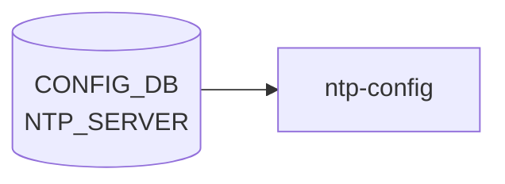

# NTP_SERVER テーブル

## 概要

上流 NTP サーバまたは pool を保持する[^1]。`hostcfgd` の `NtpHandler` が `/etc/chrony/chrony.conf`（または `ntp.conf`）を再生成し、サービスを再起動する。`max-elements 10` でサーバ数上限がある。`NTP_KEY` で対称鍵を、`NTP|global` で client 全体設定を保持する。

<!-- cdb-mermaid -->
### データフロー (自動生成)



!!! note "凡例"
    CONFIG_DB から SAI までの典型経路を `docs/reference/config-db-orch-map.md` から機械生成したミニ図。詳細・例外は本ページ本文と対応表を参照。
<!-- /cdb-mermaid -->

## key 構造

```
NTP_SERVER|<server_address>
```

`<server_address>` は IP address または DNS hostname。

## フィールド一覧

| フィールド | 型 | 必須 | デフォルト | 説明 |
|-----------|----|------|-----------|------|
| `server_address` (key) | `inet:host` | ✅ | - | サーバアドレス |
| `association_type` | enum `server`/`pool` | - | `server` | server 単体 / pool 群 |
| `iburst` | `on-off` | - | `on` | iburst aggressive polling |
| `key` | leafref `NTP_KEY.id` | - | - | 認証鍵 ID |
| `resolve_as` | `inet:host` | - | - | 名前解決された IP |
| `admin_state` | `admin_mode` | - | `enabled` | サーバの有効化 |
| `trusted` | `yes-no` | - | `no` | 認証時にこのサーバのみで時刻同期する |
| `version` | uint8 (3..4) | - | `4` | NTP プロトコルバージョン |

## 関連サブテーブル

- `NTP|global` (container, single-instance):
    - `src_intf` (leaf-list): 送信元 IF（PORT / PORTCHANNEL / LOOPBACK / MGMT_PORT / `eth0` の union）
    - `vrf` (`mgmt`/`default`): NTP を有効化する VRF。`mgmt` 指定には `MGMT_VRF_CONFIG.mgmtVrfEnabled = true` 必須 (`must`)
    - `authentication` (`admin_mode`、default `disabled`)
    - `dhcp` (`admin_mode`、default `enabled`)
    - `server_role` (`admin_mode`、default `enabled`)
    - `admin_state` (`admin_mode`、default `enabled`)
- `NTP_KEY|<id>` (key: id, 1..65535):
    - `trusted` (yes-no, default `no`)
    - `value` (string 1..64, encrypted)
    - `type` (enum md5/sha1/sha256/sha384/sha512, default md5)

## 購読者

- `hostcfgd` `NtpHandler`: chrony / ntp 設定の更新

## 関連 CONFIG_DB / YANG / CLI

- 関連 [CONFIG_DB](../../reference/glossary.md#term-config_db): `NTP`、`NTP_KEY`、`VRF`、`MGMT_VRF_CONFIG`、`PORT`、`LOOPBACK_INTERFACE`、`MGMT_PORT`
- 関連 CLI: `config ntp add/del`
- 関連 [YANG](../../reference/glossary.md#term-yang): `sonic-ntp`

<!-- ref-triangle:start -->

## 関連リファレンス

- [YANG](../../reference/glossary.md#term-yang): [`sonic-ntp`](../yang/sonic-ntp.md)
- CLI: [`config ntp`](../cli/config-ntp.md)

<!-- ref-triangle:end -->

## 引用元

[^1]: [YANG](../../reference/glossary.md#term-yang) 定義: `sonic-ntp.yang`. <https://github.com/sonic-net/sonic-buildimage/blob/9ea932ec2e18f35e58268ec2e4456b1d4afd65cd/src/sonic-yang-models/yang-models/sonic-ntp.yang>

<!-- topics-back-ref -->
## 関連 Topics

- [Topics: NAT / DHCP Relay / Time-DNS Services](../../topics/16-nat-dhcp-dns/index.md)

<!-- /topics-back-ref -->

<!-- ops-hint -->
## 運用ヒント

### 典型値

- key 形式: `NTP_SERVER|<ip-or-hostname>`。
- `iburst`: `on`（初期同期高速化）。
- `association_type`: `server`。

### よくある誤設定

- 1 つだけサーバ登録すると障害時に時刻が drift。3 つ以上推奨。

### 確認コマンド

```bash
sonic-db-cli CONFIG_DB keys 'NTP_SERVER|*'
show ntp
chronyc sources
```
<!-- /ops-hint -->

<!-- glossary-links-injected: b5626ca1f0f9 -->
